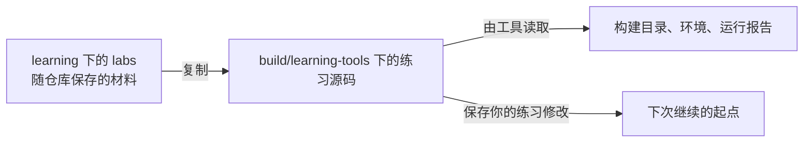

<!-- SPDX-FileCopyrightText: Copyright The zephyr_hc32f4a0 Contributors -->
<!-- SPDX-License-Identifier: Apache-2.0 -->

# 0. 实验基线与命令约定

这套教材面向已经写过 C/C++、做过嵌入式工程，却没有系统接触 Python 环境、west 和这套构建配置工具的读者。我们不重讲循环和函数，补的是工具为什么存在、状态放在哪里，以及怎样亲手验证自己的理解。

每个单元在正文内完成它自己的实验，源码和配置也在需要时展示。labs 目录保存同一份材料原件，方便复制、对照；不是要求先做完的一门隐藏课程。后章可以使用前章已经创建的产物，但会写清起点。按顺序读，就不需要在几份实验手册之间拼图。

本章路线如下；每节入口会用相同编号标出当前位置，可以随时回来接上操作。


## 0.1 我们在哪个终端输入命令

当前位置：步骤 0.1，确认终端与 Python。


主线使用 Windows 上的 MSYS2 UCRT64 终端，输入语言是 Bash。MSYS2 提供这套命令行与工具环境，UCRT64 是其中一种环境的名称，终端中的 MSYSTEM 环境变量记录当前选中了哪一种。终端使用 Bash，不意味着里面启动的 Python 一定是 Linux 程序。本书明确选择 Windows Python 3.12，避免把不同来源解释器的目录布局混在一起。

打开 UCRT64，进入你自己的仓库目录，即能看见 learning、project-docs 和根 README 的位置。路径由你 clone 的位置决定，教材不指定盘符。如果从文件管理器复制了路径，可输入 cd 后加空格，把路径放在双引号内；Bash 主线通常用 /f/目录 这样的盘符写法。先确认实际位置，再做下面几项检查。

```bash
# 当前位置：仓库根目录；使用 UCRT64 Bash。
printf '%s\n' "$MSYSTEM"
```

打印 MSYS2 为当前终端设置的环境标识，应看到 UCRT64。这个检查是在辨认 shell 环境，不是在检查 Python 版本。

```bash
# 当前位置：仓库根目录；使用 UCRT64 Bash。
py -3.12 --version
```

py 是 Windows Python 启动器，-3.12 要求选择已安装的 3.12 系列。应显示 Python 3.12.x；找不到版本时先完成安装。

```bash
# 当前位置：仓库根目录；使用 UCRT64 Bash。
py -3.12 -c "import sys; print(sys.executable); print(sys.platform)"
```

引号里的代码交给 Python：import sys 取得解释器自身的信息；sys.executable 是本次程序路径，sys.platform 在 Windows Python 中为 win32。print 把两项值显示出来，不会修改配置。

```bash
# 当前位置：仓库根目录；使用 UCRT64 Bash。
test -d learning
echo $?
```

test -d 检查目录是否存在，本身不打印成功提示；紧随其后的 echo 显示它的退出码，0 表示找到了 learning。若为 1，先调整当前目录。

这些检查分别确认终端类型、解释器身份与工作目录。只要显示的是自己安装的 Python 路径、平台为 win32，目录检查为 0，就可以继续。路径输出以你的安装位置为准，不要求与作者相同。

-c 让选中的解释器执行后面一小段 Python；-m 则让它运行某个模块。后面使用 `python -m pip` 时，正是为了让选中的 Python 运行自己的安装器。若没有 py 或所需版本，先安装 Windows Python，再重新打开终端核对。

## 0.2 先读目录说明，再粘贴命令

当前位置：步骤 0.2，识别路径与命令。


相对路径从当前目录开始计算，../ 回到父目录。每章会说明当前位置；不是看到一个代码块就默认仍在仓库根。Bash 使用正斜杠，路径有空格时加双引号。

命令块第一行的“当前位置”是给你看的注释，不会替你执行 cd。Bash 忽略 # 后的说明；图中的步骤也只是导航，不是可以粘贴执行的命令。后面介绍 CMake 时，还会遇到“工具按配置文件所在目录解释路径”的情况，我们会在第一次用到时指出，避免把所有相对路径都按终端位置计算。



复制材料后才编辑练习副本；构建目录是工具随后生成的结果。build/learning-tools 只是统一收纳位置，其中既有可重建的产物，也有你亲手写过的源码，不能因为上层目录名叫 build 就全部当作垃圾删除。

命令块按行执行。普通步骤失败时先看错误，不继续运行依赖它的下一步；正文明确标记的故意失败，则紧接 `echo $?` 查看退出码，再按恢复步骤继续。0 通常表示成功，非 0 的具体含义由程序定义，例如 rg 的 1 可以表示没有匹配，并不一定是工具损坏。

少量写文件命令采用：

```text
cat > 文件名 <<'结束标记'
文件内容
结束标记
```

这段是语法示意，不直接执行。真正实验会给出具体文件名和完整内容；> 会覆盖指定文件，结束标记必须独占一行。也可以在编辑器中写入相同内容。正文不会要求先学一套 shell 脚本语言才能完成工具实验。

教材原件放在 learning 的各主题 labs；环境、复制品、临时 Git 历史和产物放在 build/learning-tools。新实验目录已存在时换一个名字，保留旧练习，不用删除数据来制造“从零”的假象。

## 0.3 Windows Python 与其他平台的路径差别

当前位置：步骤 0.3，核对平台差异。


已经辨认过终端和解释器，后面看见 Scripts 路径就不会奇怪：Windows Python 创建的环境入口位于 Scripts，即使启动它的是 Bash。Linux/macOS 的 Python 通常采用 bin。这是解释器的平台差异，并非激活失败：

| 操作 | 主线：UCRT64 + Windows Python | Linux/macOS Bash |
| --- | --- | --- |
| 基础解释器 | py -3.12 | 已核对版本的 python3 |
| 环境解释器 | a/Scripts/python.exe | a/bin/python |
| 激活 | source a/Scripts/activate | source a/bin/activate |
| 退出激活 | deactivate | deactivate |

Linux 发行版可能另行提供与 Python 对应的 venv 组件。不要仅凭终端外观判断路径；先看创建出来的实际布局。本次实测以 Windows 主线为准，其他平台是替换说明。

工具安装入口可查 [Python](https://www.python.org/downloads/)与 [MSYS2 环境说明](https://www.msys2.org/docs/environments/)。venv 的第一章只需要这里的 Python；不必为它提前安装 SDK、调试器或配置真实工程。

## 0.4 到 Zephyr 构建章节时，再准备项目工具

当前位置：步骤 0.4，按需准备工程工具。


前面的检查已经足够开始 venv；west 接着使用那里学到的环境与 pip。只有进入 Zephyr 模块和板级章节，才需要这一节的 SDK 和项目工具。主机 CMake 使用电脑上的 GCC，也不需要先配置这套交叉编译环境。

本仓库已经包含 Zephyr 与目标所需的芯片支持源码，主机工具仍需另行安装。**软件开发工具包（Software Development Kit，SDK）** 在这里提供面向目标处理器的编译工具等组件；Python 运行构建辅助程序，CMake 与 Ninja 组织构建，dtc 与 gperf 分别承担设备树及构建中的查找表生成工作。准备章只确认这些程序可被项目找到，各自的使用方法在需要时再展开。

已安装 SDK 后，在仓库根的 UCRT64 Bash 中执行：

```bash
# 当前位置：仓库根目录；使用 UCRT64 Bash。
read -r -p "请输入已安装的 SDK 目录: " SDK_DIR
```

等待你输入已安装的 SDK 路径并回车，结果保存到当前 shell 的 SDK_DIR 变量。输入真实目录即可，不要把示意名字当成路径；此步还没有安装任何内容。

```bash
# 当前位置：仓库根目录；使用 UCRT64 Bash。
py -3.12 scripts/setup_environment.py --sdk "$SDK_DIR"
```

双引号中的变量展开为刚才输入的 SDK 目录。脚本创建或使用根 .venv、安装工程依赖并保存本机环境配置；出现下载或工具错误时先处理，不继续激活一个未准备好的环境。

```bash
# 当前位置：仓库根目录；使用 UCRT64 Bash。
source .venv/Scripts/activate
```

让当前 Bash 的 python 优先使用仓库根 .venv。source 修改的是这个终端的环境，通常没有独立输出；它不创建环境，也不替其他已打开窗口切换解释器。

```bash
# 当前位置：仓库根目录；使用 UCRT64 Bash。
python scripts/configure_west.py
```

按本工程约定配置父目录的 west 工作区，选择仓库内 project-west.yml。它不是 west 教学实验的初始化命令；若检测到已有冲突配置，先阅读报告，不覆盖另一个工作区。

```bash
# 当前位置：仓库根目录；使用 UCRT64 Bash。
python scripts/project_env.py doctor
```

由项目环境检查入口核对 Python、SDK、主机工具和源码位置。缺项时先按报告处理；doctor 通过后再运行依赖这些工具的实验。

这条准备路线结束时，SDK 仍保存在你原来安装的位置，根 .venv 中有本项目使用的 Python 工具，doctor 能报告实际采用的路径。project-west.yml 是本工程显式选定的清单名；不要仅因为根目录也有上游 west.yml，就认为当前工程正在读取它。

已有环境且 doctor 通过时，不需要每次重新安装。本项目准确工具版本、下载和更新方式由 project-docs/environment.md 维护；那里说明项目事实，这套教材说明工具原理与实验。SDK 安装属于构建实验的前提，不能靠改 BOARD 或反复创建 Python 环境补出来。

## 0.5 如何停下来与重新开始

当前位置：步骤 0.5，保存并恢复现场。


工具准备好以后，通常不需要一口气做完所有实验。暂停前记下“做到哪一节、练习目录是什么、刚才是否还处于故意失败状态”。章节结尾会交代保留的状态；下次先打开同一份练习材料，进入章节指定目录，再按需要激活对应环境。

关闭终端不删除环境，也不会撤销文件修改。重新打开后提示符没有环境名，只说明新 shell 没有激活它；先检查目录是否存在，不要急着重新创建并覆盖练习。

清理前保存自己的修改，退出环境并离开目标目录。Python 环境通常可以按依赖重建，west 实验目录却含开发源码和 Git 历史，不应一律当缓存删掉。只处理确认属于自己这次练习的目录。

接下来从 [venv 第一章](python/venv/P01_创建并认识虚拟环境.md)开始。已经掌握 Python 环境与安装器的读者，可以进入 [west 第一章](west/P01_建立第一个多仓库工作区.md)；主机 CMake 则从自己的第一章另起一个小程序。
