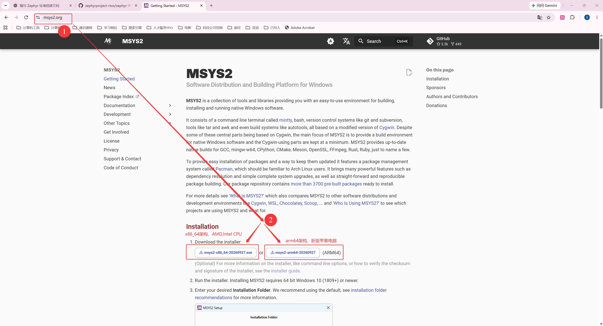
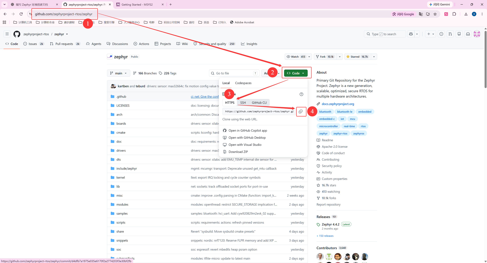
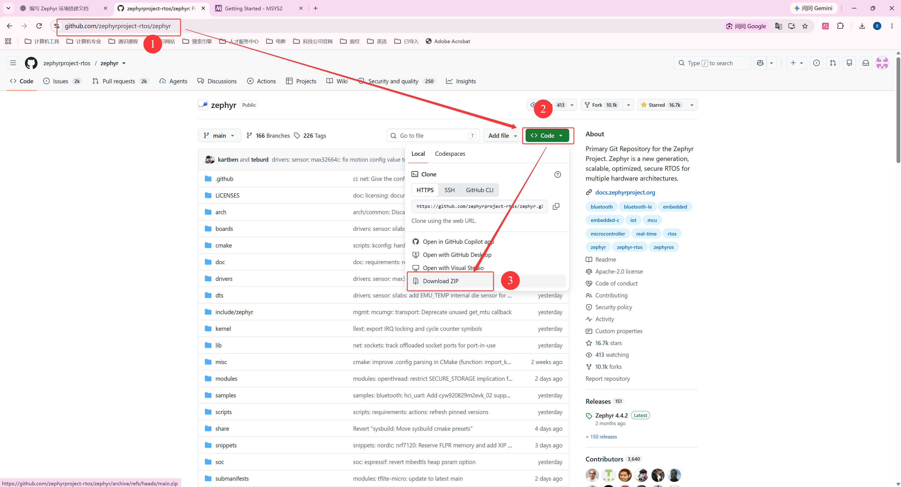

<!-- SPDX-FileCopyrightText: Copyright The zephyr_hc32f4a0 Contributors -->
<!-- SPDX-License-Identifier: Apache-2.0 -->

# 第1章\_准备\_UCRT64\_环境与下载\_Zephyr

**复制命令：** [按小节打开完整操作单元](commands/P001_Windows/README.md)。PPT 的“完整命令”链接指向同一份纯文本；请连同注释复制，先读本节前提，再执行所选路线。

准备下载 Zephyr 时，Windows 电脑往往还缺少终端和 Git。本章从安装 MSYS2 开始，先让下载工具可用，再选择 Git 克隆或 ZIP 压缩包取得源码，最后按需补回 Git 历史。已有的下载截图和终端记录保留作对照，软件版本、文件大小和提交数量以实际下载结果为准。

本文面向 Windows x64，命令默认在 **MSYS2 UCRT64 的 Bash 终端**执行。MSYS2 是提供类 Unix 命令行工具和软件包管理器的 Windows 工具环境；Bash 是解释并执行命令的 shell。UCRT64 是 MSYS2 中使用 Windows 通用 C 运行库（Universal C Runtime，UCRT）的 64 位环境，它仍运行在 Windows 上。

正文展示的 `G:\zephyr_practice` 是 **Windows 资源管理器路径**；Bash 的文件操作使用 `/g/zephyr_practice`。从资源管理器粘贴的路径通过 `read -r` 接收后，用 `cygpath -u` 转换，不能把未处理的反斜杠路径直接写在 `cd` 后。这套 `/g` 和 `cygpath` 写法属于 Windows/MSYS2，不是 Linux 或 WSL 的通用路径。

阅读顺序：**1.1 安装终端 → 1.2 国内换源 → 1.3 安装工具 → 1.4 下载源码**。选择 ZIP 且需要版本历史时，再继续 1.5～1.8；1.9 配置提交身份，1.10 说明后续构建准备。下载完成只代表取得主仓库源码，完整构建还需要配套模块、Python 依赖和目标工具链。

配套演示文稿：[UCRT64 环境与 Zephyr 下载演示资料](slides/P001_准备UCRT64环境与下载Zephyr_Windows.pptx)。其中安装与换源部分包含 x64、ARM64 分支，后续构建工具仍以 UCRT64 为主线。

> 本章从官方上游取得 Zephyr，统一将直接含 `VERSION` 的源码层放在 `G:\zephyr_practice\zephyr-main`。后续 Markdown 与 PPT 都在这份源码上复现。HC32 是后续移植目标；下载原生源码不会自动获得 HC32 板级支持。


**动手前的起点：** Windows 主机、可用网络和普通文件编辑器；不要求已经有 Zephyr SDK 或 HC32 支持。

**完成本章后的状态：** 直接含 VERSION 的原生源码位于 /g/zephyr_practice/zephyr-main，终端和下载工具可用；是否补充 Git 历史按实际需要选择。


**视频与复习对照：** Markdown 提供完整步骤和解释；PPT 按下面的阶段讲解重点，操作时以对应正文为准。

| 阶段 | 正文小节 | PPT 页面 | Markdown 中继续展开的内容 |
| --- | --- | --- | --- |
| 终端与镜像 | 1.1—1.2 | 6—17 | 安装、软件源备份、展开后的仓库地址和更新失败处理 |
| 下载工具与源码 | 1.3—1.4 | 18—27 | 源码来源、路径转换、ZIP 解压层次与网络检查 |
| 可选 Git 历史 | 1.5—1.6、1.8—1.9 | 28—39 | 提交一致性、元数据接入、索引、身份配置与恢复前提 |
| 排错与交接 | 1.7、1.10 | 40—41 | 连接问题和进入依赖安装前的检查 |

**本章导航**

- [1.1 安装并打开 UCRT64 终端](#section-1-1)
- [1.2 将 MSYS2 软件源切换为国内镜像](#section-1-2)
- [1.3 安装下载与后续构建工具](#section-1-3)
- [1.4 下载 Zephyr 源码](#section-1-4)
- [1.5 为 ZIP 源码补充 Git 仓库信息](#section-1-5)
- [1.6 补全 main 分支的提交历史](#section-1-6)
- [1.7 排查 GitHub 连接与代理](#section-1-7)
- [1.8 回顾 ZIP 与 Git 仓库信息的组合流程](#section-1-8)
- [1.9 在仓库内配置 Git 提交身份](#section-1-9)
- [1.10 检查结果并进入下一步](#section-1-10)


### 1.0.1\_先分清本期会出现的文件

刚安装好终端时，电脑里没有 Zephyr 工程是正常的。`mkdir` 创建的是存放位置，下载/解压才带来源码；不要为了匹配图片，提前新建 `VERSION`、`west.yml` 或 `.git` 空文件。

| 对象 | 谁提供或创建 | 第一次应该何时出现 |
| --- | --- | --- |
| `/etc/pacman.d/mirrorlist.*` | MSYS2 安装提供的官方配置 | 终端安装完成后，换源前应已存在 |
| `mirrorlist.*.before-cn` | 读者按 1.2 的 cp 创建的备份 | 执行备份后；它不是 MSYS2 官方固定文件名 |
| `/g/zephyr_practice` | 读者按 1.4 的 mkdir 创建的父目录 | 下载之前 |
| `zephyr-main/VERSION`、`west.yml`、`boards` | Zephyr 官方仓库源码 | clone 或 ZIP 解压成功后 |
| `zephyr-main/.git` | Git clone 生成的版本元数据 | clone 路线有；ZIP 路线默认没有 |
| `git-meta` | 读者为可选补历史流程指定的临时目录 | 1.5 的元数据克隆后；不参加编译 |
| `learning`、`.venv`、外部 CMSIS 与 SDK | 后续教程材料或工具安装结果 | 本期原生源码里没有它们，不是误删 |

命令框内的 `#` 开头行是 Bash 注释，可以一起复制。`$` 提示符、历史终端输出及目录树是观察示例，不属于待执行命令。PPT 的配套命令文本按操作单元拆分，打开相应文件复制；不要把一整章包含替代分支的所有命令一次执行。

<a id="section-1-1"></a>

默认使用 UCRT64 Bash，保持 Linux 命令习惯。只有 Zephyr 官方明确采用 PowerShell 的 Windows 下载/安装步骤，以及 setup.cmd 等 Windows 专用脚本和其 Windows 管理操作，才切换到 PowerShell。普通下载、摘要校验、解压、版本检查、Python/venv 与 CMake 工程操作仍用 UCRT64，不能仅因调用 Windows 可执行程序就整段改成 PowerShell。Ubuntu 22.04 使用原生 Linux Bash。每段标明终端和目录，切换时重新进入目录，临时变量不互相继承。

## 1.1\_安装并打开\_UCRT64\_终端

先在 Windows“设置 → 系统 → 系统信息”查看“系统类型”，再到 [MSYS2 官网](https://www.msys2.org/)选择与电脑匹配的安装包。下载页中的 x64 和 ARM64 指的是运行 Windows 的电脑，不是稍后连接的开发板。

| Windows 电脑 | 安装包名称模式 | 安装后打开的终端 |
| --- | --- | --- |
| Intel / AMD x64 电脑 | `msys2-x86_64-日期.exe` | **MSYS2 UCRT64**，启动器 `ucrt64.exe` |
| Windows 11 ARM64 电脑 | `msys2-arm64-日期.exe` | **MSYS2 CLANGARM64**，启动器 `clangarm64.exe` |
| 32 位 x86 Windows | 当前教程不适用 | 不要将 x64 安装包用于 32 位系统 |

官网当前提供上述两种安装入口，文件名中的日期以实际发布为准。官网下载较慢时，可从[中科大 MSYS2 镜像目录](https://mirrors.ustc.edu.cn/msys2/)进入 `distrib/` 查找相同名称的安装包；镜像暂缺所需架构或版本时，回到官网入口，不要手工改文件名猜下载链接。安装包下载地址与安装后 pacman 的软件源是两项配置，后面还需要单独换源。

本章后续工具安装以 **Windows x64 + UCRT64** 为主线。ARM64 读者可按本节及 1.2 节理解安装与换源，后续原生包要使用对应的 CLANGARM64 包名。



运行安装程序，选择一个不含空格和中文的工具目录，例如空间充足的磁盘上的 `E:\msys64`，按向导完成安装。这里保存终端和工具，源码另放在自己的项目目录。

x64 读者安装后从开始菜单打开 **MSYS2 UCRT64**；也可以运行安装目录中的 `ucrt64.exe`。如果打开的是 MSYS、MINGW64 或 Git Bash，请关闭该窗口并选择 UCRT64。仅修改提示符或进入 `/ucrt64` 目录并不会切换工具环境。

```bash
# 当前位置：任意目录；终端：MSYS2 UCRT64。
echo "$MSYSTEM"
echo "$MINGW_PREFIX"
```

x64 主线预期依次输出 `UCRT64` 和 `/ucrt64`；ARM64 读者在 CLANGARM64 中检查时，应得到 `CLANGARM64` 和 `/clangarm64`。前者确认当前环境，后者确认这套原生工具的安装前缀。UCRT64 默认优先搜索 `/ucrt64/bin`，随后也能使用 `/usr/bin` 中的通用命令；详见 [MSYS2 Environments 的 Overview](https://www.msys2.org/docs/environments/#overview)。

<a id="section-1-2"></a>

## 1.2\_将\_MSYS2\_软件源切换为国内镜像

现在进入“安装终端 → **国内换源** → 安装工具 → 下载源码”的第二步。MSYS2 使用名为 `pacman` 的软件包管理器下载、安装和更新工具；“换源”就是调整它优先访问的包服务器。本节采用中国大陆的中科大镜像作为首选，清华镜像作为后备。读者可按自己的网络情况调整顺序。

这只影响 MSYS2 软件包下载。GitHub 源码、Python 包和 Zephyr 工具链各有下载渠道，不会随之换源。

### 1.2.1\_先分清电脑架构\_工具环境与开发板架构

换源时要下载的是在电脑上运行的工具，因此先看 **主机架构**，即运行 Windows 的电脑采用哪种处理器指令集。常见 Intel/AMD 64 位电脑使用 `x86_64`，也称 x64 或 AMD64；Windows ARM64 电脑使用 `aarch64`，也称 ARM64。旧称“x86”有时专指 32 位，对应这里的 `i686`，不要把它与 x64 混用。可以在 Windows“设置 → 系统 → 系统信息”的“系统类型”中确认自己的电脑。

开发板是另一个运行程序的设备。HC32 的 Cortex-M4 属于 32 位 ARM 微控制器；电脑通过交叉编译器生成供它运行的固件。**给 ARM 开发板编译程序，不会把电脑上的 UCRT64 工具变成 ARM64 工具**，也不需要因此改成 `clangarm64` 仓库。

MSYS2 将不同工具环境的包分开保存。UCRT64 和 CLANG64 都面向 x64 Windows，但工具链不同，因此仍有各自的仓库；CLANGARM64 则提供原生 ARM64 Windows 工具。Windows 11 ARM64 读者选择官网的 ARM64 安装入口，安装后打开 `clangarm64.exe`。安装器的架构与各组件的架构要分别看：当前 Bash 等 MSYS 通用工具仍通过 x64 模拟运行。这也解释了为什么 ARM64 电脑上的 MSYS 镜像目录仍可能是 `msys/x86_64/`。

| 使用场景 / 工具环境 | 原生工具架构 | pacman 仓库名 | 镜像站内对应的目录 |
| --- | --- | --- | --- |
| 本文主线：UCRT64 | `x86_64` | `ucrt64` | `msys2/mingw/ucrt64/` |
| x64 的 Clang 工具：CLANG64 | `x86_64` | `clang64` | `msys2/mingw/clang64/` |
| Windows ARM64 原生工具：CLANGARM64 | `aarch64` | `clangarm64` | `msys2/mingw/clangarm64/` |
| 旧环境 MINGW64 | `x86_64` | `mingw64` | `msys2/mingw/mingw64/` |
| 旧环境 MINGW32 | `i686` | `mingw32` | `msys2/mingw/mingw32/` |
| 各环境共用的 MSYS 通用工具 | 当前为 `x86_64` | `msys` | `msys2/msys/x86_64/` |

表中的旧环境用于读懂已有配置；新读者按本文使用 UCRT64。本文后续的 UCRT64 包名不直接适用于 CLANGARM64。ARM64 原生工具通常使用 `mingw-w64-clang-aarch64-` 包名前缀，是否有对应包要另行核对，也不能由换源成功推断本章全部 Zephyr 工具都已在 ARM64 主机验证。

这些目录由两份镜像列表描述：`mirrorlist.msys` 对应 Bash、Git 等通用工具，`mirrorlist.mingw` 供 UCRT64、CLANG64、CLANGARM64 等仓库共用。文件中的 `$arch` 和 `$repo` 是 **pacman 配置占位符**，不是让读者手工填写的 Bash 变量：

- `$arch` 由 pacman 的 `Architecture` 配置确定，当前这套 MSYS2 安装通常是 `x86_64`。MSYS 镜像使用 `msys/$arch/`。
- `$repo` 取自 `/etc/pacman.conf` 中的仓库段名，例如 `[ucrt64]` 对应 `ucrt64`。共用的 MinGW 镜像列表必须使用 `mingw/$repo/`，才能分别访问 `ucrt64`、`clangarm64` 等目录。

因此，即使在 x64 电脑上，**也不能把 MinGW 镜像统一写成 `mingw/$arch/` 或 `mingw/x86_64/`**。当 pacman 同步 UCRT64 时，错误模板会请求 `mingw/x86_64/ucrt64.db`，正确模板才会请求 `mingw/ucrt64/ucrt64.db`。同样，不要因使用 ARM64 电脑就把所有路径替换成 `aarch64`。

### 1.2.2\_备份并写入中科大源与后备源

以下命令在 **MSYS2 的 Bash 终端**中执行，本文使用 UCRT64，ARM64 原生环境则使用 CLANGARM64；不要直接粘贴到 PowerShell 或 CMD。两种环境使用相同的占位符模板，无需手工替换架构名。配置文件位于当前 MSYS2 安装的 `/etc/pacman.d/`，其 Windows 路径可用 `cygpath -w /etc/pacman.d` 查看，与安装盘符无关。

先保存当前列表。下面仅在备份不存在时复制，重复操作不会覆盖首次备份；任何复制错误都应先处理，再继续写入：

```bash
# 当前位置：任意目录；终端：MSYS2 UCRT64 / CLANGARM64 的 Bash。
if [ ! -e /etc/pacman.d/mirrorlist.msys.before-cn ]; then
    cp /etc/pacman.d/mirrorlist.msys /etc/pacman.d/mirrorlist.msys.before-cn
fi
if [ ! -e /etc/pacman.d/mirrorlist.mingw.before-cn ]; then
    cp /etc/pacman.d/mirrorlist.mingw /etc/pacman.d/mirrorlist.mingw.before-cn
fi
```

确认备份成功后，用下面两组完整内容替换镜像列表：中科大优先，清华后备。原来的完整列表留在备份中；若有自己维护的其他源，也先确认它们已备份。采用替换写入，可以同时清除旧教程留下的错误首行和重复条目，重复执行也不会叠加服务器行。

```bash
# 当前位置：任意目录；终端：MSYS2 UCRT64 / CLANGARM64 的 Bash。
cat > /etc/pacman.d/mirrorlist.msys <<'EOF'
Server = https://mirrors.ustc.edu.cn/msys2/msys/$arch/
Server = https://mirrors.tuna.tsinghua.edu.cn/msys2/msys/$arch/
EOF
```

这里的 `>` 表示覆盖文件。`<<'EOF'` 到独占一行的 `EOF` 之间是要写入的文字，结束标记前后不要加空格。`'EOF'` 的单引号阻止 Bash 提前展开 `$arch`，让 pacman 以后读取配置时再处理它。第二份文件同理，但占位符改用 `$repo`：

```bash
# 当前位置：任意目录；终端：MSYS2 UCRT64 / CLANGARM64 的 Bash。
cat > /etc/pacman.d/mirrorlist.mingw <<'EOF'
Server = https://mirrors.ustc.edu.cn/msys2/mingw/$repo/
Server = https://mirrors.tuna.tsinghua.edu.cn/msys2/mingw/$repo/
EOF
```

### 1.2.3\_检查\_pacman\_实际使用的地址

只看文件首行，还无法确认占位符是否正确展开。用 `pacman-conf` 读取与 pacman 相同的配置，先核对当前环境、配置架构和启用的仓库：

```bash
# 当前位置：任意目录；终端：MSYS2 UCRT64 / CLANGARM64 的 Bash。只读检查。
echo "$MSYSTEM"
pacman-conf Architecture
pacman-conf --repo-list
```

本章 UCRT64 主线前两项应为 `UCRT64`、`x86_64`。Windows ARM64 上的 CLANGARM64 环境，第一项是 `CLANGARM64`，当前 MSYS 通用层的配置架构仍为 `x86_64`。不要仅凭 `uname -m` 判断电脑物理架构，它可能反映模拟运行的 MSYS 进程。

接着检查通用仓库，以及上一条命令实际列出的工具仓库。默认配置包含下面三个仓库时，可以逐条执行：

```bash
# 当前位置：任意目录；终端：MSYS2 UCRT64 / CLANGARM64 的 Bash。只读检查。
pacman-conf --repo msys Server
pacman-conf --repo ucrt64 Server
pacman-conf --repo clangarm64 Server
```

每条会输出中科大与清华两个地址，其中中科大地址依次应为：

```text
https://mirrors.ustc.edu.cn/msys2/msys/x86_64/
https://mirrors.ustc.edu.cn/msys2/mingw/ucrt64/
https://mirrors.ustc.edu.cn/msys2/mingw/clangarm64/
```

若某个仓库没有启用，就跳过对应查询，不需要为了检查它而新增仓库。若 UCRT64 的查询结果出现 `mingw/x86_64/`，说明还有错误配置，先重做 1.2.2；若错误地址仍存在，检查 `/etc/pacman.conf` 对应仓库段中是否直接写了 `Server` 或引用了另一份列表。

同步输出同时出现 `clangarm64`、`mingw32`、`mingw64` 等名称，并不表示选错电脑架构。`pacman -Syyu` 同步的是配置中所有启用的仓库索引，而当前终端的 `$MSYSTEM` 主要决定工具路径等环境。同步 ARM64 仓库索引也不等于安装了 ARM64 软件。

路径依据为官方实际使用的 [mirrorlist.mingw](https://github.com/msys2/MSYS2-packages/blob/master/pacman-mirrors/mirrorlist.mingw) 和 [pacman.conf](https://github.com/msys2/MSYS2-packages/blob/master/pacman/pacman.conf)；架构关系参照 [MSYS2 Environments](https://www.msys2.org/docs/environments/) 与 [ARM64 Support](https://www.msys2.org/docs/arm64/)。镜像服务参照[中科大使用帮助](https://mirrors.ustc.edu.cn/help/msys2.html)与[清华使用帮助](https://mirrors.tuna.tsinghua.edu.cn/help/msys2/)，核对日期为 2026-10-02。

### 1.2.4\_刷新索引并完成系统更新

实际地址检查正确后，强制重新下载软件包索引，并升级已有软件包：

```bash
# 当前位置：任意目录；终端：UCRT64。
pacman -Syyu
```

选项 `-S` 使用软件仓库，选项 `yy` 强制刷新索引，选项 `u` 升级已安装包。按提示确认；如果核心组件更新要求关闭全部 MSYS2 进程，先保存其他 MSYS2 窗口里的工作，再允许关闭。

重新打开 **MSYS2 UCRT64**，继续完成更新：

```bash
# 当前位置：任意目录；终端：重新打开的 UCRT64。
pacman -Syu
```

直到没有待更新包再安装新工具。以后日常更新使用 `pacman -Syu` 即可，不必每次强制刷新。MSYS2 采用滚动更新，只支持完整升级；不要仅执行 `pacman -Sy` 后停在索引已更新、旧软件未升级的状态。关闭终端后继续更新的流程见 [Updating MSYS2](https://www.msys2.org/docs/updating/)。

### 1.2.5\_根据错误类型排查与恢复

`404` 表示服务器上找不到所请求的文件，要先检查请求路径。若 `ucrt64.db`、`clang64.db` 等多个数据库一起失败，优先按 1.2.3 检查展开地址，特别是旧教程误写的 `mingw/$arch/`。后面即使还有正确的清华地址，前面的错误请求也可能触发“返回错误过多，将跳过该服务器”的警告，因此只在错误行后面追加正确行仍可能失败。

如果已经执行过旧版插入命令，按 1.2.2 重新写入两份列表，再检查实际地址并执行 `pacman -Syyu`。这会清理重复行及错误路径，不需要重装 MSYS2。若路径正确，只是个别软件包文件 404，才继续考虑镜像同步延迟；若连接超时，则检查网络或稍后重试。后备镜像可以提高可用性，但不能保证服务器故障时完全没有警告。

需要恢复换源前配置时，先确认 `.before-cn` 确实保存的是可用列表；如果备份时配置就已经错误，恢复也会带回错误。确认后逐条执行：

```bash
# 当前位置：任意目录；终端：UCRT64。恢复本节保存的原始列表。
cp /etc/pacman.d/mirrorlist.msys.before-cn /etc/pacman.d/mirrorlist.msys
cp /etc/pacman.d/mirrorlist.mingw.before-cn /etc/pacman.d/mirrorlist.mingw
pacman -Syyu
```

恢复后重新同步并完整升级。若报签名错误，先核对系统时间和官方密钥更新说明，不用关闭签名校验来绕过问题。恢复列表不会卸载已安装工具。

<a id="section-1-3"></a>

## 1.3\_安装下载与后续构建工具

现在进入“安装终端 → 国内换源 → **安装工具** → 下载源码”的第三步。先安装取得源码需要的工具，再按学习进度安装构建工具；包管理器会同时处理它们的依赖。

### 1.3.1\_安装\_Git\_与下载解压工具

```bash
# 当前位置：任意目录；终端：UCRT64。此前已完成系统更新。
pacman -S --needed git curl wget unzip tar xz
```

Git 管理源码和版本历史；curl、wget 用于从网址下载文件；unzip 解压 ZIP，tar 与 xz 处理常见归档。下载本章的 ZIP 也可以用浏览器和 Windows 解压功能。Bash、ls、cp、sed 等基础命令由 MSYS2 基础环境提供，不用另找安装包。

`--needed` 会跳过已是最新版本的包。出现安装确认时检查包列表并确认，结束后检查：

```bash
# 当前位置：任意目录；终端：UCRT64。
git --version
curl --version
wget --version
unzip -v
tar --version
xz --version
command -v git
```

前六条应显示版本，最后一条通常指向 `/usr/bin/git`。若提示 `command not found`，先确认安装没有失败、当前确实是 UCRT64；使用 `type -a git` 可以查看是否同时存在多套 Git。

### 1.3.2\_按需安装构建辅助工具

准备构建时，按[Windows P002—P005](环境与依赖导航.md)在 PowerShell 或 cmd.exe 使用官方 winget 清单，安装后回到 UCRT64。完整依据见[主机工具与官方安装来源](主机工具与官方安装来源.md)。本节先认识工具职责，避免尚未取得源码时把一份软件包清单当作永久要求。

| 工具 | 构建时的职责 | 安装后检查 |
| --- | --- | --- |
| CMake | 读取工程规则、生成构建配置 | `cmake --version` |
| Ninja | 按生成的构建规则执行编译和链接 | `ninja --version` |
| dtc（Device Tree Compiler，设备树编译器） | 处理描述硬件的设备树数据 | `dtc --version` |
| gperf | 根据关键字集合生成查找代码 | `gperf --version` |

安装后逐项检查表中的命令，再用 `type -a cmake ninja dtc gperf` 核对真正调用的文件。UCRT64 的 `/ucrt64/bin` 可能覆盖 Windows PATH 中的同名工具，不能凭终端名称判断工具来源。

### 1.3.3\_准备\_Windows\_Python\_并区分主机与目标编译器

Zephyr 的构建脚本和多仓库管理工具 west 由 Python 运行。本教程选择 **Windows 原生 Python 3.12.10**，从 [Python 3.12.10 发行页](https://www.python.org/downloads/release/python-31210/)选择 Windows installer (64-bit)，保留 Python Launcher（`py` 启动器）。安装后重开 UCRT64，检查：

```bash
# 当前位置：任意目录；终端：重新打开的 UCRT64。
py -3.12 --version
py -3.12 -m pip --version
```

预期显示 Python 3.12.10 和它对应的 pip 包安装器。`py` 能找到解释器，不保证 Bash 的 PATH 中已有 `python`。UCRT64 命令安装、Windows 已装 Python 的 PATH 设置以及源码根 `.venv` 创建，统一见 [P002—P005 的 Python 环境说明](环境与依赖导航.md)。若找不到 `py`，检查启动器是否安装、终端是否重开。MSYS2 自带的 Python 与 Windows 官方 Python 有包兼容性差异，所以这里明确用 `py -3.12` 选择解释器，后续在项目虚拟环境中安装 west；详见 [MSYS2 Python](https://www.msys2.org/docs/python/)。

若后续要做 Windows 主机上的 C/C++ 编译与调试实验，可额外安装 GCC 编译器和 GDB 调试器：

```bash
# 当前位置：任意目录；终端：UCRT64。只做源码下载时可以跳过。
pacman -S --needed mingw-w64-ucrt-x86_64-gcc mingw-w64-ucrt-x86_64-gdb
gcc --version
gdb --version
```

这些工具生成、调试 Windows 程序。编译 HC32 的 ARM 固件还需 Zephyr SDK（Software Development Kit，软件开发工具包）内的目标交叉编译器；它生成在开发板上运行的程序。SDK 的版本及安装步骤按[下一章](环境与依赖导航.md)从实际源码推导，安装 UCRT64 GCC 不能替代它。

<a id="section-1-4"></a>

## 1.4\_下载\_Zephyr\_源码

现在进入“安装终端 → 国内换源 → 安装工具 → **下载源码**”的第四步。源码父目录固定为 Windows 的 `G:\zephyr_practice`，先在 UCRT64 创建并进入它：

```bash
# 当前位置：任意目录；终端：Windows 的 UCRT64 Bash。
mkdir -p /g/zephyr_practice
cd /g/zephyr_practice
pwd
```

若要从资源管理器输入同一个父目录，可用备用方式 `read -r -p 'Windows 父目录（不带引号）: ' SOURCE_DIR`，再执行 `cd "$(cygpath -u "$SOURCE_DIR")"`。`cygpath -u` 将 Windows 地址转换成 Bash 路径。主线 `pwd` 应为 `/g/zephyr_practice`。下面选用上游 `main` 分支演示，它会持续变化；正式工程应固定发布标签或提交号。



### 1.4.1\_使用\_Git\_克隆

Git 是版本控制工具，clone 表示取得一个远程仓库及其历史。在选好的源码存放目录执行：

```bash
# 当前位置：/g/zephyr_practice；终端：UCRT64。目标 zephyr-main 应尚不存在。
git clone https://github.com/zephyrproject-rtos/zephyr.git zephyr-main
```

命令末尾显式指定 `zephyr-main`，因此 Git 与 ZIP 两种取得方式最后使用同一个实验路径，而不会默认创建另一个 `zephyr` 目录。目录中包含源码和保存版本信息的 `.git/`。HEAD 是 Git 表示当前检出提交的引用名；进入目录后核对它指向的提交号：

```bash
# 当前位置：源码存放目录；终端：UCRT64。上一条 clone 已成功。
cd zephyr-main
git rev-parse --show-toplevel
git rev-parse HEAD
git status
ls
ls -al
```

根目录应是 `G:/zephyr_practice/zephyr-main`（Git 可能输出 Windows 正斜杠路径），`HEAD` 是当前提交号，工作区应干净。后两条分别查看普通文件和包含隐藏文件的列表。克隆成功的读者可跳过 ZIP 和补历史步骤，直接看 1.9；不要再给已有仓库拼接另一份 `.git`。

**下载前配置本地代理（以 v2rayN 为例）**

以下按“本地混合监听端口为 `10808`、第二个本地监听端口未开启”的配置举例。先确认客户端正在运行，并以自己的实际监听端口为准；本例使用 `http://127.0.0.1:10808`，不用 `10809`、PAC 端口或 API 端口。

```bash
# 当前位置：任意目录；终端：UCRT64。写入当前用户的 Git 配置。
git config --global --replace-all http.proxy http://127.0.0.1:10808
git config --show-origin --get-all http.proxy
curl -I -x http://127.0.0.1:10808 https://github.com
```

配置查询应显示 `http://127.0.0.1:10808`。这里的 `http://` 是 **Git 连接本地代理的协议**，访问 GitHub 的地址仍为 HTTPS；不要写成 `https://127.0.0.1:10808`。Git 的 [`http.proxy`](https://git-scm.com/docs/git-config#Documentation/git-config.txt-httpproxy) 同时用于 HTTP 与 HTTPS 请求，不需要另设 `https.proxy`。若此前写过错误的 `https.proxy`，可用 `git config --global --unset-all https.proxy` 清除；该键不存在时无需处理。

curl 测试通常先显示 `200 Connection established`，还应继续看到 GitHub 的 HTTP 响应；仅建立代理隧道不代表整个请求成功。**Git 代理配置不控制浏览器**：下面用浏览器下载 ZIP 时，还需在 v2rayN 开启系统代理，或让浏览器使用同一代理入口。

### 1.4.2\_使用\_ZIP\_下载


先在浏览器打开 [Zephyr 官方仓库](https://github.com/zephyrproject-rtos/zephyr)，检查所有者 `zephyrproject-rtos` 和仓库名 `zephyr`。左上分支/标签选择器决定正在看的版本，绿色 **Code → Download ZIP** 下载的是所选版本的源码快照。`main` 会变化；想严格复现时，先从提交页面取得完整 SHA，再打开 `/tree/完整SHA` 的文件树下载，并把 SHA 记在自己的下载笔记里。不要把某天下载的 main ZIP 与另一天的 main 提交当成相同内容。

浏览器下载不负责安装。把 ZIP 保留一份，再解压到 `G:\zephyr_practice`。找到**直接包含 `VERSION`、`west.yml`、`boards`、`samples` 的那层**，将这一层目录命名为 `zephyr-main`。如果外面多套了下载文件名目录，内层才是源码根。目录名 `zephyr-main` 是本教程的统一存放约定，并不固定 Git 分支或提交。

```bash
# Windows UCRT64；浏览器已解压到指定位置，检查官方源码入口。
cd /g/zephyr_practice/zephyr-main
ls VERSION SDK_VERSION west.yml boards samples
# ZIP 无 .git 是预期结果；clone 路线应存在该目录。
if [ -d .git ]; then git rev-parse HEAD; else printf 'ZIP snapshot: no Git metadata\n'; fi
```

这几项存在才能进入 P002—P005。`boards` 里没有 UYUP 不表示下载坏了，新增芯片/板支持属于 P011。ZIP 没有 `.git` 也不妨碍读取或编译源码，只是不具备本地历史查询能力；1.5 是可选的 Git 补充流程。若要补历史，下载笔记里的 SHA 是核对依据，未确认版本一致之前不要移动元数据或重置工作区。

Git 克隆遇到连接问题时，原记录曾出现：

```text
Lizha@lizhaojun UCRT64 /g/zephyr_practice
$ git clone https://github.com/zephyrproject-rtos/zephyr.git
Cloning into 'zephyr'...
fatal: unable to access 'https://github.com/zephyrproject-rtos/zephyr.git/': Recv failure: Connection reset by peer

Lizha@lizhaojun UCRT64 /g/zephyr_practice
$ git clone https://github.com/zephyrproject-rtos/zephyr.git
Cloning into 'zephyr'...
fatal: unable to access 'https://github.com/zephyrproject-rtos/zephyr.git/': Failed to connect to github.com:443 after 21050 ms: Could not connect to server
```

这些记录说明当时 Git 到 GitHub 的连接失败，排查方法见 1.7。Git 本身支持镜像仓库；访问是否稳定取决于服务器和网络，不能解释成“Git 不支持国内镜像”。

如果浏览器仍能访问 [Zephyr 官方仓库](https://github.com/zephyrproject-rtos/zephyr)，可点击 **Code → Download ZIP** 下载当前分支快照。ZIP 不含 Git 历史，传输内容可能比完整克隆少；是否更快取决于网络，不能保证下载工具一定加速，也不能保证网页打不开时压缩包仍可下载。



将压缩包解压到 `G:\zephyr_practice`，使直接含 `VERSION` 的目录为 `G:\zephyr_practice\zephyr-main`，避免多套一层同名目录。文件数量较多，解压需要一些时间；包体积随版本变化，不以固定大小判断下载是否完整。若准备后面补回 Git 信息，先记录压缩包对应的提交号，并保留未修改的解压副本；分支名相同不保证下载时刻的提交相同。

原下载记录中的目录内容如下。这是文件名清单，AGENTS.md、REUSE.toml、CODE_OF_CONDUCT.md、MAINTAINERS.yml、CONTRIBUTING.rst、README.rst 等分别是协作说明、许可证配置、行为准则、维护者列表、贡献指南和项目介绍；本节用它们识别源码目录，不展开每个文件：

```text
Lizha@lizhaojun UCRT64 /g/zephyr_practice/zephyr-main
$ ls
AGENTS.md           Kconfig.constants  REUSE.toml   drivers  samples       tests
CLAUDE.md           Kconfig.zephyr     SDK_VERSION  dts      scripts       version.h.in
CMakeLists.txt      LICENSE            VERSION      include  share         west.yml
CODEOWNERS          LICENSES           arch         kernel   snippets      zephyr-env.cmd
CODE_OF_CONDUCT.md  MAINTAINERS.yml    boards       lib      soc           zephyr-env.sh
CONTRIBUTING.rst    README.license     cmake        misc     submanifests
Kconfig             README.rst         doc          modules  subsys
```

到这里已可阅读源码。若还需要提交记录、版本比较和分支操作，再继续补充 Git 数据；这仍需访问 GitHub，不能用来绕过尚未解决的 Git 网络故障。

<a id="section-1-5"></a>

## 1.5\_为\_ZIP\_源码补充\_Git\_仓库信息

Git 元数据保存在 `.git/`，包括提交对象、分支引用与仓库配置。下面用 Partial Clone（部分克隆）减少初次取得的文件内容，再把这份元数据接到 ZIP 的源码目录。操作顺序是“建立临时仓库 → 核对提交 → 接入元数据 → 建立索引 → 检查文件”。

本节假设源码存放目录中已有 `zephyr-main/`，且没有 `git-meta/` 和 `zephyr-main/.git`。先保留原始 ZIP 或源码副本。已经由 clone 建好的仓库不要再执行本节。

```text
操作前                        操作后
源码存放目录/                 源码存放目录/
└── zephyr-main/              └── zephyr-main/
    ├── arch/                    ├── .git/       Git 仓库信息
    ├── boards/                  ├── arch/
    ├── drivers/                 ├── boards/
    ├── kernel/                  ├── drivers/
    └── ...                      ├── kernel/
                                 └── ...
```

ZIP 提供当前源码，Git 提供版本信息。这种做法避免 checkout（检出）第二套工作区文件，但后续比较仍可能下载 Git 对象，不能保证完全不重复传输文件内容。

### 1.5.1\_建立临时\_Git\_元数据仓库

在 `zephyr-main` 的上一级目录执行，先确认当前位置和目标目录：

```bash
# 当前位置：源码存放目录；终端：UCRT64。
pwd
ls -ald zephyr-main
test ! -e git-meta && test ! -e zephyr-main/.git
echo $?
```

最后一条应输出 `0`，表示临时目录和目标 Git 信息都不存在；输出 `1` 时停止，先核对已有内容。确认后克隆临时仓库：

```bash
# 当前位置：源码存放目录；终端：UCRT64。
git clone \
    --filter=blob:none \
    --no-checkout \
    --depth=1 \
    --branch main \
    https://github.com/zephyrproject-rtos/zephyr.git \
    git-meta
```

成功后，`git-meta/` 与 `zephyr-main/` 并列。前者暂存 Git 数据，后者保留 ZIP 的源码。

| 参数 | 含义与当前用途 |
| --- | --- |
| `git clone` | 从远程取得 Git 仓库 |
| `--filter=blob:none` | 初次不取得全部 blob，即保存文件内容的对象；后续需要时再取 |
| `--no-checkout` | 不生成第二套工作区源码文件 |
| `--depth=1` | 只取得最浅一层提交历史，先建立最小浅仓库 |
| `--branch main` | 选择 main 分支；与 ZIP 分支同名不保证提交相同 |
| 仓库网址 | Git 数据的远程来源 |
| `git-meta` | 本文自定的临时目录名 |

三个减量选项各有作用：过滤文件内容、暂不检出源码、限制历史深度。它们让我们先接好仓库，再按需补历史。

### 1.5.2\_核对临时仓库与\_ZIP\_版本

commit 指 Git 的一次提交。先查看临时仓库的提交和远程来源：

```bash
# 当前位置：源码存放目录；终端：UCRT64。
git -C git-meta log -1 --oneline
git -C git-meta rev-parse HEAD
git -C git-meta remote -v
```

`-C git-meta` 指定命令在该目录执行。原记录中的简短提交和远程输出如下；你的提交号通常不同：

```text
ac03a4a (grafted, HEAD -> main, origin/main) doc: west spdx: correct where licenses and copyrights come from
origin  https://github.com/zephyrproject-rtos/zephyr.git (fetch) [blob:none]
origin  https://github.com/zephyrproject-rtos/zephyr.git (push)
```

将完整提交号与下载 ZIP 时记录的提交号比较。main 随时可能前进，只有分支名相同不够。若两者不同，先保留现有源码，重新取得匹配提交的压缩包，或另行克隆固定版本；不要把它们直接认作同一版本。

再检查过滤方式和浅仓库状态：

```bash
# 当前位置：源码存放目录；终端：UCRT64。
git -C git-meta config --get remote.origin.partialclonefilter
git -C git-meta rev-parse --is-shallow-repository
```

预期依次为 `blob:none` 和 `true`。后者表示提交历史仍在指定深度被截断，正是 `--depth=1` 的结果。

### 1.5.3\_接入\_Git\_元数据并建立索引

确认临时仓库取得成功、版本匹配、目标没有 `.git` 后，移动元数据并删除空临时目录：

```bash
# 当前位置：源码存放目录；终端：UCRT64。每条成功后才继续。
mv git-meta/.git zephyr-main/.git
rmdir git-meta
cd zephyr-main
```

`rmdir` 只删除空目录；如果失败，先检查残留内容。此时源码目录中已同时存在 `.git/`、`arch/`、`boards/`、`cmake/`、`drivers/`、`dts/`、`include/`、`kernel/`、`samples/`、`scripts/`、`subsys/` 和 `west.yml` 等文件。

Git 比较文件还需要索引。这里的 HEAD 表示当前检出的提交，Index（索引，也称暂存区）记录准备提交的文件状态，Working Tree（工作区）是磁盘上的源码文件。我们已有 HEAD 和 ZIP 工作区，接着用 HEAD 建立索引：

```bash
# 当前位置：zephyr-main 源码根目录；终端：UCRT64。
git read-tree --reset HEAD
```

这条命令读取 HEAD 的文件树并重建索引，没有使用 `-u`，因此不把文件检出到工作区。不要替换为 `git reset --hard HEAD`：后者会改写工作区，可能覆盖源码修改。此处的目标是保留 ZIP 文件，再让 Git 比较它们；具体行为见 [git-read-tree 的 Description](https://git-scm.com/docs/git-read-tree#_description)。

### 1.5.4\_检查工作区状态

索引建立后检查文件与提交是否一致：

```bash
# 当前位置：zephyr-main 源码根目录；终端：UCRT64。
git status
```

比较时 Git 可能联网取得缺失的 blob；部分克隆不保证 status、diff 等命令离线完成。如果 ZIP 与 HEAD 的内容、换行及文件模式都匹配，可能看到：

```text
On branch main
Your branch is up to date with 'origin/main'.

nothing to commit, working tree clean
```

这表示 ZIP 工作区与当前 HEAD 匹配。若出现大量差异，先比较提交号，再用 `git diff --stat`、`git diff --summary` 检查内容和文件模式，并考虑换行转换、ZIP 未保留的属性及自己的修改。不要用强制重置清掉差异来冒充匹配。

此时可用 `git log -1 --oneline` 查看当前提交、`git branch` 查看本地分支、`git remote -v` 查看来源、`git diff` 比较改动。但历史仍然很浅；工作区干净不等于历史已经完整。

<a id="section-1-6"></a>

## 1.6\_补全\_main\_分支的提交历史

本节是可选的历史查询说明。若当前只需要浅克隆并开展适配，跳过本节，不执行 `--unshallow`。已恢复 Git 工作区且确实需要追溯 main 的历史时，再继续；后续自动更新与提交组织规则尚未确定，本节不提供同步策略。历史深度与文件内容是两个独立维度：commit 记录提交，tree 记录目录和文件关系，blob 保存文件内容。

```text
                   Git 仓库数据
             历史深度          文件内容
                │                 │
             --depth           --filter
                │                 │
                ▼                 ▼
           提交追溯多远        预先下载哪些 blob
```

### 1.6.1\_获取历史并验证深度

先确认仓库是否仍为浅仓库：

```bash
# 当前位置：zephyr-main 源码根目录；终端：UCRT64。
git rev-parse --is-shallow-repository
```

若输出 `true`，执行下面的获取操作；若已为 `false`，跳过 `--unshallow`，直接检查已有历史。

```bash
# 当前位置：zephyr-main 源码根目录；终端：UCRT64。仅在仍为浅仓库时执行。
git fetch --unshallow --filter=blob:none origin main
```

fetch 表示从远程获取对象和引用。`--unshallow` 解除历史深度限制，`--filter=blob:none` 仍让历史文件内容按需取得，所以提交和目录树会补齐，全部历史 blob 不会一次性预取。原记录如下，其中 FETCH_HEAD 是 Git 保存本次获取结果的引用文件名：

```text
$ git fetch --unshallow --filter=blob:none origin main
remote: Enumerating objects: 1101283, done.
remote: Counting objects: 100% (1101275/1101275), done.
remote: Compressing objects: 100% (270591/270591), done.
remote: Total 1091608 (delta 789129), reused 1082926 (delta 780477), pack-reused 0
接收对象中: 100% (1091608/1091608), 164.76 MiB | 640.00 KiB/s, 完成.
处理 delta 中: 100% (789129/789129), 完成 4735 个本地对象.
来自 https://github.com/zephyrproject-rtos/zephyr
 * branch                    main       -> FETCH_HEAD
```

历史仍可能占用上百 MiB：提交、目录树以及打包对象的差量数据也占空间。出现较大下载量不说明 `blob:none` 失效，下载量和速度也不必与记录一致。

完成后逐项验证：

```bash
# 当前位置：zephyr-main 源码根目录；终端：UCRT64。
git rev-parse --is-shallow-repository
git rev-list --count HEAD
git log --oneline --decorate -20
```

第一条应输出 `false`，表示浅历史边界已解除；第二条显示 HEAD 可追溯的提交数，第三条显示最近 20 条提交。提交数通常比原先明显增多，不要求某个固定数字。

这不表示全部远程分支、标签和 blob 都已在本地。fetch 也不会自动把工作区切到最新 main；它取得对象和更新引用，当前检出的提交可以保持原样。后续某个操作需要本地缺失的历史文件时，Git 仍可能联网获取。

### 1.6.2\_按需获取其他分支和发布标签

查看当前远程获取规则：

```bash
# 当前位置：zephyr-main 源码根目录；终端：UCRT64。
git config --get-all remote.origin.fetch
```

通常得到：

```text
+refs/heads/main:refs/remotes/origin/main
```

这条规则把远程 main 对应到本地的 `origin/main`。原因是最初使用了 `--depth=1`，它默认隐含 `--single-branch`，再由 `--branch main` 选择分支；只有 `--branch main` 本身不会限制只获取一个分支。规则依据见 [git-clone 的 depth 选项](https://git-scm.com/docs/git-clone#Documentation/git-clone.txt---depthltdepthgt)。

如果确实需要其他远程分支，再扩大获取范围：

```bash
# 当前位置：zephyr-main 源码根目录；终端：UCRT64。可选操作。
git config remote.origin.fetch "+refs/heads/*:refs/remotes/origin/*"
git fetch --filter=blob:none origin
git branch -r
```

星号表示所有分支，`git branch -r` 列出远程跟踪分支。此操作不是恢复 main 历史的必要条件。

Tag 是指向特定对象的标签，项目常用它标记发布提交。需要 Zephyr 发布标签时执行：

```bash
# 当前位置：zephyr-main 源码根目录；终端：UCRT64。可选操作。
git fetch --tags --filter=blob:none origin
git tag -l
```

这样补充标签引用，仍保留文件内容按需下载的方式。可以按需求停在三个层次之一：恢复 Git 工作区、补全 main 历史，或继续获取其他分支与标签。

<a id="section-1-7"></a>

## 1.7\_排查\_GitHub\_连接与代理

如果 clone 或 fetch 报 `Connection reset by peer`、`Failed to connect to github.com:443`，首先定位 Git 到 GitHub 的网络连接。这些错误本身不能证明 ZIP 损坏、索引建立失败、部分克隆失效或 `.git` 损坏。

在 UCRT64 中先查看 Git 配置的代理及来源，再看当前 shell 的代理环境变量：

```bash
# 当前位置：源码仓库内；终端：UCRT64。
git config --show-origin --get-regexp '^(http|https)\..*proxy$'
env | grep -i proxy
```

无匹配时没有输出是正常情况。Git 的 HTTPS 请求通常也使用 `http.proxy` 或按网址限定的 `http.<url>.proxy`，所以不能只检查一个全局键。环境变量常见名称为 `HTTP_PROXY`、`HTTPS_PROXY`、`ALL_PROXY` 以及对应小写形式；错误的代理地址也会导致连接失败。

如果要临时排除环境变量中的代理，先记录当前值，再在当前窗口执行：

```bash
# 当前位置：源码仓库内；终端：UCRT64。只影响当前 shell。
unset HTTP_PROXY HTTPS_PROXY ALL_PROXY
unset http_proxy https_proxy all_proxy
```

这不修改 Git 配置，也不清除系统持久环境变量。重新打开终端会重新继承启动时的环境。若所在网络必须使用代理，取消代理可能使连接更差；应修正代理地址而非机械地全部关闭。

先用小请求测试，不要立即重试大体积历史下载：

```bash
# 当前位置：任意目录；终端：UCRT64。
git ls-remote https://github.com/zephyrproject-rtos/zephyr.git HEAD
```

正常应返回一行“提交号 + HEAD”，表示这次 Git 请求能够访问远端；它不保证后续大文件传输绝不超时。若确实需要测试绕过 Git 配置中的代理，可在已临时取消代理环境变量的窗口中运行：

```bash
# 当前位置：任意目录；终端：UCRT64。-c 仅覆盖本次命令的普通 HTTP 代理配置。
git -c http.proxy= ls-remote https://github.com/zephyrproject-rtos/zephyr.git HEAD
```

如果仍有按网址配置的代理，先根据前面的配置来源检查对应项。小请求成功后再回到先前失败的下载步骤；重试补历史前再次确认浅仓库状态，已为 `false` 时不再使用 `--unshallow`。

<a id="section-1-8"></a>

## 1.8\_回顾\_ZIP\_与\_Git\_仓库信息的组合流程

至此，ZIP 恢复路线可以串成下面的过程。图用于对照已完成的步骤，已经操作成功的目录不需要再重跑一次。

```text
GitHub Download ZIP
        │
        ▼
zephyr-main/：当前源码
        │
        │ clone --filter=blob:none --no-checkout --depth=1
        ▼
git-meta/.git：最小 Git 元数据
        │
        │ 核对提交后移动 .git
        ▼
zephyr-main/.git + ZIP 文件
        │
        │ read-tree 建立索引，status 检查一致性
        ▼
可使用 Git 工作区
        │
        │ fetch --unshallow
        ▼
main 提交历史补全
        │
        ├── 按需获取其他远程分支
        ├── 按需获取发布标签
        └── 后续操作按需取得缺失 blob
```

第一阶段通过 ZIP 取得源码；第二阶段接入最小元数据并建立索引；第三阶段解除 main 的浅历史限制；第四阶段再按需要取得分支、标签和文件对象。各步命令已在 1.5 和 1.6 给出，分别检查状态后继续，避免把整个过程当成无需判断的脚本。

整个流程不依赖固定安装路径或某个盘符，只要求最初在 `zephyr-main` 的上一级目录操作，进入源码目录后在该仓库内执行后续命令。最终用 `git status` 验证工作区、`git rev-parse --is-shallow-repository` 验证历史深度、`git log` 验证可追溯记录；三个结果回答不同问题。

<a id="section-1-9"></a>

## 1.9\_在仓库内配置\_Git\_提交身份

只下载源码不要求配置姓名和邮箱；准备提交自己的修改时才需要。请先进入已经克隆的 `zephyr`，或完成 1.5 后的 `zephyr-main`。单纯 ZIP 解压目录还不是 Git 仓库，不能执行局部配置。

```bash
# 当前位置：已建立 Git 仓库的源码根目录；终端：UCRT64。
git rev-parse --show-toplevel
git config --local user.email "xxx@yy.com"
git config --local user.name "xxx"
git config --local --get user.email
git config --local --get user.name
```

先核对第一条输出的根目录，再把示例邮箱和姓名替换成自己的信息。`--local` 把配置写入当前仓库的 `.git/config`，不影响其他仓库；在仓库外执行会报错。它记录提交作者身份，不等于配置 GitHub 登录凭据。

<a id="section-1-10"></a>

## 1.10\_检查结果并进入下一步

完成后，你应能在 UCRT64 中看到正确的环境标识，使用 pacman 更新工具，执行 Git 下载命令，并区分“只有源码快照”“浅 Git 仓库”和“main 历史已经补全但部分文件对象仍按需下载”这几种状态。只选择 ZIP 阅读源码也已经完成本章的下载目标。

下一期继续[下载 SDK 与安装依赖包](环境与依赖导航.md)，先让主机工具、ARM 编译器与 Python 包环境可用。后续编译还需要依据所选 Zephyr 版本配套源码模块；工具原理可继续读 [Python 虚拟环境](../python/venv/大纲.md)与 [west 多仓库管理](../west/大纲.md)。所有后续实验继续使用同一份原生源码。不要把主仓库下载成功当成完整构建环境已经验收。

下一篇：[下载 SDK 与安装依赖包](环境与依赖导航.md)。

下一模块：[P002 主机工具与 Python](P002_主机工具与Python环境_Windows.md)。


下一篇：[P002](P002_主机工具与Python环境_Windows.md)。
