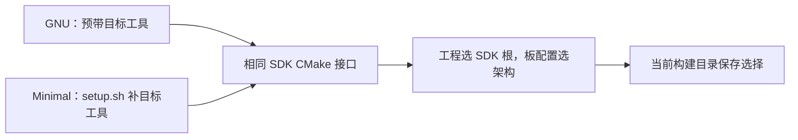

<!-- SPDX-License-Identifier: Apache-2.0 -->

# 第1章\_Linux\_官方环境安装与源码准备

**复制命令：** [按小节打开完整操作单元](commands/P001_Linux/README.md)。PPT 的“完整命令”链接指向同一份纯文本；请连同注释复制，先读本节前提，再执行所选路线。

本教程使用 **Ubuntu 22.04 LTS（Jammy）**，命令在 Linux Bash 执行。WSL Ubuntu 也按 Linux 分支处理。Windows UCRT64 读者转到 [Windows 环境](环境与依赖导航.md)。其他发行版使用[官方 Linux 依赖说明](https://docs.zephyrproject.org/latest/develop/getting_started/installation_linux.html)。

配套 [Linux P001 演示文稿](slides/P001_官方环境安装与源码准备_Linux.pptx)。返回[专题大纲](大纲.md)。本章采用官方 `~/zephyrproject/zephyr` 源码布局，`.venv` 在其父级工作区；这是 Linux 独立示例，不是在 Linux 上输入 Windows 的 `G:\...` 或 UCRT64 的 `/g/...`。


**动手前的起点：** Linux Bash、可用网络和有 sudo 权限的账户；系统为 Ubuntu 22.04 LTS，以下完整命令以 x86_64 主机为例。

**完成本章后的状态：** 官方 west 工作区、Linux venv 与 SDK 可检查并恢复；本章只完成环境准备，编译与实板操作另行验收。


**视频与复习对照：** Markdown 提供完整步骤和解释；PPT 按下面的阶段讲解重点，操作时以对应正文为准。

| 阶段 | 正文小节 | PPT 页面 | Markdown 中继续展开的内容 |
| --- | --- | --- | --- |
| 系统与主机工具 | 1.1—1.2 | 4—11 | Ubuntu 22.04、Kitware CMake、官方 Python 源码安装与检查 |
| 独立环境与源码 | 1.3—1.4 | 12—15 | venv 所在层次、west 初始化与模块下载的状态变化 |
| SDK 与恢复 | 1.5—1.6 | 16—21 | 源码要求的 Python 包、SDK 入口、环境恢复与常见错误 |

**本章导航**

- [1.1 系统和官方依据](#section-1-1)
- [1.2 用 apt 安装主机依赖](#section-1-2)
- [1.3 创建 Linux 虚拟环境](#section-1-3)
- [1.4 取得官方源码和模块](#section-1-4)
- [1.5 安装源码要求的 Python 包和 SDK](#section-1-5)
- [1.6 验收与恢复](#section-1-6)


### 1.0.1\_先看文件从哪里来

Ubuntu 22.04 是本章保留的主机系统，不为了运行教程升级发行版。工具不足时补工具，源码不足时取源码，这两种动作产生的目录也不同。

| 位置 | 来源与创建时机 | 缺少时先回哪一步 |
| --- | --- | --- |
| `/etc/os-release` | Ubuntu 已有的系统信息 | 系统身份检查，不新建该文件 |
| `/etc/apt/sources.list.d/kitware.list` | 1.2.2 按 Kitware 官方说明由读者创建的额外源配置 | CMake 版本补齐 |
| `~/zephyr-tools/src/Python-3.12.10` | Python 官方归档解压生成 | 1.2.3 下载和解压 |
| `python3.12` | 已安装解释器的版本命令；缺少时按 1.2.3 安装 | 解释器安装 |
| `~/zephyrproject/.venv` | Python venv 命令创建 | 1.3；不是 Zephyr 官方源码自带 |
| `~/zephyrproject/.west`、`zephyr` | west init 创建管理目录并取得主仓库 | 1.4；已有时不重复 init |
| `~/zephyrproject/modules/...` | west update 按清单下载的外部项目 | 1.4；不是 zephyr/modules 接入规则目录 |
| SDK 安装目录 | west sdk install 或手动 SDK 安装产生 | 1.5；不放进应用源码 |

Linux 中 `~` 是当前用户主目录，`.venv/bin/activate` 与 Windows 的 `Scripts/activate` 不同。终端所在目录不会改变程序的平台：UCRT64 运行 Windows SDK，本章运行 Linux SDK。所有代码块的注释都可以一起复制；替代路线只选一条。

<a id="section-1-1"></a>

## 1.1\_系统和官方依据

```bash
# 终端：Linux Bash；任意目录。只读检查。
cat /etc/os-release
uname -m
```

本章 apt 清单来自当前 Zephyr [Getting Started](https://docs.zephyrproject.org/latest/develop/getting_started/index.html)，与实验参考源码 `25c8f4a23988dd3b2cfb463613622738298c2d6c` 的 `doc/develop/getting_started/index.rst` 核对一致。源码下载后以本地同文件为准，详细更新原则见[官方安装来源](主机工具与官方安装来源.md)。当前主要下限为 CMake 3.28.0、Python 3.12、dtc 1.4.6。

**教程的系统版本固定为 Ubuntu 22.04。** 当前源码的快速开始以 Ubuntu 24.04 及以后为示例起点，因此不能原样套用它的默认包版本。22.04 常见的系统 Python 3.10、CMake 3.22 低于上述下限，需先完成 1.2 的工具补齐，再创建 venv。venv 继承创建它的解释器版本，激活 venv 不会自动把 Python 3.10 升成 3.12。

下文区分三类依据：Zephyr 源码决定工具要求；CMake 的发布方 Kitware 提供 Jammy 软件源；Python 官方提供 CPython 源码和构建方法。组合成下面这条 22.04 安装路线是本教程的环境适配，不能称为 Zephyr 官方为 22.04 发布的完整命令。

<a id="section-1-2"></a>

## 1.2\_用 apt 安装主机依赖

**当前阶段：② 主机依赖与版本补齐。** 下列 apt 操作需要 sudo 权限；Python 本体安装在当前用户目录。

### 1.2.1\_安装基础工具并检查版本

```bash
# 终端：Ubuntu 22.04 Bash；任意目录。
sudo apt update
sudo apt install --no-install-recommends git cmake ninja-build gperf \
  ccache dfu-util device-tree-compiler wget python3-dev python3-venv python3-tk \
  xz-utils file make gcc gcc-multilib g++-multilib libsdl2-dev libmagic1
cmake --version
python3 --version
dtc --version
type -a cmake ninja python3 dtc gperf
```

基础工具名称按 Zephyr 官方 Ubuntu 清单核对。ARM64 主机可能没有 `gcc-multilib` 和 `g++-multilib`，按官方说明去掉这两项；先用 `uname -m` 确定主机架构。主机架构与开发板的 Cortex-M 目标架构是两回事。

若 CMake 已满足当前源码下限，可跳过 1.2.2。若已有符合要求的 Linux Python，可用它创建 venv 并记录实际版本；以下提供从零安装教程固定版本 3.12.10 的路径。这个补丁号用于复现教程，并非 Zephyr 指定的唯一版本，也不代表最新安全补丁版本。

### 1.2.2\_从 Kitware 官方 Jammy 源安装 CMake

Zephyr 的 [Linux Host Dependencies](https://docs.zephyrproject.org/latest/develop/getting_started/installation_linux.html#cmake) 将 CMake 升级指向 [Kitware 官方 APT 仓库](https://apt.kitware.com/)。Kitware 是 CMake 的发布方，这里使用它提供的 **jammy** 源。该源属于额外配置的上游软件源，并非 Ubuntu 默认仓库。

下面按 Kitware 的密钥、软件源、keyring 包顺序操作。每一步成功后才继续；已有同名源且内容不同时，先核对已有配置。

```bash
# 终端：Ubuntu 22.04 Bash；任意目录。只适用于 jammy。
sudo apt-get update
sudo apt-get install ca-certificates gpg wget
test -f /usr/share/doc/kitware-archive-keyring/copyright || \
  wget -O - https://apt.kitware.com/keys/kitware-archive-latest.asc | \
  gpg --dearmor - | sudo tee /usr/share/keyrings/kitware-archive-keyring.gpg >/dev/null
```

```bash
# 终端：Ubuntu 22.04 Bash；上一步密钥已取得。
echo 'deb [signed-by=/usr/share/keyrings/kitware-archive-keyring.gpg] https://apt.kitware.com/ubuntu/ jammy main' | \
  sudo tee /etc/apt/sources.list.d/kitware.list >/dev/null
sudo apt-get update
test -f /usr/share/doc/kitware-archive-keyring/copyright || \
  sudo rm /usr/share/keyrings/kitware-archive-keyring.gpg
sudo apt-get install kitware-archive-keyring
sudo apt-get install cmake
cmake --version
apt-cache policy cmake
```

中间删除的是首次手动取得的单个密钥文件，随后由 `kitware-archive-keyring` 包接管维护，顺序来自 Kitware 说明。`apt-cache policy` 用于核对候选版本及来源；实际安装版本随仓库变化，必须达到当前源码要求。这里没有把 CMake 固定在某个补丁版本，也没有修改 Zephyr 的 CMake 参数。

### 1.2.3\_从 Python 官方源码安装 3.12.10

Linux 使用 [Python 3.12.10 发布页](https://www.python.org/downloads/release/python-31210/)中的源码归档。Windows 的 `.exe` 安装器不能用于此步骤。[Python 官方 Unix 安装说明](https://docs.python.org/3.12/using/unix.html#building-python)给出源码构建方法，并推荐 `make altinstall` 保留带版本号的解释器入口。

先安装用于构建解释器及常用标准库扩展的开发包。包的作用可对照 [CPython 开发指南的构建依赖说明](https://devguide.python.org/getting-started/setup-building/#install-dependencies)：OpenSSL 支持 HTTPS，zlib/bzip2/xz 支持压缩，libffi 支持 ctypes，SQLite 支持 sqlite3。仅有 gcc 并不能保证这些模块可用。

```bash
# 终端：Ubuntu 22.04 Bash；任意目录。
sudo apt-get install build-essential pkg-config libssl-dev zlib1g-dev \
  libbz2-dev libreadline-dev libsqlite3-dev libffi-dev liblzma-dev \
  libgdbm-dev libgdbm-compat-dev libncurses-dev tk-dev uuid-dev
```

先执行 `python3.12 --version`。已有 3.12.10 就跳过源码下载和编译，直接进入 1.3 创建或激活 `.venv`。缺少时才继续下面的官方源码安装。`~/zephyr-tools/src` 仅保存下载和解压的 Python 源码，不是解释器的运行位置，也不是需要复现的测试目录。安装使用 CPython 默认前缀，之后通过版本命令 `python3.12` 调用。

```bash
# 终端：Ubuntu 22.04 Bash；先进入 Python 下载目录。
mkdir -p ~/zephyr-tools/src
cd ~/zephyr-tools/src
wget https://www.python.org/ftp/python/3.12.10/Python-3.12.10.tgz
tar -xzf Python-3.12.10.tgz
cd Python-3.12.10
./configure --with-ensurepip=install
make -j2
sudo make altinstall
```

这组命令用于首次安装。目录或归档已存在时先检查其来源和已有构建状态，不向未知目录重复解压。`make -j2` 使用两个并行任务；内存紧张时用 `make -j1`。`configure` 和 `make` 均成功后才执行安装。安装到默认前缀需要 sudo；altinstall 保留版本命令，不替换 Ubuntu 管理的 `/usr/bin/python3`。

```bash
# 终端：Ubuntu 22.04 Bash；任意目录。
# 使用已安装的带版本命令；不按教程自定义目录查找 Python。
python3.12 --version
python3.12 -c \
  'import ssl, sqlite3, bz2, lzma, ctypes, venv; print(ssl.OPENSSL_VERSION)'
python3.12 -m pip --version
```

应显示 Python 3.12.10，模块导入无异常，pip 属于该解释器。若 `_ssl`、`_ctypes` 等缺失，回查开发包与 `configure` 输出，补齐后重新配置和构建，先不要创建 venv。此时 `python3 --version` 仍可能显示系统 3.10，这是正常的；下一节用 `python3.12` 创建环境，激活后统一使用 `python`。

<a id="section-1-3"></a>

## 1.3\_创建 Linux 虚拟环境

**当前阶段：③ venv。** 新工作区按以下顺序执行；已存在 `.venv` 时先激活检查，不重复覆盖。

```bash
# 终端：Linux Bash；任意目录。路径沿用官方示例。
# 使用 1.2.3 安装的解释器，创建 Zephyr 工作区的独立环境。
python3.12 -m venv ~/zephyrproject/.venv
source ~/zephyrproject/.venv/bin/activate
python --version
python -c 'import sys; print(sys.executable); print(sys.platform)'
python -m pip install west
west --version
```

这里的 `python3.12` 是 1.2.3 核对过的基础解释器版本命令；`-m venv` 创建独立的包安装目录和解释器入口；`source` 改变当前 Bash 的 PATH，之后的 python/pip 才进入这个环境。它不会为其他已打开终端自动切换环境。激活命令通常没有输出，下面的身份检查才是判定依据。

应显示 Python 3.12.10。`sys.platform` 应是 `linux`，解释器应在 `~/zephyrproject/.venv/bin/` 内。`python -m pip install west` 对应官方安装 west 的步骤，明确选择已激活解释器。官方不在该命令固定 west 补丁号；Linux 分支按所选源码的要求安装并记录实际版本，不承诺与 Windows 的 west 1.5.0 完全相同。

**已有旧 venv 时。** 先执行 `source ~/zephyrproject/.venv/bin/activate`，再用 `python --version` 查看版本。若仍是 3.10，安装新的基础解释器不会自动升级它。先退出激活状态，保留旧环境用于核对依赖，再在原 `.venv` 位置重新创建；例如在确认备份目标尚不存在后执行下列命令。移动后的旧环境只用于保留清单，不继续运行其中的脚本，因为 venv 包含绝对路径。

```bash
# 终端：Ubuntu 22.04 Bash；仅用于确认是旧 3.10 venv 的分支。
# 若当前已激活环境，先执行 deactivate；备份名存在则先另选名称。
test ! -e ~/zephyrproject/.venv-python310-backup && \
  mv -T ~/zephyrproject/.venv ~/zephyrproject/.venv-python310-backup
```

确认移动成功后，再执行本节开头的创建、激活和 west 安装命令，并在 1.5 按当前源码安装依赖。保留工作区源码和 `.west`，无需重新下载工程。

<a id="section-1-4"></a>

## 1.4\_取得官方源码和模块

**当前阶段：④ 源码与模块。** 以下用于新的官方工作区；已有 west 工作区先查看 `west topdir`，不要再次初始化同一个目录。

```bash
# 终端：Linux Bash；上一步 .venv 已激活。
west init -m https://github.com/zephyrproject-rtos/zephyr ~/zephyrproject
cd ~/zephyrproject
west update
cd zephyr
git rev-parse HEAD
cat VERSION
cat SDK_VERSION
```

`west init` 建立官方工作区，`west update` 下载 **该官方 manifest** 规定的模块。它不是本资料库与其他仓库的 Git 同步脚本，也不会为你生成 HC32 移植。这里不固定 `--mr`，所以下载时默认分支会变化；要复现指定版本，先选定官方存在的标签或提交，再按 `west init --help` 设置 `--mr` 并记录实际 HEAD。

现在在文件管理器打开 `~/zephyrproject/zephyr/west.yml`，搜索 `cmsis_6`。`repo-path`、remote 与 revision 指定仓库和配套提交，`path: modules/hal/cmsis_6` 相对于 **工作区根 `~/zephyrproject`**，不是相对于里面的 zephyr。可以先浏览该 URL 的固定提交、查看 Code → Download ZIP 以及模块自带的 `zephyr/module.yml`，理解自动工具具体下载了什么；已由 west 取得模块后不再解压第二份覆盖它。

```bash
# Ubuntu 22.04 Bash；1.4 的 west init/update 已完成，venv 已激活。
cd ~/zephyrproject/zephyr
west topdir
west list cmsis_6 -f '{url} {revision} {abspath}'
cat ../modules/hal/cmsis_6/zephyr/module.yml
```

顶层应为 `~/zephyrproject`，模块路径来自该工作区。Zephyr 配置时通过 west 查询模块并读取 module.yml，不需要把头文件复制到应用。若不存在这个项目，先检查所选修订的清单及 import；不能照旧截图新建一个假的模块。Windows 的 P004 下载与 P007/P011 构建主线同样由 west 管理 CMSIS，直接调用 CMake 也可自动发现；只有无 west 的特殊环境才显式设置 ZEPHYR_MODULES。

下载完成后打开 `doc/develop/getting_started/index.rst`，重新核对本章的主机清单和下限。若与当前源码不同，以当前源码官方指南修订安装步骤后再继续。

<a id="section-1-5"></a>

## 1.5\_安装源码要求的 Python 包和 SDK

**当前阶段：⑤ 项目依赖。** 在已经取得模块的官方工作区内执行：

```bash
# 终端：Linux Bash；位置：~/zephyrproject/zephyr；.venv 已激活。
west packages pip --install
west zephyr-export
west sdk install --help
west sdk install --gnu-toolchains arm-zephyr-eabi
```

先区分三个动作：pip 安装的是运行在主机的 Python 包，zephyr-export 登记的是当前源码的 CMake 包位置，sdk install 获取的是目标工具链。成功完成其中一个，不代表另外两个已经完成。

`west packages` 从当前源码及模块收集 Python requirements；安装可能调整 west 自身版本，之后再次记录 `west --version`。`west zephyr-export` 注册当前源码的 CMake 包。`west sdk install` 是官方 SDK 安装入口，依据当前源码并按主机选择合适的 SDK；安装位置或目标架构选项以本地 `--help` 为准，不能照抄 Windows `.7z` 文件名或 `setup.cmd`。

本次只准备 Cortex-M4 目标，因此显式选择 `--gnu-toolchains arm-zephyr-eabi`。这是当前源码 SDK 命令的原生选项，先看前一条 help 是否列出它；旧版命令可能使用不同选项。省略目标列表通常会安装多种 GNU 目标工具链，不能把这理解成同一 GCC 的多个版本。`west sdk install` 自动处理获取、解压和 setup；后面的 `west sdk list` 与真正的构建命令仍负责确认最终选中哪套工具。

SDK 包的 GNU/Minimal 区别与 Windows 相同，但主机平台必须选 Linux。手动路线依次打开 **SDK_VERSION 指定发行 → Downloads → SDK Bundle → Linux 行 → x86-64 列**，下载 GNU 或 Minimal 归档及同版 `sha256.sum`，先比对摘要。`uname -m` 为 aarch64 才选择 AArch64 主机包；开发板是 Arm 不影响电脑这一列。

例如 SDK 1.0.1 的 Linux x86-64 Minimal 是 `zephyr-sdk-1.0.1_linux-x86_64_minimal.tar.xz`。在浏览器另存到读者自己创建的 `~/Downloads` 后，可按下面步骤安装本章需要的 ARM 工具链。此分支与上方 west 安装二选一，不重复覆盖已有 SDK。

```bash
# Ubuntu 22.04 Bash；手动分支，浏览器已经下载并核对同版 SHA-256。
cd ~/Downloads
# SDK 根由解压生成；已有同名安装时先停止并核对。
tar -xf zephyr-sdk-1.0.1_linux-x86_64_minimal.tar.xz -C "$HOME"
cd ~/zephyr-sdk-1.0.1
# 官方 setup.sh：-t 安装 ARM；-c 把 SDK 路径保存到当前 Linux 用户的包索引。
./setup.sh -t arm-zephyr-eabi -c
./gnu/arm-zephyr-eabi/bin/arm-zephyr-eabi-gcc --version
```

`-c` 调用 SDK 包内的导出脚本，在当前 Linux 用户的 `~/.cmake/packages/Zephyr-sdk/` 下写入地址记录，内容指向 SDK 的 cmake 目录。它跨终端和重启保存，供同一 Linux 用户的多个 CMake 工程自动查找，不绑定当前工程或 .venv，也不写 Windows 注册表。可查看该目录中文件核对；取消某条记录时只移除内容指向对应 SDK 的文件，不删除其他 SDK 项。

临时 export、-D 保存到构建目录缓存、应用旁的 CMakeUserPresets.json 是另外三种范围；激活 .venv 默认不设置 SDK。预设与缓存的概念见 P003 3.2.5，Linux 实际值用本机 Linux SDK 路径，不复制 Windows 盘符。`-c` 不等于把 GCC 放进所有终端的 PATH。需要显式路径的项目可在 Linux Bash 设置 `export ZEPHYR_SDK_INSTALL_DIR="$HOME/zephyr-sdk-1.0.1"`；这是 Zephyr 原生环境接口，指 SDK 安装根。使用默认 SDK 类型时不必再设置 `ZEPHYR_TOOLCHAIN_VARIANT=zephyr`。换目录后更新值，重开终端后重新设置；已配置的构建目录会保留 SDK 缓存，换 SDK 时使用新的构建目录。`west zephyr-export` 登记的是 Zephyr 源码包，不是 SDK，也不负责下载 CMSIS。

离线或需要其他手动下载方式时，从[官方 SDK 安装说明](https://docs.zephyrproject.org/latest/develop/toolchains/zephyr_sdk.html)与 [SDK Releases](https://github.com/zephyrproject-rtos/sdk-ng/releases)选择与源码、Linux 主机架构匹配的归档，检查官方校验值，按该版本 Linux `setup.sh` 说明安装。不要在 Linux 上运行 Windows SDK 的 `.exe`。


### 1.5.1\_GNU 与 Minimal 的接入关系

在 Ubuntu 22.04 上，GNU 包预带多种目标工具链，Minimal 包保留 SDK 基础文件和主机工具、再由 `setup.sh -t arm-zephyr-eabi` 安装 ARM。两种路线最终都以含 `sdk_version`、`cmake` 和 `gnu` 的 SDK 根接到 Zephyr。单独的工具链压缩包只含目标工具与库，不能代替 SDK 基础包。主机包要选 Linux，对应脚本是 setup.sh，不能复制 Windows 的 setup.cmd 命令。

工程先通过路径或当前 Linux 用户的 CMake 包记录找到 SDK，再由板与 SoC 的架构配置选择 ARM 工具链。新增 Cortex-M4 芯片一般复用 ARM 工具链，新增工作落在 SoC、板和驱动；CMSIS/HAL 属于源码模块。详细概念与官方文件位置见 [P003 的三种归档与接入说明](P003_SDK准备与编译器选型_Windows.md#section-3-2)和 [P009 的工具链发现机制](P009_Zephyr的CMake输入与依赖发现_Windows.md#toolchain-contract)，其中 Windows 下载和注册表命令只适用于 Windows。



<a id="section-1-6"></a>

## 1.6\_验收与恢复

```bash
# 终端：Linux Bash；重新打开终端后的恢复与只读检查。
source ~/zephyrproject/.venv/bin/activate
cd ~/zephyrproject/zephyr
python -c 'import sys; print(sys.executable); print(sys.platform)'
python -m pip check
west --version
west topdir
west sdk list
cmake --version
dtc --version
```

确认解释器来自本工作区、依赖无冲突、SDK 能被当前 west 查询，再进入 [P011 编译示例与新增开发板](P011_编译示例与新增开发板_Windows.md)了解输入与目标。P011 现有详细命令是 Windows UCRT64 实验；Linux 环境使用本机路径、`.venv/bin/activate` 与原生 Linux SDK，不直接复制 `cygpath`、盘符和 `.exe`。

**中断后的检查顺序。** 先激活已有 venv，再进入原 workspace 的 zephyr 目录；不要为了恢复终端而重新 west init。工具版本低于 1.1 的要求时，先升级并重查版本，不靠重新创建 venv 修复 CMake。

| 现象 | 在哪里查 | 恢复方式 |
| --- | --- | --- |
| venv 内仍是 Python 3.10 | .venv/bin/python --version | 按 1.3 备份旧环境后，用 1.2.3 的 3.12 解释器重建 |
| python 或 west 指向系统安装 | type -a python west；sys.executable | 重新 source 工作区 .venv/bin/activate，再核对 |
| west 找不到工作区 | pwd、west topdir | 回到已经初始化的工作区内；确认 .west 所在父层 |
| pip check 报版本冲突 | 当前解释器、当前源码要求的包 | 确认 venv 身份后按本章 1.5 安装要求，不在系统 Python 混装 |
| SDK 无法找到或主机程序不能运行 | west sdk list、uname -m、下载包平台 | 选 Linux 与实际主机架构的包，重新按该版本 SDK 指南安装 |

复习时应能解释：为什么 Windows 的 Scripts/activate 不适用这里，为什么 UCRT64 仍要用 Windows SDK，以及为何 Linux venv 的位置是工作区父层而不是 zephyr 源码根。三者分别由操作系统、程序的运行平台和本章目录约定决定。

本章是以官方来源组织的 Ubuntu 22.04 适配路线，**尚未在 Linux 主机执行安装和固件构建**。工具能显示版本、pip check 通过、编译通过、实板运行分别是不同阶段；本章不把前一阶段的成功代替后一阶段。
