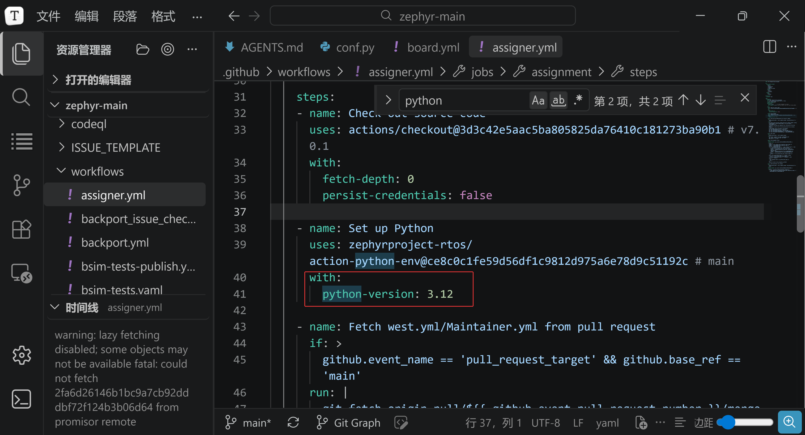
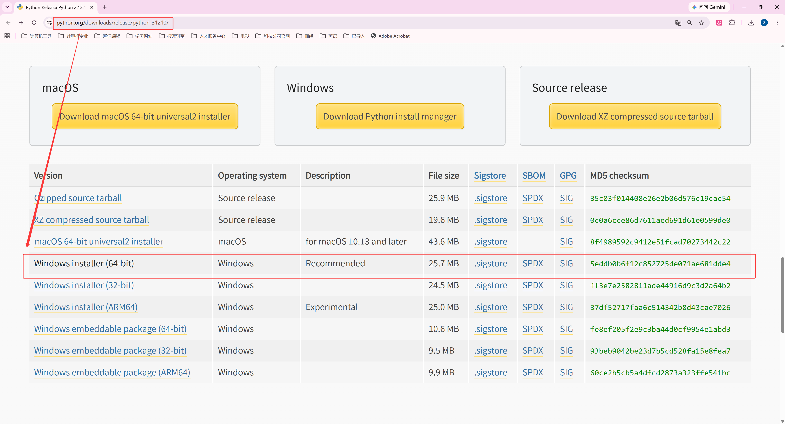
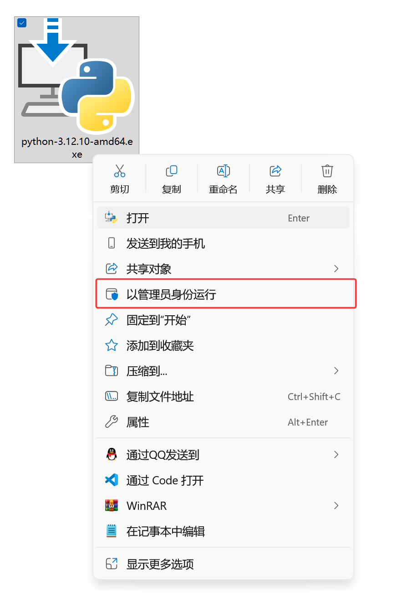
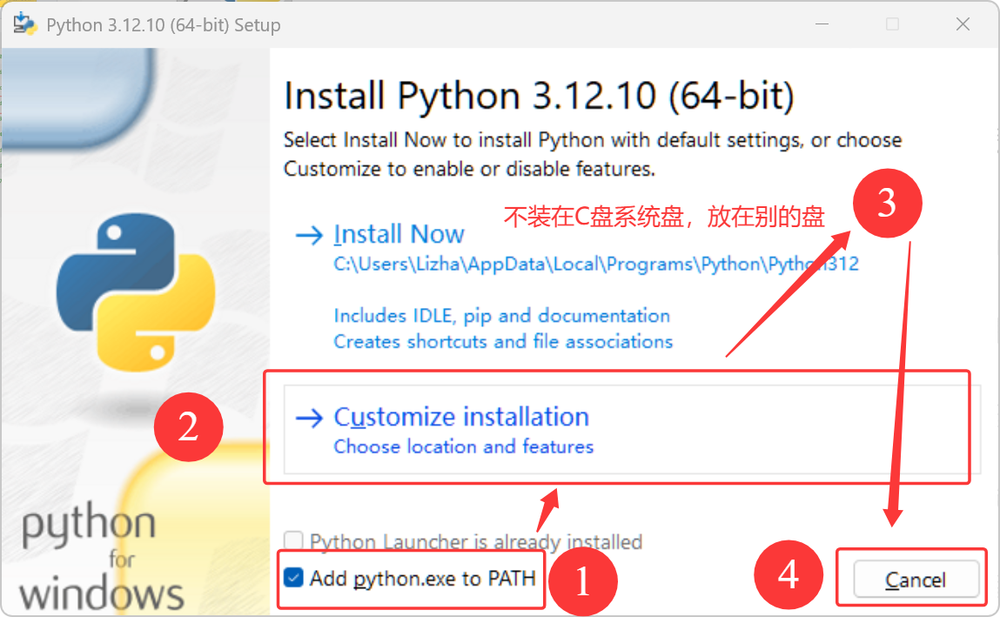
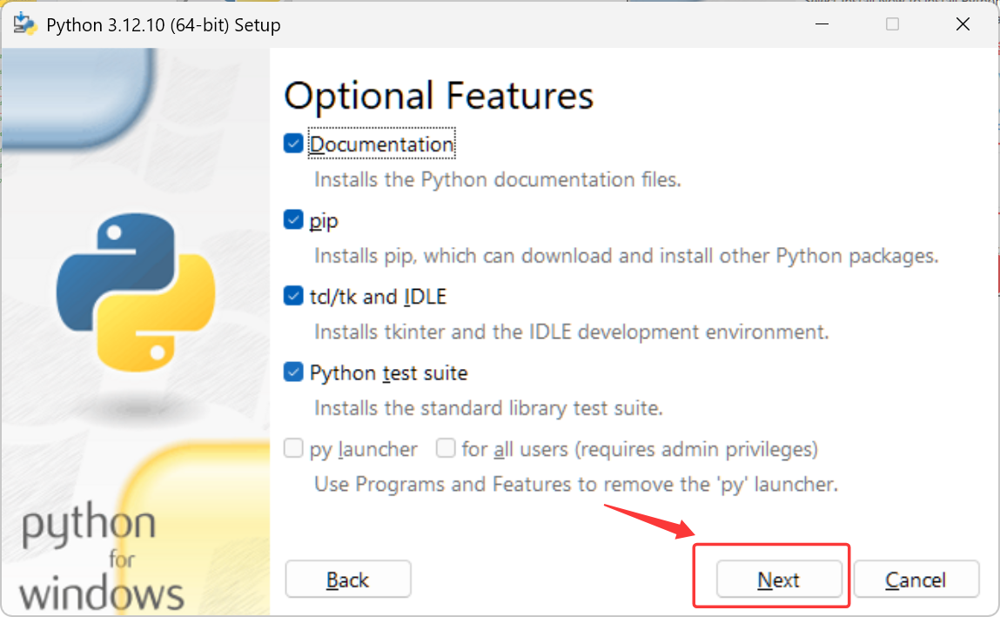
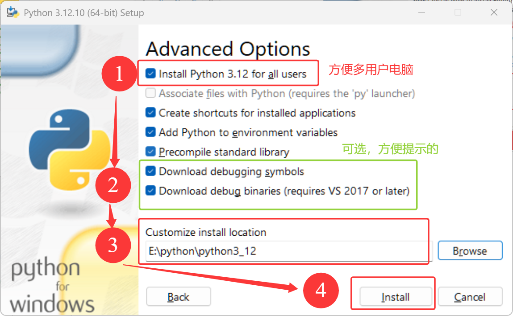
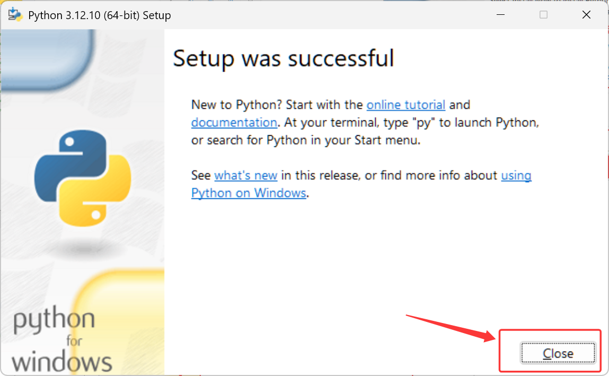
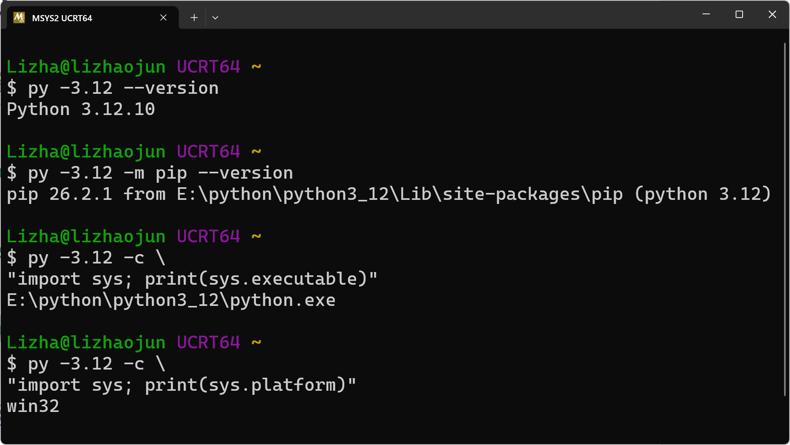
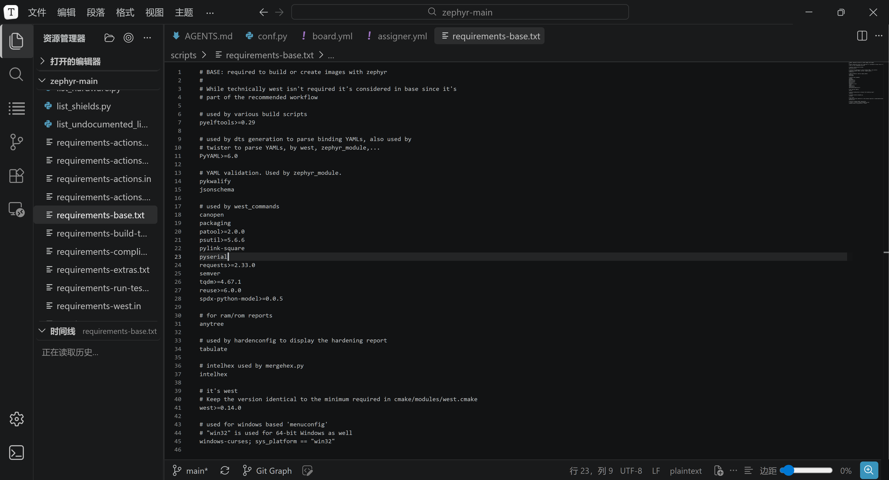

<!-- SPDX-License-Identifier: Apache-2.0 -->

# 第2章\_主机工具与Python环境

本模块目标：**得到可用的主机命令与工程 .venv。** 返回 [环境与依赖导航](环境与依赖导航.md)；配套 [PPT](slides/P002_主机工具与Python环境_Windows.pptx)。各章独立编号，完整复制单元按当前小节编号放在 [命令索引](commands/P002_Windows/README.md)。

实验源码根为 Windows 的 `G:\zephyr_practice\zephyr-main`，UCRT64 中为 `/g/zephyr_practice/zephyr-main`。默认 UCRT64；Windows 专用 setup.cmd 等步骤按正文切换 PowerShell。各模块不重复安装已经完成的前置工具。

<a id="section-2-1"></a>

## 2.1\_安装官方工具并回到\_UCRT64


先确认自己仍在上一期的终端里。进入某个叫 `ucrt64` 的文件夹并不会切换环境，判断依据是启动器和环境标识：

```bash
# 当前位置：任意目录；终端：MSYS2 UCRT64。
echo "$MSYSTEM"
echo "$MINGW_PREFIX"
```

应分别看到 `UCRT64` 和 `/ucrt64`。如果不是，重新打开 MSYS2 UCRT64，再回到本节。上一期没有完成系统更新的读者，先执行 `pacman -Syu`，按提示关闭并重开终端后继续更新；不要只同步软件包数据库而长期不升级系统。

### 2.1.1\_按官方 Windows 步骤安装主机工具

**当前阶段：Windows 主机依赖。终端暂时切换到 PowerShell 或 cmd.exe。** UCRT64 提供 Bash 操作习惯，主机仍是 Windows。工具包渠道按 Zephyr 对该操作系统的官方指南选择。

依据是实验源码内的 `doc/develop/getting_started/index.rst`，查找 `install_dependencies_windows`。完整来源、版本下限和源码更新后的复核方法见[主机工具与官方安装来源](主机工具与官方安装来源.md)。以下是 2026-10-05 核对到的官方原命令，作为来源对照：

```powershell
# Windows PowerShell 或 cmd.exe；任意目录。官方完整命令。
winget install Kitware.CMake Ninja-build.Ninja oss-winget.gperf Python.Python.3.12 Git.Git oss-winget.dtc wget 7zip.7zip
```

本教程后续仍固定 Windows CPython **3.12.10**。`Python.Python.3.12` 只标识系列，不承诺安装这个补丁号。因此本教程实际执行下面这一条，**与上面的完整命令二选一**，只省去 Python 项，其余保持官方包清单；随后在 2.1.2 或 2.1.3 使用 Python 官方安装器，已有 3.12.10 时直接复用：

```powershell
# Windows PowerShell 或 cmd.exe；本教程固定 Python 时使用。
winget --version
winget install Kitware.CMake Ninja-build.Ninja oss-winget.gperf Git.Git oss-winget.dtc wget 7zip.7zip
```

若没有 winget，先用[微软安装入口](https://aka.ms/getwinget)准备它。官方也允许从各工具自己的官网安装并配置 PATH，不能因缺少 winget 就悄悄切换工具来源。安装结束关闭旧终端，**重新打开 UCRT64；执行 SDK 的 setup.cmd 前也重新打开 PowerShell**，让新进程取得更新后的 Windows PATH。

```bash
# 终端：重新打开的 Windows UCRT64；任意目录。
type -a cmake ninja dtc gperf 7z
cmake --version
ninja --version
dtc --version
gperf --version
7z i
```

`type -a` 显示命令来自哪里，不能预设结果一定在 `/ucrt64/bin`。若旧 MSYS2 包抢在前面，先定位 Windows 安装目录，再把需要的工具目录临时放到 PATH 前面；方法见[官方安装来源的路径核对](主机工具与官方安装来源.md)。不要只看“已安装”就继续。

若刚安装后 setup 提示找不到 7z，先重新打开 PowerShell，再执行 `Get-Command cmake, 7z -ErrorAction Stop`。本次反馈是旧终端未刷新，无需重复安装；仅重新打开后仍找不到时才核对官方要求的 7-Zip 安装目录和 PATH。SDK 1.0.1 的 Windows `setup.cmd` 会查找外部 CMake 和 7z，因此下载 SDK 不能替代主机依赖安装。[SDK Windows setup 原件](https://github.com/zephyrproject-rtos/sdk-ng/blob/v1.0.1/scripts/template_setup_win)

本次指南下限为 CMake 3.28.0、Python 3.12、dtc 1.4.6。换源码后重新查表；若上游要求与教程固定版本冲突，应更新教程基线和验证记录，不忽略安装错误。

Windows CPython/west 调用 Git for Windows；不要只看 `git --version` 就以为已选对 Git。UCRT64 的 `/usr/bin/git` 属于 MSYS2，两套程序的参数处理可能不同。本机复核中 Windows west 调 MSYS2 Git 时，`^{commit}` 被解析成 `^commit`，导致 update 失败；改用 Git for Windows 后正常。

```bash
# Windows UCRT64；任意目录；查看 UCRT64 将找到哪个 Git。
type -a git
command -v git
```

若输出落在 MSYS2 的 usr/bin，先在资源管理器找到前面安装的 Git for Windows 的 `cmd` 目录（含 git.exe，默认常为 `C:\Program Files\Git\cmd`），再运行下块。`GIT_CMD_DIR` 只是本块接收粘贴路径的临时 Bash 变量，不是 Zephyr 设置；它立即用于 PATH，随后删除。不要填写作者电脑的安装位置，也不要重新安装一份 Git。

```bash
# Windows UCRT64；仅在需要调整 Git 优先级时执行；粘贴自己的 Windows 路径，不加引号。
read -r -p 'Git for Windows 的 cmd 目录：' GIT_CMD_DIR
if test -f "$(cygpath -u "$GIT_CMD_DIR")/git.exe"; then
  export PATH="$(cygpath -u "$GIT_CMD_DIR"):$PATH"
  hash -r
fi
unset GIT_CMD_DIR
command -v git
```

PATH 调整只影响当前 UCRT64 及其子进程；重开终端后重新检查，或把核对后的实际目录写入自己的 Bash 启动配置。前面的官方安装仍在 PowerShell 中，接下来 Git/west 命令继续在 UCRT64 执行。

### 2.1.2\_固定 Windows Python 3.12.10

本教程固定 **Windows CPython 3.12.10 x64**，west 固定 **1.5.0**，项目包统一装入源码根的 `.venv`。这里固定的是两个工具版本，不表示 pip 和所有传递依赖也已锁定。

原生源码的 `doc/develop/getting_started/index.rst` 给出主机要求，`cmake/modules/python.cmake` 的 `PYTHON_MINIMUM_REQUIRED` 检查最低版本；它们没有要求只能使用 3.12.10。`.github/workflows/assigner.yml` 中的 `python-version: 3.12` 只为该 CI 任务选择解释器，不能作为所有构建的版本要求。PPT 保留该截图用于对照两种用途。



先分清“下载过安装器”和“安装过 Python”：电脑里有一个 `.exe` 文件，只能说明安装器已取得。先在 UCRT64 执行下面的版本选择；输出为 3.12.10 就复用已有安装，不必找到或复制教程中的安装目录。

```bash
# Windows UCRT64；任意目录；检查已安装的 3.12 系列解释器。
py -3.12 --version
```

若提示找不到 `py`，先看 2.1.4 的无 Launcher 分支，不立即断定 Python 未安装。若 Launcher 明确报告没有 3.12，再从下列两种安装方式选一种。`-3.12` 选择的是系列，输出中的补丁号仍须核对为本教程的 3.12.10。

[Python 3.12.10 发行页](https://www.python.org/downloads/release/python-31210/)提供本章的 Windows 安装器。这是 3.12 系列最后一个完整维护版本，后续版本仅做安全修复；3.12.10 用作本教程的可复现安装基线，不代表最新安全版本。不要执行 `pacman -S mingw-w64-ucrt-x86_64-python` 来“固定 3.12”：MSYS2 是滚动仓库，该命令取得仓库当时的版本，且 MSYS2 Python 与官方 Windows Python 的包兼容性不同。版本变化可查 [MSYS2 Python 包页](https://packages.msys2.org/packages/mingw-w64-ucrt-x86_64-python)；正文不写死它将来安装哪个版本。

下面三种操作各有目的：Windows 图形安装和 UCRT64 命令安装是**二选一**的基础解释器安装方式；随后都检查 UCRT64 如何定位解释器；最后统一创建 `.venv`。如果机器已有 3.12.10，不再重复安装，直接进入 2.1.4。已有本项目 `.venv` 的读者直接按 2.2.2 激活并检查，版本正确即可继续。



Windows 图形安装：仅在尚未安装所需版本时，打开上述发行页，在 **Files** 表选择 **Windows installer (64-bit)**，文件名为 `python-3.12.10-amd64.exe`。`amd64` 也适用于 Intel x64 电脑。默认安装位置即可；选择 Customize installation 时也可以保留自己已有的工具目录。保留 pip 和 Python Launcher；Python Launcher（`py`）可用于发现解释器，Add python.exe to PATH 则控制命令搜索路径，两者作用不同。安装完成后重开 UCRT64。不要下载源码包或 embeddable package 来替代完整安装器。





以下两张截图与 PPT 的 Windows 安装步骤同步。目录示范是 `E:\python\python3_12`，不是必选路径；调试符号和调试二进制是可选项，Zephyr 基础环境不要求勾选。







### 2.1.3\_从 UCRT64 下载并安装官方 Python

这条路线与上面的图形安装二选一，安装的仍是 Windows CPython。它只改变下载、启动安装器的操作方式，安装后的使用方式相同。已有 3.12.10 时直接跳到 2.1.4。

先看 Windows 下载目录是否已经保存官方 `python-3.12.10-amd64.exe`。已有文件时，核对来源和文件属性中的数字签名，直接从资源管理器运行；不用为了匹配下方路径再下载一份。没有安装器时，下面将它保存到 `G:\zephyr_practice\downloads`，对应 UCRT64 的 `/g/zephyr_practice/downloads`。这里仅保存下载文件，Python 不会安装在这个目录。

```bash
# Windows UCRT64；仅在没有官方 3.12.10 安装器时下载。
mkdir -p /g/zephyr_practice/downloads
cd /g/zephyr_practice/downloads
curl -fL https://www.python.org/ftp/python/3.12.10/python-3.12.10-amd64.exe \
  -o python-3.12.10-amd64.exe
```

下载正常结束后，在同一终端执行下面的安装命令。若 curl 报错，先解决下载问题，不启动未下载完整的文件。安装器采用 Windows 的默认用户安装位置，不放入 Zephyr 源码或 `build`。

```bash
# Windows UCRT64；官方安装器已完整下载，尚未安装该版本。
cd /g/zephyr_practice/downloads
MSYS2_ARG_CONV_EXCL='*' ./python-3.12.10-amd64.exe \
  /passive InstallAllUsers=0 PrependPath=1 \
  Include_pip=1 Include_launcher=1 InstallLauncherAllUsers=0 Include_test=0
```

`/passive` 显示安装进度；`InstallAllUsers=0` 使用当前用户安装；`Include_launcher=1` 保留按版本选择的 `py`；`InstallLauncherAllUsers=0` 将 Launcher 也装给当前用户。`PrependPath=1` 让新开的终端能找到 Python 短命令，`Include_pip=1` 保留包安装器。`MSYS2_ARG_CONV_EXCL` 是 MSYS2 原生变量，仅对本条命令防止 `/passive` 被改写为路径。参数依据见 [Python 官方安装说明](https://docs.python.org/3.12/using/windows.html#installing-without-ui)。

等待安装成功后，关闭当前 UCRT64 并重新打开，再按下一节选择解释器。若进入 Modify/Repair 维护界面，说明已有安装；先核对版本，不能用换目录的方式假定安装了第二份。

### 2.1.4\_用版本选择解释器，再交给虚拟环境

`py -3.12` 让 Windows Launcher 查找已安装的 3.12 解释器，安装在 C 盘还是 E 盘都不改变这条命令。`python` 则由当前终端的 PATH 决定。前者能执行而后者报 `command not found`，通常只是短命令尚未进入 PATH；不需要为此重装或移动 Python。

```bash
# Windows UCRT64；安装完成后重新打开的终端，任意目录。
py -3.12 --version
py -3.12 -m pip --version
```

确认第一行是 Python 3.12.10，就可以用 `py -3.12 -m venv .venv` 创建工程环境，具体位置见 2.2.1。pip 输出中出现安装路径只是说明它属于哪个 Python，**不要求你的路径与截图一致，也不要求复现一个测试目录**。



截图保留了当时的 `sys.executable` 和 `win32` 输出，用于解释“这是 Windows Python”。日常步骤只需要选择版本和激活环境，不必重复获取这些路径。

**没有 Launcher，但 python 已可执行。** 如果安装时选过 Add python.exe to PATH，重新打开 UCRT64 后可以检查：

```bash
# Windows UCRT64；任意目录；只用于 py 不存在但 python 可执行的分支。
python --version
python -m pip --version
```

只有输出同样为 3.12.10 时，才将下一节创建命令换为 `python -m venv .venv`。版本不符时不要使用它创建环境；可以用官方安装器 Modify 补上 Launcher 后使用 `py -3.12`。若两个命令都找不到，先重新打开终端，再检查 Windows“已安装的应用”或安装器维护界面，确认是否已安装及是否勾选 Launcher/PATH。

这两种入口都只负责第一次创建 `.venv`。激活之后，后续统一用 `python -m pip`、`python -m west` 和 `python 脚本.py`；不要继续用带版本的 `py -3.12 -m pip` 安装项目依赖，否则会选回基础解释器。项目环境的激活会为当前 Bash 设置命令查找顺序，无需另写基础 Python 的路径变量或修改 `.bashrc`。

<a id="section-2-2"></a>

## 2.2\_给正确的\_Python\_安装依赖包


现在基础 Python 已经能执行，但 Zephyr 的配置脚本还需要 Python 库。把包直接装进电脑的全局 Python，会让不同项目共享同一份版本选择。本期使用 **Python 虚拟环境（virtual environment，venv）**：为项目准备独立的解释器入口和包目录，安装动作由这个环境自己的 **pip 包安装器** 完成。

下面继续在同一份实验源码中创建 `.venv`，再说明下次打开终端如何恢复。本主线不另建 `build/learning-tools/west-textbook-tools`，避免后续命令混用两个环境。HC32 适配也沿用这里的环境，不要求尚未创建的项目安装脚本。

### 2.2.1\_上一期下载的是上游\_Zephyr\_源码

回到上一期的源码目录。这里使用 `.venv` 作为本次练习自定的环境目录名；如果已经有可用 `.venv`，直接激活并检查，不覆盖或删除现有环境。下面直接使用 UCRT64 路径：

```bash
# 当前位置：任意目录；终端：UCRT64。输入上游源码根目录。
cd /g/zephyr_practice/zephyr-main
# 当前位置：上游 Zephyr 源码根目录。
ls VERSION SDK_VERSION scripts/requirements-base.txt
```

确认源码目录后，使用 2.1.4 已核对为 3.12.10 的 Launcher 创建环境。下面是**第一次创建**的步骤；若本目录已经有 `.venv`，直接用 2.2.2 激活并检查。

```bash
# 当前位置：上游 Zephyr 源码根目录；终端：UCRT64。
py -3.12 -m venv .venv
source .venv/Scripts/activate
python --version
python -m pip --version
```

先确认 2.1 节选定的基础解释器为 3.12.10，再创建环境；`source` 让当前 Bash 优先使用它，最后确认选择结果。pip 输出应包含当前工程的 `.venv`，它用于确认项目包的归属，盘符不必与截图一致。即使终端是 Bash，Windows Python 的激活脚本仍在 `Scripts/activate`，不是 Linux 教程里的 `bin/activate`。

现在才开始安装包，避免把“装了哪个包”和“给哪个 Python 装包”混在一起：

```bash
# 当前位置：上游 Zephyr 源码根目录；终端：UCRT64，已激活 .venv。
python -m pip install -r scripts/requirements-base.txt "west==1.5.0"
python -m pip check
python -m west --version
```

`west==1.5.0` 与 `-r` 放在同一次解析中，固定本教程使用的 west，版本见 [west 1.5.0 官方发布记录](https://pypi.org/project/west/1.5.0/)。源码升级后若依赖冲突，先核对版本要求，不忽略错误继续安装。`-r` 让 pip 读取当前源码列出的包要求；pip 从包索引解析并下载适合此解释器的文件，放入 `.venv`。此修订的 base 清单包含 west；若使用的其他修订拆分了依赖文件，按该修订的说明选择清单。成功后 `pip check` 应报告 `No broken requirements found.`，west 应返回 `West version: v1.5.0`。测试、文档生成等任务可能还需要额外依赖，本节只建立基础构建工具环境。

下载慢时可以仅对这次安装指定索引，例如把安装命令替换为 `python -m pip install -i https://pypi.tuna.tsinghua.edu.cn/simple -r scripts/requirements-base.txt "west==1.5.0"`。这只影响 pip，不影响 SDK；镜像缺包或同步延迟时恢复默认索引重试，先保留原始错误信息。不要通过关闭证书校验来处理普通的超时。

west 可以运行，只表示管理工具已安装。上游 Zephyr 的 `west.yml` 还会声明其他源码仓库及版本，下载那些模块是另一件事；本章 5.2 节按原生 west.yml 取得 CMSIS_6；P007 再通过 CMake 接入这些已下载的源码；更完整的模块管理继续见 [west 大纲](../west/大纲.md)。

### 2.2.2\_重新打开终端后恢复环境

工具安装完成后，重新开一个 UCRT64 窗口，确认环境能从磁盘恢复：

```bash
# 当前位置：任意目录；终端：UCRT64。
cd /g/zephyr_practice/zephyr-main
source .venv/Scripts/activate
python --version
python -m pip --version
python -m pip check
python -m west --version
```

Python 应为 3.12.10，pip 应属于当前项目 `.venv`，包依赖检查通过，west 返回 1.5.0。这里只恢复 Python 工具环境；SDK 在后续按包记录自动发现；只有需要追加的模块才提供路径，接口分工先读 P003。虚拟环境不会替你选择板卡，也不会自动下载清单中的源码。

基础 Python 依赖来自当前源码，下面截图仅用于定位，实际内容以当前 checkout 为准。



继续准备 SDK 与源码依赖，全部完成后再进入 P007。


上一篇：[P001 源码准备](P001_准备UCRT64环境与下载Zephyr_Windows.md)。

下一模块：[P003 Zephyr 的 CMake 接口体系](P003_Zephyr的CMake接口体系_Windows.md)。
