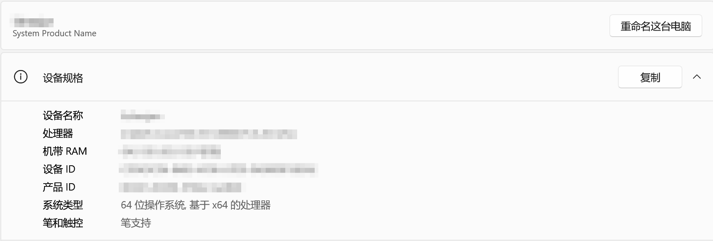
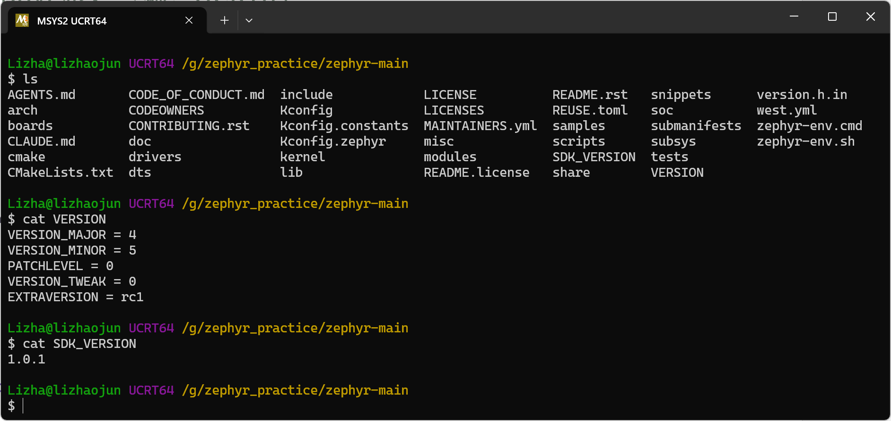
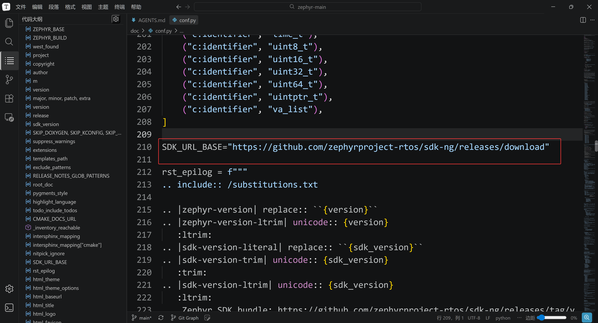
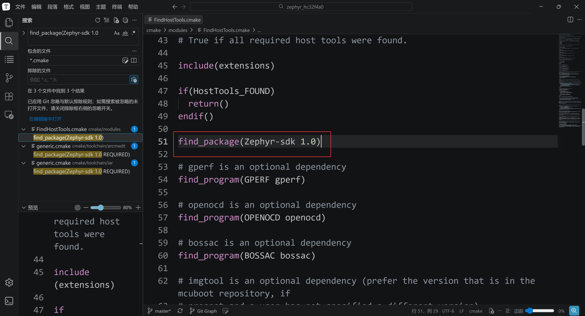
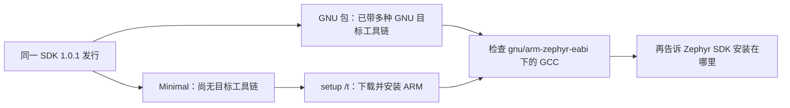
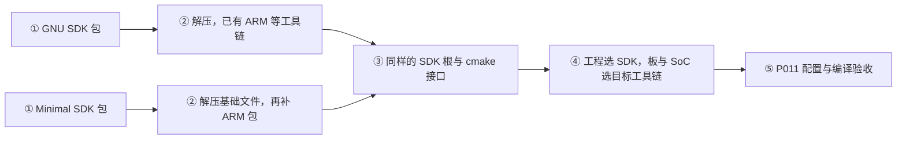
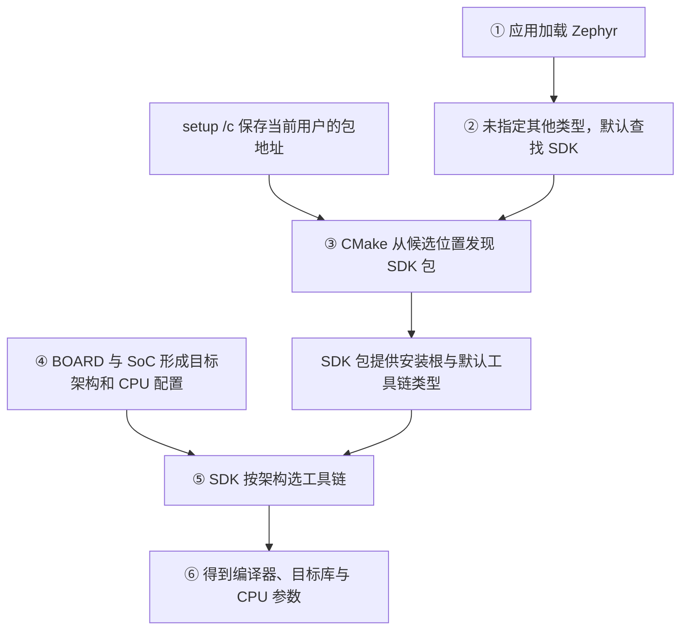
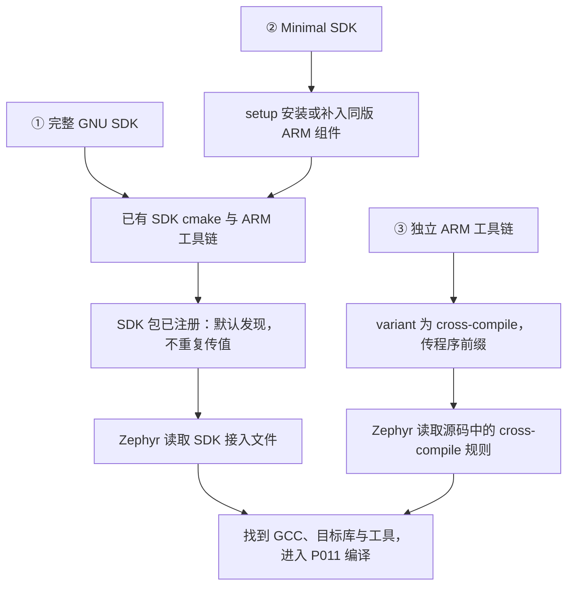
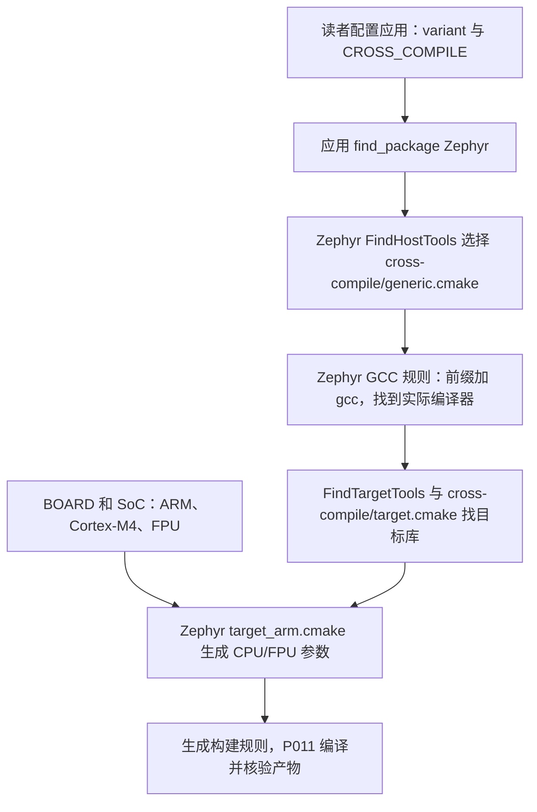
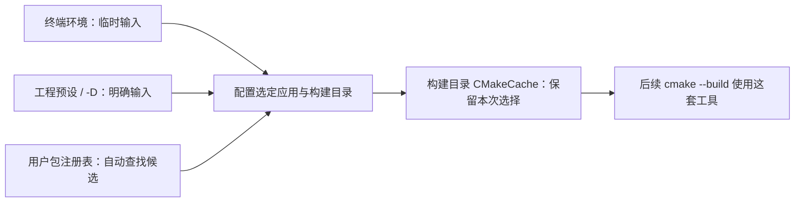

<!-- SPDX-License-Identifier: Apache-2.0 -->

# 第3章\_SDK准备与编译器选型

本模块目标：**准备 SDK，并理解工程如何接收 SDK 根、按芯片配置选择编译器。** 返回 [环境与依赖导航](环境与依赖导航.md)；配套 [PPT](slides/P003_SDK准备与编译器选型_Windows.pptx)。各章独立编号，完整复制单元按当前小节编号放在 [命令索引](commands/P003_Windows/README.md)。

实验源码根为 Windows 的 `G:\zephyr_practice\zephyr-main`，UCRT64 中为 `/g/zephyr_practice/zephyr-main`。默认 UCRT64；Windows 专用 setup.cmd 等步骤按正文切换 PowerShell。各模块不重复安装已经完成的前置工具。

前置材料：完成 [P002 主机工具与 Python](P002_主机工具与Python环境_Windows.md)。先准备 SDK；CMake 基础在 P006，接口模型在 P009 展开，不是本章下载的前提。

**复制命令：** [本章完整操作单元](commands/P003_Windows/README.md)。按正文选择分支，不把整个目录的命令依次执行。

**视频与复习对照：** 页码按当前正式 PPT；以阶段名称和正文链接定位，操作前提、完整命令、输出判断与恢复以 Markdown 为准。

| PPT 页面 | 阶段 | 完整正文 | 正文进一步展开 |
| --- | --- | --- | --- |
| 2—14 | 版本依据与三种归档 | [3.1](#section-3-1) | 发行、主机、目标架构及包内目录分别判断 |
| 15—26 | 摘要、解压与缺少组件时的补装 | [3.2.1](#section-3-2-1) | 完整 GNU 跳过补装、PowerShell setup 与 UCRT64 核验 |
| 27—34 | 三条接入路线与芯片选型 | [3.2.4](#section-3-2-4) | SDK 自动发现和独立工具链接口分开 |
| 35—42 | 配置保存范围与注册 | [3.2.5](#section-3-2-5) | 环境、缓存、预设、用户包注册表和 venv 的边界 |
| 43—45 | 增加工具链或源码包 | [3.2.8](#section-3-2-8) | 新芯片、补装组件和外部编译器的不同入口 |

<a id="section-3-1"></a>

## 3.1\_在发行页选对\_SDK\_压缩包


源码版本先于下载页面决定选择。进入自己上一期下载的源码根目录——这里应该能看到 `VERSION`、`SDK_VERSION`、`scripts` 等文件：

```bash
# 当前位置：已下载的 Zephyr 源码根目录；终端：UCRT64。
pwd
cat VERSION
cat SDK_VERSION
```

这份原生源码的 `VERSION` 为 **4.5.0-rc1**，`SDK_VERSION` 为 **1.0.1**。按下面顺序在解压根目录查证，直接核对这份源码自身的文件：

| 原生文件或官方入口 | 能得出什么结论 |
| --- | --- |
| `VERSION` | 源码自己的版本号；main 目录名不代表固定版本 |
| `SDK_VERSION` | 此修订默认安装/文档推荐的 SDK 版本为 1.0.1 |
| `scripts/west_commands/sdk.py` | west sdk install 未传 --version 时读取 SDK_VERSION |
| `doc/conf.py` | 读取 SDK_VERSION，生成文档中的 SDK 下载 URL 与版本替换文本 |
| `doc/develop/toolchains/zephyr_sdk.rst` | 解释推荐版本、架构支持与安装，链接官方兼容矩阵 |
| `cmake/modules/FindHostTools.cmake` | 请求 find_package(Zephyr-sdk 1.0)，由查找模块和 SDK 版本文件参与兼容判断 |
| SDK 1.0.1 Release → Included Components | 包含 GCC 14.3.0（Zephyr 补丁版）、Binutils 2.43.1、GDB 16.2 |

原生代码与原始文档可从[固定修订源码](https://github.com/zephyrproject-rtos/zephyr/tree/3777ab91262f93c2c2da7e1ab8cff4e8ea5f4ce4)打开上表路径。`SDK_VERSION=1.0.1` 是默认/推荐选择，`find_package(... 1.0)` 是构建时兼容请求，二者用途不同。SDK 发行再决定其中 GCC 的版本，没有“芯片型号直接计算 SDK/GCC 版本”的公式，也没有宣称这一 Zephyr 只能使用唯一一个 GCC。

原生 [boards/arm/mps2/board.yml](https://github.com/zephyrproject-rtos/zephyr/blob/3777ab91262f93c2c2da7e1ab8cff4e8ea5f4ce4/boards/arm/mps2/board.yml)提供 `mps2/an386`；其 SoC Kconfig 选择 ARM/Cortex-M4。Zephyr 的工具链入口加载 SDK 的 `cmake/zephyr/gnu/target.cmake`，后者把 32 位 `ARCH=arm` 映射成 `arm-zephyr-eabi`，再由 CPU 配置产生具体参数。因此工具链文件名按架构找，不按厂商芯片型号找。

**这份原生仓库没有 HC32/UYUP 支持。** HC32F4A0 属于 Cortex-M4，可沿同一架构规则选择 ARM 工具链；但 HC32 的 board、SoC、设备树与驱动必须由移植实现提供。后续 P011 用已有的 mps2/an386 编译，再说明 HC32 新增支持的条件，不能冒充上游已支持 HC32。

打开 [Zephyr SDK 1.0.1 官方发行页](https://github.com/zephyrproject-rtos/sdk-ng/releases/tag/v1.0.1)。本期按下面顺序点击：

1. 找到页面中的 **Downloads → SDK Bundle** 表。
2. 找到 **Windows** 行。
3. 选择 **GNU** 列中的 **x86-64** 链接。
4. 确认下载文件名为 `zephyr-sdk-1.0.1_windows-x86_64_gnu.7z`。
5. 在同一发行版附件中取得 `sha256.sum`，与压缩包放在一起。

也可以直接使用该版本的官方附件：[Windows GNU SDK](https://github.com/zephyrproject-rtos/sdk-ng/releases/download/v1.0.1/zephyr-sdk-1.0.1_windows-x86_64_gnu.7z)、[SHA-256 清单](https://github.com/zephyrproject-rtos/sdk-ng/releases/download/v1.0.1/sha256.sum)。这两个链接固定在 1.0.1，不能只改其中一个文件的版本。

文件名里的 `windows-x86_64` 说明工具运行在哪种电脑上；稍后选择的 `arm-zephyr-eabi` 说明编译器为哪类目标生成代码。**用 x64 电脑开发 ARM 单片机，下载的仍是 Windows x86-64 主机包。** UCRT64 的 Bash 看起来像 Linux 终端，也不意味着应下载 Linux SDK。

以下截图与 PPT 的 SDK 依据阶段同步，分别记录 Windows 主机架构、源码版本，以及源码如何读取或请求 SDK 版本。截图是查证位置的示范；重新下载源码后要再执行上面的命令，不能把截图当作当前环境已经编译成功的证据。









### 3.1.1\_先理解 SDK 中装的是什么，再选 GNU 或 Minimal

电脑现在能运行 Python 和 CMake，但 HC32 不能运行 Windows 程序。把同一份 C 代码变成 Cortex-M 能执行的机器码，需要**交叉编译工具链**：编译器处理源文件，链接器组合目标文件与库，objcopy 等工具处理固件格式。这些程序在 Windows 电脑上运行，输出面向开发板。

Zephyr SDK 是把这些工具、配套目标库与 CMake 接入文件按版本组织在一起的发行包。**SDK 1.0.1 是整套发行的版本，GCC 14.3.0 是其中编译器组件的版本，arm-zephyr-eabi 是一套目标工具链的名称**。它们不是三个互相替代的版本号。多个目标架构也不是多个 GCC 版本：ARM、RISC-V、AArch64 等工具链可以属于同一次 SDK 发行。

发行页提供不同的打包方式。Windows GNU 包预先带上这次发行支持的多种 GNU 目标工具链；Minimal 包留下 SDK 基础文件，让你再选需要的工具链下载。它们的区别主要在于**解压时已经带来了哪些工具**，不是一个正式版、一个不完整的试用版。本章保留 GNU 包主线，已经下载大包的读者可以直接使用；只做本系列两种 Cortex-M4 目标的读者可改选 Minimal，再补 ARM。

| 在 Downloads → SDK Bundle 中选择 | 解压后是什么状态 | 下一步 |
| --- | --- | --- |
| Windows → GNU → x86-64 | 含 `gnu/arm-zephyr-eabi` 等多种目标工具链 | 先运行 ARM GCC 检查；不需要为了 ARM 重复下载 |
| Windows → Minimal → x86-64 | 不含目标工具链；`setup.cmd`、`sdk_version`、`cmake` 等基础文件由包提供 | 执行 `/t arm-zephyr-eabi` 安装 ARM 工具链 |
| Windows → LLVM → x86-64 | 采用 LLVM 编译器家族的包 | 本章使用 GNU，不混用目录和命令 |
| 页面末尾 Source code | SDK 构建工程的源码 | 不能当作可直接运行的 SDK 安装包 |

GNU 包名是 `zephyr-sdk-1.0.1_windows-x86_64_gnu.7z`，Minimal 包名是 `zephyr-sdk-1.0.1_windows-x86_64_minimal.7z`。若走 Minimal 路线，下载、摘要检查和解压命令中的归档名均改为后者；安装根仍由包内的 `sdk_version` 判断。不要把 Source code 下载按钮当成 Minimal。



现在可以根据目标作选择了：HC32F4A0 的 Cortex-M4F 和示例 AN386 都属于 32 位 Arm Cortex-M，使用 `arm-zephyr-eabi`。不需要给每块板重新下载一个以板名命名的 SDK，也不应选择面向 AArch64 的工具链。具体 CPU/FPU 参数由 P011 的板与 SoC 配置产生，安装时先取得对应架构的工具。

依据：[SDK 1.0.1 发行表](https://github.com/zephyrproject-rtos/sdk-ng/releases/tag/v1.0.1)。换 SDK 代际时重新看发行表及包内脚本，不照抄另一代目录布局。

### 3.1.2\_三种归档，分别把什么放到磁盘上

在下载页中看到 `zephyr-sdk` 和 `toolchain_gnu` 时，先看前缀，再看主机与目标。这里有三个对象，而非两种工程：

| 归档 | 自带内容 | 能否直接作为 Zephyr SDK 根 |
| --- | --- | --- |
| `zephyr-sdk-1.0.1_windows-x86_64_gnu.7z` | SDK 基础文件、主机工具和多种 GNU 目标工具链 | 解压后内层 `zephyr-sdk-1.0.1` 可以 |
| `zephyr-sdk-1.0.1_windows-x86_64_minimal.7z` | SDK 基础文件与该主机包的 host tools；尚无目标工具链 | 根目录可以被发现，但必须补齐本次目标工具链才可编译 |
| `toolchain_gnu_windows-x86_64_arm-zephyr-eabi.7z` | 只有一套 ARM GNU 工具链及其库 | 不可以；该包没有 SDK 的 `cmake/Zephyr-sdkConfig.cmake` |

第三种包属于它所在的 SDK **发行版本**。文件名没有 `1.0.1`，版本依据在下载页面的 `v1.0.1` 和同页 SHA-256 清单中。不要把其他 Release 的同名工具链包混进去。本机 `G:\zephyr_practice` 的完整 GNU 包和独立 ARM 包，正好可用来对照这两层包装；读者只选自己所需路线，不必为了比较重复下载大包。

用 7-Zip 打开归档但先不解压，GNU 包能看到 `zephyr-sdk-1.0.1/gnu/arm-zephyr-eabi/…`，独立 ARM 包则从 `arm-zephyr-eabi/…` 开始。后者要放入 **SDK 根/gnu**，才能形成前者的同样层次。资源管理器自动增加的压缩包名外层目录不属于这个布局。

```text
zephyr-sdk-1.0.1/                    # 官方 SDK 包中的根目录
├── sdk_version                     # 官方发行版本文件
├── sdk_gnu_toolchains              # 官方脚本支持的 GNU 目标名称清单
├── setup.cmd                       # Windows SDK 官方安装脚本
├── cmake/                          # 官方工程接入文件，两种 SDK 包共有
│   ├── Zephyr-sdkConfig.cmake
│   ├── Zephyr-sdkConfigVersion.cmake
│   ├── zephyr_sdk_export.cmake
│   └── zephyr/gnu/target.cmake
├── hosttools/                      # 官方主机配套工具，内容取决于平台
└── gnu/
    └── arm-zephyr-eabi/             # GNU 包已带；Minimal 补装后产生
        ├── bin/arm-zephyr-eabi-gcc.exe
        └── arm-zephyr-eabi/         # 目标头文件与库等 sysroot 内容
```

因此，两条路线的差别发生在**准备工具**阶段：GNU 包解压后核对 ARM 工具链；Minimal 解压后安装 ARM，再做相同核对。到**接入工程**阶段，它们都把含 `cmake` 的 SDK 根交给同一套 Zephyr 查找规则，工程不会读取归档文件名来判断你曾经选了 GNU 还是 Minimal。



不要把 `hosttools` 理解成所有主机均有相同程序。例如本机 Windows 1.0.1 包带有安装时使用的下载工具，而 `setup.cmd` 的 `/h` 分支会跳过。QEMU 是否存在要单独检查；它不影响这里区分 SDK 基础框架和 ARM 工具链。


#### 3.1.2.1\_对照手上的目录：独立 ARM 包不是 Minimal SDK

先把下载页面上的两张表分开看。在 [SDK 1.0.1 发行页](https://github.com/zephyrproject-rtos/sdk-ng/releases/tag/v1.0.1)，**SDK Bundle → Windows → Minimal → x86-64** 下载的是 `zephyr-sdk-1.0.1_windows-x86_64_minimal.7z`；下面 **GNU Toolchains → arm-zephyr-eabi → Windows → x86-64** 下载的才是 `toolchain_gnu_windows-x86_64_arm-zephyr-eabi.7z`。后者是一个目标组件，不能因体积较小就称作 Minimal SDK。

本次整理后的独立工具链根是 Windows 的 `G:\zephyr_practice\arm-zephyr-eabi`，UCRT64 写作 `/g/zephyr_practice/arm-zephyr-eabi`。压缩包仍叫 `toolchain_gnu_windows-x86_64_arm-zephyr-eabi.7z`，压缩包名与实际安装目录名不要混用。2026-10-06 核对其内容如下；所有子文件均由官方 ARM 工具链归档提供，无需手动新建 CMake 文件：

```text
arm-zephyr-eabi/                            # G:/zephyr_practice 下的独立工具链根
├── bin/arm-zephyr-eabi-gcc.exe              # Windows 上运行的 ARM GCC
├── bin/arm-zephyr-eabi-objcopy.exe          # 同前缀配套程序
├── include/、lib/、libexec/、share/         # 官方工具链配套内容
└── arm-zephyr-eabi/                        # 目标头文件与库，保留此内层
    ├── include/
    └── lib/
```

这个目录没有 `sdk_version`、`setup.cmd` 和 `cmake/Zephyr-sdkConfig.cmake`，是**独立工具链的正常结构**，不是解压时丢了 CMake。不要照着 SDK 目录树自行创建这些文件，也不要将这里填入 `ZEPHYR_SDK_INSTALL_DIR`。该变量要求的是 SDK 包的根，而非任意带 GCC 的目录。

还要区分 **CMake 程序**与 **CMake 接入文件**。电脑运行的 `cmake.exe` 是 P002 安装的主机工具，三条路线都需要它；SDK 中的 `cmake/*.cmake` 是供该程序读取的脚本，不是另一份 CMake 程序。独立 ARM 包没有这组 SDK 脚本，仍能由 Zephyr 源码中现成的 `cross-compile` 脚本接入，见 3.2.4.2。

真正的 Minimal SDK 保留 SDK 的 CMake 接入文件。依据可以追到 [SDK v1.0.1 官方打包流程](https://github.com/zephyrproject-rtos/sdk-ng/blob/v1.0.1/.github/workflows/ci.yml#L1456-L1514)：先写入版本、工具链清单，放入 CMake 包、主机工具和 setup 脚本，再打出 `_minimal` 归档，之后才往 `gnu` 加入工具链。本次新增下载的 Minimal 归档也已用 `7z l` 核对，确实包含上述 CMake 配置、sdk_version 和 setup.cmd；仅列出归档内容，不将其解压覆盖现有完整 SDK。


本次整理后的 Windows 目录如下，路径在 UCRT64 中对应 `/g/zephyr_practice`。压缩包保持原名；已安装工具直接放在工作区父目录下：

```text
G:/zephyr_practice/
├── zephyr-main/                 # Zephyr 源码与项目 .venv
├── .west/                       # west 已生成的工作区配置
├── modules/                     # west 下载的源码模块
├── zephyr-sdk-1.0.1/             # 完整 SDK 根：sdk_version、setup.cmd、cmake、gnu
├── arm-zephyr-eabi/              # 独立 ARM 工具链根：bin、lib、目标库
│   └── arm-zephyr-eabi/          # 目标头文件与库；这一层不是多余包装
├── hal_xhsc-zephyr/              # 已下载的 HAL 解压目录，接入以 P004/P005 为准
├── zephyr-sdk-1.0.1_windows-x86_64_gnu.7z
├── zephyr-sdk-1.0.1_windows-x86_64_minimal.7z
└── toolchain_gnu_windows-x86_64_arm-zephyr-eabi.7z
```

Minimal 归档内也叫 `zephyr-sdk-1.0.1`。目前该目录已有完整 GNU SDK，不能为了比较三种包再把 Minimal 解压覆盖进去；只查看归档即可。独立工具链与 SDK 内的 ARM 工具链是两个可选位置，配置工程时按所选路线传入对应路径。

目录移动后，旧构建的 CMakeCache、编译器路径与 SDK 用户包记录不会自动改写。P011 改用带 `-layout2` 的新构建目录，按新位置重新配置；不移动、删除或改写旧缓存。需要自动查找 SDK 时，从新 SDK 根重新执行 3.2.6 的可选 `/c`；显式指定路径无需这一动作。

### 3.1.3\_下载慢时先判断是哪条通道

浏览器下载 SDK 附件不使用 `git config http.proxy`。如果上一期只给 Git 配置了代理，不能因此认为浏览器也已走代理；对应配置见[代理说明](../download_zephyr/代理配置.md)。先确认浏览器能打开发行页，并完成一个小附件下载，再重试大包。

本期优先使用浏览器下载，方便观察进度及保存位置。录制时可提前准备大包，现场演示选择入口和校验步骤。保留足够空间同时存放压缩包与解压文件；不能把网页上的压缩包大小当作全部安装占用。

<a id="section-3-2"></a>

## 3.2\_从压缩包走到可执行的\_ARM\_编译器


现在有了两个下载文件。压缩包还只是磁盘上的归档；我们先确认它没有下载错误，再把工具解到源码仓库以外的目录。这样多个项目可以共用同一套 SDK，项目 Git 也不会混入体积很大的可执行文件。

已下载的 SDK 压缩包可以直接留在 Windows 的 `G:\zephyr_practice`，不必为了目录名重新下载。本节从对应的 UCRT64 目录 `/g/zephyr_practice` 校验、解压；若保存在其他目录，先 `cd` 到实际位置。

<a id="section-3-2-1"></a>

### 3.2.1\_检查文件摘要

先用浏览器将压缩包和校验清单保存到 Windows 目录 `G:\zephyr_practice`。在 UCRT64 中用 `/g/...` 进入同一个目录；`cd` 切换目录，`ls` 列出文件：

```bash
# 当前位置：任意目录；终端：Windows 的 UCRT64 Bash。
cd /g/zephyr_practice
# 当前位置：保存 SDK 压缩包和 sha256.sum 的下载目录。
pwd
ls zephyr-sdk-1.0.1_windows-x86_64_gnu.7z sha256.sum
```

`ls` 应列出两个文件。若保存到了别处，可以先用 `read -r -p 'Windows 下载目录（不带引号）: ' DOWNLOAD_INPUT` 接收资源管理器路径，再执行 `cd "$(cygpath -u "$DOWNLOAD_INPUT")"`；不要直接写未转换的 Windows 反斜杠路径。`cd` 失败时先修正路径，不继续后面的步骤。

**SHA-256** 是根据文件内容计算出的摘要；文件内容改变，摘要通常也会改变。把本地计算值与官方清单比较，可以发现下载不完整或选错附件：

```bash
# 当前位置：SDK 下载目录；终端：UCRT64。
sha256sum zephyr-sdk-1.0.1_windows-x86_64_gnu.7z
grep -F 'zephyr-sdk-1.0.1_windows-x86_64_gnu.7z' sha256.sum
```

比较两行最前面的 64 位十六进制摘要，必须一致。如果第二条没有输出，先检查清单是否属于 1.0.1、文件名是否一致；如果摘要不同，重新下载并复查，不进入解压步骤。不要直接对整份清单执行检查后把大量“文件不存在”当成包损坏：清单还包含你没有下载的其他平台附件。

### 3.2.2\_解压到独立工具目录

工具父目录统一为 Windows 的 `G:\zephyr_practice`。它与源码目录不同；解压后 SDK 和 `zephyr-main` 并列。若 `zephyr-sdk-1.0.1` 已存在，先核对是否就是可用安装，避免新旧文件混合覆盖。

```bash
# 当前位置：/g/zephyr_practice，已保存 SDK 压缩包；终端：UCRT64。
cd /g/zephyr_practice
ls -ld zephyr-sdk-1.0.1
```

首次安装时最后一条提示该子目录不存在是预期结果；这条检查只观察，不创建 SDK 子目录。确认目标没有旧安装后执行解压：

```bash
# 当前位置：/g/zephyr_practice，含 SDK 归档；终端：UCRT64。
7z x zephyr-sdk-1.0.1_windows-x86_64_gnu.7z "-o$(cygpath -m "$PWD")"
```

`x` 表示保留归档目录结构，`-o` 后紧接输出父目录。`cygpath -m` 产生 Windows 可识别、使用正斜杠的路径，便于传给 Windows 程序。解压完成后，应在工具父目录下看到如下结构；这是 SDK 1.0.1 的布局：

```text
zephyr-sdk-1.0.1/
  sdk_version
  setup.cmd
  cmake/
  gnu/
    arm-zephyr-eabi/
      bin/
        arm-zephyr-eabi-gcc.exe
```

其中 `sdk_version` 是保存版本号的文件，`gnu` 是存放 GNU 工具链的目录。如果多套了一层同名目录，以真正含有这些文件和 `setup.cmd` 的那层作为 SDK 根目录。不要把 `gnu/arm-zephyr-eabi/bin` 当作 SDK 根目录。

本次 G 盘已移除按压缩包名创建的外层目录，实际 SDK 根为 `G:\zephyr_practice\zephyr-sdk-1.0.1`。后续 UCRT64 使用 `/g/zephyr_practice/zephyr-sdk-1.0.1`，PowerShell 使用 Windows 路径，CMake 使用 `G:/zephyr_practice/zephyr-sdk-1.0.1`。其他读者若保留外层目录，仍应找直接包含 `sdk_version`、`setup.cmd` 与 `cmake` 的那层；不要把压缩包文件名直接当安装目录。

### 3.2.3\_给 Minimal 安装 HC32 所需的 ARM 工具链

解压不是所有路线共同的终点。先在资源管理器进入直接含 `sdk_version` 和 `setup.cmd` 的 SDK 根，找 `gnu/arm-zephyr-eabi/bin/arm-zephyr-eabi-gcc.exe`。GNU 包应已带这个文件；Minimal 刚解压时没有它是正常状态，接下来才安装。`setup.cmd` 是 **SDK 官方附件自带的脚本**，不是本教程让你新建的文件。

**先选择路线：完整 GNU 包中 ARM GCC 已存在且能运行，直接去 3.2.4；只有 Minimal 缺少 ARM 工具链时才需要下面的安装。**

**另开 Windows PowerShell 窗口，再执行本小节。** 提示符通常以 `PS G:\...>` 开始；若窗口仍显示 `UCRT64` 和 `$`，你还在 Bash 中，不要粘贴 `.\setup.cmd`。Bash 会把反斜杠当成转义符，所以 `.\setup.cmd` 被读成 `.setup.cmd`，即使 `ls` 看得到文件也会报 command not found。 脚本步骤结束后，3.2.3.1 的手动归档处理或 3.2.4 的工具检查回到 UCRT64。下面给出正常的单层解压位置。若你用资源管理器解压到了双层目录，先把 `Set-Location` 改成实际内层的 Windows 路径；找不到 `setup.cmd` 时停止，不自行创建一个同名空文件。

```powershell
# 新开的 Windows PowerShell；进入 SDK 根。
Set-Location -LiteralPath `
    'G:\zephyr_practice\zephyr-sdk-1.0.1'
# 检查本窗口 PATH，缺工具时停止。
Get-Command cmake, 7z -ErrorAction Stop
Get-Item '.\sdk_version', '.\setup.cmd'
# 只查帮助，不安装；本版帮助退出码为 1。
.\setup.cmd /?
```

SDK 1.0.1 的 setup.cmd 在解析参数前先检查 CMake 和 7z，因此查帮助也需要它们在当前 PowerShell 的 PATH 中。刚安装完 7-Zip 却提示找不到时，先关闭旧终端、重新打开 PowerShell，再运行上面的检查；UCRT64 能找到 7z 不代表旧 PowerShell 已刷新。这里不重复安装，也不修改永久 PATH。

SDK 1.0.1 的帮助分支会返回退出码 1，但这里没有执行安装，不能把这个退出码当成下载失败。应看到帮助和支持的目标列表。

在帮助中找到 `/t <gnu_toolchain>`。它表示安装指定 GNU 目标工具链，不只是配置 PATH。SDK 1.0.1 的脚本进入 `gnu`，缺少对应工具链目录时下载该发行版的目标压缩包，解压后删除临时归档。如果目录已经存在，脚本跳过下载；**跳过不等于检查过里面每个文件**，残留的半成品目录也必须由下一节的可执行文件检查发现。

```powershell
# Windows PowerShell；当前位置：含 setup.cmd 的 SDK 根。
# 仅 Minimal 缺少 ARM 时需要安装；已有 GCC 时不重复安装。
if (Test-Path ".\gnu\arm-zephyr-eabi\bin\arm-zephyr-eabi-gcc.exe") {
    Write-Host "ARM GCC 已存在，转到 2.4.4 检查版本。"
} else {
    .\setup.cmd /t arm-zephyr-eabi
}
```

PowerShell 中的 `.\setup.cmd` 表示运行当前目录内的官方脚本，`/t arm-zephyr-eabi` 是传给 SDK 的安装参数。Windows 会使用批处理运行机制执行它，无需读者额外套写 cmd.exe。

`/t` 安装工具链；`/c` 把 SDK 的 cmake 目录写入当前 Windows 用户的 CMake 包注册表，跨终端保存，供多个工程查找。二者是 SDK 脚本自己的不同选项。具体范围见 3.2.6，工程自己选 SDK 的方式见 3.2.5。

安装成功后应出现 `gnu/arm-zephyr-eabi/bin`；下载错误时先检查当前版本的工具链附件和网络，解压错误时检查 7-Zip 与磁盘。不要见到末尾提示就跳过文件检查。虽然 `/h` 名称表示 host tools，**Windows SDK 1.0.1 的实现会跳过该安装分支**，不能由它推断 QEMU 可用。以包内脚本与[固定版原件](https://github.com/zephyrproject-rtos/sdk-ng/blob/v1.0.1/scripts/template_setup_win)为准。

#### 3.2.3.1\_已经手动下载 ARM 工具链包时怎样补入 Minimal

**手动归档操作回到 UCRT64。** 本节不运行 setup.cmd，按 Bash 命令核对摘要和解压。若刚在 PowerShell 操作过，两个窗口的当前位置不互相继承，先按本节的 cd 进入目录。

这条路线替代上一节 `/t` 的自动下载。完整 GNU 包已有正常的 ARM 工具链时直接跳到 3.2.4，不覆盖它。独立 ARM 包本身也不能替代 Minimal 包：先解压 Minimal，让官方的 `sdk_version`、`setup.cmd` 和 `cmake` 文件存在。

1. 在 [SDK 1.0.1 发行页](https://github.com/zephyrproject-rtos/sdk-ng/releases/tag/v1.0.1)找到 GNU Toolchains 下载表，按 **Windows x86-64** 主机和 **arm-zephyr-eabi** 目标选择附件。
2. 下载 `toolchain_gnu_windows-x86_64_arm-zephyr-eabi.7z` 及同一发行的 `sha256.sum` 到 `G:\zephyr_practice`。3.2.1 的摘要核对方法同样适用；也可使用下面的完整核验命令。
3. 用 7-Zip 查看包内第一层应为 `arm-zephyr-eabi`。将它解压到 SDK 根内的 `gnu`，不把压缩包名目录复制进去，不把它与 SDK 根平级。
4. 检查最终文件为 `SDK根/gnu/arm-zephyr-eabi/bin/arm-zephyr-eabi-gcc.exe`，再执行 3.2.4 的版本与目标检查。这个动作只补文件，不写用户注册表，也不会自动改变已有工程缓存。

```bash
# Windows UCRT64；已从 v1.0.1 下载 ARM 包及该发行的 sha256.sum。
cd /g/zephyr_practice
# 只核对这一份附件；输出应是对应文件名及 OK。
grep 'toolchain_gnu_windows-x86_64_arm-zephyr-eabi.7z$' sha256.sum |
  sha256sum --check -
# 查看归档布局；检查通过后再进入下一操作单元。
7z l toolchain_gnu_windows-x86_64_arm-zephyr-eabi.7z
```

下面假定 Minimal 已解压到单层 `G:\zephyr_practice\zephyr-sdk-1.0.1`。若实际为双层目录，先修改 `cd`。`gnu` 是 SDK 约定的工具链容器目录；Minimal 下缺少该目录时，`mkdir -p` 会创建它。

```bash
# Windows UCRT64；前提：Minimal 已解压，ARM 归档摘要已核对通过。
cd /g/zephyr_practice/zephyr-sdk-1.0.1
# 核对这是 SDK 根；以下检查失败就停止，不继续解压。
test -f sdk_version && test -f cmake/Zephyr-sdkConfig.cmake &&
test "$(cat sdk_version)" = '1.0.1' &&
# 已有 ARM 目录时不覆盖，回到 3.2.4 检查现有工具链。
test ! -e gnu/arm-zephyr-eabi &&
mkdir -p gnu &&
# 归档内层 arm-zephyr-eabi 将进入 SDK 根/gnu。
7z x /g/zephyr_practice/toolchain_gnu_windows-x86_64_arm-zephyr-eabi.7z \
  "-o$(cygpath -m "$PWD/gnu")"
```

这里 `cygpath` 把 SDK 内 `gnu` 的 Bash 路径转换给 Windows 7-Zip；`$PWD` 是当前 SDK 根。解压失败时保留错误信息，不把残留目录当作安装完成。确认失败目录没有要保留的文件后，清理这次残留再重试；`setup /t` 遇到同名目录会跳过，并不能自动修复半成品。

<a id="section-3-2-4"></a>

### 3.2.4\_亲手调用一次编译器

与其只看安装器末尾，不如直接执行刚刚安装的文件：

```bash
# UCRT64；setup.cmd 操作结束后切回本终端，重新进入实际 SDK 根。
# 双层解压时将下面 cd 改成实际内层的 /g/... 路径。
cd /g/zephyr_practice/zephyr-sdk-1.0.1
cat sdk_version
./gnu/arm-zephyr-eabi/bin/arm-zephyr-eabi-gcc.exe --version
./gnu/arm-zephyr-eabi/bin/arm-zephyr-eabi-gcc.exe -dumpmachine
```

第一项应是 `1.0.1`，第二项应打印 GCC 版本信息，第三项应为 `arm-zephyr-eabi`。SDK 版本和 GCC 版本也不是同一个编号。这里显式写出可执行文件路径，使验证不依赖 PATH 中是否另有其他 GCC。

这证明选定编译器可以启动，并声明了 ARM 目标；尚未证明某个 Zephyr 工程已经能链接或开发板能够运行。若找不到文件，先检查是否下载了 Minimal、安装中途失败，或者 SDK 根目录选错；不要先去重装 Git。


#### 3.2.4.1\_工程收到 SDK 路径以后，怎样选到交叉编译器

前提是 SDK 已具备目标工具链，并已通过 `setup.cmd /c` 注册到当前 Windows 用户的 CMake 包注册表（操作和作用范围见 3.2.6）。**本章 SDK 主线优先使用自动发现，不要求再手动指定 SDK 根或工具链类型。** 若 setup 的交互过程已选择注册、且记录仍指向有效目录，无须再执行一次 `/c`。仅下载或解压则不等于已注册。

P011 使用官方 `samples/hello_world/CMakeLists.txt`。应用原有 `find_package(Zephyr REQUIRED HINTS $ENV{ZEPHYR_BASE})` 加载 Zephyr 构建规则；`FindHostTools.cmake` 请求查找兼容的 Zephyr SDK。没有其他工具链选择时，`FindZephyr-sdk.cmake` 默认尝试 SDK；CMake 从当前用户包注册表等候选位置找到配置包。SDK 的 `Zephyr-sdkConfig.cmake` 由自己的所在位置得到 SDK 根，在未指定类型时提供默认 `zephyr` / `zephyr/gnu` 选择。当前源码随后把编译器子类型与工具链类型分开处理。因此缓存里看到这些变量，并不表示读者必须手动设置。

| 接口 | 默认行为 | 需要人为输入的场景 |
| --- | --- | --- |
| `ZEPHYR_TOOLCHAIN_VARIANT` | 未指定其他类型时尝试 SDK，SDK 包补齐默认选择 | 主动切换到 `cross-compile`、IAR 等适配规则，或明确固定 GNU/LLVM 分支 |
| `ZEPHYR_SDK_INSTALL_DIR` | 从找到的 SDK 包确定安装根 | 未注册、自动发现失败，或存在多套 SDK 而希望固定其中一套 |
| `BOARD` | 取所选构建的目标；本例首次配置须选择 | 指定 `mps2/an386`；HC32 适配完成后再选 `uyup_rpi_a/hc32f4a0pitb` |
| `Zephyr_DIR` | CMake 按包查找规则寻找 Zephyr 源码入口 | 本系列明确指向 G 盘源码，避免进入另一份源码副本；它与 SDK 包注册是两件事 |

新建构建目录且没有旧工具链环境覆盖，是观察默认行为的前提。用户包注册表只提供候选路径；已缓存的选择、显式参数或禁用用户包注册表的 CMake 设置会改变结果。手动 `-D` 是按需求覆盖默认行为的入口，不是使用 SDK 前的固定仪式。完整配置与结果检查见 P011 11.2—11.3。



这不是 SDK 根据 `HC32F4A0` 字符串猜测编译器。当前 SDK 1.0.1 的官方 `cmake/zephyr/gnu/target.cmake` 把 32 位 `ARCH=arm` 映射到 `arm-zephyr-eabi`，再用 SDK 根拼出 `gnu/arm-zephyr-eabi/bin/arm-zephyr-eabi-` 前缀。Zephyr 的 `cmake/compiler/gcc/target.cmake` 据此前缀查找 GCC；`target_arm.cmake` 根据 CPU/FPU/ABI 配置生成 `-mcpu`、`-mthumb`、浮点等参数。芯片是 Cortex-M4F 表示硬件能力，是否启用浮点及 ABI 仍取决于本次配置。新 Cortex-M4 芯片通常复用 ARM 编译器，新增的是 SoC/板/驱动适配，不是给 SDK 新造一个 HC32 编译器。

配置后，在 P011 的实际构建目录检查三类证据：`CMakeCache.txt` 中的 SDK 根与 `CMAKE_C_COMPILER`；`zephyr/.config` 中的 ARM/CPU/FPU 配置；`compile_commands.json` 中真实命令的 `-mcpu=cortex-m4`、`-mthumb` 及实际浮点选项。直接运行 GCC 的 `--version` 只证明程序存在，不能代替这三项工程接入检查。


#### 3.2.4.2\_三种准备路线，分别怎样交给 Zephyr 工程

先看你已经有什么，再选择一条路线。同一次构建只选一个目标工具链接口，不把下面三行参数叠在一起。CMSIS 与 HAL 是源码模块，仍按 P004/P005 处理；它们不因为选了某套编译器就自动下载。

| 路线 | 磁盘上需要什么 | 读者交给本次 CMake 的输入 | 谁负责接入 |
| --- | --- | --- | --- |
| ① 完整 GNU SDK | SDK 根中的 `cmake` 与 `gnu/arm-zephyr-eabi` 已齐全 | 已注册且无旧选择时，两项均省略；按需求才覆盖默认值 | Zephyr 查找 SDK，读取 SDK 自带 CMake 脚本 |
| ② Minimal SDK 加 ARM 组件 | 先有 Minimal SDK 根，再补成 `SDK根/gnu/arm-zephyr-eabi` | 组装后注册 SDK 包，按路线①自动发现；需要固定时才传根路径 | 与路线①同一入口；Minimal 只是初始打包内容不同 |
| ③ 独立 ARM 工具链 | 保留独立根 `G:/zephyr_practice/arm-zephyr-eabi` | `ZEPHYR_TOOLCHAIN_VARIANT=cross-compile`，`CROSS_COMPILE=路径/arm-zephyr-eabi-` | Zephyr 自己的 cross-compile 与 GCC 脚本，无需 ARM 包自带 SDK CMake 文件 |



**路线①：完整 GNU SDK 已把两部分放在一起。** 以本机整理后的目录为例，SDK 根是 `G:/zephyr_practice/zephyr-sdk-1.0.1`。注册后，Zephyr 的 `FindZephyr-sdk.cmake` 借助 CMake 包查找找到 `Zephyr-sdkConfig.cmake`；没有其他选择时无需手动传根和类型。SDK 的 `cmake/zephyr/gnu/target.cmake` 再按 `ARCH=arm` 拼出根下 `gnu/arm-zephyr-eabi/bin/arm-zephyr-eabi-`。实际 SDK 根由包配置提供，不另填 ARM GCC 的路径；需要固定某套 SDK 时才显式提供根。

**路线②：Minimal 提供接入层，ARM 组件提供工具程序与库。** 先解压真正的 Minimal SDK；其 `cmake`、`setup.cmd`、`sdk_version` 由官方基础包提供。在线补装用 3.2.3 的 PowerShell `setup.cmd /t arm-zephyr-eabi`；已有同版本独立 ARM 归档时，用 3.2.3.1 的 UCRT64 解压步骤把归档内的 `arm-zephyr-eabi` 放到 SDK 根下的 `gnu`。最终必须是 `SDK根/gnu/arm-zephyr-eabi/bin/...`，不能把外层 `toolchain_gnu_...` 一起套进去。随后注册组装后的 SDK 包，按路线①自动发现；显式传根仅作为按需替代。已有完整 SDK 时不必重复组装，这里是替代路线。

**路线③：保留独立目录，明确让 Zephyr 使用另一套原生接口。** 不创建 SDK 根，不执行不存在的 `setup.cmd /c`。配置实际应用时传入下表输入；可完整复制的配置、构建与核验放在 [P011 11.2.3](P011_编译示例与新增开发板_Windows.md#standalone-toolchain)，本节先解释每个值的读取者。

| 原生输入 | 本例填写方式 | 读取者与作用 |
| --- | --- | --- |
| `ZEPHYR_TOOLCHAIN_VARIANT` | `cross-compile` | Zephyr 的 FindHostTools/FindTargetTools 选择源码内同名工具链目录 |
| `CROSS_COMPILE` | `G:/zephyr_practice/arm-zephyr-eabi/bin/arm-zephyr-eabi-` | `cmake/toolchain/cross-compile/generic.cmake` 读取，GCC 与 binutils 规则据此前缀找程序 |
| `CROSS_COMPILE_TOOLCHAIN_PATH` | `G:/zephyr_practice/arm-zephyr-eabi` | 当前源码的 cross-compile 规则搜索 Newlib/Picolibc 头，识别工具链携带的 C 库能力；它不代替上一行前缀 |

`CROSS_COMPILE` 的末尾是 `arm-zephyr-eabi-`，必须保留最后的横线，不能停在 `bin`，也不能写成完整 `gcc.exe`。Zephyr 将 `gcc`、`g++`、`objcopy` 等名字接到这个共同前缀后查找程序。第二层 `arm-zephyr-eabi` 目录里的目标头文件与库也要保留，不能只拷走几个 exe。

这三个值由完整命令的 `-D` 写入新构建目录的 `CMakeCache.txt`，只控制该次工程配置；不是 ARM 目录主动注册自己。换一个 `-B` 目录要重新传参，清理缓存会失去选择，保存为应用的 CMake 用户预设时则把这三个键放入 `cacheVariables`。这种预设仍按 3.2.5.3 的作用域生效，不能同时沿用 SDK 路线的 `ZEPHYR_SDK_INSTALL_DIR`。

**具体是谁在读取？** 应用原有 `find_package(Zephyr)` 先载入 Zephyr。默认 `TOOLCHAIN_ROOT` 是当前 Zephyr 源码根，所以 `FindHostTools.cmake` 按 variant 加载的是 `zephyr-main/cmake/toolchain/cross-compile/generic.cmake`，不是 ARM 包下某个不存在的 CMake 文件。该文件读取前缀，选择 GCC、GNU 链接器和二进制工具；随后 `cmake/compiler/gcc/generic.cmake` 查找并执行 GCC。目标工具阶段再由 `cross-compile/target.cmake` 查问编译器的 sysroot，必要时搜索其配套库目录；`cmake/compiler/gcc/target_arm.cmake` 根据板/SoC 的 CPU、FPU 和 ABI 配置生成目标参数。



独立路线中，**ARM 工具链由读者选定**，不会因为改了 BOARD 就自动改成 RISC-V 工具链；板/SoC 仍提供这块芯片需要的 CPU/FPU 等参数。换目标架构时必须同步选择适用的工具链。SDK 路线则在所选 SDK 内按架构映射目标工具链，这就是两种接口承担的工作不同。

开始路线③前须取消旧终端里的 `ZEPHYR_SDK_INSTALL_DIR`，并使用全新的构建目录。当前源码即便已指定 `cross-compile`，只要还定义了 SDK 根，也会尝试加载那套 SDK；P011 给出清理当前 shell 输入的命令，不删除已安装 SDK、用户包记录或旧构建。主机上的 CMake、Ninja、Python、DTC 等工具仍是 P002 的前提，独立 GCC 不会提供所有主机工具。

2026-10-06 在上述独立目录、Zephyr `25c8f4a23988dd3b2cfb463613622738298c2d6c` 上验证：`mps2/an386` 的 `hello_world` 完成配置与编译，缓存显示 `cross-compile`，编译器和 sysroot 均来自独立 ARM 目录，未设置 SDK 根。该结果证明本例接入与编译通过，不代表 HC32 实板运行已经验证。源码依据为该修订的 [cross-compile 接入](https://github.com/zephyrproject-rtos/zephyr/tree/25c8f4a23988dd3b2cfb463613622738298c2d6c/cmake/toolchain/cross-compile)与[官方 Other Cross Compilers 说明](https://docs.zephyrproject.org/latest/develop/toolchains/other_x_compilers.html)。

工具链类型的通用扩展机制见独立的 [CMake 接口体系](P009_Zephyr的CMake输入与依赖发现_Windows.md#toolchain-contract)。本模块只应用其中的 SDK 与独立 GNU 两条接入模型。

<a id="section-3-2-5"></a>

### 3.2.5\_SDK 位置保存在哪里，哪个工程会使用它

**本节继续使用 UCRT64。** SDK 的 Windows setup.cmd 已在 PowerShell 执行，文件与 GCC 的检查回到 UCRT64；下面比较按需覆盖接口；已注册 SDK 且使用默认选择的读者无需执行这些设置。两个窗口的当前目录与临时变量互不继承。3.2.6 的 setup.cmd 与 Windows 用户包记录操作按该节标注使用 PowerShell。

**以下是自动发现以外的可选分支。** 只有需要固定 SDK 或排查发现失败时，才主动把安装根交给配置应用的 CMake 进程。CMake 不是把 SDK 复制进工程，而是读取 SDK 的包配置，找到编译器及配套工具。这里传入的是直接含 `sdk_version`、`cmake` 和 `gnu` 的根，不是 `bin`。

同一个 `ZEPHYR_SDK_INSTALL_DIR` 名字可以出现在终端环境和 CMake 缓存中。要先决定保存范围，不能只说“配置过了”或“永久生效”：

| 方式 | 保存位置及读取者 | 哪些工程用、保留多久 |
| --- | --- | --- |
| Bash `export` | 当前 Bash 的进程环境；之后从它启动的 CMake 继承 | 当前终端启动的工程；关终端失去这次环境设置 |
| 配置命令 `-DZEPHYR_SDK_INSTALL_DIR=...` | `-B` 目录的 `CMakeCache.txt`，由该构建目录的 CMake 读取 | 只固定这一个构建目录；跨终端保存，删除缓存后丢失 |
| `CMakeUserPresets.json` | 应用源码目录中的本机预设文件；执行相应 `cmake --preset` 时读取 | 所选应用/预设；清理 build 后仍能重新载入，需要时主动修改文件 |
| `setup.cmd /c` | 当前 Windows 用户的 CMake 包注册表，见 3.2.6 | 该用户多个工程的自动查找候选；跨终端/重启保存，不锁定某个工程 |
| 激活 `.venv` | 主要设置 Python 的入口和包环境 | 默认不设置 SDK；激活 Python 不代表已选 SDK |



#### 3.2.5.1\_可选覆盖：只给当前 UCRT64 终端

下面只在需要固定 SDK 根、且未选择其他工具链类型时执行。默认自动发现成功则跳过；这是 **Zephyr 原生环境接口**。在实验源码根执行，SDK 路径按实际解压位置填写；Windows CMake 接收的是 `G:/...`，不是把 Bash 的 `/g/...` 原样当 Windows 路径。

```bash
# Windows UCRT64；源码根；可选：固定 SDK，使用默认 GNU 类型。
cd /g/zephyr_practice/zephyr-main
export ZEPHYR_SDK_INSTALL_DIR='G:/zephyr_practice/zephyr-sdk-1.0.1'
```

本机现在使用上面的单层目录；其他位置只修改最后一行的 SDK 根。不需要切进 SDK 再提取 PWD。随后从这个终端配置工程时 CMake 可以读取环境。关闭终端会失去本次 export；在同一个终端中取消它，执行：

```bash
# Windows UCRT64；当前终端；只取消进程环境里的 SDK 选择。
unset ZEPHYR_SDK_INSTALL_DIR ZEPHYR_TOOLCHAIN_VARIANT
```

**这不会清掉已经生成的 CMake 缓存。** 当前 Zephyr 从环境选到 SDK 后会把值保存进构建目录，因此旧构建目录仍可能使用原 SDK；切换 SDK 时用新的 `-B` 目录配置，并检查输出。本节只说明输入范围，真正的完整配置在 P011。

#### 3.2.5.2\_构建目录固定方式：CMake 的 -D 与缓存

P011 11.2.2 主线不传 SDK 参数。若需要覆盖默认发现，可在那条完整配置命令中追加 `-DZEPHYR_SDK_INSTALL_DIR=实际SDK根`，并使用新的 `-B` 目录；该参数会写入此目录的 `CMakeCache.txt`。随后即使关闭 UCRT64、取消 export，再执行该目录的 `cmake --build`，仍会使用保存的 SDK。

这叫“为这一个构建目录保存”，不是 Windows 全局永久设置。给另一个工程或新的 `-B` 目录配置时，要再次传参或使用预设。删掉构建目录后，该选择也会丢失。当前单应用 Zephyr 的 SDK 选择顺序是 **缓存 → 环境 → CMake 普通变量**；新 export 不会自然覆盖旧缓存，本系列标量读取规则见 [P010 10.1.2](P010_CMake缓存与构建排错_Windows.md#section-10-1-2)，本章只应用 SDK 接口。

到 P011 使用官方已有的 `samples/hello_world`，从它的配置输出和 CMakeCache 核对 SDK，再开始编译。

#### 3.2.5.3\_工程内长期保存：CMakeUserPresets.json

自动发现不要求每次敲 SDK 路径。若希望应用长期固定某套 SDK 或复用多项配置，可以选择 CMake 原生的 **用户预设**。在应用自己的 `CMakeLists.txt` 旁新建 `CMakeUserPresets.json`，把 SDK 位置放到所选配置预设的 `cacheVariables` 中。执行 `cmake --preset 预设名` 时，这些值才作为当前配置输入；仅保存文件、不选择预设，不会影响其他工程。

这里“长期”指文件仍在就可以重用。预设保存在源码目录，因此删除 build 后仍能恢复；SDK 移动后要更新文件并新建构建目录。`CMakeUserPresets.json` 是 **读者新建、本机专用的 CMake 标准文件**，不是 Zephyr SDK 提供的文件，不应提交个人绝对路径。需要共享的可移植预设才放 `CMakePresets.json`。

P011 11.9.5 给出可完整复制的 `samples/hello_world/CMakeUserPresets.json`、创建命令和实际配置/编译命令。它使用 `cacheVariables.ZEPHYR_SDK_INSTALL_DIR`，没有引入教程自定 SDK 变量。此处先选明保存范围，板、应用和模块参数到 P011 一起填齐。

也可以在自己应用的 CMakeLists.txt 中、`find_package(Zephyr)` **之前**用 `set(ZEPHYR_SDK_INSTALL_DIR "实际 SDK 根" CACHE PATH "SDK root")` 保存默认值；已有缓存不会因此被覆盖。本教程选用用户预设，避免把个人盘符写进官方示例或共享 CMakeLists。不要修改 SDK 自带的 Config 文件来绑定工程。[CMake 预设说明](https://cmake.org/cmake/help/latest/manual/cmake-presets.7.html)定义了这些文件和读取方式。

### 3.2.6\_setup.cmd /c 究竟给谁保存了什么

SDK 1.0.1 的 `setup.cmd /c` 执行包内官方文件 `cmake/zephyr_sdk_export.cmake`。Windows 分支向以下 **当前用户注册表项**写入一个值：

```text
HKEY_CURRENT_USER\Software\Kitware\CMake\Packages\Zephyr-sdk
    值名：SDK cmake 目录路径计算得到的 MD5
    值数据：实际 SDK 根/cmake
```

值数据指 SDK 的 `cmake` 目录；它与手动传 `ZEPHYR_SDK_INSTALL_DIR` 时填写的 SDK 根相差一层。这个表相当于当前 Windows 账户的一份“可供 CMake 查找的 SDK 地址簿”。配置工程时，Zephyr 调用 `find_package(Zephyr-sdk)`；在没有显式固定 SDK、且允许搜索用户包注册表的情况下，CMake/Zephyr 根据这些候选位置和版本规则查找匹配包。

所以它 **不是给当前工程登记，也不是给 UCRT64 或 .venv 登记**。作用域是执行脚本的 Windows 用户账户；同账户在另一个终端或 IDE 启动的 Windows CMake 也可以使用。记录跨关窗、注销和重启保存，不会随 `deactivate` 消失。别的账户、WSL/Linux 的 CMake 不会自动继承这个 Windows 用户注册表。

本系列 SDK 主线采用这个自动发现入口。仅在尚未注册或 SDK 移动后记录失效时执行；setup 交互中已完成注册的读者直接跳过。选择显式 `-D` 固定根的替代路线也不要求注册，两条路线不必叠加。

```powershell
# Windows PowerShell；仅尚未注册或 SDK 移动后执行，已有效注册则跳过。
# 在实际 SDK 根执行，双层解压时修改下面的 Windows 路径。
Set-Location -LiteralPath 'G:\zephyr_practice\zephyr-sdk-1.0.1'
.\setup.cmd /c
```

下面只读取它保存的位置，不执行登记，也不会选定任何板：

```powershell
# Windows PowerShell；任意目录；只读查询当前 Windows 用户的包记录。
reg.exe query 'HKCU\Software\Kitware\CMake\Packages\Zephyr-sdk'
```

输出可以有多条 SDK 地址，不能将“表里有某套 SDK”当作“当前构建使用了它”。SDK 移动后，原记录可能失效；需要自动发现时，从新 SDK 根再次执行脚本，然后核对新地址。旧地址不会被迁移成新路径，旧构建缓存也不会自动更换。取消一条持久记录时，可在 Windows 注册表编辑器定位上述键，按**值数据中的实际目录**识别并删除对应值，不删除其他 SDK 的条目；这不卸载 SDK。

`west zephyr-export` 保存的是另一种包 **Zephyr** 的源码入口，供 `find_package(Zephyr)` 查找。它与 **Zephyr-sdk** 的工具包是两个注册项。P011 明确指定源码入口，SDK 则使用当前用户的包记录自动发现；不需要将两个包都重复手工指定。依据是本机 SDK 1.0.1 的官方导出脚本和 [CMake 用户包注册表说明](https://cmake.org/cmake/help/latest/manual/cmake-packages.7.html#user-package-registry)。

### 3.2.7\_.venv 的边界：Python 环境不等于 SDK 配置

`.venv` 默认只负责 Python 解释器入口、pip 和项目包。`pyvenv.cfg` 没有让 Zephyr 读取 SDK 路径的约定。单独执行 `source .venv/Scripts/activate`，不会替你保存或选择 SDK。

默认主线只需激活 Python，SDK 按包记录查找。若选择 3.2.5.1 的可选覆盖，可以在同一终端激活后再 export SDK 根；SDK 值仍属于当前 Bash，而非存进虚拟环境。`deactivate` 默认也不会撤销你手动 export 的 SDK 变量，取消时用前面的 unset。

把 export 硬加到 `.venv/Scripts/activate` 技术上能在激活时执行，但它是对 Python 生成脚本的个人修改：重建 venv 会丢失，退出环境也不会自动恢复 SDK。教程不以此作为持久配置入口。**日常 Python 命令靠 .venv 激活；SDK 默认自动发现，只有需要固定项目选择时才用用户预设。** P011 会同时演示这两个各自独立的动作。

<a id="section-3-2-8"></a>

### 3.2.8\_以后增加芯片、工具链或源码包，分别改哪里

现在已有一套可用 ARM 编译器，下一步移植 HC32F4A0 时，不应先去 SDK 里找同名芯片目录。编译器理解 ARM 指令集，具体芯片的内存、时钟、引脚和外设则来自 Zephyr SoC、板级描述与驱动。这就是 P011 要对照已有板逐项增加支持的原因。

| 想增加的对象 | 实际操作入口 | 工程怎么使用 |
| --- | --- | --- |
| HC32F4A0 或另一块 Cortex-M4 板 | Zephyr 的 SoC、板、设备树、Kconfig 与驱动；已有 ARM 工具链通常复用 | 用真实 BOARD 选择其配置，见 P011 |
| 官方 SDK 已发布、当前没装的目标工具链 | 当前 SDK 的 setup 安装入口，或同版本独立工具链附件 | 同一个 SDK 根；目标板选择对应架构 |
| 外部厂商提供的 GNU 交叉工具链 | Zephyr 原生工具链 variant 接口；保持独立安装目录 | variant 与工具链自己的路径参数，重新配置一个构建目录 |
| 官方 SDK 没有的编译器/目标发行包 | SDK 构建与发布工程，加上 Zephyr 对该编译器/架构的支持 | 完成接口及兼容验证后才能作为受支持工具链使用 |
| CMSIS、HAL/DDL 源码 | 下载固定版本的源码模块，使用 Zephyr 模块的 CMake/Kconfig 接入 | 属于源码依赖，下载方法在 P004，接入机制在 P005，实际构建在 P011 |

**给现有 SDK 补官方工具链。** 先打开本机 SDK 根的官方 `sdk_gnu_toolchains`，确认目标名存在；再去同版本 Release 检查当前主机是否提供对应附件。`setup.cmd /t` 读取 SDK 的 `sdk_version` 来组织下载地址。下面以 RISC-V 为迁移示例，只在后续确实开发 RISC-V 时执行；本期 HC32 不需要多下载一套。

```powershell
# 可选分支：Windows PowerShell；只有开发 RISC-V 时才执行。
# SDK 根按实际位置修改，本条会下载缺少的目标工具链。
Set-Location -LiteralPath 'G:\zephyr_practice\zephyr-sdk-1.0.1'
if ('riscv64-zephyr-elf' -notin (Get-Content '.\sdk_gnu_toolchains')) {
    throw '当前 SDK 清单不支持该目标'
}
.\setup.cmd /t riscv64-zephyr-elf
```

安装后应有 `gnu/riscv64-zephyr-elf/bin/riscv64-zephyr-elf-gcc.exe`。SDK 根不变，工程改为选择受支持的 RISC-V 板并使用新的构建目录；不能只换编译器前缀而仍用 HC32 板配置。若目标不在清单和发行附件中，编辑清单加一个名字也不会凭空产生可下载的编译器。

**使用外部编译器。** Zephyr 官方提供 `ZEPHYR_TOOLCHAIN_VARIANT=cross-compile`，用 `CROSS_COMPILE` 指定 GNU 工具链的“目录 + 可执行文件共同前缀 + 末尾横线”。这是 Zephyr 原生接口，不是本教程自定变量。还有 `gnuarmemb` 等专用 variant，各有自己的目录参数。它们不要求把厂商工具塞进 Zephyr SDK 的 `gnu`，也不能把外部 GCC 的 bin 目录填给 `ZEPHYR_SDK_INSTALL_DIR`。先按对应 variant 的官方说明核对主机、指令集、库和 ABI，再在独立构建目录测试；支持接入机制不代表 Zephyr 官方测试过任意第三方编译器。主机辅助工具仍需按目标需求准备。

独立 ARM 包的完整输入与调用链见 3.2.4.2，实际编译替代路线见 P011 11.2.3；SDK 主线继续使用原 SDK 根。依据可直接读源码内 `doc/develop/toolchains/other_x_compilers.rst`、`cmake/toolchain/cross-compile/generic.cmake` 和 `cmake/toolchain/gnuarmemb/generic.cmake`；在线入口为 [Other Cross Compilers](https://docs.zephyrproject.org/latest/develop/toolchains/other_x_compilers.html)。

**维护一套新的 SDK 发行。** 这是 SDK 工具链构建工作，不等于安装发行附件。入口是 [sdk-ng 的 v1.0.1 源码与 README](https://github.com/zephyrproject-rtos/sdk-ng/tree/v1.0.1)，应从该版本的构建要求和构建命令开始，处理编译器、Binutils、目标库、主机平台与打包约定，并核对 SDK CMake 目标映射与 Zephyr 的 compiler/linker 支持。如果是 Zephyr 尚不支持的新指令集，还需要架构移植。完成构建与兼容测试后再发布独立版本；往已安装目录放一个 gcc.exe、改清单或冒用官方版本号，都不能代替这些工作。

本系列当前要做的是第一行和最后一行：使用 SDK 提供的 ARM 工具，把新的芯片、板和源码依赖接到 Zephyr。明确这些边界，下一节下载 CMSIS/HAL 时才知道它们应进入源码模块目录，而非 SDK。


下一模块：[CMSIS 与 HAL 选择下载](P004_CMSIS与HAL选择下载_Windows.md)。


上一篇：[P002](P002_主机工具与Python环境_Windows.md)；下一篇：[P004](P004_CMSIS与HAL选择下载_Windows.md)。
