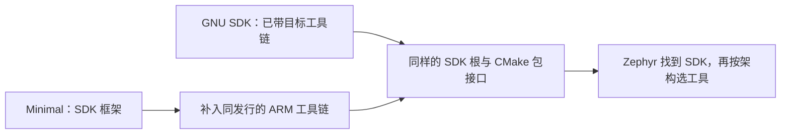
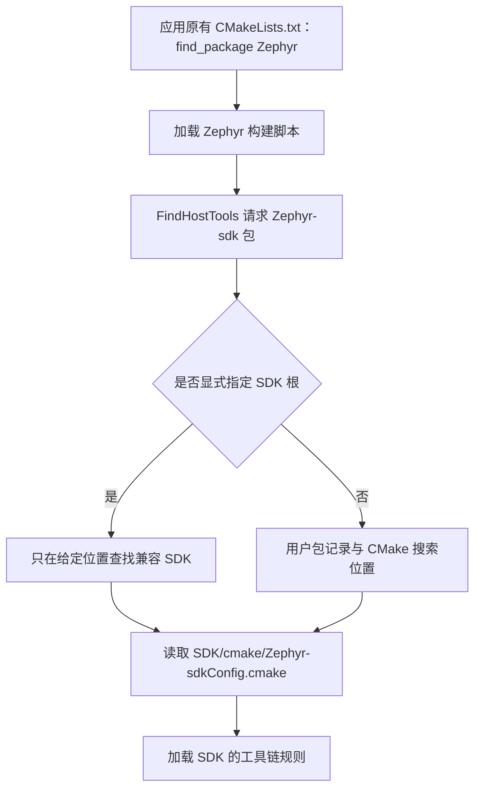
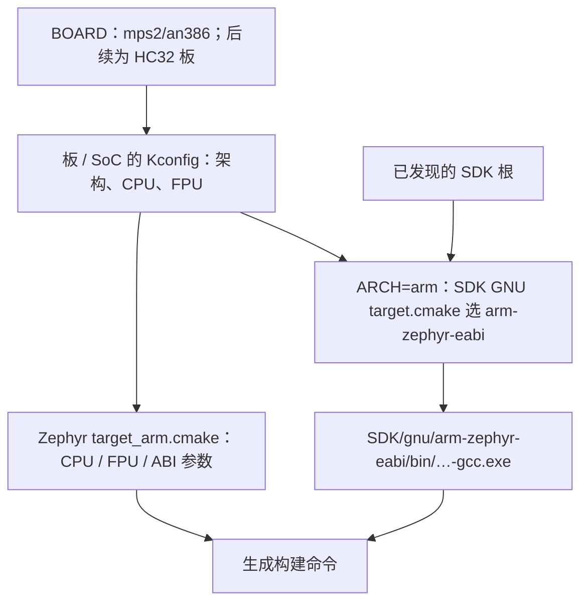
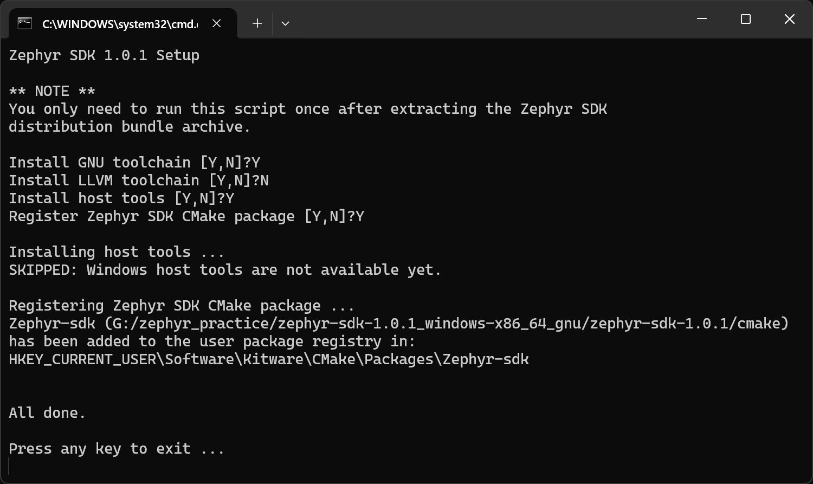
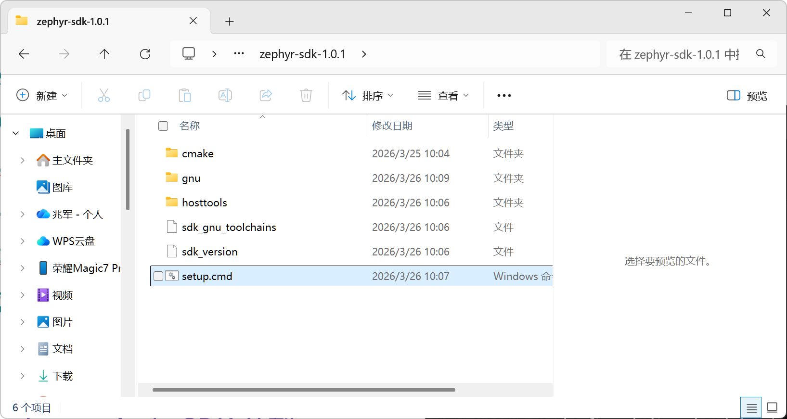
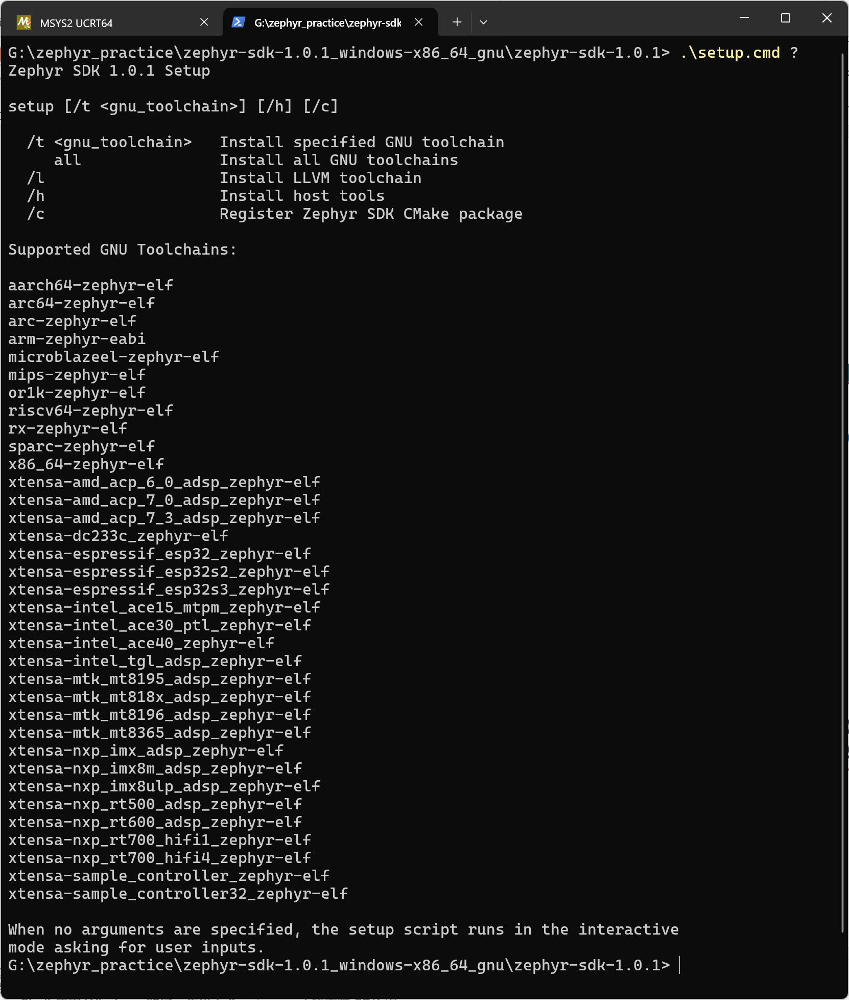
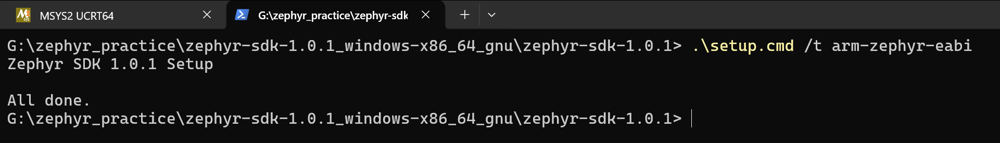
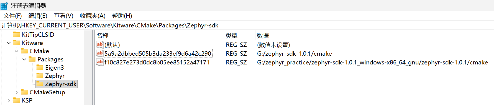
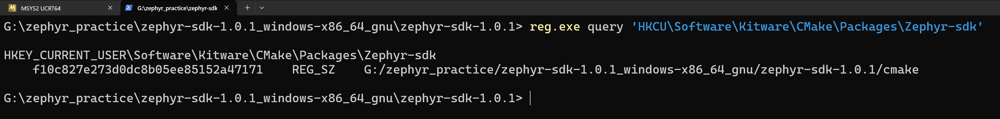

<!-- SPDX-License-Identifier: Apache-2.0 -->

# 第3章\_SDK准备与编译器选型

本章只解决 **SDK 下载、安装，以及 zephyr-main 如何发现 SDK 和交叉编译器**。PPT 用 26 页精讲主线，本文补齐分支、命令前提与结果判断。配套 [PPT](slides/P003_SDK准备与编译器选型_Windows.pptx)、[命令索引](commands/P003_Windows/README.md)、[环境与依赖导航](环境与依赖导航.md)。

前置：[P002](P002_主机工具与Python环境_Windows.md) 已准备 CMake、7-Zip、Python 与 `.venv`。实验源码在 `G:\zephyr_practice\zephyr-main`；普通命令使用 **Windows UCRT64 Bash**，`setup.cmd` 和注册表操作切换 **Windows PowerShell**。两个终端的当前目录和临时环境变量不互相继承。Linux 的安装操作见 [Ubuntu 22.04 分支](P001_官方环境安装与源码准备_Linux.md)，不要照抄本章 `.cmd` 和 Windows 注册表命令。


| PPT 页 | 本文位置 | 读完可以做什么 |
| --- | --- | --- |
| 2—4 | [3.1 包的关系](#section-3-1) | 区分 SDK 框架与目标工具链 |
| 5—13 | [3.2 下载与安装](#section-3-2) | 选包、解压、补齐 ARM 并核验 |
| 14—20 | [3.3 工程发现](#sdk-discovery) | 选择自动发现或显式路径入口 |
| 21—23 | [3.4 编译器选择](#compiler-selection) | 理解板配置与工具链前缀的对应 |
| 24—26 | [3.5 验证与交接](#sdk-evidence) | 判断安装成功与工程选用的区别 |

<a id="section-3-1"></a>

## 3.1\_三种下载包的关系

SDK 是一套可被 Zephyr 构建系统使用的工具包。它既包含程序，也包含告诉 CMake 如何使用这些程序的 `.cmake` 文件。**GNU SDK 与 Minimal SDK 的区别在预装内容，不在工程接入机制。**

| SDK 1.0.1 Windows 附件 | 自带 SDK 的 CMake 接入文件 | 目标工具链 | 接下来做什么 |
| --- | --- | --- | --- |
| `zephyr-sdk-1.0.1_windows-x86_64_gnu.7z` | 有 | 已打包多种 GNU 目标工具链 | 解压后核验 ARM |
| `zephyr-sdk-1.0.1_windows-x86_64_minimal.7z` | 有 | 未预装 | 补装需要的 ARM 工具链 |
| `toolchain_gnu_windows-x86_64_arm-zephyr-eabi.7z` | 不包含完整 SDK 接入框架 | ARM GCC、GDB、二进制工具、目标头文件与库 | 补入 SDK，或选择独立工具链路线 |

Minimal 自带 `cmake/Zephyr-sdkConfig.cmake`，因此可以被定位；但还没有 ARM 工具链时不能编译 ARM。独立 ARM 包不能当作 SDK 根。它的文件名没有 SDK 版本号，所属版本由下载的 Release 页面与同版 `sha256.sum` 确定。

“多种工具链”指 ARM、RISC-V 等不同目标架构，不是同一个 GCC 的多个版本。`1.0.1` 是 SDK 发行版本，`14.3.0` 是该发行内 GCC 的版本。LLVM 是另一种编译器体系，本系列使用 GNU；不要为了本章把 GNU、Minimal 和 LLVM 都下载一遍。[官方发行表](https://github.com/zephyrproject-rtos/sdk-ng/releases/tag/v1.0.1)

### 3.1.1\_安装后的目录与文件来源

下面以 `G:/zephyr_practice/zephyr-sdk-1.0.1` 为 SDK 根。文件由官方归档提供，不需要读者新建 `.cmake` 文件。

```text
zephyr-sdk-1.0.1/                    # 官方 SDK 根
├── sdk_version                     # 官方 SDK 发行版本
├── sdk_gnu_toolchains              # setup 可安装的 GNU 目标名
├── setup.cmd                       # 官方 Windows 安装 / 注册脚本
├── cmake/
│   ├── Zephyr-sdkConfig.cmake       # CMake 包入口
│   ├── Zephyr-sdkConfigVersion.cmake
│   ├── zephyr_sdk_export.cmake     # 可选：保存当前用户包记录
│   └── zephyr/gnu/target.cmake     # 架构 → 目标工具链的规则
├── hosttools/                      # 内容因主机平台而异
└── gnu/arm-zephyr-eabi/             # GNU 已带；Minimal 补装后产生
    ├── bin/arm-zephyr-eabi-gcc.exe
    └── arm-zephyr-eabi/            # sysroot：目标头文件与库等
```

P002 安装的 `cmake.exe` 是在电脑上运行的工具；SDK 的 `cmake/` 是供它读取的脚本。Minimal 不需要在这个目录再放一份 `cmake.exe`。Windows SDK 1.0.1 的 `hosttools` 内容与 Linux 不同，不能由目录名字推断其中一定有 QEMU、DTC 或所有主机工具。



<a id="section-3-2"></a>
<a id="download"></a>

## 3.2\_下载、解压与补装

### 3.2.1\_从当前源码确定版本，再选主机与目标

先读取 P001 下载的官方源码，以下命令只读，不修改文件：

```bash
# Windows UCRT64；进入已下载的 Zephyr 源码根。
cd /g/zephyr_practice/zephyr-main
cat VERSION
cat SDK_VERSION
```

本期源码为 Zephyr `4.5.0-rc1`，`SDK_VERSION` 为 `1.0.1`。这个文件供原生文档和 `west sdk install` 的默认版本选择使用。构建时 `cmake/modules/FindHostTools.cmake` 请求 `find_package(Zephyr-sdk 1.0)`，再由 SDK 包版本规则判断兼容性；推荐版本不等于只有这一版本能用。这里固定 1.0.1 便于复现，升级后重新读取所用源码。

主机平台按电脑选：Windows x64 → `windows-x86_64`。目标工具链按生成固件所面向的架构选：官方参考目标 **MPS2 / AN386（Cortex-M4）** 与后续实板 **HC32F4A0（Cortex-M4F）** 都使用 `arm-zephyr-eabi`。HC32 的板和 SoC 适配在 P011 新增，SDK 装好不等于原生源码已经支持 HC32。


下载操作：打开 GitHub 上 **zephyrproject-rtos/sdk-ng** 仓库，进入 **Releases → v1.0.1**，也可直接打开[本期发行页](https://github.com/zephyrproject-rtos/sdk-ng/releases/tag/v1.0.1)。在页面的 **SDK Bundle** 表中找 **Windows** 行，再点 **GNU** 或 **Minimal** 列的 **x86-64**。只选一条路线。离线补装 ARM 时，在同页 **GNU Toolchains** 表找 **arm-zephyr-eabi** 行、**Windows** 列的 **x86-64**。展开 **Assets** 下载同发行的 `sha256.sum`。页面底部的 Source code 是 SDK 构建工程源码，不是可安装的 SDK。

本期文件统一保存到 `G:\zephyr_practice`。UCRT64 中写作 `/g/zephyr_practice`；传给 Windows 程序的路径使用 `G:/zephyr_practice`。`cygpath -m` 仅负责从 Bash 路径转换为 Windows 可识别的路径，不是 Zephyr 变量。

<a id="section-3-2-1"></a>

### 3.2.2\_GNU 与 Minimal 二选一解压

前提：P002 的 7-Zip 可用；归档与 `sha256.sum` 来自同一发行，且已经下载到当前目录。若 SDK 安装目录已经存在，先核对已有版本，不直接覆盖合并。摘要成功必须显示文件名和 `OK`；不匹配或清单找不到文件时，下面的 `&&` 会阻止继续解压。

**GNU 路线：**

```bash
# Windows UCRT64；下载目录；已取得 GNU 包与同版 sha256.sum。
cd /g/zephyr_practice
# 必须输出 OK；失败就停止，不解压。
grep -F ' zephyr-sdk-1.0.1_windows-x86_64_gnu.7z' sha256.sum |
  sha256sum --check &&
  7z x zephyr-sdk-1.0.1_windows-x86_64_gnu.7z "-o$(cygpath -m "$PWD")"
```

解压后应得到 `G:\zephyr_practice\zephyr-sdk-1.0.1`。已有 `gnu/arm-zephyr-eabi`，直接到 [3.2.4](#section-3-2-4) 核验，不再补装。

**Minimal 路线：**

```bash
# Windows UCRT64；下载目录；选择 Minimal 才执行。
cd /g/zephyr_practice
# 必须输出 OK；失败就停止，不解压。
grep -F ' zephyr-sdk-1.0.1_windows-x86_64_minimal.7z' sha256.sum |
  sha256sum --check &&
  7z x zephyr-sdk-1.0.1_windows-x86_64_minimal.7z "-o$(cygpath -m "$PWD")"
```

解压后 SDK 根已经有 `sdk_version`、`setup.cmd`、`cmake`。下一节补装 ARM。资源管理器“解压到同名文件夹”可能多包一层目录：SDK 根始终是直接含 `sdk_version` 的内层，后续所有路径应填写那一层。本期命令把归档解压到父目录，使用上面的单层安装路径。

下载失败时，先确认能打开对应 Release 和附件；SDK 附件由 GitHub Releases 提供，修改 pip 或 pacman 镜像不会改变该通道。校验失败就重新核对发行版和文件完整性，不跳过摘要继续安装。

<a id="install-arm"></a>

### 3.2.3\_Minimal 补 ARM：在线或已有归档二选一

**在线安装使用 PowerShell。** 新开 PowerShell，重新进入 SDK 根。`setup.cmd /t arm-zephyr-eabi` 读取 `sdk_version` 组织下载地址，把工具链下载并解压到 `gnu/arm-zephyr-eabi`。它不是只设置 PATH，也不会因为执行 `/t` 就自动完成 `/c` 注册。

```powershell
# Windows PowerShell；Minimal 已解压，且尚未安装 ARM 工具链。
Set-Location -LiteralPath 'G:\zephyr_practice\zephyr-sdk-1.0.1'
Get-Command cmake, 7z -ErrorAction Stop
if (Test-Path '.\gnu\arm-zephyr-eabi') {
    throw '已有 ARM 目录，请先核验，不重复安装'
}
.\setup.cmd /t arm-zephyr-eabi
if ($LASTEXITCODE -ne 0) { throw '安装失败，检查下载输出' }
```

如果 `Get-Command` 或 setup 报 7z 不存在，先重开终端让安装后的 PATH 生效；仍不可用再返回 P002。不要在 UCRT64 Bash 中输入 `.\setup.cmd`：这是 Windows 脚本调用写法。查看帮助使用 PowerShell 的 `.\setup.cmd /?`；本版会先检查 CMake 和 7z，帮助退出码为 1 不代表下载失败。

**已下载同版独立 ARM 包时，回到 UCRT64 解压即可。** 独立归档内部以 `arm-zephyr-eabi/` 开始，把它放入 SDK 根的 `gnu/`，不要连压缩包名形成的外层目录一起套进去。

```bash
# Windows UCRT64；Minimal 已解压；ARM 包来自同版 Release。
cd /g/zephyr_practice
# 摘要须输出 OK；归档从 arm-zephyr-eabi/ 开始。
grep -F ' toolchain_gnu_windows-x86_64_arm-zephyr-eabi.7z' sha256.sum |
  sha256sum --check &&
  test -f zephyr-sdk-1.0.1/cmake/Zephyr-sdkConfig.cmake &&
  test ! -e zephyr-sdk-1.0.1/gnu/arm-zephyr-eabi &&
  7z x toolchain_gnu_windows-x86_64_arm-zephyr-eabi.7z \
    "-o$(cygpath -m "$PWD/zephyr-sdk-1.0.1/gnu")"
```

任一检查失败就停止：先核对 Minimal 的 CMake 文件是否存在、是否已有 ARM 目录，以及下载的工具链是否来自同一 Release。最终应有 `zephyr-sdk-1.0.1/gnu/arm-zephyr-eabi/bin/arm-zephyr-eabi-gcc.exe`。要保留整套工具链的目标库与头文件，不能只复制一个 GCC 可执行文件。**组装完成不要求注册；下一节先核验文件，再在 3.3 选择发现方式。**

依据：[SDK 1.0.1 的 Windows setup 源码](https://github.com/zephyrproject-rtos/sdk-ng/blob/v1.0.1/scripts/template_setup_win)，对应本机 SDK 的官方 `setup.cmd`：`/t` 参数与 `process` 分支。

<a id="section-3-2-4"></a>

### 3.2.4\_核验安装结果

```bash
# Windows UCRT64；GNU 或 Minimal + ARM 均用相同目录核验。
cd /g/zephyr_practice/zephyr-sdk-1.0.1
cat sdk_version
ls cmake/Zephyr-sdkConfig.cmake
./gnu/arm-zephyr-eabi/bin/arm-zephyr-eabi-gcc.exe --version
./gnu/arm-zephyr-eabi/bin/arm-zephyr-eabi-gcc.exe -dumpmachine
```

预期分别是 `1.0.1`、存在的包配置文件、包含 `14.3.0` 的 GCC 版本输出，以及 `arm-zephyr-eabi`。文件不存在先查解压层级和补装结果。这里验证的是安装可用；只有后续配置具体应用后，才能证明那个构建选中了这套工具。

<a id="sdk-discovery"></a>

## 3.3\_zephyr-main 怎样发现 SDK

应用先加载 **Zephyr 源码包**，然后由 Zephyr 的 CMake 逻辑查找 **SDK 包**。二者分别有包配置文件：

| 对象 | 官方原有文件 | 显式输入的指向 |
| --- | --- | --- |
| Zephyr 源码 | `zephyr-main/share/zephyr-package/cmake/ZephyrConfig.cmake` | `Zephyr_DIR` 指向含此文件的目录 |
| Zephyr SDK | `SDK根/cmake/Zephyr-sdkConfig.cmake` | `ZEPHYR_SDK_INSTALL_DIR` 指向 SDK 根 |



这些调用发生在配置阶段的 CMake 进程内，图中的脚本不是独立服务。SDK 保持独立安装，不复制进 `zephyr-main`。GNU 与补齐 ARM 的 Minimal 走同一链路；CMake 不靠压缩包原文件名来判断安装方式。

### 3.3.1\_发现入口与读取者

| 入口 | 提供什么 | 保存范围 / 默认行为 |
| --- | --- | --- |
| 默认自动发现 | CMake 用户包记录、原生包搜索输入与 Zephyr 预设路径 | 选择兼容 SDK；找到后缓存本次位置 |
| Zephyr 输入 `ZEPHYR_SDK_INSTALL_DIR` | SDK 根，可由环境变量或 `-D` 传入 | 由 `zephyr_get` 读取；显式限定到这套 SDK |
| CMake 原生 `Zephyr-sdk_DIR` | `SDK根/cmake`，直接含 SDK 包配置文件的目录 | CMake 包目录提示；与 SDK 根不是同一层 |
| CMake 原生 `CMAKE_PREFIX_PATH` | 包的安装前缀，本例为 SDK 根 | 可影响多个包的搜索，不只 SDK |

**默认自动发现成功时，不需要额外填写 SDK 根或 `ZEPHYR_TOOLCHAIN_VARIANT=zephyr`。** 不愿写用户注册表，或需要明确固定某套 SDK 时，用环境变量或 `-D` 即可。不需要将所有入口叠加设置；普通使用优先理解 Zephyr 的 SDK 根接口。

依据可直接打开官方源码 `doc/develop/toolchains/zephyr_sdk.rst`、`cmake/modules/FindHostTools.cmake`、`cmake/modules/FindZephyr-sdk.cmake`，以及 SDK 的 `cmake/Zephyr-sdkConfig.cmake`。在线入口：[SDK 使用说明](https://docs.zephyrproject.org/latest/develop/toolchains/zephyr_sdk.html)；[本期固定源码中的查找实现](https://github.com/zephyrproject-rtos/zephyr/blob/3777ab91262f93c2c2da7e1ab8cff4e8ea5f4ce4/cmake/modules/FindZephyr-sdk.cmake)。网页 latest 可能更新，复现时以上述本期源码和实际 SDK 包为准。

以下是**只读原文件中的关键调用**，不创建或替换任何文件：

```cmake
# zephyr-main/cmake/modules/FindZephyr-sdk.cmake 中的读取调用
zephyr_get(ZEPHYR_SDK_INSTALL_DIR)

# 在显式 SDK 根的 LOAD 分支内，官方调用的关键参数
find_package(Zephyr-sdk ${Zephyr-sdk_FIND_VERSION_COMPLETE}
             REQUIRED QUIET CONFIG HINTS ${ZEPHYR_SDK_INSTALL_DIR} NO_DEFAULT_PATH)
```

`NO_DEFAULT_PATH` 使该分支严格使用给定位置；如果位置或版本不对，应清楚报错，而非悄悄换到注册表里的另一套 SDK。未显式指定时才走自动搜索分支。因此“SDK 明明存在却没找到”首先是路径入口问题，不代表缺了某个新建文件。

<a id="section-3-2-6"></a>
<a id="sdk-registry"></a>

### 3.3.2\_可选注册：当前 Windows 用户的自动发现

`setup.cmd /c` 调用 SDK 自带的 `cmake/zephyr_sdk_export.cmake`，把 `SDK根/cmake` 写入当前用户的 `HKCU\Software\Kitware\CMake\Packages\Zephyr-sdk`。它保存的是 CMake 查包候选，不绑定某个工程，也不安装 ARM 编译器。已经有效注册则跳过；选择显式路径则可以完全不做。

```powershell
# Windows PowerShell；可选：准备当前用户的自动发现入口。
Set-Location -LiteralPath 'G:\zephyr_practice\zephyr-sdk-1.0.1'
Get-Command cmake, 7z -ErrorAction Stop
.\setup.cmd /c
if ($LASTEXITCODE -ne 0) { throw '注册失败，查看前面的错误' }
reg.exe query 'HKCU\Software\Kitware\CMake\Packages\Zephyr-sdk'
```

预期 query 输出包含当前 SDK 的 `.../cmake`。记录跨终端、注销和重启保留，同账户启动且允许使用用户包注册表的 Windows CMake 可以查询。别的 Windows 账户、WSL 或 Linux 不自动继承此记录。多个记录只是候选，具体工程还会按版本、输入和缓存选择。

SDK 移动后需在新根重新注册，或改用显式根；旧缓存不会随之更新。若要删除一条记录，在 Windows 注册表编辑器定位上述键，按值数据中的目录识别相应值，不删除其他 SDK 项。此操作不卸载工具链。

`west zephyr-export` 保存的是 **Zephyr 源码包** 的入口，不是 SDK 的入口。`.venv` 负责 Python，不负责 SDK 注册。两者都不能替代本节的包发现机制。

<a id="section-3-2-5"></a>
<a id="sdk-environment"></a>

### 3.3.3\_不注册：环境变量传给当前终端启动的 CMake

```bash
# Windows UCRT64；源码根；可选：把 SDK 根交给本窗口启动的 CMake。
cd /g/zephyr_practice/zephyr-main
export ZEPHYR_SDK_INSTALL_DIR='G:/zephyr_practice/zephyr-sdk-1.0.1'
printf '%s\n' "$ZEPHYR_SDK_INSTALL_DIR"
```

这里的 `export` 是 Bash 命令，`ZEPHYR_SDK_INSTALL_DIR` 是 Zephyr 提供的输入变量。值使用 Windows CMake 可识别的 `G:/...`，并指向 SDK 根，不是 `gnu` 或 `bin`。之后从同一窗口启动的 CMake 会继承；不是已经完成一次工程配置。

关闭窗口会失去这次进程环境设置，但已经产生的构建缓存仍可能保留 SDK 选择。当前窗口取消输入用：

```bash
# Windows UCRT64；任意目录；仅取消本终端的 SDK 环境输入。
unset ZEPHYR_SDK_INSTALL_DIR
```

不要把设置写进 Python 生成的 `.venv/Scripts/activate`：重建虚拟环境会丢失，`deactivate` 也不会自动恢复你手工添加的 SDK 设置。需要长期保存应用的配置组合时，用 P010 讲解的 `CMakeUserPresets.json`；它在应用源码目录创建，由 `cmake --preset` 读取，不是 SDK 提供的文件。

<a id="sdk-configure"></a>

### 3.3.4\_不注册：在完整应用配置命令中传入 SDK 根

本节展示“把路径交给哪一次 CMake 配置”。**首次按顺序阅读时，先继续 P004—P005 下载并接入源码依赖，再到 P007 执行配置与编译。** 下面的示例已经完整给出入口，不要求自行拼接参数，也不在准备阶段提前编译。

示例使用当前官方源码已有的 `samples/hello_world` 与 `mps2/an386`：MPS2 的 AN386 目标，Cortex-M4，适合后续 QEMU 演示。它不是 HC32 实板；HC32 的适配在 P011 完成。执行前确认源码中有 `samples/hello_world/CMakeLists.txt`、`boards/arm/mps2`，P002 的 `.venv` 及依赖可用，P004—P005 的 CMSIS 等模块齐全，并使用尚未配置的新 `-B` 目录。

```bash
# Windows UCRT64；完成 P002—P005 后执行；新构建目录。
cd /g/zephyr_practice/zephyr-main
source .venv/Scripts/activate
cmake -S samples/hello_world -B build/learning-tools/p003/sdk-explicit \
  -G Ninja -DBOARD=mps2/an386 \
  "-DZephyr_DIR=$(cygpath -m "$PWD")/share/zephyr-package/cmake" \
  "-DPython3_EXECUTABLE=$(cygpath -m "$(command -v python)")" \
  -DZEPHYR_SDK_INSTALL_DIR=G:/zephyr_practice/zephyr-sdk-1.0.1 \
  -DCMAKE_EXPORT_COMPILE_COMMANDS=ON
```

这条命令在配置/生成阶段接入 SDK，不调用 `cmake --build`。`-S` 选应用、`-B` 指定本次生成目录；`Zephyr_DIR` 定位当前源码，`Python3_EXECUTABLE` 选择已激活环境中的解释器；本章新增的 SDK 输入是 `-DZEPHYR_SDK_INSTALL_DIR=...`。`CMAKE_EXPORT_COMPILE_COMMANDS=ON` 用于后面的观察，不是 SDK 发现条件。`$PWD` 和 `command -v` 是 Bash 自带能力，`cygpath -m` 把实际路径转给 Windows CMake。

成功应输出包含当前安装根的 `Found toolchain: zephyr 1.0.1 (...)`，完成 `Configuring done` / `Generating done`，并在 `-B` 目录生成缓存与构建规则。若 SDK 已找到但报 CMSIS、模块或其他工具缺失，回到 P002 / P004 / P005，不把模块下载错误当成 SDK 错误。这里没有要求重复设置默认的工具链类型。

`-D` 的值保存在这个构建目录的 `CMakeCache.txt`，跨终端保留，不是“只对本条命令有效”。另一个新 `-B` 目录不会自动继承它。更换 SDK / 工具链时先用新目录验证；重配与清理策略在 [P010](P010_CMake缓存与构建排错_Windows.md)，不为了本章演示删除已有构建或改官方 `CMakeLists.txt`。

<a id="compiler-selection"></a>

## 3.4\_找到 SDK 后，怎样选择编译器

### 3.4.1\_SDK 根与芯片配置分别决定什么

SDK 根决定使用哪一套发行包；板与 SoC 的配置给出目标架构、CPU、FPU 与 ABI。对于本系列 32 位 ARM 目标，SDK 的 `cmake/zephyr/gnu/target.cmake` 把 `ARCH=arm` 对应到 `arm-zephyr-eabi`，据此组成 `SDK根/gnu/arm-zephyr-eabi/bin/arm-zephyr-eabi-` 前缀。Zephyr 的 GCC 规则再选择程序、生成 CPU/FPU 参数。



调用入口在官方源码 `cmake/toolchain/zephyr/target.cmake`，它加载 SDK 的目标规则；参数来源在 `cmake/compiler/gcc/target_arm.cmake`。对于 HC32F4A0 的 Cortex-M4F，需要 ARM 工具链与正确的 CPU/FPU 选择，而非下载一个叫 HC32 的专用 SDK。新增芯片的存储器、时钟、引脚与驱动属于 P011 的板 / SoC 适配工作。其他架构的映射应看本版 SDK 文件，不能把 ARM 前缀套给 RISC-V。

<a id="standalone-toolchain"></a>

### 3.4.2\_可选路线：保持独立 ARM 目录

若只想使用独立工具链而不组装 Minimal，先从同发行下载并核验 ARM 归档，再将它解压到 `G:\zephyr_practice`。归档内的 `arm-zephyr-eabi` 成为独立根。已有 GNU / Minimal 路线可用时不必再做一次。

```bash
# Windows UCRT64；独立路线；同版 ARM 包和 sha256.sum 已下载。
cd /g/zephyr_practice
grep -F ' toolchain_gnu_windows-x86_64_arm-zephyr-eabi.7z' sha256.sum |
  sha256sum --check &&
  test ! -e arm-zephyr-eabi &&
  7z x toolchain_gnu_windows-x86_64_arm-zephyr-eabi.7z "-o$(cygpath -m "$PWD")"
```

成功后应有 `arm-zephyr-eabi/bin/arm-zephyr-eabi-gcc.exe` 和配套库目录。若目录已存在，上面的检查会阻止覆盖，先用其 GCC 的 `--version` 与 `-dumpmachine` 核对即可。此处没有 SDK 的 `cmake` 和 `sdk_version` 是正常情况，不需要新建它们。

这条路线由 **Zephyr 源码内**的 `cmake/toolchain/cross-compile/generic.cmake` 读取以下输入：

| 输入 | 含义 |
| --- | --- |
| `ZEPHYR_TOOLCHAIN_VARIANT=cross-compile` | 主动选择独立 GNU 工具链的接入规则 |
| `CROSS_COMPILE` | 目录加程序共同前缀；末尾必须保留 `arm-zephyr-eabi-` 的横线 |
| `CROSS_COMPILE_TOOLCHAIN_PATH` | 独立根，供当前源码检查配套 Newlib/Picolibc 头文件等 C 库能力 |

主机 CMake、Ninja、Python、DTC 等仍是前提。完成 P002—P005 后，可以用同一官方应用、同一 `BOARD` 配置新的构建目录：

```bash
# Windows UCRT64；完成 P002—P005；已解压同版独立 ARM 包。
cd /g/zephyr_practice/zephyr-main
source .venv/Scripts/activate
unset ZEPHYR_SDK_INSTALL_DIR
cmake -S samples/hello_world -B build/learning-tools/p003/arm-standalone \
  -G Ninja -DBOARD=mps2/an386 \
  "-DZephyr_DIR=$(cygpath -m "$PWD")/share/zephyr-package/cmake" \
  "-DPython3_EXECUTABLE=$(cygpath -m "$(command -v python)")" \
  -DZEPHYR_TOOLCHAIN_VARIANT=cross-compile \
  -DCROSS_COMPILE=G:/zephyr_practice/arm-zephyr-eabi/bin/arm-zephyr-eabi- \
  -DCROSS_COMPILE_TOOLCHAIN_PATH=G:/zephyr_practice/arm-zephyr-eabi \
  -DCMAKE_EXPORT_COMPILE_COMMANDS=ON
```

前面的 `unset` 只取消当前终端 SDK 根，不删除 SDK 或用户包记录。选择新 `-B` 防止沿用另一条路线的缓存。输出应为 `Found toolchain: cross-compile (...)`，编译器指向独立 ARM 目录；若仍加载旧 SDK，核对当前环境和新目录选择。

`CROSS_COMPILE` 不是 `bin`，也不是完整的 `gcc.exe`。Zephyr 将 `gcc`、`g++`、`objcopy` 等程序名接到共同前缀后；目标库也必须与工具链一起保留。独立路线由读者选定工具链，改 `BOARD` 不会自动换成另一种架构的工具。实际编译替代实验见 [P011](P011_编译示例与新增开发板_Windows.md#standalone-toolchain)；原生机制见 [Other Cross Compilers](https://docs.zephyrproject.org/latest/develop/toolchains/other_x_compilers.html)。

<a id="sdk-evidence"></a>
<a id="section-3-2-8"></a>

## 3.5\_验证工程选用的工具并继续下一阶段

前面的 GCC 版本检查只证明程序可运行。执行 3.3.4 的 CMake 配置成功后，才会有下面的生成文件；不要在尚未配置时去源码里找这些产物：

```bash
# Windows UCRT64；先完成第 19 页的 CMake 配置，才有这些产物。
cd /g/zephyr_practice/zephyr-main/build/learning-tools/p003/sdk-explicit
grep -E 'ZEPHYR_SDK_INSTALL_DIR|CMAKE_C_COMPILER' CMakeCache.txt
grep -m1 'arm-zephyr-eabi-gcc' compile_commands.json
grep -E '^CONFIG_(ARCH|CPU_CORTEX_M4|FPU|ARM)' zephyr/.config
```

缓存应指向本次 SDK 根及其 `gnu/arm-zephyr-eabi` 下的 GCC；`compile_commands.json` 包含计划执行的编译命令和目标参数；`zephyr/.config` 记录板 / SoC 配置。独立路线则查看 `arm-standalone` 目录，对照独立工具链前缀。`compile_commands.json` 可以在生成阶段产生，不证明命令已经执行；实际构建、固件和 QEMU 运行继续在 P007 / P011 验证。

| 现象 | 先检查 | 返回位置 |
| --- | --- | --- |
| `7z` 找不到或 `.\setup.cmd` 无法执行 | 终端是否是 PowerShell，是否安装后重开终端 | P002、3.2.3 |
| 找不到 `Zephyr-sdk` 包 | 根是否含 `cmake/Zephyr-sdkConfig.cmake`，路径层级和注册记录是否有效 | 3.3 |
| 找到 SDK，缺 ARM 编译器 | Minimal 是否补齐 `gnu/arm-zephyr-eabi`，是否多套一层目录 | 3.2.3—3.2.4 |
| SDK 路径仍为旧值 | 当前 shell、CMake 缓存；换路线先用新 `-B` | P010 |
| SDK 已找到，随后缺 CMSIS / HAL | 源码模块尚未下载或未进入构建 | P004—P005 |

本期完成的结果是可用的 SDK / ARM 工具链，以及明确的工程发现入口。下一步进入 [P004 下载 CMSIS 与 HAL](P004_CMSIS与HAL选择下载_Windows.md)、[P005 接入源码模块](P005_源码模块接入Zephyr工程_Windows.md)。CMSIS/HAL 放入源码模块体系，不放 SDK/gnu。

以后补装 SDK 已发布的其他目标工具链，先核对 SDK 的 `sdk_gnu_toolchains` 与同版发行附件；SDK 根和发现机制不变。若是外部 GNU 编译器，按对应原生 variant 的官方接口使用；如果要制作 SDK 自己未发布的架构 / 编译器发行，则属于 sdk-ng 构建和兼容验证工作，不是编辑清单或复制一个 exe 就能完成。本章到此为止，接口体系见 P009，新增板与芯片见 P011。

### 3.5.1\_源码与操作截图补充

这些截图用于识别原文件和操作界面；命令与当前路径以正文可复制块为准。源码依据可在本期固定修订中直接打开对应路径，无需先全仓搜索。













