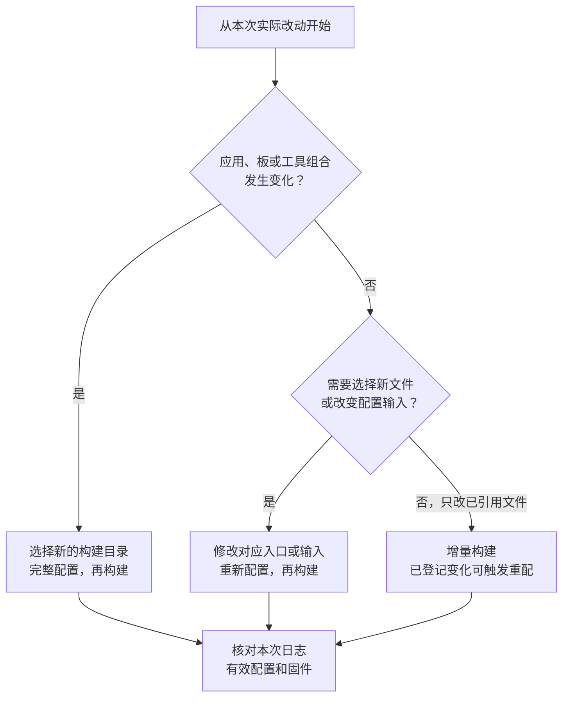
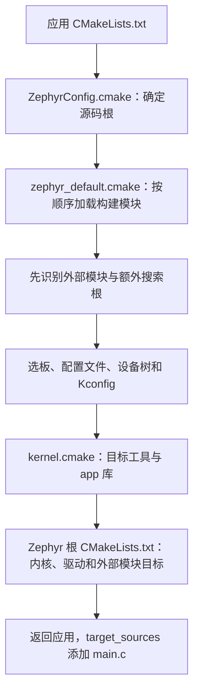
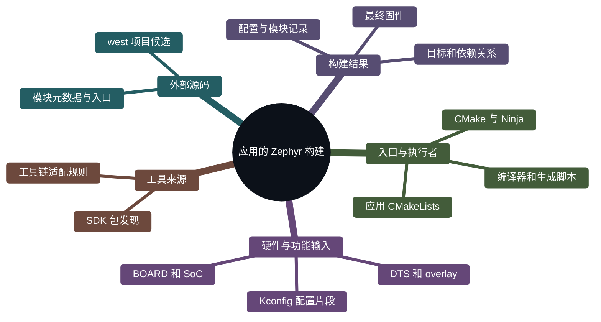
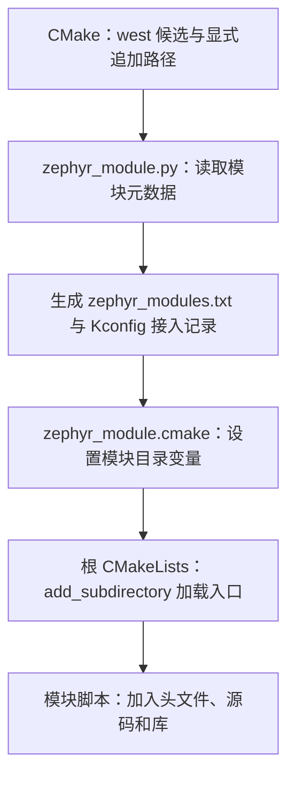
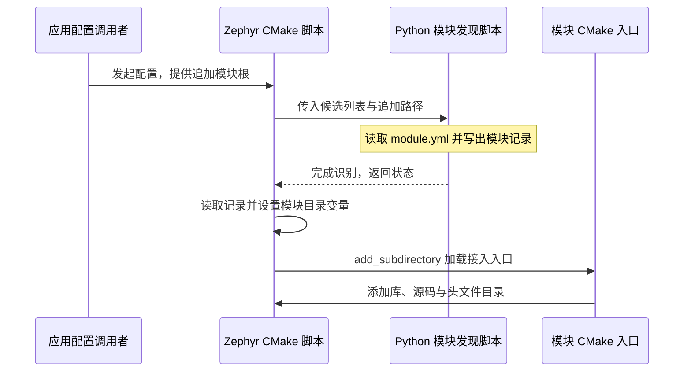
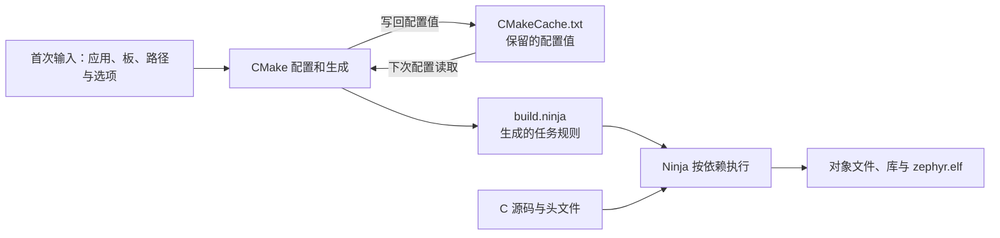

<!-- SPDX-License-Identifier: Apache-2.0 -->

# 第3章\_Zephyr的CMake接口体系

拿到 `samples/hello_world` 后，我们要得到能在一块板上运行的固件。这个目录只有少量应用文件，内核在别处，板和芯片在别处，CMSIS 可能来自另一个仓库，编译器又安装在源码外面。**本章要解释的，是应用如何把这些对象组织成一次构建。** CMake 变量只是这套组织方式中的输入，不能脱离读取它的程序单独背诵。

前置为 [P002 主机工具与 Python](P002_主机工具与Python环境_Windows.md)。本章用官方 hello_world 贯穿讲解，并在 3.1.2、3.5.1 给出 CMake 构建与缓存操作。首次阅读可以先理解关系，完成 P004—P006 的依赖准备及 P007 的环境检查后再执行；已有环境的读者可直接跟随。P007 继续讲完整编译与新增板/芯片。配套 [PPT](slides/P003_Zephyr的CMake接口体系_Windows.pptx) 沿用相同阶段，适合跟随讲解和复习。


下面所有源码相对路径均以 `G:/zephyr_practice/zephyr-main` 为根，UCRT64 写作 `/g/zephyr_practice/zephyr-main`。SDK 自身文件会明确标注“SDK 安装根”，不能在 Zephyr 源码中寻找它们。本章依据的源码提交为 `25c8f4a23988dd3b2cfb463613622738298c2d6c`，SDK 为 1.0.1，核对日期 2026-10-07。网页 `latest` 用于阅读，固定提交链接用于核对本章实现；升级后先核对当前源码，不凭旧行号判断文件缺失。

PPT 中用深橙色标变量与参数、蓝色标文件与路径、深绿色标接口函数、紫色标终端命令，帮助辨认对象；第 2、18 页有图例。颜色辅助分类，仍以文字解释为准。本文的行内代码和代码块跟随阅读器主题，配色维护规则见[演示资料说明](slides/README.md#semantic-colors)。

PPT 阅读定位（按当前 56 页版本）：

| 正文 | PPT 页码 | 这一阶段要回答的问题 |
| --- | --- | --- |
| 3.1 | 2—17 | 怎样配置、构建、增量编译，应用如何调用 Zephyr？ |
| 3.2 | 18—23 | 硬件、配置片段和搜索根由谁读取？ |
| 3.3 | 24—29 | SDK 和交叉编译器怎样被选中？ |
| 3.4 | 30—37 | 外部源码怎样被发现并加入构建？ |
| 3.5 | 38—50 | 怎样查看、更新、撤销缓存，清理和预设有什么区别？ |
| 3.6—3.7 | 51—56 | 怎样核对结果，并回到官方说明和实现？ |

动手时可以沿下面这条短路线回查。正文补充每一步的前提、输出判断与恢复方法，PPT 用于回顾同一套关系。

| 遇到的具体问题 | 正文入口 |
| --- | --- |
| 第一次从哪开始，命令交给谁 | [首次配置](#cmake-configure-command) → [执行构建](#cmake-build-command) |
| 改了代码或配置，下一步执行什么 | [按修改对象选择动作](#cmake-rebuild-choice) |
| 参数省略了，为什么仍沿用旧值 | [缓存操作](#cmake-cache-practice) → [退出终端后的状态](#cmake-session-state) |
| 怎样证明本章工程选中了预期对象 | [cmake-demo 的结果自查与排错](#cmake-result-check) |

<a id="section-3-1"></a>

## 3.1\_先看一个应用如何变成固件

<a id="section-3-1-1"></a>

### 3.1.1\_先认识参与工作的程序

电脑上安装的 CMake 是一个程序，读取 `CMakeLists.txt` 和 `.cmake` 脚本。Zephyr 随源码提供自己的 CMake 脚本，这些脚本描述内核、驱动、模块和板怎样参加构建。它们使用 CMake 的语言，并增加 Zephyr 专用函数与输入约定。**“Zephyr 的 CMake 扩展”指这层构建规则及其接口，不是另一款 CMake 程序。**

这里有几个紧密配合、但职责不同的工具。先沿一次构建认识它们，后面再解释变量。

| 对象 | 在这个应用中的工作 | 读者能看到的结果 |
| --- | --- | --- |
| west | `update` 按清单取得依赖源码；`build` 是调用 CMake 和构建工具的便捷入口 | 下载目录、配置日志和构建输出 |
| CMake 程序与 Zephyr 的 CMake 脚本 | 选择板、工具链和模块，运行配置脚本，建立目标及依赖关系 | `CMakeCache.txt`、`build.ninja` 和各种配置产物 |
| Kconfig 工具 | 根据配置项定义、板默认值和应用配置片段，计算有效功能开关 | `zephyr/.config`、生成的 `autoconf.h` |
| Devicetree 处理工具 | 合并板、SoC 和应用硬件描述，并按 bindings 解析 | `zephyr/zephyr.dts`、生成的 `devicetree_generated.h` |
| Ninja 或 Make | 按 CMake 生成的规则，运行到期的编译、生成和链接任务 | 对象文件、库以及最终固件 |
| GCC 等编译器、链接器和二进制工具 | 把 C/汇编编成目标机器代码，链接并转换文件格式 | `.obj`、`.a`、`.elf`，以及配置启用的其他格式 |

Python 是若干脚本的运行环境，例如模块识别、Kconfig 与 Devicetree 处理。`.venv` 决定这些 Python 工具从哪里运行；它不会替应用选板，也不会自动下载 SDK。Devicetree 的头文件主要由 Zephyr 的 Python 脚本生成，不能把这一过程全部说成“dtc 编译”。当前文档说明 dtc 可补充检查诊断。

因此，直接运行 CMake 仍能配置 Zephyr 应用；使用 `west build` 时，west 帮读者组织调用，底下还是 CMake 和 Ninja/Make。构建过程中 Zephyr 的模块发现脚本也可以读取 west 工作区的项目列表，这与“必须通过 west build 启动”是两件事。依据：[构建阶段说明](https://docs.zephyrproject.org/latest/build/cmake/index.html#build-and-configuration-phases)（原件 `doc/build/cmake/index.rst`，第 52 行附近）；[west 构建命令说明](https://docs.zephyrproject.org/latest/develop/west/build-flash-debug.html)（原件 `doc/develop/west/build-flash-debug.rst`，第 3 行附近）。

<a id="section-3-1-2"></a>

### 3.1.2\_配置阶段和构建阶段为什么分开

假设现在要编译官方 `hello_world`，目标为 `mps2/an386`。配置阶段先回答：应用在哪里、选哪块板、有哪些源码、需要什么编译器和参数、哪些文件必须先生成。CMake 执行脚本得到这些关系，再为 Ninja 生成任务规则。

构建阶段由 Ninja 执行这些规则。普通修改 `main.c` 后，通常只需重新编译受影响对象并链接；改变板、模块或构建配置，可能需要重新运行 CMake。构建规则能够检测一部分变化并自动重新配置，所以日志中偶尔重新出现 CMake 输出是正常的。


`cmake -S` 指应用源码目录，`-B` 指本次构建目录，`-G Ninja` 选择规则格式。这三项是 CMake 原生选项。`cmake --build` 则调用所选构建工具。这些命令形式由 CMake 定义；Zephyr 通过脚本决定规则里包含哪些工作。下面用完整命令说明两阶段的实际动作，执行前提单独列出，不要求提前安装尚未介绍的依赖。依据：[构建阶段说明](https://docs.zephyrproject.org/latest/build/cmake/index.html#build-and-configuration-phases)（原件 `doc/build/cmake/index.rst`，第 52 行附近）；[CMake 原生命令索引](https://cmake.org/cmake/help/latest/manual/cmake-commands.7.html)（原件 `CMake 原生命令手册`）。

<a id="cmake-build-methods"></a>

#### 3.1.2.1\_先确定应用、板和本次构建目录

先把上面的两个阶段落实到命令。这里沿用官方 `samples/hello_world`，目标 `mps2/an386` 是源码已有的 Arm MPS2 AN386 FPGA 配置，提供 Cortex-M4 模型；它用于认识构建方法，不代表已经新增 HC32 支持，也不要求连接实板。板文件在官方原有的 `boards/arm/mps2`，需要的通用 Cortex-M 头文件来自工作区的 CMSIS_6，交叉编译器来自已安装的 ARM SDK 工具链。

**第一次按章节阅读时，可以先看命令和产物关系。真正执行下列构建块之前，须完成 P004—P006 的依赖准备，并通过 [P007 的环境检查](P007_编译示例与新增开发板_Windows.md#section-7-2)。** 已有这套环境的读者可以直接操作。本节不下载或安装工具，不新建应用，也不更换官方 CMakeLists.txt；后续 P007 继续承担新增板与芯片的完整实验。

本节使用 `build/learning-tools/p003/cmake-demo` 作为独立构建目录，名称是本教程的选择，不是 Zephyr 固定要求。它由下面的 CMake 配置命令自动创建，不需要手工创建缓存文件，也不影响 P007 已有的 `build-mps2-sdk-auto`。这两个目录保存两次独立的构建状态，不能混读产物。

```text
zephyr-main/                              已下载的官方源码根
├── samples/hello_world/                  官方应用，由 -S 选择
│   ├── CMakeLists.txt                    官方构建入口，只读
│   ├── prj.conf                         官方应用配置
│   └── src/main.c                       官方应用代码
└── build/learning-tools/p003/cmake-demo/  本节 -B 目录，工具随后创建
    ├── CMakeCache.txt                    CMake 保存的配置值
    ├── build.ninja                       CMake 为 Ninja 生成的规则
    └── zephyr/zephyr.elf                 编译与链接成功后的固件
```

Zephyr 要求应用源码与构建输出分开。`-S` 不是整个 Zephyr 根，而是有应用入口的目录；`-B` 保存这一组“应用、板、工具和配置”的状态。换到另一个 `-B` 就是另一份缓存。依据：[官方应用与构建目录说明](https://docs.zephyrproject.org/latest/develop/application/index.html#application)；源码原件 `doc/develop/application/index.rst` 的开头及 `CMakeCache.txt` 小节；[MPS2 AN386 官方板说明](https://docs.zephyrproject.org/latest/boards/arm/mps2/doc/index.html)。

<a id="cmake-configure-command"></a>

#### 3.1.2.2\_第一次配置，只生成构建规则

下面整块在 **Windows UCRT64** 执行。先进入源码根并激活 P002 已创建的 `.venv`，确保 CMake 使用相同的 Windows Python。`ZEPHYR_BASE` 是 Zephyr 原生变量，这里就地设置为当前源码根；`cygpath -m` 把 Bash 路径转为 Windows 程序可读的 `G:/...`。`Zephyr_DIR` 固定本次使用的源码包入口，适合本机有多份 Zephyr 的情况；它不选择 SDK。SDK 仍按 P004 已完成的默认发现机制寻找，无须额外写默认类型。

```bash
# Windows UCRT64；前提：P004—P006 依赖已齐，P007 7.2.1 环境检查通过。
cd /g/zephyr_practice/zephyr-main
source .venv/Scripts/activate
# Zephyr 原生源码根变量，供本次 CMake 查找这份源码。
export ZEPHYR_BASE="$(cygpath -m "$PWD")"
# -S 是官方应用；-B 是本节单独使用、由 CMake 创建的构建目录。
cmake -S samples/hello_world \
  -B build/learning-tools/p003/cmake-demo -G Ninja \
  -DBOARD=mps2/an386 \
  "-DZephyr_DIR=$ZEPHYR_BASE/share/zephyr-package/cmake" \
  "-DPython3_EXECUTABLE=$(cygpath -m "$(command -v python)")"
```

应看到当前应用、`Board: mps2, qualifiers: an386`、实际找到的 SDK 和编译器，以及 `Configuring done`、`Generating done`、`Build files have been written to`。这时 `CMakeCache.txt` 和 `build.ninja` 已产生，但新目录里还没有最终 `zephyr.elf`。配置失败就停在这里：Python 不对回 P002，SDK 未找到回 P004，CMSIS 缺失回 P005—P006；继续执行 build 不能补齐缺失依赖。

| 本次参数 | 由谁解释 | 本次具体作用 |
| --- | --- | --- |
| `-S samples/hello_world` | CMake | 读取这个应用的 CMakeLists.txt |
| `-B build/learning-tools/p003/cmake-demo` | CMake | 选择构建状态和输出目录，相对当前源码根 |
| `-G Ninja` | CMake | 为 Ninja 生成规则；不是选择芯片或编译器 |
| `-DBOARD=mps2/an386` | `-D` 语法属 CMake，BOARD 由 Zephyr 读取 | 把本次板目标传入配置 |
| `-DZephyr_DIR=...` | CMake 的包定位规则 | 找到这份源码的 ZephyrConfig.cmake |
| `-DPython3_EXECUTABLE=...` | CMake FindPython3，Zephyr 请求它 | 固定到刚激活的 Python，避免另一套解释器被选中 |

以上 `...` 仅用于表内解释，完整命令没有省略项。[可复制配置块](commands/P003_Windows/3.1.2-01.txt)。CMake 自身的命令行规范见 [cmake(1) 的 Generate a Project Buildsystem](https://cmake.org/cmake/help/latest/manual/cmake.1.html#generate-a-project-buildsystem)，其本机原件在 **CMake 安装根**的 `share/cmake-<版本>/Help/manual/cmake.1.rst`，不在 Zephyr 源码树里。Zephyr 如何加载配置继续看本章 3.1.3—3.1.4。

这段命令先由 Bash 处理，再交给 CMake。行尾的 `\` 把下一行接到同一次调用，必须是该行最后一个字符，后面不要再加空格或注释；复制时不带终端提示符 `$` 或 `((.venv))`。`$(...)` 先在当前 Bash 中求值，双引号保证展开后的整个参数仍作为一个参数传递。这里使用 `cygpath` 是 Windows UCRT64 与 Windows 程序之间的路径转换，Ubuntu 原生终端不照搬这一部分。

两个容易混淆的路径在本次分别是：`-S` 指向 `samples/hello_world`，`Zephyr_DIR` 指向源码根的 `share/zephyr-package/cmake`。前者给出应用入口，后者给应用里的 `find_package(Zephyr)` 提供包入口。它们不是 SDK 目录，也不应填成 SDK 的 `gnu/arm-zephyr-eabi/bin`。`ZEPHYR_BASE` 在本块当前 shell 中定义；重新开终端后若重新执行整块，它会重新取当前源码根。

配置输出按出现顺序阅读：先确认 Application 和 Board，再确认找到的 SDK 与工具链，最后看配置和生成是否都结束。`Configuring done` 表示脚本配置阶段完成；`Generating done` 表示后端规则生成完成；`Build files have been written to` 给出真正的输出目录。**这三个结果仍不是固件编译成功。** 配置阶段也可能调用编译器做能力探测，但应用的完整编译和链接在下一步。一次失败的配置也可能留下部分缓存文件，不能只凭 `CMakeCache.txt` 已存在就认定配置成功。

<a id="cmake-build-command"></a>

#### 3.1.2.3\_执行构建，再观察增量构建

配置成功后，把同一个构建目录交给 `cmake --build`。CMake 从目录中识别 Ninja 并调用它；板和编译器已经在配置阶段选好，此处不用重新写 `-DBOARD`。`--parallel 4` 是最多并行四个构建任务，可按电脑资源调整。

```bash
# Windows UCRT64；源码根；前提：3.1.2 的 cmake-demo 配置成功。
cd /g/zephyr_practice/zephyr-main
source .venv/Scripts/activate
# 构建同一个目录，不重新选择 BOARD；4 表示最多四个并行任务。
cmake --build build/learning-tools/p003/cmake-demo --parallel 4
ls -l build/learning-tools/p003/cmake-demo/zephyr/zephyr.elf
# 没改输入时，再次构建通常没有需要重做的编译任务。
cmake --build build/learning-tools/p003/cmake-demo --parallel 4
```

首次执行会看到编译、生成和链接任务，最后能列出 `zephyr/zephyr.elf`。同样的 build 命令再执行一次，若输入没有变化，通常会看到 `ninja: no work to do.`；有些生成目标仍可能检查或运行，不能要求每个工程都完全零输出。修改 `src/main.c` 后仍用这条命令，Ninja 按依赖只更新受影响的对象和链接结果。

构建成功要结合本次命令正常结束、没有失败任务以及对应输出判断。已有目录可能保留上一次成功的 ELF，因此“ls 能看到文件”本身不能证明刚才的构建成功。若需要查看退出状态，UCRT64 中的 `$?` 只表示紧邻上一条命令的返回码；先执行了 ls 或 grep 后，它就不再是构建的返回码。

`cmake --build` 不需要重复 `-S`，因为 `-B` 对应的缓存已经记录源目录和生成器。它也不会自动把当前终端切换到新激活的编译器或另一块板。重新打开 UCRT64 后，仍可进入本节源码根、激活既有 `.venv`，执行同一条 build；不必重新安装 Python、创建 venv 或运行 west init。若工具已搬家、依赖消失或缓存指向另一环境，则先处理这些输入，再按后面的规则决定是否另开构建目录。

`--build` 不会重新下载依赖。若脚本、配置片段等已登记的输入变化触发重新运行 CMake，日志会先出现重新配置，再继续构建；普通修改 C 文件并不要求每次 clean。编译成功仅证明产生了固件，下载和实板运行另行验证。[可复制构建块](commands/P003_Windows/3.1.2-02.txt)。依据：[Zephyr 两个构建阶段](https://docs.zephyrproject.org/latest/build/cmake/index.html#build-and-configuration-phases)，原件 `doc/build/cmake/index.rst`；[CMake Build a Project](https://cmake.org/cmake/help/latest/manual/cmake.1.html#build-a-project)。

#### 3.1.2.4\_常用构建选项改变的是哪一步

需要查看 GCC 实际收到的参数时，加 `--verbose`；需要查项目提供哪些目标时，使用当前 Ninja 构建支持的 `help` 目标。它们都复用刚才的构建目录。

```bash
# Windows UCRT64；源码根；前提：cmake-demo 已配置成功。
cd /g/zephyr_practice/zephyr-main
source .venv/Scripts/activate
# 打印本次实际执行的构建命令；没有到期任务时不会强行重编译。
cmake --build build/learning-tools/p003/cmake-demo --parallel 4 --verbose
# 只列出当前 Ninja 工程提供的目标。
cmake --build build/learning-tools/p003/cmake-demo --target help
```

`--verbose` 只显示这次真正执行的命令，工程已是最新状态时不会为了打印命令而强行重编译。当前 Zephyr 还会生成 `compile_commands.json`，可查看各 C/汇编单元的编译命令，但它不是链接命令清单。`--target app` 可以只构建应用库及其依赖，不等于完整固件已链接；日常生成固件先用不限定 target 的 build。

`cmake -S/-B ... -D名字=值` 修改配置输入，`cmake --build ... --parallel/--verbose/--target` 控制构建执行。不要把 `-DBOARD=...` 放到 `cmake --build ... --` 后面：这个分隔符后面的参数交给 Ninja，不交给 CMake 配置器。具体 target 由项目和生成器提供，先看 help，不能把任何教程中的 target 名都当作 CMake 内置。[可复制常用操作](commands/P003_Windows/3.1.2-03.txt)。

#### 3.1.2.5\_直接 CMake、west 和 Ninja 的关系

直接 CMake 的两步是“配置并生成，再 build”。`west build` 把这两步包装起来；第一次需要应用和板，已有构建目录时可以复用其中的状态。下面只复用本节已经配置成功的目录，没有再创建 west 清单，也不调用 `west init`：

```bash
# Windows UCRT64；源码根；前提：cmake-demo 已配置成功。
cd /g/zephyr_practice/zephyr-main
source .venv/Scripts/activate
# 日常构建：复用现有配置，不做 west init。
west build -d build/learning-tools/p003/cmake-demo
# 需要强制重新执行 CMake 时才使用这一条，不是每次必做。
west build -d build/learning-tools/p003/cmake-demo -c
```

第一条复用现有配置构建；`-c` 要求再次执行 CMake，之后再构建。两条是不同场景，日常不必每次都执行 `-c`。`west build -d 构建目录 -- -D名字=值` 中，分隔符后的参数才是传给 CMake 配置阶段的输入；这与上一节 `cmake --build ... --` 的接收者不同。若将来从空目录改用 west 首次构建，仍需 `-b` 选板、给应用位置并满足同样的环境前提，完整版本见 P007。

按本节先直接 CMake、再执行 west `-c` 的组合，当前版本可能提示 `WEST_PYTHON_PROPERTIES` 未使用。这是 west 自动传入的 Python 元数据；本例已经指定并缓存 `Python3_EXECUTABLE`，`cmake/modules/python.cmake` 的第 66—72 行便不会进入读取该元数据的分支。它不等于缺少 Python。核对配置日志和缓存仍指向 `.venv`，并以配置、构建的退出状态确认结果；不要因此重装环境或修改官方脚本。

在当前 Ninja 工程中，`ninja -C build/learning-tools/p003/cmake-demo` 是直接调用已选后端的形式；`cmake --build` 则不要求调用者记住后端名字。它们操作的是同一个构建目录，不是三套独立缓存。west 默认配置可影响它的首次行为，不能脱离前提说两条首次配置命令永远完全相同。依据：[west 强制重新配置与额外 CMake 参数](https://docs.zephyrproject.org/latest/develop/west/build-flash-debug.html#forcing-cmake-to-run-again)，原件 `doc/develop/west/build-flash-debug.rst`，实现入口 `scripts/west_commands/build.py`。[可复制 west 对照](commands/P003_Windows/3.1.2-04.txt)。

#### 3.1.2.6\_通用 CMake 的 Debug/Release 不能直接套用

普通 CMake 工程常用单配置生成器 Ninja，在配置时用 `CMAKE_BUILD_TYPE` 选择 Debug 或 Release；Visual Studio 等多配置生成器通常在构建时用 `--config` 选择已有配置。本系列固定使用 `-G Ninja`，不要求读者切换生成器。

Zephyr 的优化级别主要由 Kconfig 的 `CONFIG_DEBUG_OPTIMIZATIONS`、`CONFIG_SIZE_OPTIMIZATIONS`、`CONFIG_SPEED_OPTIMIZATIONS` 等选项决定。单独加 `-DCMAKE_BUILD_TYPE=Debug` 不等于已经切换 Zephyr 的调试优化方案，也不能把 `--config Debug` 当作本系列的必做步骤。应修改对应配置片段并核对 `zephyr/.config` 与实际编译参数。Zephyr 根 `CMakeLists.txt` 的优化选择分支以及 `CMAKE_BUILD_TYPE` 检查段明确说明这一差异。

同理，`cmake --install` 执行项目安装规则，不能代替 Zephyr 的固件烧录；`--target flash` 或 `west flash` 会涉及板卡 runner 与硬件，不属于本节构建方法验证。依据：[CMake 构建类型](https://cmake.org/cmake/help/latest/variable/CMAKE_BUILD_TYPE.html)；[本章固定源码的优化选择](https://github.com/zephyrproject-rtos/zephyr/blob/25c8f4a23988dd3b2cfb463613622738298c2d6c/CMakeLists.txt#L243)及[构建类型诊断](https://github.com/zephyrproject-rtos/zephyr/blob/25c8f4a23988dd3b2cfb463613622738298c2d6c/CMakeLists.txt#L2375)。

<a id="cmake-rebuild-choice"></a>

#### 3.1.2.7\_改动之后，应该运行哪一步

决定动作前先问：改动的是已经参加构建的文件内容，还是“哪些文件、哪块板、哪套工具参加构建”的选择？前者通常可以交给现有依赖规则处理；后者需要让 CMake 重新读取输入。换应用、板、生成器或工具链时，本系列优先使用新的构建目录，使两套状态各自完整。

| 这次改动 | 应执行的动作 | 之后核对什么 |
| --- | --- | --- |
| 已被目标引用的 main.c 或头文件内容 | 复用本节 build 命令 | 日志中的受影响对象与链接结果 |
| 已参加配置的 prj.conf 或 overlay 内容 | build 可触发自动重新配置；必要时显式重复配置命令后再 build | `zephyr/.config` 或 `zephyr/zephyr.dts` 中的有效结果 |
| 新增一个 .c，但尚未在构建入口中引用 | 先通过应用或模块 CMake 接口加入目标，再配置、构建 | 该文件是否进入编译命令数据库 |
| 改用另一份 CONF_FILE、overlay 或追加模块列表 | 用相应原生输入重新配置，再 build | 选择的文件、模块记录及最终配置 |
| 换 BOARD、应用、SDK、编译器或生成器 | 使用新的 -B，重新提供完整配置输入，再 build | 新目录的入口、板与工具来源 |
| 只想查看现有配置 | 使用 3.5.1.2 的 -N 检查 | 缓存值；不会借此重新构建 |

为什么修改 prj.conf 后执行 build 也可能看到 CMake？当前 Zephyr 的 `kconfig.cmake` 和 `dts.cmake` 把已使用的配置输入登记为重新配置依赖，Ninja 发现它们变化后先调用 CMake 更新规则，再继续构建。但任意新复制进目录的文件不一定已经成为依赖；因此不能把“自动重配”理解成“自动发现所有新文件”。下面的流程图描述选择顺序，不要求把每条分支都执行一遍。



这里说“完整配置”，是复用 3.1.2.2 的整块命令并按目的调整输入，不是向新目录只传一项 -D 就期待继承旧目录。源码依据：[Kconfig 的重新配置依赖](https://github.com/zephyrproject-rtos/zephyr/blob/25c8f4a23988dd3b2cfb463613622738298c2d6c/cmake/modules/kconfig.cmake#L495)与[Devicetree 的重新配置依赖](https://github.com/zephyrproject-rtos/zephyr/blob/25c8f4a23988dd3b2cfb463613622738298c2d6c/cmake/modules/dts.cmake#L295)；通用机制见 [CMake 的目录属性 CMAKE_CONFIGURE_DEPENDS](https://cmake.org/cmake/help/latest/prop_dir/CMAKE_CONFIGURE_DEPENDS.html)。这是一项由项目脚本设置的目录属性，不是要求读者新增的命令行变量。

<a id="section-3-1-3"></a>

### 3.1.3\_从官方应用入口逐行理解

`samples/hello_world/CMakeLists.txt` 是**官方原有文件**，不是要求读者新建的文件。下面是去掉许可证行后的原有主体，仅供阅读，不要粘贴进终端：

```cmake
# 只读：zephyr-main/samples/hello_world/CMakeLists.txt 原有主体。
cmake_minimum_required(VERSION 3.28.0)

find_package(Zephyr REQUIRED HINTS $ENV{ZEPHYR_BASE})
project(hello_world)

target_sources(app PRIVATE src/main.c)
```

第一行要求 CMake 版本满足本源码。第二条命令请求加载名为 Zephyr 的 CMake 包，`REQUIRED` 表示找不到就停止，`HINTS` 给搜索提供线索，`$ENV{ZEPHYR_BASE}` 读取启动 CMake 的进程环境。找到的入口是 `share/zephyr-package/cmake/ZephyrConfig.cmake`，不是 SDK 的包配置。

`project(hello_world)` 给应用工程命名。它位于 `find_package(Zephyr)` 后面，是因为 Zephyr 需要先建立交叉编译和配置环境。最后一行把当前应用目录下的 `src/main.c` 加到已有的 `app` 库目标里。`target_sources` 是 CMake 原生命令；`app` 则是 Zephyr 初始化时创建的目标名。`PRIVATE` 表示该源文件用于 app 自身构建，不把这份源码作为使用要求继续传播给链接它的其他目标。

这里的 target 是 CMake 构建模型中的对象，例如库、可执行文件或生成任务；它不是开发板。一个板上运行的固件可以由很多库目标组成。Zephyr 把应用、内核、驱动等先组织为目标，才能统一继承头文件目录、编译参数和生成顺序，而不必让每个应用复制内核的构建脚本。依据：[hello_world 原有入口](https://github.com/zephyrproject-rtos/zephyr/blob/25c8f4a23988dd3b2cfb463613622738298c2d6c/samples/hello_world/CMakeLists.txt#L3)（原件 `samples/hello_world/CMakeLists.txt`，第 3 行附近）；[app 目标创建处](https://github.com/zephyrproject-rtos/zephyr/blob/25c8f4a23988dd3b2cfb463613622738298c2d6c/cmake/modules/kernel.cmake#L236)（原件 `cmake/modules/kernel.cmake`，第 236 行附近）；[构建阶段说明](https://docs.zephyrproject.org/latest/build/cmake/index.html#build-and-configuration-phases)（原件 `doc/build/cmake/index.rst`，第 52 行附近）。

读者可以执行下面的**只读操作**定位原件。这只需要已经下载源码和安装 UCRT64，不需要 SDK，不新建任何文件：

```bash
# 终端：Windows UCRT64；从任意目录进入实验源码根。
cd /g/zephyr_practice/zephyr-main
# 读取官方原有的应用入口，应该看到上面五行核心语句。
sed -n '1,30p' samples/hello_world/CMakeLists.txt
```

若提示文件不存在，返回 P001 核对下载是否完整及当前位置；不要为了让命令通过手工补一个同名文件。可复制原件见 [3.1.3 命令](commands/P003_Windows/3.1.3-01.txt)。

<a id="section-3-1-4"></a>

### 3.1.4\_find_package 里面实际走了哪条路

不要把 `find_package(Zephyr)` 理解为只保存一个路径。它会执行包配置里的初始化代码。在本章版本中，普通单应用、未指定特殊 COMPONENTS 时，主线是：



包入口把 Zephyr 的 `cmake/modules` 加入 `CMAKE_MODULE_PATH`，所以随后 `include(zephyr_default)` 能找到 Zephyr 自己的脚本。这里 CMake module 指 `.cmake` 脚本；下一节所说的外部 Zephyr module 则是符合接入约定的源码项目。两者都叫 module，但不是同一种对象。

默认顺序不是随意安排。外部源码模块可能提供新的 `board_root`、`soc_root` 或 `dts_root`，必须先取得这些位置，才能找板；Kconfig 可以使用设备树信息，所以先处理设备树，再计算功能配置；有了硬件与功能配置，才确定目标参数、建立库和链接关系。处理设备树已经需要 C 预处理器，因此工具发现也不是全部等到最后：`dts.cmake` 会先请求 HostTools，`kernel.cmake` 随后请求 TargetTools 完成目标工具设置。

最后 Zephyr 根 `CMakeLists.txt` 收集各部分目标，之后返回应用继续执行 `project` 和 `target_sources`。这也解释了为什么正常应用构建的 `-S` 应指向 `samples/hello_world` 等**应用目录**，不能仅因源码根也有 CMakeLists.txt 就指向根目录。依据：[包入口 include_boilerplate](https://github.com/zephyrproject-rtos/zephyr/blob/25c8f4a23988dd3b2cfb463613622738298c2d6c/share/zephyr-package/cmake/ZephyrConfig.cmake#L28)（原件 `share/zephyr-package/cmake/ZephyrConfig.cmake`，第 28 行附近）；[默认初始化顺序](https://github.com/zephyrproject-rtos/zephyr/blob/25c8f4a23988dd3b2cfb463613622738298c2d6c/cmake/modules/zephyr_default.cmake#L71)（原件 `cmake/modules/zephyr_default.cmake`，第 71 行附近）；[设备树配置入口](https://github.com/zephyrproject-rtos/zephyr/blob/25c8f4a23988dd3b2cfb463613622738298c2d6c/cmake/modules/dts.cmake#L9)（原件 `cmake/modules/dts.cmake`，第 9 行附近）；[app 目标创建处](https://github.com/zephyrproject-rtos/zephyr/blob/25c8f4a23988dd3b2cfb463613622738298c2d6c/cmake/modules/kernel.cmake#L236)（原件 `cmake/modules/kernel.cmake`，第 236 行附近）；[外部模块 CMake 入口加载处](https://github.com/zephyrproject-rtos/zephyr/blob/25c8f4a23988dd3b2cfb463613622738298c2d6c/CMakeLists.txt#L778)（原件 `CMakeLists.txt`，第 778 行附近）。

<a id="section-3-1-5"></a>

### 3.1.5\_这套设计解决什么问题

从上面的分工可以理解设计意图：应用描述“我要加入什么代码”，板/SoC 描述“代码面对什么硬件”，Kconfig 描述“启用什么能力”，工具链规则描述“怎样调用某类编译器”，模块元数据描述“外部项目怎样参加这些步骤”。CMake 把它们组合成同一个构建模型。

这种解释是对官方配置流程和实现边界的归纳，不是官方逐字宣言。它带来的实际效果是：换板时可以复用应用源码；增加一个 HAL 项目可以通过模块入口接入；采用已有工具链类型时不需要修改每个应用的编译器命令；每个构建目录独立保存本次组合。扩展仍须满足接口约定，不是给文件夹起一个名字就自动生效。

下面用思维导图看职责分区。它表示“有哪些部分”，不表示执行顺序；实际先后关系仍看上一节流程图。



<a id="section-3-2"></a>

## 3.2\_输入接口怎样把应用、板和配置交给构建系统

<a id="section-3-2-1"></a>

### 3.2.1\_先区分命令、输入和结果

所谓接口，是调用者与读取者之间的约定：传什么、在哪里传、何时读取、返回什么。Zephyr 的 CMake 接口不只有变量，也包括包入口、函数、目标、属性以及模块元数据。

| 看到的写法 | 属于谁 | 在这里的用途 |
| --- | --- | --- |
| `find_package`、`target_sources`、`add_subdirectory` | CMake 原生命令 | 查包、修改目标、执行子目录构建脚本 |
| `zephyr_library()`、`zephyr_library_sources_ifdef()` | Zephyr 在 extensions.cmake 定义的宏/函数 | 按 Zephyr 的库约定创建目标并按配置加入源码 |
| `BOARD`、`CONF_FILE`、`EXTRA_ZEPHYR_MODULES` | Zephyr 构建脚本接受的输入 | 选硬件、选配置片段、追加模块 |
| `Zephyr_DIR` | CMake 的 `<Package>_DIR` 约定 | 定位名为 Zephyr 的包配置目录 |
| `CONFIG_GPIO` | Kconfig 配置结果 | 供 CMake 和 C 代码决定是否启用相应功能 |
| `ZEPHYR_HAL_XHSC_MODULE_DIR` | Zephyr 模块发现产生的结果 | 让后续 CMake 脚本引用已识别模块根 |

`-D名字=值` 是 CMake 的传入语法；它本身不会赋予某个名字功能。如果 Zephyr 没有读取 `MY_HAL_PATH`，单独添加这个自造变量不会接入 HAL。同样，结果变量通常不该由使用者提前伪造。依据：[CMake 原生命令索引](https://cmake.org/cmake/help/latest/manual/cmake-commands.7.html)（原件 `CMake 原生命令手册`）；[扩展函数参考页](https://docs.zephyrproject.org/latest/build/cmake-ref/module/extensions.html)（原件 `doc/build/cmake-ref/module/extensions.rst`，第 1 行附近）；[派生模块目录变量创建处](https://github.com/zephyrproject-rtos/zephyr/blob/25c8f4a23988dd3b2cfb463613622738298c2d6c/cmake/modules/zephyr_module.cmake#L141)（原件 `cmake/modules/zephyr_module.cmake`，第 141 行附近）。

<a id="section-3-2-2"></a>

### 3.2.2\_源码包位置和应用位置是不同输入

应用是 `-S` 所指向的目录；Zephyr 源码根含 `boards`、`cmake`、`kernel` 等目录；SDK 则是另外安装的工具包。三者必须分清。

`ZEPHYR_BASE` 表示 Zephyr 源码根，例如本系列的 `G:/zephyr_practice/zephyr-main`。`Zephyr_DIR` 表示包含 `ZephyrConfig.cmake` 的包目录，在该源码中为 `share/zephyr-package/cmake`。应用可以根据包搜索规则找到 Zephyr；`west zephyr-export` 可把源码包加入当前用户的 CMake 包记录。显式指定入口适合同时存在多份源码、需要固定本次选择的情形。

因此并不是每个工程都必须同时设置两项。若两项同时提供，必须指向同一份源码，防止“找到了 A 的包，却要求它使用 B 的源码”。P007 为明确区分本机源码副本给出具体选择；这不会选择 SDK。依据：[Zephyr 包发现说明](https://docs.zephyrproject.org/latest/build/zephyr_cmake_package.html)（原件 `doc/build/zephyr_cmake_package.rst`，第 3 行附近）；[包入口 include_boilerplate](https://github.com/zephyrproject-rtos/zephyr/blob/25c8f4a23988dd3b2cfb463613622738298c2d6c/share/zephyr-package/cmake/ZephyrConfig.cmake#L28)（原件 `share/zephyr-package/cmake/ZephyrConfig.cmake`，第 28 行附近）。

<a id="section-3-2-3"></a>

### 3.2.3\_BOARD 怎样落实到硬件

`BOARD=mps2/an386` 表示选择官方 MPS2 的 AN386 目标，值是板目标标识，不是路径。`boards.cmake` 等脚本解析板名和限定项，硬件模型再把它联系到 SoC、CPU 与架构。板的设备树及默认配置参与后续计算；应用不应自己把板名翻译为一串 GCC 参数。

官方板位于默认源码搜索范围内，通常不需要 `BOARD_ROOT`。当 P007 创建树外练习板时，`BOARD_ROOT` 才用于增加搜索根；它应指向**下面包含 boards 目录的上层目录**，而不是 `board.yml` 文件。模块的 `build.settings.board_root` 也能提供搜索根，这是前面先发现模块再找板的原因。

`SOC_ROOT`、`DTS_ROOT` 分别扩展 SoC 和设备树相关文件的查找范围，各有目录约定。新增驱动、板、SoC 是不同工作，不能只增加 BOARD_ROOT 就声称芯片已完成支持。依据：[BOARD 变量参考](https://docs.zephyrproject.org/latest/build/cmake-ref/variable/BOARD.html)（原件 `doc/build/cmake-ref/variable/BOARD.rst`，第 4 行附近）；[BOARD_ROOT 变量参考](https://docs.zephyrproject.org/latest/build/cmake-ref/variable/BOARD_ROOT.html)（原件 `doc/build/cmake-ref/variable/BOARD_ROOT.rst`，第 4 行附近）；[板选择的说明与实现](https://github.com/zephyrproject-rtos/zephyr/blob/25c8f4a23988dd3b2cfb463613622738298c2d6c/cmake/modules/boards.cmake#L6)（原件 `cmake/modules/boards.cmake`，第 6 行附近）；[外部项目模块说明](https://docs.zephyrproject.org/latest/develop/modules.html)（原件 `doc/develop/modules.rst`，第 3 行附近）。

<a id="section-3-2-4"></a>

### 3.2.4\_CONF_FILE 选文件，Kconfig 决定有效值

应用通常用原有 `prj.conf` 提出功能配置请求，例如某功能的 `CONFIG_...=y`。`CONF_FILE` 用于选择应用配置片段，`EXTRA_CONF_FILE` 用于在基础配置之外追加片段。它们的值是文件路径或文件列表；文件名本身不是功能开关。

`configuration_files.cmake` 在未显式指定 CONF_FILE 时按规则查找默认应用和硬件相关片段；接着 `kconfig.cmake` 调用 Python 的 Kconfig 处理脚本，结合配置定义与依赖关系产生 `zephyr/.config`，并生成供 C 编译使用的 `zephyr/include/generated/zephyr/autoconf.h`。CMake 也读取计算后的配置来决定加入哪些源码。

例如请求打开某驱动但它依赖的总线没有启用，Kconfig 会处理约束并给出诊断。读者应查最终 `.config` 与配置日志，不能只凭 prj.conf 里写了 y 就认为驱动必然编译。源码中的 `Kconfig` 是配置项定义，应用 `prj.conf` 是请求，构建目录 `.config` 是计算结果；三种文件来源与作用不同。依据：[CONF_FILE 变量参考](https://docs.zephyrproject.org/latest/build/cmake-ref/variable/CONF_FILE.html)（原件 `doc/build/cmake-ref/variable/CONF_FILE.rst`，第 4 行附近）；[配置片段的选取](https://github.com/zephyrproject-rtos/zephyr/blob/25c8f4a23988dd3b2cfb463613622738298c2d6c/cmake/modules/configuration_files.cmake#L43)（原件 `cmake/modules/configuration_files.cmake`，第 43 行附近）；[Kconfig 脚本调用处](https://github.com/zephyrproject-rtos/zephyr/blob/25c8f4a23988dd3b2cfb463613622738298c2d6c/cmake/modules/kconfig.cmake#L473)（原件 `cmake/modules/kconfig.cmake`，第 473 行附近）。

<a id="section-3-2-5"></a>

### 3.2.5\_设备树输入怎样成为编译信息

板的 `.dts` 和 SoC 的 `.dtsi` 描述硬件。应用的 overlay 可以覆盖相应节点属性。`DTC_OVERLAY_FILE` 指定应用 overlay 列表；`EXTRA_DTC_OVERLAY_FILE` 追加在基础 overlay 后处理的文件。不显式指定时有默认文件查找规则，不能把“追加”和“完全换掉选择”当成同一种动作。

`dts.cmake` 先用预处理器处理包含关系与宏，再调用 Zephyr 的 Python 工具解析设备树和 bindings。输出的 `zephyr/zephyr.dts` 用于查看最终硬件描述；`zephyr/include/generated/zephyr/devicetree_generated.h` 提供编译所需宏。C 源码通常通过 `zephyr/devicetree.h` 使用这些信息。

启用外设一般还涉及 Kconfig 选择驱动，所以“设备树节点 okay”与“驱动功能启用”需要分别成立。这正是 Zephyr 没有把所有配置都混进一个 CMake 变量的原因：硬件数据、功能依赖和目标构建关系由各自工具处理，再共同进入固件。依据：[设备树配置入口](https://github.com/zephyrproject-rtos/zephyr/blob/25c8f4a23988dd3b2cfb463613622738298c2d6c/cmake/modules/dts.cmake#L9)（原件 `cmake/modules/dts.cmake`，第 9 行附近）；[构建阶段说明](https://docs.zephyrproject.org/latest/build/cmake/index.html#build-and-configuration-phases)（原件 `doc/build/cmake/index.rst`，第 52 行附近）。

<a id="toolchain-contract"></a>

<a id="section-3-3"></a>

## 3.3\_工具链扩展怎样连接编译器与目标芯片

<a id="section-3-3-1"></a>

### 3.3.1\_先区分两个 CMake 包

`find_package(Zephyr)` 找的是**源码构建规则**；这些规则需要工具时，通过 `FindHostTools.cmake` 请求 `find_package(Zephyr-sdk ...)`。后者才寻找 **SDK 工具包**。两个包各有入口，也各有当前用户的包记录。

SDK 安装根的 `cmake/Zephyr-sdkConfig.cmake` 说明 SDK 在哪里，并在没有其他选择时提供默认工具链类型。Windows 的 `setup.cmd /c` 把 SDK 包位置写入当前用户的 CMake 包注册表，供之后不同工程的包搜索使用；它不把 SDK 复制到应用中，也不改应用 CMakeLists。该记录跨终端保留，Python venv 的启停不会删除它。

没有显式选择其他工具链，且有效包记录可访问时，普通主线让 Zephyr 查找兼容 SDK 即可。**不要求再重复填写默认类型 `zephyr` 和 SDK 根。** 如果已有环境或缓存设置，默认分支可能被覆盖，3.5 再解释怎样定位。依据：[SDK 输入与默认查找分支](https://github.com/zephyrproject-rtos/zephyr/blob/25c8f4a23988dd3b2cfb463613622738298c2d6c/cmake/modules/FindZephyr-sdk.cmake#L44)（原件 `cmake/modules/FindZephyr-sdk.cmake`，第 44 行附近）；[SDK 文档](https://docs.zephyrproject.org/latest/develop/toolchains/zephyr_sdk.html)（原件 `doc/develop/toolchains/zephyr_sdk.rst`，第 3 行附近）；[SDK 1.0.1 的默认类型实现（安装包内）](https://github.com/zephyrproject-rtos/sdk-ng/releases/tag/v1.0.1)（原件 `cmake/Zephyr-sdkConfig.cmake`，第 15 行附近）。

<a id="section-3-3-2"></a>

### 3.3.2\_为什么有工具链类型，而不只填 gcc.exe

编译器可执行文件只是工具链的一部分。构建还需要预处理方式、汇编器、链接器、目标库、参数检测、链接脚本处理以及二进制工具。Zephyr 用一个类型名选择一组知道这些规则的 CMake 脚本。

`ZEPHYR_TOOLCHAIN_VARIANT` 就是该类型输入。`zephyr` 路线使用 SDK 的接入规则；`cross-compile` 路线接受独立 GNU 工具的共同前缀。其他类型须遵循各自文档，不能只替换名字继续套用 SDK 参数。

`FindHostTools.cmake` 加载 `cmake/toolchain/<类型>/generic.cmake`，先准备通用处理所需工具，例如设备树预处理器。`FindTargetTools.cmake` 再加载 `target.cmake`，建立目标编译、链接和库相关设置。目标 CPU 配置并不会由“工具链名字包含 arm”完整推出。


注意 HostTools 中的 generic 不是要求先用 Windows 的本机 GCC 编一份固件。此阶段需要的是运行在主机上的工具及通用能力，可以使用交叉编译器做预处理。依据：[树外工具链设计说明](https://docs.zephyrproject.org/latest/develop/toolchains/custom_cmake.html)（原件 `doc/develop/toolchains/custom_cmake.rst`，第 3 行附近）；[SDK 请求与通用工具规则](https://github.com/zephyrproject-rtos/zephyr/blob/25c8f4a23988dd3b2cfb463613622738298c2d6c/cmake/modules/FindHostTools.cmake#L51)（原件 `cmake/modules/FindHostTools.cmake`，第 51 行附近）；[目标工具链规则](https://github.com/zephyrproject-rtos/zephyr/blob/25c8f4a23988dd3b2cfb463613622738298c2d6c/cmake/modules/FindTargetTools.cmake#L30)（原件 `cmake/modules/FindTargetTools.cmake`，第 30 行附近）。

<a id="section-3-3-3"></a>

### 3.3.3\_BOARD 与 SDK 怎样共同决定 ARM 编译

以 Cortex-M 目标为例，板与 SoC 的配置确定 ARM 架构和具体 CPU/FPU 需求。SDK 1.0.1 的 GNU `target.cmake` 把 ARM 32 位架构映射到 `arm-zephyr-eabi`，据 SDK 根拼出 `gnu/arm-zephyr-eabi/bin/arm-zephyr-eabi-` 前缀；Zephyr 的 `cmake/compiler/gcc/target_arm.cmake` 再根据配置确定 `-mcpu`、指令集和适用的浮点选项。

所以同一 ARM 工具链可以服务多个 Cortex-M 芯片。给 HC32F4A0 增加板与 SoC 支持时，主要补硬件和驱动适配；不能因为换了厂商就凭空新增 `hc32` 工具链类型。反过来，选择 arm 工具链也不会替读者创建 HC32 的寄存器描述、启动、时钟和驱动。

这条链中，BOARD 是读者输入；ARCH 与 CPU/FPU 配置是硬件选择产生的信息；编译器完整路径和参数是工具规则的结果。P007 最后通过 `compile_commands.json` 核对它们，而不是只看终端的 `gcc --version`。依据：[SDK 1.0.1 的 ARM 映射（安装包内）](https://github.com/zephyrproject-rtos/sdk-ng/releases/tag/v1.0.1)（原件 `cmake/zephyr/gnu/target.cmake`，第 5 行附近）；[ARM CPU 参数实现](https://github.com/zephyrproject-rtos/zephyr/blob/25c8f4a23988dd3b2cfb463613622738298c2d6c/cmake/compiler/gcc/target_arm.cmake#L5)（原件 `cmake/compiler/gcc/target_arm.cmake`，第 5 行附近）。

<a id="section-3-3-4"></a>

### 3.3.4\_完整 SDK、Minimal 与独立工具链共用哪些接口

完整 GNU SDK 带 SDK 的 CMake 接入层和多个目标工具链；Minimal SDK 仍带 SDK 接入层，但需要另装目标组件。Minimal 补齐 ARM 组件后，两者都作为 SDK 被发现，**工程接口没有另起一套 Minimal 体系**。

`G:/zephyr_practice/arm-zephyr-eabi` 是本机独立 ARM 工具组件目录。单组件可以只有 bin、库和目标头文件，没有 SDK 的包配置。选择直接使用它时，走 Zephyr 源码已提供的 `cross-compile` 接口，给 `CROSS_COMPILE` 提供共同前缀；不是在该目录手建一个 SDK CMake 包。

| 场景 | 读者需要表达什么 | 为什么 |
| --- | --- | --- |
| 已注册的完整 SDK 或补齐后的 Minimal | 默认可省略类型与 SDK 根 | 包发现给出工具位置及默认规则 |
| 多套 SDK 中固定一套 | 按需给 `ZEPHYR_SDK_INSTALL_DIR` 指定 SDK 根 | 约束本次工具来源，路径下应有 SDK 包配置 |
| 独立 GNU 工具组件 | `cross-compile` 配合 `CROSS_COMPILE` | 告诉已有 GNU 规则如何定位程序 |
| 维护尚无接入规则的新工具链 | 自定义类型与 `TOOLCHAIN_ROOT`，并实现所需规则 | 这是扩展构建系统，不是普通 SDK 安装 |

`CROSS_COMPILE` 的值由程序目录加共同文件名前缀组成，包含末尾横线，例如 `G:/zephyr_practice/arm-zephyr-eabi/bin/arm-zephyr-eabi-`。它不是仅到 bin 的目录，也不是 gcc.exe 的完整文件名。目标库还须匹配，必要时根据该路线文档设置 `SYSROOT_DIR`；程序可运行并不等于目标库齐全。具体包准备见 P004，完整构建见 P007。依据：[独立 GNU 接入说明](https://docs.zephyrproject.org/latest/develop/toolchains/other_x_compilers.html)（原件 `doc/develop/toolchains/other_x_compilers.rst`，第 3 行附近）；[树外工具链设计说明](https://docs.zephyrproject.org/latest/develop/toolchains/custom_cmake.html)（原件 `doc/develop/toolchains/custom_cmake.rst`，第 3 行附近）；[SDK 文档](https://docs.zephyrproject.org/latest/develop/toolchains/zephyr_sdk.html)（原件 `doc/develop/toolchains/zephyr_sdk.rst`，第 3 行附近）。

`TOOLCHAIN_ROOT` 指 Zephyr 工具链接入规则所在根，默认使用 Zephyr 源码；它不等于 SDK 安装根。树外规则按官方约定提供 `cmake/toolchain/<类型>/generic.cmake` 和 `target.cmake`，并满足其依赖的 compiler/linker/bintools 规则。SDK 工具、树外规则与源码模块三类目录不能互换。

<a id="module-contract"></a>

<a id="section-3-4"></a>

## 3.4\_外部源码模块怎样进入 CMake 构建模型

<a id="section-3-4-1"></a>

### 3.4.1\_下载完成之后，还缺一个接入动作

west 清单告诉 west 去哪里、按哪个修订取得项目。下载到磁盘只完成了“文件存在”。CMake 还需要知道候选项目有哪些、哪些具有 Zephyr 接口，以及每个项目的 CMake/Kconfig 入口在哪里。这才是模块发现阶段的工作。

默认情况下，`zephyr_module.cmake` 调用 `scripts/zephyr_module.py`，由脚本通过 west API 得到工作区候选项目。脚本识别项目的 `zephyr/module.yml`，或兼容的约定入口；不是递归扫描整块磁盘。目录不在候选列表里，单凭其内部有 module.yml，不会使它自动参与当前工程。

已在官方清单中的 CMSIS 先按 P005 交给 west 下载。清单之外的新增 HAL，可通过 `EXTRA_ZEPHYR_MODULES` 给**这次 CMake 配置**追加模块根。该变量接受以分号分隔的路径列表，指模块根，不是 module.yml 文件。`ZEPHYR_MODULES` 则可以显式取代默认基础候选列表，容易漏掉 CMSIS 等原依赖；单加一个 HAL 时通常使用追加接口。依据：[外部项目模块说明](https://docs.zephyrproject.org/latest/develop/modules.html)（原件 `doc/develop/modules.rst`，第 3 行附近）；[模块输入与发现脚本调用](https://github.com/zephyrproject-rtos/zephyr/blob/25c8f4a23988dd3b2cfb463613622738298c2d6c/cmake/modules/zephyr_module.cmake#L34)（原件 `cmake/modules/zephyr_module.cmake`，第 34 行附近）；[候选项目解析实现](https://github.com/zephyrproject-rtos/zephyr/blob/25c8f4a23988dd3b2cfb463613622738298c2d6c/scripts/zephyr_module.py#L627)（原件 `scripts/zephyr_module.py`，第 627 行附近）。

<a id="section-3-4-2"></a>

### 3.4.2\_用已下载的 CMSIS 看真实的两端

本系列 west 下载的 `../modules/hal/cmsis_6/zephyr/module.yml` 是**官方外部下载文件**，当前内容如下，仅供阅读：

```yaml
# 只读：工作区 modules/hal/cmsis_6/zephyr/module.yml。
name: cmsis_6
build:
  cmake-ext: true
  kconfig-ext: true
```

名字说明该模块以 `cmsis_6` 被识别；`cmake-ext` 和 `kconfig-ext` 表示接入文件放在模块外部。对于本源码，接入脚本位于**官方原有** `zephyr-main/modules/cmsis_6/CMakeLists.txt` 和同目录 Kconfig。CMSIS 的头文件留在工作区下载目录，接入代码留在 Zephyr 源码里，两边由规则关联起来。这种布局让上游库文件和 Zephyr 的构建适配可以分别维护。

`modules/modules.cmake` 为这些外置接入目录设置相应 CMake/Kconfig 位置。模块发现记录和后续调用最终把 CMSIS 库根交给接入脚本；其中按 `CONFIG_CPU_CORTEX_M` 条件加入 `${ZEPHYR_CURRENT_MODULE_DIR}/CMSIS/Core/Include`。因此没有必要把下载的 CMSIS 整包复制进应用，或把两处同名 modules 目录混为一谈。

另外一种模块会在 module.yml 写 `build.cmake: zephyr` 和 `build.kconfig: zephyr/Kconfig`，含义是入口位于模块自身；这些路径相对模块根。P006 再用厂商 HAL 讲完整目录，不能把一个项目的内部布局猜成所有模块的固定布局。依据：[外部项目模块说明](https://docs.zephyrproject.org/latest/develop/modules.html)（原件 `doc/develop/modules.rst`，第 3 行附近）；[外置模块接入文件选择](https://github.com/zephyrproject-rtos/zephyr/blob/25c8f4a23988dd3b2cfb463613622738298c2d6c/modules/modules.cmake#L5)（原件 `modules/modules.cmake`，第 5 行附近）；[CMSIS 头文件接入实现](https://github.com/zephyrproject-rtos/zephyr/blob/25c8f4a23988dd3b2cfb463613622738298c2d6c/modules/cmsis_6/CMakeLists.txt#L4)（原件 `modules/cmsis_6/CMakeLists.txt`，第 4 行附近）。

<a id="section-3-4-3"></a>

### 3.4.3\_派生变量究竟是谁建立的



`zephyr_modules.txt` 是**工具生成文件**，位于所选构建目录。它不是读者必须提前创建的清单，也不是 west.yml。`zephyr_module.cmake` 读取其中名字、模块根和 CMake 入口，把名字规范化为大写后设置变量；例如模块名 `hal_xhsc` 对应 `ZEPHYR_HAL_XHSC_MODULE_DIR`。

接着 Zephyr 根 CMakeLists 遍历已识别模块，设置本轮 `ZEPHYR_CURRENT_MODULE_DIR` 等上下文，再调用 `add_subdirectory` 执行该模块的 CMake 入口。只有走过候选识别、元数据解析和记录读取，才有这个派生变量。**预先手填同名 MODULE_DIR 不会代替模块注册与入口执行。**

再换成时序图看“谁先调用谁”。图中的 Zephyr CMake 和模块入口实际都由同一个 CMake 进程执行，分列只是区分脚本的职责；Python 发现脚本由 CMake 启动。



发现成功也不保证模块里所有源文件都编译。模块 CMake 还会受 CONFIG 条件限制；芯片、板和驱动是否已经适配是更后面的事实。P006 验证接入，P007 验证实际构建。依据：[模块输入与发现脚本调用](https://github.com/zephyrproject-rtos/zephyr/blob/25c8f4a23988dd3b2cfb463613622738298c2d6c/cmake/modules/zephyr_module.cmake#L34)（原件 `cmake/modules/zephyr_module.cmake`，第 34 行附近）；[派生模块目录变量创建处](https://github.com/zephyrproject-rtos/zephyr/blob/25c8f4a23988dd3b2cfb463613622738298c2d6c/cmake/modules/zephyr_module.cmake#L141)（原件 `cmake/modules/zephyr_module.cmake`，第 141 行附近）；[外部模块 CMake 入口加载处](https://github.com/zephyrproject-rtos/zephyr/blob/25c8f4a23988dd3b2cfb463613622738298c2d6c/CMakeLists.txt#L778)（原件 `CMakeLists.txt`，第 778 行附近）。

<a id="section-3-4-4"></a>

### 3.4.4\_进入模块后，CMake 函数怎样组织源码

应用使用 `target_sources(app PRIVATE ...)`，是因为 app 已由 Zephyr 建好。独立子系统或驱动常用 `zephyr_library()` 创建属于自己目录的库，再用 `zephyr_library_sources()` 加入实现。它们由 `extensions.cmake` 定义，底层仍调用 CMake 的库与目标接口，并把库纳入 Zephyr 的全局构建关系。

`zephyr_library_sources_ifdef(CONFIG_某功能 文件.c)` 先检查功能条件，再给当前库加源码。这里的条件来自前面 Kconfig 的结果；名字不是预处理器的 `#ifdef` 指令，而是一个 Zephyr CMake 函数的参数。

头文件目录也有范围。`target_include_directories(app PRIVATE ...)` 只修改 app；`zephyr_library_include_directories(...)` 作用于当前 Zephyr 库；`zephyr_include_directories(...)` 则作用于 Zephyr 的公共接口目标，使参加构建的相应目标继承。应按真正需要的可见范围选择，不能为解决一个库的 include 问题把所有路径无条件变成公共输入。

因此“外部模块接入接口”和“模块内部构建接口”是连续的两层：前者使入口被执行，后者使源码真正进入目标。把一个路径传给 CMake，只完成前者所需的信息，并不会自动扫描所有 `.c` 文件。依据：[Zephyr 库创建接口](https://github.com/zephyrproject-rtos/zephyr/blob/25c8f4a23988dd3b2cfb463613622738298c2d6c/cmake/modules/extensions.cmake#L682)（原件 `cmake/modules/extensions.cmake`，第 682 行附近）；[Zephyr 库源码接口](https://github.com/zephyrproject-rtos/zephyr/blob/25c8f4a23988dd3b2cfb463613622738298c2d6c/cmake/modules/extensions.cmake#L769)（原件 `cmake/modules/extensions.cmake`，第 769 行附近）；[按配置加入源码](https://github.com/zephyrproject-rtos/zephyr/blob/25c8f4a23988dd3b2cfb463613622738298c2d6c/cmake/modules/extensions.cmake#L2831)（原件 `cmake/modules/extensions.cmake`，第 2831 行附近）；[扩展函数参考页](https://docs.zephyrproject.org/latest/build/cmake-ref/module/extensions.html)（原件 `doc/build/cmake-ref/module/extensions.rst`，第 1 行附近）。

<a id="input-lifetime"></a>

<a id="section-3-5"></a>

## 3.5\_配置怎样保存，接口怎样组合

<a id="section-3-5-1"></a>

### 3.5.1\_同一个名字为什么会有不同的保存范围

现在才讨论范围，是因为已经知道 BOARD、SDK 根和模块列表各自交给谁。以固定 SDK 根为例，Bash 的 `export` 把值放进当前进程环境，后续启动的 CMake 可以读取；命令行 `-D` 把值交给某一个构建目录的 CMake 缓存；CMake 文件中的 `set` 默认创建普通变量。这三种容器互相独立。

| 选择方式 | 保存在哪里 | 对哪些操作有效 | 改变或退出的方法 |
| --- | --- | --- | --- |
| 当前 Bash `export` | 当前终端及后续子进程的环境 | 由这个终端启动、且会读取该环境的程序 | 当前终端 `unset` 或关闭；已经形成的构建缓存仍存在 |
| CMake `-D` | 对应 `-B` 目录的 `CMakeCache.txt` | 这个构建目录后续配置 | 对允许变更的项重传；换板/工具组合优先用新构建目录 |
| CMake `set` | 普通变量作用域；带 CACHE 时涉及缓存 | 当前执行的目录/函数等作用域 | 修改定义者；普通 set 不自动成为全局永久设置 |
| `CMakeUserPresets.json` | 应用旁由读者自行创建的用户文件 | 选择相应 `cmake --preset` 时 | 修改所选预设；存在文件时合并，不覆盖个人配置 |
| SDK 包注册 | 当前用户的 CMake 包位置记录 | 使用包搜索的工程 | SDK 移动后重新注册并核对实际发现结果 |

预设属于 CMake 功能，是保存参数组合的方式，不是另一套 Zephyr 工具链。`.venv` 解决 Python 包隔离，不能称为 SDK 的永久工程配置；本系列不修改自动生成的 activate 脚本来暗中固定 SDK。依据：[CMake 变量读取规则](https://cmake.org/cmake/help/latest/manual/cmake-language.7.html#variables)（原件 `CMake 变量与作用域`）；[CMake 工程预设](https://cmake.org/cmake/help/latest/manual/cmake-presets.7.html)（原件 `CMakePresets.json / CMakeUserPresets.json`）；[SDK 输入与默认查找分支](https://github.com/zephyrproject-rtos/zephyr/blob/25c8f4a23988dd3b2cfb463613622738298c2d6c/cmake/modules/FindZephyr-sdk.cmake#L44)（原件 `cmake/modules/FindZephyr-sdk.cmake`，第 44 行附近）。

<a id="cmake-cache-practice"></a>

#### 3.5.1.1\_一份构建目录里的三类状态

现在回到 3.1.2 的 `cmake-demo`。第一次配置后能直接执行 build，是因为选择与规则已经保存。第二次不再写所有 `-D`，CMake 也能从同一构建目录加载已有缓存。



缓存保存变量与探测结果，`build.ninja` 保存怎样执行任务，对象文件则是已经编译出的结果。它们是三类状态。缓存里的 `BOARD` 不等于编译好的代码；删掉对象文件也不等于清空了板和工具链选择。Ninja 还维护自己的依赖与执行记录，不能把所有增量行为都归因于 CMakeCache.txt。

例如，配置、构建、未改输入时再次构建之后：缓存仍描述同一组选择，规则仍描述同一组任务，第二次构建则可能复用先前产物而不再调用编译器。clean 主要针对后端管理的构建产物；换一个 -B 则从另一套配置状态开始。这两个动作解决的问题不同。

`CMakeCache.txt` 由 CMake 创建，通常一行是 `名字:类型=值`，例如 `CMAKE_MESSAGE_LOG_LEVEL:STRING=VERBOSE`。这是文件内容的形态，不是 Bash 命令。普通 CMake 变量未必写入缓存，Kconfig 的有效结果主要在 `zephyr/.config`，Zephyr 的模块记录又在 `zephyr_modules.txt`。缓存不是“所有构建变量的总表”，也不要手工编辑生成文件作为长期配置方案。依据：官方 `doc/develop/application/index.rst` 的 `CMakeCache.txt` 小节及 [CMake 用户交互指南](https://cmake.org/cmake/help/latest/guide/user-interaction/index.html#setting-build-variables)。

<a id="cmake-cache-types"></a>

冒号后的类型描述缓存项怎样表示值，并不决定这个名字属于哪个工具。一个 STRING 可以由 CMake 自身读取，也可以由 Zephyr 脚本读取；先看名字对应的接口说明，不能仅凭类型猜作用。

| 缓存里看到的类型 | 应怎样理解 |
| --- | --- |
| BOOL | 开关值，常见为 ON/OFF 或 TRUE/FALSE |
| STRING | 文本值，如板名称或配置日志级别；是否允许列表由读取者决定 |
| PATH | 目录路径，例如 SDK 根；不是“当前工作目录”的别名 |
| FILEPATH | 单个文件路径，例如编译器程序；不表示文件已经执行成功 |
| INTERNAL | 构建系统内部保存的状态，一般不作为读者手工维护的输入 |

本例 Python 路径可能显示为 `Python3_EXECUTABLE:UNINITIALIZED=...`。这是因为命令行未显式写缓存类型，且该项尚未被脚本赋予类型；**不表示 Python 没安装或虚拟环境没激活**。应核对路径和配置结果，不为了消除这个单词重装工具。条目以 `//` 开头的行是帮助说明，以 `#` 开头的行是文件注释，也不是待执行命令。

`-D` 属于 CMake 的缓存输入语法，类似 `-DCMAKE_MESSAGE_LOG_LEVEL:STRING=VERBOSE` 会更新一个指定项。它不会把任意名字自动变成 Zephyr 接口，也不会天然变成传给 GCC 的宏定义；必须有相应的 CMake/Zephyr 规则读取并使用它。缓存中有一项，最多证明值已存入，不能代替对有效配置与编译参数的检查。类型与未定类型的规则见 [CMake set 的缓存说明](https://cmake.org/cmake/help/latest/command/set.html#set-cache-entry)，本机原件为 CMake 安装根的 `share/cmake-<版本>/Help/command/set.rst`。

#### 3.5.1.2\_只看缓存时，不要意外重新配置

执行下面操作的前提是 3.1.2 配置已经成功。`-N` 进入仅查看模式，不执行配置和生成；`-L` 列出缓存选项，`A` 加上高级项，`H` 显示帮助文字。

```bash
# Windows UCRT64；源码根；前提：3.1.2 的 cmake-demo 配置成功。
cd /g/zephyr_practice/zephyr-main
# 只读缓存；不存在时停止并返回 3.1.2，不创建空文件。
test -f build/learning-tools/p003/cmake-demo/CMakeCache.txt && \
cmake -N -LAH build/learning-tools/p003/cmake-demo
# -LAH 不显示全部 INTERNAL 项，以下直接读取原生成文件。
grep -E '^(CMAKE_HOME_DIRECTORY|CMAKE_GENERATOR|BOARD|BOARD_QUALIFIERS|Zephyr_DIR):' \
  build/learning-tools/p003/cmake-demo/CMakeCache.txt
```

`-LAH` 不显示所有 INTERNAL 条目，因此第二条检查直接读取缓存文件中的入口、生成器及板记录。两者都是只读，不会创建缺失缓存；若第一条 test 失败，先回到 3.1.2 配置成功再读。不要把 `cmake -LAH 构建目录` 与带 `-N` 的写法混为一谈，前者可以重新配置工程。[完整只读检查](commands/P003_Windows/3.5.1-01.txt)。命令选项见 [cmake(1) Options](https://cmake.org/cmake/help/latest/manual/cmake.1.html#options)，本机原件为 CMake 安装根的 `Help/manual/cmake.1.rst`（实际位于 `share/cmake-<版本>/` 下）。

#### 3.5.1.3\_修改一项，然后故意不再传它

用 `CMAKE_MESSAGE_LOG_LEVEL` 观察缓存。它是 **CMake 原生输入**，控制配置脚本 `message()` 输出的日志级别；选择 VERBOSE 便于排错，不改变本例的板与 SDK。这与构建阶段 `--verbose` 打印编译命令是两件事。

```bash
# Windows UCRT64；源码根；前提：cmake-demo 已配置成功。
cd /g/zephyr_practice/zephyr-main
source .venv/Scripts/activate
# CMake 原生日志输入：保存为缓存项并重新配置，未执行固件编译。
cmake -S samples/hello_world -B build/learning-tools/p003/cmake-demo \
  -DCMAKE_MESSAGE_LOG_LEVEL:STRING=VERBOSE
# 应看到 CMAKE_MESSAGE_LOG_LEVEL:STRING=VERBOSE。
cmake -N -LAH build/learning-tools/p003/cmake-demo | grep CMAKE_MESSAGE_LOG_LEVEL
```

第一条 `-D` 创建或更新缓存条目，类型 STRING 表示字符串；随后重新运行配置以采用它。应查到 `CMAKE_MESSAGE_LOG_LEVEL:STRING=VERBOSE`。有没有更多输出取决于脚本是否发出了 VERBOSE 级别消息，所以先以缓存条目验证值，不凭屏幕行数推断。

现在仍用同一个目录重新配置，特意省略这项 `-D`：

```bash
# Windows UCRT64；源码根；前提：3.5.1.3 已把日志缓存项设为 VERBOSE。
cd /g/zephyr_practice/zephyr-main
source .venv/Scripts/activate
# 特意省略 -D，仍配置同一目录。
cmake -S samples/hello_world -B build/learning-tools/p003/cmake-demo
# 应仍看到 VERBOSE，说明省略输入不会撤销缓存。
cmake -N -LAH build/learning-tools/p003/cmake-demo | grep CMAKE_MESSAGE_LOG_LEVEL
```

应仍读到 VERBOSE。这就证明**从下一条命令中省略参数，不会删除已写入的缓存项**。关闭终端、重新激活 `.venv` 也不会删除这个文件。相反，另用一个新的 `-B`，不会继承这里的条目。这里的“保留”以项目没有重写该项为前提，下一小节会解释项目脚本的覆盖。[修改命令](commands/P003_Windows/3.5.1-02.txt)、[复用命令](commands/P003_Windows/3.5.1-03.txt)。依据：[CMAKE_MESSAGE_LOG_LEVEL](https://cmake.org/cmake/help/latest/variable/CMAKE_MESSAGE_LOG_LEVEL.html)；本机原件 `Help/variable/CMAKE_MESSAGE_LOG_LEVEL.rst`，由 CMake 自身读取。

#### 3.5.1.4\_恢复默认与项目脚本覆盖

若要显式设为普通日志，可在配置时传 `-DCMAKE_MESSAGE_LOG_LEVEL:STRING=STATUS`；这仍会保留一个指定值。若要撤销刚才的显式选择，使用 `-U` 删除**准确的这一项**，并重新配置：

```bash
# Windows UCRT64；源码根；前提：3.5.1.3 已设置日志缓存项。
cd /g/zephyr_practice/zephyr-main
source .venv/Scripts/activate
# 仅撤销本例的一项显式输入，再按默认规则配置。
cmake -S samples/hello_world -B build/learning-tools/p003/cmake-demo \
  -U CMAKE_MESSAGE_LOG_LEVEL
# 无其他来源重建该项时，无输出且返回 1 是本检查的预期结果。
grep '^CMAKE_MESSAGE_LOG_LEVEL:' build/learning-tools/p003/cmake-demo/CMakeCache.txt
```

本例没有其他来源重新定义它时，最后的 grep 无输出、返回 1，表示缓存项已不存在，这在此处是预期结果。`-U` 会匹配缓存项名称，不用 `-U '*'` 盲目清空；它不会修改终端环境、预设或应用脚本。如果那些来源仍定义同名输入，下次配置仍可能取得或重新写入值。[可复制恢复块](commands/P003_Windows/3.5.1-04.txt)。

`-D` 也不是不受任何脚本影响的最高优先级。本章源码的 `cmake/modules/kernel.cmake` 在第 167 行附近使用 `set(CMAKE_EXPORT_COMPILE_COMMANDS TRUE CACHE BOOL ... FORCE)`，强制生成编译命令数据库，供 Zephyr 脚本使用。因此这个变量不适合拿来演示“改成 OFF 后一直保留”；项目配置会把它写回 TRUE。这里的省略号仅表示省去帮助文本的机制说明，原文件只读，读者无需修改。

CMake 普通变量可以遮住同名缓存变量，带 CACHE 的 set 通常保留已有条目，而 FORCE 可以更新它。Zephyr 的 `zephyr_get` 还定义特定输入的读取与合并规则，接着看 3.5.2。这解释了为何应同时核对**传入值、保存值和实际使用结果**。依据：[CMake set 规则](https://cmake.org/cmake/help/latest/command/set.html)；[固定源码中的 FORCE 设置](https://github.com/zephyrproject-rtos/zephyr/blob/25c8f4a23988dd3b2cfb463613622738298c2d6c/cmake/modules/kernel.cmake#L163)。

#### 3.5.1.5\_清理、重新配置与重建的边界

日常改代码先增量 build；改允许更新的配置输入先重新配置，再 build。只有需要清除编译产物时才 clean。下表按本章单应用 Ninja 工程解释，不把这些动作当作每次构建必做的流程。

| 动作 | 保留或清除什么 | 适用情况 |
| --- | --- | --- |
| `cmake --build` | 复用规则及已完成产物，执行到期任务 | 日常源码修改 |
| 再次 `cmake -S ... -B ... -D...` | 读取原缓存，更新传入项，重新生成规则 | 可变选项或配置片段改变 |
| `cmake --build ... --target clean` | 清除后端管理的构建产物，保留 CMakeCache.txt 与规则 | 需要重编译原配置 |
| `cmake --build ... --clean-first` | 先 clean 再构建，仍复用配置 | 一次完成清理与重编译 |
| `cmake --fresh -S ... -B ...` | CMake 3.24+ 重建 CMakeCache.txt 和 CMakeFiles，不承诺删除目录内所有其他文件 | 重新执行 CMake 配置；Zephyr 下不能等同于 pristine |
| 新的 `-B` 目录 | 从新的构建状态开始，旧目录保持可用 | 换板、生成器或工具链时优先采用 |
| `west build -p always` | 先清空指定构建目录内的内容，再配置和构建 | 明确不要该目录旧产物与状态时 |

表内带省略号的是调用形态；下方给本例的完整 clean 操作，不对源码目录或整个工作区运行清理：

```bash
# Windows UCRT64；源码根；前提：cmake-demo 已成功构建。
cd /g/zephyr_practice/zephyr-main
source .venv/Scripts/activate
# 本操作清理本节构建产物；不对源码目录执行。
cmake --build build/learning-tools/p003/cmake-demo --target clean
# 缓存与规则仍在。clean 不会撤销原来的板和工具链选择。
ls build/learning-tools/p003/cmake-demo/CMakeCache.txt
ls build/learning-tools/p003/cmake-demo/build.ninja
# 复用原配置重新编译。
cmake --build build/learning-tools/p003/cmake-demo --parallel 4
```

clean 后前两项检查应仍成功，随后 build 会重新生成固件。这说明 clean 不会解决“缓存仍然选旧 SDK”。`--clean-first` 是它的组合形式，不需要与这组命令重复执行。[完整 clean 对照](commands/P003_Windows/3.5.1-05.txt)。

`--fresh` 只重置 CMake 指定的状态，Zephyr 的 `zephyr/.config` 等文件可能仍留在目录并参与后续处理，不能把它讲成彻底干净的 Zephyr 构建。`west -p always` 范围更大，目录里的手工文件也会丢失；只对确认可重新生成的构建输出使用。本节不把 fresh/pristine 设为执行要求。若换板或编译器，优先复制完整配置命令并改用新的 -B；新目录必须重新给出 BOARD 等输入，不会读取旧目录的缓存。依据：[CMake fresh 与构建选项](https://cmake.org/cmake/help/latest/manual/cmake.1.html)；[Zephyr pristine 说明](https://docs.zephyrproject.org/latest/develop/west/build-flash-debug.html#pristine-builds)，原件 `doc/develop/west/build-flash-debug.rst` 与 `cmake/pristine.cmake`。

#### 3.5.1.6\_预设保存输入，缓存保存一次配置的结果

配置命令长时可用 CMake 预设保存组合，但不必为了理解缓存先新建 JSON。本系列 [P007 的用户预设](P007_编译示例与新增开发板_Windows.md#section-7-9) 会说明创建与合并方法；`CMakeUserPresets.json` 是读者按那一节创建的本机文件，不是官方 hello_world 原本就有。

已经完成该分支的读者，先核对自己文件里的 `binaryDir`、`Zephyr_DIR`、SDK 和模块路径仍然有效。预设名存在只证明 CMake 读到了这份配置；SDK 移动后，旧路径不会自动改写。按 P007 修改对应条目，保留其他预设，再进入**应用目录**执行：

```bash
# Windows UCRT64；前提：已按 P007 7.9.5 创建或合并 mps2-west-local 预设。
cd /g/zephyr_practice/zephyr-main
source .venv/Scripts/activate
# 预设位于官方应用旁，由读者在 P007 创建；本节不覆盖或新建它。
cd samples/hello_world
cmake --list-presets
# 列表中存在该预设，且其源码、SDK、模块路径有效，才执行下面两条。
cmake --preset mps2-west-local
cmake --build --preset mps2-west-local
```

本例预设名 `mps2-west-local` 来自 P007：配置预设保存生成器、binaryDir 和 cacheVariables；同名构建预设引用该配置预设，因此 `cmake --build --preset` 知道到哪里构建。它使用 P007 的 `build-mps2-preset-west`，与本节 cmake-demo 分开。若没有这个预设，先返回 P007 创建或合并，不要猜名字。

读取或修改 JSON 不会即时更新已有缓存；再次运行相应配置预设后，输入才交给 CMake。预设删除一项输入也不自动等于旧缓存项消失，仍按前面的方法更新或换构建目录。配置预设是可维护的输入方案，CMakeCache.txt 是某次配置生成并持续使用的状态文件。[可复制预设调用](commands/P003_Windows/3.5.1-06.txt)。依据：[CMake 预设说明](https://cmake.org/cmake/help/latest/manual/cmake-presets.7.html)，本机原件 `Help/manual/cmake-presets.7.rst`。

本例两个预设恰好同名，是 P007 为便于使用所作的命名选择。`configurePresets` 中的名字与 `buildPresets` 中的名字属于不同列表，构建预设通过自己的 `configurePreset` 字段关联配置预设。`cmake --preset` 执行配置与生成；`cmake --build --preset` 执行构建，不能用后者替代首次配置。两种调用均在有这份 JSON 的应用目录执行。CMake 也支持用于项目共享的 `CMakePresets.json`，而本系列采用的 `CMakeUserPresets.json` 保存个人路径；不把本机 SDK 的绝对路径强行写入官方应用 CMakeLists.txt。

<a id="cmake-session-state"></a>

#### 3.5.1.7\_退出终端以后，哪些设置还在

把 3.5.1.3 的操作按时间回放一次：第一次用 -D 把日志级别写入 cmake-demo 的缓存；第二次省略该参数，CMake 仍读取同一份缓存；此时关掉终端，磁盘上的缓存没有删除。新开 UCRT64 后重新激活 `.venv`，也不会清除那个条目。直到按 3.5.1.4 用 -U 撤销它，且没有其他来源重建，显式选择才从这份缓存中消失。

| 接下来做的动作 | 会改变什么 | 不会顺带完成什么 |
| --- | --- | --- |
| 关闭并重新打开 UCRT64 | 重新建立进程环境；本次临时 export 不再由旧进程传递 | 不删除构建缓存或用户预设；启动配置仍可能再次 export |
| 激活或退出 .venv | 改变当前终端的 Python 命令搜索环境 | 不改已缓存的 Python、SDK 或板选择 |
| 修改用户预设里的值 | 改变下次选择该配置预设时的输入 | 不即时改写现有缓存，不自动触发构建 |
| 从预设或下一条命令里删掉参数 | 不再从该处提供这项输入 | 不等于删除旧缓存中的同名项 |
| 重新注册搬家后的 SDK | 更新当前用户的 CMake 包搜索候选 | 不修复预设或旧构建缓存中的显式旧路径 |
| 使用新的 -B | 建立独立的构建状态 | 不自动复制旧目录的板、模块和工具输入 |

因此恢复一个“不知道谁设置过”的值，要先确认本次操作的是哪一个构建目录，再查当前终端、选中的预设以及缓存；不是把三个地方都无条件重置。对于日志级别这样的独立可变项，本章给出精确 -U；对于板或工具链组合，保留旧结果并使用新的 -B 更容易确认来源。下一节解释 Zephyr 读取这些来源时的优先级。

<a id="section-3-5-2"></a>

### 3.5.2\_缓存为什么能挡住新 export

CMake 的 `${名字}` 通常先找普通变量、再找缓存；`$ENV{名字}` 明确读进程环境。Zephyr 的辅助函数还能自行规定读取顺序。SDK 相关输入调用 `zephyr_get`；本系列普通单应用、不使用 snippets 的情况，相关标量按**缓存、环境、当前普通值**寻找已定义输入。

因此，第一次用 SDK-A 配置构建目录后，第二次只在终端 export SDK-B，旧缓存可能仍使 A 生效。这是同一构建目录在保留选择，不是“注册失败”。换工具组合时使用新的构建目录，可以避免关联编译器和库配置残留；不能仅修改一个缓存路径就假定全部状态同步。

完整函数还考虑 sysbuild 与 snippets 作用域，不能把这个简化顺序说成所有 CMake 变量的通用规则。`ZEPHYR_BASE` 有自己的包入口分支；额外模块也不同：`EXTRA_ZEPHYR_MODULES` 与兼容名 `ZEPHYR_EXTRA_MODULES` 使用 MERGE 合并来源，所以只给空 `-D` 不一定清除环境里追加的路径。P007 的恢复分支分别处理旧环境和新构建目录。依据：[Zephyr 输入读取与优先级](https://github.com/zephyrproject-rtos/zephyr/blob/25c8f4a23988dd3b2cfb463613622738298c2d6c/cmake/modules/extensions.cmake#L4088)（原件 `cmake/modules/extensions.cmake`，第 4088 行附近）；[模块输入与发现脚本调用](https://github.com/zephyrproject-rtos/zephyr/blob/25c8f4a23988dd3b2cfb463613622738298c2d6c/cmake/modules/zephyr_module.cmake#L34)（原件 `cmake/modules/zephyr_module.cmake`，第 34 行附近）；[包入口 include_boilerplate](https://github.com/zephyrproject-rtos/zephyr/blob/25c8f4a23988dd3b2cfb463613622738298c2d6c/share/zephyr-package/cmake/ZephyrConfig.cmake#L28)（原件 `share/zephyr-package/cmake/ZephyrConfig.cmake`，第 28 行附近）。

<a id="interface-combinations"></a>

<a id="section-3-5-3"></a>

### 3.5.3\_按要改变的对象选择接口

| 本次要改变什么 | 使用或保留的接口 | 不应误做的事情 |
| --- | --- | --- |
| 编译已支持的官方板 | 选择应用和 BOARD，默认 SDK 与 west 模块可继续使用 | 为了表示“用 Zephyr”重复设置默认类型 |
| 多套 SDK 固定一套 | 按需固定 SDK 根 | 把 SDK 根填成 TOOLCHAIN_ROOT |
| 改用独立 GNU 编译器组件 | 选择 cross-compile 与程序前缀，核对目标库 | 把独立组件称作 Minimal SDK |
| 加一个 HAL 项目 | 下载后通过追加模块接口提供根路径 | 替换整份默认模块列表或直接伪造 MODULE_DIR |
| 增加树外板/SoC | 提供相应搜索根或模块 settings，并实现硬件文件 | 只换 BOARD 名称就宣称硬件存在 |
| 改应用功能或硬件属性 | 分别提供 Kconfig 片段或 overlay | 把 CONF_FILE 当布尔开关，或把 overlay 当 CMake 脚本 |
| 给库增加一个实现文件 | 执行到该 CMake 入口后，用目标/库函数加源码 | 只把文件复制进目录便期待自动构建 |

这张表的作用是让输入与工作相对应。正常选择一个已支持的 Cortex-M 板，通常不涉及自定义工具链规则；新增一个源码模块也不要求重写应用加载 Zephyr 的包入口。

<a id="section-3-5-4"></a>

### 3.5.4\_更大工程还有哪些扩展入口

`BOARD_ROOT`、`SOC_ROOT`、`DTS_ROOT` 扩展硬件描述查找范围；`MODULE_EXT_ROOT` 用于模块接入文件放在外部的位置；`TOOLCHAIN_ROOT` 扩展工具链接入规则。它们虽然都带 ROOT，所寻找的目录结构和读取者不同。

snippets 用于给构建添加命名的配置片段；sysbuild 在外层协调多个镜像，各镜像仍有自己的 Zephyr 配置与产物。初学单应用时先理解本章主线，遇到多镜像需求再进入 sysbuild，而不是在普通命令里预先堆上这些变量。相关官方说明已在 3.7 提供直接入口。依据：[外部项目模块说明](https://docs.zephyrproject.org/latest/develop/modules.html)（原件 `doc/develop/modules.rst`，第 3 行附近）；[树外工具链设计说明](https://docs.zephyrproject.org/latest/develop/toolchains/custom_cmake.html)（原件 `doc/develop/toolchains/custom_cmake.rst`，第 3 行附近）；[配置片段组合入口](https://docs.zephyrproject.org/latest/build/snippets/index.html)（原件 `doc/build/snippets/index.rst`，第 3 行附近）；[多镜像构建入口](https://docs.zephyrproject.org/latest/build/sysbuild/index.html)（原件 `doc/build/sysbuild/index.rst`，第 3 行附近）。

<a id="section-3-6"></a>

## 3.6\_怎样证明工程采用了这些输入

<a id="section-3-6-1"></a>

### 3.6.1\_按阶段读产物

源码中的脚本说明机制，实际构建的产物说明本次选择。它们需要互相对应。

| 要回答的问题 | 在所选构建目录里看什么 | 能证明到哪一步 |
| --- | --- | --- |
| 选中了哪个应用、源码、板和 SDK | 配置日志及 `CMakeCache.txt` | 配置采用的入口与保存值；不代表实板运行成功 |
| 功能最终启用了什么 | `zephyr/.config` | Kconfig 计算结果 |
| 硬件描述合并后是什么 | `zephyr/zephyr.dts` | DTS/overlay 处理结果 |
| CMake 识别了哪些模块 | `zephyr_modules.txt` | 模块根与 CMake 入口记录；不代表每个文件都编译 |
| 某个 C 文件被安排怎样编译 | 生成阶段导出的 `compile_commands.json` | 编译器、CPU 参数、宏与头文件目录；不证明任务已经执行 |
| 最终有没有生成固件 | `zephyr/zephyr.elf` 和构建日志 | 构建完成；运行和烧录另验 |

这些都是**工具生成文件**，应在成功执行对应阶段后出现；第一次只读 P003 时没有它们是正常的，不需要提前手建。本章 3.1.2 已实际构建的读者可直接做 [cmake-demo 自查](#cmake-result-check)；跟随 P007 官方 MPS2 实验的读者使用下一节所列的另一份输出目录。日志中的真实任务执行、生成阶段安排的编译命令和磁盘上保留的旧产物，应分别判断。

<a id="section-3-6-2"></a>

### 3.6.2\_贯穿实例的最后一次自查

读完 P007 官方板构建后，再回本节查看 `build/learning-tools/p003/build-mps2-sdk-auto`。这个具体目录沿用 P007 的实验产物标识，与本章的 cmake-demo 分开；文件编号调整不搬动已有构建目录。以下操作仅在该实验已成功时执行，不会重新配置或编译：

```bash
# 终端：Windows UCRT64；前提：已完成 P007 的官方 MPS2 SDK 构建。
cd /g/zephyr_practice/zephyr-main
# 确认产物存在；失败则返回 P007 完成构建，不创建空文件。
if test -f build/learning-tools/p003/build-mps2-sdk-auto/CMakeCache.txt; then
  # 本系列保存的板与工具来源。
  grep -E '^(BOARD|ZEPHYR_BASE|ZEPHYR_SDK_INSTALL_DIR|ZEPHYR_TOOLCHAIN_VARIANT):' \
    build/learning-tools/p003/build-mps2-sdk-auto/CMakeCache.txt
  # 已识别的源码模块根和 CMake 入口。
  cat build/learning-tools/p003/build-mps2-sdk-auto/zephyr_modules.txt
else
  printf '%s\n' '尚无 P007 构建产物，请先完成对应实验。'
fi
```

这里应能关联到 MPS2 的板选择、实际 Zephyr 源码与 SDK，以及 CMSIS 模块记录。BOARD 的输入可以被规范化，限定项可能另外保存，不能要求缓存某一行逐字符等于最初输入。可复制原件见 [3.6.2 命令](commands/P003_Windows/3.6.2-01.txt)。其他构建路线使用各自的 -B 目录，不混读这些结果。

<a id="section-3-6-3"></a>

### 3.6.3\_三个问题检查是否理解模型

**下载了一个 HAL，目录里有 module.yml，为什么编译器仍找不到头文件？** 先查项目是否成为模块候选，再查 zephyr_modules.txt、CMake 入口是否执行、配置条件与头文件目录设置。单凭下载成功无法跳过这些层。

**SDK 已注册，为什么还会用旧 SDK？** 注册提供包搜索候选；旧环境、所选预设或构建缓存可能明确约束了另一套位置。先看实际配置输入和保存范围，不要反复 reinstall 或为每个终端重新注册。

**从 MPS2 换到 HC32，为什么不能只改工具链变量？** 工具链规则负责如何编译；板/SoC、设备树、Kconfig 和驱动负责该芯片上的硬件与功能。后者需要按 P007 新增并接入，ARM 编译器通常可以复用。

<a id="cmake-result-check"></a>

### 3.6.4\_在本章构建目录完成自查与排错

本节直接检查 3.1.2 创建的 `build/learning-tools/p003/cmake-demo`，不要求先生成 P007 的另一套产物。先读配置保存了什么，再看某个源文件被安排怎样编译。下面都是只读操作；若没有相应文件，回到产生它的步骤，不手工创建空缓存或空 JSON。

```bash
# Windows UCRT64；源码根；前提：3.1.2 的 cmake-demo 已成功配置。
cd /g/zephyr_practice/zephyr-main
# 只读工具生成文件；不存在时返回配置步骤，不创建空文件。
if test -f build/learning-tools/p003/cmake-demo/CMakeCache.txt; then
  # 源码、应用、板、生成器和 Python 的保存值。
  grep -E '^(CMAKE_HOME_DIRECTORY|CMAKE_GENERATOR|BOARD|BOARD_QUALIFIERS|ZEPHYR_BASE|Zephyr_DIR|Python3_EXECUTABLE):' \
    build/learning-tools/p003/cmake-demo/CMakeCache.txt
  # SDK 选择与配置阶段确定的 C 编译器。
  grep -E '^(ZEPHYR_TOOLCHAIN_VARIANT|ZEPHYR_SDK_INSTALL_DIR|CMAKE_C_COMPILER):' \
    build/learning-tools/p003/cmake-demo/CMakeCache.txt
else
  printf '%s\n' '尚无本章缓存，请先完成 3.1.2.2 的配置。'
fi
# CMSIS 记录是模块发现结果；这里不下载、不添加模块。
if test -f build/learning-tools/p003/cmake-demo/zephyr_modules.txt; then
  grep '"cmsis_6"' build/learning-tools/p003/cmake-demo/zephyr_modules.txt
else
  printf '%s\n' '尚无模块记录，请检查配置日志并返回 P005—P006。'
fi
```

本例应能关联出同一组选择：应用是 `samples/hello_world`，板是 `mps2/an386`，生成器是 Ninja，Python 指向项目 `.venv/Scripts/python.exe`，Zephyr 包入口位于当前源码根的 `share/zephyr-package/cmake`，SDK 根为实际选中的 SDK，C 编译器在它的 `gnu/arm-zephyr-eabi/bin` 下。本机对应的 SDK 根是 `G:/zephyr_practice/zephyr-sdk-1.0.1`，读者使用其他有效位置时不必强行改成这个路径。BOARD 及限定项的保存形态可能随版本规范化，以板日志和相关记录共同核对。

`cmsis_6` 的模块记录应指向 P005 获取的源码根；第三列若保留 `${ZEPHYR_CMSIS_6_CMAKE_DIR}`，这是供 Zephyr 后续解析的外置接入入口表达式，不是目录丢失，也不是要求读者创建这个名字的文件。其后续读取链已在 3.4.2—3.4.3 展开。[可复制检查](commands/P003_Windows/3.6.4-01.txt)。

再从生成的编译命令数据库只取 hello_world 的 main.c，避免在整份长 JSON 中反复搜索：

```bash
# Windows UCRT64；源码根；前提：cmake-demo 配置、生成成功。
cd /g/zephyr_practice/zephyr-main
source .venv/Scripts/activate
# 只读编译命令数据库；-X utf8 是 Python 的 UTF-8 模式，适配 UCRT64 输出。
# 不执行数据库中的命令，不修改源码或构建状态。
python -X utf8 - <<'PY'
import json
from pathlib import Path

database = Path('build/learning-tools/p003/cmake-demo/compile_commands.json')
if not database.is_file():
    raise SystemExit('尚无编译命令数据库，请先检查 3.1.2.2 的配置与生成结果。')

target = Path('samples/hello_world/src/main.c').resolve()
for entry in json.loads(database.read_text(encoding='utf-8')):
    source = Path(entry['file'])
    if not source.is_absolute():
        source = Path(entry['directory']) / source
    if source.resolve() == target:
        print('源文件：', source)
        print('命令工作目录：', entry['directory'])
        print('生成阶段安排的编译命令：')
        print(entry.get('command') or json.dumps(entry['arguments'], ensure_ascii=False))
        break
else:
    raise SystemExit('未找到 hello_world 的 main.c，请核对当前应用与构建目录。')
PY
```

这段 Python 只是读取 CMake 生成的 JSON，不创建测试工程，也不更改应用。`-X utf8` 是 Python 自身的 UTF-8 模式，用于这一条读取命令的中文输出，不是 Zephyr 变量，也不需要修改 `.venv`。观察打印命令的编译器路径、`-mcpu`/`-mthumb`、CMSIS 的头文件目录和 main.c 输入路径。`file` 表示源文件，`directory` 表示执行该编译命令时的工作目录；数据库中的相对路径应结合该目录理解。

**数据库在生成阶段就能出现，因此它证明的是“这份构建计划使用什么命令”，不是“刚才已经执行了这条命令”。** 需要观察实际执行时看 3.1.2.4 的 `--verbose` 日志；没有到期任务时无编译命令输出是正常的。当前 Zephyr 强制导出该数据库的依据见 3.5.1.4；格式见 [CMake 编译命令数据库说明](https://cmake.org/cmake/help/latest/variable/CMAKE_EXPORT_COMPILE_COMMANDS.html)，本机原件在 CMake 安装根的 `Help/variable/CMAKE_EXPORT_COMPILE_COMMANDS.rst`。[可复制读取块](commands/P003_Windows/3.6.4-02.txt)。

失败时先定位停在哪个阶段，再回到对应输入。不要看到最后一行 build stopped 就只改编译器路径。

| 看到的现象 | 当前优先核对 | 返回哪一步 |
| --- | --- | --- |
| 找不到应用 CMakeLists.txt，或报源目录不对 | 当前目录与 -S；是否把 SDK 或整个 Zephyr 根误当应用 | 3.1.2.1—3.1.2.2 |
| 找不到 Zephyr 包 | Zephyr_DIR 是否指向当前源码的包入口；不要用 SDK 根替代 | 3.1.4 与 3.2.2 |
| 找不到 Python、SDK 或 CMSIS | 配置日志中的实际路径、缓存和依赖文件；按缺失对象处理 | P002、P004 或 P005—P006 |
| 构建目录没有规则，或无法加载缓存 | 上一次配置是否成功；--build 是否指向同一个目录 | 3.1.2.2 |
| 生成器不匹配，或修改板/编译器后状态混杂 | 是否复用了原来的 -B | 3.1.2.7 与 3.5.1.5，改用独立输出目录 |
| 配置完成，随后 C 文件编译或链接失败 | 第一处编译/链接诊断及对应任务的完整命令 | 3.1.2.4；核对源码、头文件、库与功能配置 |
| 修改缓存后没有表现出预期效果 | 改的是配置日志还是编译日志；是否又被脚本、环境或预设覆盖 | 3.5.1.3—3.5.2 |
| 没有重新编译，只提示 no work to do | 文件是否保存、是否是当前 -S 的文件、是否已被目标引用 | 3.1.2.3—3.1.2.7 |

<a id="section-3-7"></a>

## 3.7\_官方文档与实现的定向阅读入口

<a id="section-3-7-1"></a>

### 3.7.1\_从网页到仓库原件的路线

在 Zephyr 文档网站进入 **Build and Configuration Systems**，先看 **Build System (CMake)** 的阶段图，再看 **CMake Reference** 的模块、目标属性与变量分类。需要理解应用文件时进入 **Developing with Zephyr → Application Development**；源码模块进入 **Modules (External projects)**；工具链进入 **Toolchains**。下面给出直接链接，不要求先全仓库搜索。

| 当前想理解什么 | 直接阅读的官方页面与仓库原件 | 本章位置 |
| --- | --- | --- |
| CMake、Ninja、配置和构建阶段 | [构建阶段说明](https://docs.zephyrproject.org/latest/build/cmake/index.html#build-and-configuration-phases)（原件 `doc/build/cmake/index.rst`，第 52 行附近） | 3.1.1—3.1.2 |
| 应用入口怎样组织 | [应用开发说明](https://docs.zephyrproject.org/latest/develop/application/index.html)（原件 `doc/develop/application/index.rst`，第 3 行附近） | 3.1.3 |
| 包入口选择哪份源码 | [Zephyr 包发现说明](https://docs.zephyrproject.org/latest/build/zephyr_cmake_package.html)（原件 `doc/build/zephyr_cmake_package.rst`，第 3 行附近） | 3.1.4、3.2.2 |
| 命令、变量、模块的分类说明 | [CMake Reference 分类入口](https://docs.zephyrproject.org/latest/build/cmake-ref/index.html)（原件 `doc/build/cmake-ref/index.rst`，第 3 行附近） | 3.2、3.7.2 |
| 板目标与配置片段输入 | [BOARD 变量参考](https://docs.zephyrproject.org/latest/build/cmake-ref/variable/BOARD.html)（原件 `doc/build/cmake-ref/variable/BOARD.rst`，第 4 行附近）；[CONF_FILE 变量参考](https://docs.zephyrproject.org/latest/build/cmake-ref/variable/CONF_FILE.html)（原件 `doc/build/cmake-ref/variable/CONF_FILE.rst`，第 4 行附近） | 3.2.3—3.2.4 |
| SDK、独立编译器与自定义规则 | [SDK 文档](https://docs.zephyrproject.org/latest/develop/toolchains/zephyr_sdk.html)（原件 `doc/develop/toolchains/zephyr_sdk.rst`，第 3 行附近）；[独立 GNU 接入说明](https://docs.zephyrproject.org/latest/develop/toolchains/other_x_compilers.html)（原件 `doc/develop/toolchains/other_x_compilers.rst`，第 3 行附近）；[树外工具链设计说明](https://docs.zephyrproject.org/latest/develop/toolchains/custom_cmake.html)（原件 `doc/develop/toolchains/custom_cmake.rst`，第 3 行附近） | 3.3 |
| module.yml 与外部源码接入 | [外部项目模块说明](https://docs.zephyrproject.org/latest/develop/modules.html)（原件 `doc/develop/modules.rst`，第 3 行附近） | 3.4 |
| west build 的职责 | [west 构建命令说明](https://docs.zephyrproject.org/latest/develop/west/build-flash-debug.html)（原件 `doc/develop/west/build-flash-debug.rst`，第 3 行附近） | 3.1.1 |
| 多镜像与配置组合 | [多镜像构建入口](https://docs.zephyrproject.org/latest/build/sysbuild/index.html)（原件 `doc/build/sysbuild/index.rst`，第 3 行附近）；[配置片段组合入口](https://docs.zephyrproject.org/latest/build/snippets/index.html)（原件 `doc/build/snippets/index.rst`，第 3 行附近） | 3.5.4 |

<a id="section-3-7-2"></a>

### 3.7.2\_有些接口文档为什么藏在 CMake 文件的注释里

`doc/build/cmake-ref/module/extensions.rst` 很短，其中的 `cmake-module` 指令从 `cmake/modules/extensions.cmake` 提取文档。后者的 `.rst` 注释描述函数的参数、返回值或行为，随后就是实现。因此短 `.rst` 不代表接口没有文档，也不应让读者盲目搜索变量名。先按 Reference 分类找到函数所属模块，再读网页说明；需要核查边界时，直接打开本章给出的固定实现链接。

变量页如 `doc/build/cmake-ref/variable/CONF_FILE.rst` 会把读取者指向 `configuration_files` 模块。下一步应读该模块的说明与实现，而不是把 CONF_FILE 当成 CMake 程序自身内置的参数。SDK 接口中一部分行为在独立 SDK 安装包，须到已标注的安装根查验。

CMake 自身的命令与变量另读 [命令行手册](https://cmake.org/cmake/help/latest/manual/cmake.1.html)、[配置日志级别](https://cmake.org/cmake/help/latest/variable/CMAKE_MESSAGE_LOG_LEVEL.html)和[预设手册](https://cmake.org/cmake/help/latest/manual/cmake-presets.7.html)。本机原件在 CMake 安装根的 `share/cmake-<版本>/Help/`；它们定义通用行为，Zephyr 仓库则定义具体工程怎样使用或覆盖这些行为。

本章的实现定位清单如下。每项链接固定到本章源码提交；SDK 两项明确指向安装包文件，发行链接用于取得同版原件。

- [构建阶段说明](https://github.com/zephyrproject-rtos/zephyr/blob/25c8f4a23988dd3b2cfb463613622738298c2d6c/doc/build/cmake/index.rst#L52)：`doc/build/cmake/index.rst`，第 52 行附近。
- [扩展函数参考页](https://github.com/zephyrproject-rtos/zephyr/blob/25c8f4a23988dd3b2cfb463613622738298c2d6c/doc/build/cmake-ref/module/extensions.rst#L1)：`doc/build/cmake-ref/module/extensions.rst`，第 1 行附近。
- [Zephyr 包发现说明](https://github.com/zephyrproject-rtos/zephyr/blob/25c8f4a23988dd3b2cfb463613622738298c2d6c/doc/build/zephyr_cmake_package.rst#L3)：`doc/build/zephyr_cmake_package.rst`，第 3 行附近。
- [hello_world 原有入口](https://github.com/zephyrproject-rtos/zephyr/blob/25c8f4a23988dd3b2cfb463613622738298c2d6c/samples/hello_world/CMakeLists.txt#L3)：`samples/hello_world/CMakeLists.txt`，第 3 行附近。
- [包入口 include_boilerplate](https://github.com/zephyrproject-rtos/zephyr/blob/25c8f4a23988dd3b2cfb463613622738298c2d6c/share/zephyr-package/cmake/ZephyrConfig.cmake#L28)：`share/zephyr-package/cmake/ZephyrConfig.cmake`，第 28 行附近。
- [默认初始化顺序](https://github.com/zephyrproject-rtos/zephyr/blob/25c8f4a23988dd3b2cfb463613622738298c2d6c/cmake/modules/zephyr_default.cmake#L71)：`cmake/modules/zephyr_default.cmake`，第 71 行附近。
- [app 目标创建处](https://github.com/zephyrproject-rtos/zephyr/blob/25c8f4a23988dd3b2cfb463613622738298c2d6c/cmake/modules/kernel.cmake#L236)：`cmake/modules/kernel.cmake`，第 236 行附近。
- [外部模块 CMake 入口加载处](https://github.com/zephyrproject-rtos/zephyr/blob/25c8f4a23988dd3b2cfb463613622738298c2d6c/CMakeLists.txt#L778)：`CMakeLists.txt`，第 778 行附近。
- [板选择的说明与实现](https://github.com/zephyrproject-rtos/zephyr/blob/25c8f4a23988dd3b2cfb463613622738298c2d6c/cmake/modules/boards.cmake#L6)：`cmake/modules/boards.cmake`，第 6 行附近。
- [BOARD 变量参考](https://github.com/zephyrproject-rtos/zephyr/blob/25c8f4a23988dd3b2cfb463613622738298c2d6c/doc/build/cmake-ref/variable/BOARD.rst#L4)：`doc/build/cmake-ref/variable/BOARD.rst`，第 4 行附近。
- [BOARD_ROOT 变量参考](https://github.com/zephyrproject-rtos/zephyr/blob/25c8f4a23988dd3b2cfb463613622738298c2d6c/doc/build/cmake-ref/variable/BOARD_ROOT.rst#L4)：`doc/build/cmake-ref/variable/BOARD_ROOT.rst`，第 4 行附近。
- [配置片段的选取](https://github.com/zephyrproject-rtos/zephyr/blob/25c8f4a23988dd3b2cfb463613622738298c2d6c/cmake/modules/configuration_files.cmake#L43)：`cmake/modules/configuration_files.cmake`，第 43 行附近。
- [CONF_FILE 变量参考](https://github.com/zephyrproject-rtos/zephyr/blob/25c8f4a23988dd3b2cfb463613622738298c2d6c/doc/build/cmake-ref/variable/CONF_FILE.rst#L4)：`doc/build/cmake-ref/variable/CONF_FILE.rst`，第 4 行附近。
- [设备树配置入口](https://github.com/zephyrproject-rtos/zephyr/blob/25c8f4a23988dd3b2cfb463613622738298c2d6c/cmake/modules/dts.cmake#L9)：`cmake/modules/dts.cmake`，第 9 行附近。
- [Kconfig 脚本调用处](https://github.com/zephyrproject-rtos/zephyr/blob/25c8f4a23988dd3b2cfb463613622738298c2d6c/cmake/modules/kconfig.cmake#L473)：`cmake/modules/kconfig.cmake`，第 473 行附近。
- [SDK 请求与通用工具规则](https://github.com/zephyrproject-rtos/zephyr/blob/25c8f4a23988dd3b2cfb463613622738298c2d6c/cmake/modules/FindHostTools.cmake#L51)：`cmake/modules/FindHostTools.cmake`，第 51 行附近。
- [SDK 输入与默认查找分支](https://github.com/zephyrproject-rtos/zephyr/blob/25c8f4a23988dd3b2cfb463613622738298c2d6c/cmake/modules/FindZephyr-sdk.cmake#L44)：`cmake/modules/FindZephyr-sdk.cmake`，第 44 行附近。
- [目标工具链规则](https://github.com/zephyrproject-rtos/zephyr/blob/25c8f4a23988dd3b2cfb463613622738298c2d6c/cmake/modules/FindTargetTools.cmake#L30)：`cmake/modules/FindTargetTools.cmake`，第 30 行附近。
- [树外工具链设计说明](https://github.com/zephyrproject-rtos/zephyr/blob/25c8f4a23988dd3b2cfb463613622738298c2d6c/doc/develop/toolchains/custom_cmake.rst#L3)：`doc/develop/toolchains/custom_cmake.rst`，第 3 行附近。
- [ARM CPU 参数实现](https://github.com/zephyrproject-rtos/zephyr/blob/25c8f4a23988dd3b2cfb463613622738298c2d6c/cmake/compiler/gcc/target_arm.cmake#L5)：`cmake/compiler/gcc/target_arm.cmake`，第 5 行附近。
- [模块输入与发现脚本调用](https://github.com/zephyrproject-rtos/zephyr/blob/25c8f4a23988dd3b2cfb463613622738298c2d6c/cmake/modules/zephyr_module.cmake#L34)：`cmake/modules/zephyr_module.cmake`，第 34 行附近。
- [派生模块目录变量创建处](https://github.com/zephyrproject-rtos/zephyr/blob/25c8f4a23988dd3b2cfb463613622738298c2d6c/cmake/modules/zephyr_module.cmake#L141)：`cmake/modules/zephyr_module.cmake`，第 141 行附近。
- [候选项目解析实现](https://github.com/zephyrproject-rtos/zephyr/blob/25c8f4a23988dd3b2cfb463613622738298c2d6c/scripts/zephyr_module.py#L627)：`scripts/zephyr_module.py`，第 627 行附近。
- [外置模块接入文件选择](https://github.com/zephyrproject-rtos/zephyr/blob/25c8f4a23988dd3b2cfb463613622738298c2d6c/modules/modules.cmake#L5)：`modules/modules.cmake`，第 5 行附近。
- [CMSIS 头文件接入实现](https://github.com/zephyrproject-rtos/zephyr/blob/25c8f4a23988dd3b2cfb463613622738298c2d6c/modules/cmsis_6/CMakeLists.txt#L4)：`modules/cmsis_6/CMakeLists.txt`，第 4 行附近。
- [Zephyr 库创建接口](https://github.com/zephyrproject-rtos/zephyr/blob/25c8f4a23988dd3b2cfb463613622738298c2d6c/cmake/modules/extensions.cmake#L682)：`cmake/modules/extensions.cmake`，第 682 行附近。
- [Zephyr 库源码接口](https://github.com/zephyrproject-rtos/zephyr/blob/25c8f4a23988dd3b2cfb463613622738298c2d6c/cmake/modules/extensions.cmake#L769)：`cmake/modules/extensions.cmake`，第 769 行附近。
- [按配置加入源码](https://github.com/zephyrproject-rtos/zephyr/blob/25c8f4a23988dd3b2cfb463613622738298c2d6c/cmake/modules/extensions.cmake#L2831)：`cmake/modules/extensions.cmake`，第 2831 行附近。
- [Zephyr 输入读取与优先级](https://github.com/zephyrproject-rtos/zephyr/blob/25c8f4a23988dd3b2cfb463613622738298c2d6c/cmake/modules/extensions.cmake#L4088)：`cmake/modules/extensions.cmake`，第 4088 行附近。
- [Python 选择模块](https://github.com/zephyrproject-rtos/zephyr/blob/25c8f4a23988dd3b2cfb463613622738298c2d6c/cmake/modules/python.cmake#L4)：`cmake/modules/python.cmake`，第 4 行附近。
- [west 构建命令说明](https://github.com/zephyrproject-rtos/zephyr/blob/25c8f4a23988dd3b2cfb463613622738298c2d6c/doc/develop/west/build-flash-debug.rst#L3)：`doc/develop/west/build-flash-debug.rst`，第 3 行附近。
- [多镜像构建入口](https://github.com/zephyrproject-rtos/zephyr/blob/25c8f4a23988dd3b2cfb463613622738298c2d6c/doc/build/sysbuild/index.rst#L3)：`doc/build/sysbuild/index.rst`，第 3 行附近。
- [配置片段组合入口](https://github.com/zephyrproject-rtos/zephyr/blob/25c8f4a23988dd3b2cfb463613622738298c2d6c/doc/build/snippets/index.rst#L3)：`doc/build/snippets/index.rst`，第 3 行附近。
- [SDK 1.0.1 的默认类型实现（安装包内）](https://github.com/zephyrproject-rtos/sdk-ng/releases/tag/v1.0.1)：`cmake/Zephyr-sdkConfig.cmake`，第 15 行附近。
- [SDK 1.0.1 的 ARM 映射（安装包内）](https://github.com/zephyrproject-rtos/sdk-ng/releases/tag/v1.0.1)：`cmake/zephyr/gnu/target.cmake`，第 5 行附近。

下一步：[P004 SDK 准备与编译器选型](P004_SDK准备与编译器选型_Windows.md)回顾工具链接口，再讲包的实际组成和安装；P005 下载依赖；P006 从调用方完成模块接入；P007 把接口组合成完整构建实验。
