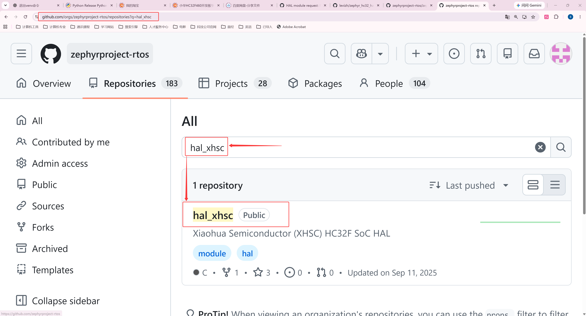
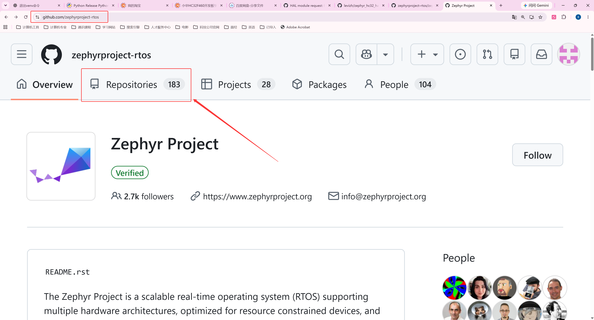

<!-- SPDX-License-Identifier: Apache-2.0 -->

# 第4章\_CMSIS与HAL选择下载

本模块目标：**按当前源码与芯片确定来源和修订，取得可核对的 CMSIS/HAL 源码目录。** 返回 [环境与依赖导航](环境与依赖导航.md)；配套 [PPT](slides/P004_CMSIS与HAL选择下载_Windows.pptx)。各章独立编号，完整复制单元按当前小节编号放在 [命令索引](commands/P004_Windows/README.md)。

实验源码根为 Windows 的 `G:\zephyr_practice\zephyr-main`，UCRT64 中为 `/g/zephyr_practice/zephyr-main`。默认 UCRT64；Windows 专用 setup.cmd 等步骤按正文切换 PowerShell。各模块不重复安装已经完成的前置工具。

前置材料：先完成 [SDK 准备与编译器选型](P003_SDK准备与编译器选型_Windows.md)。

本章要区分：下载模块只产生本地源码目录，还没有调用工程接入接口。`west update` 不等于 `EXTRA_ZEPHYR_MODULES`；前者按清单下载，后者在 CMake 配置时追加模块。两者的职责见 [CMake 接口体系](P009_Zephyr的CMake输入与依赖发现_Windows.md#module-contract)，实际接入在下一章讲解。

**复制命令：** [本章完整操作单元](commands/P004_Windows/README.md)。按正文选择分支，不把整个目录的命令依次执行。

**视频与复习对照：** 页码按当前正式 PPT；以阶段名称和正文链接定位，操作前提、完整命令、输出判断与恢复以 Markdown 为准。

| PPT 页面 | 阶段 | 完整正文 | 正文进一步展开 |
| --- | --- | --- | --- |
| 2—11 | 芯片身份、清单和 HAL 来源 | [4.1](#section-4-1) | 官方文件、仓库查找路线和清单收录状态 |
| 12—17 | CMSIS 来源与 west 下载 | [4.2.1](#section-4-2-1) | 复用工作区、版本和文件核验，不替换官方清单 |
| 18—21 | 清单外 HAL 下载与失败恢复 | [4.2.3](#section-4-2-3) | 固定修订、Git 选择、错误判断和终端恢复 |
| 22 | 只有厂商 CMSIS 包时 | [4.2.5](#section-4-2-5) | 分清 Core、设备头、启动代码与需要新增的适配 |

<a id="chip-selection"></a>

<a id="section-4-1"></a>

## 4.1\_确定需要哪些芯片源码依赖


### 4.1.1\_用两种目标解释下载依据

**已有目标案例是 Arm V2M MPS2 的 AN386 FPGA 系统配置**，在 Zephyr 中为 `mps2/an386`。AN386 表示 Cortex-M4 系统配置，不是 HC32 的芯片型号。P011 会介绍它的内存、UART、板文件并编译 `hello_world`；这里仅沿它查找依赖：

```text
boards/arm/mps2/board.yml 的 mps2 + an386
  → Kconfig.mps2 选择 SOC_AN386
  → soc/arm/mps2/Kconfig 选择 CPU_CORTEX_M4
  → arch/arm/core/Kconfig 与 modules/cmsis_6 接入 CMSIS-Core
  → west.yml 的 cmsis_6 项目提供 URL 与 revision
```

这些文件可直接阅读，无须先编译才能知道要下载什么。`modules/cmsis_6` 是 Zephyr 树内的接入规则，不等于外部 CMSIS 源码已下载。MPS2 的 CMSDK UART 等驱动在 Zephyr 源码内，本章 `hello_world` 不需要 HC32 HAL。

**新增目标案例是 UYUP-RPI-A-2.5，实装 HC32F4A0PITB**：LQFP100、Cortex-M4F、2 MiB Flash、512 KiB 主 SRAM，另有 4 KiB 备份 SRAM；主晶振 12 MHz。先抄完整丝印，与 BOM、板卡版本和数据手册订货/封装表核对。原理图 `UYUP-RPI-A-2.5.pdf` 的通用 STM32 符号不能代替实装型号，F460 的资料也不能用于 F4A0。

芯片资料从[小华产品页](https://www.xhsc.com.cn/product/1220.html)取得，本期依据 `DS_HC32F4A0系列数据手册_Rev1.60.pdf` 与 `RM_HC32F4A0系列参考手册_Rev1.50.pdf`，分别核对型号/封装及寄存器。实装引脚查 DS 第 38、42—46 页，未引出脚按 NC；不能照搬其他评估板的时钟和引脚。

当前原生源码没有 UYUP 板/HC32 SoC 适配。配套 `learning/board/labs/hc32_port` 的 SoC CMake 明确引用 `hc32_ddl/hc32f4a0/soc` 和 `drivers`；其中 `hc32f4a0.h` 描述片上寄存器并引用 CMSIS 的 `core_cm4.h`，`hc32_ll_*` 提供厂商外设操作。这才是选择 HAL 的依据。P011 会逐层加入这些适配文件，下载 HAL 本身不会让新开发板自动出现。

### 4.1.2\_CMSIS 版本不是按 Cortex-M4 随便选

CMSIS-Core 提供内核寄存器、NVIC 和编译器接口；HAL/DDL 提供芯片外设接口；SDK 提供编译、链接工具。相同 Cortex-M4 内核不意味着芯片寄存器、内存布局和 HAL 相同。CMSIS-DSP/NN 是其他算法组件，本例不要求；CMSIS-DAP 是调试协议，也不是这里要下载的 Core 源码。

在 **UCRT64、源码根、已激活 .venv** 查看本地依据：

```bash
# Windows UCRT64；在本小节指定目录执行，按上一段核对前提。
cd /g/zephyr_practice/zephyr-main
source .venv/Scripts/activate
cat boards/arm/mps2/board.yml
cat soc/arm/mps2/Kconfig
cat modules/cmsis_6/Kconfig
cat modules/cmsis_6/CMakeLists.txt
```

当前接入使用 CMSIS_6，再到同一棵源码的 `west.yml` 查 `name: cmsis_6`。下面是**官方原有 `zephyr-main/west.yml` 的只读摘录，不是待创建文件**。保持原文件完整，不删除、不替换、不把这几行另存成新的清单：

```yaml
# 只读摘录：官方 zephyr-main/west.yml 中已有的一个项目。不要覆盖原文件。
- name: cmsis_6
  repo-path: CMSIS_6
  revision: 1c1840af7a7e757d6e2fec3ddb0e5ce0dfcc93c8
  path: modules/hal/cmsis_6
```

`name` 是项目名；`repo-path` 是仓库名；`revision` 锁定配套源码；`path` 相对 **west 工作区根**。URL 优先取项目的 `url`，否则由项目/default remote 的 `url-base` 与 `repo-path`（省略时用 name）拼接。本次得到 `https://github.com/zephyrproject-rtos/CMSIS_6`。字段定义见 [west 清单说明](https://docs.zephyrproject.org/latest/develop/west/manifest.html)。

### 4.1.3\_怎样判断有无可用的官方 HAL

按三个层次分别判断，不能把它们当成同一件事：

| 核对层次 | 本次 HC32 的结果 | 接下来做什么 |
| --- | --- | --- |
| 当前 west 清单是否声明 `hal_xhsc` | 没有 | 不能直接 `west update hal_xhsc`；继续查配套移植依赖 |
| 是否存在 Zephyr 组织的 HAL 仓库且包含目标系列 | 有 `zephyrproject-rtos/hal_xhsc`，含 HC32F4A0 DDL | 查 README、module.yml、设备头与 API，固定经过适配验证的修订 |
| 当前 Zephyr 是否已经支持 UYUP 板与 HC32 SoC | 本次原生树没有 | P011 仍须新增 board、SoC、DTS 与驱动接入 |

因此，**当前清单缺少 HAL 项不等于网上没有 HAL 仓库；有 HAL 仓库也不等于有可直接使用的开发板支持**。其他芯片若既无可用模块又无兼容 API，应先从厂商产品页取得合法可用的设备包/DDL，核对许可、型号和启动方式，再建立 Zephyr 模块与驱动适配；不存在一个适合任意芯片的 `west update HAL` 命令。

本配套移植选择 [hal_xhsc 固定修订](https://github.com/zephyrproject-rtos/hal_xhsc/tree/a84e04900616f68097d80cda2e89eaa8af3afadd) `a84e04900616f68097d80cda2e89eaa8af3afadd`。这是移植 API 基线，**不是当前官方 west.yml 指定的版本**。下载整个模块，保留许可证；不用厂商包内另一套 CMSIS-Core 抢占 Zephyr 的 include 路径，也不把厂商 startup/向量表重复加入构建。

<a id="hal-origin"></a>

#### 4.1.3.1\_从哪里找到 hal_xhsc，怎样核实来源

上一张表只给出了仓库名，还不足以让读者自行查证。先从 **Zephyr 项目组织的仓库列表**入手：打开 [zephyrproject-rtos 的 Repositories](https://github.com/orgs/zephyrproject-rtos/repositories)，在仓库筛选框输入 `xhsc`，再打开 `hal_xhsc`。也可以用 GitHub 全站搜索 `org:zephyrproject-rtos hal_xhsc`，切到 Repositories 结果。不要先猜下载地址，也不要把个人 fork 当成项目组织仓库。


对应网页截图取自配套 PPT 中保留的手工说明页。打开 GitHub 的 Zephyr **组织主页**，点击与 Overview 并列的 **Repositories**，在该标签页的 **Search repositories** 输入框搜索；这里不是源码仓库里的文件搜索。界面布局以后可能变化，组织地址与仓库名仍须核对。





打开 [hal_xhsc 首页](https://github.com/zephyrproject-rtos/hal_xhsc)，查看 README 的 **1.3 XHSC HAL**：它介绍的是面向 Zephyr 的 HC32 DDL，并同时提到已支持或计划支持的系列。页面有 HC32F4A0 与 HC32F460 产品资料入口。这个表述不能单独证明当前 Zephyr 版本已经有可编译的 HC32 板。接着在本系列采用的固定修订下打开 [HC32F4A0 目录](https://github.com/zephyrproject-rtos/hal_xhsc/tree/a84e04900616f68097d80cda2e89eaa8af3afadd/hc32_ddl/hc32f4a0)，检查 `soc/hc32f4a0.h`、`drivers/inc/hc32_ll_usart.h` 及相应源文件；这是型号与 API 的实物证据。

若想知道“谁把它放到 Zephyr 组织、为什么是这个仓库”，继续在 **Zephyr 主仓的 Issues** 搜索 `hal_xhsc`，阅读 [模块申请 #86804](https://github.com/zephyrproject-rtos/zephyr/issues/86804)。申请给出了早期来源 `levizh/zephyr_hc32_hal`、XHSC 员工维护者、独立 DDL 模块的用途以及选择独立仓库的理由。维护者在 [2025-08-01 的回复](https://github.com/zephyrproject-rtos/zephyr/issues/86804#issuecomment-3141734431)确认组织仓库已创建，并要求补充 MAINTAINERS 条目以配置维护权限。这才是仓库来源和接入过程的依据，不能只凭 `hal_厂商名` 的命名猜测。

#### 4.1.3.2\_仓库建好了，为什么当前 west 仍不能下载它

Zephyr 把厂商 DDL 放在外部仓库，主源码通过清单固定需要的修订。这样厂商库可以单独维护，某份 Zephyr 源码仍能选择一份明确的依赖版本。**west 读取当前工作区清单及其导入内容，不会扫描 Zephyr GitHub 组织并下载其中所有仓库。** `MAINTAINERS.yml` 负责维护分工与权限，不是下载清单；`module.yml` 描述本地源码怎样接入构建，也不负责从网上取得它。

本次情况能在 [请求加入 west.yml 的 Issue #95973](https://github.com/zephyrproject-rtos/zephyr/issues/95973) 中直接核对：厂商明确说仓库已经建立，希望把 HAL 修订加入主仓。其申请中的修订正是本系列固定的 `a84e04900616f68097d80cda2e89eaa8af3afadd`。维护者 [回复](https://github.com/zephyrproject-rtos/zephyr/issues/95973#issuecomment-3290779676)要求把 west.yml 修改与使用该 HAL 的支持代码一起提交 PR，走正常评审流程。该 Issue 关闭表示这项流程问题得到答复，不能当成代码已经合并的证据。

截至 **2026-10-06**，本次查到的 [HC32F4A0 EVB PR #94044](https://github.com/zephyrproject-rtos/zephyr/pull/94044) 和后来的 [SkyStar PR #111990](https://github.com/zephyrproject-rtos/zephyr/pull/111990) 均为 **Closed，未合并**；维护者条目 PR #94941 也未合并。当前实验源码的活动清单没有 `hal_xhsc`。这些证据解释了“组织仓库存在，但本次原生源码没有默认依赖与完整板级支持”的状态；不推测厂商停止维护，也不把其他板的 PR 当作 UYUP 支持。


图中的 ④、⑤ 是上游集成的后续条件，不是宣称这些 HC32 PR 已经走完。读者换用更新版本时，应重新查看该版本的活动清单、对应 PR 的 **Merged** 状态及板文档，不能永久沿用“清单没有”的判断。本期保持官方清单原样，4.2.3 固定获取清单外 HAL，P011 通过 Zephyr 原生额外模块接口接入；正式维护下游清单的操作另见 [west 专题](../west/大纲.md)。官方也支持下游清单或 `submanifests` 扩展，这里只解释选择，不增加清单编写实验。参见 [Zephyr 模块机制与提交流程](https://docs.zephyrproject.org/latest/develop/modules.html)。

<a id="board-layout"></a>
板厂、SoC 厂商与架构目录的逐文件对照移至 [P011 11.5](P011_编译示例与新增开发板_Windows.md#board-layout)，在开始新增板时阅读。

<a id="section-4-2"></a>

## 4.2\_下载并核验 CMSIS 和 HAL


<a id="section-4-2-1"></a>

### 4.2.1\_下载前只检查工具与已有清单

本期的目标是取得 CMSIS 源码，不是练习编写 west 清单。**`zephyr-main/west.yml` 已随官方源码提供，全程保留原样。** `west init -l .` 只让工具记住这份现成清单的位置，生成父目录中的 `.west/config`，不会生成或替换 `west.yml`。已经建立工作区时直接复用。

Windows 这里有一个实际会阻断下载的前提：本系列采用 Windows Python，因此让它调用 **Git for Windows**。UCRT64 自带的 `/usr/bin/git` 是另一套 Git。本机曾出现 `^{commit}` 被转成 `^commit`，报 `not a valid SHA1`；这时不是 CMSIS 提交丢了，更不能去重建清单。

```bash
# Windows UCRT64；进入实验源码根并激活已有 .venv。
cd /g/zephyr_practice/zephyr-main
source .venv/Scripts/activate
python -c "import shutil; print(shutil.which('git'))"
git --version
```

若路径落在 `Msys2/usr/bin`，执行下面的纠正块。它提示你粘贴**已安装的 Git for Windows 的 cmd 目录**，其中应有 git.exe。默认安装常为 `C:\Program Files\Git\cmd`；本机实际为 `E:\git\Git\cmd`，不是让读者创建这两个目录。若已经使用正确的 Git，则跳过纠正块。

```bash
# Windows UCRT64；当前终端选错 Git 时执行。输入 Windows 路径，不加引号。
# GIT_CMD_DIR 仅是本块读取输入的 Bash 临时变量，随后用于 PATH 并删除。
read -r -p '已安装的 Git for Windows 的 cmd 目录：' GIT_CMD_DIR
if test -f "$(cygpath -u "$GIT_CMD_DIR")/git.exe"; then
  export PATH="$(cygpath -u "$GIT_CMD_DIR"):$PATH"
  hash -r
else
  printf '该目录没有 git.exe，请重新核对 Git for Windows 安装位置。\n'
fi
unset GIT_CMD_DIR
python -c "import shutil; print(shutil.which('git'))"
git --version
```

输出路径应指向刚选的 `cmd/git.exe`，版本文字中含 `.windows.`。PATH 修改作用于**当前 UCRT64 及其启动的程序**；重新打开窗口后要复查，持久设置见 2.1.1。下面的下载块也会检查版本，防止选错 Git 后继续执行。

最后只做一次工作区检查。下面的条件分支会自动跳过已完成的初始化，不要再单独无条件执行 `west init`：

```bash
# Windows UCRT64；仍在实验源码根，.venv 已激活；复用官方原有 west.yml。
test -f west.yml && if west topdir >/dev/null 2>&1; then
  printf '已有 west 工作区，复用现有配置。\n'
else
  west init -l .
fi
west topdir
west config manifest.path
west config manifest.file
```

本系列输出应分别为 `G:/zephyr_practice`、`zephyr-main`、`west.yml`。若已经得到这三个结果，即使先前误执行 init 报了 `already initialized`，也可以继续下载，**不按通用错误提示删除 `.west`**。如果三项指向其他项目，先回到正确的源码根核对，停止本章下载，不覆盖那份工作区配置。

清单格式、自己新建清单、多仓库版本管理已有独立的 [west 实验专题](../west/大纲.md)。那里的练习工作区和模拟仓库服务于 west 实验，不能把其练习 `west.yml` 搬来替换这里的官方清单。

### 4.2.2\_下载 CMSIS，看到哪些文件才算完成

CMSIS-Core 是要被固件包含的源码与头文件，**没有 Windows 安装向导，也不安装进 SDK 或 .venv**。在当前源码根运行下面的完整操作单元：

```bash
# Windows UCRT64；源码根；4.2.1 已核对工作区，.venv 已激活。
# 版本标识必须属于 Git for Windows；不匹配则停止，回到 4.2.1 修正 PATH。
git --version | grep -q '\.windows\.' &&
west list cmsis_6 -f '{url} {revision} {abspath}' &&
west update cmsis_6 &&
test -f ../modules/hal/cmsis_6/zephyr/module.yml &&
test -f ../modules/hal/cmsis_6/CMSIS/Core/Include/core_cm4.h &&
printf 'CMSIS 下载完成，模块入口与 Cortex-M4 Core 头文件均存在。\n'
```

`west list` 先显示**官方清单决定的仓库、版本和本机落点**；`west update cmsis_6` 才按这份要求下载。`&&` 表示前一项成功才继续，因此只有最后出现“CMSIS 下载完成”才能进入后续步骤。本次清单仓库为 `https://github.com/zephyrproject-rtos/CMSIS_6`，提交为 `1c1840af7a7e757d6e2fec3ddb0e5ce0dfcc93c8`。它不是自行选择网上最新版本，也不是从 Zephyr 主仓库手工摘取文件。

```text
G:\zephyr_practice\
├─ .west\config                          [west 工具生成，记录清单位置]
├─ zephyr-main\                         [P001 已取得的官方源码]
│  ├─ west.yml                          [官方原文件，只读使用]
│  └─ modules\cmsis_6\CMakeLists.txt     [官方已有的构建接入规则]
└─ modules\hal\cmsis_6\                 [west update 下载的外部模块]
   ├─ zephyr\module.yml                 [模块仓库自带，不需新建]
   └─ CMSIS\Core\Include\core_cm4.h     [下载得到的通用 Core 头文件]
```

这两处 `modules/cmsis_6` 含义不同：源码根里面的是**接入规则**，父目录下面的是**实际 CMSIS 源码**。不是下载后名字碰巧不同，更不需要把后者覆盖到前者。

下载过模块、但后来自己修改过时，先保存修改再更新。只想确认当前版本而不重复下载，可以执行：

```bash
# Windows UCRT64；源码根；模块已经由 west 下载，Git for Windows 已选对。
git -C ../modules/hal/cmsis_6 rev-parse HEAD
git -C ../modules/hal/cmsis_6 rev-parse manifest-rev
```

两项应一致；本次均为上面的固定提交。这里只按名取得当前最小示例所需 CMSIS，其他应用有其他依赖；全量下载与项目分组交给 west 专题，不在本期展开。

CMSIS 已由 west 管理。配置应用时，Zephyr 会从同一工作区的 west 清单取得项目目录，再检查模块入口。完整调用过程见 [P005](P005_源码模块接入Zephyr工程_Windows.md)，不在这里重复讲工程配置。

<a id="section-4-2-3"></a>

### 4.2.3\_为清单外的 HC32 HAL 准备固定版本

4.1.3 已确认当前官方清单没有 `hal_xhsc`，因此不能直接写 `west update hal_xhsc`。这与 CMSIS 已有清单项不同。先在 [hal_xhsc 固定提交](https://github.com/zephyrproject-rtos/hal_xhsc/tree/a84e04900616f68097d80cda2e89eaa8af3afadd) 核对 `hc32_ddl/hc32f4a0/soc/hc32f4a0.h` 和 `drivers/inc/hc32_ll_usart.h`，确认芯片和 API 与本次移植匹配。

本期用 Git 取得整个模块并检出移植基线，保持官方 `west.yml` 不变。下面目录是教程为额外依赖选择的位置；`zephyr/module.yml`、许可证和 DDL 则是模块仓库原有文件，不是读者新建的适配。

```bash
# Windows UCRT64；实验源码根。仅在 hal_xhsc 目录尚不存在时执行此下载块。
mkdir -p build/learning-tools/deps
test ! -e build/learning-tools/deps/hal_xhsc && \
  git clone --no-checkout https://github.com/zephyrproject-rtos/hal_xhsc \
    build/learning-tools/deps/hal_xhsc && \
  git -C build/learning-tools/deps/hal_xhsc checkout --detach \
    a84e04900616f68097d80cda2e89eaa8af3afadd
```

已有目录时先核对原来的来源和内容，不删除重下。若是之前按同一固定修订解压的完整 ZIP，可继续复用；它没有 `.git`，不能执行下面的 `git rev-parse`，应以原下载记录核对基线。Git 路线检出的提交应与上面的固定基线一致，然后两种路线都检查模块和芯片文件：

```bash
# Windows UCRT64；源码根。仅 Git 下载的 HAL 执行这一项提交核验。
git -C build/learning-tools/deps/hal_xhsc rev-parse HEAD
```

```bash
# Windows UCRT64；源码根；Git 或已有完整 ZIP 模块都要核对这些原有文件。
cat build/learning-tools/deps/hal_xhsc/zephyr/module.yml
test -f build/learning-tools/deps/hal_xhsc/hc32_ddl/hc32f4a0/soc/hc32f4a0.h && printf 'HC32F4A0 OK\n'
test -f build/learning-tools/deps/hal_xhsc/hc32_ddl/hc32f4a0/drivers/inc/hc32_ll_usart.h && printf 'USART DDL OK\n'
```

下载和关键文件核对到这里完成。工程如何接收这个路径、发现模块和生成构建变量，单独见 [P005 源码模块接入](P005_源码模块接入Zephyr工程_Windows.md)。

### 4.2.4\_失败恢复与手动下载的使用边界

`west update cmsis_6` 网络失败时，先核对报错中的 URL、网络代理及当前工作区，再重试同一命令；它会复用已有仓库。不要因为网络失败改取默认分支最新 ZIP，也不要关闭证书验证。`west list` 提示找不到项目时先核对 `manifest.path`、`manifest.file` 和当前源码的真实项目名。

手动下载只作为无法使用 Git/west、离线转运等特殊情况的补充：在清单指定的仓库网页进入指定提交，再选择 **Code → Download ZIP**，取得完整模块并保留许可证、`zephyr/module.yml`。它不会自动获得 west 项目的 Git 元数据，不能将 ZIP 解压到 west 管理的模块目录后当作已完成 `west update`。需要无 west 的独立构建时再使用 `ZEPHYR_MODULES` 指明完整模块根，并独立核验版本。该路线不是本期与 P011 主线的前提，也不要求已用 west 成功下载的读者再做一遍。


<a id="section-4-2-5"></a>

### 4.2.5\_只有芯片厂商的 CMSIS 包时，拿什么去移植

先辨别“没有”的对象。**没有该芯片的 Zephyr 支持，不等于没有通用 CMSIS-Core。** 本次 Cortex-M4 的 Core 仍使用 4.2.2 下载的 Zephyr 配套模块；缺的是芯片的寄存器定义、初始化与 Zephyr SoC/驱动连接。如果 `west list cmsis_6` 根本找不到条目，先核对当前源码修订和已有清单，有的版本使用别的 CMSIS 项目名；不能直接把厂商 ZIP 当成缺少的 west 项目。

厂商把材料称为“CMSIS”时，下载物常是芯片设备包（DFP）、DDL 或例程包。去**芯片厂商对应型号的产品页/下载中心**，确认完整料号、设备包适用系列、版本与许可证，再取得发行包；如果是 CMSIS-Pack，可通过 [Arm 的设备包入口](https://www.keil.arm.com/packs/)核对发布者和支持器件。包里的 `.pdsc` 是原有的包描述，可用于查设备名、版本和文件位置，不是让读者新建的配置。具体目录以下载物为准，不为了与示意图相同而重命名。

解压后先在原包中辨认以下内容，再决定接入哪些文件。下面 `<芯片>` 表示命名模式，**不是一个实际文件名或待创建的目录**。这一区分与 [Arm 的设备文件说明](https://arm-software.github.io/CMSIS_6/main/Core/cmsis_device_files.html)一致。

| 厂商包中找到的内容 | 它提供什么 | 接到 Zephyr 时怎样处理 |
| --- | --- | --- |
| `core_cm4.h`、`cmsis_gcc.h` 等 Core 文件 | ARM 通用内核接口 | 保留作版本/兼容性参考，不抢占 Zephyr 已选 Core 的 include 路径 |
| `<芯片>.h`，如 `hc32f4a0.h` | IRQ 编号、内核能力宏、片上寄存器地址与结构体 | 保留许可，接入对应 SoC 的头文件路径，核对它引用的 Core 与编译器接口是否兼容 |
| `system_<芯片>.h/.c` | 时钟变量与芯片初始化函数 | 核对晶振和启动顺序，选择需要的实现，由 SoC 启动钩子调用，不能整包盲目加入 |
| `startup_<芯片>.s/.c`、裸机链接脚本 | 裸机向量、复位入口和内存布局 | 用于核对中断/启动/内存依据；保留 Zephyr 启动与链接框架，按 SoC 移植入口适配 |
| HAL/DDL 的外设 `.h/.c`，若包中有 | USART、GPIO 等厂商操作函数 | 按需求接入，再编写或适配 Zephyr 驱动 API |

拿到设备头还不等于串口能打印。若包中**只有设备头和 system/startup，没有 HAL**，可以依据设备头和芯片参考手册编写寄存器级 Zephyr 驱动；必须实现时钟、引脚、外设寄存器和相应 Zephyr API，不能只改一个清单名。没有经过实现和核验前，不声明该外设已支持。

本系列 HC32 的情况更具体：已有 `hal_xhsc` 模块，其设备头和 DDL 由 4.2.3 的 Git 下载步骤取得，不需要读者再造一套厂商包。P011 11.6.3 会展示 `soc.h → hc32f4a0.h → core_cm4.h` 的实际连接和 CMake 文件来源；7.6.4 再讲 DDL 如何接成 Zephyr 驱动。**P002—P005 的完成条件是分清材料、准备正确文件，新增与编译放到 P011。**


下一模块：[源码模块接入 Zephyr 工程](P005_源码模块接入Zephyr工程_Windows.md)。


上一篇：[P003](P003_SDK准备与编译器选型_Windows.md)；下一篇：[P005](P005_源码模块接入Zephyr工程_Windows.md)。
