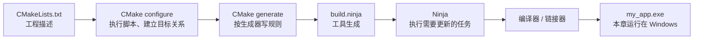
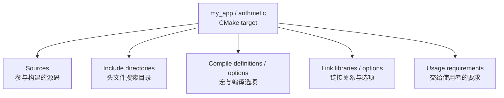
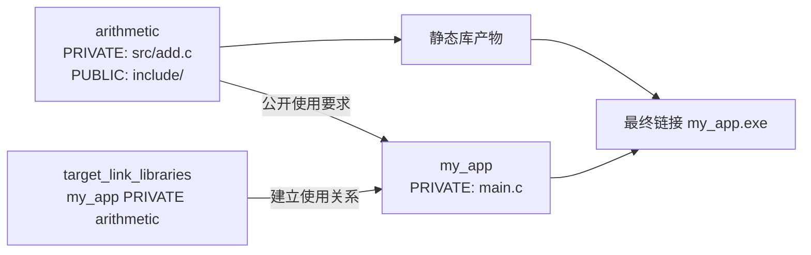
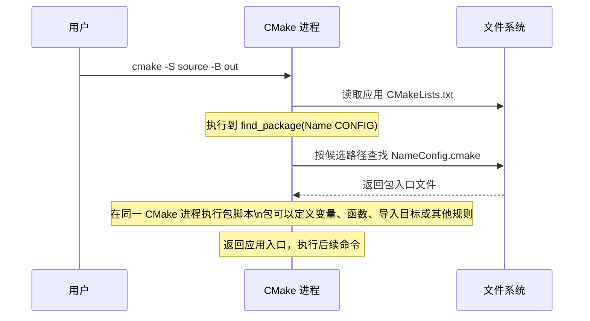

<!-- SPDX-License-Identifier: Apache-2.0 -->

# 第6章\_原生CMake与目标模型

前几章已经分别准备主机工具、SDK 和源码依赖。现在先暂停添加 Zephyr 名词，用一个普通 C 程序认识构建系统。本章的程序在 Windows 电脑上运行；下一章才把这个模型带入 Zephyr，解释为什么应用没有创建 `app`，却能向它添加源码。

配套 [PPT](slides/P006_原生CMake与目标模型_Windows.pptx) 用于关系讲解和复习；本文保留完整文件、操作、预期结果和排错方法。以下命令供读者执行，本次材料整理只做静态核对，没有代读者安装工具或运行实验。

**复制命令：** [本章完整操作单元](commands/P006_Windows/README.md)。按正文选择分支，不把整个目录的命令依次执行。

**视频与复习对照：** 页码按当前正式 PPT；以阶段名称和正文链接定位，操作前提、完整命令、输出判断与恢复以 Markdown 为准。

| PPT 页面 | 阶段 | 完整正文 | 正文进一步展开 |
| --- | --- | --- | --- |
| 2—5 | 构建阶段与目录 | [6.1](#section-6-1) | 区分 CMake、Ninja、编译器和产物 |
| 6—10 | 创建并构建普通程序 | [6.2](#section-6-2) | 文件创建、完整命令与成功条件 |
| 11—16 | target 与使用要求 | [6.3](#section-6-3) | 源码、头文件路径、库及 PUBLIC/PRIVATE/INTERFACE |
| 17—19 | 子目录和包入口 | [6.4](#section-6-4) | add_subdirectory 与 find_package 的不同作用 |
| 20—22 | 变量、缓存与目标属性 | [6.5](#section-6-5) | 谁读取输入，怎样影响编译，并交接到 Zephyr |

<a id="section-6-1"></a>

## 6.1\_先认识三种工作，而不是背三条命令

只有一个 `main.c` 时，直接调用编译器也能得到程序。文件变多后，我们还要描述哪些文件组成一个库、谁使用这个库、哪些头文件目录和编译条件应传给使用者，以及修改一个头文件后需要重编译哪些对象。这些关系不能靠“把目录里的所有文件都编译一次”表达。

CMake 执行项目的 `CMakeLists.txt` 和 `.cmake` 文件，建立目标及依赖，再将它们转换为所选构建工具的规则。Ninja 读取规则并决定哪些任务到期，然后调用编译器、链接器等程序。这里的“目标”是 CMake 管理的构建对象，可能产生可执行文件、库，也可能表示自定义任务。



一次 `cmake -S ... -B ...` 通常连续完成 configure 和 generate，所以终端里相邻出现 `Configuring done` 与 `Generating done`。两者是同一次 CMake 调用中的不同工作，并不是必须分开执行的两个命令。配置阶段也可能做编译器探测；应用的完整编译和链接由后续构建阶段完成。

`CMakeLists.txt` 既是工程描述文件，也是用 CMake 语言写成、在配置阶段执行的脚本。它不直接交给 GCC，也不是预先写好的 Ninja 规则。依据：[CMake 构建系统手册](https://cmake.org/cmake/help/latest/manual/cmake-buildsystem.7.html)，本机原件为 CMake 安装根下 `share/cmake-<版本>/Help/manual/cmake-buildsystem.7.rst`。本章使用稳定的基础接口；本系列已安装的 CMake 4.4.x 满足下文声明的最低版本。

<a id="section-6-2"></a>

## 6.2\_用两个文件创建一个普通工程

### 6.2.1\_工具、目录和文件来源

终端为 **Windows MSYS2 UCRT64 Bash**，从 `G:/zephyr_practice/zephyr-main` 开始。本章把练习文件放在源码根的 `build/learning-tools/cmake-native/`，只是为了集中存放练习；它不是 Zephyr 应用，不读取 Zephyr 的根 CMakeLists.txt，也不使用 ARM SDK 编译器。`source/` 是本章自行创建的练习源码目录，`out/` 是 CMake 随后生成的构建目录。

先检查 P002 已准备的 CMake/Ninja；普通 Windows C 程序还需要主机 GCC。本章的主机 GCC 与 P003 的 `arm-zephyr-eabi-gcc` 用途不同：前者生成 Windows 程序，后者为目标 CPU 生成固件。

```bash
# Windows UCRT64；源码根；只检查，不安装或编译。
cd /g/zephyr_practice/zephyr-main
cmake --version
ninja --version
command -v gcc
gcc -dumpmachine
```

本例主机 GCC 的目标应为 `x86_64-w64-mingw32`。若缺失，只为这个主机练习安装 UCRT64 GCC：

```bash
# Windows UCRT64；任意目录；仅上一块确认缺少主机 GCC 时执行。
# 这是 Windows 主机练习编译器，不是 Zephyr ARM SDK。
pacman -S --needed mingw-w64-ucrt-x86_64-gcc
gcc -dumpmachine
```

包来源为 [MSYS2 UCRT64 GCC](https://packages.msys2.org/packages/mingw-w64-ucrt-x86_64-gcc)。若已有另一套 GCC，不用复制作者的安装盘符；先核对实际目标，避免误用 ARM 交叉编译器。此练习不需要 Python、west、CMSIS 或已连接开发板。

```text
zephyr-main/
└── build/learning-tools/cmake-native/   本章练习容器，自行创建
    ├── source/                        自行创建的 source tree
    │   ├── CMakeLists.txt              下面写入
    │   └── main.c                      下面写入
    └── out/                           后续 CMake 创建的 build tree
```

首次执行以下完整块。目录已存在会停止，避免覆盖此前练习；复习时直接阅读已有文件或先自行选择新的练习名称，不删除现有目录来“清理环境”。

```bash
# Windows UCRT64；源码根；前提：已确认主机 CMake、Ninja、GCC 可用。
cd /g/zephyr_practice/zephyr-main
if test -e build/learning-tools/cmake-native/source; then
  printf '%s\n' '练习源码已存在，请先检查内容，不覆盖。'
else
  mkdir -p build/learning-tools/cmake-native/source
  cat > build/learning-tools/cmake-native/source/main.c <<'EOF'
#include <stdio.h>

int main(void)
{
    puts("Hello from native CMake");
    return 0;
}
EOF
  cat > build/learning-tools/cmake-native/source/CMakeLists.txt <<'EOF'
# 本教程自行创建的普通 CMake 工程，不是 Zephyr 官方文件。
cmake_minimum_required(VERSION 3.28)
project(native_demo LANGUAGES C)
add_executable(my_app main.c)
EOF
fi
```

### 6.2.2\_逐行读懂项目入口

`cmake_minimum_required(VERSION 3.28)` 声明最低 CMake 版本和相关策略基线，不安装 CMake。`project(native_demo LANGUAGES C)` 设置项目名称并启用 C 语言，因而触发相应编译器识别；项目名 `native_demo` 不自动等于生成的程序名。

`add_executable(my_app main.c)` 创建名为 `my_app` 的可执行目标，并把 `main.c` 加入其源码集合。`my_app` 是目标标识，`main.c` 是输入文件；在本例 Windows 平台上，构建后通常得到 `my_app.exe`。目标还可以设置输出名称，所以目标名、磁盘文件名、项目名是可以分别讨论的对象。

依据：[project](https://cmake.org/cmake/help/latest/command/project.html)、[add_executable](https://cmake.org/cmake/help/latest/command/add_executable.html)。本机原件分别为 CMake 安装根的 `Help/command/project.rst`、`Help/command/add_executable.rst` 所在帮助目录，不在 Zephyr 源码中。

### 6.2.3\_先配置和生成，再编译和运行

```bash
# Windows UCRT64；源码根；前提：6.2.1 的两个练习文件已经创建。
cd /g/zephyr_practice/zephyr-main
cmake -S build/learning-tools/cmake-native/source \
  -B build/learning-tools/cmake-native/out -G Ninja
```

`-S` 选择顶层 CMakeLists.txt 所在的源码目录；`-B` 选择独立的构建目录；`-G Ninja` 选择生成器，即要求 CMake 输出适合 Ninja 的规则。Ninja 必须已安装，`-G` 不会下载它。

先看 C 编译器识别是否指向主机工具，再看 `Configuring done`、`Generating done` 和输出目录。成功后 `out/CMakeCache.txt` 保存配置状态，`out/build.ninja` 保存规则。这时应用还没有完成编译。若配置失败，不继续下一块：缺 GCC 回 6.2.1，找不到 CMakeLists.txt 则核对 `-S` 和文件创建位置。

```bash
# Windows UCRT64；源码根；前提：上一块 configure/generate 正常结束。
cd /g/zephyr_practice/zephyr-main
if cmake --build build/learning-tools/cmake-native/out --parallel 4; then
  ./build/learning-tools/cmake-native/out/my_app.exe
else
  printf '%s\n' '本次构建失败，先检查第一处编译或链接错误。'
fi
```

预期程序输出 `Hello from native CMake`。`cmake --build` 根据这个构建目录已经选定的生成器调用 Ninja；并不是 CMake 自己替代了 GCC。条件分支确保本次构建失败时不会继续运行遗留的旧程序。

对这个已生成 Ninja 规则的目录，`ninja -C build/learning-tools/cmake-native/out` 是直接调用同一后端的形式。日常保留 `cmake --build` 即可，不必把两种形式每次都运行一遍。依据：[CMake 命令行配置与构建](https://cmake.org/cmake/help/latest/manual/cmake.1.html)，本机对应 `Help/manual/cmake.1.rst`。

<a id="section-6-3"></a>

## 6.3\_围绕目标增加源码和使用要求

### 6.3.1\_目标是一组属性的归属点

下面是对象组成图，不表示执行顺序。它解释为什么现代 CMake 倾向于对指定目标调用 `target_*`，而不是把所有编译选项都写成全局变量。



`target_sources` 添加源码，`target_include_directories` 添加头文件搜索目录，`target_compile_definitions` 添加宏定义，`target_compile_options` 添加编译选项，`target_link_libraries` 描述目标之间的链接和使用关系。文件出现在磁盘上，不会自动改变这些属性；例如新增一个 `foo.c`，还要通过适当接口把它加进目标。

`add_executable(my_app main.c)` 也可以写成以下**等价入口替换**，不是把新内容追加到旧 `add_executable` 后再创建一次同名目标：

```cmake
# 文件内容：替换练习 source/CMakeLists.txt，保留同一目标 my_app。
cmake_minimum_required(VERSION 3.28)
project(native_demo LANGUAGES C)
add_executable(my_app)
target_sources(my_app PRIVATE main.c)
```

先创建目标，再对它设置属性。此处 `PRIVATE` 表示 `main.c` 属于 `my_app` 自己的构建输入，不作为接口源码传播给使用者。它不是 C 语言访问权限，也不是目录的操作系统权限。

### 6.3.2\_加入一个库，观察关系如何传播

现在让程序调用 `add(2, 3)`。这次由读者在练习 `source/` 下新建 `include/add.h` 和 `src/add.c`，并用下面的内容替换当前练习入口与 `main.c`。这是同一个练习的第二阶段，不修改 Zephyr 官方应用。先保存需要保留的个人练习改动；各文件内容可从配套 `labs/cmake_native/02_targets` 对照读取。

```text
source/                    本章自行维护
├── CMakeLists.txt          本阶段替换
├── main.c                  本阶段替换
├── include/add.h           本阶段新建
└── src/add.c               本阶段新建
```

`include/add.h` 的完整内容：

```c
/* 本教程自行创建的公开头文件。 */
#ifndef DEMO_ADD_H
#define DEMO_ADD_H
int add(int a, int b);
#endif
```

`src/add.c` 的完整内容：

```c
/* 本教程自行创建的库实现。 */
#include "add.h"
int add(int a, int b)
{
    return a + b;
}
```

`main.c` 的完整替换内容：

```c
#include <stdio.h>
#include "add.h"
int main(void)
{
    printf("2 + 3 = %d\n", add(2, 3));
    return 0;
}
```

`CMakeLists.txt` 的完整替换内容：

```cmake
# 文件内容：本章练习 source/CMakeLists.txt，不是终端命令。
cmake_minimum_required(VERSION 3.28)
project(native_demo LANGUAGES C)

add_library(arithmetic STATIC)
target_sources(arithmetic PRIVATE src/add.c)
target_include_directories(arithmetic PUBLIC
  "${CMAKE_CURRENT_SOURCE_DIR}/include")

add_executable(my_app)
target_sources(my_app PRIVATE main.c)
target_link_libraries(my_app PRIVATE arithmetic)
```

`arithmetic` 的实现需要 `add.h`，使用这个库的 `my_app` 也需要 `add.h`，因此头文件搜索目录使用 `PUBLIC`。`my_app` 通过 `target_link_libraries` 关联 `arithmetic`，同时消费该库声明的使用要求；无需再手写一遍同一个 `-I` 路径。这里传播的是头文件搜索规则，不是把头文件复制到其他目录。



完成文件编辑后，重跑 6.2.3 的配置块，再构建、运行同一目录，预期变成 `2 + 3 = 5`。若链接报 `add` 未定义，先看是否建立了目标链接关系；若预处理报 `add.h` 缺失，先看 include 目录及使用要求。不要用复制 `.a` 或把头文件到处拷贝来掩盖目标关系缺失。

### 6.3.3\_PRIVATE、PUBLIC、INTERFACE 的边界

下表解释的是支持这些关键字的目标接口中，本目标构建要求与传递给使用者的要求；具体命令仍有自己的限制。

| 关键字 | 用于构建当前目标 | 作为使用要求提供给消费者 |
| --- | --- | --- |
| PRIVATE | 是 | 否 |
| PUBLIC | 是 | 是 |
| INTERFACE | 否 | 是 |

对本例 `target_include_directories(arithmetic PUBLIC ...)`，库和程序都收到搜索目录。如果改成 `PRIVATE`，库自己仍可能成功，但 `my_app` 找不到 `add.h`；如果改成 `INTERFACE`，消费者可能成功，而库自己的 `add.c` 找不到头文件。这是从“谁需要该要求”选择关键字，不是“PUBLIC 更高级”。

宏定义和编译选项也按真实使用者归属。例如内部调试宏可以用 `target_compile_definitions(arithmetic PRIVATE ARITHMETIC_TRACE=1)`；若一个宏影响公开头文件的布局，消费者也需要一致值，此时必须设计相应公开要求。不要把所有实现 `.c` 都标成 PUBLIC：`INTERFACE_SOURCES` 可成为消费者的源码，可能造成意外重复编译。

静态库的最终链接依赖还有额外规则：`PRIVATE` 不等于最终可执行文件绝对不会链接它的依赖。区分“编译使用要求传播”和“完成最终链接需要的库”，不能把三列表格当作所有接口的全部语义。依据：[目标构建与传递使用要求](https://cmake.org/cmake/help/latest/manual/cmake-buildsystem.7.html#target-build-specification)，对应 CMake 安装帮助目录的 `Help/manual/cmake-buildsystem.7.rst`；具体接口见 [target_include_directories](https://cmake.org/cmake/help/latest/command/target_include_directories.html)、[target_link_libraries](https://cmake.org/cmake/help/latest/command/target_link_libraries.html)。

<a id="section-6-4"></a>

## 6.4\_子目录与包分别从哪里引入规则

### 6.4.1\_add_subdirectory 继续处理工程内的目录

工程变大时，可以把 `arithmetic` 的 CMake 描述搬到子目录。以下是**布局变体，只读对照**，不是要求在上一阶段继续追加同名库。`add_subdirectory(lib)` 在配置阶段处理 `lib/CMakeLists.txt`，子目录创建的目标随后供根目录使用。

```text
source/
├── CMakeLists.txt          创建程序，调用 add_subdirectory(lib)
├── main.c
└── lib/
    ├── CMakeLists.txt      创建 arithmetic
    ├── add.c
    └── include/add.h
```

```cmake
# 只读：上述布局的根 source/CMakeLists.txt 主体。
cmake_minimum_required(VERSION 3.28)
project(native_demo LANGUAGES C)
add_subdirectory(lib)
add_executable(my_app main.c)
target_link_libraries(my_app PRIVATE arithmetic)
```

```cmake
# 只读：对应 lib/CMakeLists.txt 主体。
add_library(arithmetic STATIC add.c)
target_include_directories(arithmetic PUBLIC
  "${CMAKE_CURRENT_SOURCE_DIR}/include")
```

处理子目录时，`CMAKE_CURRENT_SOURCE_DIR` 指向 `lib`，不再是顶层 `source`。这类 CMake 原生目录变量帮助文件在移动位置后仍以所属目录解析路径。普通变量通常有目录作用域；目标是否可见则由目标类型等规则决定，不应简单当作同一套变量作用域。依据：[add_subdirectory](https://cmake.org/cmake/help/latest/command/add_subdirectory.html)。

### 6.4.2\_find_package 查找并执行包提供的入口

`find_package` 用来查找包并加载相应规则，它自己不等于下载器。Config 模式查找 `NameConfig.cmake` 或 `name-config.cmake` 一类包入口；Module 模式寻找 `FindName.cmake`。基本调用还可能受模式优先级和配置影响，本文先认识两种入口，不假设每一个包都用相同方法。



例如本系列的 `find_package(Zephyr)` 会进入源码包的 `ZephyrConfig.cmake`。`Zephyr_DIR` 是 CMake 的 `<PackageName>_DIR` 定位约定；Zephyr SDK 的包名为 `Zephyr-sdk`，其入口和路径是另一组对象。找到 Zephyr 源码包，不能推出 SDK 包也已找到。

一般包常提供可供链接的导入目标，但不能把“所有 find_package 都创建一个 app”当成 CMake 的规则。Zephyr 提供的配置脚本执行了自己的初始化，才会创建它的目标。具体调用与 `app` 的来源放在下一章解释。依据：[find_package](https://cmake.org/cmake/help/latest/command/find_package.html)、[Config 模式搜索过程](https://cmake.org/cmake/help/latest/command/find_package.html#config-mode-search-procedure)；本机原件 `Help/command/find_package.rst`。

<a id="section-6-5"></a>

## 6.5\_变量、缓存与目标属性各管什么

`set(name value)` 通常建立当前作用域的普通变量。`-Dname=value` 向所选构建目录的缓存传值，下一次配置可能继续读取它；`set(... CACHE ...)` 和 `option(...)` 也可以声明缓存项。目标属性属于指定目标，影响该目标的构建或使用要求。三个对象需要各自的读取者，不能把“传了 -D”理解为对所有编译器自动添加同名宏。

以下是可以加到第二阶段练习 CMakeLists.txt **创建 my_app 之后**的内容；`DEMO_TRACE` 是本练习定义的缓存选项，不是 CMake 或 Zephyr 内建功能：

```cmake
# 练习自定义输入；option 写缓存，if 读取，target 接口才影响编译器。
option(DEMO_TRACE "Enable the tutorial trace macro" OFF)
if(DEMO_TRACE)
  target_compile_definitions(my_app PRIVATE DEMO_TRACE=1)
endif()
```

```bash
# Windows UCRT64；源码根；仅已手动加入上一段 option/if 后执行。
cd /g/zephyr_practice/zephyr-main
cmake -S build/learning-tools/cmake-native/source \
  -B build/learning-tools/cmake-native/out -DDEMO_TRACE:BOOL=ON
cmake -N -LAH build/learning-tools/cmake-native/out
```

`-N` 只读取现有缓存，不重新配置；列表中应看到 `DEMO_TRACE:BOOL=ON`。这里没有修改 `main.c`，因此程序输出仍相同；要核对宏是否交给编译器，可在需要重编译时用 `cmake --build ... --verbose` 观察实际命令。`-DDEMO_TRACE` 由 CMake 读取，编译命令里的 `-DDEMO_TRACE=1` 则由 C 编译器读取，中间的 `if` 和目标接口把二者连接起来。

取消本练习选项时，重新配置同一目录并传 `-DDEMO_TRACE:BOOL=OFF`。本节只建立保存范围概念；缓存优先级、`-U`、clean、fresh、pristine 和预设组合统一在 [P010](P010_CMake缓存与构建排错_Windows.md)展开。依据：[option](https://cmake.org/cmake/help/latest/command/option.html)、[set CACHE](https://cmake.org/cmake/help/latest/command/set.html#set-cache-entry)、[目标宏定义](https://cmake.org/cmake/help/latest/command/target_compile_definitions.html)。

## 6.6\_把模型带入 Zephyr

到这里，读者应能分别指出项目入口、源码目录、构建目录、目标、目标属性、生成器、后端和编译器。下一章只新增一个问题：**Zephyr 的配置包替应用建立了哪些规则和目标？**

| 普通工程的对象 | 下一章的对应关系 |
| --- | --- |
| 自己 add_executable(my_app) | Zephyr 初始化先创建 app 库及其他目标 |
| target_sources(my_app PRIVATE main.c) | 应用向既有 app 添加 src/main.c |
| 主机 GCC 生成 my_app.exe | 按板和架构选择交叉编译器，链接固件 |
| CMake 配置和生成，Ninja 构建 | 同样的阶段，加入 Zephyr 的硬件、功能和依赖规则 |
| 直接 cmake 与 cmake --build | west build 可以组织这些调用，仍使用同一构建模型 |

先能解释本章两目标示例，再读 [P007 Zephyr 应用构建](P007_Zephyr应用构建_Windows.md)。本章没有下载、烧录 HC32，也不能用 Windows 主机程序运行成功证明芯片移植成功。

自查时可以尝试回答：新增一个 `.c` 为什么不一定参与编译；`-G Ninja` 为什么不是选编译器；库的 PUBLIC 头文件目录如何抵达程序；为什么 `cmake --build` 与 Ninja 可以操作同一目录；一个只有源码 ZIP 的 Zephyr 目录还缺哪些外部输入。回答所需的关系应当能从前面的文件和图中逐步指出，不靠记住一串命令。


上一篇：[P005](P005_源码模块接入Zephyr工程_Windows.md)；下一篇：[P007](P007_Zephyr应用构建_Windows.md)。
