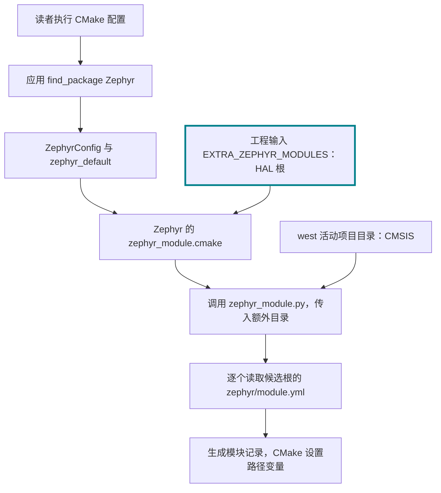

<!-- SPDX-License-Identifier: Apache-2.0 -->

# 第6章\_源码模块接入Zephyr工程

本模块目标：**把本地模块路径交给 Zephyr 工程，沿实际程序核对发现与使用过程。** 返回 [环境与依赖导航](环境与依赖导航.md)；配套 [PPT](slides/P006_源码模块接入Zephyr工程_Windows.pptx)。各章独立编号，完整复制单元按当前小节编号放在 [命令索引](commands/P006_Windows/README.md)。

实验源码根为 Windows 的 `G:\zephyr_practice\zephyr-main`，UCRT64 中为 `/g/zephyr_practice/zephyr-main`。默认 UCRT64；Windows 专用 setup.cmd 等步骤按正文切换 PowerShell。各模块不重复安装已经完成的前置工具。

前置材料：先完成 [CMSIS 与 HAL 选择下载](P005_CMSIS与HAL选择下载_Windows.md)。

本章回顾：[CMake 接口体系](P003_Zephyr的CMake接口体系_Windows.md#module-contract) 中的 `ZEPHYR_MODULES` 替换候选列表，`EXTRA_ZEPHYR_MODULES` 追加候选。本章采用后者，保留 west 的 CMSIS；沿模块根 → module.yml → 生成记录 → CMake/Kconfig，验证 HAL 怎样进入工程。

<a id="module-entry"></a>

## 6.1\_从工程配置入口引入本地模块

前三个模块完成后，磁盘上有 SDK、west 管理的 CMSIS，以及另行下载的 HAL。现在的问题是：**配置 hello_world 应用的 CMake 进程从哪里拿到它们的位置？** SDK 的专用查找接口见 P004。本模块只处理 CMSIS/HAL 这类源码依赖。

### 6.1.1\_先把模块根路径交给工程

Zephyr 不扫描磁盘上的所有目录。当前 CMSIS 在活动 west 清单中，构建系统可从 west 获得它的项目目录；HAL 不在清单中，必须由读者给本次工程配置追加路径。使用的是 Zephyr 原生 **CMake 输入** `EXTRA_ZEPHYR_MODULES`，不是 HAL 私有变量，也不是 Python 的安装路径。

以下是 P007 7.7 完整命令中一个参数的**展开示意，只读，不单独执行**。输入的是模块根，不能给 module.yml 文件名，也不能给 `hc32_ddl/hc32f4a0` 子目录：

```text
-DEXTRA_ZEPHYR_MODULES=G:/zephyr_practice/zephyr-main/build/learning-tools/deps/hal_xhsc;G:/zephyr_practice/zephyr-main/build/learning-tools/p003/hc32_port
```

分号分隔两个本地模块根。第一个在 P005 下载，第二个在 P007 7.6 创建，不能在第二个尚不存在时提前配置 HC32。P007 的实际 UCRT64 命令用 `cygpath -m` 把当前工程中的 Bash 路径转换为 Windows CMake 能读的路径，并用引号包住整个参数。它会保留 west 的 CMSIS，再追加 HAL 和适配模块；不需要覆盖官方 west.yml。

这个参数交给 `cmake -S samples/hello_world -B build/learning-tools/p003/build-hc32-west-layout2 ...`。它写入**这个 -B 构建目录**的 CMake 缓存，下次配置可复用；其他构建目录不会因此自动拥有它。路径移动后重新配置，删除该构建目录/缓存则失去这次保存。完整命令与所有前提见 [P007 7.7](P007_编译示例与新增开发板_Windows.md#hc32-build)，也可以直接打开 [完整配置命令 TXT](commands/P007_Windows/7.7-01.txt)。不要把本节参数示意当作终端命令，也不要只设置路径便跳过 P007 的适配工作。

### 6.1.2\_应用加载 Zephyr 后，谁去读取这些路径

官方 `samples/hello_world/CMakeLists.txt` 已有 `find_package(Zephyr REQUIRED HINTS $ENV{ZEPHYR_BASE})`。执行配置命令后，CMake 通过该句加载源码中的 `share/zephyr-package/cmake/ZephyrConfig.cmake`，进入 `cmake/modules/zephyr_default.cmake`，其中包含模块发现规则 `zephyr_module.cmake`。这些是 **Zephyr 原有文件**，读者不用新增它们。

`zephyr_module.cmake` 读取本次的 `EXTRA_ZEPHYR_MODULES`，把其中的目录作为 `--extra-modules` 参数传给 Zephyr 原有的 `scripts/zephyr_module.py`。Python 脚本通过 west 的 Manifest API 取得活动项目目录，并与明确传入的额外目录一起处理。`parse_modules()` 遍历这份候选列表，`process_module()` 才逐个读取其 `zephyr/module.yml`。**目录先来自工程输入，模块声明后被读取**；没有进入候选列表的 HAL 不会因为磁盘上有 module.yml 就自己加入工程。



### 6.1.3\_找到 HAL 根以后，才读取模块自己的声明

下面是下载仓库中**原有文件** `hal_xhsc/zephyr/module.yml` 的只读摘录，不创建或覆盖任何 west 清单：

```yaml
# 只读：HAL 仓库原有 zephyr/module.yml。
name: hal_xhsc
build:
  cmake: .
```

`name` 提供模块标识；`build.cmake: .` 告诉 Zephyr 在这个模块根找 `CMakeLists.txt`。这份文件负责描述“找到以后怎么接入”，不负责将自己的路径提交给工程。脚本将识别结果写到 **CMake 的 -B 目录**中工具生成的 `zephyr_modules.txt`，每行包含模块名、模块绝对路径、CMake 入口目录。本例 HAL 的后两个目录相同。

### 6.1.4\_ZEPHYR_HAL_XHSC_MODULE_DIR 究竟是谁设置的

仍是 **Zephyr 工程的 CMake 代码**，不是 HAL 自行注册。`cmake/modules/zephyr_module.cmake` 读回 `zephyr_modules.txt` 后，把 `hal_xhsc` 转换为 `HAL_XHSC`，执行下面这句官方代码：

```cmake
# 只读源码摘录：zephyr-main/cmake/modules/zephyr_module.cmake。
set(ZEPHYR_${MODULE_NAME_UPPER}_MODULE_DIR ${module_path})
```

在这次记录中，`MODULE_NAME_UPPER` 是 `HAL_XHSC`，`module_path` 是读者之前传入的 HAL 根，于是产生 `ZEPHYR_HAL_XHSC_MODULE_DIR` 这个 **CMake 普通变量**。它只在配置过程的 CMake 作用域中供接下来的构建代码使用，不是 Bash 环境变量，不是预先安装到电脑上的永久记录，也不要求读者 export。下次配置由上述流程重新建立。

本系列 SoC CMake 在该变量后拼接 `/hc32_ddl/hc32f4a0`，选择设备头、system 和 DDL 源文件。Zephyr 顶层构建还会按照发现的模块 CMake 入口调用 `add_subdirectory()`。到这一步才轮到模块内部的 CMake 内容决定要构建哪些文件。

### 6.1.5\_下载阶段就能检查路径是否能被识别

还没完成 P007 的 HC32 适配时，可以只调用 **Zephyr 自带的发现脚本**做依赖核对。下面只传已下载的 HAL，不传尚未创建的 hc32_port。它不会配置应用、选择编译器或生成上节的 CMake 变量，也不会替未来的 CMake 配置保存参数；其输出只是本次发现结果。

```bash
# Windows UCRT64；实验源码根；P002 的 .venv 已激活，P005 已准备 west/CMSIS/HAL。
cd /g/zephyr_practice/zephyr-main
# 此目录是本次检查的输出目录，由 mkdir 创建；不是 HAL 模块本身。
mkdir -p build/learning-tools/p002
python scripts/zephyr_module.py --zephyr-base . \
  --extra-modules "$(cygpath -m "$PWD/build/learning-tools/deps/hal_xhsc")" \
  --cmake-out build/learning-tools/p002/zephyr_modules.txt &&
cat build/learning-tools/p002/zephyr_modules.txt
```

输出应同时有 `cmsis_6` 和 `hal_xhsc` 记录，HAL 路径应等于这次传入的根；前者来自 west，后者来自 `--extra-modules`。如果报无效模块，先核对传入的是不是包含 `zephyr/module.yml` 的根，不能通过手填输出文件掩盖问题。

P007 真正配置应用后，再检查其 `build-hc32-west-layout2/CMakeCache.txt` 中的输入、同目录 `zephyr_modules.txt` 中的发现结果，以及 `compile_commands.json` 中实际加入的 DDL。模块被识别、源文件参与构建、固件在实板运行是三个不同结果。本期只做前者的依赖检查。

### 6.1.6\_进入模块后再读它的内部构建规则

**被发现仍不等于所有 DDL 都参与编译。** 固定修订的 [根 CMakeLists.txt](https://github.com/zephyrproject-rtos/hal_xhsc/blob/a84e04900616f68097d80cda2e89eaa8af3afadd/CMakeLists.txt) 只有 `add_subdirectory_ifdef(CONFIG_HAS_HC32_DDL hc32_ddl)`；进入后，`hc32_ddl/CMakeLists.txt` 再检查 `CONFIG_SOC_HC32F4A0` 等系列条件，系列 CMake 则按 `CONFIG_HC32_LL_USART` 等选项选择源文件。这些条件需要相应的 Kconfig 与 SoC 支持配合。模块入口文件不会自动补出缺少的 Kconfig 定义、Zephyr 驱动或开发板。

本系列 P007 使用另一种明确的接法：在 7.7 追加 **HAL + 本系列 `hc32_port`** 两个本地模块，保留 west 的 CMSIS；HAL 被识别后，7.6.3 的 SoC CMake 利用原生 `ZEPHYR_HAL_XHSC_MODULE_DIR` 找到 `hc32_ddl/hc32f4a0`，显式添加需要的 system/DDL 源文件与头文件路径。该适配没有启用上述 `HAS_HC32_DDL` 整体入口，也不重复加入 HAL 自带 reset_hook；复位、12 MHz 时钟、链接和 Zephyr UART/GPIO 包装由本系列适配承担。这是**本教程的接入选择**，不能讲成上游已经合并的 XHSC 方案。


源码依据：[Zephyr 模块接口](https://docs.zephyrproject.org/latest/develop/modules.html#integrate-modules-in-zephyr-build-system)，以及当前源码的 `samples/hello_world/CMakeLists.txt`、`cmake/modules/zephyr_module.cmake`、`scripts/zephyr_module.py` 和顶层 `CMakeLists.txt`。本节每个“读取”“生成”都对应这些原有程序里的具体动作。

<a id="section-6-2"></a>

## 6.2\_把完整的输入交给下一章


| 交接项 | 应能核验的结果 |
| --- | --- |
| 主机工具 | CMake/Ninja/dtc/gperf/7z 可以运行，版本满足当前源码要求 |
| Python | 源码根 .venv，Python 3.12.10、west 1.5.0，pip check 通过 |
| SDK | ARM GCC 能运行；P004 的 4.2.5 明确路径，P007 的配置输出与 CMakeCache 确认实际 SDK 根 |
| CMSIS | west 工作区与清单正确；HEAD 与 manifest-rev 一致；模块入口和 Core 头文件存在 |
| HC32 HAL | deps/hal_xhsc 有模块入口、HC32F4A0 设备头与 DDL；基线已说明 |

到这里还没有产生固件。下一章先认识 `mps2/an386`，再将这些现成输入连接起来编译 `hello_world`。编译报“模块缺失”时返回本章相应下载检查，而不是把下载步骤再夹进板级新增过程。

下一章：[P007 编译示例与新增开发板](P007_编译示例与新增开发板_Windows.md)。
