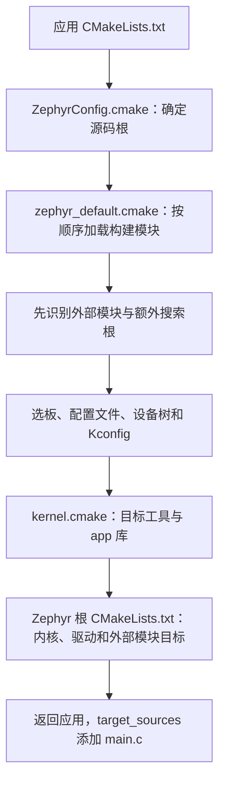
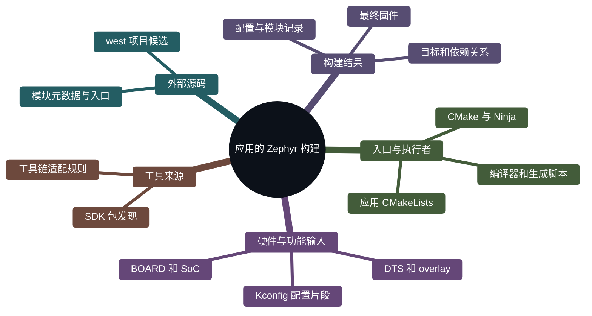
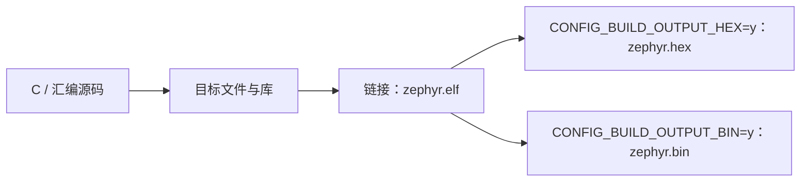
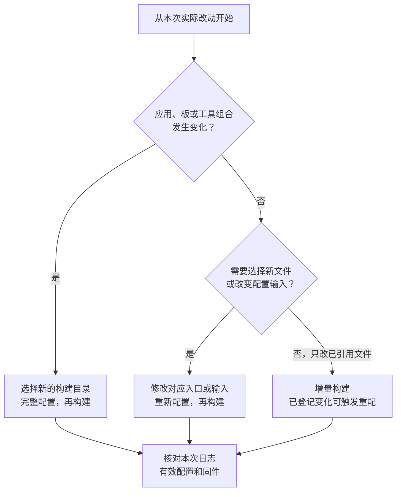

<!-- SPDX-License-Identifier: Apache-2.0 -->

# 第7章\_Zephyr应用构建

在 P006 中，我们自己创建目标；现在读取官方 hello_world，看 Zephyr 怎样先建立 app 和内核等目标，再接收应用源码。本章使用直接 CMake 完成第一次固件构建。west 的工作区、扩展和 CMake 调用在 P008 单独讲。

配套 [PPT](slides/P007_Zephyr应用构建_Windows.pptx) 与正文同序。源码依据为 `25c8f4a23988dd3b2cfb463613622738298c2d6c`；网页 latest 用于阅读，固定提交用于核对。Windows 命令默认 UCRT64，实验根为 `/g/zephyr_practice/zephyr-main`。

**复制命令：** [本章完整操作单元](commands/P007_Windows/README.md)。按正文选择分支，不把整个目录的命令依次执行。

**视频与复习对照：** 页码按当前正式 PPT；以阶段名称和正文链接定位，操作前提、完整命令、输出判断与恢复以 Markdown 为准。

| PPT 页面 | 阶段 | 完整正文 | 正文进一步展开 |
| --- | --- | --- | --- |
| 2—6 | 官方应用与 app 目标 | [7.1.1](#section-7-1-1) | 从应用原文件解释入口，不自造缺失文件 |
| 7—10 | 包入口和构建阶段 | [7.1.3](#section-7-1-3) | 包结构、调用链、参与工具及产物 |
| 11—15 | 准备检查与首次配置 | [7.2.1](#section-7-2-1) | 解压后还缺什么、SDK 错误与发现层处理 |
| 16—18 | 构建与日常方式 | [7.2.3](#section-7-2-3) | 完整命令、增量、目标、Debug/Release 与后续入口 |

<a id="section-7-1"></a>

## 7.1\_先看一个应用如何变成固件

<a id="section-7-1-1"></a>

### 7.1.1\_先认识参与工作的程序

电脑上安装的 CMake 是一个程序，读取 `CMakeLists.txt` 和 `.cmake` 脚本。Zephyr 随源码提供自己的 CMake 脚本，这些脚本描述内核、驱动、模块和板怎样参加构建。它们使用 CMake 的语言，并增加 Zephyr 专用函数与输入约定。**“Zephyr 的 CMake 扩展”指这层构建规则及其接口，不是另一款 CMake 程序。**

这里有几个紧密配合、但职责不同的工具。先沿一次构建认识它们，后面再解释变量。

| 对象 | 在这个应用中的工作 | 读者能看到的结果 |
| --- | --- | --- |
| west | `update` 按清单取得依赖源码；`build` 是调用 CMake 和构建工具的便捷入口 | 下载目录、配置日志和构建输出 |
| CMake 程序与 Zephyr 的 CMake 脚本 | 选择板、工具链和模块，运行配置脚本，建立目标及依赖关系 | `CMakeCache.txt`、`build.ninja` 和各种配置产物 |
| Kconfig 工具 | 根据配置项定义、板默认值和应用配置片段，计算有效功能开关 | `zephyr/.config`、生成的 `autoconf.h` |
| Devicetree 处理工具 | 合并板、SoC 和应用硬件描述，并按 bindings 解析 | `zephyr/zephyr.dts`、生成的 `devicetree_generated.h` |
| Ninja 或 Make | 按 CMake 生成的规则，运行到期的编译、生成和链接任务 | 对象文件、库以及最终固件 |
| GCC 等编译器、链接器和二进制工具 | 把 C/汇编编成目标机器代码，链接并转换文件格式 | `.obj`、`.a`、`.elf`，以及配置启用的其他格式 |

Python 是若干脚本的运行环境，例如模块识别、Kconfig 与 Devicetree 处理。`.venv` 决定这些 Python 工具从哪里运行；它不会替应用选板，也不会自动下载 SDK。Devicetree 的头文件主要由 Zephyr 的 Python 脚本生成，不能把这一过程全部说成“dtc 编译”。当前文档说明 dtc 可补充检查诊断。

因此，直接运行 CMake 仍能配置 Zephyr 应用；使用 `west build` 时，west 帮读者组织调用，底下还是 CMake 和 Ninja/Make。构建过程中 Zephyr 的模块发现脚本也可以读取 west 工作区的项目列表，这与“必须通过 west build 启动”是两件事。依据：[构建阶段说明](https://docs.zephyrproject.org/latest/build/cmake/index.html#build-and-configuration-phases)（原件 `doc/build/cmake/index.rst`，第 52 行附近）；[west 构建命令说明](https://docs.zephyrproject.org/latest/develop/west/build-flash-debug.html)（原件 `doc/develop/west/build-flash-debug.rst`，第 3 行附近）。

<a id="section-7-1-2"></a>

### 7.1.2\_从官方应用入口逐行理解

`samples/hello_world/CMakeLists.txt` 是**官方原有文件**，不是要求读者新建的文件。下面是去掉许可证行后的原有主体，仅供阅读，不要粘贴进终端：

```cmake
# 只读：zephyr-main/samples/hello_world/CMakeLists.txt 原有主体。
cmake_minimum_required(VERSION 3.28.0)

find_package(Zephyr REQUIRED HINTS $ENV{ZEPHYR_BASE})
project(hello_world)

target_sources(app PRIVATE src/main.c)
```

第一行要求 CMake 版本满足本源码。第二条命令请求加载名为 Zephyr 的 CMake 包，`REQUIRED` 表示找不到就停止，`HINTS` 给搜索提供线索，`$ENV{ZEPHYR_BASE}` 读取启动 CMake 的进程环境。找到的入口是 `share/zephyr-package/cmake/ZephyrConfig.cmake`，不是 SDK 的包配置。

`project(hello_world)` 给应用工程命名。它位于 `find_package(Zephyr)` 后面，是因为 Zephyr 需要先建立交叉编译和配置环境。最后一行把当前应用目录下的 `src/main.c` 加到已有的 `app` 库目标里。`target_sources` 是 CMake 原生命令；`app` 则是 Zephyr 初始化时创建的目标名。`PRIVATE` 表示该源文件用于 app 自身构建，不把这份源码作为使用要求继续传播给链接它的其他目标。

这里的 target 是 CMake 构建模型中的对象，例如库、可执行文件或生成任务；它不是开发板。一个板上运行的固件可以由很多库目标组成。Zephyr 把应用、内核、驱动等先组织为目标，才能统一继承头文件目录、编译参数和生成顺序，而不必让每个应用复制内核的构建脚本。依据：[hello_world 原有入口](https://github.com/zephyrproject-rtos/zephyr/blob/25c8f4a23988dd3b2cfb463613622738298c2d6c/samples/hello_world/CMakeLists.txt#L3)（原件 `samples/hello_world/CMakeLists.txt`，第 3 行附近）；[app 目标创建处](https://github.com/zephyrproject-rtos/zephyr/blob/25c8f4a23988dd3b2cfb463613622738298c2d6c/cmake/modules/kernel.cmake#L236)（原件 `cmake/modules/kernel.cmake`，第 236 行附近）；[构建阶段说明](https://docs.zephyrproject.org/latest/build/cmake/index.html#build-and-configuration-phases)（原件 `doc/build/cmake/index.rst`，第 52 行附近）。

读者可以执行下面的**只读操作**定位原件。这只需要已经下载源码和安装 UCRT64，不需要 SDK，不新建任何文件：

```bash
# 终端：Windows UCRT64；从任意目录进入实验源码根。
cd /g/zephyr_practice/zephyr-main
# 读取官方原有的应用入口，应该看到上面五行核心语句。
sed -n '1,30p' samples/hello_world/CMakeLists.txt
```

若提示文件不存在，返回 P001 核对下载是否完整及当前位置；不要为了让命令通过手工补一个同名文件。可复制原件见 [7.1.2 命令](commands/P007_Windows/7.1.2-01.txt)。

<a id="section-7-1-3"></a>

### 7.1.3\_find_package 里面实际走了哪条路

不要把 `find_package(Zephyr)` 理解为只保存一个路径。它会执行包配置里的初始化代码。在本章版本中，普通单应用、未指定特殊 COMPONENTS 时，主线是：



包入口把 Zephyr 的 `cmake/modules` 加入 `CMAKE_MODULE_PATH`，所以随后 `include(zephyr_default)` 能找到 Zephyr 自己的脚本。这里 CMake module 指 `.cmake` 脚本；下一节所说的外部 Zephyr module 则是符合接入约定的源码项目。两者都叫 module，但不是同一种对象。

默认顺序不是随意安排。外部源码模块可能提供新的 `board_root`、`soc_root` 或 `dts_root`，必须先取得这些位置，才能找板；Kconfig 可以使用设备树信息，所以先处理设备树，再计算功能配置；有了硬件与功能配置，才确定目标参数、建立库和链接关系。处理设备树已经需要 C 预处理器，因此工具发现也不是全部等到最后：`dts.cmake` 会先请求 HostTools，`kernel.cmake` 随后请求 TargetTools 完成目标工具设置。

最后 Zephyr 根 `CMakeLists.txt` 收集各部分目标，之后返回应用继续执行 `project` 和 `target_sources`。这也解释了为什么正常应用构建的 `-S` 应指向 `samples/hello_world` 等**应用目录**，不能仅因源码根也有 CMakeLists.txt 就指向根目录。依据：[包入口 include_boilerplate](https://github.com/zephyrproject-rtos/zephyr/blob/25c8f4a23988dd3b2cfb463613622738298c2d6c/share/zephyr-package/cmake/ZephyrConfig.cmake#L28)（原件 `share/zephyr-package/cmake/ZephyrConfig.cmake`，第 28 行附近）；[默认初始化顺序](https://github.com/zephyrproject-rtos/zephyr/blob/25c8f4a23988dd3b2cfb463613622738298c2d6c/cmake/modules/zephyr_default.cmake#L71)（原件 `cmake/modules/zephyr_default.cmake`，第 71 行附近）；[设备树配置入口](https://github.com/zephyrproject-rtos/zephyr/blob/25c8f4a23988dd3b2cfb463613622738298c2d6c/cmake/modules/dts.cmake#L9)（原件 `cmake/modules/dts.cmake`，第 9 行附近）；[app 目标创建处](https://github.com/zephyrproject-rtos/zephyr/blob/25c8f4a23988dd3b2cfb463613622738298c2d6c/cmake/modules/kernel.cmake#L236)（原件 `cmake/modules/kernel.cmake`，第 236 行附近）；[外部模块 CMake 入口加载处](https://github.com/zephyrproject-rtos/zephyr/blob/25c8f4a23988dd3b2cfb463613622738298c2d6c/CMakeLists.txt#L778)（原件 `CMakeLists.txt`，第 778 行附近）。

<a id="section-7-1-4"></a>

### 7.1.4\_这套设计解决什么问题

从上面的分工可以理解设计意图：应用描述“我要加入什么代码”，板/SoC 描述“代码面对什么硬件”，Kconfig 描述“启用什么能力”，工具链规则描述“怎样调用某类编译器”，模块元数据描述“外部项目怎样参加这些步骤”。CMake 把它们组合成同一个构建模型。

这种解释是对官方配置流程和实现边界的归纳，不是官方逐字宣言。它带来的实际效果是：换板时可以复用应用源码；增加一个 HAL 项目可以通过模块入口接入；采用已有工具链类型时不需要修改每个应用的编译器命令；每个构建目录独立保存本次组合。扩展仍须满足接口约定，不是给文件夹起一个名字就自动生效。

下面用思维导图看职责分区。它表示“有哪些部分”，不表示执行顺序；实际先后关系仍看上一节流程图。




<a id="section-7-2"></a>

## 7.2\_配置阶段和构建阶段为什么分开

假设现在要编译官方 `hello_world`，目标为 `mps2/an386`。配置阶段先回答：应用在哪里、选哪块板、有哪些源码、需要什么编译器和参数、哪些文件必须先生成。CMake 执行脚本得到这些关系，再为 Ninja 生成任务规则。

构建阶段由 Ninja 执行这些规则。普通修改 `main.c` 后，通常只需重新编译受影响对象并链接；改变板、模块或构建配置，可能需要重新运行 CMake。构建规则能够检测一部分变化并自动重新配置，所以日志中偶尔重新出现 CMake 输出是正常的。


`cmake -S` 指应用源码目录，`-B` 指本次构建目录，`-G Ninja` 选择规则格式。这三项是 CMake 原生选项。`cmake --build` 则调用所选构建工具。这些命令形式由 CMake 定义；Zephyr 通过脚本决定规则里包含哪些工作。下面用完整命令说明两阶段的实际动作，执行前提单独列出，不要求提前安装尚未介绍的依赖。依据：[构建阶段说明](https://docs.zephyrproject.org/latest/build/cmake/index.html#build-and-configuration-phases)（原件 `doc/build/cmake/index.rst`，第 52 行附近）；[CMake 原生命令索引](https://cmake.org/cmake/help/latest/manual/cmake-commands.7.html)（原件 `CMake 原生命令手册`）。

<a id="cmake-build-methods"></a>

<a id="section-7-2-1"></a>

### 7.2.1\_先确定应用、板和本次构建目录

先把上面的两个阶段落实到命令。这里沿用官方 `samples/hello_world`，目标 `mps2/an386` 是源码已有的 Arm MPS2 AN386 FPGA 配置，提供 Cortex-M4 模型；它用于认识构建方法，不代表已经新增 HC32 支持，也不要求连接实板。板文件在官方原有的 `boards/arm/mps2`，需要的通用 Cortex-M 头文件来自工作区的 CMSIS_6，交叉编译器来自已安装的 ARM SDK 工具链。

执行前先核对下表。依赖缺失时回到对应准备章，当前不需要 HC32 HAL 或新增板文件；无需提前跳到 P011 才能编译。


| 首次构建所需输入 | 应当已经具备 | 缺失时返回 |
| --- | --- | --- |
| 官方源码 | samples/hello_world/CMakeLists.txt、boards/arm/mps2/board.yml | P001 |
| 主机工具 | cmake、ninja、dtc、gperf 可执行 | P002 |
| Python | 根 .venv 已激活，Zephyr 基础依赖已安装 | P002 |
| SDK | SDK 包可被 CMake 发现，且包含 ARM 工具链 | P003 |
| CMSIS | 活动工作区正确、modules/hal/cmsis_6 已按清单下载 | P004、P005 |

源码 ZIP 只提供第一行，并不随包附带所有工具与外部模块。各项成立后，下面从源码根开始的完整命令即可配置官方示例；不需要先新增开发板。

本节使用 `build/learning-tools/p003/cmake-demo` 作为独立构建目录，其中 p003 是早期实验目录标识，改章号不要求迁移它；名称是本教程选择，不是 Zephyr 固定要求。它由下面的 CMake 配置命令自动创建，不需要手工创建缓存文件，也不影响 P011 已有的 `build-mps2-sdk-auto`。这两个目录保存两次独立的构建状态，不能混读产物。

```text
zephyr-main/                              已下载的官方源码根
├── samples/hello_world/                  官方应用，由 -S 选择
│   ├── CMakeLists.txt                    官方构建入口，只读
│   ├── prj.conf                         官方应用配置
│   └── src/main.c                       官方应用代码
└── build/learning-tools/p003/cmake-demo/  本节 -B 目录，工具随后创建
    ├── CMakeCache.txt                    CMake 保存的配置值
    ├── build.ninja                       CMake 为 Ninja 生成的规则
    └── zephyr/zephyr.elf                 编译与链接成功后的固件
```

Zephyr 要求应用源码与构建输出分开。`-S` 不是整个 Zephyr 根，而是有应用入口的目录；`-B` 保存这一组“应用、板、工具和配置”的状态。换到另一个 `-B` 就是另一份缓存。依据：[官方应用与构建目录说明](https://docs.zephyrproject.org/latest/develop/application/index.html#application)；源码原件 `doc/develop/application/index.rst` 的开头及 `CMakeCache.txt` 小节；[MPS2 AN386 官方板说明](https://docs.zephyrproject.org/latest/boards/arm/mps2/doc/index.html)。

<a id="cmake-configure-command"></a>

### 7.2.2\_第一次配置，只生成构建规则

下面整块在 **Windows UCRT64** 执行。先进入源码根并激活 P002 已创建的 `.venv`，确保 CMake 使用相同的 Windows Python。`ZEPHYR_BASE` 是 Zephyr 原生变量，这里就地设置为当前源码根；`cygpath -m` 把 Bash 路径转为 Windows 程序可读的 `G:/...`。`Zephyr_DIR` 固定本次使用的源码包入口，适合本机有多份 Zephyr 的情况；它不选择 SDK。SDK 仍按 P003 已完成的默认发现机制寻找，无须额外写默认类型。

```bash
# Windows UCRT64；前提：7.2.1 的工具、SDK、CMSIS 检查均通过。
cd /g/zephyr_practice/zephyr-main
source .venv/Scripts/activate
# Zephyr 原生源码根变量，供本次 CMake 查找这份源码。
export ZEPHYR_BASE="$(cygpath -m "$PWD")"
# -S 是官方应用；-B 是本节单独使用、由 CMake 创建的构建目录。
cmake -S samples/hello_world \
  -B build/learning-tools/p003/cmake-demo -G Ninja \
  -DBOARD=mps2/an386 \
  "-DZephyr_DIR=$ZEPHYR_BASE/share/zephyr-package/cmake" \
  "-DPython3_EXECUTABLE=$(cygpath -m "$(command -v python)")"
```

应看到当前应用、`Board: mps2, qualifiers: an386`、实际找到的 SDK 和编译器，以及 `Configuring done`、`Generating done`、`Build files have been written to`。这时 `CMakeCache.txt` 和 `build.ninja` 已产生，但新目录里还没有最终 `zephyr.elf`。配置失败就停在这里：Python 不对回 P002，SDK 未找到回 P003，CMSIS 缺失回 P004—P005；继续执行 build 不能补齐缺失依赖。

| 本次参数 | 由谁解释 | 本次具体作用 |
| --- | --- | --- |
| `-S samples/hello_world` | CMake | 读取这个应用的 CMakeLists.txt |
| `-B build/learning-tools/p003/cmake-demo` | CMake | 选择构建状态和输出目录，相对当前源码根 |
| `-G Ninja` | CMake | 为 Ninja 生成规则；不是选择芯片或编译器 |
| `-DBOARD=mps2/an386` | `-D` 语法属 CMake，BOARD 由 Zephyr 读取 | 把本次板目标传入配置 |
| `-DZephyr_DIR=...` | CMake 的包定位规则 | 找到这份源码的 ZephyrConfig.cmake |
| `-DPython3_EXECUTABLE=...` | CMake FindPython3，Zephyr 请求它 | 固定到刚激活的 Python，避免另一套解释器被选中 |

以上 `...` 仅用于表内解释，完整命令没有省略项。[可复制配置块](commands/P007_Windows/7.2.2-01.txt)。CMake 自身的命令行规范见 [cmake(1) 的 Generate a Project Buildsystem](https://cmake.org/cmake/help/latest/manual/cmake.1.html#generate-a-project-buildsystem)，其本机原件在 **CMake 安装根**的 `share/cmake-<版本>/Help/manual/cmake.1.rst`，不在 Zephyr 源码树里。Zephyr 如何加载配置继续看本章 7.1.2—7.1.3。

这段命令先由 Bash 处理，再交给 CMake。行尾的 `\` 把下一行接到同一次调用，必须是该行最后一个字符，后面不要再加空格或注释；复制时不带终端提示符 `$` 或 `((.venv))`。`$(...)` 先在当前 Bash 中求值，双引号保证展开后的整个参数仍作为一个参数传递。这里使用 `cygpath` 是 Windows UCRT64 与 Windows 程序之间的路径转换，Ubuntu 原生终端不照搬这一部分。

两个容易混淆的路径在本次分别是：`-S` 指向 `samples/hello_world`，`Zephyr_DIR` 指向源码根的 `share/zephyr-package/cmake`。前者给出应用入口，后者给应用里的 `find_package(Zephyr)` 提供包入口。它们不是 SDK 目录，也不应填成 SDK 的 `gnu/arm-zephyr-eabi/bin`。`ZEPHYR_BASE` 在本块当前 shell 中定义；重新开终端后若重新执行整块，它会重新取当前源码根。

配置输出按出现顺序阅读：先确认 Application 和 Board，再确认找到的 SDK 与工具链，最后看配置和生成是否都结束。`Configuring done` 表示脚本配置阶段完成；`Generating done` 表示后端规则生成完成；`Build files have been written to` 给出真正的输出目录。**这三个结果仍不是固件编译成功。** 配置阶段也可能调用编译器做能力探测，但应用的完整编译和链接在下一步。一次失败的配置也可能留下部分缓存文件，不能只凭 `CMakeCache.txt` 已存在就认定配置成功。


<a id="sdk-not-found"></a>

### 7.2.2.1\_出现 Zephyr-sdk 找不到时，停在哪一步

若日志已经显示 `Loading Zephyr default modules` 和 `Board: mps2, qualifiers: an386`，随后提示 `Could not find a package configuration file provided by "Zephyr-sdk"`，这说明应用已经进入 Zephyr 源码的构建脚本，但所需 SDK 包尚未被这次 CMake 配置发现。**Zephyr_DIR 选择源码包，不会顺带指定 SDK。** `requested version 1.0` 是本源码要求的 SDK 兼容条件，不是要求读者把文件夹改名为 1.0。

1. 回 P003 核对实际 SDK 根：本次为 `G:/zephyr_practice/zephyr-sdk-1.0.1`，根内有 `sdk_version`、`cmake/Zephyr-sdkConfig.cmake` 和 `gnu/arm-zephyr-eabi/bin/arm-zephyr-eabi-gcc.exe`。独立 toolchain_gnu 组件不是这个 SDK 根。
2. 完整 SDK/已补齐工具链的 Minimal SDK 若尚未执行注册，或安装目录已经搬动，按 P003 切换 **Windows PowerShell，在 SDK 根**运行 `./setup.cmd /c`。它把 SDK 的 CMake 包路径登记到当前 Windows 用户的包注册表，持久保留，不是给某个 venv 注册。7z 刚安装后需重新打开终端再检查 PATH。
3. 已注册时先走自动发现；只在主动固定版本或排查搜索路径时，才在上面的完整 CMake 配置命令末尾追加 `"-DZEPHYR_SDK_INSTALL_DIR=G:/zephyr_practice/zephyr-sdk-1.0.1"`。这是该构建目录的 SDK 根输入，不能填 cmake 子目录或 bin。不要把默认 `ZEPHYR_TOOLCHAIN_VARIANT=zephyr` 又写成必做项。
4. 使用另一安装目录时填自己的真实 SDK 根；旧目录缓存、CMake 可执行程序或注册表搜索被禁用都可能影响结果，进一步排查见 P010。原报错本身不能证明唯一原因。

纠正后重跑上面的整块配置，看到 SDK/工具链来源以及 Configuring done、Generating done，才继续 build。注册不安装缺失的 ARM 编译器，也不下载 CMSIS。SDK 三条接入路线的完整操作和撤销方法保留在 [P003](P003_SDK准备与编译器选型_Windows.md)，此处解释当前报错与本次构建的关系。

<a id="cmake-build-command"></a>

<a id="section-7-2-3"></a>

### 7.2.3\_执行构建，再观察增量构建

配置成功后，把同一个构建目录交给 `cmake --build`。CMake 从目录中识别 Ninja 并调用它；板和编译器已经在配置阶段选好，此处不用重新写 `-DBOARD`。`--parallel 4` 是最多并行四个构建任务，可按电脑资源调整。

```bash
# Windows UCRT64；源码根；前提：7.2 的 cmake-demo 配置成功。
cd /g/zephyr_practice/zephyr-main
source .venv/Scripts/activate
# 构建同一个目录，不重新选择 BOARD；4 表示最多四个并行任务。
cmake --build build/learning-tools/p003/cmake-demo --parallel 4
ls -l build/learning-tools/p003/cmake-demo/zephyr/zephyr.elf
# 没改输入时，再次构建通常没有需要重做的编译任务。
cmake --build build/learning-tools/p003/cmake-demo --parallel 4
```

首次执行会看到编译、生成和链接任务，最后能列出 `zephyr/zephyr.elf`。同样的 build 命令再执行一次，若输入没有变化，通常会看到 `ninja: no work to do.`；有些生成目标仍可能检查或运行，不能要求每个工程都完全零输出。修改 `src/main.c` 后仍用这条命令，Ninja 按依赖只更新受影响的对象和链接结果。

构建成功要结合本次命令正常结束、没有失败任务以及对应输出判断。已有目录可能保留上一次成功的 ELF，因此“ls 能看到文件”本身不能证明刚才的构建成功。若需要查看退出状态，UCRT64 中的 `$?` 只表示紧邻上一条命令的返回码；先执行了 ls 或 grep 后，它就不再是构建的返回码。

`cmake --build` 不需要重复 `-S`，因为 `-B` 对应的缓存已经记录源目录和生成器。它也不会自动把当前终端切换到新激活的编译器或另一块板。重新打开 UCRT64 后，仍可进入本节源码根、激活既有 `.venv`，执行同一条 build；不必重新安装 Python、创建 venv 或运行 west init。若工具已搬家、依赖消失或缓存指向另一环境，则先处理这些输入，再按后面的规则决定是否另开构建目录。

`--build` 不会重新下载依赖。若脚本、配置片段等已登记的输入变化触发重新运行 CMake，日志会先出现重新配置，再继续构建；普通修改 C 文件并不要求每次 clean。编译成功仅证明产生了固件，下载和实板运行另行验证。[可复制构建块](commands/P007_Windows/7.2.3-01.txt)。依据：[Zephyr 两个构建阶段](https://docs.zephyrproject.org/latest/build/cmake/index.html#build-and-configuration-phases)，原件 `doc/build/cmake/index.rst`；[CMake Build a Project](https://cmake.org/cmake/help/latest/manual/cmake.1.html#build-a-project)。

<a id="firmware-formats"></a>

### 7.2.3.1\_链接出的 ELF 与派生的 HEX、BIN

日志中的 `Linking C executable zephyr/zephyr.elf` 表示正在链接核心产物；后面的 `Generating files from .../zephyr.elf` 表示继续从 ELF 生成本次配置要求的文件，不代表每个板都必定生成全部格式。



| 文件 | 保存的主要内容 | 使用时关注什么 |
| --- | --- | --- |
| `zephyr.elf` | 可加载段、地址、符号；启用调试信息时还包含源码调试信息 | 链接与调试的主要产物，不能把整个文件大小等同于 Flash 占用 |
| `zephyr.hex` | Intel HEX 文本记录，包含地址和数据 | 烧录工具可从记录取得写入地址 |
| `zephyr.bin` | 裸二进制数据，不携带加载地址 | 写入地址须由板配置、runner 或工具参数提供 |

两项 `CONFIG_BUILD_OUTPUT_*` 是 Zephyr 的 Kconfig 配置，不是 Bash 环境变量。原生定义在源码根 `Kconfig.zephyr`；BIN 默认开启，HEX 是否开启继续看板和应用的最终配置。`CMakeLists.txt` 按这些值安排派生产物。不要直接编辑生成的 `.config`；需要改变格式时，在应用配置中设置后重新配置与构建。

以下只检查本节已成功构建的 MPS2 目录；文件由工具生成，读者不新建它们：

```bash
# Windows UCRT64；源码根；本节 cmake-demo 构建已成功。
cd /g/zephyr_practice/zephyr-main
grep -E 'CONFIG_BUILD_OUTPUT_(HEX|BIN)' \
  build/learning-tools/p003/cmake-demo/zephyr/.config
find build/learning-tools/p003/cmake-demo/zephyr -maxdepth 1 \
  \( -name 'zephyr.elf' -o -name 'zephyr.hex' -o -name 'zephyr.bin' \) -print
```

将列出的文件与 `.config` 对照；HEX 未启用时缺少 `.hex` 是正常结果。[完整检查命令](commands/P007_Windows/firmware-formats.txt)。烧录格式由具体 runner 选择，调试器通常读取 ELF 的符号与调试信息。MPS2 的构建结果不能据此用于 HC32；HC32 的具体配置见 [P011 11.7.1](P011_编译示例与新增开发板_Windows.md#hc32-firmware-formats)。

### 7.2.4\_常用构建选项改变的是哪一步

需要查看 GCC 实际收到的参数时，加 `--verbose`；需要查项目提供哪些目标时，使用当前 Ninja 构建支持的 `help` 目标。它们都复用刚才的构建目录。

```bash
# Windows UCRT64；源码根；前提：cmake-demo 已配置成功。
cd /g/zephyr_practice/zephyr-main
source .venv/Scripts/activate
# 打印本次实际执行的构建命令；没有到期任务时不会强行重编译。
cmake --build build/learning-tools/p003/cmake-demo --parallel 4 --verbose
# 只列出当前 Ninja 工程提供的目标。
cmake --build build/learning-tools/p003/cmake-demo --target help
```

`--verbose` 只显示这次真正执行的命令，工程已是最新状态时不会为了打印命令而强行重编译。当前 Zephyr 还会生成 `compile_commands.json`，可查看各 C/汇编单元的编译命令，但它不是链接命令清单。`--target app` 可以只构建应用库及其依赖，不等于完整固件已链接；日常生成固件先用不限定 target 的 build。

`cmake -S/-B ... -D名字=值` 修改配置输入，`cmake --build ... --parallel/--verbose/--target` 控制构建执行。不要把 `-DBOARD=...` 放到 `cmake --build ... --` 后面：这个分隔符后面的参数交给 Ninja，不交给 CMake 配置器。具体 target 由项目和生成器提供，先看 help，不能把任何教程中的 target 名都当作 CMake 内置。[可复制常用操作](commands/P007_Windows/7.2.4-01.txt)。

### 7.2.5\_两种入口共用构建模型

本章直接运行 CMake。west 如何找到 Zephyr 的 build 命令、怎样组织参数并调用相同后端，在 [P008](P008_west零基础与Zephyr构建_Windows.md#west-cmake)独立说明。这里先完成直接构建，不需要新增 west 清单或重做 init。

### 7.2.6\_通用 CMake 的 Debug/Release 不能直接套用

普通 CMake 工程常用单配置生成器 Ninja，在配置时用 `CMAKE_BUILD_TYPE` 选择 Debug 或 Release；Visual Studio 等多配置生成器通常在构建时用 `--config` 选择已有配置。本系列固定使用 `-G Ninja`，不要求读者切换生成器。

Zephyr 的优化级别主要由 Kconfig 的 `CONFIG_DEBUG_OPTIMIZATIONS`、`CONFIG_SIZE_OPTIMIZATIONS`、`CONFIG_SPEED_OPTIMIZATIONS` 等选项决定。单独加 `-DCMAKE_BUILD_TYPE=Debug` 不等于已经切换 Zephyr 的调试优化方案，也不能把 `--config Debug` 当作本系列的必做步骤。应修改对应配置片段并核对 `zephyr/.config` 与实际编译参数。Zephyr 根 `CMakeLists.txt` 的优化选择分支以及 `CMAKE_BUILD_TYPE` 检查段明确说明这一差异。

同理，`cmake --install` 执行项目安装规则，不能代替 Zephyr 的固件烧录；`--target flash` 或 `west flash` 会涉及板卡 runner 与硬件，不属于本节构建方法验证。依据：[CMake 构建类型](https://cmake.org/cmake/help/latest/variable/CMAKE_BUILD_TYPE.html)；[本章固定源码的优化选择](https://github.com/zephyrproject-rtos/zephyr/blob/25c8f4a23988dd3b2cfb463613622738298c2d6c/CMakeLists.txt#L243)及[构建类型诊断](https://github.com/zephyrproject-rtos/zephyr/blob/25c8f4a23988dd3b2cfb463613622738298c2d6c/CMakeLists.txt#L2375)。

<a id="cmake-rebuild-choice"></a>

### 7.2.7\_改动之后，应该运行哪一步

决定动作前先问：改动的是已经参加构建的文件内容，还是“哪些文件、哪块板、哪套工具参加构建”的选择？前者通常可以交给现有依赖规则处理；后者需要让 CMake 重新读取输入。换应用、板、生成器或工具链时，本系列优先使用新的构建目录，使两套状态各自完整。

| 这次改动 | 应执行的动作 | 之后核对什么 |
| --- | --- | --- |
| 已被目标引用的 main.c 或头文件内容 | 复用本节 build 命令 | 日志中的受影响对象与链接结果 |
| 已参加配置的 prj.conf 或 overlay 内容 | build 可触发自动重新配置；必要时显式重复配置命令后再 build | `zephyr/.config` 或 `zephyr/zephyr.dts` 中的有效结果 |
| 新增一个 .c，但尚未在构建入口中引用 | 先通过应用或模块 CMake 接口加入目标，再配置、构建 | 该文件是否进入编译命令数据库 |
| 改用另一份 CONF_FILE、overlay 或追加模块列表 | 用相应原生输入重新配置，再 build | 选择的文件、模块记录及最终配置 |
| 换 BOARD、应用、SDK、编译器或生成器 | 使用新的 -B，重新提供完整配置输入，再 build | 新目录的入口、板与工具来源 |
| 只想查看现有配置 | 使用 10.1.1.2 的 -N 检查 | 缓存值；不会借此重新构建 |

为什么修改 prj.conf 后执行 build 也可能看到 CMake？当前 Zephyr 的 `kconfig.cmake` 和 `dts.cmake` 把已使用的配置输入登记为重新配置依赖，Ninja 发现它们变化后先调用 CMake 更新规则，再继续构建。但任意新复制进目录的文件不一定已经成为依赖；因此不能把“自动重配”理解成“自动发现所有新文件”。下面的流程图描述选择顺序，不要求把每条分支都执行一遍。



这里说“完整配置”，是复用 7.2.2 的整块命令并按目的调整输入，不是向新目录只传一项 -D 就期待继承旧目录。源码依据：[Kconfig 的重新配置依赖](https://github.com/zephyrproject-rtos/zephyr/blob/25c8f4a23988dd3b2cfb463613622738298c2d6c/cmake/modules/kconfig.cmake#L495)与[Devicetree 的重新配置依赖](https://github.com/zephyrproject-rtos/zephyr/blob/25c8f4a23988dd3b2cfb463613622738298c2d6c/cmake/modules/dts.cmake#L295)；通用机制见 [CMake 的目录属性 CMAKE_CONFIGURE_DEPENDS](https://cmake.org/cmake/help/latest/prop_dir/CMAKE_CONFIGURE_DEPENDS.html)。这是一项由项目脚本设置的目录属性，不是要求读者新增的命令行变量。


上一篇：[P006](P006_原生CMake与目标模型_Windows.md)；下一篇：[P008](P008_west零基础与Zephyr构建_Windows.md)。
