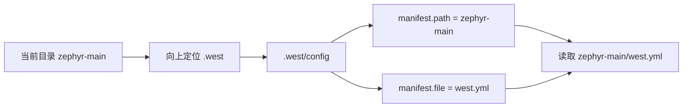
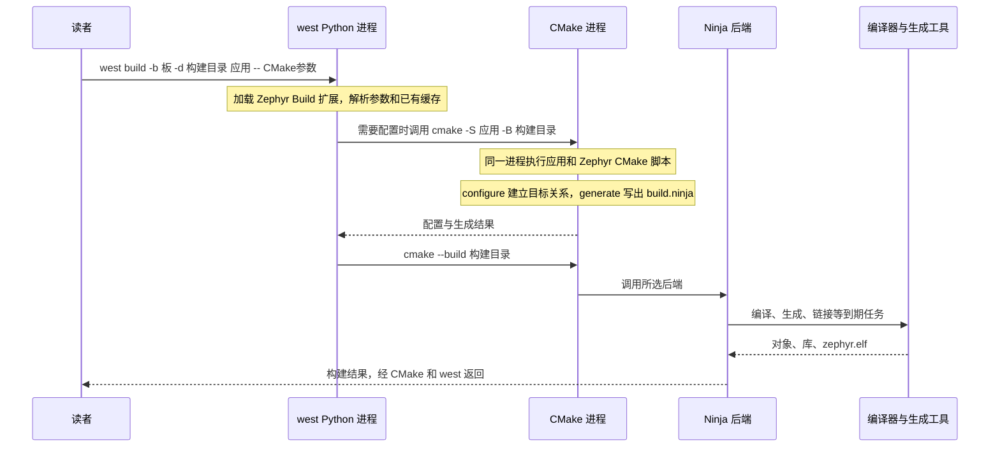

<!-- SPDX-License-Identifier: Apache-2.0 -->

# 第8章\_west零基础与Zephyr构建

P007 已经直接用 CMake 配置并构建官方 hello_world。现在换一个入口，解释 west 为什么能下载依赖，又为什么能调用同一套构建系统。**从通用 west 到 Zephyr 提供的 west 命令，是本章的主线。** 不预设读者已经理解工作区、清单或扩展；前面 P004 用过的下载步骤在这里补齐模型。

配套 [PPT](slides/P008_west零基础与Zephyr构建_Windows.pptx) 按相同顺序精讲。本章复用现有官方清单，不新建、删改或替换 `zephyr-main/west.yml`。另一个 [west 专题](../west/大纲.md) 提供独立多仓库实验、清单编写与自定义扩展；完成本章后再进入，不是当前编译的前置条件。


本章命令均在 Windows UCRT64 执行，以 `/g/zephyr_practice/zephyr-main` 为源码根，使用 P002 的 `.venv`。版本基线为 west 1.5.0 和 Zephyr 提交 `25c8f4a23988dd3b2cfb463613622738298c2d6c`。以下是供读者执行的操作；本次文稿整理没有代读者更新依赖或编译。

**复制命令：** [本章完整操作单元](commands/P008_Windows/README.md)。按正文选择分支，不把整个目录的命令依次执行。

**视频与复习对照：** 页码按当前正式 PPT；以阶段名称和正文链接定位，操作前提、完整命令、输出判断与恢复以 Markdown 为准。

| PPT 页面 | 阶段 | 完整正文 | 正文进一步展开 |
| --- | --- | --- | --- |
| 2—4 | west 程序与核心命令 | [8.1](#section-8-1) | 安装位置、venv、版本和职责 |
| 5—8 | 工作区与原有清单 | [8.2](#section-8-2) | 只读检查、已有工作区复用、仅无工作区时 init |
| 9—12 | 按清单下载与核验 | [8.3](#section-8-3) | URL/revision/path、Git、更新范围及失败停止 |
| 13—15 | Zephyr 如何提供扩展 | [8.4](#section-8-4) | 从 west.yml 追到声明文件和 Build 类 |
| 16—20 | west 与 CMake 搭配 | [8.5](#section-8-5) | 两阶段完整操作、参数传递及共用构建目录 |
| 21—25 | 状态、选项与排错 | [8.6](#section-8-6) | 后端参数、缓存、包注册及按层恢复 |

<a id="west-core"></a>

<a id="section-8-1"></a>

## 8.1\_先把 west 程序与 Zephyr 分开

west 是 Python 程序。`python -m pip install west==1.5.0` 将它装入当时选中的 Python 环境；本系列已在 P002 完成，不要在每次打开终端时重装。激活 `.venv` 后，终端可以找到该环境中的 `west` 入口。west 核心负责按照清单管理多个 Git 项目，也允许项目提供额外命令。

| 命令来自哪里 | 示例 | 操作的对象 |
| --- | --- | --- |
| pip 安装的 west 核心 | init、topdir、config、list、update、status | 工作区、清单、Git 项目 |
| Zephyr 源码提供的扩展 | build、boards、flash、debug、zephyr-export | Zephyr 的构建入口、板和工具 |
| 其他项目可提供的扩展 | 命令名取决于项目声明 | 由扩展实现决定 |

因此 `west --version` 能运行，只能说明 west 程序可用，不能证明 Zephyr 扩展、SDK 或 CMSIS 已经准备好。`west update` 取得源码；`west build` 调用构建。下载源码、选择 SDK 和编译固件是三个不同动作。

```bash
# Windows UCRT64；进入 P001 的源码根，复用 P002 创建的环境。
cd /g/zephyr_practice/zephyr-main
source .venv/Scripts/activate
python --version
west --version
west --help
```

预期 Python 3.12.10、west 1.5.0；帮助中的扩展命令还取决于当前工作区。若 `west` 不存在，返回 P002 确认激活的是哪一个 venv，不通过新建 `.west` 解决 Python 安装问题。依据：[west Basics](https://docs.zephyrproject.org/latest/develop/west/basics.html)，源码说明 `doc/develop/west/basics.rst`；west 自身实现位于安装的 Python 包 `west/app`，不是 Zephyr 的 `scripts/west_commands`。

<a id="west-workspace"></a>

<a id="section-8-2"></a>

## 8.2\_工作区怎样找到正确的清单

工作区是多个项目的共同目录；Zephyr 源码根只是其中一个项目。当前实验的预期结构如下，目录名是本系列选择的名字，west 不要求所有用户都叫 zephyr-main：

```text
G:/zephyr_practice/                    west topdir，工作区根
├── .west/config                      west init 生成的本地配置
├── zephyr-main/                      P001 下载的官方源码
│   ├── west.yml                      官方原有清单，保留原样
│   ├── scripts/west-commands.yml      官方原有扩展命令声明
│   └── .venv/                        P002 的 Python 环境
└── modules/hal/cmsis_6/               west update 后下载的项目
```

west 从当前目录向上寻找 `.west`；找到后读取 `.west/config` 的 `manifest.path` 和 `manifest.file`，组合成活动清单位置。找不到时还有 `ZEPHYR_BASE` 等回退行为，详见官方 Basics；教程明确进入源码根，避免依赖无意继承的旧环境。



先做只读检查，不无条件执行 init：

```bash
# Windows UCRT64；源码根；P002 环境已经存在。
cd /g/zephyr_practice/zephyr-main
source .venv/Scripts/activate
west topdir
west config manifest.path
west config manifest.file
```

本系列预期依次为 `G:/zephyr_practice`、`zephyr-main`、`west.yml`。若一致，直接复用。`already initialized in G:\zephyr_practice` 表示工作区已经存在，不是需要删除 `.west` 的理由。若指向其他目录，先核对当前所在位置与已有配置，不能继续下载到错误工作区。

**只有 topdir 明确报告当前没有工作区**，并确认这个源码目录中有 P001 下载的完整 `west.yml` 时，才使用本地清单初始化：

```bash
# Windows UCRT64；仅“尚无工作区”分支。已有工作区跳过整块。
cd /g/zephyr_practice/zephyr-main
source .venv/Scripts/activate
test -f west.yml && west init -l . &&
  west topdir && west config manifest.path && west config manifest.file
```

`-l .` 表示使用当前目录中的现有清单，生成父级工作区的 `.west/config`，不下载另一份 Zephyr，不要求重写清单。解压 ZIP 的源码不含上游 Git 历史，不要为了跟本章而随意补造官方提交；本地清单用法与项目下载的 Git 元数据分别处理。`init` 本身不下载 CMSIS，下载是下一节的 update。依据：[工作区](https://docs.zephyrproject.org/latest/develop/west/workspaces.html)、[west init](https://docs.zephyrproject.org/latest/develop/west/built-in.html#west-init)，本地原件 `doc/develop/west/workspaces.rst`、`built-in.rst`。

<a id="west-download"></a>

<a id="section-8-3"></a>

## 8.3\_清单怎样决定下载什么

清单是版本配套契约。项目项的 name 用于命令选择，URL 决定仓库来源，revision 决定要求的修订，path 决定相对工作区根的落点。清单还可能 import 其他清单；因此优先让 west 解析，而不是只用文本搜索猜结果。

```bash
# Windows UCRT64；源码根；8.2 已确认正确工作区。
cd /g/zephyr_practice/zephyr-main
source .venv/Scripts/activate
# 只读解析结果，不下载、不修改清单。
west list cmsis_6 -f '{name} {url} {revision} {abspath}'
```

应指向 Zephyr 组织的 CMSIS_6 仓库和工作区 `modules/hal/cmsis_6`。本基线锁定 `1c1840af7a7e757d6e2fec3ddb0e5ce0dfcc93c8`；升级源码后以新清单解析结果为准，不能永久把这个 SHA 当成最新。

P004 已成功下载且未更换清单的读者直接核验现有文件。首次下载或清单版本发生变化时，再执行下面块。**更新已有模块前先保存其本地修改**，不要拿教程的版本更新覆盖正在开发的依赖。

```bash
# Windows UCRT64；源码根；工作区正确，模块本地修改已保存。
cd /g/zephyr_practice/zephyr-main
source .venv/Scripts/activate
# P004 已说明 Windows Python/west 应调用 Git for Windows。
python -c "import shutil; print(shutil.which('git'))"
git --version | grep -q '\.windows\.' &&
  west update cmsis_6 &&
  test -f ../modules/hal/cmsis_6/zephyr/module.yml &&
  test -f ../modules/hal/cmsis_6/CMSIS/Core/Include/core_cm4.h &&
  git -C ../modules/hal/cmsis_6 rev-parse HEAD &&
  git -C ../modules/hal/cmsis_6 rev-parse manifest-rev
```

前置检查失败会阻止后续命令。HEAD 和 manifest-rev 应与本次清单要求一致；目录存在不代表版本已经更新成功。`west update` 不带项目名会更新当前清单中适用的项目集合，可能下载很多仓库；本例只请求 cmsis_6。它不会自动拉取 Zephyr 清单仓库的最新提交，更不会更新 SDK。先选 Zephyr 版本，再让 update 匹配其依赖，才有可复现的组合。本章不替读者决定后续仓库同步策略。

如果出现 `not a valid SHA1`，仅凭该行不能判定是上游删了提交。停止构建，回 P004 核对活动清单、west 实际调用的 Git、下载日志、仓库来源和修订是否可取得；不删除 `.west`，不擅自换成最新 ZIP，不关闭证书检查。清单没有 hal_xhsc 时，`west update hal_xhsc` 无法凭仓库存在就发现它；按 P004 下载，按 P005 接入。

依据：[清单](https://docs.zephyrproject.org/latest/develop/west/manifest.html)、[west update](https://docs.zephyrproject.org/latest/develop/west/built-in.html#west-update)；原件 `doc/develop/west/manifest.rst`、`built-in.rst`。源码模块是否参加 CMake 构建还取决于模块发现与功能选择，详见 P009；被 west 下载不等于其所有源码都参与当前固件。

<a id="west-extensions"></a>

<a id="section-8-4"></a>

## 8.4\_Zephyr 怎样把 build 命令交给 west

west 核心不内置每个版本的 Zephyr 构建细节。它读取清单中的扩展声明，由当前项目提供命令实现。下面都是**官方现有文件的只读摘录**，不能另存后覆盖原文件：

```yaml
# 只读：zephyr-main/west.yml 的 self 内已有此字段；不是新清单。
west-commands: scripts/west-commands.yml
```

```yaml
# 只读：scripts/west-commands.yml 中 build 的原有声明。
- file: scripts/west_commands/build.py
  commands:
    - name: build
      class: Build
      help: compile a Zephyr application
```

声明里的路径相对提供命令的项目根。west 先知道命令名和描述，执行 build 时才加载对应 Python 类；`Build` 继承 west 的命令扩展接口，处理 Zephyr 的板、应用目录、构建目录和相关选项。这就是通用 west 与 Zephyr 版本能够分开维护的原因。


```bash
# Windows UCRT64；源码根；工作区检查已通过。
cd /g/zephyr_practice/zephyr-main
source .venv/Scripts/activate
west help build
west build --help
```

应看到 `-b/--board`、`-d/--build-dir`、`-c/--cmake`、`--cmake-only`、`-p/--pristine` 等选项。若只识别 update、不识别 build，先看活动清单是否是 Zephyr 清单、声明文件是否完整、是否禁用了扩展 `commands.allow_extensions`；读取配置未设置而返回非零不等于 false，默认行为以官方说明为准。这里不通过重新安装 SDK 解决扩展发现问题。

依据：[扩展机制](https://docs.zephyrproject.org/latest/develop/west/extensions.html)，原件 `doc/develop/west/extensions.rst`；固定源码 [命令声明](https://github.com/zephyrproject-rtos/zephyr/blob/25c8f4a23988dd3b2cfb463613622738298c2d6c/scripts/west-commands.yml)、[Build 实现](https://github.com/zephyrproject-rtos/zephyr/blob/25c8f4a23988dd3b2cfb463613622738298c2d6c/scripts/west_commands/build.py)。

<a id="west-cmake"></a>

<a id="section-8-5"></a>

## 8.5\_把 west build 展开为 CMake 调用

本节仍用官方 `samples/hello_world` 与 `mps2/an386`。该目标是 Arm MPS2 的 Cortex-M4 系统配置，不是 HC32 实板；本例无需连接开发板。需要的主机工具、Python、SDK ARM 工具链与 CMSIS 已由 P002—P005 准备，并通过 P007 首次构建检查。



箭头跨进程调用，不把 `.cmake` 文件画成另一台服务。west 组织输入；CMake 建立目标并生成规则；Ninja 执行规则，调用 GCC、汇编/链接工具及 Python 生成脚本。已有构建目录且无需重配时，west 可以跳过第一次 CMake 配置调用，但构建规则仍可能因为登记的输入变化触发重新配置。

### 8.5.1\_先只配置，观察 west 传给 CMake 的参数

用新的 `west-demo` 目录对照 P007 的 `cmake-demo`，两份缓存独立，输入相同。目录是教程选择的输出位置，由工具创建，不是官方原有文件。

```bash
# Windows UCRT64；源码根；P007 已确认工具、SDK 和 CMSIS 可用。
cd /g/zephyr_practice/zephyr-main
source .venv/Scripts/activate
# Zephyr 原生变量，在本块定义为当前源码根。
export ZEPHYR_BASE="$(cygpath -m "$PWD")"
west -v build --cmake-only -b mps2/an386 \
  -d build/learning-tools/west-demo samples/hello_world -- \
  "-DZephyr_DIR=$ZEPHYR_BASE/share/zephyr-package/cmake" \
  "-DPython3_EXECUTABLE=$(cygpath -m "$(command -v python)")"
```

`-v` 是 west 的详细日志选项，放在 build 前；`--cmake-only` 限定本次只配置和生成，不做固件构建。预期日志包含 CMake 调用、选中的板、SDK，以及 `Configuring done` / `Generating done`。找不到 SDK 就停在此处，回 P003 的 SDK 发现说明；换成 west 不会自动修复 P007 相同的包发现错误。

| 读者给 west 的输入 | 转到 CMake 的含义 |
| --- | --- |
| samples/hello_world | -S 指向应用目录 |
| -d build/learning-tools/west-demo | -B 指向这份构建目录 |
| -b mps2/an386 | 新配置时的 -DBOARD=mps2/an386 |
| 默认生成器 Ninja | -G Ninja；可受 west 配置影响 |
| -- 后的 -DZephyr_DIR、-DPython3_EXECUTABLE | CMake 配置参数，按原样传递 |

west 还会传 `WEST_PYTHON`、`WEST_TOPDIR`、`WEST_VERSION` 等来源信息，所以表中是核心等价关系，不是声称两条入口生成的所有命令字符完全相同。这些是扩展替读者传入的上下文，不要求初学者手动填写。具体依据是 `Build._run_cmake()` 组织参数，然后调用 `zcmake.run_cmake()`。

### 8.5.2\_构建，以及与直接 CMake 共用目录

```bash
# Windows UCRT64；源码根；上一块 west-demo 已配置、生成成功。
cd /g/zephyr_practice/zephyr-main
source .venv/Scripts/activate
if west build -d build/learning-tools/west-demo; then
  ls -l build/learning-tools/west-demo/zephyr/zephyr.elf
else
  printf '%s\n' '本次构建失败，不把已有 ELF 当成本次成功。'
fi
```

此时无需重写板和应用，因为构建目录已经保存了选择。`Build._run_build()` 调用 `zcmake.run_build()`，后者实际执行 `cmake --build`，再由 CMake 调用 Ninja。固件出现只证明构建完成，不代表烧录与运行成功。

下面是可选的**相同目录对照**：二选一即可，勿同时运行它们操作同一目录。

```bash
# Windows UCRT64；源码根；west-demo 已成功配置，工具位置没有改变。
cd /g/zephyr_practice/zephyr-main
source .venv/Scripts/activate
# 直接 CMake 复用 west 创建的同一缓存和规则。
cmake --build build/learning-tools/west-demo --parallel 4
# 反向对照：仅 P007 的 cmake-demo 已成功配置时执行。
west build -d build/learning-tools/p003/cmake-demo
```

两种入口能共用有效构建目录，因为模型和规则相同；不是各自再保存一套板配置。`p003` 是早期实验目录标识，材料改号不迁移已有缓存。切换入口也不意味着会自动清除旧 SDK 路径或自动换板；改变应用、板、工具链或生成器时，用新构建目录最清楚。

依据：[Zephyr west 构建说明](https://docs.zephyrproject.org/latest/develop/west/build-flash-debug.html)，原件 `doc/develop/west/build-flash-debug.rst`；固定源码 [build.py](https://github.com/zephyrproject-rtos/zephyr/blob/25c8f4a23988dd3b2cfb463613622738298c2d6c/scripts/west_commands/build.py#L668) 的 `_run_cmake` / `_run_build`，以及 [zcmake.py](https://github.com/zephyrproject-rtos/zephyr/blob/25c8f4a23988dd3b2cfb463613622738298c2d6c/scripts/west_commands/zcmake.py#L82) 的 `run_build`。

<a id="west-options"></a>

<a id="section-8-6"></a>

## 8.6\_常用方式要分清参数交给谁

| 目的 | west 形式（选项说明，不是整块操作） | 实际影响 |
| --- | --- | --- |
| 正常增量构建 | west build -d 构建目录 | 复用配置；构建到期任务 |
| 强制重跑 CMake | west build -d 构建目录 -c | 重配后通常继续构建；没有清空缓存 |
| 只重配 | 再加 --cmake-only | 不执行后续固件构建 |
| 改 CMake 输入 | -- -D名字=值 | 转交配置阶段，可能留在 CMakeCache.txt |
| 指定构建目标 | -t help、-t menuconfig | 调用后端目标；目标需由当前工程提供 |
| 给 Ninja 传并行数 | -o=-j4 | 传给构建后端，不是 CMake -D |
| 全新配置 | 新的 -d | 与旧目录相互独立 |
| 清空所选构建状态后重配 | -p always | 破坏该构建目录的旧状态；不是日常必做 |

```bash
# Windows UCRT64；源码根；west-demo 已配置成功。
cd /g/zephyr_practice/zephyr-main
source .venv/Scripts/activate
# 仅重新配置；这次没有要求清空缓存。
west build -d build/learning-tools/west-demo -c --cmake-only
# 只列出当前 Ninja 工程提供的 target；不会烧录开发板。
west build -d build/learning-tools/west-demo -t help
# 日常构建，-o 的参数交给 Ninja。
west build -d build/learning-tools/west-demo -o=-j4
```

不要把 `-DBOARD=...` 当作 `-o` 的值；Ninja 不负责解析 Zephyr 的配置变量。west 命令里的 `--` 用于转交 CMake 配置参数，而 `cmake --build ... --` 后的参数交给构建后端，同样的符号在不同命令层级含义不同。

west 的 `.west/config` 和 CMake 的 `CMakeCache.txt` 也不同：前者保存工作区及扩展选项，后者保存一份构建目录的配置结果。venv 又是第三个对象，只隔离 Python 包。`west config --local build.generator Ninja` 会影响这个工作区后续 west 配置调用；不需要它时用 `west config --local --delete build.generator` 删除该显式项，回到默认选择。这是可选设置的解释，不是要求读者先修改；已有缓存仍不能借此安全改换生成器。

`west zephyr-export` 注册的是 **Zephyr 源码的 CMake 包**，不是 Zephyr SDK；SDK 的 `setup.cmd /c` 注册 SDK 自己的包，作用范围见 P003。两种注册都不能下载 CMSIS，也不等于把东西安装进 venv。本例已经显式给出 Zephyr_DIR，无须为了构建再重复执行 zephyr-export。

### 8.6.1\_按失败发生在哪一层处理

| 现象 | 先查哪里 | 不应当用什么替代 |
| --- | --- | --- |
| bash 找不到 west | P002 的 venv 和安装 | 删 .west |
| already initialized | 8.2 的 topdir 与 manifest 配置 | 无条件重复 init |
| 找不到 build 命令 | 8.4 的扩展声明和活动清单 | 重装 SDK |
| update 下载失败 | 8.3 的 Git、URL、revision、网络日志 | 随意更换依赖版本 |
| 找不到 Zephyr-sdk 包 | P003 SDK 发现、P007 配置日志 | 期待 west build 自动下载 SDK |
| 配置成功后编译错误 | 首个编译/链接失败与有效配置 | 反复执行 west init/update |
| 换板后缓存不一致 | 新 -d 完整配置；P010 解释清理 | 只省略旧 -b 参数 |

flash/debug 属于 Zephyr 扩展，通过所选板与生成的 runner 配置调用具体下载/调试工具；并不是 west 自己实现所有探针协议。本章不执行实板命令，P011 再结合目标板和已验证配置讲解。

完成本章后，读者应能指出：west 程序装在哪里；`.west/config` 怎样选中官方清单；CMSIS 落在哪个目录；build 命令从哪个源码文件来；一条 west build 怎样成为 CMake configure/generate 和 build；为什么原来的 SDK 查找错误不会因为换入口自动消失。接着读 [P009 输入与依赖发现](P009_Zephyr的CMake输入与依赖发现_Windows.md)，深入工程怎样消费已经准备好的对象。


上一篇：[P007](P007_Zephyr应用构建_Windows.md)；下一篇：[P009](P009_Zephyr的CMake输入与依赖发现_Windows.md)。
