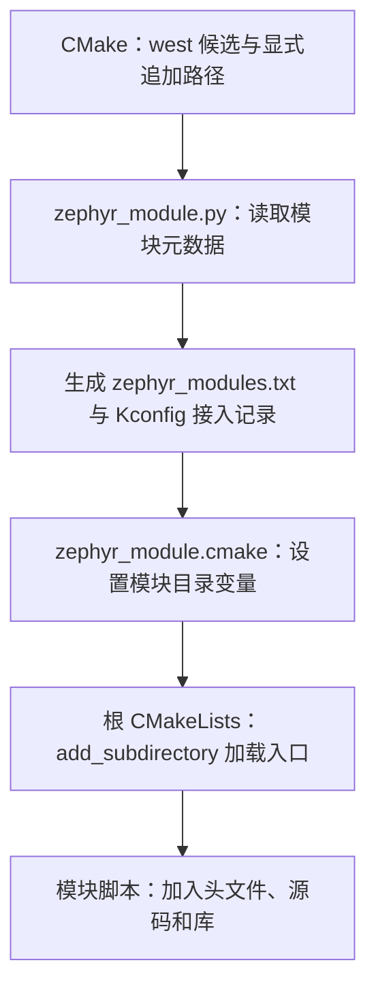
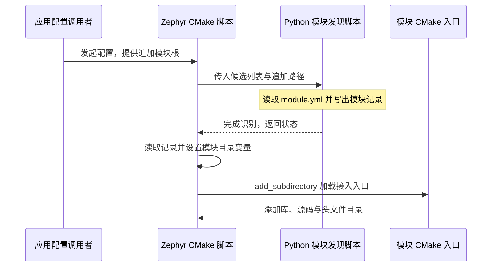

<!-- SPDX-License-Identifier: Apache-2.0 -->

# 第9章\_Zephyr的CMake输入与依赖发现

前置：P006 的目标模型与 P007 的应用构建。本章只解释已经准备好的输入由谁读取、怎样转成目标与编译规则。下载步骤回到 P003—P005；缓存与排错继续 P010。

配套 [PPT](slides/P009_Zephyr的CMake输入与依赖发现_Windows.pptx) 与正文同序。源码依据为 `25c8f4a23988dd3b2cfb463613622738298c2d6c`；网页 latest 用于阅读，固定提交用于核对。Windows 命令默认 UCRT64，实验根为 `/g/zephyr_practice/zephyr-main`。

**复制命令：** [本章完整操作单元](commands/P009_Windows/README.md)。按正文选择分支，不把整个目录的命令依次执行。

**视频与复习对照：** 页码按当前正式 PPT；以阶段名称和正文链接定位，操作前提、完整命令、输出判断与恢复以 Markdown 为准。

| PPT 页面 | 阶段 | 完整正文 | 正文进一步展开 |
| --- | --- | --- | --- |
| 2—5 | 先分清调用者、输入与结果 | [9.1.1](#section-9-1-1) | 回顾 P007 的职责思维导图和初始化流程 |
| 6—10 | 应用、板、功能和硬件输入 | [9.1.2](#section-9-1-2) | 源码包、BOARD、Kconfig、Devicetree 的读取者 |
| 11—16 | SDK 和工具链类型 | [9.2](#section-9-2) | 默认发现、按需覆盖与 CPU/FPU 参数来源 |
| 17—22 | 外部模块怎样被发现 | [9.3.1](#section-9-3-1) | 候选列表、元数据、外部接入脚本与派生变量 |
| 23—24 | 源码进入目标 | [9.3.4](#section-9-3-4) | 库、功能选择与头文件使用范围 |

<a id="section-9-1"></a>

## 9.1\_输入接口怎样把应用、板和配置交给构建系统

<a id="section-9-1-1"></a>

### 9.1.1\_先区分命令、输入和结果

所谓接口，是调用者与读取者之间的约定：传什么、在哪里传、何时读取、返回什么。Zephyr 的 CMake 接口不只有变量，也包括包入口、函数、目标、属性以及模块元数据。

| 看到的写法 | 属于谁 | 在这里的用途 |
| --- | --- | --- |
| `find_package`、`target_sources`、`add_subdirectory` | CMake 原生命令 | 查包、修改目标、执行子目录构建脚本 |
| `zephyr_library()`、`zephyr_library_sources_ifdef()` | Zephyr 在 extensions.cmake 定义的宏/函数 | 按 Zephyr 的库约定创建目标并按配置加入源码 |
| `BOARD`、`CONF_FILE`、`EXTRA_ZEPHYR_MODULES` | Zephyr 构建脚本接受的输入 | 选硬件、选配置片段、追加模块 |
| `Zephyr_DIR` | CMake 的 `<Package>_DIR` 约定 | 定位名为 Zephyr 的包配置目录 |
| `CONFIG_GPIO` | Kconfig 配置结果 | 供 CMake 和 C 代码决定是否启用相应功能 |
| `ZEPHYR_HAL_XHSC_MODULE_DIR` | Zephyr 模块发现产生的结果 | 让后续 CMake 脚本引用已识别模块根 |

`-D名字=值` 是 CMake 的传入语法；它本身不会赋予某个名字功能。如果 Zephyr 没有读取 `MY_HAL_PATH`，单独添加这个自造变量不会接入 HAL。同样，结果变量通常不该由使用者提前伪造。依据：[CMake 原生命令索引](https://cmake.org/cmake/help/latest/manual/cmake-commands.7.html)（原件 `CMake 原生命令手册`）；[扩展函数参考页](https://docs.zephyrproject.org/latest/build/cmake-ref/module/extensions.html)（原件 `doc/build/cmake-ref/module/extensions.rst`，第 1 行附近）；[派生模块目录变量创建处](https://github.com/zephyrproject-rtos/zephyr/blob/25c8f4a23988dd3b2cfb463613622738298c2d6c/cmake/modules/zephyr_module.cmake#L141)（原件 `cmake/modules/zephyr_module.cmake`，第 141 行附近）。

<a id="section-9-1-2"></a>

### 9.1.2\_源码包位置和应用位置是不同输入

应用是 `-S` 所指向的目录；Zephyr 源码根含 `boards`、`cmake`、`kernel` 等目录；SDK 则是另外安装的工具包。三者必须分清。

`ZEPHYR_BASE` 表示 Zephyr 源码根，例如本系列的 `G:/zephyr_practice/zephyr-main`。`Zephyr_DIR` 表示包含 `ZephyrConfig.cmake` 的包目录，在该源码中为 `share/zephyr-package/cmake`。应用可以根据包搜索规则找到 Zephyr；`west zephyr-export` 可把源码包加入当前用户的 CMake 包记录。显式指定入口适合同时存在多份源码、需要固定本次选择的情形。

因此并不是每个工程都必须同时设置两项。若两项同时提供，必须指向同一份源码，防止“找到了 A 的包，却要求它使用 B 的源码”。P011 为明确区分本机源码副本给出具体选择；这不会选择 SDK。依据：[Zephyr 包发现说明](https://docs.zephyrproject.org/latest/build/zephyr_cmake_package.html)（原件 `doc/build/zephyr_cmake_package.rst`，第 3 行附近）；[包入口 include_boilerplate](https://github.com/zephyrproject-rtos/zephyr/blob/25c8f4a23988dd3b2cfb463613622738298c2d6c/share/zephyr-package/cmake/ZephyrConfig.cmake#L28)（原件 `share/zephyr-package/cmake/ZephyrConfig.cmake`，第 28 行附近）。

<a id="section-9-1-3"></a>

### 9.1.3\_BOARD 怎样落实到硬件

`BOARD=mps2/an386` 表示选择官方 MPS2 的 AN386 目标，值是板目标标识，不是路径。`boards.cmake` 等脚本解析板名和限定项，硬件模型再把它联系到 SoC、CPU 与架构。板的设备树及默认配置参与后续计算；应用不应自己把板名翻译为一串 GCC 参数。

官方板位于默认源码搜索范围内，通常不需要 `BOARD_ROOT`。当 P011 创建树外练习板时，`BOARD_ROOT` 才用于增加搜索根；它应指向**下面包含 boards 目录的上层目录**，而不是 `board.yml` 文件。模块的 `build.settings.board_root` 也能提供搜索根，这是前面先发现模块再找板的原因。

`SOC_ROOT`、`DTS_ROOT` 分别扩展 SoC 和设备树相关文件的查找范围，各有目录约定。新增驱动、板、SoC 是不同工作，不能只增加 BOARD_ROOT 就声称芯片已完成支持。依据：[BOARD 变量参考](https://docs.zephyrproject.org/latest/build/cmake-ref/variable/BOARD.html)（原件 `doc/build/cmake-ref/variable/BOARD.rst`，第 4 行附近）；[BOARD_ROOT 变量参考](https://docs.zephyrproject.org/latest/build/cmake-ref/variable/BOARD_ROOT.html)（原件 `doc/build/cmake-ref/variable/BOARD_ROOT.rst`，第 4 行附近）；[板选择的说明与实现](https://github.com/zephyrproject-rtos/zephyr/blob/25c8f4a23988dd3b2cfb463613622738298c2d6c/cmake/modules/boards.cmake#L6)（原件 `cmake/modules/boards.cmake`，第 6 行附近）；[外部项目模块说明](https://docs.zephyrproject.org/latest/develop/modules.html)（原件 `doc/develop/modules.rst`，第 3 行附近）。

<a id="section-9-1-4"></a>

### 9.1.4\_CONF_FILE 选文件，Kconfig 决定有效值

应用通常用原有 `prj.conf` 提出功能配置请求，例如某功能的 `CONFIG_...=y`。`CONF_FILE` 用于选择应用配置片段，`EXTRA_CONF_FILE` 用于在基础配置之外追加片段。它们的值是文件路径或文件列表；文件名本身不是功能开关。

`configuration_files.cmake` 在未显式指定 CONF_FILE 时按规则查找默认应用和硬件相关片段；接着 `kconfig.cmake` 调用 Python 的 Kconfig 处理脚本，结合配置定义与依赖关系产生 `zephyr/.config`，并生成供 C 编译使用的 `zephyr/include/generated/zephyr/autoconf.h`。CMake 也读取计算后的配置来决定加入哪些源码。

例如请求打开某驱动但它依赖的总线没有启用，Kconfig 会处理约束并给出诊断。读者应查最终 `.config` 与配置日志，不能只凭 prj.conf 里写了 y 就认为驱动必然编译。源码中的 `Kconfig` 是配置项定义，应用 `prj.conf` 是请求，构建目录 `.config` 是计算结果；三种文件来源与作用不同。依据：[CONF_FILE 变量参考](https://docs.zephyrproject.org/latest/build/cmake-ref/variable/CONF_FILE.html)（原件 `doc/build/cmake-ref/variable/CONF_FILE.rst`，第 4 行附近）；[配置片段的选取](https://github.com/zephyrproject-rtos/zephyr/blob/25c8f4a23988dd3b2cfb463613622738298c2d6c/cmake/modules/configuration_files.cmake#L43)（原件 `cmake/modules/configuration_files.cmake`，第 43 行附近）；[Kconfig 脚本调用处](https://github.com/zephyrproject-rtos/zephyr/blob/25c8f4a23988dd3b2cfb463613622738298c2d6c/cmake/modules/kconfig.cmake#L473)（原件 `cmake/modules/kconfig.cmake`，第 473 行附近）。

<a id="section-9-1-5"></a>

### 9.1.5\_设备树输入怎样成为编译信息

板的 `.dts` 和 SoC 的 `.dtsi` 描述硬件。应用的 overlay 可以覆盖相应节点属性。`DTC_OVERLAY_FILE` 指定应用 overlay 列表；`EXTRA_DTC_OVERLAY_FILE` 追加在基础 overlay 后处理的文件。不显式指定时有默认文件查找规则，不能把“追加”和“完全换掉选择”当成同一种动作。

`dts.cmake` 先用预处理器处理包含关系与宏，再调用 Zephyr 的 Python 工具解析设备树和 bindings。输出的 `zephyr/zephyr.dts` 用于查看最终硬件描述；`zephyr/include/generated/zephyr/devicetree_generated.h` 提供编译所需宏。C 源码通常通过 `zephyr/devicetree.h` 使用这些信息。

启用外设一般还涉及 Kconfig 选择驱动，所以“设备树节点 okay”与“驱动功能启用”需要分别成立。这正是 Zephyr 没有把所有配置都混进一个 CMake 变量的原因：硬件数据、功能依赖和目标构建关系由各自工具处理，再共同进入固件。依据：[设备树配置入口](https://github.com/zephyrproject-rtos/zephyr/blob/25c8f4a23988dd3b2cfb463613622738298c2d6c/cmake/modules/dts.cmake#L9)（原件 `cmake/modules/dts.cmake`，第 9 行附近）；[构建阶段说明](https://docs.zephyrproject.org/latest/build/cmake/index.html#build-and-configuration-phases)（原件 `doc/build/cmake/index.rst`，第 52 行附近）。

<a id="toolchain-contract"></a>


<a id="section-9-2"></a>

## 9.2\_工具链扩展怎样连接编译器与目标芯片

<a id="section-9-2-1"></a>

### 9.2.1\_先区分两个 CMake 包

`find_package(Zephyr)` 找的是**源码构建规则**；这些规则需要工具时，通过 `FindHostTools.cmake` 请求 `find_package(Zephyr-sdk ...)`。后者才寻找 **SDK 工具包**。两个包各有入口，也各有当前用户的包记录。

SDK 安装根的 `cmake/Zephyr-sdkConfig.cmake` 说明 SDK 在哪里，并在没有其他选择时提供默认工具链类型。Windows 的 `setup.cmd /c` 把 SDK 包位置写入当前用户的 CMake 包注册表，供之后不同工程的包搜索使用；它不把 SDK 复制到应用中，也不改应用 CMakeLists。该记录跨终端保留，Python venv 的启停不会删除它。

没有显式选择其他工具链，且有效包记录可访问时，普通主线让 Zephyr 查找兼容 SDK 即可。**不要求再重复填写默认类型 `zephyr` 和 SDK 根。** 如果已有环境或缓存设置，默认分支可能被覆盖，10.1 再解释怎样定位。依据：[SDK 输入与默认查找分支](https://github.com/zephyrproject-rtos/zephyr/blob/25c8f4a23988dd3b2cfb463613622738298c2d6c/cmake/modules/FindZephyr-sdk.cmake#L44)（原件 `cmake/modules/FindZephyr-sdk.cmake`，第 44 行附近）；[SDK 文档](https://docs.zephyrproject.org/latest/develop/toolchains/zephyr_sdk.html)（原件 `doc/develop/toolchains/zephyr_sdk.rst`，第 3 行附近）；[SDK 1.0.1 的默认类型实现（安装包内）](https://github.com/zephyrproject-rtos/sdk-ng/releases/tag/v1.0.1)（原件 `cmake/Zephyr-sdkConfig.cmake`，第 15 行附近）。

<a id="section-9-2-2"></a>

### 9.2.2\_为什么有工具链类型，而不只填 gcc.exe

编译器可执行文件只是工具链的一部分。构建还需要预处理方式、汇编器、链接器、目标库、参数检测、链接脚本处理以及二进制工具。Zephyr 用一个类型名选择一组知道这些规则的 CMake 脚本。

`ZEPHYR_TOOLCHAIN_VARIANT` 就是该类型输入。`zephyr` 路线使用 SDK 的接入规则；`cross-compile` 路线接受独立 GNU 工具的共同前缀。其他类型须遵循各自文档，不能只替换名字继续套用 SDK 参数。

`FindHostTools.cmake` 加载 `cmake/toolchain/<类型>/generic.cmake`，先准备通用处理所需工具，例如设备树预处理器。`FindTargetTools.cmake` 再加载 `target.cmake`，建立目标编译、链接和库相关设置。目标 CPU 配置并不会由“工具链名字包含 arm”完整推出。


注意 HostTools 中的 generic 不是要求先用 Windows 的本机 GCC 编一份固件。此阶段需要的是运行在主机上的工具及通用能力，可以使用交叉编译器做预处理。依据：[树外工具链设计说明](https://docs.zephyrproject.org/latest/develop/toolchains/custom_cmake.html)（原件 `doc/develop/toolchains/custom_cmake.rst`，第 3 行附近）；[SDK 请求与通用工具规则](https://github.com/zephyrproject-rtos/zephyr/blob/25c8f4a23988dd3b2cfb463613622738298c2d6c/cmake/modules/FindHostTools.cmake#L51)（原件 `cmake/modules/FindHostTools.cmake`，第 51 行附近）；[目标工具链规则](https://github.com/zephyrproject-rtos/zephyr/blob/25c8f4a23988dd3b2cfb463613622738298c2d6c/cmake/modules/FindTargetTools.cmake#L30)（原件 `cmake/modules/FindTargetTools.cmake`，第 30 行附近）。

<a id="section-9-2-3"></a>

### 9.2.3\_BOARD 与 SDK 怎样共同决定 ARM 编译

以 Cortex-M 目标为例，板与 SoC 的配置确定 ARM 架构和具体 CPU/FPU 需求。SDK 1.0.1 的 GNU `target.cmake` 把 ARM 32 位架构映射到 `arm-zephyr-eabi`，据 SDK 根拼出 `gnu/arm-zephyr-eabi/bin/arm-zephyr-eabi-` 前缀；Zephyr 的 `cmake/compiler/gcc/target_arm.cmake` 再根据配置确定 `-mcpu`、指令集和适用的浮点选项。

所以同一 ARM 工具链可以服务多个 Cortex-M 芯片。给 HC32F4A0 增加板与 SoC 支持时，主要补硬件和驱动适配；不能因为换了厂商就凭空新增 `hc32` 工具链类型。反过来，选择 arm 工具链也不会替读者创建 HC32 的寄存器描述、启动、时钟和驱动。

这条链中，BOARD 是读者输入；ARCH 与 CPU/FPU 配置是硬件选择产生的信息；编译器完整路径和参数是工具规则的结果。P011 最后通过 `compile_commands.json` 核对它们，而不是只看终端的 `gcc --version`。依据：[SDK 1.0.1 的 ARM 映射（安装包内）](https://github.com/zephyrproject-rtos/sdk-ng/releases/tag/v1.0.1)（原件 `cmake/zephyr/gnu/target.cmake`，第 5 行附近）；[ARM CPU 参数实现](https://github.com/zephyrproject-rtos/zephyr/blob/25c8f4a23988dd3b2cfb463613622738298c2d6c/cmake/compiler/gcc/target_arm.cmake#L5)（原件 `cmake/compiler/gcc/target_arm.cmake`，第 5 行附近）。

<a id="section-9-2-4"></a>

### 9.2.4\_完整 SDK、Minimal 与独立工具链共用哪些接口

完整 GNU SDK 带 SDK 的 CMake 接入层和多个目标工具链；Minimal SDK 仍带 SDK 接入层，但需要另装目标组件。Minimal 补齐 ARM 组件后，两者都作为 SDK 被发现，**工程接口没有另起一套 Minimal 体系**。

`G:/zephyr_practice/arm-zephyr-eabi` 是本机独立 ARM 工具组件目录。单组件可以只有 bin、库和目标头文件，没有 SDK 的包配置。选择直接使用它时，走 Zephyr 源码已提供的 `cross-compile` 接口，给 `CROSS_COMPILE` 提供共同前缀；不是在该目录手建一个 SDK CMake 包。

| 场景 | 读者需要表达什么 | 为什么 |
| --- | --- | --- |
| 已注册的完整 SDK 或补齐后的 Minimal | 默认可省略类型与 SDK 根 | 包发现给出工具位置及默认规则 |
| 多套 SDK 中固定一套 | 按需给 `ZEPHYR_SDK_INSTALL_DIR` 指定 SDK 根 | 约束本次工具来源，路径下应有 SDK 包配置 |
| 独立 GNU 工具组件 | `cross-compile` 配合 `CROSS_COMPILE` | 告诉已有 GNU 规则如何定位程序 |
| 维护尚无接入规则的新工具链 | 自定义类型与 `TOOLCHAIN_ROOT`，并实现所需规则 | 这是扩展构建系统，不是普通 SDK 安装 |

`CROSS_COMPILE` 的值由程序目录加共同文件名前缀组成，包含末尾横线，例如 `G:/zephyr_practice/arm-zephyr-eabi/bin/arm-zephyr-eabi-`。它不是仅到 bin 的目录，也不是 gcc.exe 的完整文件名。目标库还须匹配，必要时根据该路线文档设置 `SYSROOT_DIR`；程序可运行并不等于目标库齐全。具体包准备见 P003，完整构建见 P011。依据：[独立 GNU 接入说明](https://docs.zephyrproject.org/latest/develop/toolchains/other_x_compilers.html)（原件 `doc/develop/toolchains/other_x_compilers.rst`，第 3 行附近）；[树外工具链设计说明](https://docs.zephyrproject.org/latest/develop/toolchains/custom_cmake.html)（原件 `doc/develop/toolchains/custom_cmake.rst`，第 3 行附近）；[SDK 文档](https://docs.zephyrproject.org/latest/develop/toolchains/zephyr_sdk.html)（原件 `doc/develop/toolchains/zephyr_sdk.rst`，第 3 行附近）。

`TOOLCHAIN_ROOT` 指 Zephyr 工具链接入规则所在根，默认使用 Zephyr 源码；它不等于 SDK 安装根。树外规则按官方约定提供 `cmake/toolchain/<类型>/generic.cmake` 和 `target.cmake`，并满足其依赖的 compiler/linker/bintools 规则。SDK 工具、树外规则与源码模块三类目录不能互换。

<a id="module-contract"></a>


<a id="section-9-3"></a>

## 9.3\_外部源码模块怎样进入 CMake 构建模型

<a id="section-9-3-1"></a>

### 9.3.1\_下载完成之后，还缺一个接入动作

west 清单告诉 west 去哪里、按哪个修订取得项目。下载到磁盘只完成了“文件存在”。CMake 还需要知道候选项目有哪些、哪些具有 Zephyr 接口，以及每个项目的 CMake/Kconfig 入口在哪里。这才是模块发现阶段的工作。

默认情况下，`zephyr_module.cmake` 调用 `scripts/zephyr_module.py`，由脚本通过 west API 得到工作区候选项目。脚本识别项目的 `zephyr/module.yml`，或兼容的约定入口；不是递归扫描整块磁盘。目录不在候选列表里，单凭其内部有 module.yml，不会使它自动参与当前工程。

已在官方清单中的 CMSIS 先按 P004 交给 west 下载。清单之外的新增 HAL，可通过 `EXTRA_ZEPHYR_MODULES` 给**这次 CMake 配置**追加模块根。该变量接受以分号分隔的路径列表，指模块根，不是 module.yml 文件。`ZEPHYR_MODULES` 则可以显式取代默认基础候选列表，容易漏掉 CMSIS 等原依赖；单加一个 HAL 时通常使用追加接口。依据：[外部项目模块说明](https://docs.zephyrproject.org/latest/develop/modules.html)（原件 `doc/develop/modules.rst`，第 3 行附近）；[模块输入与发现脚本调用](https://github.com/zephyrproject-rtos/zephyr/blob/25c8f4a23988dd3b2cfb463613622738298c2d6c/cmake/modules/zephyr_module.cmake#L34)（原件 `cmake/modules/zephyr_module.cmake`，第 34 行附近）；[候选项目解析实现](https://github.com/zephyrproject-rtos/zephyr/blob/25c8f4a23988dd3b2cfb463613622738298c2d6c/scripts/zephyr_module.py#L627)（原件 `scripts/zephyr_module.py`，第 627 行附近）。

<a id="section-9-3-2"></a>

### 9.3.2\_用已下载的 CMSIS 看真实的两端

本系列 west 下载的 `../modules/hal/cmsis_6/zephyr/module.yml` 是**官方外部下载文件**，当前内容如下，仅供阅读：

```yaml
# 只读：工作区 modules/hal/cmsis_6/zephyr/module.yml。
name: cmsis_6
build:
  cmake-ext: true
  kconfig-ext: true
```

名字说明该模块以 `cmsis_6` 被识别；`cmake-ext` 和 `kconfig-ext` 表示接入文件放在模块外部。对于本源码，接入脚本位于**官方原有** `zephyr-main/modules/cmsis_6/CMakeLists.txt` 和同目录 Kconfig。CMSIS 的头文件留在工作区下载目录，接入代码留在 Zephyr 源码里，两边由规则关联起来。这种布局让上游库文件和 Zephyr 的构建适配可以分别维护。

`modules/modules.cmake` 为这些外置接入目录设置相应 CMake/Kconfig 位置。模块发现记录和后续调用最终把 CMSIS 库根交给接入脚本；其中按 `CONFIG_CPU_CORTEX_M` 条件加入 `${ZEPHYR_CURRENT_MODULE_DIR}/CMSIS/Core/Include`。因此没有必要把下载的 CMSIS 整包复制进应用，或把两处同名 modules 目录混为一谈。

另外一种模块会在 module.yml 写 `build.cmake: zephyr` 和 `build.kconfig: zephyr/Kconfig`，含义是入口位于模块自身；这些路径相对模块根。P005 再用厂商 HAL 讲完整目录，不能把一个项目的内部布局猜成所有模块的固定布局。依据：[外部项目模块说明](https://docs.zephyrproject.org/latest/develop/modules.html)（原件 `doc/develop/modules.rst`，第 3 行附近）；[外置模块接入文件选择](https://github.com/zephyrproject-rtos/zephyr/blob/25c8f4a23988dd3b2cfb463613622738298c2d6c/modules/modules.cmake#L5)（原件 `modules/modules.cmake`，第 5 行附近）；[CMSIS 头文件接入实现](https://github.com/zephyrproject-rtos/zephyr/blob/25c8f4a23988dd3b2cfb463613622738298c2d6c/modules/cmsis_6/CMakeLists.txt#L4)（原件 `modules/cmsis_6/CMakeLists.txt`，第 4 行附近）。

<a id="section-9-3-3"></a>

### 9.3.3\_派生变量究竟是谁建立的



`zephyr_modules.txt` 是**工具生成文件**，位于所选构建目录。它不是读者必须提前创建的清单，也不是 west.yml。`zephyr_module.cmake` 读取其中名字、模块根和 CMake 入口，把名字规范化为大写后设置变量；例如模块名 `hal_xhsc` 对应 `ZEPHYR_HAL_XHSC_MODULE_DIR`。

接着 Zephyr 根 CMakeLists 遍历已识别模块，设置本轮 `ZEPHYR_CURRENT_MODULE_DIR` 等上下文，再调用 `add_subdirectory` 执行该模块的 CMake 入口。只有走过候选识别、元数据解析和记录读取，才有这个派生变量。**预先手填同名 MODULE_DIR 不会代替模块注册与入口执行。**

再换成时序图看“谁先调用谁”。图中的 Zephyr CMake 和模块入口实际都由同一个 CMake 进程执行，分列只是区分脚本的职责；Python 发现脚本由 CMake 启动。



发现成功也不保证模块里所有源文件都编译。模块 CMake 还会受 CONFIG 条件限制；芯片、板和驱动是否已经适配是更后面的事实。P005 验证接入，P011 验证实际构建。依据：[模块输入与发现脚本调用](https://github.com/zephyrproject-rtos/zephyr/blob/25c8f4a23988dd3b2cfb463613622738298c2d6c/cmake/modules/zephyr_module.cmake#L34)（原件 `cmake/modules/zephyr_module.cmake`，第 34 行附近）；[派生模块目录变量创建处](https://github.com/zephyrproject-rtos/zephyr/blob/25c8f4a23988dd3b2cfb463613622738298c2d6c/cmake/modules/zephyr_module.cmake#L141)（原件 `cmake/modules/zephyr_module.cmake`，第 141 行附近）；[外部模块 CMake 入口加载处](https://github.com/zephyrproject-rtos/zephyr/blob/25c8f4a23988dd3b2cfb463613622738298c2d6c/CMakeLists.txt#L778)（原件 `CMakeLists.txt`，第 778 行附近）。

<a id="section-9-3-4"></a>

### 9.3.4\_进入模块后，CMake 函数怎样组织源码

应用使用 `target_sources(app PRIVATE ...)`，是因为 app 已由 Zephyr 建好。独立子系统或驱动常用 `zephyr_library()` 创建属于自己目录的库，再用 `zephyr_library_sources()` 加入实现。它们由 `extensions.cmake` 定义，底层仍调用 CMake 的库与目标接口，并把库纳入 Zephyr 的全局构建关系。

`zephyr_library_sources_ifdef(CONFIG_某功能 文件.c)` 先检查功能条件，再给当前库加源码。这里的条件来自前面 Kconfig 的结果；名字不是预处理器的 `#ifdef` 指令，而是一个 Zephyr CMake 函数的参数。

头文件目录也有范围。`target_include_directories(app PRIVATE ...)` 只修改 app；`zephyr_library_include_directories(...)` 作用于当前 Zephyr 库；`zephyr_include_directories(...)` 则作用于 Zephyr 的公共接口目标，使参加构建的相应目标继承。应按真正需要的可见范围选择，不能为解决一个库的 include 问题把所有路径无条件变成公共输入。

因此“外部模块接入接口”和“模块内部构建接口”是连续的两层：前者使入口被执行，后者使源码真正进入目标。把一个路径传给 CMake，只完成前者所需的信息，并不会自动扫描所有 `.c` 文件。依据：[Zephyr 库创建接口](https://github.com/zephyrproject-rtos/zephyr/blob/25c8f4a23988dd3b2cfb463613622738298c2d6c/cmake/modules/extensions.cmake#L682)（原件 `cmake/modules/extensions.cmake`，第 682 行附近）；[Zephyr 库源码接口](https://github.com/zephyrproject-rtos/zephyr/blob/25c8f4a23988dd3b2cfb463613622738298c2d6c/cmake/modules/extensions.cmake#L769)（原件 `cmake/modules/extensions.cmake`，第 769 行附近）；[按配置加入源码](https://github.com/zephyrproject-rtos/zephyr/blob/25c8f4a23988dd3b2cfb463613622738298c2d6c/cmake/modules/extensions.cmake#L2831)（原件 `cmake/modules/extensions.cmake`，第 2831 行附近）；[扩展函数参考页](https://docs.zephyrproject.org/latest/build/cmake-ref/module/extensions.html)（原件 `doc/build/cmake-ref/module/extensions.rst`，第 1 行附近）。

<a id="input-lifetime"></a>


上一篇：[P008](P008_west零基础与Zephyr构建_Windows.md)；下一篇：[P010](P010_CMake缓存与构建排错_Windows.md)。
