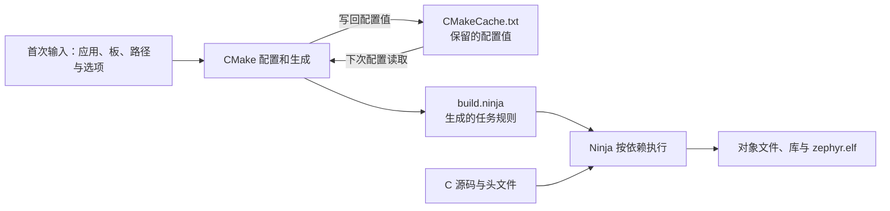

<!-- SPDX-License-Identifier: Apache-2.0 -->

# 第10章\_CMake缓存与构建排错

前置：P007 的 cmake-demo 已配置并构建成功；P009 已解释输入来源。现在改变一个可撤销的日志选项，观察缓存，再学习清理、预设与排错。

配套 [PPT](slides/P010_CMake缓存与构建排错_Windows.pptx) 与正文同序。源码依据为 `25c8f4a23988dd3b2cfb463613622738298c2d6c`；网页 latest 用于阅读，固定提交用于核对。Windows 命令默认 UCRT64，实验根为 `/g/zephyr_practice/zephyr-main`。

**复制命令：** [本章完整操作单元](commands/P010_Windows/README.md)。按正文选择分支，不把整个目录的命令依次执行。

**视频与复习对照：** 页码按当前正式 PPT；以阶段名称和正文链接定位，操作前提、完整命令、输出判断与恢复以 Markdown 为准。

| PPT 页面 | 阶段 | 完整正文 | 正文进一步展开 |
| --- | --- | --- | --- |
| 2—5 | 保存范围与三类构建状态 | [10.1.1](#section-10-1-1) | 回顾 P007 的 Debug/Release 边界，区分缓存、规则和产物 |
| 6—9 | 查看、修改和撤销缓存 | [10.1.1.2](#section-10-1-1-2) | 完整命令、预期结果与失败判断 |
| 10—12 | 清理和工程预设 | [10.1.1.5](#section-10-1-1-5) | clean/fresh/pristine、独立预设实例与可复制文件 |
| 13—16 | 优先级与接口组合 | [10.1.2](#section-10-1-2) | 环境、缓存、MERGE 列表和扩展边界 |
| 17—18 | 从产物排错 | [10.2](#section-10-2) | 本章目录内自查，不依赖后面的板级实验 |
| 19—20 | 定向查官方文档 | [10.3](#section-10-3) | 网页、仓库 rst 与实现位置相互对应 |

<a id="input-lifetime"></a>

<a id="section-10-1"></a>

## 10.1\_配置怎样保存，接口怎样组合

<a id="section-10-1-1"></a>

### 10.1.1\_同一个名字为什么会有不同的保存范围

现在才讨论范围，是因为已经知道 BOARD、SDK 根和模块列表各自交给谁。以固定 SDK 根为例，Bash 的 `export` 把值放进当前进程环境，后续启动的 CMake 可以读取；命令行 `-D` 把值交给某一个构建目录的 CMake 缓存；CMake 文件中的 `set` 默认创建普通变量。这三种容器互相独立。

| 选择方式 | 保存在哪里 | 对哪些操作有效 | 改变或退出的方法 |
| --- | --- | --- | --- |
| 当前 Bash `export` | 当前终端及后续子进程的环境 | 由这个终端启动、且会读取该环境的程序 | 当前终端 `unset` 或关闭；已经形成的构建缓存仍存在 |
| CMake `-D` | 对应 `-B` 目录的 `CMakeCache.txt` | 这个构建目录后续配置 | 对允许变更的项重传；换板/工具组合优先用新构建目录 |
| CMake `set` | 普通变量作用域；带 CACHE 时涉及缓存 | 当前执行的目录/函数等作用域 | 修改定义者；普通 set 不自动成为全局永久设置 |
| `CMakeUserPresets.json` | 应用旁由读者自行创建的用户文件 | 选择相应 `cmake --preset` 时 | 修改所选预设；存在文件时合并，不覆盖个人配置 |
| SDK 包注册 | 当前用户的 CMake 包位置记录 | 使用包搜索的工程 | SDK 移动后重新注册并核对实际发现结果 |

预设属于 CMake 功能，是保存参数组合的方式，不是另一套 Zephyr 工具链。`.venv` 解决 Python 包隔离，不能称为 SDK 的永久工程配置；本系列不修改自动生成的 activate 脚本来暗中固定 SDK。依据：[CMake 变量读取规则](https://cmake.org/cmake/help/latest/manual/cmake-language.7.html#variables)（原件 `CMake 变量与作用域`）；[CMake 工程预设](https://cmake.org/cmake/help/latest/manual/cmake-presets.7.html)（原件 `CMakePresets.json / CMakeUserPresets.json`）；[SDK 输入与默认查找分支](https://github.com/zephyrproject-rtos/zephyr/blob/25c8f4a23988dd3b2cfb463613622738298c2d6c/cmake/modules/FindZephyr-sdk.cmake#L44)（原件 `cmake/modules/FindZephyr-sdk.cmake`，第 44 行附近）。

<a id="cmake-cache-practice"></a>

#### 10.1.1.1\_一份构建目录里的三类状态

现在回到 7.2 的 `cmake-demo`。第一次配置后能直接执行 build，是因为选择与规则已经保存。第二次不再写所有 `-D`，CMake 也能从同一构建目录加载已有缓存。



缓存保存变量与探测结果，`build.ninja` 保存怎样执行任务，对象文件则是已经编译出的结果。它们是三类状态。缓存里的 `BOARD` 不等于编译好的代码；删掉对象文件也不等于清空了板和工具链选择。Ninja 还维护自己的依赖与执行记录，不能把所有增量行为都归因于 CMakeCache.txt。

例如，配置、构建、未改输入时再次构建之后：缓存仍描述同一组选择，规则仍描述同一组任务，第二次构建则可能复用先前产物而不再调用编译器。clean 主要针对后端管理的构建产物；换一个 -B 则从另一套配置状态开始。这两个动作解决的问题不同。

`CMakeCache.txt` 由 CMake 创建，通常一行是 `名字:类型=值`，例如 `CMAKE_MESSAGE_LOG_LEVEL:STRING=VERBOSE`。这是文件内容的形态，不是 Bash 命令。普通 CMake 变量未必写入缓存，Kconfig 的有效结果主要在 `zephyr/.config`，Zephyr 的模块记录又在 `zephyr_modules.txt`。缓存不是“所有构建变量的总表”，也不要手工编辑生成文件作为长期配置方案。依据：官方 `doc/develop/application/index.rst` 的 `CMakeCache.txt` 小节及 [CMake 用户交互指南](https://cmake.org/cmake/help/latest/guide/user-interaction/index.html#setting-build-variables)。

<a id="cmake-cache-types"></a>

冒号后的类型描述缓存项怎样表示值，并不决定这个名字属于哪个工具。一个 STRING 可以由 CMake 自身读取，也可以由 Zephyr 脚本读取；先看名字对应的接口说明，不能仅凭类型猜作用。

| 缓存里看到的类型 | 应怎样理解 |
| --- | --- |
| BOOL | 开关值，常见为 ON/OFF 或 TRUE/FALSE |
| STRING | 文本值，如板名称或配置日志级别；是否允许列表由读取者决定 |
| PATH | 目录路径，例如 SDK 根；不是“当前工作目录”的别名 |
| FILEPATH | 单个文件路径，例如编译器程序；不表示文件已经执行成功 |
| INTERNAL | 构建系统内部保存的状态，一般不作为读者手工维护的输入 |

本例 Python 路径可能显示为 `Python3_EXECUTABLE:UNINITIALIZED=...`。这是因为命令行未显式写缓存类型，且该项尚未被脚本赋予类型；**不表示 Python 没安装或虚拟环境没激活**。应核对路径和配置结果，不为了消除这个单词重装工具。条目以 `//` 开头的行是帮助说明，以 `#` 开头的行是文件注释，也不是待执行命令。

`-D` 属于 CMake 的缓存输入语法，类似 `-DCMAKE_MESSAGE_LOG_LEVEL:STRING=VERBOSE` 会更新一个指定项。它不会把任意名字自动变成 Zephyr 接口，也不会天然变成传给 GCC 的宏定义；必须有相应的 CMake/Zephyr 规则读取并使用它。缓存中有一项，最多证明值已存入，不能代替对有效配置与编译参数的检查。类型与未定类型的规则见 [CMake set 的缓存说明](https://cmake.org/cmake/help/latest/command/set.html#set-cache-entry)，本机原件为 CMake 安装根的 `share/cmake-<版本>/Help/command/set.rst`。

<a id="section-10-1-1-2"></a>

#### 10.1.1.2\_只看缓存时，不要意外重新配置

执行下面操作的前提是 7.2 配置已经成功。`-N` 进入仅查看模式，不执行配置和生成；`-L` 列出缓存选项，`A` 加上高级项，`H` 显示帮助文字。

```bash
# Windows UCRT64；源码根；前提：7.2 的 cmake-demo 配置成功。
cd /g/zephyr_practice/zephyr-main
# 只读缓存；不存在时停止并返回 7.2，不创建空文件。
test -f build/learning-tools/p003/cmake-demo/CMakeCache.txt && \
cmake -N -LAH build/learning-tools/p003/cmake-demo
# -LAH 不显示全部 INTERNAL 项，以下直接读取原生成文件。
grep -E '^(CMAKE_HOME_DIRECTORY|CMAKE_GENERATOR|BOARD|BOARD_QUALIFIERS|Zephyr_DIR):' \
  build/learning-tools/p003/cmake-demo/CMakeCache.txt
```

`-LAH` 不显示所有 INTERNAL 条目，因此第二条检查直接读取缓存文件中的入口、生成器及板记录。两者都是只读，不会创建缺失缓存；若第一条 test 失败，先回到 7.2 配置成功再读。不要把 `cmake -LAH 构建目录` 与带 `-N` 的写法混为一谈，前者可以重新配置工程。[完整只读检查](commands/P010_Windows/10.1.1-01.txt)。命令选项见 [cmake(1) Options](https://cmake.org/cmake/help/latest/manual/cmake.1.html#options)，本机原件为 CMake 安装根的 `Help/manual/cmake.1.rst`（实际位于 `share/cmake-<版本>/` 下）。

#### 10.1.1.3\_修改一项，然后故意不再传它

用 `CMAKE_MESSAGE_LOG_LEVEL` 观察缓存。它是 **CMake 原生输入**，控制配置脚本 `message()` 输出的日志级别；选择 VERBOSE 便于排错，不改变本例的板与 SDK。这与构建阶段 `--verbose` 打印编译命令是两件事。

```bash
# Windows UCRT64；源码根；前提：cmake-demo 已配置成功。
cd /g/zephyr_practice/zephyr-main
source .venv/Scripts/activate
# CMake 原生日志输入：保存为缓存项并重新配置，未执行固件编译。
cmake -S samples/hello_world -B build/learning-tools/p003/cmake-demo \
  -DCMAKE_MESSAGE_LOG_LEVEL:STRING=VERBOSE
# 应看到 CMAKE_MESSAGE_LOG_LEVEL:STRING=VERBOSE。
cmake -N -LAH build/learning-tools/p003/cmake-demo | grep CMAKE_MESSAGE_LOG_LEVEL
```

第一条 `-D` 创建或更新缓存条目，类型 STRING 表示字符串；随后重新运行配置以采用它。应查到 `CMAKE_MESSAGE_LOG_LEVEL:STRING=VERBOSE`。有没有更多输出取决于脚本是否发出了 VERBOSE 级别消息，所以先以缓存条目验证值，不凭屏幕行数推断。

现在仍用同一个目录重新配置，特意省略这项 `-D`：

```bash
# Windows UCRT64；源码根；前提：10.1.1.3 已把日志缓存项设为 VERBOSE。
cd /g/zephyr_practice/zephyr-main
source .venv/Scripts/activate
# 特意省略 -D，仍配置同一目录。
cmake -S samples/hello_world -B build/learning-tools/p003/cmake-demo
# 应仍看到 VERBOSE，说明省略输入不会撤销缓存。
cmake -N -LAH build/learning-tools/p003/cmake-demo | grep CMAKE_MESSAGE_LOG_LEVEL
```

应仍读到 VERBOSE。这就证明**从下一条命令中省略参数，不会删除已写入的缓存项**。关闭终端、重新激活 `.venv` 也不会删除这个文件。相反，另用一个新的 `-B`，不会继承这里的条目。这里的“保留”以项目没有重写该项为前提，下一小节会解释项目脚本的覆盖。[修改命令](commands/P010_Windows/10.1.1-02.txt)、[复用命令](commands/P010_Windows/10.1.1-03.txt)。依据：[CMAKE_MESSAGE_LOG_LEVEL](https://cmake.org/cmake/help/latest/variable/CMAKE_MESSAGE_LOG_LEVEL.html)；本机原件 `Help/variable/CMAKE_MESSAGE_LOG_LEVEL.rst`，由 CMake 自身读取。

#### 10.1.1.4\_恢复默认与项目脚本覆盖

若要显式设为普通日志，可在配置时传 `-DCMAKE_MESSAGE_LOG_LEVEL:STRING=STATUS`；这仍会保留一个指定值。若要撤销刚才的显式选择，使用 `-U` 删除**准确的这一项**，并重新配置：

```bash
# Windows UCRT64；源码根；前提：10.1.1.3 已设置日志缓存项。
cd /g/zephyr_practice/zephyr-main
source .venv/Scripts/activate
# 仅撤销本例的一项显式输入，再按默认规则配置。
cmake -S samples/hello_world -B build/learning-tools/p003/cmake-demo \
  -U CMAKE_MESSAGE_LOG_LEVEL
# 无其他来源重建该项时，无输出且返回 1 是本检查的预期结果。
grep '^CMAKE_MESSAGE_LOG_LEVEL:' build/learning-tools/p003/cmake-demo/CMakeCache.txt
```

本例没有其他来源重新定义它时，最后的 grep 无输出、返回 1，表示缓存项已不存在，这在此处是预期结果。`-U` 会匹配缓存项名称，不用 `-U '*'` 盲目清空；它不会修改终端环境、预设或应用脚本。如果那些来源仍定义同名输入，下次配置仍可能取得或重新写入值。[可复制恢复块](commands/P010_Windows/10.1.1-04.txt)。

`-D` 也不是不受任何脚本影响的最高优先级。本章源码的 `cmake/modules/kernel.cmake` 在第 167 行附近使用 `set(CMAKE_EXPORT_COMPILE_COMMANDS TRUE CACHE BOOL ... FORCE)`，强制生成编译命令数据库，供 Zephyr 脚本使用。因此这个变量不适合拿来演示“改成 OFF 后一直保留”；项目配置会把它写回 TRUE。这里的省略号仅表示省去帮助文本的机制说明，原文件只读，读者无需修改。

CMake 普通变量可以遮住同名缓存变量，带 CACHE 的 set 通常保留已有条目，而 FORCE 可以更新它。Zephyr 的 `zephyr_get` 还定义特定输入的读取与合并规则，接着看 10.1.2。这解释了为何应同时核对**传入值、保存值和实际使用结果**。依据：[CMake set 规则](https://cmake.org/cmake/help/latest/command/set.html)；[固定源码中的 FORCE 设置](https://github.com/zephyrproject-rtos/zephyr/blob/25c8f4a23988dd3b2cfb463613622738298c2d6c/cmake/modules/kernel.cmake#L163)。

<a id="section-10-1-1-5"></a>

#### 10.1.1.5\_清理、重新配置与重建的边界

日常改代码先增量 build；改允许更新的配置输入先重新配置，再 build。只有需要清除编译产物时才 clean。下表按本章单应用 Ninja 工程解释，不把这些动作当作每次构建必做的流程。

| 动作 | 保留或清除什么 | 适用情况 |
| --- | --- | --- |
| `cmake --build` | 复用规则及已完成产物，执行到期任务 | 日常源码修改 |
| 再次 `cmake -S ... -B ... -D...` | 读取原缓存，更新传入项，重新生成规则 | 可变选项或配置片段改变 |
| `cmake --build ... --target clean` | 清除后端管理的构建产物，保留 CMakeCache.txt 与规则 | 需要重编译原配置 |
| `cmake --build ... --clean-first` | 先 clean 再构建，仍复用配置 | 一次完成清理与重编译 |
| `cmake --fresh -S ... -B ...` | CMake 3.24+ 重建 CMakeCache.txt 和 CMakeFiles，不承诺删除目录内所有其他文件 | 重新执行 CMake 配置；Zephyr 下不能等同于 pristine |
| 新的 `-B` 目录 | 从新的构建状态开始，旧目录保持可用 | 换板、生成器或工具链时优先采用 |
| `west build -p always` | 先清空指定构建目录内的内容，再配置和构建 | 明确不要该目录旧产物与状态时 |

表内带省略号的是调用形态；下方给本例的完整 clean 操作，不对源码目录或整个工作区运行清理：

```bash
# Windows UCRT64；源码根；前提：cmake-demo 已成功构建。
cd /g/zephyr_practice/zephyr-main
source .venv/Scripts/activate
# 本操作清理本节构建产物；不对源码目录执行。
cmake --build build/learning-tools/p003/cmake-demo --target clean
# 缓存与规则仍在。clean 不会撤销原来的板和工具链选择。
ls build/learning-tools/p003/cmake-demo/CMakeCache.txt
ls build/learning-tools/p003/cmake-demo/build.ninja
# 复用原配置重新编译。
cmake --build build/learning-tools/p003/cmake-demo --parallel 4
```

clean 后前两项检查应仍成功，随后 build 会重新生成固件。这说明 clean 不会解决“缓存仍然选旧 SDK”。`--clean-first` 是它的组合形式，不需要与这组命令重复执行。[完整 clean 对照](commands/P010_Windows/10.1.1-05.txt)。

`--fresh` 只重置 CMake 指定的状态，Zephyr 的 `zephyr/.config` 等文件可能仍留在目录并参与后续处理，不能把它讲成彻底干净的 Zephyr 构建。`west -p always` 范围更大，目录里的手工文件也会丢失；只对确认可重新生成的构建输出使用。本节不把 fresh/pristine 设为执行要求。若换板或编译器，优先复制完整配置命令并改用新的 -B；新目录必须重新给出 BOARD 等输入，不会读取旧目录的缓存。依据：[CMake fresh 与构建选项](https://cmake.org/cmake/help/latest/manual/cmake.1.html)；[Zephyr pristine 说明](https://docs.zephyrproject.org/latest/develop/west/build-flash-debug.html#pristine-builds)，原件 `doc/develop/west/build-flash-debug.rst` 与 `cmake/pristine.cmake`。

#### 10.1.1.6\_预设保存输入，缓存保存一次配置的结果

终端里的长命令可以保存为 CMake 的原生预设。读者在**官方应用目录 `samples/hello_world` 中自行创建** `CMakeUserPresets.json`；它是本机配置，不是原来应该存在的 Zephyr 文件。该文件已存在时只合并下面两个命名条目，保留原来的 version、include 和其他预设；不要覆盖整份个人配置。首次新建时用以下完整内容：

```json
{
  "version": 3,
  "configurePresets": [{
    "name": "learning-mps2",
    "generator": "Ninja",
    "binaryDir": "${sourceDir}/../../build/learning-tools/cmake-presets",
    "cacheVariables": {
      "BOARD": "mps2/an386",
      "Zephyr_DIR": "${sourceDir}/../../share/zephyr-package/cmake",
      "Python3_EXECUTABLE": "${sourceDir}/../../.venv/Scripts/python.exe"
    }
  }],
  "buildPresets": [{
    "name": "learning-mps2",
    "configurePreset": "learning-mps2"
  }]
}
```

`${sourceDir}` 是 CMake 预设宏，指这里的应用目录，不是自定义 shell 变量；向上两层才是 Zephyr 源码根。binaryDir 指定一份新缓存，cacheVariables 提供本次配置输入。SDK 沿 P003 的默认发现，不写无必要的默认工具链类型。下方操作只在该文件创建或合并完成、P007 工具与依赖检查通过后执行。

```bash
# Windows UCRT64；源码根；已按本节创建或合并 learning-mps2 预设。
cd /g/zephyr_practice/zephyr-main
source .venv/Scripts/activate
# 在预设所属的官方应用目录调用；不改写它的 CMakeLists.txt。
cd samples/hello_world
cmake --list-presets
# 确认列表包含 learning-mps2 后，配置成功才构建。
cmake --preset learning-mps2 && cmake --build --preset learning-mps2
```

configurePresets 中的名字与 buildPresets 中的名字属于不同列表，本例为便于记忆取同名；构建预设通过 configurePreset 字段关联配置预设。`cmake --preset` 仍执行配置和生成；`cmake --build --preset` 仍调用后端。使用预设不会跳过 SDK 或模块发现。首次配置失败时停在该阶段；不要把旧输出当作成功。

预设是读者维护的输入方案，缓存是工具生成的配置状态。修改 JSON 后重新运行配置预设，缓存才接收新输入；删除一个预设不会删除已经生成的构建目录。撤销时删除自己新增的两个命名条目，保留其他预设；不要直接删除含有其他个人配置的文件。

依据：[CMake Presets](https://cmake.org/cmake/help/latest/manual/cmake-presets.7.html)，本机原件为 CMake 帮助目录中的 `manual/cmake-presets.7.rst`；配套完整文件见 [预设示例](labs/cmake_presets/CMakeUserPresets.json)，由教程提供，需要按本节放入应用目录才生效。

<a id="cmake-session-state"></a>

#### 10.1.1.7\_退出终端以后，哪些设置还在

把 10.1.1.3 的操作按时间回放一次：第一次用 -D 把日志级别写入 cmake-demo 的缓存；第二次省略该参数，CMake 仍读取同一份缓存；此时关掉终端，磁盘上的缓存没有删除。新开 UCRT64 后重新激活 `.venv`，也不会清除那个条目。直到按 10.1.1.4 用 -U 撤销它，且没有其他来源重建，显式选择才从这份缓存中消失。

| 接下来做的动作 | 会改变什么 | 不会顺带完成什么 |
| --- | --- | --- |
| 关闭并重新打开 UCRT64 | 重新建立进程环境；本次临时 export 不再由旧进程传递 | 不删除构建缓存或用户预设；启动配置仍可能再次 export |
| 激活或退出 .venv | 改变当前终端的 Python 命令搜索环境 | 不改已缓存的 Python、SDK 或板选择 |
| 修改用户预设里的值 | 改变下次选择该配置预设时的输入 | 不即时改写现有缓存，不自动触发构建 |
| 从预设或下一条命令里删掉参数 | 不再从该处提供这项输入 | 不等于删除旧缓存中的同名项 |
| 重新注册搬家后的 SDK | 更新当前用户的 CMake 包搜索候选 | 不修复预设或旧构建缓存中的显式旧路径 |
| 使用新的 -B | 建立独立的构建状态 | 不自动复制旧目录的板、模块和工具输入 |

因此恢复一个“不知道谁设置过”的值，要先确认本次操作的是哪一个构建目录，再查当前终端、选中的预设以及缓存；不是把三个地方都无条件重置。对于日志级别这样的独立可变项，本章给出精确 -U；对于板或工具链组合，保留旧结果并使用新的 -B 更容易确认来源。下一节解释 Zephyr 读取这些来源时的优先级。

<a id="section-10-1-2"></a>

### 10.1.2\_缓存为什么能挡住新 export

CMake 的 `${名字}` 通常先找普通变量、再找缓存；`$ENV{名字}` 明确读进程环境。Zephyr 的辅助函数还能自行规定读取顺序。SDK 相关输入调用 `zephyr_get`；本系列普通单应用、不使用 snippets 的情况，相关标量按**缓存、环境、当前普通值**寻找已定义输入。

因此，第一次用 SDK-A 配置构建目录后，第二次只在终端 export SDK-B，旧缓存可能仍使 A 生效。这是同一构建目录在保留选择，不是“注册失败”。换工具组合时使用新的构建目录，可以避免关联编译器和库配置残留；不能仅修改一个缓存路径就假定全部状态同步。

完整函数还考虑 sysbuild 与 snippets 作用域，不能把这个简化顺序说成所有 CMake 变量的通用规则。`ZEPHYR_BASE` 有自己的包入口分支；额外模块也不同：`EXTRA_ZEPHYR_MODULES` 与兼容名 `ZEPHYR_EXTRA_MODULES` 使用 MERGE 合并来源，所以只给空 `-D` 不一定清除环境里追加的路径。P011 的恢复分支分别处理旧环境和新构建目录。依据：[Zephyr 输入读取与优先级](https://github.com/zephyrproject-rtos/zephyr/blob/25c8f4a23988dd3b2cfb463613622738298c2d6c/cmake/modules/extensions.cmake#L4088)（原件 `cmake/modules/extensions.cmake`，第 4088 行附近）；[模块输入与发现脚本调用](https://github.com/zephyrproject-rtos/zephyr/blob/25c8f4a23988dd3b2cfb463613622738298c2d6c/cmake/modules/zephyr_module.cmake#L34)（原件 `cmake/modules/zephyr_module.cmake`，第 34 行附近）；[包入口 include_boilerplate](https://github.com/zephyrproject-rtos/zephyr/blob/25c8f4a23988dd3b2cfb463613622738298c2d6c/share/zephyr-package/cmake/ZephyrConfig.cmake#L28)（原件 `share/zephyr-package/cmake/ZephyrConfig.cmake`，第 28 行附近）。

<a id="interface-combinations"></a>

<a id="section-10-1-3"></a>

### 10.1.3\_按要改变的对象选择接口

| 本次要改变什么 | 使用或保留的接口 | 不应误做的事情 |
| --- | --- | --- |
| 编译已支持的官方板 | 选择应用和 BOARD，默认 SDK 与 west 模块可继续使用 | 为了表示“用 Zephyr”重复设置默认类型 |
| 多套 SDK 固定一套 | 按需固定 SDK 根 | 把 SDK 根填成 TOOLCHAIN_ROOT |
| 改用独立 GNU 编译器组件 | 选择 cross-compile 与程序前缀，核对目标库 | 把独立组件称作 Minimal SDK |
| 加一个 HAL 项目 | 下载后通过追加模块接口提供根路径 | 替换整份默认模块列表或直接伪造 MODULE_DIR |
| 增加树外板/SoC | 提供相应搜索根或模块 settings，并实现硬件文件 | 只换 BOARD 名称就宣称硬件存在 |
| 改应用功能或硬件属性 | 分别提供 Kconfig 片段或 overlay | 把 CONF_FILE 当布尔开关，或把 overlay 当 CMake 脚本 |
| 给库增加一个实现文件 | 执行到该 CMake 入口后，用目标/库函数加源码 | 只把文件复制进目录便期待自动构建 |

这张表的作用是让输入与工作相对应。正常选择一个已支持的 Cortex-M 板，通常不涉及自定义工具链规则；新增一个源码模块也不要求重写应用加载 Zephyr 的包入口。

<a id="section-10-1-4"></a>

### 10.1.4\_更大工程还有哪些扩展入口

`BOARD_ROOT`、`SOC_ROOT`、`DTS_ROOT` 扩展硬件描述查找范围；`MODULE_EXT_ROOT` 用于模块接入文件放在外部的位置；`TOOLCHAIN_ROOT` 扩展工具链接入规则。它们虽然都带 ROOT，所寻找的目录结构和读取者不同。

snippets 用于给构建添加命名的配置片段；sysbuild 在外层协调多个镜像，各镜像仍有自己的 Zephyr 配置与产物。初学单应用时先理解本章主线，遇到多镜像需求再进入 sysbuild，而不是在普通命令里预先堆上这些变量。相关官方说明已在 10.3 提供直接入口。依据：[外部项目模块说明](https://docs.zephyrproject.org/latest/develop/modules.html)（原件 `doc/develop/modules.rst`，第 3 行附近）；[树外工具链设计说明](https://docs.zephyrproject.org/latest/develop/toolchains/custom_cmake.html)（原件 `doc/develop/toolchains/custom_cmake.rst`，第 3 行附近）；[配置片段组合入口](https://docs.zephyrproject.org/latest/build/snippets/index.html)（原件 `doc/build/snippets/index.rst`，第 3 行附近）；[多镜像构建入口](https://docs.zephyrproject.org/latest/build/sysbuild/index.html)（原件 `doc/build/sysbuild/index.rst`，第 3 行附近）。


<a id="section-10-2"></a>

## 10.2\_怎样证明工程采用了这些输入

<a id="section-10-2-1"></a>

### 10.2.1\_按阶段读产物

源码中的脚本说明机制，实际构建的产物说明本次选择。它们需要互相对应。

| 要回答的问题 | 在所选构建目录里看什么 | 能证明到哪一步 |
| --- | --- | --- |
| 选中了哪个应用、源码、板和 SDK | 配置日志及 `CMakeCache.txt` | 配置采用的入口与保存值；不代表实板运行成功 |
| 功能最终启用了什么 | `zephyr/.config` | Kconfig 计算结果 |
| 硬件描述合并后是什么 | `zephyr/zephyr.dts` | DTS/overlay 处理结果 |
| CMake 识别了哪些模块 | `zephyr_modules.txt` | 模块根与 CMake 入口记录；不代表每个文件都编译 |
| 某个 C 文件被安排怎样编译 | 生成阶段导出的 `compile_commands.json` | 编译器、CPU 参数、宏与头文件目录；不证明任务已经执行 |
| 最终有没有生成固件 | `zephyr/zephyr.elf` 和构建日志 | 构建完成；运行和烧录另验 |

这些都是**工具生成文件**，应在成功执行对应阶段后出现；第一次只读 P007 时没有它们是正常的，不需要提前手建。P007 的 7.2 已实际构建的读者可直接做 [cmake-demo 自查](#cmake-result-check)；本册所有自查均以 cmake-demo 为准。日志中的真实任务执行、生成阶段安排的编译命令和磁盘上保留的旧产物，应分别判断。

<a id="section-10-2-2"></a>

### 10.2.2\_自查本次构建，不依赖后面的板级实验

本章沿用 P007 的 `build/learning-tools/p003/cmake-demo`。继续使用下方 10.2.4 的只读命令核对，不混读 P011 的其他构建目录。缓存不存在或生成失败时先回 P007，不手工创建空文件。

<a id="section-10-2-3"></a>

### 10.2.3\_三个问题检查是否理解模型

**下载了一个 HAL，目录里有 module.yml，为什么编译器仍找不到头文件？** 先查项目是否成为模块候选，再查 zephyr_modules.txt、CMake 入口是否执行、配置条件与头文件目录设置。单凭下载成功无法跳过这些层。

**SDK 已注册，为什么还会用旧 SDK？** 注册提供包搜索候选；旧环境、所选预设或构建缓存可能明确约束了另一套位置。先看实际配置输入和保存范围，不要反复 reinstall 或为每个终端重新注册。

**从 MPS2 换到 HC32，为什么不能只改工具链变量？** 工具链规则负责如何编译；板/SoC、设备树、Kconfig 和驱动负责该芯片上的硬件与功能。后者需要按 P011 新增并接入，ARM 编译器通常可以复用。

<a id="cmake-result-check"></a>

### 10.2.4\_在本章构建目录完成自查与排错

本节直接检查 P007 的 7.2 创建的 `build/learning-tools/p003/cmake-demo`，不要求先生成 P011 的另一套产物。先读配置保存了什么，再看某个源文件被安排怎样编译。下面都是只读操作；若没有相应文件，回到产生它的步骤，不手工创建空缓存或空 JSON。

```bash
# Windows UCRT64；源码根；前提：7.2 的 cmake-demo 已成功配置。
cd /g/zephyr_practice/zephyr-main
# 只读工具生成文件；不存在时返回配置步骤，不创建空文件。
if test -f build/learning-tools/p003/cmake-demo/CMakeCache.txt; then
  # 源码、应用、板、生成器和 Python 的保存值。
  grep -E '^(CMAKE_HOME_DIRECTORY|CMAKE_GENERATOR|BOARD|BOARD_QUALIFIERS|ZEPHYR_BASE|Zephyr_DIR|Python3_EXECUTABLE):' \
    build/learning-tools/p003/cmake-demo/CMakeCache.txt
  # SDK 选择与配置阶段确定的 C 编译器。
  grep -E '^(ZEPHYR_TOOLCHAIN_VARIANT|ZEPHYR_SDK_INSTALL_DIR|CMAKE_C_COMPILER):' \
    build/learning-tools/p003/cmake-demo/CMakeCache.txt
else
  printf '%s\n' '尚无本章缓存，请先完成 7.2.2 的配置。'
fi
# CMSIS 记录是模块发现结果；这里不下载、不添加模块。
if test -f build/learning-tools/p003/cmake-demo/zephyr_modules.txt; then
  grep '"cmsis_6"' build/learning-tools/p003/cmake-demo/zephyr_modules.txt
else
  printf '%s\n' '尚无模块记录，请检查配置日志并返回 P004—P005。'
fi
```

本例应能关联出同一组选择：应用是 `samples/hello_world`，板是 `mps2/an386`，生成器是 Ninja，Python 指向项目 `.venv/Scripts/python.exe`，Zephyr 包入口位于当前源码根的 `share/zephyr-package/cmake`，SDK 根为实际选中的 SDK，C 编译器在它的 `gnu/arm-zephyr-eabi/bin` 下。本机对应的 SDK 根是 `G:/zephyr_practice/zephyr-sdk-1.0.1`，读者使用其他有效位置时不必强行改成这个路径。BOARD 及限定项的保存形态可能随版本规范化，以板日志和相关记录共同核对。

`cmsis_6` 的模块记录应指向 P004 获取的源码根；第三列若保留 `${ZEPHYR_CMSIS_6_CMAKE_DIR}`，这是供 Zephyr 后续解析的外置接入入口表达式，不是目录丢失，也不是要求读者创建这个名字的文件。其后续读取链已在 9.3.2—9.3.3 展开。[可复制检查](commands/P010_Windows/10.2.4-01.txt)。

再从生成的编译命令数据库只取 hello_world 的 main.c，避免在整份长 JSON 中反复搜索：

```bash
# Windows UCRT64；源码根；前提：cmake-demo 配置、生成成功。
cd /g/zephyr_practice/zephyr-main
source .venv/Scripts/activate
# 只读编译命令数据库；-X utf8 是 Python 的 UTF-8 模式，适配 UCRT64 输出。
# 不执行数据库中的命令，不修改源码或构建状态。
python -X utf8 - <<'PY'
import json
from pathlib import Path

database = Path('build/learning-tools/p003/cmake-demo/compile_commands.json')
if not database.is_file():
    raise SystemExit('尚无编译命令数据库，请先检查 7.2.2 的配置与生成结果。')

target = Path('samples/hello_world/src/main.c').resolve()
for entry in json.loads(database.read_text(encoding='utf-8')):
    source = Path(entry['file'])
    if not source.is_absolute():
        source = Path(entry['directory']) / source
    if source.resolve() == target:
        print('源文件：', source)
        print('命令工作目录：', entry['directory'])
        print('生成阶段安排的编译命令：')
        print(entry.get('command') or json.dumps(entry['arguments'], ensure_ascii=False))
        break
else:
    raise SystemExit('未找到 hello_world 的 main.c，请核对当前应用与构建目录。')
PY
```

这段 Python 只是读取 CMake 生成的 JSON，不创建测试工程，也不更改应用。`-X utf8` 是 Python 自身的 UTF-8 模式，用于这一条读取命令的中文输出，不是 Zephyr 变量，也不需要修改 `.venv`。观察打印命令的编译器路径、`-mcpu`/`-mthumb`、CMSIS 的头文件目录和 main.c 输入路径。`file` 表示源文件，`directory` 表示执行该编译命令时的工作目录；数据库中的相对路径应结合该目录理解。

**数据库在生成阶段就能出现，因此它证明的是“这份构建计划使用什么命令”，不是“刚才已经执行了这条命令”。** 需要观察实际执行时看 7.2.4 的 `--verbose` 日志；没有到期任务时无编译命令输出是正常的。当前 Zephyr 强制导出该数据库的依据见 10.1.1.4；格式见 [CMake 编译命令数据库说明](https://cmake.org/cmake/help/latest/variable/CMAKE_EXPORT_COMPILE_COMMANDS.html)，本机原件在 CMake 安装根的 `Help/variable/CMAKE_EXPORT_COMPILE_COMMANDS.rst`。[可复制读取块](commands/P010_Windows/10.2.4-02.txt)。

失败时先定位停在哪个阶段，再回到对应输入。不要看到最后一行 build stopped 就只改编译器路径。

| 看到的现象 | 当前优先核对 | 返回哪一步 |
| --- | --- | --- |
| 找不到应用 CMakeLists.txt，或报源目录不对 | 当前目录与 -S；是否把 SDK 或整个 Zephyr 根误当应用 | 7.2.1—7.2.2 |
| 找不到 Zephyr 包 | Zephyr_DIR 是否指向当前源码的包入口；不要用 SDK 根替代 | P007 7.1.3 与 P009 9.1.2 |
| 找不到 Python、SDK 或 CMSIS | 配置日志中的实际路径、缓存和依赖文件；按缺失对象处理 | P002、P003 或 P004—P005 |
| 构建目录没有规则，或无法加载缓存 | 上一次配置是否成功；--build 是否指向同一个目录 | 7.2.2 |
| 生成器不匹配，或修改板/编译器后状态混杂 | 是否复用了原来的 -B | 7.2.7 与 10.1.1.5，改用独立输出目录 |
| 配置完成，随后 C 文件编译或链接失败 | 第一处编译/链接诊断及对应任务的完整命令 | 7.2.4；核对源码、头文件、库与功能配置 |
| 修改缓存后没有表现出预期效果 | 改的是配置日志还是编译日志；是否又被脚本、环境或预设覆盖 | 10.1.1.3—10.1.2 |
| 没有重新编译，只提示 no work to do | 文件是否保存、是否是当前 -S 的文件、是否已被目标引用 | 7.2.3—7.2.7 |


<a id="section-10-3"></a>

## 10.3\_官方文档与实现的定向阅读入口

<a id="section-10-3-1"></a>

### 10.3.1\_从网页到仓库原件的路线

在 Zephyr 文档网站进入 **Build and Configuration Systems**，先看 **Build System (CMake)** 的阶段图，再看 **CMake Reference** 的模块、目标属性与变量分类。需要理解应用文件时进入 **Developing with Zephyr → Application Development**；源码模块进入 **Modules (External projects)**；工具链进入 **Toolchains**。下面给出直接链接，不要求先全仓库搜索。

| 当前想理解什么 | 直接阅读的官方页面与仓库原件 | 本章位置 |
| --- | --- | --- |
| CMake、Ninja、配置和构建阶段 | [构建阶段说明](https://docs.zephyrproject.org/latest/build/cmake/index.html#build-and-configuration-phases)（原件 `doc/build/cmake/index.rst`，第 52 行附近） | 7.1.1—7.2 |
| 应用入口怎样组织 | [应用开发说明](https://docs.zephyrproject.org/latest/develop/application/index.html)（原件 `doc/develop/application/index.rst`，第 3 行附近） | P007 7.1.2 |
| 包入口选择哪份源码 | [Zephyr 包发现说明](https://docs.zephyrproject.org/latest/build/zephyr_cmake_package.html)（原件 `doc/build/zephyr_cmake_package.rst`，第 3 行附近） | P007 7.1.3、P009 9.1.2 |
| 命令、变量、模块的分类说明 | [CMake Reference 分类入口](https://docs.zephyrproject.org/latest/build/cmake-ref/index.html)（原件 `doc/build/cmake-ref/index.rst`，第 3 行附近） | 9.1、10.3.2 |
| 板目标与配置片段输入 | [BOARD 变量参考](https://docs.zephyrproject.org/latest/build/cmake-ref/variable/BOARD.html)（原件 `doc/build/cmake-ref/variable/BOARD.rst`，第 4 行附近）；[CONF_FILE 变量参考](https://docs.zephyrproject.org/latest/build/cmake-ref/variable/CONF_FILE.html)（原件 `doc/build/cmake-ref/variable/CONF_FILE.rst`，第 4 行附近） | 9.1.3—9.1.4 |
| SDK、独立编译器与自定义规则 | [SDK 文档](https://docs.zephyrproject.org/latest/develop/toolchains/zephyr_sdk.html)（原件 `doc/develop/toolchains/zephyr_sdk.rst`，第 3 行附近）；[独立 GNU 接入说明](https://docs.zephyrproject.org/latest/develop/toolchains/other_x_compilers.html)（原件 `doc/develop/toolchains/other_x_compilers.rst`，第 3 行附近）；[树外工具链设计说明](https://docs.zephyrproject.org/latest/develop/toolchains/custom_cmake.html)（原件 `doc/develop/toolchains/custom_cmake.rst`，第 3 行附近） | 9.2 |
| module.yml 与外部源码接入 | [外部项目模块说明](https://docs.zephyrproject.org/latest/develop/modules.html)（原件 `doc/develop/modules.rst`，第 3 行附近） | 9.3 |
| west build 的职责 | [west 构建命令说明](https://docs.zephyrproject.org/latest/develop/west/build-flash-debug.html)（原件 `doc/develop/west/build-flash-debug.rst`，第 3 行附近） | 7.1.1 |
| 多镜像与配置组合 | [多镜像构建入口](https://docs.zephyrproject.org/latest/build/sysbuild/index.html)（原件 `doc/build/sysbuild/index.rst`，第 3 行附近）；[配置片段组合入口](https://docs.zephyrproject.org/latest/build/snippets/index.html)（原件 `doc/build/snippets/index.rst`，第 3 行附近） | 10.1.4 |

<a id="section-10-3-2"></a>

### 10.3.2\_有些接口文档为什么藏在 CMake 文件的注释里

`doc/build/cmake-ref/module/extensions.rst` 很短，其中的 `cmake-module` 指令从 `cmake/modules/extensions.cmake` 提取文档。后者的 `.rst` 注释描述函数的参数、返回值或行为，随后就是实现。因此短 `.rst` 不代表接口没有文档，也不应让读者盲目搜索变量名。先按 Reference 分类找到函数所属模块，再读网页说明；需要核查边界时，直接打开本章给出的固定实现链接。

变量页如 `doc/build/cmake-ref/variable/CONF_FILE.rst` 会把读取者指向 `configuration_files` 模块。下一步应读该模块的说明与实现，而不是把 CONF_FILE 当成 CMake 程序自身内置的参数。SDK 接口中一部分行为在独立 SDK 安装包，须到已标注的安装根查验。

CMake 自身的命令与变量另读 [命令行手册](https://cmake.org/cmake/help/latest/manual/cmake.1.html)、[配置日志级别](https://cmake.org/cmake/help/latest/variable/CMAKE_MESSAGE_LOG_LEVEL.html)和[预设手册](https://cmake.org/cmake/help/latest/manual/cmake-presets.7.html)。本机原件在 CMake 安装根的 `share/cmake-<版本>/Help/`；它们定义通用行为，Zephyr 仓库则定义具体工程怎样使用或覆盖这些行为。

本章的实现定位清单如下。每项链接固定到本章源码提交；SDK 两项明确指向安装包文件，发行链接用于取得同版原件。

- [构建阶段说明](https://github.com/zephyrproject-rtos/zephyr/blob/25c8f4a23988dd3b2cfb463613622738298c2d6c/doc/build/cmake/index.rst#L52)：`doc/build/cmake/index.rst`，第 52 行附近。
- [扩展函数参考页](https://github.com/zephyrproject-rtos/zephyr/blob/25c8f4a23988dd3b2cfb463613622738298c2d6c/doc/build/cmake-ref/module/extensions.rst#L1)：`doc/build/cmake-ref/module/extensions.rst`，第 1 行附近。
- [Zephyr 包发现说明](https://github.com/zephyrproject-rtos/zephyr/blob/25c8f4a23988dd3b2cfb463613622738298c2d6c/doc/build/zephyr_cmake_package.rst#L3)：`doc/build/zephyr_cmake_package.rst`，第 3 行附近。
- [hello_world 原有入口](https://github.com/zephyrproject-rtos/zephyr/blob/25c8f4a23988dd3b2cfb463613622738298c2d6c/samples/hello_world/CMakeLists.txt#L3)：`samples/hello_world/CMakeLists.txt`，第 3 行附近。
- [包入口 include_boilerplate](https://github.com/zephyrproject-rtos/zephyr/blob/25c8f4a23988dd3b2cfb463613622738298c2d6c/share/zephyr-package/cmake/ZephyrConfig.cmake#L28)：`share/zephyr-package/cmake/ZephyrConfig.cmake`，第 28 行附近。
- [默认初始化顺序](https://github.com/zephyrproject-rtos/zephyr/blob/25c8f4a23988dd3b2cfb463613622738298c2d6c/cmake/modules/zephyr_default.cmake#L71)：`cmake/modules/zephyr_default.cmake`，第 71 行附近。
- [app 目标创建处](https://github.com/zephyrproject-rtos/zephyr/blob/25c8f4a23988dd3b2cfb463613622738298c2d6c/cmake/modules/kernel.cmake#L236)：`cmake/modules/kernel.cmake`，第 236 行附近。
- [外部模块 CMake 入口加载处](https://github.com/zephyrproject-rtos/zephyr/blob/25c8f4a23988dd3b2cfb463613622738298c2d6c/CMakeLists.txt#L778)：`CMakeLists.txt`，第 778 行附近。
- [板选择的说明与实现](https://github.com/zephyrproject-rtos/zephyr/blob/25c8f4a23988dd3b2cfb463613622738298c2d6c/cmake/modules/boards.cmake#L6)：`cmake/modules/boards.cmake`，第 6 行附近。
- [BOARD 变量参考](https://github.com/zephyrproject-rtos/zephyr/blob/25c8f4a23988dd3b2cfb463613622738298c2d6c/doc/build/cmake-ref/variable/BOARD.rst#L4)：`doc/build/cmake-ref/variable/BOARD.rst`，第 4 行附近。
- [BOARD_ROOT 变量参考](https://github.com/zephyrproject-rtos/zephyr/blob/25c8f4a23988dd3b2cfb463613622738298c2d6c/doc/build/cmake-ref/variable/BOARD_ROOT.rst#L4)：`doc/build/cmake-ref/variable/BOARD_ROOT.rst`，第 4 行附近。
- [配置片段的选取](https://github.com/zephyrproject-rtos/zephyr/blob/25c8f4a23988dd3b2cfb463613622738298c2d6c/cmake/modules/configuration_files.cmake#L43)：`cmake/modules/configuration_files.cmake`，第 43 行附近。
- [CONF_FILE 变量参考](https://github.com/zephyrproject-rtos/zephyr/blob/25c8f4a23988dd3b2cfb463613622738298c2d6c/doc/build/cmake-ref/variable/CONF_FILE.rst#L4)：`doc/build/cmake-ref/variable/CONF_FILE.rst`，第 4 行附近。
- [设备树配置入口](https://github.com/zephyrproject-rtos/zephyr/blob/25c8f4a23988dd3b2cfb463613622738298c2d6c/cmake/modules/dts.cmake#L9)：`cmake/modules/dts.cmake`，第 9 行附近。
- [Kconfig 脚本调用处](https://github.com/zephyrproject-rtos/zephyr/blob/25c8f4a23988dd3b2cfb463613622738298c2d6c/cmake/modules/kconfig.cmake#L473)：`cmake/modules/kconfig.cmake`，第 473 行附近。
- [SDK 请求与通用工具规则](https://github.com/zephyrproject-rtos/zephyr/blob/25c8f4a23988dd3b2cfb463613622738298c2d6c/cmake/modules/FindHostTools.cmake#L51)：`cmake/modules/FindHostTools.cmake`，第 51 行附近。
- [SDK 输入与默认查找分支](https://github.com/zephyrproject-rtos/zephyr/blob/25c8f4a23988dd3b2cfb463613622738298c2d6c/cmake/modules/FindZephyr-sdk.cmake#L44)：`cmake/modules/FindZephyr-sdk.cmake`，第 44 行附近。
- [目标工具链规则](https://github.com/zephyrproject-rtos/zephyr/blob/25c8f4a23988dd3b2cfb463613622738298c2d6c/cmake/modules/FindTargetTools.cmake#L30)：`cmake/modules/FindTargetTools.cmake`，第 30 行附近。
- [树外工具链设计说明](https://github.com/zephyrproject-rtos/zephyr/blob/25c8f4a23988dd3b2cfb463613622738298c2d6c/doc/develop/toolchains/custom_cmake.rst#L3)：`doc/develop/toolchains/custom_cmake.rst`，第 3 行附近。
- [ARM CPU 参数实现](https://github.com/zephyrproject-rtos/zephyr/blob/25c8f4a23988dd3b2cfb463613622738298c2d6c/cmake/compiler/gcc/target_arm.cmake#L5)：`cmake/compiler/gcc/target_arm.cmake`，第 5 行附近。
- [模块输入与发现脚本调用](https://github.com/zephyrproject-rtos/zephyr/blob/25c8f4a23988dd3b2cfb463613622738298c2d6c/cmake/modules/zephyr_module.cmake#L34)：`cmake/modules/zephyr_module.cmake`，第 34 行附近。
- [派生模块目录变量创建处](https://github.com/zephyrproject-rtos/zephyr/blob/25c8f4a23988dd3b2cfb463613622738298c2d6c/cmake/modules/zephyr_module.cmake#L141)：`cmake/modules/zephyr_module.cmake`，第 141 行附近。
- [候选项目解析实现](https://github.com/zephyrproject-rtos/zephyr/blob/25c8f4a23988dd3b2cfb463613622738298c2d6c/scripts/zephyr_module.py#L627)：`scripts/zephyr_module.py`，第 627 行附近。
- [外置模块接入文件选择](https://github.com/zephyrproject-rtos/zephyr/blob/25c8f4a23988dd3b2cfb463613622738298c2d6c/modules/modules.cmake#L5)：`modules/modules.cmake`，第 5 行附近。
- [CMSIS 头文件接入实现](https://github.com/zephyrproject-rtos/zephyr/blob/25c8f4a23988dd3b2cfb463613622738298c2d6c/modules/cmsis_6/CMakeLists.txt#L4)：`modules/cmsis_6/CMakeLists.txt`，第 4 行附近。
- [Zephyr 库创建接口](https://github.com/zephyrproject-rtos/zephyr/blob/25c8f4a23988dd3b2cfb463613622738298c2d6c/cmake/modules/extensions.cmake#L682)：`cmake/modules/extensions.cmake`，第 682 行附近。
- [Zephyr 库源码接口](https://github.com/zephyrproject-rtos/zephyr/blob/25c8f4a23988dd3b2cfb463613622738298c2d6c/cmake/modules/extensions.cmake#L769)：`cmake/modules/extensions.cmake`，第 769 行附近。
- [按配置加入源码](https://github.com/zephyrproject-rtos/zephyr/blob/25c8f4a23988dd3b2cfb463613622738298c2d6c/cmake/modules/extensions.cmake#L2831)：`cmake/modules/extensions.cmake`，第 2831 行附近。
- [Zephyr 输入读取与优先级](https://github.com/zephyrproject-rtos/zephyr/blob/25c8f4a23988dd3b2cfb463613622738298c2d6c/cmake/modules/extensions.cmake#L4088)：`cmake/modules/extensions.cmake`，第 4088 行附近。
- [Python 选择模块](https://github.com/zephyrproject-rtos/zephyr/blob/25c8f4a23988dd3b2cfb463613622738298c2d6c/cmake/modules/python.cmake#L4)：`cmake/modules/python.cmake`，第 4 行附近。
- [west 构建命令说明](https://github.com/zephyrproject-rtos/zephyr/blob/25c8f4a23988dd3b2cfb463613622738298c2d6c/doc/develop/west/build-flash-debug.rst#L3)：`doc/develop/west/build-flash-debug.rst`，第 3 行附近。
- [多镜像构建入口](https://github.com/zephyrproject-rtos/zephyr/blob/25c8f4a23988dd3b2cfb463613622738298c2d6c/doc/build/sysbuild/index.rst#L3)：`doc/build/sysbuild/index.rst`，第 3 行附近。
- [配置片段组合入口](https://github.com/zephyrproject-rtos/zephyr/blob/25c8f4a23988dd3b2cfb463613622738298c2d6c/doc/build/snippets/index.rst#L3)：`doc/build/snippets/index.rst`，第 3 行附近。
- [SDK 1.0.1 的默认类型实现（安装包内）](https://github.com/zephyrproject-rtos/sdk-ng/releases/tag/v1.0.1)：`cmake/Zephyr-sdkConfig.cmake`，第 15 行附近。
- [SDK 1.0.1 的 ARM 映射（安装包内）](https://github.com/zephyrproject-rtos/sdk-ng/releases/tag/v1.0.1)：`cmake/zephyr/gnu/target.cmake`，第 5 行附近。

准备工作已经在 P002—P005 完成；接下来进入 P011，把这些接口用于官方示例对照和新增板实验。


上一篇：[P009](P009_Zephyr的CMake输入与依赖发现_Windows.md)；下一篇：[P011](P011_编译示例与新增开发板_Windows.md)。
