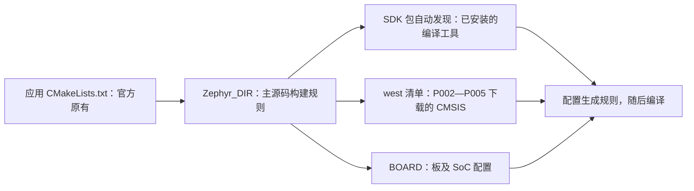
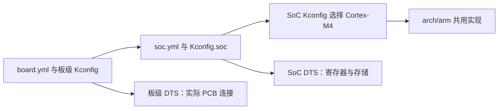
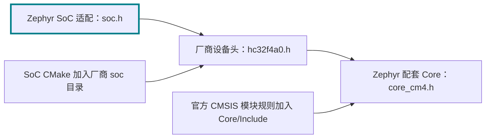
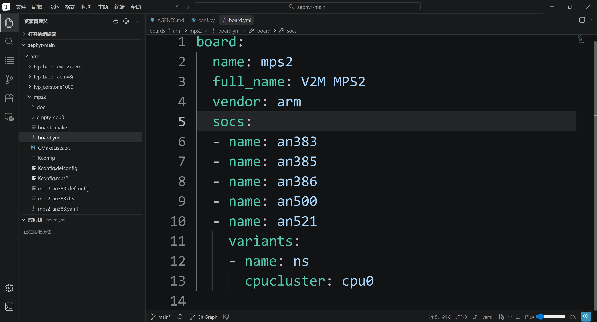

<!-- SPDX-License-Identifier: Apache-2.0 -->

# 第11章\_编译示例与新增开发板

章节已顺延为 P011。命令中的 `build/learning-tools/p003` 与 `labs/p003` 是此前确定的实验目录标识，继续复用，不表示本文编号，也不需要因资料改名而移动实验产物。

**复制命令：** [按小节打开完整操作单元](commands/P011_Windows/README.md)。PPT 的“完整命令”链接指向同一份纯文本；请连同注释复制，先读本节前提，再执行所选路线。

P002—P005 已备齐主机工具、所选 SDK 或独立工具链、Python 包、CMSIS 和 HC32 HAL。P007—P010 已建立构建、west 与配置模型；本章用三次对照构建，逐文件理解新增板和新增芯片的区别。所有实验仍在 `G:\zephyr_practice\zephyr-main`，命令使用 Windows UCRT64 Bash；不需要其他工程的驱动或构建脚本。


同一个 `samples/hello_world` 按三次递进实验使用。**第一遍只编译已有板；第二遍只新增板身份，复用已有 SoC；第三遍同时新增真实 SoC、板卡和驱动连接。** 前两遍没有用到 HC32 HAL，也不能把 AN386 固件烧进 HC32。

| 实验 | BOARD | 前提及新增范围 | 结束时检查 |
| --- | --- | --- | --- |
| A 已有板 | mps2/an386 | 官方已经提供 board、SoC 和驱动 | hello_world 生成 Arm ELF，配置确实选择 AN386 |
| B 新增板 | practice_mps2/an386 | 自己逐个创建板文件，保留 AN386 SoC | 新板可发现，BOARD 改变而 SOC 不变 |
| C 新增芯片与板 | uyup_rpi_a/hc32f4a0pitb | 分层加入 HC32 身份、内存、启动、驱动与 PCB 描述 | HC32 ELF、12 MHz 时钟配置、HAL 路径均可反查 |

配套 [P011 PPT](slides/P011_编译示例与新增开发板_Windows.pptx)按这些实验推进；完整命令和输出判断以本文为主。上一篇：[P010 缓存与构建排错](P010_CMake缓存与构建排错_Windows.md)；准备材料：[P002—P005 环境与依赖](环境与依赖导航.md)；返回[大纲](大纲.md)。

| 正文 | PPT 阶段 | Markdown 继续展开 |
| --- | --- | --- |
| 11.1—11.3 | 第 4—17 页：认识并编译已有板 | 完整配置命令、文件证据、失败定位 |
| 11.4 | 第 18—27 页：与原板逐文件对照 | YAML/Kconfig/DTS/defconfig 的完整新增步骤 |
| 11.5—11.7 | 第 28—46 页：为 HC32 新增芯片和板支持 | 五个接入阶段、文件来源、每步可检查结果 |
| 11.8—11.9 | 第 47—52 页：核验结果与工程用户预设 | 产物反查、缓存优先级、完整 CMakeUserPresets 文件 |

导航：[认识示例](#section-11-1) · [编译](#section-11-2) · [核验](#section-11-3) · [新增练习板](#section-11-4) · [HC32 对照](#section-11-5) · [逐层接入](#section-11-6) · [HC32 编译](#section-11-7) · [验收](#section-11-8) · [CMake 查阅](#section-11-9)。


### 11.0.1\_开始前把官方文件、配套材料和实验产物分开

打开原生 Zephyr 后能找到 MPS2，却找不到本章的练习板，是正确的起点。我们正要通过新增文件改变这种状态。下面的表同时告诉你哪些文件应该先查到，哪些必须做完某个动作才出现。

| 对象 | 来源与状态 | 操作责任 |
| --- | --- | --- |
| `samples/hello_world`、`boards/arm/mps2`、`soc/arm/mps2` | 当前官方 Zephyr 原有 | 阅读和作为对照，不从本教程新建 |
| `../modules/hal/cmsis_6`、`build/learning-tools/deps/hal_xhsc` | P002—P005 分别通过 west 与固定 Git 修订取得 | 本章只接入，不假定 Zephyr ZIP 自带 |
| `learning/board/labs/hc32_port` | 随本系列资料提供的适配参考原件 | 先取得配套 learning；官方 Zephyr ZIP 没有它 |
| `build/learning-tools/p003/new-board` | 11.4 读者逐文件创建的练习材料 | 新建 YAML/Kconfig，复制同修订 DTS 并改名 |
| `build/learning-tools/p003/hc32_port` | 11.6 从配套原件逐组加入的工作副本 | 阅读后复制/修改，不冒称上游官方支持 |
| `build-mps2-sdk-auto`、`build-practice-sdk-auto`、`build-hc32-sdk-auto` 下的缓存、规则、ELF | CMake/Ninja 在本章生成 | 运行前无这些文件是正常的，不手写产物 |

如果拿到的只有官方 Zephyr ZIP，先把随教程发布的完整 `learning` 目录放在当前实验源码根，再检查 `learning/board/labs/hc32_port/README.md` 和 `zephyr/module.yml`。缺配套资料时仍能完成 A 和 B，C 要先补齐材料；不要在资源管理器里靠新建同名空目录假装已准备完成。新增材料遵循官方硬件模型和接口，**遵循官方样式不等于已经被上游收录**。

每次出现“加入文件”时，下文都会说明源端和目标端。`cp` 的源端是已存在的参考文件，目标端是本次创建的工作材料；构建时只使用工作副本。这使你可以修改工作副本并和原件比较，知道差异来自自己的哪一步。

<a id="section-11-1"></a>

## 11.1\_先认识已有的 MPS2 与 AN386

MPS2 是 Arm 的 FPGA 原型开发板平台；AN386 是运行 Cortex-M4 系统的 FPGA 镜像/系统配置，Zephyr 将它登记为 SoC 限定名 `an386`。它不是一颗与 HC32 引脚兼容的单片机。选择它，是因为当前官方源码已有完整支持，可以先检查下载的工具和 CMSIS，不把环境错误与新芯片移植错误混在一起。

本次源码的 `mps2_an386.dts` 和 `mps2_base.dtsi` 描述 Cortex-M4F、25 MHz 时基、4 MiB SRAM（0x20000000 起）、4 MiB flash 节点（0 起），控制台为 CMSDK UART0，另有 LED、按钮、定时器等节点。这里的 flash 是该目标的设备树映射名称，不是 HC32 片内 Flash 参数。`hello_world` 只需控制台等基础能力，并不逐一测试全部外设。[官方 MPS2 说明](https://docs.zephyrproject.org/latest/boards/arm/mps2/doc/mps2_armv7m.html)

| 要认识的对象 | 当前源码根中的位置 | 阅读重点 |
| --- | --- | --- |
| 板名和可选 SoC | boards/arm/mps2/board.yml | name=mps2、vendor=arm、socs 包含 an386 |
| 板到芯片的选择 | boards/arm/mps2/Kconfig.mps2 | BOARD_MPS2_AN386 时选择 SOC_AN386 |
| 内核能力 | soc/arm/mps2/Kconfig | SOC_AN386 选择 Cortex-M4 与相应能力 |
| 硬件描述 | mps2_an386.dts、mps2_base.dtsi | CPU、内存、chosen 控制台、外设地址 |
| 默认软件功能 | mps2_an386_defconfig | SERIAL、CONSOLE、UART_CONSOLE |
| 应用 | samples/hello_world/src/main.c | 使用 printk 输出 Hello World 和配置板名 |

先阅读这些入口：

```bash
# UCRT64；源码根；尚未配置构建。
cd /g/zephyr_practice/zephyr-main
cat boards/arm/mps2/board.yml
cat boards/arm/mps2/mps2_an386.dts
cat boards/arm/mps2/mps2_an386_defconfig
cat samples/hello_world/src/main.c
```

`BOARD=mps2/an386` 是“板名/SoC 限定名”，不是一个名为 `boards/mps2/an386` 的目录。此阶段不要求购买 MPS2，不进行烧录；编译得到 ELF 并不等于看到了终端输出。只有使用匹配的板或另行配置支持该目标的模拟器后才能运行。

<a id="section-11-2"></a>

## 11.2\_用已经准备好的输入编译 hello_world


### 11.2.1\_恢复环境并检查输入

主线实验保持在源码根，P003 3.2.6 的 SDK 包注册已完成且目录有效。本节激活 Python 并选择 G 盘源码；**不 export 工具链类型或 SDK 根**，让 CMake 使用默认 SDK 发现。`ZEPHYR_BASE` 仍是 Zephyr 原生源码接口；`PWD` 是 Bash 当前位置，`cygpath -m` 将其转换为 Windows 工具使用的路径。

```bash
# UCRT64；源码根；重开终端时重新执行本块。
cd /g/zephyr_practice/zephyr-main
source .venv/Scripts/activate
export ZEPHYR_BASE="$(cygpath -m "$PWD")"
unset ZEPHYR_MODULES EXTRA_ZEPHYR_MODULES ZEPHYR_EXTRA_MODULES
python -m pip check
```

若此前在同一终端试过其他工具链或手动固定过 SDK，才执行下面的恢复块；新开的干净终端可跳过。`unset` 只取消当前 Bash 的输入，不删除 SDK 或用户包注册记录，也不清除旧 CMake 缓存。因此本章使用新的 `-sdk-auto` 构建目录，避免把旧缓存命中当成自动发现成功。

```bash
# UCRT64；源码根；仅恢复此前手动选择过工具链的终端。
unset ZEPHYR_TOOLCHAIN_VARIANT ZEPHYR_SDK_INSTALL_DIR
unset CROSS_COMPILE CROSS_COMPILE_TOOLCHAIN_PATH TOOLCHAIN_ROOT
```

下面只检查已有文件和 Python；`cat` 中的安装位置不是传给 CMake 的 SDK 参数。实际采用哪套 SDK 要看下一节配置输出和缓存。文件不在此处时先按实际安装位置核验，不创建空文件。

```bash
# UCRT64；源码根；检查已安装文件；实际选中的 SDK 要在配置后核验。
cat ../zephyr-sdk-1.0.1/sdk_version
test -f ../modules/hal/cmsis_6/CMSIS/Core/Include/core_cm4.h
test -f ../modules/hal/cmsis_6/zephyr/module.yml
python -c 'import sys; print(sys.executable)'
```

失败则返回 P002—P005 对应安装/下载环节。先运行 `west topdir`、`west list cmsis_6`，确认仍使用 P002—P005 建立的工作区；Git for Windows 的 PATH 检查见 P002—P005 的 2.1.1。CMSIS 由 west 管理，下面不再手填其路径。

### 11.2.2\_配置，再执行构建

先把“让工程看到材料”理解为三条不同的连接。应用的 `find_package(Zephyr)` 通过 `Zephyr_DIR` 找到主源码包入口；SDK 包注册让 CMake 自动发现兼容的工具包；west 工作区让模块解析器找到外部源码的 module.yml。三者分别处理工程规则、工具程序和源码依赖，任何一个成功都不能代替另外两个。



正常工作区中，Zephyr 的 CMake 逻辑通过 west 发现已下载模块，本章直接调用 `cmake` 也能使用它，不需要换成 `west build`。不设置 `ZEPHYR_MODULES`，避免替换官方候选列表。后面的 HC32 实验才用 `EXTRA_ZEPHYR_MODULES` 追加清单以外的 HAL 和适配模块。

下面位置仍为源码根；`ZEPHYR_BASE` 来自 11.2.1，SDK 的类型和安装根不作为命令输入。首次使用 `build-mps2-sdk-auto`，与之前手动固定 SDK 的构建目录区分。后续练习板和 HC32 也各用独立的新目录。

```bash
# Windows UCRT64；源码根；11.2.1 源码环境已准备；SDK 已注册，使用新构建目录。
cmake -S samples/hello_world -B build/learning-tools/p003/build-mps2-sdk-auto -G Ninja \
  -DBOARD=mps2/an386 \
  "-DZephyr_DIR=$ZEPHYR_BASE/share/zephyr-package/cmake" \
  "-DZEPHYR_BASE=$ZEPHYR_BASE" \
  -DEXTRA_ZEPHYR_MODULES= -DZEPHYR_EXTRA_MODULES= \
  "-DPython3_EXECUTABLE=$(cygpath -m "$(command -v python)")" \
  -DCMAKE_EXPORT_COMPILE_COMMANDS=ON
```


`-S` 选择已有应用，`-B` 指定本次独立构建目录，`-G Ninja` 选择构建执行器，`BOARD` 指定目标。`Zephyr_DIR` 是 CMake 标准包目录提示，指向 Zephyr 包入口；`Python3_EXECUTABLE` 选择刚激活的 Windows venv。这些 -D 值保存到本条 -B 目录的 CMakeCache.txt；后续 cmake --build 使用这些输入和自动发现后保存的 SDK 选择，不必 export SDK。它不影响其他 -B 目录，也不是 Windows 用户全局设置。清理 build 后可通过 11.9.5 的工程用户预设恢复，内部优先级见 11.9.2。

未传 SDK 参数时，通常会看到 `ZEPHYR_TOOLCHAIN_VARIANT not set, trying to locate Zephyr SDK`，随后 `Found toolchain: zephyr ...` 给出实际版本与路径。前一句是默认发现提示，不是缺少配置的报错。找不到 SDK 时停止，返回 P003 3.2.6 检查当前用户的包记录与实际目录；确实需要固定某套 SDK，才采用 P003 3.2.5 的可选覆盖，不把重复设置所有变量当排错步骤。

配置输出应能确认 `Board: mps2`、`qualifiers: an386`、当前源码和预期 SDK；最后生成构建规则。然后才运行编译与链接：

```bash
# UCRT64；源码根；上一条配置已成功。
cmake --build build/learning-tools/p003/build-mps2-sdk-auto
ls -l build/learning-tools/p003/build-mps2-sdk-auto/zephyr/zephyr.elf
```

`zephyr.elf` 存在并且构建命令成功退出，才说明完成了此次编译。只看到 CMake 配置结束不能算编译成功。P011 后面的实验分别使用 build-practice-sdk-auto 与 build-hc32-sdk-auto，不复用此目录换板。


<a id="standalone-toolchain"></a>

### 11.2.3\_替代路线：直接使用独立 ARM 工具链

如果你下载的是 `toolchain_gnu_windows-x86_64_arm-zephyr-eabi.7z`，且想保持其独立目录，不组装 SDK，选本节替代 11.2.1—11.2.2 的 SDK 设置与构建。仍使用 11.1 已介绍的官方 `mps2/an386` 与 `samples/hello_world`，不提前依赖 HC32 新增适配。三种包的准备和工程接入差异见 [P003 3.4.2](P003_SDK准备与编译器选型_Windows.md#standalone-toolchain)。已经走通 SDK 主线的读者无需再做一遍。

前提是 P002 的 Windows CMake、Ninja、DTC、Python/venv 已就绪，P004 的 west 工作区与 CMSIS 已下载。工具链应保持在本机已解压的 `G:\zephyr_practice\arm-zephyr-eabi`，而非放进源码目录。以下路径适用于该实际位置；其他位置必须同时改编译器前缀和工具链根。源码、板、CMSIS 和 GCC 都是已有输入，下面只生成一个新的构建目录。

整个块可直接复制，或打开[配置命令文件](commands/P011_Windows/11.2.3-01.txt)。unset 取消当前 UCRT64 的 SDK 和模块路径输入，不删除已安装 SDK 或旧构建；后续构建保持在该终端，回到 SDK 主线时按 11.2.1 重新设置。使用独立的 `-B` 目录，避免旧 SDK 缓存干扰；若该目录曾用于其他工具链，改用另一个新的目录并同步后续路径，不覆盖混用。

```bash
# Windows UCRT64；源码根；已完成 P002 主机工具/Python 与 P004 CMSIS 下载。
cd /g/zephyr_practice/zephyr-main &&
source .venv/Scripts/activate &&
# 清理当前 UCRT64 的旧 SDK/模块输入；回到 SDK 主线时重新执行 11.2.1。
unset ZEPHYR_SDK_INSTALL_DIR ZEPHYR_TOOLCHAIN_VARIANT
unset CROSS_COMPILE CROSS_COMPILE_TOOLCHAIN_PATH
unset ZEPHYR_MODULES EXTRA_ZEPHYR_MODULES ZEPHYR_EXTRA_MODULES
test -f ../modules/hal/cmsis_6/zephyr/module.yml &&
test -f ../modules/hal/cmsis_6/CMSIS/Core/Include/core_cm4.h &&
../arm-zephyr-eabi/bin/arm-zephyr-eabi-gcc.exe --version &&
# 新构建目录不得混用之前 SDK 路线的 CMakeCache。
cmake -S samples/hello_world -B build/learning-tools/p003/build-mps2-cross-compile-layout2 -G Ninja \
  -DBOARD=mps2/an386 \
  "-DZephyr_DIR=$(cygpath -m "$PWD/share/zephyr-package/cmake")" \
  "-DZEPHYR_BASE=$(cygpath -m "$PWD")" \
  -DZEPHYR_TOOLCHAIN_VARIANT=cross-compile \
  -DCROSS_COMPILE=G:/zephyr_practice/arm-zephyr-eabi/bin/arm-zephyr-eabi- \
  -DCROSS_COMPILE_TOOLCHAIN_PATH=G:/zephyr_practice/arm-zephyr-eabi \
  "-DPython3_EXECUTABLE=$(cygpath -m "$(command -v python)")" \
  -DCMAKE_EXPORT_COMPILE_COMMANDS=ON
```

`ZEPHYR_TOOLCHAIN_VARIANT=cross-compile` 选择 Zephyr 源码内的适配规则。`CROSS_COMPILE` 指向 `bin` 下程序的共同前缀，结尾横线后由规则拼接 gcc 等名称；`CROSS_COMPILE_TOOLCHAIN_PATH` 指工具链根，让当前源码探测其 C 库头。它们由 `-D` 保存到此构建目录，不要求工具链携带 SDK 的 CMake 文件。`Zephyr_DIR` 仍负责找到 Zephyr 源码的工程入口；`BOARD` 仍负责选择 CPU、FPU、内存和外设配置。

配置成功时应出现 `Found toolchain: cross-compile (...)`，随后找到独立目录下的 GCC 和 sysroot，并完成 `Configuring done` 与 `Generating done`。找不到编译器先检查前缀末尾与实际工具链根；如果报 SDK 包错误，先检查是否误用了旧构建缓存或残留 SDK 输入。任一步失败先停止，不执行构建。

```bash
# Windows UCRT64；源码根；11.2.3 上一块配置成功后执行。
cd /g/zephyr_practice/zephyr-main &&
cmake --build build/learning-tools/p003/build-mps2-cross-compile-layout2 &&
ls -l build/learning-tools/p003/build-mps2-cross-compile-layout2/zephyr/zephyr.elf
```

构建完成后核验：

```bash
# Windows UCRT64；源码根；11.2.3 已完成配置和构建。
cd /g/zephyr_practice/zephyr-main &&
grep -E '^(ZEPHYR_TOOLCHAIN_VARIANT|CROSS_COMPILE|CROSS_COMPILE_TOOLCHAIN_PATH|CMAKE_C_COMPILER|SYSROOT_DIR):' \
  build/learning-tools/p003/build-mps2-cross-compile-layout2/CMakeCache.txt
# 此独立路线不应出现 SDK 根记录；无匹配时 grep 返回 1 是这里的预期。
grep '^ZEPHYR_SDK_INSTALL_DIR:' build/learning-tools/p003/build-mps2-cross-compile-layout2/CMakeCache.txt
# 继续核验板与 CPU，实际参数在 compile_commands.json。
grep -E '^CONFIG_(BOARD|SOC|CPU_CORTEX_M4|FPU|PICOLIBC)' \
  build/learning-tools/p003/build-mps2-cross-compile-layout2/zephyr/.config
```

还要打开 `build/learning-tools/p003/build-mps2-cross-compile-layout2/compile_commands.json`，确认命令使用独立目录的 `arm-zephyr-eabi-gcc.exe`，并包含当前 AN386 配置所需的 `-mcpu=cortex-m4`、`-mthumb` 与浮点选项。2026-10-06 本机该例完成 134 个构建步骤并生成 ELF；CPU/FPU 与 CMSIS 的来源仍由本次配置决定，不能只凭 GCC 的版本输出判断。

本节没有使用 SDK 根，配置缓存中也不应有 `ZEPHYR_SDK_INSTALL_DIR`；`CMAKE_C_COMPILER`、`SYSROOT_DIR` 应落在独立 ARM 目录内。`SYSROOT_DIR` 是本次 Zephyr 配置探测的结果，无须照输出手建目标库。这里实测为 `arm-zephyr-eabi/arm-zephyr-eabi`，不要因为重复目录名就删掉一层。

后面的 11.3 如用于本路线核验，将构建目录换成本节的 `build-mps2-cross-compile-layout2`；11.4 之后继续 SDK 主线时回到 11.2.1，按需取消此前的工具链环境输入，并使用 SDK 主线的新构建目录。本节仅验证原生示例的编译，没有下载到 HC32 板或验证运行。

<a id="section-11-3"></a>

## 11.3\_确认不是编错了板或模块

```bash
# UCRT64；源码根；build-mps2-sdk-auto 已成功。
grep -E '^CONFIG_(BOARD|SOC|CPU_CORTEX_M4|HAS_CMSIS)' \
  build/learning-tools/p003/build-mps2-sdk-auto/zephyr/.config
grep -E 'BOARD:|ZEPHYR_BASE:|ZEPHYR_SDK_INSTALL_DIR:|Python3_EXECUTABLE:' \
  build/learning-tools/p003/build-mps2-sdk-auto/CMakeCache.txt
python - <<'PY'
import json
from pathlib import Path
cmds = json.loads(Path('build/learning-tools/p003/build-mps2-sdk-auto/compile_commands.json').read_text())
cmd = next(x['command'] for x in cmds if x['file'].replace('\\', '/').endswith('/hello_world/src/main.c'))
print(cmd)
assert 'cortex-m4' in cmd
assert 'cmsis_6' in cmd.lower()
PY
```

确认 SoC 为 AN386、CPU 为 Cortex-M4，编译器路径来自所选 SDK，CMSIS include 来自 P002—P005 准备的模块。打开构建目录的 `zephyr/zephyr.dts` 核对内存和控制台；模块清单实际文件为 `zephyr_modules.txt`。实际编译命令是“用了哪个依赖”的证据，下载记录只说明“准备了哪个依赖”。

常见定位顺序：包入口失败查 `Zephyr_DIR`；SDK 查找失败查实际根层次；模块缺失回 P002—P005；目标未知查 `board.yml`/限定名；换板后报缓存不一致则用新的构建目录。现在已有一份成功基线，再增加板文件才有可比较的结果。

<a id="section-11-4"></a>

## 11.4\_逐文件新增 practice_mps2 板


这一遍保留相同应用、AN386 SoC、CMSIS 和 SDK，只新增板登记。它是理解官方硬件模型的练习，不是在冒充新芯片。文件放进 `build/learning-tools/p003/new-board`，其下的 `boards/others/practice_mps2` 遵循 `boards/<板厂>/<板目录>` 格式；`others` 表示本练习没有另一个正式板厂登记。

| 原生 MPS2 文件 | 新增文件 | 哪些改变，哪些复用 |
| --- | --- | --- |
| board.yml | board.yml | 新 name=practice_mps2、vendor=others；只列 an386 |
| Kconfig.mps2 | Kconfig.practice_mps2 | 新 BOARD_PRACTICE_MPS2；仍选择 SOC_AN386 |
| mps2_an386.dts | practice_mps2_an386.dts | 文件名随目标变化；CPU 与硬件节点复用 |
| mps2_base.dtsi、mps2-pinctrl.dtsi | 同名文件 | 保留原硬件连接与版权 |
| mps2_an386_defconfig | practice_mps2_an386_defconfig | 保留控制台及 MPS2 pinctrl 依赖的 GPIO 配置 |
| soc/arm/mps2 | 无新增 SoC 文件 | 继续使用官方 AN386 |

### 11.4.1\_先登记新板身份

下面创建的是新板，不是在编辑官方原板。`mkdir` 创建目录，`cat > 文件 <<'EOF'` 将 EOF 之间的内容写成文件；终止行 EOF 必须单独一行。board.yml 说明新板叫什么、复用哪个 SoC；Kconfig 文件把选板动作连接到已有 SOC_AN386。第一次操作前目标目录应不存在，已存在时先打开核对，避免覆盖自己的改动。

```bash
# UCRT64；源码根。首次创建；已存在则先检查，勿覆盖已有练习。
mkdir -p build/learning-tools/p003/new-board/boards/others
mkdir build/learning-tools/p003/new-board/boards/others/practice_mps2
cat > build/learning-tools/p003/new-board/boards/others/practice_mps2/board.yml <<'EOF'
# SPDX-License-Identifier: Apache-2.0
board:
  name: practice_mps2
  full_name: AN386 board registration exercise
  vendor: others
  socs:
    - name: an386
EOF
cat > build/learning-tools/p003/new-board/boards/others/practice_mps2/Kconfig.practice_mps2 <<'EOF'
# SPDX-License-Identifier: Apache-2.0
config BOARD_PRACTICE_MPS2
    select SOC_AN386
EOF
```

原板需要按限定名在多个 SoC 中选择；本练习只有 an386，所以选择关系更简单。名字必须与文件名、BOARD 参数一致。先执行发现检查：

```bash
# UCRT64；源码根。BOARD_ROOT 指包含 boards 的父目录。
python scripts/list_boards.py --board-root build/learning-tools/p003/new-board \
  --soc-root . --board practice_mps2 --cmakeformat '{NAME};{DIR};{QUALIFIERS}'
```

应列出 practice_mps2 和 an386。此时只证明身份可发现，尚未提供完整硬件描述，先不构建。

### 11.4.2\_加入硬件描述和默认配置

```bash
# UCRT64；源码根。复制当前同一修订的官方文件，保留 SPDX 和版权。
cp boards/arm/mps2/mps2_an386.dts \
  build/learning-tools/p003/new-board/boards/others/practice_mps2/practice_mps2_an386.dts
cp boards/arm/mps2/mps2_base.dtsi boards/arm/mps2/mps2-pinctrl.dtsi \
  build/learning-tools/p003/new-board/boards/others/practice_mps2/
cat > build/learning-tools/p003/new-board/boards/others/practice_mps2/practice_mps2_an386_defconfig <<'EOF'
# SPDX-License-Identifier: Apache-2.0
CONFIG_GPIO=y
CONFIG_SERIAL=y
CONFIG_CONSOLE=y
CONFIG_UART_CONSOLE=y
EOF
```

对照 DTS 的 include 链：AN386 文件引入 mps2_base，后者引用 pinctrl，因此不能只复制最外层 DTS。`chosen` 决定使用哪一个 UART，defconfig 决定启用 UART 控制台软件功能；两者都需要。另须保留 `CONFIG_GPIO=y`：当前 `drivers/pinctrl/pinctrl_arm_mps2.c` 通过 GPIO 设备设置引脚复用，删去 GPIO 会导致 `__device_dts_ord_*` 链接错误；这是复用原硬件描述时必须一并保留的驱动依赖。此练习没有编造新的 PCB，所以硬件 compatible 保留 mps2；“板登记名变了”不等于硬件设计变了。

### 11.4.3\_用同一应用验证最小增量

UCRT64、源码根；两个原生路径变量仍来自 11.2.1。相比第一次配置，只改变 BOARD、新增 BOARD_ROOT，并使用独立输出目录：

```bash
# Windows UCRT64；源码根；11.2.1 源码环境已准备；SDK 已注册，使用新构建目录。
cmake -S samples/hello_world -B build/learning-tools/p003/build-practice-sdk-auto -G Ninja \
  -DBOARD=practice_mps2/an386 \
  "-DBOARD_ROOT=$(cygpath -m "$PWD/build/learning-tools/p003/new-board")" \
  "-DZephyr_DIR=$ZEPHYR_BASE/share/zephyr-package/cmake" \
  "-DZEPHYR_BASE=$ZEPHYR_BASE" \
  -DEXTRA_ZEPHYR_MODULES= -DZEPHYR_EXTRA_MODULES= \
  "-DPython3_EXECUTABLE=$(cygpath -m "$(command -v python)")" \
  -DCMAKE_EXPORT_COMPILE_COMMANDS=ON
```

```bash
# Windows UCRT64；源码根 /g/zephyr_practice/zephyr-main；根 .venv 已激活。
cmake --build build/learning-tools/p003/build-practice-sdk-auto
grep -E '^CONFIG_(BOARD|SOC|CPU_CORTEX_M4)' \
  build/learning-tools/p003/build-practice-sdk-auto/zephyr/.config
ls -l build/learning-tools/p003/build-practice-sdk-auto/zephyr/zephyr.elf
```

预期 BOARD 改为 practice_mps2，而 SOC 仍是 an386。再将两个构建目录的 `zephyr.dts` 对照，内存和 UART 仍相同。这建立了“只新增板、不新增芯片”的完整基线。后续正式维护还应补板文档、平台测试 YAML 和适用的 runner；本练习只验证新增板登记及构建，HC32 材料包含正式元数据示例。

<a id="section-11-5"></a>
<a id="board-layout"></a>

## 11.5\_从 AN386 对照到真实 HC32

现在新增 UYUP-RPI-A-2.5 / HC32F4A0PITB。芯片和板名来自 P002—P005 的丝印/BOM/数据手册核对。它同样使用 Cortex-M4 内核，但不能复制 AN386 的外设地址、时钟或内存作为 HC32 实现。

| 层次 | MPS2 / AN386 已有实现 | HC32 实验要新增或替换 |
| --- | --- | --- |
| Arm 架构 | arch/arm 共用异常、上下文等 | 继续复用，不复制一个 uyup 架构 |
| SoC 身份 | soc/arm/mps2，SOC_AN386 | soc/xhsc/hc32f4a0，SOC_HC32F4A0PITB |
| 存储和时钟 | DTS 的 4 MiB 映射、25 MHz 时基 | Flash 2 MiB；SRAM 0x1FFE0000 起 512 KiB；12 MHz 晶振直驱 |
| 片上外设 | CMSDK UART / MMIO GPIO | HC32 USART1 与 GPIO、对应 binding 和驱动 |
| 开发板连接 | MPS2 的 UART0、LED 节点 | PA9/PA10 USART1，PD10 蓝 LED3、PE15 绿 LED4 |
| 源码依赖 | CMSIS_6 + 原生驱动 | 相同来源的 CMSIS_6 + P002—P005 固定 HAL + 新适配 |

目录按维护对象组织：`boards/uyup/uyup_rpi_a` 属于板厂 UYUP，`soc/xhsc/hc32f4a0` 属于芯片厂商小华，`arch/arm` 供各厂商复用。`boards/arm/mps2` 中的 arm 是板厂 Arm，并非全部 Arm 板的父目录。Zephyr 自 11.7 起使用硬件模型 v2，支持一块板有多个 SoC/CPU；按 `boards/arm/cortex-m4/xhsc/uyup` 套目录不能完整表达这种关系。[官方板级指南](https://docs.zephyrproject.org/latest/hardware/porting/board_porting.html)



配套完整材料为 `learning/board/labs/hc32_port`，先将随教程取得的 learning 放在实验源码根。下一节**从空工作模块开始分组加入文件**，对照材料逐步读懂接入；不是要求读者只运行一个“复制全部”命令。驱动寄存器算法的完整实现保存在 `.c` 文件，本文讲清每层为何需要、由谁发现、何时能够验证。

<a id="section-11-6"></a>

## 11.6\_分五步加入 HC32 芯片与板级支持


工作模块为 `build/learning-tools/p003/hc32_port`，参考材料仍保留在 `learning/board/labs/hc32_port`。两者不得同时加入构建，只使用工作模块。以下全部在 **UCRT64、源码根** 执行；没有定义新的 Bash 路径缩写。

### 11.6.1\_登记模块和 SoC 身份

这次不再复用 AN386，而是让 Zephyr 首次认识 HC32 的名称和能力。先接入模块与身份，再补资源和启动实现；现在看到的 Kconfig/CMake 引用可能尚缺目标文件，是分阶段加入的中间状态。源端 `learning/board/labs/hc32_port` 为教程随附原件，目标端 `build/learning-tools/p003/hc32_port` 为本节新建工作副本。

```bash
# Windows UCRT64；源码根；随附 learning 已放入源码根。
test -f learning/board/labs/hc32_port/zephyr/module.yml
mkdir build/learning-tools/p003/hc32_port
mkdir -p build/learning-tools/p003/hc32_port/soc/xhsc/hc32f4a0
cp -R learning/board/labs/hc32_port/zephyr build/learning-tools/p003/hc32_port/
cp learning/board/labs/hc32_port/Kconfig learning/board/labs/hc32_port/CMakeLists.txt \
  build/learning-tools/p003/hc32_port/
cp learning/board/labs/hc32_port/soc/xhsc/hc32f4a0/{soc.yml,Kconfig.soc,Kconfig,Kconfig.defconfig} \
  build/learning-tools/p003/hc32_port/soc/xhsc/hc32f4a0/
```

这一步先登记入口；根 Kconfig/CMake 引用的驱动稍后才加入，**此时不要运行完整配置**。逐个打开并对照：

| 新增文件 | 与已有示例对应的职责 | 读者应检查的内容 |
| --- | --- | --- |
| zephyr/module.yml | 向原生构建系统提供额外搜索根 | name=hc32_port；cmake/kconfig 入口；board_root/soc_root/dts_root 都为模块内的 . |
| soc.yml | 对照 soc/arm/mps2/soc.yml | family=xhsc、series=hc32f4a0、SoC=hc32f4a0pitb |
| Kconfig.soc | 对照 MPS2 的 SoC 身份登记 | SOC_HC32F4A0PITB、SOC_SERIES_HC32F4A0、所属 family 一致 |
| SoC Kconfig | 对照 SOC_AN386 选内核 | 选择 ARM、CPU_CORTEX_M4、芯片能力，不强制应用产物格式 |
| Kconfig.defconfig | SoC 默认配置 | 早期实验系统时钟 12000000 Hz，与下一步硬件描述一致 |

### 11.6.2\_描述芯片资源，再描述 PCB 连接

```bash
# UCRT64；源码根；工作模块已由 11.6.1 创建。
cp -R learning/board/labs/hc32_port/dts build/learning-tools/p003/hc32_port/
cp -R learning/board/labs/hc32_port/boards build/learning-tools/p003/hc32_port/
cat build/learning-tools/p003/hc32_port/dts/bindings/vendor-prefixes.txt
cat build/learning-tools/p003/hc32_port/boards/uyup/uyup_rpi_a/board.yml
```

SoC 的 `dts/arm/xhsc/hc32f4a0.dtsi` 定义片上资源，型号文件 `hc32f4a0pitb.dtsi` 约束具体容量和引脚，板级 DTS 再选择控制台、LED 和实际 PCB 连线。这与 AN386 的“公共硬件描述 + 目标 DTS”对应，但数值必须来自 HC32 手册。

`dts/bindings/vendor-prefixes.txt` 同时登记 uyup 与 xhsc；这是本模块的增量前缀表，不覆盖原生完整表。UART/GPIO YAML 定义属性约定，DTS 使用 compatible 与这些绑定关联。板级 `board.yml` 关联芯片，`Kconfig.uyup_rpi_a` 选择 SoC；`*_defconfig` 默认打开已有功能，`*.yaml` 则描述 Twister 平台能力，二者不能混为一个文件。

本例实装 12 MHz 晶振，USART1 为 PA9/PA10，蓝 LED3 为 PD10。内存、ICG 和封装约束须按 P002—P005 指出的 HC32F4A0 文档核对；不能复制 F460 的启动/烧录资料。完成身份登记后可查询：

```bash
# UCRT64；源码根；查询只检查发现关系，不编译驱动。
python scripts/list_boards.py --board-root build/learning-tools/p003/hc32_port \
  --soc-root build/learning-tools/p003/hc32_port \
  --board uyup_rpi_a --cmakeformat '{NAME};{DIR};{QUALIFIERS}'
```

预期出现 `uyup_rpi_a` 和 `hc32f4a0pitb`。此时身份可发现，但仍缺启动与驱动源文件，不把这一结果称为移植完成。

### 11.6.3\_接入复位、时钟和链接布局

```bash
# UCRT64；源码根；保留原 SPDX 和版权。
cp learning/board/labs/hc32_port/soc/xhsc/hc32f4a0/{CMakeLists.txt,soc.c,soc.h,reset_hook.S,icg.ld,hc32_ll_conf.h,hc32f4xx_conf.h} \
  build/learning-tools/p003/hc32_port/soc/xhsc/hc32f4a0/
```

`reset_hook.S` 负责芯片早期入口需要的处理，`soc.c` 完成当前 12 MHz 晶振直驱初始化，`icg.ld` 放置芯片配置字；它们不是把 AN386 文件改名得到的。保留 Zephyr 的向量/复位框架，不重复链接厂商 startup。SoC CMake 使用原生生成的 `ZEPHYR_HAL_XHSC_MODULE_DIR` 引用 P002—P005 的 HAL，编译所需 system 与 DDL 源文件，并提供设备头 include；此变量由模块名产生，不需要读者 export。

HAL 仓库来源、上游申请与清单尚未收录的原因见 [P004 4.1.3](环境与依赖导航.md#hal-origin)。本系列没有启用 HAL 根 CMake 的 `CONFIG_HAS_HC32_DDL` 分支，而由这里的 SoC CMake 显式选择 DDL 源文件；模块发现与源文件选择是两个阶段，不能同时启用两条路径造成重复编译。`ZEPHYR_HAL_XHSC_MODULE_DIR` 仍是 Zephyr 根据模块名生成的原生变量，定位的就是 P002—P005 下载目录。

检查 CMake 中的 `XTAL_VALUE=12000000UL`、HAL 的 hc32f4a0 目录和链接入口，再对照 `soc.c` 的等待周期与时钟切换。此快照尚不含后续 PLL、USB/HWINFO 实验；相同板名不表示所有阶段外设能力都相同。

#### 11.6.3.1\_设备头与通用 Core 在这里接起来

先打开已经在 11.6.3 复制到工作模块的 `soc/xhsc/hc32f4a0/soc.h` 与同目录 `CMakeLists.txt`。它们是**本系列的 SoC 适配文件**，不是芯片厂商包原有的 Zephyr 文件。`soc.h` 包含 `hc32f4a0.h` 和 `system_hc32f4a0.h`；SoC CMake 把 P002—P005 下载的 HAL 中 `hc32_ddl/hc32f4a0/soc` 加到头文件路径，并按需编译 `system_hc32f4a0.c` 与 DDL。厂商设备头引用的 `core_cm4.h` 则由 Zephyr 当前 CMSIS 模块提供。



如果手中只有厂商设备包、没有现成 Zephyr 模块，先保留一份包含许可证的厂商源码，再为它写模块入口和 CMake 头文件路径，并在自己的 SoC 适配中引用设备头。**`zephyr/module.yml` 与对应 CMake/Kconfig 是移植者新增的接入文件，厂商包里找不到是正常的。** 它们不属于主源码根的官方 `west.yml`，也不能通过覆盖官方清单生成 SoC 支持。新增模块如何追加仍按 11.7 的 `EXTRA_ZEPHYR_MODULES`，通用模块写法另见 [CMake 模块专题](../cmake/P002_接入Zephyr模块.md)。

设备头的 IRQ 编号、`__FPU_PRESENT`、`__NVIC_PRIO_BITS` 等要与当前芯片及 Zephyr 配置一致。system 文件中的时钟/存储初始化须结合板上晶振审查；保留 Zephyr 的复位和向量框架，不能同时链接厂商裸机 `Reset_Handler`。本例实际有 DDL，所以按前面的已验证 CMake 源文件表接入；不能删掉 DDL 后宣称这套 HC32 驱动还能编译。若换成只有 CMSIS 设备头的其他芯片，下一节的 UART/GPIO 驱动需要自行实现寄存器操作，这属于另一项芯片移植工作。

### 11.6.4\_把 HAL 能力接成 Zephyr 驱动

```bash
# UCRT64；源码根。
cp -R learning/board/labs/hc32_port/drivers build/learning-tools/p003/hc32_port/
cat build/learning-tools/p003/hc32_port/Kconfig
cat build/learning-tools/p003/hc32_port/CMakeLists.txt
cat build/learning-tools/p003/hc32_port/drivers/serial/Kconfig.hc32
```

原生 MPS2 的 UART 是 CMSDK 驱动；HC32 的 USART 寄存器和 HAL API 不同，需要 `drivers/serial/uart_hc32.c` 提供 Zephyr UART 接口，GPIO 同理。Kconfig 决定是否启用，CMake 决定哪些 `.c` 参与构建，binding/DTS 把配置送给驱动实例，HAL 完成对应芯片寄存器操作。这些层缺一不可，不能只下载 HAL 或只新增 YAML。

本快照只声明已经实现的 GPIO 与轮询 UART，未实现的中断/DMA/USB 不登记为支持。平台 YAML、板文档和默认配置随材料一起维护；runner 尚未接入，本章不进行烧录。

### 11.6.5\_检查工作模块与配套材料是否一致

```bash
# UCRT64；源码根；完成前四步后运行，只读比较，不修改文件。
python - <<'PY'
from pathlib import Path
a = Path('learning/board/labs/hc32_port')
b = Path('build/learning-tools/p003/hc32_port')
expected = {p.relative_to(a) for p in a.rglob('*') if p.is_file() and p.name != 'README.md'}
missing = [str(p) for p in sorted(expected) if not (b/p).is_file()]
changed = [str(p) for p in sorted(expected) if (b/p).is_file() and (a/p).read_bytes() != (b/p).read_bytes()]
print('missing:', missing, 'changed:', changed)
assert not missing and not changed
PY
```

首次复现应为空列表，证明需要的文件已逐层加入。随后修改自己的板参数时，差异应能解释为芯片或 PCB 的实际变化，而不是为了让目录名看起来一致。

<a id="section-11-7"></a>

<a id="hc32-build"></a>

## 11.7\_编译所选 HC32 板的同一个应用

配置命令中 `EXTRA_ZEPHYR_MODULES` 是把 HAL 与适配模块的路径交给 Zephyr 的输入。应用先通过 find_package(Zephyr) 加载构建规则，Zephyr 才调用自己的模块发现脚本读取这些目录，最后生成原生模块路径变量。完整调用链见 [P005](P005_源码模块接入Zephyr工程_Windows.md#module-entry)。

现在才能配置完整 HC32。环境仍沿用 **11.2.1 的三个 Zephyr 原生变量**；位置为 UCRT64 源码根。与 AN386 相比，BOARD 变了，模块增加 P002—P005 的 HAL 与刚完成的工作模块；模块入口自动增加 board/soc/dts 搜索根，无须另传这三个 ROOT。

```bash
# Windows UCRT64；源码根；11.2.1 源码环境已准备；SDK 已注册，使用新构建目录。
cmake -S samples/hello_world -B build/learning-tools/p003/build-hc32-sdk-auto -G Ninja \
  -DBOARD=uyup_rpi_a/hc32f4a0pitb \
  "-DZephyr_DIR=$ZEPHYR_BASE/share/zephyr-package/cmake" \
  "-DZEPHYR_BASE=$ZEPHYR_BASE" \
  "-DEXTRA_ZEPHYR_MODULES=$(cygpath -m "$PWD/build/learning-tools/deps/hal_xhsc");$(cygpath -m "$PWD/build/learning-tools/p003/hc32_port")" \
  -DZEPHYR_EXTRA_MODULES= \
  "-DPython3_EXECUTABLE=$(cygpath -m "$(command -v python)")" \
  -DCMAKE_EXPORT_COMPILE_COMMANDS=ON
```

```bash
# UCRT64；源码根；配置成功后。
cmake --build build/learning-tools/p003/build-hc32-sdk-auto
ls -l build/learning-tools/p003/build-hc32-sdk-auto/zephyr/zephyr.elf
```

如果提示缺 HC32 HAL，先核对 P002—P005 的模块下载路径及 module.yml 名称；如果 SoC 未知，检查新模块的 soc.yml/Kconfig.soc 和搜索根；如果链接/驱动符号缺失，检查 11.6.3—11.6.4 的源文件接入，不用再次改板名“碰运气”。

<a id="hc32-firmware-formats"></a>

### 11.7.1\_本次 HC32 同时生成 ELF、HEX 和 BIN

本章使用的教程适配原件 `learning/board/labs/hc32_port/boards/uyup/uyup_rpi_a/uyup_rpi_a_hc32f4a0pitb_defconfig` 已有 `CONFIG_BUILD_OUTPUT_HEX=y`。11.6 将它复制到工作模块的同名板目录；BIN 使用 Zephyr 的默认开启值。因此，按本章原样完成配置与构建时，会有 **`zephyr.elf`、`zephyr.hex`、`zephyr.bin` 三种产物**。格式由构建配置决定，HC32F4A0 芯片本身不规定只能用 HEX 或 BIN。

```bash
# Windows UCRT64；源码根；11.7 的 HC32 构建已成功。
cd /g/zephyr_practice/zephyr-main
grep -E '^CONFIG_BUILD_OUTPUT_(HEX|BIN)=' \
  build/learning-tools/p003/build-hc32-sdk-auto/zephyr/.config
find build/learning-tools/p003/build-hc32-sdk-auto/zephyr -maxdepth 1 \
  \( -name 'zephyr.elf' -o -name 'zephyr.hex' -o -name 'zephyr.bin' \) -print
```

预期两项配置均为 `y`，并列出三个文件；不一致时先核对本次构建目录及实际采用的板/应用配置。[完整检查命令](commands/P011_Windows/firmware-formats.txt)。ELF 是链接产物，HEX 包含地址记录，BIN 不携带加载地址，详细区别见 [P007](P007_Zephyr应用构建_Windows.md#firmware-formats)。

**生成 HEX 与具备烧录入口是两个阶段。** 本章适配快照尚未接入 runner，所以本节只核对产物。后续正式接入 pyOCD runner 后，当前 Zephyr 的 `scripts/west_commands/runners/pyocd.py` 中 `flash()` 按 **HEX → BIN → ELF** 选择存在的文件；三者都有时，普通 `west flash` 优先使用 HEX。源码调试则由 GDB 读取 ELF。实际选择还应核对该构建生成的 `zephyr/runners.yaml` 与烧录日志，不能仅凭文件存在推断已经下载或运行。

<a id="section-11-8"></a>

## 11.8\_按阶段验收，留下可以解释的结果


```bash
# UCRT64；源码根；HC32 构建已成功。
grep -E '^CONFIG_(BOARD|SOC|CPU_CORTEX_M4|CPU_HAS_FPU|HAS_CMSIS|SYS_CLOCK_HW_CYCLES_PER_SEC)' \
  build/learning-tools/p003/build-hc32-sdk-auto/zephyr/.config
cat build/learning-tools/p003/build-hc32-sdk-auto/zephyr_modules.txt
grep -F 'hc32f4a0' build/learning-tools/p003/build-hc32-sdk-auto/compile_commands.json
```

| 检查结果 | 已有 MPS2 | 新增练习板 | 新增 HC32 |
| --- | --- | --- | --- |
| BOARD | mps2 | practice_mps2 | uyup_rpi_a |
| SoC | an386 | an386 | hc32f4a0pitb |
| CMSIS | 当前清单固定模块 | 与左侧相同 | 与左侧相同来源 |
| 额外 HAL | 无 HC32 HAL | 无 HC32 HAL | 固定 hal_xhsc，被实际编译引用 |
| 硬件描述 | 原生 MPS2 | 同一 MPS2 硬件 | HC32 存储、12 MHz、USART1 与 PCB 引脚 |

最后在 HC32 的 `zephyr.dts` 核对 Flash/SRAM 和 chosen，在 `compile_commands.json` 核对 SDK 编译器、CMSIS Core include 和 HC32 DDL 源文件。ELF/HEX 生成表示构建通过；镜像布局审计、下载回读、启动和外设实测是后续独立关卡，不能由编译成功推断。本章止于构建验收，烧录与外设实验在后续阶段分别完成。

正式迁入源码树时，按官方目录合并 board、soc、dts 和驱动入口，厂商前缀按原表排序增补；撤销同名模块注册，避免两个搜索根同时定义同一目标。遵循官方格式不等于上游已收录。

<a id="section-11-9"></a>

## 11.9\_完成实验后查阅 CMake 的输入与派生过程

本节供第一次构建成功后复盘或排错，不是开始实验前必须掌握的前置知识。下面保留原有源码机制说明，涉及具体示例时以 11.2 的完整命令和路径为准。

### 11.9.1\_回顾接口，再核对本次输入

输入通道、缓存优先级与接口组合统一在 [CMake 接口体系](P010_CMake缓存与构建排错_Windows.md#input-lifetime) 讲解。本章不重复通用变量教程；回到本次实验，只检查：应用是否加载 G 盘源码、SDK 是否按预期发现、BOARD 是否正确、模块记录是否包含实际需要的 CMSIS/HAL。

### 11.9.2\_本次构建选错工具时如何返回

先检查本次 CMakeCache，而非仅查看终端 export。若曾在同一终端显式选择其他工具链，按 11.2.1 的条件恢复块取消旧输入；更换工具组合时使用新构建目录。默认 SDK 发现失败先查 P003 的包注册与安装位置；固定 SDK 的预设属于 11.9.5 的替代路线。

### 11.9.3\_每个输入由谁约定、在什么时候使用

以下依据均来自 G 盘所核对的原生 Zephyr 修订；文件路径相对于它的源码根。变量名大小写有意义，`Zephyr_DIR` 与 `ZEPHYR_BASE` 不能互换。

| 输入 | 谁约定名称、谁提供值 | 哪一步读取，值应该指向哪里 |
| --- | --- | --- |
| `Zephyr_DIR` | CMake 的 `<PackageName>_DIR` 约定；读者用 `-D` 提供 | 应用 `find_package(Zephyr)` 查 Config 包时，指向含 `ZephyrConfig.cmake` 的 `share/zephyr-package/cmake` |
| `ZEPHYR_BASE` | Zephyr 约定；本例读者指定 | `ZephyrConfig.cmake` 进入 Zephyr 构建逻辑时选择源码根；含 VERSION、boards、cmake，而非应用目录 |
| `ZEPHYR_TOOLCHAIN_VARIANT` | Zephyr 约定；主线由默认 SDK 发现补齐 | `FindHostTools.cmake` 选择 `cmake/toolchain/zephyr/generic.cmake`；源码默认 GNU 分支，另可明确 `zephyr/gnu` |
| `ZEPHYR_SDK_INSTALL_DIR` | Zephyr/SDK 接口；主线由 SDK 包位置得到 | `FindZephyr-sdk.cmake` 查找 SDK Config 包；本例指向含 `sdk_version`、cmake、gnu 的安装根 |
| `BOARD` | Zephyr 约定；读者选择真实目标 | `boards.cmake` 查 board.yml 并解析限定名，再关联 SoC；原生演示为 `mps2/an386` |
| `ZEPHYR_MODULES` | Zephyr 的显式替换列表；本章主线不设置 | 非空时替代 west 自动模块发现；仅用于特殊环境 |
| `EXTRA_ZEPHYR_MODULES` | Zephyr 的追加列表；11.7 提供 HAL 与适配模块根 | 保留 west 发现的 CMSIS，再解析追加模块的 module.yml，不负责下载 |
| `Python3_EXECUTABLE` | CMake FindPython3 接口；读者选解释器 | Zephyr 的 `python.cmake` 优先使用已定义值，并检查最低 Python 3.12；随后形成内部 `PYTHON_EXECUTABLE` |
| `CMAKE_EXPORT_COMPILE_COMMANDS` | CMake 约定；读者设 ON | Ninja 等支持的生成器输出 `compile_commands.json`，用来核对真正编译命令 |

`Zephyr_DIR` 回答“从哪一个包入口进入”，`ZEPHYR_BASE` 回答“以哪棵源码作为基础”。本例将二者指向同一棵源码的对应层次。应用中的 `find_package(Zephyr REQUIRED HINTS $ENV{ZEPHYR_BASE})` 使用环境值作为查找提示；显式包目录与缓存也参与查找，HINTS 不等于强制覆盖所有已选路径。原生 `ZephyrConfig.cmake` 在 CMake 中尚未定义 `ZEPHYR_BASE` 时才从环境取得它，并可依据所加载包的位置推导源码。两项不一致时应纠正输入，不依赖偶然的搜索结果。

SDK 的自动发现是另一件事。不指定安装根时，`FindZephyr-sdk.cmake` 会检查默认位置、CMake 包登记等候选，并检查版本。指定安装根时，当前源码使用 `CONFIG HINTS ... NO_DEFAULT_PATH`，把查找限制到该位置，错误路径会报错。SDK 安装器的 `/c` 登记 SDK，`west zephyr-export` 登记 Zephyr 源码包；二者不是给芯片选型，也不是把工具复制进工程。本例指定源码入口，SDK 使用包注册；无需再手填 SDK 根和默认类型。

`ZEPHYR_BASE` 在 11.2.1 定义；主线的 SDK 根由配置阶段发现，不要求在终端中提前定义。正文直接使用路径和 Bash 内置的 PWD，不再要求准备多套自定义路径别名。`TOOLCHAIN_ROOT` 是 Zephyr 工具链接入脚本的根，不是 SDK 安装目录，本例无须设置。

接口分类与场景组合见 [CMake 接口体系](P010_CMake缓存与构建排错_Windows.md#interface-combinations)。下节只沿本次构建的真实调用顺序核对结果。

### 11.9.4\_按真实执行次序追到编译器

下面是原生 `zephyr_default.cmake`、`dts.cmake`、`kernel.cmake` 串起的主要路径，省略无关检查，但保留“先发现工具、后确定完整硬件配置”的次序：

```text
应用 CMakeLists.txt：find_package(Zephyr ...)
  → ZephyrConfig.cmake：选择源码，加载 zephyr_default.cmake
  → python / zephyr_module：选择 Python，载入外部模块
  → boards：解析 BOARD、板级目录和限定名
  → dts：调用 FindHostTools，先找 SDK 和通用预处理工具
  → Kconfig：结合 board、SoC、prj.conf，形成最终 CONFIG_* 配置
  → arch.cmake：set(ARCH ${CONFIG_ARCH})
  → kernel.cmake → FindTargetTools：加载工具链 target 配置
  → SDK 的 gnu/target.cmake：ARCH=arm → arm-zephyr-eabi
  → GCC target/target_arm：编译器路径、CPU/FPU/ABI 参数
  → CMake 生成 Ninja 规则 → cmake --build 运行编译与链接
```

`FindHostTools.cmake` 里的 SDK 查找发生在完整 Kconfig 处理之前，因此不能简单描述成“先得到全部芯片配置，才第一次找 SDK”。前者先得到可用工具；后者再把目标工具和 CPU 参数落实。

| 派生结果 | 谁产生它 | 是否需要读者 export |
| --- | --- | --- |
| `CONFIG_ARCH`、`CONFIG_CPU_CORTEX_M4` 等 | Kconfig 从板级、SoC 与应用配置计算 | 不需要；查看构建目录 `zephyr/.config` |
| `ARCH` | 原生 `arch.cmake` 从 CONFIG_ARCH 赋值 | 不需要；不是通过 `export ARCH=arm` 代替 BOARD |
| `CROSS_COMPILE_TARGET` | SDK GNU target.cmake 按 ARCH 查映射 | 不需要；本例为 arm-zephyr-eabi |
| `CROSS_COMPILE`、`SYSROOT_DIR` | SDK 根据安装根和目标前缀拼路径 | 不需要；前者是工具前缀，后者指向配套目标头文件/库 |
| `CMAKE_C_COMPILER` | Zephyr GCC 接入脚本查找目标编译器 | 不需要；本例由 SDK 路径派生出 gcc.exe 的完整路径 |
| `SDK_VERSION` 这个 CMake 值 | 已找到的 SDK Config 从其包版本设置 | 不需要；它显示实际找到的 SDK，别与源码根的同名文件混淆 |

最终 `-mcpu=cortex-m4`、`-mthumb` 来自 CPU 配置；是否使用 FPU、哪种浮点调用约定，由该目标最终配置决定。对照 `compile_commands.json` 才能确认实际选了什么。只运行 PATH 上的 `gcc --version`，不能证明这次 Zephyr 构建使用了它。

查源码入口：[原生默认模块顺序](https://github.com/zephyrproject-rtos/zephyr/blob/3777ab91262f93c2c2da7e1ab8cff4e8ea5f4ce4/cmake/modules/zephyr_default.cmake)、[SDK 查找](https://github.com/zephyrproject-rtos/zephyr/blob/3777ab91262f93c2c2da7e1ab8cff4e8ea5f4ce4/cmake/modules/FindZephyr-sdk.cmake)、[SDK 目标映射](https://github.com/zephyrproject-rtos/sdk-ng/blob/v1.0.1/cmake/zephyr/gnu/target.cmake)、[ARM GCC 参数](https://github.com/zephyrproject-rtos/zephyr/blob/3777ab91262f93c2c2da7e1ab8cff4e8ea5f4ce4/cmake/compiler/gcc/target_arm.cmake)。这些说明解释当前实验源码的原生构建机制；命令直接调用 CMake。




### 11.9.5\_可选：用工程用户预设固定 SDK 选择

默认 SDK 包注册也会跨终端保留，不需要为了重开终端创建预设。完成 11.2 后，只有希望固定 SDK 与其他工程参数、或删除构建目录后按同一组合恢复时，才使用应用旁的 `CMakeUserPresets.json`。本例的应用目录是 `samples/hello_world`，不是整个 Zephyr 源码根。它与该应用官方已有的 CMakeLists.txt 相邻，是下面由读者**新建的本机配置文件**。

本节是固定配置的替代路线：预设保留应用和板输入，并额外固定 SDK 根及 zephyr 类型，使主动选择不受其他工具链环境影响；不是复制 SDK，也不替换 .venv。下面保留同一个官方应用、AN386 目标与 P002—P005 模块，只换用独立输出目录 `build-mps2-preset-west`。`mps2-west-local` 是读者自定的预设名，不是 Zephyr 的 BOARD 名称。

先按实际 SDK 根修改 JSON 中的 `ZEPHYR_SDK_INSTALL_DIR`：本机当前为 `G:/zephyr_practice/zephyr-sdk-1.0.1`。其他 `${sourceDir}` 是 **CMake 预设的原生宏**，表示这个应用目录，`../..` 回到 Zephyr 根；不是需要在 Bash export 的变量。

```bash
# Windows UCRT64；源码根；已完成 P002—P005 并能按 11.2 配置官方 hello_world。
cd /g/zephyr_practice/zephyr-main
# 文件已存在时停止，不覆盖个人预设；请在已有文件中合并一个预设。
test ! -e samples/hello_world/CMakeUserPresets.json && \
cat > samples/hello_world/CMakeUserPresets.json <<'JSON'
{
  "version": 3,
  "configurePresets": [
    {
      "name": "mps2-west-local",
      "displayName": "MPS2 AN386 - local SDK",
      "generator": "Ninja",
      "binaryDir": "${sourceDir}/../../build/learning-tools/p003/build-mps2-preset-west",
      "cacheVariables": {
        "BOARD": "mps2/an386",
        "Zephyr_DIR": "${sourceDir}/../../share/zephyr-package/cmake",
        "ZEPHYR_TOOLCHAIN_VARIANT": "zephyr",
        "ZEPHYR_SDK_INSTALL_DIR": "G:/zephyr_practice/zephyr-sdk-1.0.1",
        "EXTRA_ZEPHYR_MODULES": "",
        "ZEPHYR_EXTRA_MODULES": "",
        "CMAKE_EXPORT_COMPILE_COMMANDS": "ON"
      },
      "environment": {
        "ZEPHYR_MODULES": null,
        "EXTRA_ZEPHYR_MODULES": null,
        "ZEPHYR_EXTRA_MODULES": null,
        "ZEPHYR_BASE": null
      }
    }
  ],
  "buildPresets": [
    {
      "name": "mps2-west-local",
      "configurePreset": "mps2-west-local"
    }
  ]
}
JSON
```

单引号 `JSON` 保留 `${sourceDir}` 给 CMake 展开。`cacheVariables` 对应配置时的 -D；`binaryDir` 对应 -B；`buildPresets` 让同名构建预设选择同一输出目录。Zephyr 源码通过 Zephyr_DIR 选定，由官方 Config 推导规范化的根路径。`environment` 中的 null 只对预设启动的进程取消外层 ZEPHYR_BASE、ZEPHYR_MODULES 和两个额外模块变量，防止从外层终端混入别的适配模块，不修改 Windows 全局环境。

保存文件只是准备，**只有选择预设时才应用它**。每次在新 UCRT64 中按下面执行，Python 从项目 .venv 取得，SDK 从预设取得；无需再 export SDK：

```bash
# Windows UCRT64；重新开终端也使用同一组命令。
cd /g/zephyr_practice/zephyr-main
source .venv/Scripts/activate
cd samples/hello_world
cmake --list-presets
cmake --preset mps2-west-local
cmake --build --preset mps2-west-local
```

先确认 list-presets 有 mps2-west-local，配置输出找到实际 SDK，再观察构建完成。`cmake --build --preset` 不会自动替你执行首次配置，也不会读取刚改过的 cacheVariables 重新选择编译器；改预设后先配置。核对真实缓存：

```bash
# Windows UCRT64；回到源码根；预设已经配置成功。
cd /g/zephyr_practice/zephyr-main
grep -E 'ZEPHYR_SDK_INSTALL_DIR:|Python3_EXECUTABLE:|CMAKE_C_COMPILER:' \
  build/learning-tools/p003/build-mps2-preset-west/CMakeCache.txt
```

该构建目录在关终端后保留缓存；删掉它，再执行同一 configure preset 会从应用旁的文件恢复。换 SDK 版本时，修改预设的 SDK 根，并给 `binaryDir` 一个新的输出目录再配置，避免旧编译器及探测结果残留。不要用一份既有缓存交替换工具链。

如果确实要在自有应用 CMakeLists.txt 中指定，可以在 `find_package(Zephyr)` 前添加 `set(ZEPHYR_SDK_INSTALL_DIR "实际安装根" CACHE PATH "SDK root")`；这只是在创建缓存时给默认值，不会强制覆盖已有缓存。本例使用用户预设，因此不修改官方 hello_world 的 CMakeLists.txt，也不用 FORCE 把别人传入的选择覆盖掉。

`CMakeUserPresets.json` 包含个人路径，应作为本机配置排除在版本控制之外；需要共享的参数放到可移植的 CMakePresets.json。以上持久化属于工程文件与构建缓存，和 SDK 的当前用户注册表是独立机制；`.venv` 不保存这两种配置。

前置章节：[P005 源码模块接入Zephyr工程](P005_源码模块接入Zephyr工程_Windows.md)。


上一篇：[P010](P010_CMake缓存与构建排错_Windows.md)。
