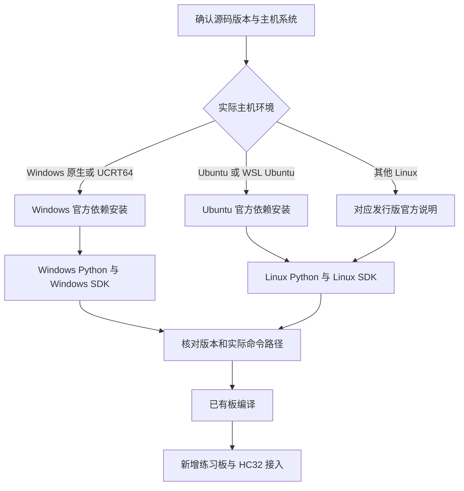

<!-- SPDX-License-Identifier: Apache-2.0 -->

# 第1章\_主机工具与官方安装来源

环境按**实际运行工具的操作系统**选择。Windows 上的 MSYS2 UCRT64 提供 Bash 和 Unix 命令习惯，仍运行 Windows 程序；Ubuntu、其他 Linux 发行版与 WSL 中的 Linux 环境走 Linux 分支。返回[专题大纲](大纲.md)。



默认使用 UCRT64 Bash，保持 Linux 命令习惯。只有 Zephyr 官方明确采用 PowerShell 的 Windows 下载/安装步骤，以及 setup.cmd 等 Windows 专用脚本和其 Windows 管理操作，才切换到 PowerShell。普通下载、摘要校验、解压、版本检查、Python/venv 与 CMake 工程操作仍用 UCRT64，不能仅因调用 Windows 可执行程序就整段改成 PowerShell。Ubuntu 22.04 使用原生 Linux Bash。每段标明终端和目录，切换时重新进入目录，临时变量不互相继承。

## 1.1\_依赖清单由哪份源码决定

先打开正在实验的 Zephyr 源码内 `doc/develop/getting_started/index.rst`，定位 **Install dependencies**。它列出最低版本，并分别给出 Windows、Ubuntu 等主机的安装步骤。2026-10-05 核对的实验源码修订为 `25c8f4a23988dd3b2cfb463613622738298c2d6c`，这份指南没有本地修改。[固定修订原文](https://github.com/zephyrproject-rtos/zephyr/blob/25c8f4a23988dd3b2cfb463613622738298c2d6c/doc/develop/getting_started/index.rst)

| 要确定的事项 | 本次依据 | 本次读到的要求 |
| --- | --- | --- |
| 主机工具与安装渠道 | `doc/develop/getting_started/index.rst` | Windows 用 winget，Ubuntu 用 apt |
| 主机主要版本下限 | 同文件的工具表 | CMake 3.28.0、Python 3.12、dtc 1.4.6 |
| 构建阶段的 Python 检查 | `cmake/modules/python.cmake` | 对照源码中的检查，不从某个 CI workflow 推断 |
| Python 包 | `scripts/requirements*.txt`、已取得模块的 requirements | 随源码和模块变化 |
| SDK 选择与兼容性 | `SDK_VERSION`、SDK 查找模块、`scripts/west_commands/sdk.py` | 从当前源码读值，再核对 SDK 官方发行说明 |

Windows 正文早先的 SDK 截图记录 `3777ab9…` 的 4.5.0-rc1 / SDK 1.0.1，它是当时的取证截图，不代表源码永远停在那个修订。主机依赖本次重新核对到上表修订；源码变更不自动构成编译验证通过。

已取得源码的读者可以直接用编辑器看文件，也可用以下只读命令。**Windows UCRT64** 先执行 `cd /g/zephyr_practice/zephyr-main`；**Linux** 先进入自己的源码根，再执行同一段 Bash：

```bash
# 当前位置：直接包含 VERSION 的 Zephyr 源码根；Bash。
cat VERSION
cat SDK_VERSION
sed -n '/.. _install-required-tools:/,/.. _get_the_code:/p' doc/develop/getting_started/index.rst
# 仅 Git 克隆有提交身份；ZIP 下载请记录来源标签、提交或下载日期。
git rev-parse HEAD
```

还没有源码时先读[官方 Getting Started](https://docs.zephyrproject.org/latest/develop/getting_started/index.html)。`latest` 随上游变化；选择发行标签时使用对应版本文档，取得源码后再核对本地原文。安装教程中粘贴的包清单只是一次有来源的快照。

## 1.2\_Windows 官方安装与 UCRT64 的衔接

在 **PowerShell 或 cmd.exe** 执行官方 Windows 原命令：

```powershell
# Windows PowerShell 或 cmd.exe；任意目录。
winget install Kitware.CMake Ninja-build.Ninja oss-winget.gperf Python.Python.3.12 Git.Git oss-winget.dtc wget 7zip.7zip
```

`winget` 不可用时用[微软入口](https://aka.ms/getwinget)安装，或按官方指南从各工具官网安装并配置 PATH。命令中的 Python ID 选择 3.12 系列，**并不保证补丁号 3.12.10**。本教程固定版本路线在 [Windows P002—P005](环境与依赖导航.md)：执行省去 Python 项的命令，再二选一使用 Python 官方图形安装器或从 UCRT64 调用同一安装器。

安装后关闭旧终端，重新启动 UCRT64。Windows 安装器把命令注册到 Windows PATH，新 Bash 才能继承这些更改。UCRT64 默认还把 `/ucrt64/bin` 和 `/usr/bin` 放在前面，同名程序可能覆盖安装器加入的版本。[MSYS2 环境说明](https://www.msys2.org/docs/environments/)

```bash
# 终端：重新打开的 UCRT64；任意目录。
type -a cmake ninja dtc gperf 7z
cmake --version
ninja --version
dtc --version
gperf --version
7z i
```

若命令缺失或选错版本，先在 Windows 安装记录中找到实际安装目录。在 PowerShell 的 `where.exe cmake`、`where.exe ninja` 等输出可帮助核对。以下操作用于临时加入一个**已经确认含所需 exe 的目录**，例如 CMake 的 `bin` 或 7-Zip 安装目录，不能把整条 exe 文件路径放进 PATH：

变量提示：以下名称均为**教程自定义的临时 Bash 变量，不是 Zephyr 或 CMake 原生接口**。

- `TOOL_DIR_WIN`：定义见 1.2 Windows 官方安装与 UCRT64 的衔接；读者输入的工具 exe 所在 Windows 目录。
- `TOOL_DIR`：定义见 1.2 Windows 官方安装与 UCRT64 的衔接；转换后的 Bash 工具目录。

```bash
# 终端：UCRT64；按提示粘贴资源管理器的 Windows 目录，不含外层引号。
read -r -p '工具可执行文件所在 Windows 目录：' TOOL_DIR_WIN
TOOL_DIR="$(cygpath -u "$TOOL_DIR_WIN")"
test -d "$TOOL_DIR" && export PATH="$TOOL_DIR:$PATH"
hash -r
type -a cmake ninja dtc gperf 7z
```

这个设置只影响当前终端。需要长期使用时把核对后的目录加入 Windows 用户 PATH，再重开 UCRT64。Python 的基础解释器选择、`py` 与 `python` 差异、`.venv/Scripts/activate` 见 Windows P002—P005。pacman 仍用于 MSYS2 自身更新和 Bash 配套工具，但本教程不再用它另列一套 Zephyr 主机依赖。

## 1.3\_Linux 官方安装与目录

本教程以 **Ubuntu 22.04 LTS（Jammy）** 为目标。当前 Zephyr 快速开始的示例起点为 24.04 及以后；22.04 需核对工具下限，并按 Kitware 官方 Jammy 源补齐 CMake、按 Python 官方源码构建教程所用 3.12.10，再创建 Linux venv。这是基于官方工具来源的教程适配。完整步骤、源码与 SDK 安装集中在 [Linux P001](P001_官方环境安装与源码准备_Linux.md)。其他发行版先查[官方 Linux Host Dependencies](https://docs.zephyrproject.org/latest/develop/getting_started/installation_linux.html)。apt 清单不能直接作为所有 Linux 发行版的通用命令。

| 对照项 | Windows UCRT64 | Linux Bash |
| --- | --- | --- |
| 本教程源码位置 | `/g/zephyr_practice/zephyr-main` | Linux 分支采用 `~/zephyrproject/zephyr` |
| Windows 资源管理器写法 | `G:\zephyr_practice\zephyr-main` | 不适用 |
| 虚拟环境激活 | 源码根 `.venv/Scripts/activate` | Linux 示例工作区 `.venv/bin/activate` |
| SDK 主机包 | Windows 包 | 与 Linux 主机架构匹配的包 |
| 手工 SDK 安装入口 | `setup.cmd` | `setup.sh`，或官方 `west sdk install` |
| 路径转换 | Windows 程序按需使用 `cygpath` | 原生路径，不使用 `cygpath` |

Linux 示例采用官方工作区布局以便直接对照上游，和 Windows 教程“源码根 `.venv`”布局不同；两种 `.venv` 不共享、不复制。P011 的构建输入、已有板与新增板概念共用，但其中现有命令标注为 Windows UCRT64 实验，Linux 环境准备完成不等于这些命令已经在 Linux 上验证。

## 1.4\_源码更新后如何保持依据一致


每次更新后重新阅读本地指南对应系统分支，以及 `SDK_VERSION`、Python requirements 和模块清单。包管理器“已是最新”不意味着一定符合所选 Zephyr 修订。`west==1.5.0` 与 Windows Python 3.12.10 是教程选择；新源码不兼容时应调整基线并重新验证，不能跳过依赖冲突。

完整 west 工作区可按当前官方指南使用 `west packages` 汇集源码和模块的 Python requirements；本教程 Windows 最小实验的 `requirements-base.txt` 只覆盖基础依赖，不能声称覆盖全部模块和开发工具。`west sdk install` 依据当前源码选择 SDK，离线手工下载时也须对照同一依据。这里规定**查证和安装顺序**，不实现 Git 历史合并、驱动同步或材料同步脚本。
