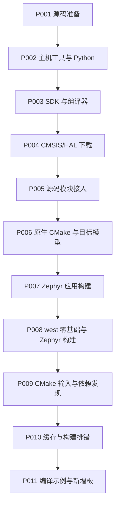

<!-- SPDX-License-Identifier: Apache-2.0 -->

# 第1章\_Zephyr从准备到构建

先把源码、工具、SDK 和源码依赖准备齐，再进入构建。CMake 从普通 C 程序起步，然后解释 Zephyr 应用；west 单独从工作区基础讲到 Zephyr 扩展及 CMake 调用。接口发现与缓存按各自问题另成册，新增板实验最后进行。

| 顺序 | 完整 Markdown | 精讲 PPT | 页数 |
| --- | --- | --- | --- |
| P001 | [准备UCRT64环境与下载Zephyr](P001_准备UCRT64环境与下载Zephyr_Windows.md) | [PPT](slides/P001_准备UCRT64环境与下载Zephyr_Windows.pptx) | 41 |
| P002 | [主机工具与Python环境](P002_主机工具与Python环境_Windows.md) | [PPT](slides/P002_主机工具与Python环境_Windows.pptx) | 16 |
| P003 | [SDK准备与编译器选型](P003_SDK准备与编译器选型_Windows.md) | [PPT](slides/P003_SDK准备与编译器选型_Windows.pptx) | 45 |
| P004 | [CMSIS与HAL选择下载](P004_CMSIS与HAL选择下载_Windows.md) | [PPT](slides/P004_CMSIS与HAL选择下载_Windows.pptx) | 22 |
| P005 | [源码模块接入Zephyr工程](P005_源码模块接入Zephyr工程_Windows.md) | [PPT](slides/P005_源码模块接入Zephyr工程_Windows.pptx) | 14 |
| P006 | [原生CMake与目标模型](P006_原生CMake与目标模型_Windows.md) | [PPT](slides/P006_原生CMake与目标模型_Windows.pptx) | 22 |
| P007 | [Zephyr应用构建](P007_Zephyr应用构建_Windows.md) | [PPT](slides/P007_Zephyr应用构建_Windows.pptx) | 17 |
| P008 | [west零基础与Zephyr构建](P008_west零基础与Zephyr构建_Windows.md) | [PPT](slides/P008_west零基础与Zephyr构建_Windows.pptx) | 25 |
| P009 | [Zephyr的CMake输入与依赖发现](P009_Zephyr的CMake输入与依赖发现_Windows.md) | [PPT](slides/P009_Zephyr的CMake输入与依赖发现_Windows.pptx) | 24 |
| P010 | [CMake缓存与构建排错](P010_CMake缓存与构建排错_Windows.md) | [PPT](slides/P010_CMake缓存与构建排错_Windows.pptx) | 20 |
| P011 | [编译示例与新增开发板](P011_编译示例与新增开发板_Windows.md) | [PPT](slides/P011_编译示例与新增开发板_Windows.pptx) | 51 |

Linux 读者从 [Ubuntu 22.04 的环境准备](P001_官方环境安装与源码准备_Linux.md)开始，配套 [Linux PPT](slides/P001_官方环境安装与源码准备_Linux.pptx) 为 21 页。平台通过文件后缀区分，不拆资料目录。Windows 主线默认 UCRT64；官方 Windows 安装步骤与 setup.cmd 切换 PowerShell。

Markdown 提供完整操作、分支和输出判断；PPT 用于跟随讲解与复习。实验在 G:/zephyr_practice/zephyr-main；配套文件的来源和创建时机在对应正文说明。命令可从各章 commands 目录完整复制。p003 构建目录与 labs/p003 是早期实验标识，不随文稿改号迁移。

第一次编译从 [P007 的准备检查](P007_Zephyr应用构建_Windows.md#section-7-2)开始；找不到 SDK 的日志在该章 [对应操作旁](P007_Zephyr应用构建_Windows.md#sdk-not-found)解释。west 不明白时从 [P008](P008_west零基础与Zephyr构建_Windows.md)独立阅读，清单编写和自定义扩展的进阶练习见 [west 专题](../west/大纲.md)。

工具来源见 [官方安装依据](主机工具与官方安装来源.md)，实际验证边界见 [验证记录](VALIDATION.md)。
