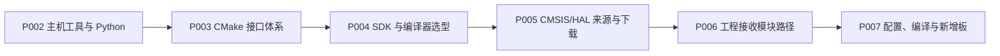

<!-- SPDX-License-Identifier: Apache-2.0 -->

# 第1章\_环境与依赖导航

环境与依赖按 P002—P006 连续编排，每章有同名 MD 与 PPT。每份先说明工程需要什么输入，再给准备动作、接入位置和核验结果。实验仍在 `G:\zephyr_practice\zephyr-main`，本页只导航，不重复各模块正文。

| 顺序 | 独立模块 | 本模块交付的结果 |
| --- | --- | --- |
| 1 | [主机工具与 Python 环境](P002_主机工具与Python环境_Windows.md) · [PPT](slides/P002_主机工具与Python环境_Windows.pptx) | 得到可用的主机命令与工程 .venv。 |
| 2 | [Zephyr 的 CMake 接口体系](P003_Zephyr的CMake接口体系_Windows.md) · [PPT](slides/P003_Zephyr的CMake接口体系_Windows.pptx) | 理解接口职责、配置/构建及缓存；依赖齐全后按正文操作并核对结果，后续模块各自回顾。 |
| 3 | [SDK 准备与编译器选型](P004_SDK准备与编译器选型_Windows.md) · [PPT](slides/P004_SDK准备与编译器选型_Windows.pptx) | 准备 SDK，并理解默认包发现与按需固定 SDK 根、按芯片配置选择编译器。 |
| 4 | [CMSIS 与 HAL 选择下载](P005_CMSIS与HAL选择下载_Windows.md) · [PPT](slides/P005_CMSIS与HAL选择下载_Windows.pptx) | 按当前源码与芯片确定来源和修订，取得可核对的 CMSIS/HAL 源码目录。 |
| 5 | [源码模块接入 Zephyr 工程](P006_源码模块接入Zephyr工程_Windows.md) · [PPT](slides/P006_源码模块接入Zephyr工程_Windows.pptx) | 把本地模块路径交给 Zephyr 工程，沿实际程序核对发现与使用过程。 |

SDK 根、模块根与 BOARD 是交给工程的不同输入。SDK 根决定工具来源，BOARD/SoC 配置决定目标架构与 CPU 参数，模块根决定额外源码在哪里。下载到磁盘不等于工程已经选用它们。P006 的原生发现脚本检查不编译固件；完整 HC32 配置须等 P007 创建板/SoC 后执行。

上一篇：[P001](P001_准备UCRT64环境与下载Zephyr_Windows.md)；下一篇：[P007](P007_编译示例与新增开发板_Windows.md)；[可复制命令](commands/P002_Windows/README.md)。

## 1.1\_原章节链接定位

以下定位保留旧笔记的链接兼容，实际内容只在相应模块维护。

[section-2-1：打开对应模块](P002_主机工具与Python环境_Windows.md#section-2-1).

[section-2-2：打开对应模块](P002_主机工具与Python环境_Windows.md#section-2-2).

[section-4-1：打开对应模块](P004_SDK准备与编译器选型_Windows.md#section-4-1).

[section-4-2：打开对应模块](P004_SDK准备与编译器选型_Windows.md#section-4-2).

[chip-selection：打开对应模块](P005_CMSIS与HAL选择下载_Windows.md#chip-selection).

[section-5-1：打开对应模块](P005_CMSIS与HAL选择下载_Windows.md#section-5-1).

[hal-origin：打开对应模块](P005_CMSIS与HAL选择下载_Windows.md#hal-origin).

[board-layout：打开对应模块](P005_CMSIS与HAL选择下载_Windows.md#board-layout).

[section-5-2：打开对应模块](P005_CMSIS与HAL选择下载_Windows.md#section-5-2).

[module-entry：打开对应模块](P006_源码模块接入Zephyr工程_Windows.md#module-entry).

[section-6-2：打开对应模块](P006_源码模块接入Zephyr工程_Windows.md#section-6-2).

[section-6-1：打开对应模块](P006_源码模块接入Zephyr工程_Windows.md#module-entry).
