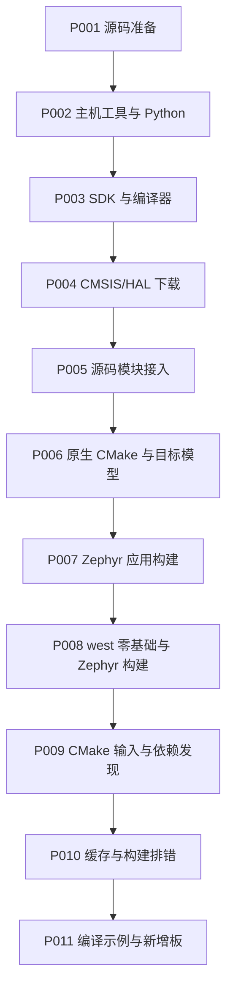

<!-- SPDX-License-Identifier: Apache-2.0 -->

# 第1章\_环境与依赖导航

先按顺序完成 P002 主机/Python、P003 SDK、P004 源码依赖下载、P005 模块接入。准备完成后再进入 CMake 和 west，不要求先读接口总论才能下载工具。每步的终端、当前目录、文件来源、成功条件在正文给出。

完整入口和页数见 [大纲](大纲.md)。本页保留旧定位锚点，分别跳到拆分后的正文；它们不是另一套待执行流程。

配套 PPT 用橙色区分变量、参数和配置字段，蓝色表示文件或路径，绿色表示接口函数，紫色表示终端命令；每册前部有图例。颜色只帮助辨认对象，命令仍需结合正文的终端、目录和前提阅读。Markdown 使用行内代码与带语言的代码块，由阅读器适配明暗主题；长操作也可从各章命令索引打开完整 TXT 复制。详细样式约定见 [演示资料维护](slides/README.md#semantic-colors)。

[section-2-1：打开对应模块](P002_主机工具与Python环境_Windows.md#section-2-1).

[section-2-2：打开对应模块](P002_主机工具与Python环境_Windows.md#section-2-2).

[section-4-1：打开对应模块](P003_SDK准备与编译器选型_Windows.md#section-3-1).

[section-4-2：打开对应模块](P003_SDK准备与编译器选型_Windows.md#section-3-2).

[chip-selection：打开对应模块](P004_CMSIS与HAL选择下载_Windows.md#chip-selection).

[section-5-1：打开对应模块](P004_CMSIS与HAL选择下载_Windows.md#section-4-1).

[hal-origin：打开对应模块](P004_CMSIS与HAL选择下载_Windows.md#hal-origin).

[board-layout：打开对应模块](P004_CMSIS与HAL选择下载_Windows.md#board-layout).

[section-5-2：打开对应模块](P004_CMSIS与HAL选择下载_Windows.md#section-4-2).

[module-entry：打开对应模块](P005_源码模块接入Zephyr工程_Windows.md#module-entry).

[section-6-2：打开对应模块](P005_源码模块接入Zephyr工程_Windows.md#section-5-2).

[section-6-1：打开对应模块](P005_源码模块接入Zephyr工程_Windows.md#module-entry).

旧入口的 SDK 准备已移至 [P003](P003_SDK准备与编译器选型_Windows.md#section-3-2)。
