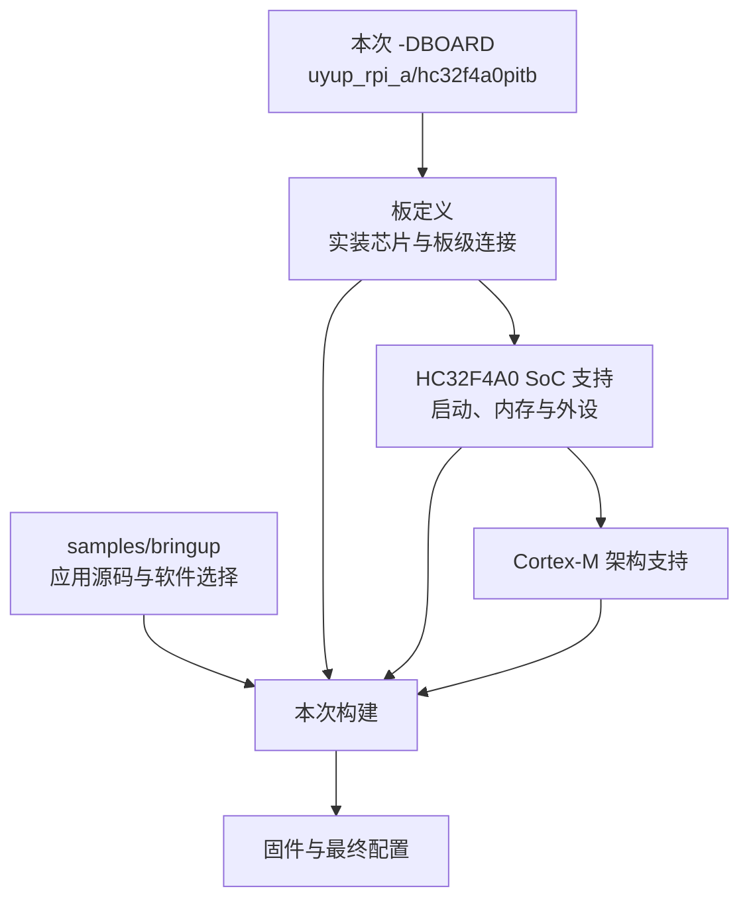
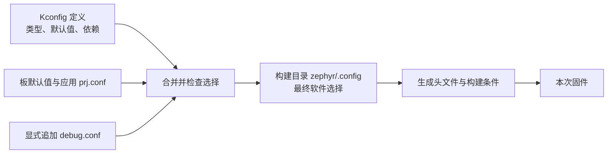

<!-- SPDX-License-Identifier: Apache-2.0 -->

# 第1章\_选择目标板与软件配置

本章是 HC32 移植完成后的配置练习，操作位置仍为 `G:\zephyr_practice\zephyr-main`。进入前，该源码树必须已有经过核对的 `boards/uyup/uyup_rpi_a`、`soc/xhsc/hc32f4a0`、对应设备树/驱动、厂商 HAL 与 `samples/bringup`，并已在这里完成默认构建。原生 ZIP 不包含这些内容；尚未完成移植时可阅读配置原理，先按 SDK 章完成原生 `mps2/an386` 实验，不执行下文 HC32 命令。

型号确认与依赖选择先看[准备专题 P004](../P01_zephyr_make_project/P004_CMSIS与HAL选择下载_Windows.md#chip-selection)：用实装丝印、BOM 与芯片数据手册确认 HC32F4A0PITB，再对应 board.yml、SoC Kconfig 与设备树。CMSIS 修订来自所选 Zephyr 的清单；HC32 HAL 是配套移植单独指定的依赖，下载和核验见[准备专题 P004 的 4.2.3 节](../P01_zephyr_make_project/P004_CMSIS与HAL选择下载_Windows.md#section-4-2)。

同样是 Cortex-M4，为什么不能把另一颗芯片的工程换个名字就编译？CPU 指令只是其中一层。外设地址、存储器、启动、时钟和板上接线都需要对应的软件支持。

你已经知道芯片与 PCB 的关系，本章要补的是 Zephyr 在哪里记录这些事实、构建时怎样选择它们。我们先选定现有板，再只改一个软件配置；设备树接线留到下一章，不把两个变量同时塞进第一次构建。

本章路线如下；每节入口会用相同编号标出当前位置，可以随时回来接上操作。


**本章导航**

- [1.1 构建目标选的是哪一层](#section-1-1)
- [1.2 从目标名找到维护位置](#section-1-2)
- [1.3 Kconfig 的定义与选择分开放](#section-1-3)
- [1.4 在独立构建中增加这个选择](#section-1-4)
- [1.5 用 menuconfig 查依赖，而不是猜名字](#section-1-5)
- [1.6 修改范围应与需求范围一致](#section-1-6)

<a id="section-1-1"></a>

## 1.1\_构建目标选的是哪一层

阅读板文件时，先区分板厂与芯片厂商：UYUP 的板目录是 `boards/uyup/uyup_rpi_a`，小华芯片适配在 `soc/xhsc/hc32f4a0`，Arm 架构共用代码在 `arch/arm`。这几层通过配置关联，路径无需按 CPU 内核逐层嵌套。当前布局支持多 SoC、不同架构 CPU 的板卡，设计理由与 `boards/arm/mps2` 中 arm 的含义见 [硬件层次与源码目录](../P01_zephyr_make_project/环境与依赖导航.md#board-layout)。

当前位置：步骤 1.1，确认板目标。


**SoC** 在这里指芯片级支持，包括处理器、存储器及外设；**board** 指具体板卡，继续说明装了哪颗芯片、晶振和板级连接。本章移植实例的目标是 `uyup_rpi_a/hc32f4a0pitb`，前半是板名，后半是芯片限定项。探针型号不参与替你选择这个字符串。

你可以把 -DBOARD 看成构建这次程序所需的硬件身份输入。工具按它寻找已存在的板、芯片和架构支持，再把这些规则与应用组合。目标名不是给固件随便起的标签；填写一个源码树中没有的名字，工具就找不到对应规则。



图中 BOARD 选择的这条链决定固件面向哪块目标，应用目录决定它要完成什么任务。二者缺一不可。我们先用现有板核对这条链，再在同一块板上改变软件选择。

在实验源码根目录的 UCRT64 Bash 中，使用准备好的项目环境：

```bash
# 当前位置：实验源码根目录；使用 UCRT64 Bash。
source .venv/Scripts/activate
```

让当前 Bash 的 python 优先使用仓库根 .venv。source 修改的是这个终端的环境，通常没有独立输出；它不创建环境，也不替其他已打开窗口切换解释器。

```bash
# 当前位置：实验源码根目录；使用 UCRT64 Bash。
python -m pip check
cmake --version
ninja --version
```

核对 Python 依赖和主机工具；SDK 与模块路径按准备章在当前终端设置。检查失败时先修复相应输入，再继续实验。

```bash
# 当前位置：实验源码根目录；使用 UCRT64 Bash。
python scripts/list_boards.py --board-root .
```

`scripts/list_boards.py` 读取当前源码中的板定义并列出名称，不会连接开发板。输出较多是正常的；本章接着查看目标板的元数据，以确认芯片限定项。

```bash
# 当前位置：实验源码根目录；使用 UCRT64 Bash。
cat boards/uyup/uyup_rpi_a/board.yml
```

显示刚才指定文件的内容，不改变它。将输出与下面的有效内容对照；许可证或说明注释不影响这次配置。

前面的命令检查已安装工具，`list_boards.py` 列举当前源码知道的板。它可能只显示板名，具体限定项继续看 board.yml。本板元数据的完整有效内容是：

```yaml
board:
  name: uyup_rpi_a
  full_name: UYUP-RPI-A-2.5 HC32F4A0PITB
  vendor: uyup
  socs:
    - name: hc32f4a0pitb
```

name 与 socs 合起来说明现有选择。若芯片尚未受支持，需要增加芯片描述、启动与驱动等移植工作，不能仅靠填一个新名字生成支持。

<a id="section-1-2"></a>

## 1.2\_从目标名找到维护位置

当前位置：步骤 1.2，定位维护文件。


boards 输出和 board.yml 已确认目标存在。接下来沿这个目标找维护文件：不是要求现在修改每一份，而是先找到“板的共同事实”和“这次应用的选择”分别放在哪里，避免一次练习影响所有应用。

board.yml 是 Zephyr 硬件模型的元数据入口名；同目录的 Kconfig、DTS、CMake 文件继续承担不同职责。打开陌生工程时，先从实际 -DBOARD 和 -S 定位板目录与应用目录，再沿下表查找，不以文件后缀推断谁读取它。

| 文件或目录 | 谁的事实 | 何时修改 |
| --- | --- | --- |
| boards/uyup/uyup_rpi_a/board.yml | 板身份与 SoC 关联 | 新板或支持的新变体 |
| 同目录 Kconfig.uyup_rpi_a | 板选择与软件配置的关联 | 板级配置入口 |
| 同目录 uyup_rpi_a_hc32f4a0pitb_defconfig | 板共同的软件默认值 | 该板各应用都需要的默认能力 |
| 同目录 uyup_rpi_a_hc32f4a0pitb.dts | 实装器件、连接、控制台与 LED | PCB 接线与板级硬件描述 |
| 同目录 uyup_rpi_a_hc32f4a0pitb.yaml | 测试平台能力 | 测试选择与资源约束 |
| 同目录 board.cmake | 烧录与调试工具接入 | runner 配置 |
| soc/xhsc/hc32f4a0/ | 芯片启动、时钟、底层集成 | SoC 支持 |
| dts/arm/xhsc/hc32f4a0*.dtsi | 可复用的芯片外设描述 | 芯片与封装描述 |
| samples/bringup/prj.conf | 这个应用需要的软件能力 | 应用功能选择 |

两个 YAML 文件用途不同：board.yml 建立板身份，板名对应的 .yaml 供测试系统理解平台。文件扩展名一样，不表示可互换。

DTS 是设备树源码，下一章才展开它的语法；本章先知道它保存硬件连接即可。板的硬件事实以项目 hardware.md 为记录来源，不能依据相似芯片或通用原理图的名字猜引脚。

<a id="section-1-3"></a>

## 1.3\_Kconfig 的定义与选择分开放

当前位置：步骤 1.3，认识配置输入。


找到文件以后，本章先只改软件能力。**Kconfig** 定义选项名字、类型、默认值与依赖；应用 .conf 则提出选择。例如 CONFIG_GPIO=y 请求 GPIO 支持，但是否成立还取决于平台和驱动依赖。你写下的请求需要由 Kconfig 系统求出最终值，不能把 prj.conf 当作已经生效的配置。

本应用 prj.conf 的有效内容只有：

```ini
# 允许程序使用 printk 输出。
CONFIG_PRINTK=y
# 请求控制台支持，实际输出设备还要结合板配置。
CONFIG_CONSOLE=y
```

它请求打印与控制台，其余能力可能由板默认值、依赖和其他配置决定。构建后，zephyr/.config 保存最终选择，生成的 autoconf.h 供 C 代码使用。要修改长期输入，应回到应用 .conf 或对应板配置，不能把生成结果当源文件维护。

prj.conf 是应用的默认配置文件名；可用 CONF_FILE 显式选其他基础配置，本章则用 EXTRA_CONF_FILE 追加一份小改动。debug.conf 是本例自定的名字，不会仅因文件叫 debug 就自动启用调试选项。先配置生成 .config，后面才能打开它确认结果。



这里要观察的是 D 到 E：请求进入了合并过程，最终值是否仍为 y。依据可对照实验源码的 `doc/build/kconfig/setting.rst`中初始配置与应用片段的合并规则。

我们想便于调试，只增加一个选项。先在当前源码查定义：

```bash
# 当前位置：实验源码根目录；使用 UCRT64 Bash。
rg -n -A 7 "config DEBUG_OPTIMIZATIONS" Kconfig.zephyr
```

-n 显示行号，同时检查两个构建目录中的最终优化选择。以具体哪一项为 y 判断结果，不以目录名判断是否生效。

本基线提供 DEBUG_OPTIMIZATIONS，选择适合调试的优化设置。不要照旧资料填写本基线未定义的 CONFIG_DEBUG_INFO；选项存在与否由当前源码决定，搜索不到时先核对版本与名字。

<a id="section-1-4"></a>

## 1.4\_在独立构建中增加这个选择

当前位置：步骤 1.4，比较最终选择。


已经找到 DEBUG_OPTIMIZATIONS 的定义，现在把请求写入单独的练习文件。终端仍在仓库根，准备 board-textbook；其中 debug.conf 是可编辑输入，default 与 debug 则是稍后生成的两个构建目录。分开目录后，就能同时查看改变前后，而不依赖记忆。

```bash
# 当前位置：实验源码根目录；使用 UCRT64 Bash。
mkdir -p build/learning-tools
```

-p 允许父目录已经存在；此步只准备存放实验的公共位置，不会复制材料，也不会创建固件。通常没有输出。

```bash
# 当前位置：实验源码根目录；使用 UCRT64 Bash。
mkdir build/learning-tools/board-textbook
```

建立这次练习专用目录，成功时通常没有输出。若提示目录已存在，先查看旧内容，另选名字并同步替换本章后续路径；不要在未知旧副本上继续覆盖。

```bash
# 当前位置：实验源码根目录；使用 UCRT64 Bash。
cp learning/board/labs/debug.conf build/learning-tools/board-textbook/debug.conf
```

把左侧原件复制到右侧练习位置。cp 不会编译或应用配置，成功时通常没有输出；后面的工具只有显式读取这个副本时才会受它影响。

```bash
# 当前位置：实验源码根目录；使用 UCRT64 Bash。
cat build/learning-tools/board-textbook/debug.conf
```

显示刚才指定文件的内容，不改变它。将输出与下面的有效内容对照；许可证或说明注释不影响这次配置。

新目录若已存在则换名，不混入先前结果。这个配置文件除许可证注释外只有：

```ini
# 由 EXTRA_CONF_FILE 显式选择后才参与本次配置。
CONFIG_DEBUG_OPTIMIZATIONS=y
```

先配置默认组合，再配置叠加组合，便于比较最终结果：

```bash
# 当前位置：实验源码根目录；使用 UCRT64 Bash。
cmake -S samples/bringup -B build/learning-tools/board-textbook/default -G Ninja -DBOARD=uyup_rpi_a/hc32f4a0pitb
```

-S 选择源码目录，-B 选择生成物目录，-G Ninja 选择构建规则格式；-D 将本次选择交给 CMake。此步成功通常以 Configuring done、Generating done 和生成位置结束，还没有生成可运行程序。

```bash
# 当前位置：实验源码根目录；使用 UCRT64 Bash。
cmake -S samples/bringup -B build/learning-tools/board-textbook/debug -G Ninja -DBOARD=uyup_rpi_a/hc32f4a0pitb -DEXTRA_CONF_FILE=../../build/learning-tools/board-textbook/debug.conf
```

-S 选择源码目录，-B 选择生成物目录，-G Ninja 选择构建规则格式；-D 将本次选择交给 CMake。此步成功通常以 Configuring done、Generating done 和生成位置结束，还没有生成可运行程序。 EXTRA_CONF_FILE 指向附加的软件配置；它按应用源码目录解析，并在默认应用配置之后合并。

```bash
# 当前位置：实验源码根目录；使用 UCRT64 Bash。
cmake --build build/learning-tools/board-textbook/debug
```

读取 --build 后那个目录中已生成的规则，完成需要的编译与链接。出现错误就停在此处看第一条具体错误；成功后才继续检查配置、运行程序或测试。没有改动时提示 no work to do 是正常的。

```bash
# 当前位置：实验源码根目录；使用 UCRT64 Bash。
rg -n "CONFIG_.*OPTIMIZATIONS" build/learning-tools/board-textbook/default/zephyr/.config build/learning-tools/board-textbook/debug/zephyr/.config
```

-n 显示行号，同时检查两个构建目录中的最终优化选择。以具体哪一项为 y 判断结果，不以目录名判断是否生效。

把两个路径在纸上展开一次：-B 的起点是仓库根，所以直接进入 build；EXTRA_CONF_FILE 的起点是 samples/bringup，../../ 先回到仓库根，再进入同一个 build。这也解释了为什么不能把 -B 后的相对路径原封不动复制到 EXTRA_CONF_FILE 后。

比较输出，应看到叠加组合的 DEBUG_OPTIMIZATIONS=y，其他互斥优化选择相应变化。debug 构建应成功。若默认组合本来就相同，也应如实记录这个事实；文件名叫 debug 不构成选项已经改变的证据。

<a id="section-1-5"></a>

## 1.5\_用 menuconfig 查依赖，而不是猜名字

当前位置：步骤 1.5，查看依赖。


最终 .config 能告诉我们选中了什么，但如果某个请求未生效，还需要看到它的依赖与所属选项组。下面的 menuconfig 是交互浏览入口；先有上一节生成的 debug 构建目录，才能从该目录启动它。

```bash
# 当前位置：实验源码根目录；使用 UCRT64 Bash。
cmake --build build/learning-tools/board-textbook/debug --target menuconfig
```

这次要求构建工具打开 menuconfig 交互界面，命令暂时不返回提示符是正常的。按下文步骤查看并退出后，再回到终端。

menuconfig 是文本配置界面，启动后终端看起来不再像命令提示符是正常的。按 / 打开搜索，输入 DEBUG_OPTIMIZATIONS，查看匹配符号、当前值和它位于哪个菜单；界面底部列出导航与退出按键，退出时选择不保存额外修改。本次只观察，不需要把菜单里的选项都试一遍。

以后要保留某项改变，应把最小必要选择写回自己的 .conf，再重新配置检查最终值。menuconfig 改的是构建现场；共享给同事的输入应能说明你为什么选它。

如果赋 y 却未启用，先读配置警告和符号依赖；如果符号不存在，则先查定义。复制整份 .config 到 prj.conf 虽然看似省事，却会把许多本应随默认值变化的选择也固定下来，升级时更难判断意图。

<a id="section-1-6"></a>

## 1.6\_修改范围应与需求范围一致

当前位置：步骤 1.6，决定修改范围。


通过两个构建目录的对照，现在已经有依据决定修改应落在哪一层。只为这个应用打开功能，优先改应用配置；一整块板共同的默认能力才适合板 defconfig。连接哪个 GPIO 是下一章设备树要解决的问题，哪个 .c 参与构建是前面 CMake 的职责，选择哪个源码版本才是 Git/west 的职责。

练习先不加新选项：打开 default 与 debug 的 .config，找到调试优化相关行，再回到 Kconfig 定义解释为什么它们不能任意同时选中。这个练习只使用本章的输入、定义和输出，不需要学习下一章语法。

核对思路：在 Kconfig.zephyr 中继续向上找到包住这些优化选项的 choice，再向下找到 endchoice。它们属于同一组选一项的配置，所以不能用“在两个文件各写一个 y”得到两种同时生效的编译优化。debug 目录应选中 DEBUG_OPTIMIZATIONS；另一个目录的实际选择以它的 .config 为准，不预设必然不同。

下次开窗口从根目录重新激活 .venv，即可沿用 board-textbook。保留 debug.conf；构建目录可重建。下一章继续使用相同板目标，只改变一个 LED 的设备树选择。

[Kconfig 配置依据](https://docs.zephyrproject.org/latest/build/kconfig/setting.html) · [下一章](P002_按PCB连接修改设备树.md) · [大纲](大纲.md)
