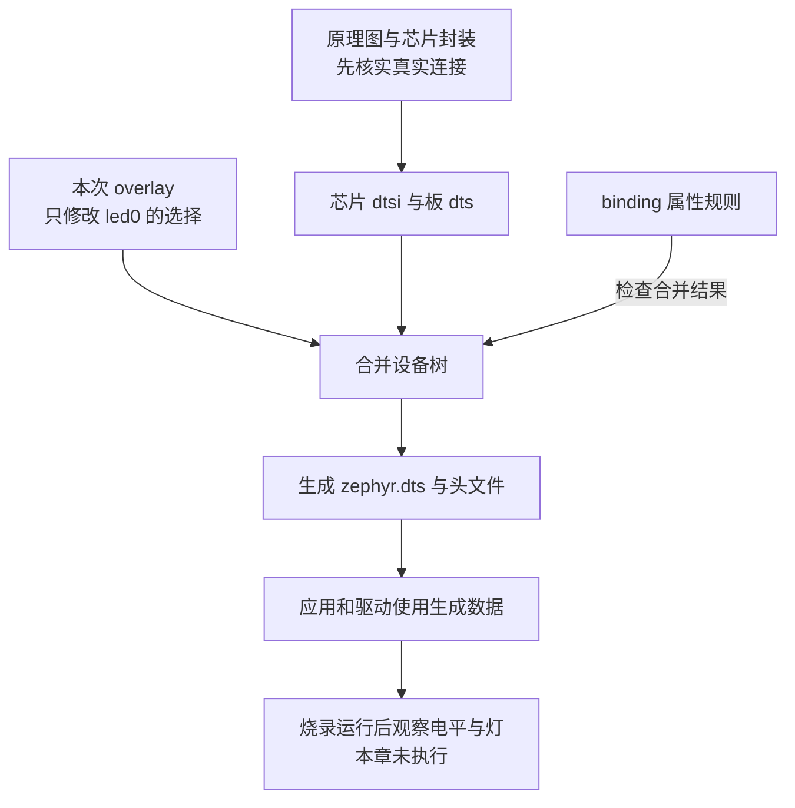

<!-- SPDX-License-Identifier: Apache-2.0 -->

# 2. 按 PCB 连接修改设备树

上一章选好了板与软件能力，应用却还需要知道“这块板的灯接在哪里”。GPIO 驱动能工作，不等于它知道你的 PCB。设备树把这类连接描述交给构建系统，再生成驱动可使用的数据。

本章只改变应用选择哪颗已经接好的 LED。随后用一个非法引脚值观察约束如何拒绝配置。这样能学到修改方式，又不会把未经核实的脚号写成可用的移植方案。

本章路线如下；每节入口会用相同编号标出当前位置，可以随时回来接上操作。


## 2.1 从电路信号到软件属性

当前位置：步骤 2.1，核对连接层次。


真正换 PCB 时，先建立“器件信号→芯片物理脚号→端口与位号→复用功能→电气条件”的对应。PA9 是 A 端口第 9 位，不是芯片封装第 9 脚；字段叫 pin，也不保证它接受物理脚号。

本板实装 HC32F4A0PITB，LQFP100、12 MHz 晶振；blue_led 使用 PD10，green_led 使用 PE15，均低有效。芯片封装缺失引脚按 NC 处理。这里沿用项目已核实映射，不另猜一组“看起来空闲”的脚。

文件分工可以从一次构建理解：芯片 .dtsi 提供可复用外设描述，板 .dts 组合实装连接，应用 overlay 叠加这次构建的改动，binding 约束属性类型和值，驱动最后使用生成数据。**overlay** 是修改文件，**binding** 是属性规则，两者不是不同名字的同一份设备树。



本章动手完成中间的合并、检查和构建。底部的灯亮不亮还取决于实际烧录、供电、驱动与连接，因此在打开生成文件时，我们只记录文件能证明的部分。

## 2.2 先读当前 LED 描述

当前位置：步骤 2.2，读懂 LED 节点。


已经知道各层职责，先从板文件里找一颗真实灯。打开 `boards/uyup/uyup_rpi_a/uyup_rpi_a_hc32f4a0pitb.dts`，下面摘录的是与本实验有关的完整 leds 与 aliases 节点；整个板文件还有控制台等描述，不要用这段摘录覆盖原文件。

```dts
leds {
    compatible = "gpio-leds";
    blue_led: led-0 {
        /* D 端口第 10 位，低电平表示逻辑有效。 */
        gpios = <&gpiod 10 GPIO_ACTIVE_LOW>;
        label = "LED3 blue";
    };
    green_led: led-1 {
        gpios = <&gpioe 15 GPIO_ACTIVE_LOW>;
        label = "LED4 green";
    };
};
aliases {
    /* 应用按 led0 找灯；这一行把它接到蓝灯节点。 */
    led0 = &blue_led;
    led1 = &green_led;
};
```

blue_led、green_led 是节点标签，& 表示引用；led-0、led-1 是节点名字。gpios 中依次是控制器引用、控制器内位号和标志：&gpioe 15 指 PE15，GPIO_ACTIVE_LOW 说明逻辑有效对应低电平。

aliases 给应用一个不必绑定具体器件名的入口。应用使用 led0，板描述目前让它对应蓝灯。只改变别名，就能保持应用代码不动而选择另一颗已定义 LED。chosen 则用于控制台等系统指定用途，不能把所有引用都放进 aliases 代替。

这段语法可沿一行拆开读：blue_led: 给节点起可引用的标签，led-0 是节点名，花括号中是属性；gpios = <...>; 用尖括号保存控制器与参数。结尾分号是语法的一部分，不能因排版换行而省掉。GPIO_ACTIVE_LOW 是从设备树头文件取得的标志；逻辑有效映射为低电平，并不是说这颗灯永远输出低电平。

应用里这条连接可以在 `samples/bringup/src/main.c` 找到。以下是只读观察片段，原程序还包含节点存在检查、控制器就绪检查和错误处理，不是要另建一个不完整的 main：

```c
/* 先把应用认识的 led0 别名转换成设备树节点。 */
#define LED0_NODE DT_ALIAS(led0)
/* 再从这个节点的 gpios 属性取得控制器、位号和有效电平。 */
static const struct gpio_dt_spec led = GPIO_DT_SPEC_GET(LED0_NODE, gpios);
```

DT_ALIAS 与 GPIO_DT_SPEC_GET 是 Zephyr 提供的设备树访问宏，前者选节点，后者生成 GPIO 描述。修改 led0 的目标后重新构建，同一行 C 代码就取得另一颗灯的数据；它不会在运行时打开 .dts 文本查找字符串。

## 2.3 让这一次构建选择绿灯

当前位置：步骤 2.3，选择绿灯。


蓝灯与绿灯节点都已存在，所以这次无需重新描述引脚，只把应用入口 led0 指向 green_led。承接上一章，.venv 已准备，board-textbook 和其中 debug.conf 已存在；命令继续从仓库根目录执行。

green-led.overlay 是作者给文件取的名字，稍后由 DTC_OVERLAY_FILE 显式选择；换成别的文件名也必须同步参数。陌生应用还可能使用默认发现的 app.overlay 等入口，不能只凭目录中“有一个 overlay”断定本次读了它。配置日志中的叠加文件记录与最终 zephyr.dts 才能确认实际输入。

先复制本章原件：

```bash
# 当前位置：仓库根目录；使用 UCRT64 Bash。
cp learning/board/labs/green-led.overlay build/learning-tools/board-textbook/green-led.overlay
```

把左侧原件复制到右侧练习位置。cp 不会编译或应用配置，成功时通常没有输出；后面的工具只有显式读取这个副本时才会受它影响。

```bash
# 当前位置：仓库根目录；使用 UCRT64 Bash。
cat build/learning-tools/board-textbook/green-led.overlay
```

显示刚才指定文件的内容，不改变它。将输出与下面的有效内容对照；许可证或说明注释不影响这次配置。

其全部有效内容为：

```dts
/ {
    aliases {
        /* 只覆盖应用别名，不改变 green_led 的接线描述。 */
        led0 = &green_led;
    };
};
```

/ 表示根节点，aliases 在它下面。这里没有重新定义 GPIO，也没有增加驱动，只覆盖 led0 的目标。配置与构建：

```bash
# 当前位置：仓库根目录；使用 UCRT64 Bash。
python scripts/project_env.py exec cmake -S samples/bringup -B build/learning-tools/board-textbook/green -G Ninja -DBOARD=uyup_rpi_a/hc32f4a0pitb -DEXTRA_CONF_FILE=../../build/learning-tools/board-textbook/debug.conf -DDTC_OVERLAY_FILE=../../build/learning-tools/board-textbook/green-led.overlay
```

-S 选择源码目录，-B 选择生成物目录，-G Ninja 选择构建规则格式；-D 将本次选择交给 CMake。此步成功通常以 Configuring done、Generating done 和生成位置结束，还没有生成可运行程序。 EXTRA_CONF_FILE 指向附加的软件配置；它按应用源码目录解析，并在默认应用配置之后合并。 DTC_OVERLAY_FILE 显式选择本次设备树叠加文件，路径也按应用源码目录解析。

```bash
# 当前位置：仓库根目录；使用 UCRT64 Bash。
python scripts/project_env.py exec cmake --build build/learning-tools/board-textbook/green
```

读取 --build 后那个目录中已生成的规则，完成需要的编译与链接。出现错误就停在此处看第一条具体错误；成功后才继续检查配置、运行程序或测试。没有改动时提示 no work to do 是正常的。

```bash
# 当前位置：仓库根目录；使用 UCRT64 Bash。
rg -n -A 7 "aliases|green_led|blue_led" build/learning-tools/board-textbook/green/zephyr/zephyr.dts
```

-A 让匹配行后面的节点内容一起显示。这里读取的是本次配置生成的最终树：先找 led0 指向哪条节点路径，再对应回节点内容；不要直接编辑这份生成物。

DTC_OVERLAY_FILE 按应用源码目录解析，路径规则与上一章 EXTRA_CONF_FILE 相同。构建目录采用 green，避免混淆上一章的默认树。

生成的 zephyr.dts 中，led0 应对应 /leds/led-1；工具可能将标签引用解析成节点路径，不一定保留输入中的字面写法。查看对应节点，gpios 仍指 PE15、低有效。我们验证的是最终树和编译结果；尚未烧录，因此不能声称已经看到绿灯闪烁。

## 2.4 自己写一个相反选择，再比较

当前位置：步骤 2.4，切回蓝灯对照。


green 的最终树已经显示 led0 指向绿灯。现在只把这个引用切回蓝灯，保留原来的 green 构建目录供对照。在同一个练习目录新建 blue-led.overlay，完整内容如下。用 Bash 写入时，DTS 结束标记必须独占一行：

```bash
# 当前位置：仓库根目录；使用 UCRT64 Bash。
cat > build/learning-tools/board-textbook/blue-led.overlay <<'DTS'
/ {
    aliases {
        led0 = &blue_led;
    };
};
DTS
```

这里由 Bash 把两行结束标记之间的文本写入指定文件。结束标记本身不写入文件；引号让文本保持原样。先确认文件已保存，再让构建系统读取它。

```bash
# 当前位置：仓库根目录；使用 UCRT64 Bash。
python scripts/project_env.py exec cmake -S samples/bringup -B build/learning-tools/board-textbook/blue -G Ninja -DBOARD=uyup_rpi_a/hc32f4a0pitb -DEXTRA_CONF_FILE=../../build/learning-tools/board-textbook/debug.conf -DDTC_OVERLAY_FILE=../../build/learning-tools/board-textbook/blue-led.overlay
```

-S 选择源码目录，-B 选择生成物目录，-G Ninja 选择构建规则格式；-D 将本次选择交给 CMake。此步成功通常以 Configuring done、Generating done 和生成位置结束，还没有生成可运行程序。 DTC_OVERLAY_FILE 显式选择本次设备树叠加文件，路径也按应用源码目录解析。

```bash
# 当前位置：仓库根目录；使用 UCRT64 Bash。
python scripts/project_env.py exec cmake --build build/learning-tools/board-textbook/blue
```

继续构建 blue 目录中的这组规则。应完成编译链接；若没有需要重做的输入，no work to do 也表示这一步成功。先处理构建错误，再继续使用本次产物。

```bash
# 当前位置：仓库根目录；使用 UCRT64 Bash。
rg -n -A 5 "aliases" build/learning-tools/board-textbook/blue/zephyr/zephyr.dts
```

-A 让匹配行后面的节点内容一起显示。这里读取的是本次配置生成的最终树：先找 led0 指向哪条节点路径，再对应回节点内容；不要直接编辑这份生成物。

led0 应恢复对应 /leds/led-0。blue 与 green 都保留同一份 debug.conf，这样比较时只改变 LED 选择，不同时更换软件优化配置。两个构建目录同时保留，能直接比较，避免靠记忆猜刚才选中了谁。修改生成的 zephyr.dts 不能作为长期输入，下一次生成可能覆盖它。

长期同一 PCB 的共同接线放板 .dts，一次应用选择可放 overlay；新 PCB 型号差异很大时应建立独立板身份，而不是永久伪装成旧板。芯片寄存器与封装限制则属于芯片描述层。

## 2.5 合法属性也不保证驱动支持所有映射

当前位置：步骤 2.5，拒绝非法引脚。


刚才切换的是两颗已经完整定义的灯。若改成“把串口信号接到另一个脚”，问题就多了一层：那个脚是否能连接所需外设，驱动是否会设置对应复用功能。这次把观察对象换成 UART，只做受控错误，不尝试未经核实的新接线。

许多 SoC 使用 pinctrl 描述引脚复用状态，其宏、binding 与驱动都依平台而定；本仓库当前 HC32 UART 使用下面这些自有属性，不能把另一芯片的 pinctrl 例子直接抄过来。

本仓库当前 USART1 使用 PA9 TX、PA10 RX，板文件的相关配置是：

```dts
&usart1 {
    status = "okay";
    current-speed = <115200>;
    tx-port = <&gpioa>;
    tx-pin = <9>;
    rx-port = <&gpioa>;
    rx-pin = <10>;
};
```

status 让节点启用，仍需 Kconfig/CMake 把驱动纳入。xhsc,hc32-uart.yaml 允许位号 0..15；当前 uart_hc32.c 实现则进一步限定实例与这组引脚，不匹配时返回 -ENOTSUP。也就是说，某个 0..15 的值可能通过属性检查，运行时仍不受驱动支持。

先用越界值观察更早的检查。材料 invalid-uart.overlay 的完整有效内容是：

```dts
&usart1 {
    /* 故意超出控制器内位号范围，验证配置阶段会拒绝它。 */
    tx-pin = <16>;
};
```

复制并配置：

```bash
# 当前位置：仓库根目录；使用 UCRT64 Bash。
cp learning/board/labs/invalid-uart.overlay build/learning-tools/board-textbook/invalid-uart.overlay
```

把左侧原件复制到右侧练习位置。cp 不会编译或应用配置，成功时通常没有输出；后面的工具只有显式读取这个副本时才会受它影响。

```bash
# 当前位置：仓库根目录；使用 UCRT64 Bash。
python scripts/project_env.py exec cmake -S samples/bringup -B build/learning-tools/board-textbook/invalid -G Ninja -DBOARD=uyup_rpi_a/hc32f4a0pitb -DDTC_OVERLAY_FILE=../../build/learning-tools/board-textbook/invalid-uart.overlay
echo $?
```

这次输入刻意包含非法设备树属性，应在配置阶段失败并返回非 0。请核对错误确实指向 tx-pin 的值 16；若是缺工具或路径错误，就还没有验证到属性约束。

预期配置阶段因 tx-pin=16 不符合枚举而失败，不应等到 C 编译。这不是“设备树坏了”的笼统结论，错误应具体指向这个属性和值。

在同一构建目录明确改回正确输入：

```bash
# 当前位置：仓库根目录；使用 UCRT64 Bash。
python scripts/project_env.py exec cmake -S samples/bringup -B build/learning-tools/board-textbook/invalid -G Ninja -DBOARD=uyup_rpi_a/hc32f4a0pitb -DDTC_OVERLAY_FILE=../../build/learning-tools/board-textbook/blue-led.overlay
```

-S 选择源码目录，-B 选择生成物目录，-G Ninja 选择构建规则格式；-D 将本次选择交给 CMake。此步成功通常以 Configuring done、Generating done 和生成位置结束，还没有生成可运行程序。 DTC_OVERLAY_FILE 显式选择本次设备树叠加文件，路径也按应用源码目录解析。

```bash
# 当前位置：仓库根目录；使用 UCRT64 Bash。
python scripts/project_env.py exec cmake --build build/learning-tools/board-textbook/invalid
```

继续构建 invalid 目录中的这组规则。应完成编译链接；若没有需要重做的输入，no work to do 也表示这一步成功。先处理构建错误，再继续使用本次产物。

应恢复成功。不要放宽 binding 来容忍这次人为越界，也不要只编辑 overlay 文件名却忘了更新缓存中的配置参数。

## 2.6 适配需要沿着哪条链核对

当前位置：步骤 2.6，整理适配证据。


同一构建目录已经改回合法输入并恢复成功。把这几次结果放在一起看：蓝绿实验验证 alias 能否改变合并结果，越界实验验证 binding 是否拒绝不合法的值；两者都还没有检验 PCB 上的电信号。

原理图与封装决定可用连接；设备树表达连接；binding 检查属性；驱动决定如何配置寄存器；实板电平、收发与时序才检验真实硬件。语法合法、驱动支持、电气正确是三个不同判断。当前 UART 的进一步限制可对照 [属性规则](../../dts/bindings/serial/xhsc,hc32-uart.yaml)和 [uart_hc32.c](../../drivers/serial/uart_hc32.c)中的引脚配置检查；板卡事实以[硬件记录](../../project-docs/hardware.md)为准。

增加新 UART 映射时，先查芯片复用表、封装和 PCB，再修改驱动的配置处理，必要时扩展 binding 或实现 pinctrl，最后做构建与实板测试。GPIO 例子编译成功不代表时钟、Flash 等待周期和供电也全部正确。

本章练习已经只改变一个 alias，另一次只改变非法位号。试着解释两次实验分别检查了哪一层，为什么都不能替代示波器或串口收发观察。下一章用模拟器验证软件行为，同时继续保留这个边界。

[设备树操作依据](https://docs.zephyrproject.org/latest/build/dts/howtos.html) · [上一章](P01_选择目标板与软件配置.md) · [下一章](P03_用Twister和QEMU验证配置.md)
