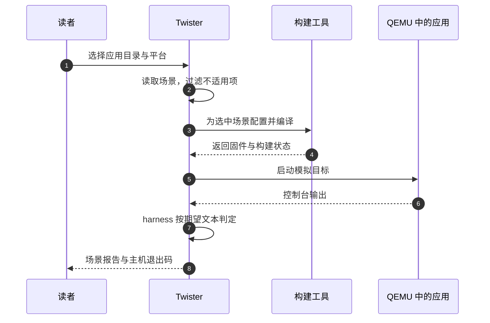

<!-- SPDX-License-Identifier: Apache-2.0 -->

# 3. 用 Twister 和 QEMU 验证配置

构建生成了 ELF，只说明工具成功把这组输入变成程序。它有没有走到预期分支、输出是否正确，还需要运行后判断。上一章也提醒过：运行软件与验证真实 PCB 是两件事。

本章使用 CMake 模块章节已经讲过的 scale 应用，把“开启输出 42、关闭输出 disabled”变成可重复执行的检查。先读过 CMake P02 中的模块、应用源码和配置即可，不要求已经使用测试工具；本章从场景文件开始介绍它。

本章路线如下；每节入口会用相同编号标出当前位置，可以随时回来接上操作。


## 3.1 谁负责运行，谁负责判定

当前位置：步骤 3.1，准备独立副本。


**Twister** 是 Zephyr 的测试编排工具：选择场景与平台，配置构建，启动运行，再按规则判断结果。**QEMU** 提供受支持机器的模拟环境。本例由 Twister 启动 QEMU，QEMU 运行程序，Twister 检查其控制台输出。

在前面的模块章，我们只看到开关和编译输入是否对应。现在要把那份应用实际运行起来。先明确分工：你写“应出现什么”的判据，Twister 安排构建与运行，QEMU 执行目标程序；判据不是模拟器根据源码自动替你推导的。



图中第 4 步成功只说明固件生成了；本章要继续看第 6、7 步的真实输出与判定。后面故意把期望写错，就是检验这两步是否真的会拦住不符合要求的结果。

QEMU 模拟的是具体机器的存储器与外设，不是只选“Cortex-M”就能运行任意芯片固件。本章选择 mps2/an386 来验证通用软件；它不模拟 HC32 的 GPIO、USART、Flash、时钟或 SWD。换 -p 字符串不会给模拟器增添一块新 PCB。

这里重新从材料原件复制，不依赖 CMake 章节练习是否已恢复。将创建 `build/learning-tools/twister-textbook`，里面并列保存 zephyr_app 与 zephyr_module；first、wrong-expectation 等报告目录稍后才生成，每个名字对应一次实验，不能把旧报告当成本次结果。

在仓库根目录的 UCRT64 Bash 中准备副本：

```bash
# 当前位置：仓库根目录；使用 UCRT64 Bash。
source .venv/Scripts/activate
```

让当前 Bash 的 python 优先使用仓库根 .venv。source 修改的是这个终端的环境，通常没有独立输出；它不创建环境，也不替其他已打开窗口切换解释器。

```bash
# 当前位置：仓库根目录；使用 UCRT64 Bash。
python scripts/project_env.py doctor
```

由项目环境检查入口核对 Python、SDK、主机工具和源码位置。缺项时先按报告处理；doctor 通过后再运行依赖这些工具的实验。

```bash
# 当前位置：仓库根目录；使用 UCRT64 Bash。
mkdir build/learning-tools/twister-textbook
```

建立这次练习专用目录，成功时通常没有输出。若提示目录已存在，先查看旧内容，另选名字并同步替换本章后续路径；不要在未知旧副本上继续覆盖。

```bash
# 当前位置：仓库根目录；使用 UCRT64 Bash。
cp -R learning/cmake/labs/zephyr_app build/learning-tools/twister-textbook/zephyr_app
```

-R 连同子目录复制材料。复制后可以在编辑器中检查目标目录；此步仍只是准备源文件，没有配置、编译或运行它们。

```bash
# 当前位置：仓库根目录；使用 UCRT64 Bash。
cp -R learning/cmake/labs/zephyr_module build/learning-tools/twister-textbook/zephyr_module
```

-R 连同子目录复制材料。复制后可以在编辑器中检查目标目录；此步仍只是准备源文件，没有配置、编译或运行它们。

目录应尚不存在。它与模块章节保持相同深度，使应用的相对模块路径成立；工具环境仍用项目 .venv。副本中的倍数是 2，开启应用将打印 module result=42，关闭应用打印 module disabled。这里是待验证的预测，不是构建成功后的既成事实。

## 3.2 把预测写成测试场景

当前位置：步骤 3.2，写出判定规则。


准备好的应用在开启时应打印 42，关闭时应打印 disabled。现在把这个预测写成工具能执行的规则。**测试场景** 是同一份应用在一组构建选择与判定条件下的一次检验；不必为开关两种状态复制两套 main.c。

本例使用 tests.yaml 作为场景入口，本仓库的 Twister 同时识别 testcase.yaml 等入口名；tests.yaml 不是任意 YAML 文件都能替代的名字。命令中的 -T 决定扫描范围，-s 可再指定里面的场景名。到陌生工程先找实际扫描目录与被识别的场景文件，不从应用名猜测试名。

复制品 zephyr_app/tests.yaml 的完整有效内容如下。字段缩进表达层级，建议保留现有空格，只改本次指定的值：

```yaml
tests:
  # 作者命名的第一种场景：采用应用默认的模块开启配置。
  learning.module.enabled:
    platform_allow: mps2/an386
    integration_platforms:
      - mps2/an386
    harness: console # 用运行时控制台输出判断，而不是只看编译成功。
    harness_config:
      type: one_line
      regex:
        - "module result=42" # 稍后的错误期望实验只改这一项。
  # 同一个应用的第二种场景，不是另一个源码目录。
  learning.module.disabled:
    platform_allow: mps2/an386
    integration_platforms:
      - mps2/an386
    extra_args: EXTRA_CONF_FILE=no_module.conf # 追加关闭模块的配置片段。
    harness: console
    harness_config:
      type: one_line
      regex:
        - "module disabled"
```

tests 下两个键是场景名字，不是源文件路径。platform_allow 限定适用平台，integration_platforms 列出集成运行的代表平台。当前命令明确选 mps2/an386，它同时满足这两个场景的限制。

**harness** 是结果判定方式。console 读取控制台输出，one_line 要求找到符合规则的一行，regex 给出正则表达式。本例只匹配固定文本，无须先学复杂正则。关闭场景通过 extra_args 叠加 no_module.conf，其内容是 CONFIG_LEARNING_SCALE=n；开启场景使用 prj.conf 的 y。

按照这份文件，Twister 会对同一应用做两次独立配置。enabled 走有 scale_sample 的编译分支，运行后应匹配 module result=42；disabled 去掉实现与调用，运行后应匹配 module disabled。场景名末尾的 enabled/disabled 只是作者取名，真正让第二项关闭的是 extra_args 那行。

板目录的 .yaml 描述平台能力，也参与过滤，但修改它不会让模拟器突然实现 HC32 外设。看到 filtered 时，要理解被排除的原因，不能当成已经运行通过。

## 3.3 第一次运行，让两种配置都说话

当前位置：步骤 3.3，运行正常场景。


场景已经说明“运行什么、看什么”，现在把它交给 Twister。终端仍在仓库根、根 .venv 已激活；下面的两个 python 不是写重复了：外层运行 project_env.py，exec 后面的 python 在项目工具环境中运行 scripts/twister 这个 Python 程序。

```bash
# 当前位置：仓库根目录；使用 UCRT64 Bash。
python scripts/project_env.py exec python scripts/twister -p mps2/an386 -T build/learning-tools/twister-textbook/zephyr_app --short-build-path --outdir build/learning-tools/twister-textbook/first --inline-logs
```

Twister 从 -T 指向的应用读取场景，在 -p 指定的平台构建并启动模拟器，将日志与报告写入 --outdir。等待它返回后再检查汇总：本次两个场景应执行通过，而不仅是构建成功。

-p 选择平台，-T 限定扫描哪棵测试源码，--outdir 指报告与构建产物位置，--inline-logs 在失败时显示相关日志。--short-build-path 使用短构建位置来避开 Windows 工具的长路径限制，报告仍在指定目录。

这条命令会花时间完成两次配置与编译，再运行模拟器。应报告两个 executed test configurations 通过，0 built (not run)，无 failed/errored。控制台分别应出现 42 和 disabled。只有输出匹配才说明程序走到了我们关心的位置，不能凭生成 ELF 推断已经运行。

第一次运行没有马上回到提示符，不必重复启动第二份。等它完成再看汇总，主要核对场景数量与执行状态，不要求耗时、内存统计或临时目录名与别人一样。若命令失败，先保留这次 first 目录和日志；重新运行换一个 --outdir，才能分清前后两次证据。

打开 first/twister.json 和 first/twister.xml 查看场景记录。可以从命令行找日志：

```bash
# 当前位置：仓库根目录；使用 UCRT64 Bash。
find build/learning-tools/twister-textbook/first -name '*.log'
```

-name 按文件名筛选，列出这次报告目录中的日志。它只查找文件，不会启动测试，也不需要手工猜测工具生成的实例子目录。

```bash
# 当前位置：仓库根目录；使用 UCRT64 Bash。
rg --no-ignore -n "module result=42|module disabled" build/learning-tools/twister-textbook/first
```

--no-ignore 允许进入 Git 忽略的产物目录，-n 给出行号。找到输出后查看它所属的场景与运行日志，避免把构建命令里的文本误认为程序打印。

find 按文件名查找，rg 在文本中找关键输出；--no-ignore 让 rg 也搜索被 Git 忽略的构建目录，否则可能有日志却搜不到。具体实例目录由工具生成，不要求你背它的拼接规则。构建失败先看 build.log 中第一处错误；模拟器未启动或输出超时则看运行日志。末尾“失败”只是汇总，不是原因。

## 3.4 让错误期望真的失败

当前位置：步骤 3.4，检验错误期望。


两个正常场景通过以后，再来检验判据是否有效。这次程序不变，只把“我期待的结果”故意写错：仍输出 42，却要求 999。测试应该拒绝它；若仍然通过，需要先检查是否改对了场景，或是否读到了旧报告。

先备份场景文件：

```bash
# 当前位置：仓库根目录；使用 UCRT64 Bash。
cp build/learning-tools/twister-textbook/zephyr_app/tests.yaml build/learning-tools/twister-textbook/tests-before.yaml
```

把当前文件复制为本章的恢复点。备份成功通常没有输出；下一步只改练习副本，恢复时再从这份备份复制回来。

只把 enabled 场景的 `"module result=42"` 改成 `"module result=999"`，程序完全不变。然后只运行这一项：

```bash
# 当前位置：仓库根目录；使用 UCRT64 Bash。
python scripts/project_env.py exec python scripts/twister -p mps2/an386 -T build/learning-tools/twister-textbook/zephyr_app -s learning.module.enabled --short-build-path --outdir build/learning-tools/twister-textbook/wrong-expectation --inline-logs
echo $?
```

此处故意保留不匹配的程序输出与测试期望。等待测试结束后立即读退出码，应非 0；按下文要求检查真实输出，随后执行恢复步骤。

-s 按场景名选择，预期非零退出，原因是输出无法满足期望，可能表现为超时。这个程序打印一次后不再产生我们期待的 999，测试可能一直等到超时才返回；不要把等待误认为电脑卡死。编译仍可能成功，运行日志中的实际值应仍为 42。这个反例区分了“程序构建成功”和“行为符合要求”。

恢复后重新运行两个场景：

```bash
# 当前位置：仓库根目录；使用 UCRT64 Bash。
cp build/learning-tools/twister-textbook/tests-before.yaml build/learning-tools/twister-textbook/zephyr_app/tests.yaml
```

把备份内容覆盖回练习副本，撤销刚才的故意修改。复制成功没有输出；是否恢复到可用状态，还要由紧随其后的构建或测试确认。

```bash
# 当前位置：仓库根目录；使用 UCRT64 Bash。
python scripts/project_env.py exec python scripts/twister -p mps2/an386 -T build/learning-tools/twister-textbook/zephyr_app --short-build-path --outdir build/learning-tools/twister-textbook/restored --inline-logs
```

Twister 从 -T 指向的应用读取场景，在 -p 指定的平台构建并启动模拟器，将日志与报告写入 --outdir。等待它返回后再检查汇总：本次两个场景应执行通过，而不仅是构建成功。

应重新得到两项执行通过。不同 outdir 保留正常、失败与恢复三份结果，便于比较，不会误读上一次报告。

## 3.5 把已有实验迁移成新的要求

当前位置：步骤 3.5，修改行为并恢复。


错误期望已经恢复，两个场景又能通过。这次改动方向反过来：保持旧判据，真的修改程序。编辑 `build/learning-tools/twister-textbook/zephyr_module/src/scale.c`，把倍数改成 3；不要改到 CMake 章节的另一个副本里。

先预测哪项测试应该失败，再继续下面的解答。线索是 enabled 会调用 scale_sample(21)，disabled 根本不调用它；修改函数实现不应影响关闭分支。

按这个调用关系，开启时 21 × 3 = 63，关闭时仍输出 disabled。先保留期望 42 运行 enabled，测试应抓住行为变化；确认新需求确实允许 63 后，再把 enabled 的期望改成 63，并运行两个场景。

下面是操作解答。先在复制品 scale.c 中将 `return value * 2;` 改为 `return value * 3;`，保持 tests.yaml 为上一节已恢复的版本，然后运行：

```bash
# 当前位置：仓库根目录；使用 UCRT64 Bash。
python scripts/project_env.py exec python scripts/twister -p mps2/an386 -T build/learning-tools/twister-textbook/zephyr_app -s learning.module.enabled --short-build-path --outdir build/learning-tools/twister-textbook/changed-source --inline-logs
echo $?
```

此处故意保留不匹配的程序输出与测试期望。等待测试结束后立即读退出码，应非 0；按下文要求检查真实输出，随后执行恢复步骤。

应非零退出，日志里的实际输出为 63，期望仍为 42。现在只把 tests.yaml 中 enabled 的 `"module result=42"` 改成 `"module result=63"`，运行两个场景：

```bash
# 当前位置：仓库根目录；使用 UCRT64 Bash。
python scripts/project_env.py exec python scripts/twister -p mps2/an386 -T build/learning-tools/twister-textbook/zephyr_app --short-build-path --outdir build/learning-tools/twister-textbook/accepted-change --inline-logs
```

Twister 从 -T 指向的应用读取场景，在 -p 指定的平台构建并启动模拟器，将日志与报告写入 --outdir。等待它返回后再检查汇总：本次两个场景应执行通过，而不仅是构建成功。

应两项执行通过。不要修改 disabled 期望来凑数，它没有理由改变。最后从原件恢复模块源码，从备份恢复场景，再核对一次：

```bash
# 当前位置：仓库根目录；使用 UCRT64 Bash。
cp learning/cmake/labs/zephyr_module/src/scale.c build/learning-tools/twister-textbook/zephyr_module/src/scale.c
```

把左侧原件复制到右侧练习位置。cp 不会编译或应用配置，成功时通常没有输出；后面的工具只有显式读取这个副本时才会受它影响。

```bash
# 当前位置：仓库根目录；使用 UCRT64 Bash。
cp build/learning-tools/twister-textbook/tests-before.yaml build/learning-tools/twister-textbook/zephyr_app/tests.yaml
```

把备份内容覆盖回练习副本，撤销刚才的故意修改。复制成功没有输出；是否恢复到可用状态，还要由紧随其后的构建或测试确认。

```bash
# 当前位置：仓库根目录；使用 UCRT64 Bash。
python scripts/project_env.py exec python scripts/twister -p mps2/an386 -T build/learning-tools/twister-textbook/zephyr_app --short-build-path --outdir build/learning-tools/twister-textbook/final --inline-logs
```

Twister 从 -T 指向的应用读取场景，在 -p 指定的平台构建并启动模拟器，将日志与报告写入 --outdir。等待它返回后再检查汇总：本次两个场景应执行通过，而不仅是构建成功。

应回到输出 42 与 disabled 的两项通过。这里明确恢复的都是本章副本，没有覆盖教材原件或其他工程的修改。

这才是更新测试的依据：先明确新需求，再接受新结果。单纯把日志里的实际文本复制到 regex，虽然容易得到绿色报告，却可能把程序错误写成了测试标准。

## 3.6 本工程日常检查与实板边界

当前位置：步骤 3.6，区分验证层次。


最后一次恢复运行后，练习副本重新回到倍数 2、期望 42。接下来切换验证对象：不再运行刚才的 scale 教学应用，而是本仓库自己的 samples/bringup。终端位置不变，选择应用的入口变了。

用工程已有的软件回归命令：

```bash
# 当前位置：仓库根目录；使用 UCRT64 Bash。
python scripts/project_env.py test
```

调用工程已有的软件回归入口。它选择模拟平台并汇总结果；请继续按下文区分真正执行的场景和被过滤的 HC32 场景。

它扫描 samples/bringup，在 mps2/an386 运行软件场景。HC32 专用场景因平台不符被过滤，是选择规则的结果，不是 HC32 运行通过。

仅验证 HC32 构建时可执行：

```bash
# 当前位置：仓库根目录；使用 UCRT64 Bash。
python scripts/project_env.py exec python scripts/twister -p uyup_rpi_a/hc32f4a0pitb -T samples/bringup --build-only --short-build-path --outdir build/learning-tools/twister-textbook/hc32-build --inline-logs
```

--build-only 要求只构建，不启动目标程序。报告应计入 built (not run)；它不会为 HC32 启动一个模拟器。

--build-only 明确不运行，应报告 built (not run)。日常交付还执行 project_env.py build，因为它带有本项目的镜像和源码来源审计。

工程通常分层安排检查：主机测试反馈快，模拟器验证软件集成，实板检查电气、外设与时序。持续集成（CI）可以自动运行前两类，但不应把模拟器日志改写成实板验收。

| 报告中的状态 | 这次发生了什么 | 接下来该看什么 |
| --- | --- | --- |
| passed，且计入 executed | 程序实际运行，满足对应判据 | 判据是否覆盖了你关心的行为 |
| built (not run) | 固件生成，但没有运行 | 要取得运行证据仍需对应执行环境 |
| filtered | 场景因平台或条件不适用而未执行 | 过滤理由与本次选的平台是否符合意图 |
| failed / error | 某个阶段没有满足要求 | 场景原因、构建或运行日志中的首个具体错误 |

同一份汇总里可以同时存在这些状态。不能因为总命令正常结束，就给被过滤的场景也记上“通过”；也不能因为某项故意失败，就说编译器、模拟器和应用全都坏了。

收尾时停止 Twister/QEMU，保留源码与场景。清理只针对核对过的产物目录；Windows 短路径链接属于工具实现，不沿链接递归删除源树。现在应该能够区分 passed、built (not run)、filtered、failed/error 各自说明了什么。

[Twister 官方说明](https://docs.zephyrproject.org/latest/develop/test/twister.html)可用于核对当前选项。[上一章](P02_按PCB连接修改设备树.md) · [大纲](大纲.md)
