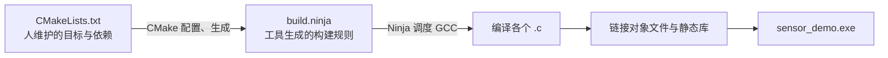
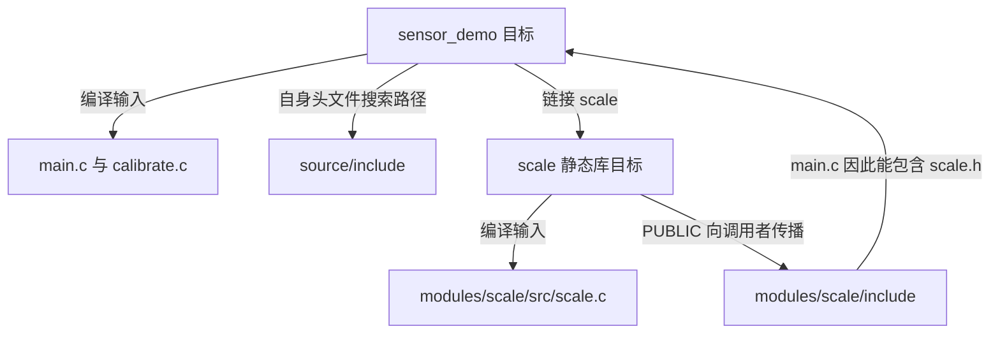

<!-- SPDX-License-Identifier: Apache-2.0 -->

# 第1章\_把源文件和库加入构建

你已经写好一个 C 函数，把 .c 和 .h 保存进工程，编译却报告找不到实现。文件明明在这里，为什么构建工具像没看见？

本章用一个在电脑上运行的小程序回答这个问题。它把 21 乘以 2，再加 1，打印 43。我们先把它编译起来，然后亲手增加限幅文件，最后故意漏掉一个实现，区分配置、编译与链接三种失败。实验不需要 Zephyr、SDK 或开发板。

本章路线如下；每节入口会用相同编号标出当前位置，可以随时回来接上操作。


**本章导航**

- [1.1 构建系统需要一份明确的关系](#section-1-1)
- [1.2 先读完整的小程序](#section-1-2)
- [1.3 CMake 如何把它们连接起来](#section-1-3)
- [1.4 配置、构建、运行，分别观察](#section-1-4)
- [1.5 亲手加一个限幅文件](#section-1-5)
- [1.6 再漏一次已有实现，然后恢复](#section-1-6)

<a id="section-1-1"></a>

## 1.1\_构建系统需要一份明确的关系

当前位置：步骤 1.1，准备练习副本。


**CMake** 读取 CMakeLists.txt，生成构建规则；本实验选择 **Ninja** 执行这些规则，再由 **GNU 编译器集合（GNU Compiler Collection，GCC）** 中的 C 编译工具处理源码并完成链接。它们按职责接力，不是三种互相替代的编译器。

CMake 中的 **目标（target）** 代表一个可执行程序或库。假设一个目录里既有应用，也有测试程序，工具不能把每个 .c 都塞进两个程序：它们可能各有一个 main。因此需要明确写出“哪些源文件组成哪个目标”。头文件目录同样要告诉编译器，否则它不知道到哪里寻找声明。

本章的 CMakeLists.txt 是 CMake 约定读取的文件名，大小写也要保持；sensor_demo、scale 则是作者取的目标名。打开陌生工程，先从配置命令的 -S 找源码入口，再沿其中的 add_subdirectory 阅读子目录规则，比从文件夹名字猜构建关系可靠。



这条链把“配置成功”和“程序已经生成”分开了。第一步只是准备后面的工作；只有最后链接成功，我们才有可以运行的程序。遇到错误时，先看它卡在哪个阶段。

先在 UCRT64 Bash 中进入实验源码根目录，检查工具：

```bash
# 当前位置：实验源码根目录；使用 UCRT64 Bash。
gcc --version
```

这是编译器身份检查，只显示版本，不编译源码。后续主机实验应使用 UCRT64 的 GCC；若命令不存在，先安装本节列出的主机工具。

```bash
# 当前位置：实验源码根目录；使用 UCRT64 Bash。
cmake --version
```

确认 CMake 可启动并查看版本。它负责读取规则；下一条检查的 Ninja 才负责按生成的规则安排编译。

```bash
# 当前位置：实验源码根目录；使用 UCRT64 Bash。
ninja --version
```

显示 Ninja 版本即完成这项检查。这里只确认程序可用，还没有读取本章源码。

CMake 和 Ninja 复用[Zephyr 官方 Windows 安装步骤](../P01_zephyr_make_project/环境与依赖导航.md)准备的工具。本章是额外的 Windows 主机 C/C++ 实验，需要主机 GCC 时才在 UCRT64 执行 `pacman -S --needed mingw-w64-ucrt-x86_64-gcc`。这项 GCC 练习依赖与 Zephyr ARM 交叉编译器用途不同。

实验会用到三类目录：`learning/cmake/labs/host` 是随 Git 保存的原件；`build/learning-tools/host-textbook/source` 是你可修改的练习副本；旁边的 `build` 子目录将由 CMake 保存生成物。此刻后两者还没有建立。host-textbook、source、build 都是本例自定名称，-S/-B 会明确选择它们，并非工具靠名字自动发现。

先准备父目录和本次练习目录，再复制原件：

```bash
# 当前位置：实验源码根目录；使用 UCRT64 Bash。
mkdir -p build/learning-tools
```

-p 允许父目录已经存在；此步只准备存放实验的公共位置，不会复制材料，也不会创建固件。通常没有输出。

```bash
# 当前位置：实验源码根目录；使用 UCRT64 Bash。
mkdir build/learning-tools/host-textbook
```

建立这次练习专用目录，成功时通常没有输出。若提示目录已存在，先查看旧内容，另选名字并同步替换本章后续路径；不要在未知旧副本上继续覆盖。

```bash
# 当前位置：实验源码根目录；使用 UCRT64 Bash。
cp -R learning/cmake/labs/host build/learning-tools/host-textbook/source
```

-R 连同子目录复制材料。复制后可以在编辑器中检查目标目录；此步仍只是准备源文件，没有配置、编译或运行它们。

host-textbook 应是新目录；已存在就另取名字，并相应替换本章路径。所有命令继续从实验源码根目录执行，修改只发生在复制出的 source 中。

<a id="section-1-2"></a>

## 1.2\_先读完整的小程序

当前位置：步骤 1.2，追踪函数调用。


现在已经有了 source 副本，先打开其中的 src/main.c。这里的 source 指 `build/learning-tools/host-textbook/source`，并不是仓库里另一个待寻找的顶层目录。

这个小程序模拟一条数据处理链：原始数 21 先放大两倍，再加上校准量 1。函数刻意放在不同文件里，让我们能看见声明、实现与链接各承担什么。它不读取真实传感器，21 是固定实验输入。source/src/main.c 的有效代码如下：

```c
#include <stdio.h>
#include "scale.h"
#include "calibrate.h"

int main(void)
{
    int raw = 21; /* 固定输入，让每次构建后的结果可以比较。 */
    int scaled = scale_sample(raw); /* 库函数：21 变为 42。 */
    int result = calibrate(scaled); /* 应用函数：42 校准为 43。 */

    printf("value=%d\n", result);
    return result == 43 ? 0 : 1; /* 将业务结果转成进程退出码。 */
}
```

scale_sample 是可复用库中的乘法，calibrate 是本应用的校准。两个实现分别位于 source/modules/scale/src/scale.c 与 source/src/calibrate.c：

```c
/* modules/scale/src/scale.c */
#include "scale.h"

int scale_sample(int value)
{
    return value * 2; /* 接收调用者的值，不自行获取传感器数据。 */
}
```

```c
/* src/calibrate.c */
#include "calibrate.h"

int calibrate(int value)
{
    int corrected = value + 1; /* 后面的调试实验将在这一行暂停。 */
    return corrected;
}
```

两个公共头文件各自提供声明。LESSON_SCALE_H 与 LESSON_CALIBRATE_H 是作者自定的头文件保护宏，沿用你在 C 工程中熟悉的 #ifndef/#define 写法；名字要各自唯一，不决定源码属于哪个构建目标。source/modules/scale/include/scale.h 是：

```c
#ifndef LESSON_SCALE_H
#define LESSON_SCALE_H
int scale_sample(int value);
#endif
```

source/include/calibrate.h 是：

```c
#ifndef LESSON_CALIBRATE_H
#define LESSON_CALIBRATE_H
int calibrate(int value);
#endif
```

头文件保护避免重复包含。沿 main 的顺序代入一次：raw 为 21，scale_sample 返回 42，calibrate 返回 43，printf 显示 value=43，main 返回 0。后面换源码或构建配置时，就用这条数据链判断结果，而不是把 43 当成必须背下来的口令。

`#include` 让编译器看到声明，并没有把另一个 .c 的实现复制进来。main.c 能通过编译与最后能链接成程序，是两个需要分别满足的条件。下面就把这组 C 文件交给构建系统。

<a id="section-1-3"></a>

## 1.3\_CMake 如何把它们连接起来

当前位置：步骤 1.3，连接构建目标。


C 函数之间的调用已经清楚了，但 CMake 不会分析这些调用后替我们寻找实现。source/CMakeLists.txt 要把文件归属写出来。下面的规则已经在复制品中，先对照阅读，不必重复手工输入：

```cmake
cmake_minimum_required(VERSION 3.20) # 要求 CMake 至少为此版本。
project(source_and_module C) # source_and_module 是项目名，C 是所用语言。
# 导出每个 C 文件的真实编译参数，稍后据此检查是否参与构建。
set(CMAKE_EXPORT_COMPILE_COMMANDS ON)
# 教学用开关；默认 OFF，即不故意遗漏校准实现。
option(LESSON_OMIT_CALIBRATION "Deliberately omit a required source to observe a link error" OFF)

# 先读取库的规则，再为应用创建自己的目标。
add_subdirectory(modules/scale)
add_executable(sensor_demo src/main.c)
target_include_directories(sensor_demo PRIVATE include) # 只给此目标添加搜索路径。
if(NOT LESSON_OMIT_CALIBRATION) # NOT 取反：开关 OFF 时才登记实现。
  target_sources(sensor_demo PRIVATE src/calibrate.c)
endif()
target_link_libraries(sensor_demo PRIVATE scale)

# 测试运行已经构建的程序，用输出规则判断这一项是否通过。
enable_testing()
add_test(NAME sensor_output COMMAND sensor_demo) # NAME 后是测试名，COMMAND 后是目标。
set_tests_properties(sensor_output PROPERTIES PASS_REGULAR_EXPRESSION "value=43") # 设置输出匹配属性。
```

add_executable 建立程序目标，target_sources 给它增加实现文件；target_include_directories 让编译器能找到本应用的头文件。PRIVATE 表示这些要求只作用于当前目标。

add_subdirectory 执行子目录的 CMakeLists.txt。本例 source/modules/scale/CMakeLists.txt 只有：

```cmake
add_library(scale STATIC src/scale.c) # STATIC 选择静态库，链接时取用其中的实现。
# 库自身和链接它的调用者都需要能找到 scale.h。
target_include_directories(scale PUBLIC include)
```

STATIC 创建静态库，PUBLIC 表示头文件目录既给库自己用，也传给链接它的调用者。主目标通过 target_link_libraries 建立依赖，因此 main.c 能找到 scale.h，链接时也能取得 scale_sample。只执行 add_subdirectory，不表示所有程序会自动链接这个库。

这三个 CMake 关键字按“要求给谁用”区分：PRIVATE 只给目标自身，PUBLIC 同时给自身和调用者，INTERFACE 只向调用者提供使用要求。本例库的头文件两侧都需要，所以用 PUBLIC。先沿这个例子理解传播，再在需要纯接口目标时使用 INTERFACE；不要用全局 include 目录把所有关系混在一起。

注意这两处 include 不是同一个目录。主规则中的 include 相对 source；子目录规则中的 include 相对 source/modules/scale。PRIVATE/PUBLIC 控制使用要求传给谁，不改变路径的起点。可对照 [target_include_directories 的路径与作用域规则](https://cmake.org/cmake/help/latest/command/target_include_directories.html)核对这一区别。



沿图检查一个新函数，需要同时找声明可见的路径和提供实现的目标。给 include 加再多目录，也不能替代缺失的 .c 或库。

末尾的 **CTest** 是 CMake 配套的测试执行器。sensor_output 是本例取的测试名，COMMAND 指向要运行的目标，PASS_REGULAR_EXPRESSION 要求输出匹配 value=43。这里有个容易忽略的边界：设置这个属性后，普通进程退出码不再作为这项测试的判据；直接运行程序时仍可单独检查退出码。因此本章会分别观察输出、退出码和 CTest 报告，不说一个绿色报告同时证明了三件事。规则依据见 [PASS_REGULAR_EXPRESSION](https://cmake.org/cmake/help/latest/prop_test/PASS_REGULAR_EXPRESSION.html)。

<a id="section-1-4"></a>

## 1.4\_配置、构建、运行，分别观察

当前位置：步骤 1.4，构建并运行。


源文件与规则都已具备，现在让工具真的走一遍。终端继续停在仓库根，先配置，再构建，最后运行和测试；每一步成功后再继续。

```bash
# 当前位置：实验源码根目录；使用 UCRT64 Bash。
cmake -S build/learning-tools/host-textbook/source -B build/learning-tools/host-textbook/build -G Ninja -DCMAKE_C_COMPILER=gcc -DCMAKE_BUILD_TYPE=Debug
```

这里 -S 选择源码，-B 选择生成物目录；-G Ninja 选择规则格式，-DCMAKE_C_COMPILER=gcc 指定主机 C 编译器，-DCMAKE_BUILD_TYPE=Debug 选择适合源码单步的构建设置。成功后会显示生成位置；这时规则已准备好，下一步才真正编译链接。

```bash
# 当前位置：实验源码根目录；使用 UCRT64 Bash。
cmake --build build/learning-tools/host-textbook/build
```

读取 --build 后那个目录中已生成的规则，完成需要的编译与链接。出现错误就停在此处看第一条具体错误；成功后才继续检查配置、运行程序或测试。没有改动时提示 no work to do 是正常的。

```bash
# 当前位置：实验源码根目录；使用 UCRT64 Bash。
./build/learning-tools/host-textbook/build/sensor_demo.exe
```

直接启动刚生成的主机程序。观察 value= 后的数，并按本节的数据处理链判断它；这一步才真正执行了 C 函数。

```bash
# 当前位置：实验源码根目录；使用 UCRT64 Bash。
ctest --test-dir build/learning-tools/host-textbook/build --output-on-failure
```

--test-dir 选择已有构建目录，--output-on-failure 让失败时带出测试输出。应看到 1/1 通过；它运行测试，并不会替你补做前面失败的编译。

到这里，应已看见程序输出 value=43、CTest 报告 1/1 通过。Debug 保留适合调试的构建设置，下一专题会用它停在 C 源码行上。Linux/macOS 的可执行文件没有 .exe，其他目录关系相同。

再执行一次 --build，通常会看到 no work to do。Ninja 根据依赖和时间戳决定要重做什么，不必每次编译全部文件。需要观察实际编译命令时加 --verbose；compile_commands.json 则保存每个源码文件的编译参数，编辑器也可读取它来理解宏与头文件。

<a id="section-1-5"></a>

## 1.5\_亲手加一个限幅文件

当前位置：步骤 1.5，加入限幅文件。


刚才得到 43，说明原来的两步处理已接通。现在增加一个实际要求：最终值不能超过 40。我们保留放大与校准，再把它们的结果送入限幅函数。这样既能看见功能变化，又能验证“新文件怎样加入已有目标”。

以下三个文件的原件也保存在 labs/solutions，便于对照；本节直接给出完整内容。用编辑器在 `build/learning-tools/host-textbook/source/include/limit.h` 新建文件，写入：

```c
#pragma once
int limit_value(int value, int maximum);
```

再在同一副本的 source/src/limit.c 新建实现：

```c
#include "limit.h"

int limit_value(int value, int maximum)
{
    return value > maximum ? maximum : value; /* 超过上限才截断，否则保留原值。 */
}
```

把 source/src/main.c 改成下面的完整版本：

```c
#include <stdio.h>
#include "scale.h"
#include "calibrate.h"
#include "limit.h"

int main(void)
{
    int raw = 21;
    int scaled = scale_sample(raw);
    int result = limit_value(calibrate(scaled), 40); /* 先校准为 43，再限为 40。 */

    printf("value=%d\n", result);
    return result == 40 ? 0 : 1;
}
```

保存这三个文件后，先沿调用算一遍：21 → 42 → 43 → 40。新的 main 返回条件也已经改为 40。但先不要在 CMakeLists.txt 登记 limit.c；我们要故意保留“文件在磁盘、实现不在目标里”的状态，再构建：

```bash
# 当前位置：实验源码根目录；使用 UCRT64 Bash。
cmake --build build/learning-tools/host-textbook/build
echo $?
```

这是故意失败的构建。立即读取的退出码应非 0；核对下面指出的缺失符号后再恢复。不要在失败后运行可能残留的旧程序。

这里出现红色链接错误是预期结果。应能找到 limit_value 未定义的信息，紧接着的退出码非 0。若错误是 limit.h 找不到，说明还没走到我们要观察的阶段，先核对新头文件是否放进 source/include。也不要去运行旧的可执行文件来判断这次修改是否成功：构建失败后它可能仍是上一次的版本。

在 source/CMakeLists.txt 的 add_executable 后增加一行：

```cmake
target_sources(sensor_demo PRIVATE src/limit.c)
```

同时把末尾 PASS_REGULAR_EXPRESSION 的 value=43 改成 value=40，因为我们已经明确改变了应用要求。再次构建、运行与测试：

```bash
# 当前位置：实验源码根目录；使用 UCRT64 Bash。
cmake --build build/learning-tools/host-textbook/build
```

继续构建 build 目录中的这组规则。应完成编译链接；若没有需要重做的输入，no work to do 也表示这一步成功。先处理构建错误，再继续使用本次产物。

```bash
# 当前位置：实验源码根目录；使用 UCRT64 Bash。
./build/learning-tools/host-textbook/build/sensor_demo.exe
```

直接启动刚生成的主机程序。观察 value= 后的数，并按本节的数据处理链判断它；这一步才真正执行了 C 函数。

```bash
# 当前位置：实验源码根目录；使用 UCRT64 Bash。
ctest --test-dir build/learning-tools/host-textbook/build --output-on-failure
```

--test-dir 选择已有构建目录，--output-on-failure 让失败时带出测试输出。应看到 1/1 通过；它运行测试，并不会替你补做前面失败的编译。

```bash
# 当前位置：实验源码根目录；使用 UCRT64 Bash。
rg -n "limit.c" build/learning-tools/host-textbook/build/compile_commands.json
```

在生成的编译数据库中寻找该源文件。找到条目说明它被登记为编译输入；它本身不能证明程序已经执行。显式给出文件路径时，无须遍历整个构建目录。

应输出 40、测试通过，编译数据库出现 limit.c。CMakeLists 改动通常触发重新生成规则，无须编辑生成的 build.ninja。

若报 limit.h 找不到，先查文件位置和 include 使用要求；若只有链接未定义，查实现是否归属目标。这两种错误分别发生在不同阶段，不能都靠添加头文件目录解决。

<a id="section-1-6"></a>

## 1.6\_再漏一次已有实现，然后恢复

当前位置：步骤 1.6，排错与恢复。


新增文件已经接通，现在用一个已有文件做相反实验：不删除 calibrate.c，只改变规则，让它暂时不属于 sensor_demo。前面预留的 LESSON_OMIT_CALIBRATION 正好控制这个条件。先设为 ON，再观察构建失败；恢复 OFF 之后才能继续测试：

```bash
# 当前位置：实验源码根目录；使用 UCRT64 Bash。
cmake -S build/learning-tools/host-textbook/source -B build/learning-tools/host-textbook/build -DLESSON_OMIT_CALIBRATION=ON
```

给同一个构建目录保存 ON，重新生成不含 calibrate.c 的规则。此时配置可以成功；下一步链接才会暴露应用仍调用 calibrate 的问题。

```bash
# 当前位置：实验源码根目录；使用 UCRT64 Bash。
cmake --build build/learning-tools/host-textbook/build
echo $?
```

这是故意失败的构建。立即读取的退出码应非 0；核对下面指出的缺失符号后再恢复。不要在失败后运行可能残留的旧程序。

```bash
# 当前位置：实验源码根目录；使用 UCRT64 Bash。
cmake -S build/learning-tools/host-textbook/source -B build/learning-tools/host-textbook/build -DLESSON_OMIT_CALIBRATION=OFF
```

明确将缓存中的开关恢复为 OFF，让规则重新包含 calibrate.c。只把命令中的 -D 删掉不会清除上一次缓存值，所以这里必须写出恢复值。

```bash
# 当前位置：实验源码根目录；使用 UCRT64 Bash。
cmake --build build/learning-tools/host-textbook/build
```

继续构建 build 目录中的这组规则。应完成编译链接；若没有需要重做的输入，no work to do 也表示这一步成功。先处理构建错误，再继续使用本次产物。

```bash
# 当前位置：实验源码根目录；使用 UCRT64 Bash。
ctest --test-dir build/learning-tools/host-textbook/build --output-on-failure
```

--test-dir 选择已有构建目录，--output-on-failure 让失败时带出测试输出。应看到 1/1 通过；它运行测试，并不会替你补做前面失败的编译。

ON 时应链接失败，错误指向 calibrate；OFF 后恢复通过。参数保存在构建目录的缓存中，所以恢复时要明确写 OFF。若换编译器或生成器，通常使用新的 -B 目录，避免把旧缓存带入新组合。

练习：让最大值变成 50。原始计算仍是 43，因此程序应输出 43，返回值检查与测试期望也应对应 43；不能机械把三个 40 都改成 50。这里需要理解计算过程，而不是只搜索替换数字。

当前 Zephyr 应用使用名为 app 的目标，在 find_package(Zephyr) 之后增加业务文件时，同样用 target_sources(app PRIVATE ...)；一般业务文件不必立即抽成模块。下一章再处理需要独立发现、配置和复用的模块。

[CMake 的目标使用要求](https://cmake.org/cmake/help/latest/command/target_link_libraries.html)供核对传播规则。[下一章](P002_接入Zephyr模块.md) · [大纲](大纲.md)
