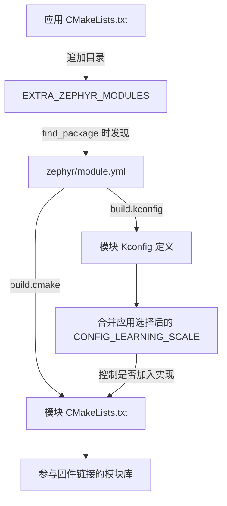

<!-- SPDX-License-Identifier: Apache-2.0 -->

# 第2章\_接入 Zephyr 模块

上一章把一个普通 C 库链接到主机程序。现在想让同一组功能在 Zephyr 应用中可选择地启用：开启时编译库，关闭时应用仍能构建。仅把目录复制进仓库，还缺“从哪里读规则”和“是否启用”两件事。

这就是本章要建立的最小模块。我们只做模块发现、配置与编译；运行测试留到 Twister/QEMU 章节。不要为了看懂怎样接入一个目录，先背另一套测试工具的选项。

本章路线如下；每节入口会用相同编号标出当前位置，可以随时回来接上操作。


**本章导航**

- [2.1 三个叫“模块”的东西，先按职责区分](#section-2-1)
- [2.2 先让一个目录被发现](#section-2-2)
- [2.3 再决定是否编译它](#section-3-1)
- [2.4 分别配置开启与关闭的构建](#section-3-2)
- [2.5 改一个条件，看看调用端会怎样](#section-4-1)
- [2.6 将这个模式用于项目](#section-4-2)

<a id="section-2-1"></a>

## 2.1\_三个叫“模块”的东西，先按职责区分

当前位置：步骤 2.1，准备模块副本。


上一章的 scale 库已经能被一个主机程序链接。换成 Zephyr 后，我们还希望工程能找到它的配置入口，并让应用选择是否使用它。**Zephyr 模块（Zephyr module）** 就是提供了这种接入信息的源码目录：它告诉 Zephyr 去哪里读构建规则和软件选项定义。

这里先分清三个对象：

- 普通 CMake 库是构建规则中的一个目标，解决哪些实现一起参与链接的问题。
- Zephyr module 是有接入入口的源码目录，解决构建系统到哪里找规则与配置的问题。
- west project 是清单管理的 Git 仓库，解决源码从哪里取得、选择哪个版本的问题。

本章整个实验仍在当前同一个 Git 仓库的练习副本里，不会因为复制出两个目录就产生两份 Git 历史。模块接入也不要求必须由 west 下载；我们会把现有目录直接交给 Zephyr。

复制完成后的布局如下，其中 enabled、disabled 是稍后才由 CMake 建立的构建目录：

```text
build/learning-tools/module-textbook/
  zephyr_app/       调用模块的应用；有 main.c、应用配置和入口规则
  zephyr_module/    被应用复用的功能；有选项定义和 scale_sample 实现
  enabled/         待生成：开启模块时的构建产物
  disabled/        待生成：关闭模块时的构建产物
```

两份源码必须保持并列位置；应用规则稍后会用 ../zephyr_module 找它的邻居。这里的名字是本例自定的目录名，真正的连接来自规则中的路径。

本章用仓库自带原件，不添加网络依赖。需要已安装 SDK 和项目 Python 环境；在实验源码根目录打开 UCRT64 Bash，执行：

```bash
# 当前位置：实验源码根目录；使用 UCRT64 Bash。
source .venv/Scripts/activate
```

让当前 Bash 的 python 优先使用仓库根 .venv。source 修改的是这个终端的环境，通常没有独立输出；它不创建环境，也不替其他已打开窗口切换解释器。

```bash
# 当前位置：实验源码根目录；使用 UCRT64 Bash。
python -m pip check
cmake --version
ninja --version
```

核对 Python 依赖和主机工具；SDK 与模块路径按准备章在当前终端设置。检查失败时先修复相应输入，再继续实验。

```bash
# 当前位置：实验源码根目录；使用 UCRT64 Bash。
mkdir build/learning-tools/module-textbook
```

建立这次练习专用目录，成功时通常没有输出。若提示目录已存在，先查看旧内容，另选名字并同步替换本章后续路径；不要在未知旧副本上继续覆盖。

```bash
# 当前位置：实验源码根目录；使用 UCRT64 Bash。
cp -R learning/cmake/labs/zephyr_app build/learning-tools/module-textbook/zephyr_app
```

-R 连同子目录复制材料。复制后可以在编辑器中检查目标目录；此步仍只是准备源文件，没有配置、编译或运行它们。

```bash
# 当前位置：实验源码根目录；使用 UCRT64 Bash。
cp -R learning/cmake/labs/zephyr_module build/learning-tools/module-textbook/zephyr_module
```

-R 连同子目录复制材料。复制后可以在编辑器中检查目标目录；此步仍只是准备源文件，没有配置、编译或运行它们。

若尚无 .venv，先按准备章完成原生工具与 CMSIS_6 准备；版本检查不会替你创建模块。module-textbook 必须是新目录。以下始终从实验源码根目录执行，只编辑这份复制品。

<a id="section-2-2"></a>

## 2.2\_先让一个目录被发现

当前位置：步骤 2.2，登记发现入口。


副本已经准备好，但 Zephyr 还不会因为旁边有个目录就采用它。先打开 zephyr_module/zephyr/module.yml，看模块怎样自我介绍。module.yml 位于 zephyr 子目录是本例使用的标准元数据入口；模块名 learning_scale 则由作者命名。

zephyr_module 的内容很小：

```text
zephyr_module/
  zephyr/module.yml
  CMakeLists.txt
  Kconfig
  include/scale.h
  src/scale.c
```

zephyr/module.yml 的完整内容是：

```yaml
name: learning_scale
build:
  # 相对模块根目录，指向包含 CMakeLists.txt 的目录。
  cmake: .
  # 相对模块根目录，指向选项定义文件。
  kconfig: Kconfig
```

name 是模块名；cmake 指模块根目录下的 CMake 入口所在目录，点表示根目录本身；kconfig 指选项定义文件。路径相对模块根，不相对 shell 当前目录。元数据说明“如何接入”，还没有决定开关是否打开。

应用 zephyr_app/CMakeLists.txt 完整如下：

其中 `$ENV{...}` 读取终端环境，`CMAKE_CURRENT_LIST_DIR` 是当前配置文件所在目录；`ZEPHYR_MODULES` 是 Zephyr 原生模块列表输入，沿用准备章 0.4 节为本实验设置的单个 CMSIS 路径。条件中的 `EXISTS` 检查路径存在，`NOT` 取反，`OR` 连接任一缺失条件，`FATAL_ERROR` 让配置停止并显示原因。包查找的 `CONFIG` 选择配置文件模式，`PATHS` 给出查找位置，`NO_DEFAULT_PATH` 禁用其他默认搜索位置。这些都是 CMake 的语法或参数，不是需要另行安装的模块。

```cmake
cmake_minimum_required(VERSION 3.28.0)
# 由准备章 0.4 节当前终端提供 Zephyr 原生的源码与模块输入。
# 此单模块实验只接受一个 CMSIS 路径；ZEPHYR_MODULES 通用接口可以是列表。
set(ZEPHYR_BASE "$ENV{ZEPHYR_BASE}")
set(ZEPHYR_MODULES "$ENV{ZEPHYR_MODULES}")
if(NOT EXISTS "${ZEPHYR_BASE}/VERSION" OR NOT EXISTS "${ZEPHYR_MODULES}/zephyr/module.yml")
  message(FATAL_ERROR "Follow P000: set ZEPHYR_BASE and ZEPHYR_MODULES")
endif()
# 当前实验模块与应用相邻；它不是另一个 Zephyr 源码根。
list(APPEND EXTRA_ZEPHYR_MODULES "${CMAKE_CURRENT_LIST_DIR}/../zephyr_module")
find_package(Zephyr REQUIRED CONFIG
  PATHS "${ZEPHYR_BASE}/share/zephyr-package/cmake" NO_DEFAULT_PATH)
project(learning_module)
target_sources(app PRIVATE src/main.c)
```

`CMAKE_CURRENT_LIST_DIR` 是当前 CMake 文件所在目录；`${...}` 读取 CMake 变量，`$ENV{...}` 读取启动它的终端环境。准备章将 `ZEPHYR_BASE` 指向 G 盘实验源码，将 `ZEPHYR_MODULES` 指向工程准备 P002 的 2.6.2 节下载的 CMSIS_6。这里检查文件存在后才配置，缺少输入会停止，而不会从电脑上另一份源码补齐。

`ZEPHYR_MODULES` 显式选择基础模块，`PATHS ... NO_DEFAULT_PATH` 将 Zephyr 包查找限定在指定源码的接入目录。应用复制到不同深度时，仍由同一组明确输入选择源码，不再依赖“向上四层”的目录巧合。

EXTRA_ZEPHYR_MODULES 追加我们的目录，find_package(Zephyr REQUIRED) 才开始 Zephyr 的配置过程，并要求找不到时停止。追加必须发生在 find_package 之前，因为模块发现就在这个过程中完成。应用最终仍通过 target_sources 给 app 目标增加自己的 main.c。



图中先发现模块，再计算软件选择，最后由选择控制实现是否编入。模块即使被发现，也可以处于关闭状态。可以在实验源码的 `doc/develop/modules.rst` 中对照 `module.yml` 与 `EXTRA_ZEPHYR_MODULES` 的入口规则；源码位置与实验模块的位置分别提供。

<a id="section-3-1"></a>

## 2.3\_再决定是否编译它

当前位置：步骤 2.3，连接软件开关。


发现解决了“到哪里读规则”，还没解决“本次是否需要这个功能”。我们用 **Kconfig** 定义一个只能开或关的软件选项，再让应用提出选择。复杂依赖留到板级章节，本章只追踪这一个开关。模块 Kconfig 内容为：

```kconfig
config LEARNING_SCALE
    bool "Enable the learning scale module"
    default y
    help
      Compile the small demonstration module and expose its header.
```

它定义名字与类型，默认启用。应用的 prj.conf 请求 `CONFIG_LEARNING_SCALE=y`，no_module.conf 请求 `CONFIG_LEARNING_SCALE=n`。定义时名字不带 CONFIG_，应用配置和生成结果带这个前缀。

模块 CMakeLists.txt 把开关接到构建：

```cmake
if(CONFIG_LEARNING_SCALE)
  # 建立模块库，并把实现和头文件路径接入 Zephyr 构建。
  zephyr_library()
  zephyr_library_sources(src/scale.c)
  zephyr_include_directories(include)
endif()
```

只有开启时才建库、加入源文件并提供头文件目录。zephyr_library 系列函数由 Zephyr 提供，参与它的构建组织，不是 CMake 自带同名命令。

src/scale.c 的有效代码如下：

```c
#include "scale.h"

int scale_sample(int value)
{
    return value * 2; /* 将调用者提供的样本放大两倍。 */
}
```

include/scale.h 的完整有效内容为，LEARNING_SCALE_H 仍是普通 C 头文件保护宏：

```c
#ifndef LEARNING_SCALE_H
#define LEARNING_SCALE_H
int scale_sample(int value);
#endif
```

应用的完整 main.c 为：

```c
#include <zephyr/kernel.h>
#include <zephyr/sys/printk.h>
#ifdef CONFIG_LEARNING_SCALE
#include "scale.h"
#endif

int main(void)
{
#ifdef CONFIG_LEARNING_SCALE
    /* 只有实现参与构建时，才保留这条调用。 */
    printk("module result=%d\n", scale_sample(21));
#else
    /* 关闭时仍有完整的应用路径，不引用 scale_sample。 */
    printk("module disabled\n");
#endif
    return 0;
}
```

printk 是 Zephyr 的输出函数。开启时，main 把 21 传入 scale_sample，返回 42，再用 %d 把它打印出来；关闭时，只留下打印 module disabled 的分支。这里的 #ifdef 在编译前选择代码，不是运行时 if：关闭的固件并不会先调用函数再决定忽略结果。

Kconfig 的布尔 n 通常表现为生成头文件中没有定义该 CONFIG_ 宏，因此用 #ifdef 判断。应用与模块使用同一开关，关闭时既不编译库，也不留下调用，程序才仍然完整。若只关闭一侧，下一节的链接就可能失败。

<a id="section-3-2"></a>

## 2.4\_分别配置开启与关闭的构建

当前位置：步骤 2.4，对比两种构建。


现在把“同一开关控制两侧”的预测变成可检查的构建结果。选择已支持的模拟目标 mps2/an386，仅作可移植软件构建，不代表 HC32 板。本节不启动模拟器；ELF 是带程序内容、布局与符号信息的固件文件，先检查它能否生成。

先构建默认开启状态：

```bash
# 当前位置：实验源码根目录；使用 UCRT64 Bash。
cmake -S build/learning-tools/module-textbook/zephyr_app -B build/learning-tools/module-textbook/enabled -G Ninja -DBOARD=mps2/an386
```

-S 选择源码目录，-B 选择生成物目录，-G Ninja 选择构建规则格式；-D 将本次选择交给 CMake。此步成功通常以 Configuring done、Generating done 和生成位置结束，还没有生成可运行程序。

```bash
# 当前位置：实验源码根目录；使用 UCRT64 Bash。
cmake --build build/learning-tools/module-textbook/enabled
```

读取 --build 后那个目录中已生成的规则，完成需要的编译与链接。出现错误就停在此处看第一条具体错误；成功后才继续检查配置、运行程序或测试。没有改动时提示 no work to do 是正常的。

```bash
# 当前位置：实验源码根目录；使用 UCRT64 Bash。
rg -n "CONFIG_LEARNING_SCALE" build/learning-tools/module-textbook/enabled/zephyr/.config
```

查看构建系统合并后的模块选择。enabled 应显示 CONFIG_LEARNING_SCALE=y，disabled 应显示该选项未设置；以当前命令指定的目录为准。

```bash
# 当前位置：实验源码根目录；使用 UCRT64 Bash。
rg -n "zephyr_module.*scale.c" build/learning-tools/module-textbook/enabled/compile_commands.json
```

在生成的编译数据库中寻找该源文件。找到条目说明它被登记为编译输入；它本身不能证明程序已经执行。显式给出文件路径时，无须遍历整个构建目录。

现在有三份相互对应的证据：.config 选中了模块，编译数据库登记了 scale.c，构建成功生成 ELF。它们共同支持“模块已编入”，仍不能替代下一专题的运行测试。

再使用独立目录关闭：

```bash
# 当前位置：实验源码根目录；使用 UCRT64 Bash。
cmake -S build/learning-tools/module-textbook/zephyr_app -B build/learning-tools/module-textbook/disabled -G Ninja -DBOARD=mps2/an386 -DEXTRA_CONF_FILE=no_module.conf
```

-S 选择源码目录，-B 选择生成物目录，-G Ninja 选择构建规则格式；-D 将本次选择交给 CMake。此步成功通常以 Configuring done、Generating done 和生成位置结束，还没有生成可运行程序。 EXTRA_CONF_FILE 指向附加的软件配置；它按应用源码目录解析，并在默认应用配置之后合并。

```bash
# 当前位置：实验源码根目录；使用 UCRT64 Bash。
cmake --build build/learning-tools/module-textbook/disabled
```

继续构建 disabled 目录中的这组规则。应完成编译链接；若没有需要重做的输入，no work to do 也表示这一步成功。先处理构建错误，再继续使用本次产物。

```bash
# 当前位置：实验源码根目录；使用 UCRT64 Bash。
rg -n "CONFIG_LEARNING_SCALE" build/learning-tools/module-textbook/disabled/zephyr/.config
```

查看构建系统合并后的模块选择。enabled 应显示 CONFIG_LEARNING_SCALE=y，disabled 应显示该选项未设置；以当前命令指定的目录为准。

```bash
# 当前位置：实验源码根目录；使用 UCRT64 Bash。
rg -n "zephyr_module.*scale.c" build/learning-tools/module-textbook/disabled/compile_commands.json
echo $?
```

这次专门确认已关闭的模块源码不在编译数据库里。没有匹配、退出码为 1 才符合预测；若为 2，通常是路径或文件读取错误，需要先排除。

对照两组结果：同一个模块目录都被发现了，只有 enabled 将 scale.c 登记为编译输入；disabled 的应用则走不调用该函数的分支。模块被发现与源码被编入，从这里就能分别观察。

<a id="section-4-1"></a>

## 2.5\_改一个条件，看看调用端会怎样

当前位置：步骤 2.5，制造并修复缺项。


两种配置都能构建，还不足以解释条件编译为什么必要。现在保持模块关闭，单独让调用端忘记这个条件：main 无论开关如何都调用 scale_sample。先备份复制品 main.c，失败后能原样恢复：

```bash
# 当前位置：实验源码根目录；使用 UCRT64 Bash。
cp build/learning-tools/module-textbook/zephyr_app/src/main.c build/learning-tools/module-textbook/main-before.c
```

把当前文件复制为本章的恢复点。备份成功通常没有输出；下一步只改练习副本，恢复时再从这份备份复制回来。

新的完整 main.c：

```c
#include <zephyr/sys/printk.h>

int scale_sample(int value); /* 故意只给声明，隔离掉头文件查找问题。 */

int main(void)
{
    printk("module result=%d\n", scale_sample(21));
    return 0;
}
```

此处直接给出函数声明，故意排除头文件找不到的干扰，让我们观察链接阶段。构建关闭状态：

```bash
# 当前位置：实验源码根目录；使用 UCRT64 Bash。
cmake --build build/learning-tools/module-textbook/disabled
echo $?
```

这是故意失败的构建。立即读取的退出码应非 0；核对下面指出的缺失符号后再恢复。不要在失败后运行可能残留的旧程序。

应报告 scale_sample 未定义：应用仍调用，模块却没有提供实现。恢复备份，再重建两种状态：

```bash
# 当前位置：实验源码根目录；使用 UCRT64 Bash。
cp build/learning-tools/module-textbook/main-before.c build/learning-tools/module-textbook/zephyr_app/src/main.c
```

把备份内容覆盖回练习副本，撤销刚才的故意修改。复制成功没有输出；是否恢复到可用状态，还要由紧随其后的构建或测试确认。

```bash
# 当前位置：实验源码根目录；使用 UCRT64 Bash。
cmake --build build/learning-tools/module-textbook/disabled
```

继续构建 disabled 目录中的这组规则。应完成编译链接；若没有需要重做的输入，no work to do 也表示这一步成功。先处理构建错误，再继续使用本次产物。

```bash
# 当前位置：实验源码根目录；使用 UCRT64 Bash。
cmake --build build/learning-tools/module-textbook/enabled
```

继续构建 enabled 目录中的这组规则。应完成编译链接；若没有需要重做的输入，no work to do 也表示这一步成功。先处理构建错误，再继续使用本次产物。

都应通过。找不到选项定义时查模块发现与 Kconfig 入口；找不到头文件查模块开关与 include；链接缺实现查源文件是否编入及调用条件。每种错误都有一个可以检查的连接点。

<a id="section-4-2"></a>

## 2.6\_将这个模式用于项目

当前位置：步骤 2.6，迁移与恢复。


恢复后，enabled 与 disabled 又分别拥有完整的调用关系。将这个办法带回自己的工程时，先看复用需求：新增普通业务文件可直接加入 app；多个应用共用并需要独立开关时，再给它模块入口。模块化增加了发现和配置环节，它的价值在于明确这些接入关系。

接入外部模块还要管理版本、许可证与来源。对于长期基础依赖，应记录来源与版本，并同步清单及模块选择规则，让其他读者也能取得同一份输入。

练习把复制品 scale.c 的倍数改成 3，再构建 enabled。编译数据库仍包含同一文件，构建日志应重新编译它；disabled 不受这个实现的业务变化影响。按源码推算，开启后的输出会是 63，但本章尚未运行它，不把推算写成实测。练习后恢复倍数 2，给后面运行测试留下统一起点。

[Zephyr 模块元数据说明](https://docs.zephyrproject.org/latest/develop/modules.html)用于核对入口关系。[上一章](P001_把源文件和库加入构建.md) · [大纲](大纲.md)
