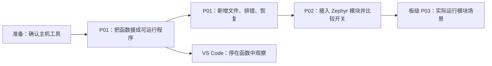

<!-- SPDX-License-Identifier: Apache-2.0 -->

# CMake：把新增代码变成真实产物

读者已会写 C/C++，从构建目标、使用要求和模块发现开始补齐工具知识。

先围绕同一个小程序走通“21 → 42 → 43”，再增加限幅、故意漏掉实现，亲眼区分声明可见与链接完整。第二章把已理解的库关系带入 Zephyr，增加模块发现与软件开关，每次只多解决一个问题。

每章用固定步骤图标出当前位置，命令与解释就地配对。材料目录保存同一份带注释源码；编辑的是练习副本，生成物在独立构建目录。先完成主机程序，再按需要走向调试或 Zephyr 模块。

1. [把源文件和库加入构建](P01_把源文件和库加入构建.md)：主机编译、漏实现失败、恢复与新增文件练习。
2. [接入 Zephyr 模块](P02_接入Zephyr模块.md)：模块入口、软件开关、两种配置编译与调用条件；不提前引入 Twister。

前提：[实验准备](../P00_实验准备.md)。第一章无需 SDK；第二章需要[工程环境](../../project-docs/environment.md)。正文内逐步实验，配套目录保存原件。完成第一章后即可进入 [VS Code 调试](../vscode/大纲.md)。
