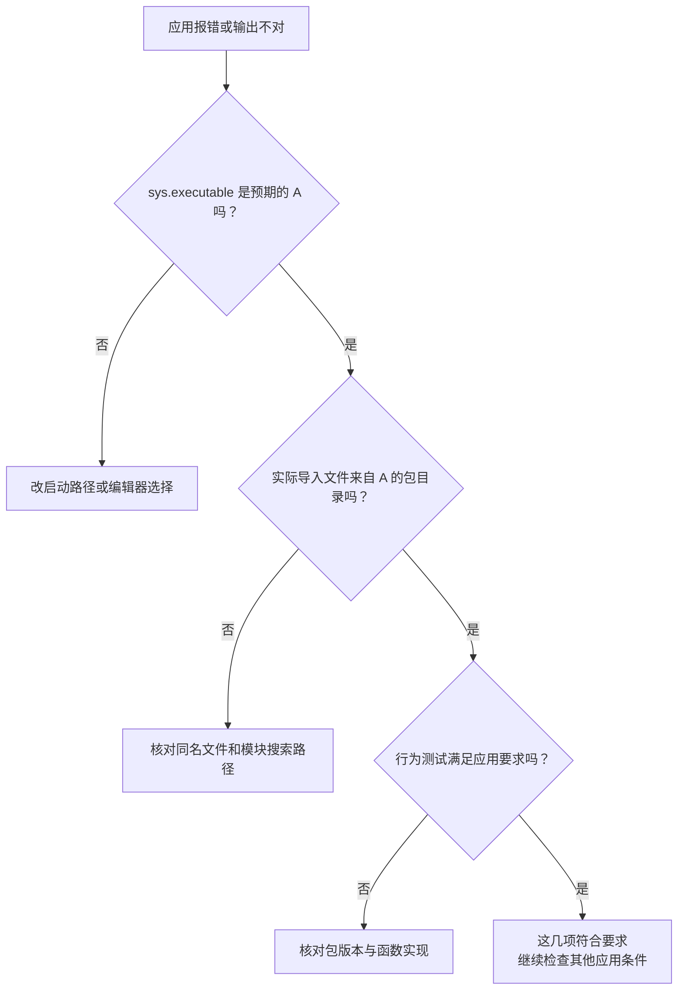
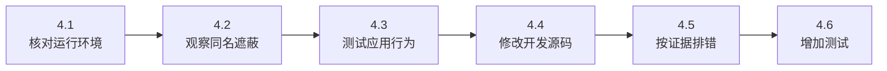
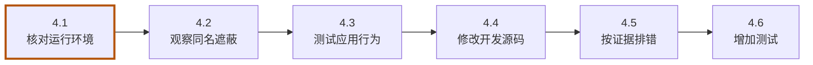
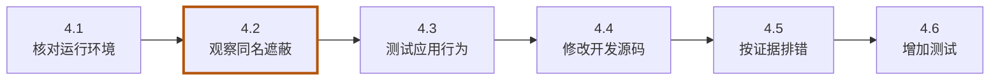
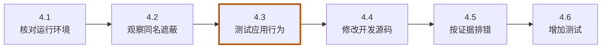
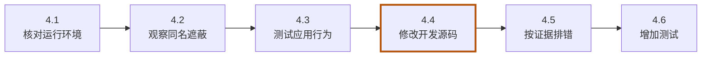
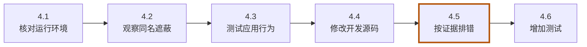
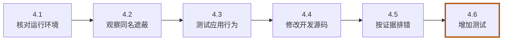

<!-- SPDX-FileCopyrightText: Copyright The zephyr_hc32f4a0 Contributors -->
<!-- SPDX-License-Identifier: Apache-2.0 -->

# 第4章\_排错与工程使用习惯

上一章已经用相同材料在新环境中重现了第一版输出。回到日常开发，如果照着记录安装后仍然运行不对，就需要查清“安装结果”到“程序行为”之间究竟哪一步变了：后续程序可能由另一份 Python 执行，也可能找到了错误的同名文件；即使代码来源正确，行为仍可能不符合应用要求。

本章沿着这三种可能往下查。沿用前三章的 venv-textbook，A/B 均恢复为第一版，bootstrap 中保留 setuptools 的 wheel。新窗口从实验源码根目录执行 `cd build/learning-tools/venv-textbook` 即可接续，不必激活。

> **这一章会故意把能运行的程序弄坏，再把它修回来。** 先确认 A 能输出 v1。每次只改一个条件，看到错误后不要急着重装所有环境；我们需要错误来告诉自己“哪一层变了”。照下面的顺序查，前一层正确以后再往下走。



图中每个菱形都对应一条证据。不要因为“pip 安装成功”就直接跳到最后：安装记录无法替第一层选择解释器，也无法替第二层确认实际导入来源。

本章按下面的步骤推进；各节会重现这张路线图，并标出当前位置。图用于找回进度，具体命令在对应步骤中执行。



**本章导航**

- [4.1 先确认谁在运行](#section-4-1)
- [4.2 制造一次“安装正确、导入错误”](#section-4-2)
- [4.3 让程序自己检查行为](#section-4-3)
- [4.4 开发源码如何直接影响环境](#section-4-4)
- [4.5 用已有证据安排排错顺序](#section-4-5)
- [4.6 练习：保护一个新的调用](#section-4-6)

<a id="section-4-1"></a>

## 4.1\_先确认谁在运行

**当前位置：步骤 4.1「核对运行环境」；黄色节点表示本节。**



先沿已经能工作的 A 取得一组参照：由谁运行，pip 属于哪里，安装记录写了哪个版本，实际导入文件又在哪里。这里保持解释器不变，用实际执行 app/main.py 的 A 逐项查询：

```bash
# 当前位置：build/learning-tools/venv-textbook；终端：UCRT64 Bash。
a/Scripts/python.exe -c "import sys; print(sys.executable)"
```

让本次 Python 亲自打印自己的可执行文件路径。用它确认短命令的选择，或确认显式写出的另一个环境路径确实绕过了激活状态。

```bash
# 当前位置：build/learning-tools/venv-textbook；终端：UCRT64 Bash。
a/Scripts/python.exe -m pip --version
```

显示 A 这一个 Python 所调用的 pip 的版本和安装位置，用来排除 pip 与运行解释器不属于同一环境。

```bash
# 当前位置：build/learning-tools/venv-textbook；终端：UCRT64 Bash。
a/Scripts/python.exe -m pip show lab-greeting
```

查询 A 中 lab-greeting 的发行包信息，重点看 Version 和 Location；查得到并不证明 import 实际选中了这里的代码。

```bash
# 当前位置：build/learning-tools/venv-textbook；终端：UCRT64 Bash。
a/Scripts/python.exe -c "import lab_greeting; print(lab_greeting.__file__)"
```

导入模块并打印它的源码位置，用这条路径确认实际读到了哪份代码；不要用 pip 已安装的记录替代这条运行证据。

第一条确认执行者；第二条确认由它加载的 pip；第三条读安装记录；第四条读实际导入位置。正常情况下都应归属 A，包版本为 1.0.0。如果第一条已经不对，应先修复启动命令或编辑器解释器选择，不要在错误环境继续安装。

这里特意不混用裸写 python 和 pip，否则每条命令又可能被 PATH 选到别处。Bash 的 `type -a python pip` 可以帮助查看同名命令的查找结果，sys.executable 则报告这一次已经执行的事实。

<a id="section-4-2"></a>

## 4.2\_制造一次“安装正确、导入错误”

**当前位置：步骤 4.2「观察同名遮蔽」；黄色节点表示本节。**



上节在 A 中查询时，安装记录与实际导入位置应该相符。但运行 app/main.py 时，Python 还会考虑脚本目录中的代码，所以解释器选对了，也不保证总会选中环境里的那个包。下面保留 A 的第一版安装，只在应用目录增加一个同名文件，看看导入结果是否变化。

脚本所在目录通常会排在模块搜索路径前面。如果其中存在 lab_greeting.py，就可能先找到它，从而遮住环境里的 lab_greeting 包。这种同名对象影响查找的情况叫 **命名遮蔽（shadowing）**。

我们在 app 中新建一个故意不提供 greet 的文件，同时报告自身位置。**先看代码的用意：** `__file__` 是当前模块文件的位置，print 会把它显示出来。这个假模块没有定义 greet，因此应该在“找到文件”以后、“取得函数”时失败：

```bash
# 当前位置：build/learning-tools/venv-textbook；终端：UCRT64 Bash。
cat > app/lab_greeting.py <<'PY'
# 这行会在模块被导入时执行，用来暴露到底加载了哪份文件。
print("loaded local file:", __file__)
# 故意不定义 greet，让应用导入函数时失败。
PY
```

把上述文本写入 `app/lab_greeting.py`。引号括起的结束标记让 Bash 原样保存内容；这一刻只是创建或替换文件，没有执行其中的 Python，也没有自动同步清单中的仓库。

```bash
# 当前位置：build/learning-tools/venv-textbook；终端：UCRT64 Bash。
a/Scripts/python.exe app/main.py
echo $?
```

用 A 的解释器运行同一份 app/main.py。此处故意制造导入失败，应出现 ImportError 或 ModuleNotFoundError；紧接着读取退出码，预期非零。

```bash
# 当前位置：build/learning-tools/venv-textbook；终端：UCRT64 Bash。
a/Scripts/python.exe -m pip show lab-greeting
```

查询 A 中 lab-greeting 的发行包信息，重点看 Version 和 Location；查得到并不证明 import 实际选中了这里的代码。

输出应先指向 app/lab_greeting.py，再报告无法导入 greet；pip show 却仍是 1.0.0。这次已经找到名为 lab_greeting 的模块，只是其中没有应用要用的函数，与第二章“环境里根本没有安装包”的失败不同。安装记录没错，但运行选错了文件；重装问候包不会删除 app 中的同名文件，所以应修正造成遮蔽的对象。

把刚创建的文件改成不冲突的名字，然后启动新进程：

```bash
# 当前位置：build/learning-tools/venv-textbook；终端：UCRT64 Bash。
mv app/lab_greeting.py app/local_greeting_note.py
```

把故意遮蔽包名的 app/lab_greeting.py 改名为 local_greeting_note.py。文件内容保留，但下一次 import lab_greeting 不再被这个同名文件抢先截住。

```bash
# 当前位置：build/learning-tools/venv-textbook；终端：UCRT64 Bash。
a/Scripts/python.exe app/main.py
```

用 A 的解释器运行同一份 app/main.py。观察问候语中的版本标记，它来自这个环境当前导入的包。运行文件没有改变，改变的是解释器与安装版本的配套。

应恢复 hello board from v1。mv 只改名本实验文件，不动环境。如果实际工程有类似问题，可在报错位置附近打印被导入模块的 __file__，再打印 sys.path 查看搜索目录。不要为一次导入成功向全局路径无限追加目录，那往往把问题藏到下一个工程。

<a id="section-4-3"></a>

## 4.3\_让程序自己检查行为

**当前位置：步骤 4.3「测试应用行为」；黄色节点表示本节。**



移走同名文件后，A 又输出了 hello board from v1。这个结果由我们用眼睛确认：来源正确，而且这一次输出符合预期。但如果以后更换版本，或者修改 greet 的实现，还要检查不传参数等其他调用是否保持原来的行为。可以把这些已知要求写成程序，每次改动后自动比较。

标准库中的 **unittest** 提供组织检查和比较结果的能力，无须再安装包。下面先把“默认名字是 reader”和“传入 board 后使用 board”这两项要求写成测试，预期都保留第一版的问候语。

我们希望电脑代替眼睛做两次比较：`greet()` 是否得到 reader 的问候语，`greet("board")` 是否得到 board 的问候语。下面的文件不安装包、不改 greet，只调用它并比较返回值。创建 app/tests，再把完整测试写到 test_greeting.py；cat 与最后的 PY 是 Bash 的写文件外壳，中间才是 Python 内容：

```bash
# 当前位置：build/learning-tools/venv-textbook；终端：UCRT64 Bash。
mkdir app/tests
```

创建 `app/tests` 目录。这一步只准备保存文件的位置；若它已经存在，先确认是不是此前练习留下的材料。

```bash
# 当前位置：build/learning-tools/venv-textbook；终端：UCRT64 Bash。
cat > app/tests/test_greeting.py <<'PY'
# 标准库测试框架，负责找测试、运行测试并汇总结果。
import unittest

# 这是被检查的函数，由本次运行测试的环境提供。
from lab_greeting import greet


# 把同一组应用要求放在一个测试类里。
class GreetingContractTest(unittest.TestCase):
    def test_default_reader(self):
        # 不传名字，比较“实际返回值”与“应用要求的值”。
        self.assertEqual(greet(), "hello reader from v1")

    def test_board_name(self):
        # 传入 board，检查参数是否进入问候语且仍使用 v1 协议。
        self.assertEqual(greet("board"), "hello board from v1")


# 直接运行本文件时启动测试；被 discover 导入时由 discover 调度。
if __name__ == "__main__":
    unittest.main()
PY
```

把上述文本写入 `app/tests/test_greeting.py`。引号括起的结束标记让 Bash 原样保存内容；这一刻只是创建或替换文件，没有执行其中的 Python，也没有自动同步清单中的仓库。

```bash
# 当前位置：build/learning-tools/venv-textbook；终端：UCRT64 Bash。
a/Scripts/python.exe -m unittest discover -s app/tests -v
```

用 A 的 Python 执行测试：discover 搜索 `-s app/tests` 中的测试文件，`-v` 逐项显示结果。应看见实际执行的测试数量和 OK；0 个测试即使写着 OK，也不证明应用符合要求。

先沿 `test_board_name` 读一遍。Python 调用 `greet("board")` 得到实际字符串，再把它和右边的固定字符串交给 `assertEqual`；相等就通过，不相等就记录失败。`self` 指当前测试对象，所以 `self.assertEqual` 是使用测试框架提供的比较方法，不是问候包中的函数。

`class GreetingContractTest(unittest.TestCase)` 表示这个类采用 unittest 的测试能力，缩进的两个 `def test_...` 是类里的测试方法。测试框架会寻找名字以 test_ 开头的方法并运行。增加测试时保留相同缩进，否则它就可能跑到类外，不能按这里的方式被发现。

文件末尾的 `if __name__ == "__main__"` 是直接运行入口：直接执行这个文件时条件成立，调用 unittest.main；本章使用 discover 搜索并导入文件，这个条件不成立，由 discover 负责调度测试。`-s app/tests` 指明找文件的目录，`-v` 要求逐项显示结果。

> **这次先看数量，再看结果。** 正常会看到两个 test_ 方法各自报告 ok，汇总为 `Ran 2 tests` 和 `OK`。如果显示 `Ran 0 tests`，即使最后也是 OK，也没有检查到我们要测的东西；先核对文件名 test_greeting.py、方法名和缩进，再继续换版本实验。

A 的两项测试通过后，我们已经有了“行为符合旧应用要求”的判据。现在只把 B 换成第二版，测试文件和预期结果保持不变，再同时运行 pip 的依赖检查与刚写的行为测试，观察它们是否得出同一个结论：

这一次**测试失败是预期结果**：我们就是要证明“能安装”不等于“仍满足旧应用”。报错后找到实际字符串中的 v2 和期望字符串中的 v1，它们的差异就是失败原因。

```bash
# 当前位置：build/learning-tools/venv-textbook；终端：UCRT64 Bash。
b/Scripts/python.exe -m pip install --no-index --find-links wheelhouse lab-greeting==2.0.0
```

让 B 的 pip 只采用 lab-greeting 2.0.0；候选从 wheelhouse 读取，不查询包索引。相同包名的现有版本会被替换，但其他环境不随之升级或降级。

```bash
# 当前位置：build/learning-tools/venv-textbook；终端：UCRT64 Bash。
b/Scripts/python.exe -m pip check
```

检查 B 中已安装发行包的依赖声明是否满足。它不调用 greet，也不比较问候文字，所以还需要后面的应用或行为测试。

```bash
# 当前位置：build/learning-tools/venv-textbook；终端：UCRT64 Bash。
b/Scripts/python.exe -m unittest discover -s app/tests -v
echo $?
```

用 B 的 Python 执行测试：discover 搜索 `-s app/tests` 中的测试文件，`-v` 逐项显示结果。此刻代码故意不符合 v1 预期，测试应 FAILED，紧随的 echo 为非零；先观察实际值与期望值，再恢复。

pip check 应成功，应用测试却应两项失败。前者只检查包声明的依赖关系，本例没有其他运行依赖；后者要求输出 v1，第二版不符合。它们没有互相矛盾，检查的是不同层次。

当前仍维护旧应用，因此恢复包版本，而不把测试期望随手改成错误结果：

```bash
# 当前位置：build/learning-tools/venv-textbook；终端：UCRT64 Bash。
b/Scripts/python.exe -m pip install --no-index --find-links wheelhouse lab-greeting==1.0.0
```

让 B 的 pip 只采用 lab-greeting 1.0.0；候选从 wheelhouse 读取，不查询包索引。相同包名的现有版本会被替换，但其他环境不随之升级或降级。

```bash
# 当前位置：build/learning-tools/venv-textbook；终端：UCRT64 Bash。
b/Scripts/python.exe -m unittest discover -s app/tests -v
```

用 B 的 Python 执行测试：discover 搜索 `-s app/tests` 中的测试文件，`-v` 逐项显示结果。应看见实际执行的测试数量和 OK；0 个测试即使写着 OK，也不证明应用符合要求。

应回到两项 OK。以后确实要接受新行为，也应先确认需求，再同时更新测试与依赖；测试变绿不是修改合理的全部理由。

<a id="section-4-4"></a>

## 4.4\_开发源码如何直接影响环境

**当前位置：步骤 4.4「修改开发源码」；黄色节点表示本节。**



刚才通过更换已发布的包版本，检验了旧应用是否仍能接受它。现在换一个任务：你要修改问候包自己的源码，并在每次编辑后运行同一组测试。第二章的常规流程需要先重新制作 wheel，再装进环境；只改源码副本，A 中已经安装的代码不会自动变化。

开发期间可以使用 **可编辑安装（editable install）**，让一个环境与开发目录中的源码建立关联，以便新进程读取刚修改的代码。我们为这项任务另建 dev，保留 A 的常规安装作对照；同时把第一版复制成 edit-src，避免修改学习资料原件。两个目标目录应尚不存在，构建后端则复用第二章保存在 bootstrap 中的安装文件：

```bash
# 当前位置：build/learning-tools/venv-textbook；终端：UCRT64 Bash。
cp -R package_v1 edit-src
```

把 `package_v1` 复制到 `edit-src`，`-R` 连同子目录一起复制。后续修改目标副本，源材料仍保留；复制动作本身不安装包、不切换 Git 版本。

```bash
# 当前位置：build/learning-tools/venv-textbook；终端：UCRT64 Bash。
py -3.12 -m venv dev
```

用 Python 3.12 的 venv 模块创建 `dev` 环境。成功时可能不打印文字；解释器与包目录生成在所指定的目录里，尚未安装本章业务包。

```bash
# 当前位置：build/learning-tools/venv-textbook；终端：UCRT64 Bash。
dev/Scripts/python.exe -m pip install --no-index --find-links bootstrap setuptools==80.9.0
```

从 bootstrap 本地目录找到固定版本的 setuptools 并安装到 dev。`--no-index` 禁止查询包索引，`--find-links` 指定候选目录；构建工具就绪后才能制作或关联源码包。

```bash
# 当前位置：build/learning-tools/venv-textbook；终端：UCRT64 Bash。
dev/Scripts/python.exe -m pip install --no-index --no-build-isolation -e ./edit-src
```

把 edit-src 以可编辑方式关联到 dev。`-e` 让开发副本的源码修改能够影响后续导入；关闭构建隔离后使用 dev 已准备的 setuptools，而不是另外联网准备构建环境。

```bash
# 当前位置：build/learning-tools/venv-textbook；终端：UCRT64 Bash。
dev/Scripts/python.exe -c "import lab_greeting; print(lab_greeting.__file__)"
```

导入模块并打印它的源码位置，用这条路径确认实际读到了哪份代码；不要用 pip 已安装的记录替代这条运行证据。

```bash
# 当前位置：build/learning-tools/venv-textbook；终端：UCRT64 Bash。
dev/Scripts/python.exe -m unittest discover -s app/tests -v
```

用 DEV 的 Python 执行测试：discover 搜索 `-s app/tests` 中的测试文件，`-v` 逐项显示结果。应看见实际执行的测试数量和 OK；0 个测试即使写着 OK，也不证明应用符合要求。

-e 请求可编辑安装，后端仍是第二章准备的 setuptools。导入位置应落在 edit-src/src，测试先通过。具体关联方式由后端实现，不应假定所有项目都使用同一种链接机制。

此时 dev 的导入位置与 A 不同，但两者执行的第一版逻辑相同，所以测试都应通过。为了检查源码变化会影响谁，暂时只改 edit-src 中的返回内容，测试预期保持不变。打开 edit-src/src/lab_greeting/__init__.py，把函数改为：

```python
# 只改开发副本；故意返回不满足现有测试的文字。
def greet(name="reader"):
    return f"hello {name} from broken"
```

这次故意改坏返回行为，不改测试。然后比较两个环境：

```bash
# 当前位置：build/learning-tools/venv-textbook；终端：UCRT64 Bash。
dev/Scripts/python.exe -m unittest discover -s app/tests -v
echo $?
```

用 DEV 的 Python 执行测试：discover 搜索 `-s app/tests` 中的测试文件，`-v` 逐项显示结果。此刻代码故意不符合 v1 预期，测试应 FAILED，紧随的 echo 为非零；先观察实际值与期望值，再恢复。

```bash
# 当前位置：build/learning-tools/venv-textbook；终端：UCRT64 Bash。
a/Scripts/python.exe -m unittest discover -s app/tests -v
```

用 A 的 Python 执行测试：discover 搜索 `-s app/tests` 中的测试文件，`-v` 逐项显示结果。应看见实际执行的测试数量和 OK；0 个测试即使写着 OK，也不证明应用符合要求。

dev 应失败，A 仍通过。每次命令启动新进程，dev 重新导入改过的源码；A 仍读取自己的安装副本。因此，这个反例同时检验了源码关联和环境之间的影响范围。将 edit-src 中的 broken 恢复为 v1，再执行 dev 的测试，应回到 OK；确认恢复后再继续，以免把刻意制造的错误留给后续练习。

如果更改的是依赖声明、入口命令或需要编译的扩展，仍可能需要重新安装或构建。长期运行的 Python 也可能缓存已导入模块；不能把本例推广成“一保存任意文件，所有进程自动刷新”。可核对 [pip 的可编辑安装说明](https://pip.pypa.io/en/stable/topics/local-project-installs/#editable-installs)。

<a id="section-4-5"></a>

## 4.5\_用已有证据安排排错顺序

**当前位置：步骤 4.5「按证据排错」；黄色节点表示本节。**



前面几次失败来自不同位置：同名文件让应用读错代码，第二版能够安装却不满足旧行为，开发副本的修改又只影响关联它的 dev。可以按这些已观察到的差异安排排错顺序，先判断故障停在哪一层，再选择恢复动作。下面的表把这些证据连同前几章的安装和路径问题整理在一起，便于实际遇到症状时查询。

| 症状 | 优先检查 | 可能的下一步 |
| --- | --- | --- |
| ModuleNotFoundError | 实际解释器、分发安装记录、导入名 | 选对解释器或安装正确分发包 |
| 有模块却缺函数 | __file__、版本 | 处理命名遮蔽或接口版本差异 |
| 没有可安装候选 | 来源目录、版本条件、wheel 标签 | 修正要求或准备兼容制品 |
| 改源码没有变化 | 普通/可编辑安装、文件位置、进程 | 重建重装或启动新进程 |
| 编辑器与终端结果不同 | 两边 sys.executable | 对齐各自的启动配置 |
| 移动环境后无法启动 | 基础 Python 与生成位置 | 按声明新建环境 |

这些检查能够发挥作用，前提是知道项目原本应选择哪份解释器、哪组包以及哪套测试。因此，项目通常按依赖组合建立环境，并把环境路径、Python 版本、安装与测试入口写进文档。自动化明确指定解释器，交互操作可以激活后使用短命令。升级时沿用本章的对照方法：先在新环境验证，再更新团队记录，保留可以重建旧组合的材料。

本教程的任务是让应用选择独立的包组合，并能验证和重建它。以后若任务范围发生变化，可以再比较其他工具：独立命令行应用需要自动准备环境并提供命令入口时，可了解 [pipx](https://pipx.pypa.io/stable/)；希望进一步统一项目环境与依赖锁定时，可了解 [uv](https://docs.astral.sh/uv/concepts/projects/layout/)；需要一起管理较多非 Python 二进制依赖时，可比较 [Conda](https://docs.conda.io/projects/conda/en/stable/user-guide/tasks/manage-environments.html)。这些工具扩展了管理职责，已有的解释器、代码来源和行为检查仍然有用。当前练习继续使用 venv，无须先迁移工具。

<a id="section-4-6"></a>

## 4.6\_练习：保护一个新的调用

**当前位置：步骤 4.6「增加测试」；黄色节点表示本节。**



把工具选择留给真正出现新需求的时候，现在先用已经建立的测试方法扩展应用。假设固件处理工具除了 board，还会把 sensor 作为名字传给 greet，我们希望这条新调用也保持第一版问候语。请在已有测试类中添加一项检查；只需使用前面学过的 assertEqual，环境和安装方式都不用改变。

参考解答是在两个现有方法之后、同一类的缩进层次加入：

```python
    # 这是测试类里的第三个方法；不要顶格放到类外。
    def test_sensor_name(self):
        # 换一个调用参数，保留相同的 v1 行为要求。
        self.assertEqual(greet("sensor"), "hello sensor from v1")
```

然后运行：

```bash
# 当前位置：build/learning-tools/venv-textbook；终端：UCRT64 Bash。
a/Scripts/python.exe -m unittest discover -s app/tests -v
```

用 A 的 Python 执行测试：discover 搜索 `-s app/tests` 中的测试文件，`-v` 逐项显示结果。应看见实际执行的测试数量和 OK；0 个测试即使写着 OK，也不证明应用符合要求。

```bash
# 当前位置：build/learning-tools/venv-textbook；终端：UCRT64 Bash。
rebuilt/Scripts/python.exe -m unittest discover -s app/tests -v
```

用 REBUILT 的 Python 执行测试：discover 搜索 `-s app/tests` 中的测试文件，`-v` 逐项显示结果。应看见实际执行的测试数量和 OK；0 个测试即使写着 OK，也不证明应用符合要求。

两边都应为三项通过。测试文件在 app 中，A/rebuilt 各自提供运行环境，这与“测试一定属于某个虚拟环境目录”的想象不同。

本专题结束后，保留自己的源码、要求与测试。若要清理，先退出激活环境、离开实验目录，核对要删除的是 build/learning-tools/venv-textbook，再用文件管理器清理；不要删除根 .venv 或学习资料 labs。下次从第一章用新目录重做，应该能够重新得到相同关系。

[上一章](P003_配置依赖并重建环境.md) · [大纲](大纲.md)
