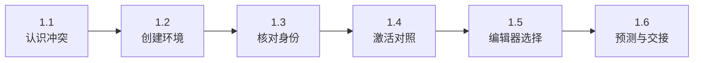
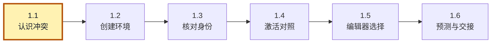
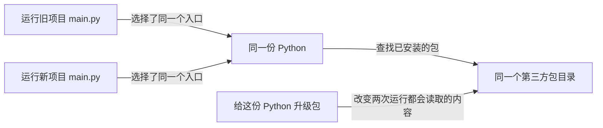
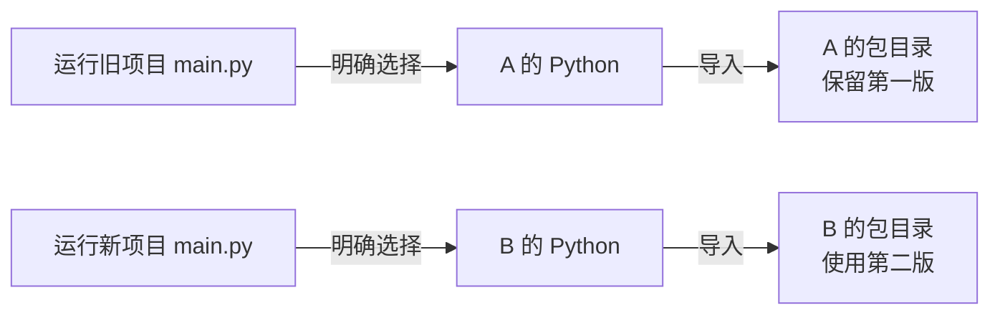
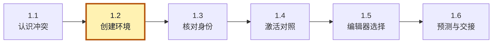
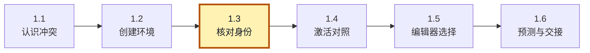
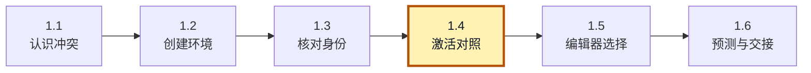
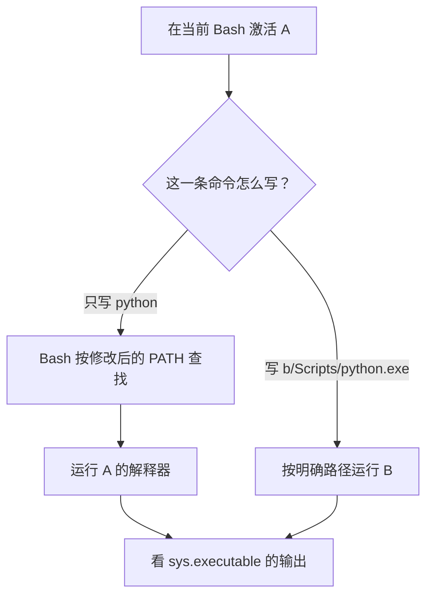
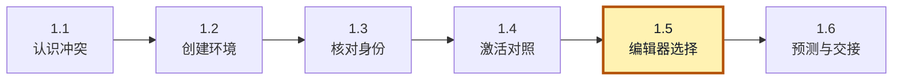
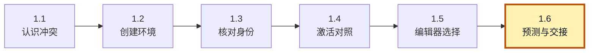

<!-- SPDX-FileCopyrightText: Copyright The zephyr_hc32f4a0 Contributors -->
<!-- SPDX-License-Identifier: Apache-2.0 -->

# 1. 创建并认识虚拟环境

假设你维护两个嵌入式项目，它们都有一个 Python 写的固件处理工具。旧项目用某个库的第一版，新项目需要第二版。你已经把两个项目放在不同文件夹，却发现给新项目升级库以后，旧项目也不能正常运行了。所以我们就产生了一种需求：<span style="color:var(--typora-code-color-b42318, #b42318)">如何在保证旧项目的环境保留的情况下，新项目配置的环境又不会影响旧项目的环境。当然，如果对当前打开的项目可以自动适配环境就更好了</span>。

这个需求很像为不同固件工程选择各自的工具链。不过，这里首先要分开的是运行 Python 程序时使用的第三方包：旧项目保留一份，新项目使用另一份。venv 为它们建立各自的安装位置和解释器入口；它不靠给所有软件打版本标记来切换，也不负责隔离电脑里的编译器、驱动等工具。包可以来自网络，也可以由本地源码制作，下一章就会使用本地材料。

接下来先看这种“牵连”怎么发生，再认识 venv。你不需要先学一遍 Python 语法；这里只用几行代码让解释器报告自己的身份。

> **先放下“要学一门新语言”的压力。** 这一章只做两件事：建好 A、B，再请它们各自报出身份。没有业务包要安装，也不用改你的旧工程。准备一个 UCRT64 Bash 窗口和能打开文件的编辑器即可；看到 `bash` 代码块就在终端执行，看到“输出示例”只对照，不要连同 `$` 提示符一起粘贴。

本章按下面的步骤推进；各节会重现这张路线图，并标出当前位置。图用于找回进度，具体命令在对应步骤中执行。



## 1.1 程序放在这里，库却未必从这里来

**当前位置：步骤 1.1「认识冲突」；黄色节点表示本节。**



先把开头的旧项目缩小到一次运行。假设它的工具入口是 app/main.py，在终端输入 `python app/main.py` 时，源码路径只说明要执行哪个文件，还没有说明由哪份 Python 执行。Bash 先根据命令查找规则找到名叫 python 的程序；随后，这个 **解释器（interpreter）** 执行 main.py，按照自己的模块搜索规则寻找应用导入的代码。因此，要追查新项目升级为何影响旧项目，需要分别核对执行者和它找到的包。

PATH 是一个环境变量，里面按顺序列出了一组目录，供 shell 或其他程序在按名称启动程序时查找可执行文件。例如只输入 `python` 时，在没有同名别名或 shell 函数等覆盖的情况下，Bash 会沿 PATH 查找这个可执行程序；若明确写出 `a/Scripts/python.exe`，就直接使用指定位置，无须再通过 PATH 找它。

Python 启动以后，要导入哪个包则由它自己的模块搜索路径等导入规则决定。PATH 不直接决定包的导入位置，但可以通过选择不同的 Python，间接让程序使用不同环境。把“先找到可执行程序”和“再找到要导入的代码”分开，就能解释下面的现象：



沿图从左往右看，两条运行路径在同一份 Python 汇合。右下方的升级动作只改了一处包目录，却能影响两个项目。这就是本章要拆开的共享关系。

两个项目虽然分开放，仍然可能由同一个 Python 执行。给这个 Python 升级包，两个程序下次运行都会遇到新版本。包可不知道你心里把它分给了哪个项目。

我们希望把关系改成这样：



第二张图没有让源码搬家，而是改变了运行入口。先记住这个操作目标：以后安装包和运行工具，都要能指出自己选的是 A 还是 B。

为了得到图中的两条路径，需要为 A/B 各准备一个解释器入口和包安装位置。这组与基础 Python 关联的目录及配置称为 **虚拟环境（virtual environment）**；基础 Python 随附的标准库中，`venv` 模块负责创建它。两份环境仍依托基础 Python，不需要复制两套操作系统。下面先建立这组目录，再用运行结果确认入口确实分开了。

## 1.2 创建目录以后，究竟得到了什么

**当前位置：步骤 1.2「创建环境」；黄色节点表示本节。**



要建立 A/B，先选定负责创建它们的基础 Python，并为实验留出一个不会混入项目源码的位置。打开 UCRT64 Bash，进入本仓库根目录，即能看到 learning 和 project-docs 的目录。下面使用 Bash 命令核对 Python 和教材材料，再进入统一的实验目录：

```bash
# 当前位置：教材仓库根目录；终端：UCRT64 Bash。
py -3.12 --version
```

`py -3.12` 让 Windows 启动器选择 Python 3.12；`--version` 只查询版本。应显示 Python 3.12.x，确认有解释器可用于下一步创建环境。

```bash
# 当前位置：教材仓库根目录；终端：UCRT64 Bash。
test -d learning/python/venv/labs
echo $?
```

`test -d` 检查教材材料目录是否存在；紧接着的 `echo $?` 应显示 0。非 0 时先回到正确的教材仓库根目录，不要继续在错误位置创建实验。

```bash
# 当前位置：教材仓库根目录；终端：UCRT64 Bash。
mkdir -p build/learning-tools
```

创建 `build/learning-tools` 目录；`-p` 允许父目录不存在时一并创建、目录已存在时继续。它不会检查已有实验是否干净，首次跟做仍应使用新的实验位置。

```bash
# 当前位置：教材仓库根目录；终端：UCRT64 Bash。
mkdir -p build/learning-tools/venv-textbook
```

创建 `build/learning-tools/venv-textbook` 目录；`-p` 允许父目录不存在时一并创建、目录已存在时继续。它不会检查已有实验是否干净，首次跟做仍应使用新的实验位置。

```bash
# 当前位置：教材仓库根目录；终端：UCRT64 Bash。
cd build/learning-tools/venv-textbook
```

把当前终端切换到 `build/learning-tools/venv-textbook`；后续相对路径从切换后的目录计算。上面的注释是切换前位置，下一块会标出切换后位置。

1. 第一条应报告 Python 3.12；
2. test 检查材料目录是否存在，紧接着的 echo 应显示 0。若不是，先回到仓库根目录。
3. 两条 mkdir -p 都允许目录已存在，不会因此清空旧内容。如果 venv-textbook 已有上次实验材料，请保留它，换成 venv-textbook-02，并在本专题后续路径中使用同一个名字。
4. 不要在已有环境中假装从零开始。

从这里到本专题结束，除明确写“从仓库根目录”外，命令均在 venv-textbook 中执行。先创建两个环境：

```bash
# 当前位置：build/learning-tools/venv-textbook；终端：UCRT64 Bash。
py -3.12 -m venv a b
```

用 Python 3.12 的 venv 模块创建 `a b` 两个独立环境。成功时可能不打印文字；解释器与包目录生成在所指定的目录里，尚未安装本章业务包。

`py -3.12` 让 Windows Python 启动器选择 3.12；`-m venv` 让这份 Python 运行 venv 模块；末尾两个名字是待创建的环境目录。它们的名字没有特殊含义，叫 old-project、new-project 也可以。命令成功时可能没有输出，接下来用实际解释器核对结果。

> **这里安静地回到提示符通常是正常的。** 不必因为没出现“创建成功”就再执行一遍。先用 `ls a/Scripts/python.exe b/Scripts/python.exe` 看两个入口是否存在；若找不到，停在这里读刚才的错误。后面的身份检查需要这两个文件，继续往下复制只会得到更多“找不到文件”。

打开 a，会看到 Scripts、Lib、pyvenv.cfg 等内容。主线使用 Windows Python，因此入口是 `a/Scripts/python.exe`；Bash 只是我们输入命令的地方，并没有把 Windows Python 变成 Linux Python。Linux/macOS 的对应入口是 `a/bin/python`，平台替换集中写在[准备章](../../P00_实验准备.md)。

```shell
$ ls a
Include  Lib  pyvenv.cfg  Scripts
```

Lib/site-packages 是这个环境的第三方包安装目录。pyvenv.cfg 记录基础 Python 的关联信息，以及是否开放基础环境的包。默认的 `include-system-site-packages = false` 表示不把基础环境的第三方包目录作为正常共享来源。标准库仍由基础 Python 提供；“没有共享第三方包”不等于“所有文件都复制了一遍”。

```shell
$ ls a/Lib/
site-packages

$ ls a/Lib/site-packages/
pip  pip-25.0.1.dist-info
```

这份目录结构也留下了一个边界：环境依托基础 Python，生成的入口、脚本或配置还可能记录原机器位置。把 a 整个搬到别处，或者移走基础 Python，都可能破坏这种关联。因此，交给同事时需要准备 Python 版本、依赖声明和验证方法，由对方重建环境；第三章会实际完成这一步。现在先保留 A/B，继续确认刚创建的入口在运行时怎样报告自己的归属。

## 1.3 让 Python 自己说出身份

**当前位置：步骤 1.3「核对身份」；黄色节点表示本节。**



磁盘上已经有 a 和 b 两组目录，但只看到目录，还不能确认一次命令究竟使用了哪份环境。让两份 Python 分别执行同一段观察代码，就能把文件位置与进程身份对起来。仍在实验目录直接指定解释器路径运行，不需要先激活：

先认一下我们要请 Python 做的事情。下面是便于阅读的展开写法，**这一小段只用来读，不必另建文件**；它既不安装包，也不改配置：

```python
import sys  # 取得当前 Python 进程提供的运行信息。

# 三次 print 各占一行，输出顺序就是下面的书写顺序。
print(sys.executable)   # 第 1 行：本次真正运行的 python.exe 在哪里。
print(sys.prefix)       # 第 2 行：当前虚拟环境的根目录。
print(sys.base_prefix)  # 第 3 行：创建它所依托的基础 Python 目录。
```

`import sys` 可以先理解为“取来名叫 sys 的标准工具箱”；`sys.executable` 是从这个工具箱读取一项信息，点号表示成员访问。`print(...)` 把括号里的值写到终端。它们是查询，不会把环境切换到输出中的目录。

真正执行时，把同样的代码放在 `-c` 后的引号里，分号分隔原先的几行。下面前两条让 A、B 各回答一次；第三条用 Bash 的 cat 查看 A 的配置文件：

```bash
# 当前位置：build/learning-tools/venv-textbook；终端：UCRT64 Bash。
a/Scripts/python.exe -c "import sys; print(sys.executable); print(sys.prefix); print(sys.base_prefix)"
```

依次打印实际解释器、当前环境前缀、基础 Python 前缀。比较第一、二行是否属于指定环境，再比较第三行的基础安装；不要只看终端提示符。

```bash
# 当前位置：build/learning-tools/venv-textbook；终端：UCRT64 Bash。
b/Scripts/python.exe -c "import sys; print(sys.executable); print(sys.prefix); print(sys.base_prefix)"
```

依次打印实际解释器、当前环境前缀、基础 Python 前缀。比较第一、二行是否属于指定环境，再比较第三行的基础安装；不要只看终端提示符。

```bash
# 当前位置：build/learning-tools/venv-textbook；终端：UCRT64 Bash。
cat a/pyvenv.cfg
```

打开并打印 `a/pyvenv.cfg` 的当前磁盘内容。该文件应已由前一步生成或更新；若找不到，先核对当前目录与创建步骤。

```shell
$ a/Scripts/python.exe -c "import sys; print(sys.executable); print(sys.prefix); print(sys.base_prefix)"
F:\git_storage\zephyr_hc32f4a0\build\learning-tools\venv-textbook\a\Scripts\python.exe
F:\git_storage\zephyr_hc32f4a0\build\learning-tools\venv-textbook\a
E:\python\python3_12

$ b/Scripts/python.exe -c "import sys; print(sys.executable); print(sys.prefix); print(sys.base_prefix)"
F:\git_storage\zephyr_hc32f4a0\build\learning-tools\venv-textbook\b\Scripts\python.exe
F:\git_storage\zephyr_hc32f4a0\build\learning-tools\venv-textbook\b
E:\python\python3_12

$ cat a/pyvenv.cfg
home = E:\python\python3_12
include-system-site-packages = false
version = 3.12.10
executable = E:\python\python3_12\python.exe
command = E:\python\python3_12\python.exe -m venv F:\git_storage\zephyr_hc32f4a0\build\learning-tools\venv-textbook\a
```

`-c` 后的字符串是让 Python 执行的一小段代码。sys 是标准库中提供解释器运行信息的模块。这里问了三个不同问题：

| 输出 | 回答的问题 | 在 A 中应看到什么 |
| --- | --- | --- |
| sys.executable | 此刻执行代码的是谁？ | 路径结尾是 a/Scripts/python.exe |
| sys.prefix | 这个解释器把哪个目录当作当前环境？ | 实验目录中的 a |
| sys.base_prefix | 它依托哪份基础 Python？ | 安装 Python 3.12 的目录 |

不要把输出中的盘符与作者电脑比较。需要比较的是关系：A 和 B 的 executable、prefix 不同，base_prefix 可以相同。在普通 venv 中，prefix 与 base_prefix 不同也是判断当前 Python 位于虚拟环境的一种方法。

> **对照时先只看每组三行。** 第一组的前两行应含 a，第二组应含 b；最后一行相同并不表示隔离失败，它说明两份环境来自同一个基础 Python。如果第一行就不符合预期，先检查命令开头的路径，不要急着研究第三行。

此时 A 和 B 仍不能展示“两个包版本互不干扰”，因为我们还没安装那个包。当前观察只证明解释器入口和环境归属已经分开，下一章才补上包的运行行为。安装以前，还有一个常见操作值得弄清：刚才明确指定路径已经能运行，为什么许多使用说明仍会先要求“激活环境”？

## 1.4 激活，是少写路径的办法

**当前位置：步骤 1.4「激活对照」；黄色节点表示本节。**



刚才每次都输入 `a/Scripts/python.exe` 或 B 的对应路径，执行者由命令直接指定。如果希望少写一些、只输入 `python`，就需要让 Bash 的短命令查找优先选到 A。激活脚本正是通过调整当前终端的 PATH 等设置完成这件事。下面保持观察代码不变，先激活 A，再分别用短命令和 B 的明确路径运行，比较谁真正执行了代码：



请先预测图中两条路径会输出什么，再执行下面四行。最后的 deactivate 是收尾，执行后 A、B 的目录都还在。

```bash
# 当前位置：build/learning-tools/venv-textbook；终端：UCRT64 Bash。
source a/Scripts/activate
```

让当前 Bash 读取 `a/Scripts/activate`，把这个环境的命令目录放到搜索路径前面。后续短命令 python 由它优先提供；不会搬动应用源码。

```bash
# 当前位置：build/learning-tools/venv-textbook；终端：UCRT64 Bash。
python -c "import sys; print(sys.executable)"
```

让本次 Python 亲自打印自己的可执行文件路径。用它确认短命令的选择，或确认显式写出的另一个环境路径确实绕过了激活状态。

```bash
# 当前位置：build/learning-tools/venv-textbook；终端：UCRT64 Bash。
b/Scripts/python.exe -c "import sys; print(sys.executable)"
```

让本次 Python 亲自打印自己的可执行文件路径。用它确认短命令的选择，或确认显式写出的另一个环境路径确实绕过了激活状态。

```bash
# 当前位置：build/learning-tools/venv-textbook；终端：UCRT64 Bash。
deactivate
```

退出当前终端激活的教学环境，恢复激活前的命令搜索设置。环境目录和已安装包仍在磁盘上。

`source` 让 Bash 在当前 shell 中执行脚本，使脚本对 PATH 等变量的调整留在这个窗口。Scripts 被放到命令查找路径前面，裸写 python 时就优先找到 A。命令提示符通常也会显示环境名，提醒我们当前的选择。

第二条 Python 调用却明确写了 B 的路径，所以依然执行 B。激活 A 并没有封锁其他解释器，更没有给此窗口运行的一切程序加上一层隔离罩。

`deactivate` 是激活脚本提供的 shell 函数，用来撤销该脚本对当前 shell 的主要修改；它不卸载包，也不删除环境。关闭终端同样不会删除 A。新开一个终端后，可以重新激活，也可以继续明确指定 A 的路径。

从这个角度看，排错时应先确认实际运行的是谁。提示符适合提醒，解释器输出才回答这一次调用。下一章安装包时，我们仍会明确指定 A 或 B，避免让安装和运行分到不同环境。

## 1.5 能否打开项目就自动选对环境

**当前位置：步骤 1.5「编辑器选择」；黄色节点表示本节。**



前面通过路径或激活选中了环境，选择动作都由我们完成。回到开头“打开项目就自动适配”的需求，如果希望每次点运行时由工具代劳，就要把项目与解释器的对应关系交给编辑器保存。venv 负责建立环境，不会持续观察你打开了哪个目录；编辑器才知道当前打开的是哪个项目。

项目常把环境放在根目录的 .venv，便于编辑器发现它。这个命名约定帮助定位，名字前的点本身没有隔离能力；真正影响运行的仍是编辑器最后选择的解释器路径。

> **如果你最关心的是“以后别再手动选错”。** 先在编辑器中打开项目文件夹，找到 Python 解释器选择入口，指定这个项目的 `.venv/Scripts/python.exe`。然后在编辑器里运行上节那两行 `import sys`、`print(sys.executable)`，确认结果。菜单显示的名称可以作为提醒，打印的实际路径才是这次运行的证据；具体编辑器菜单留给对应的工具章节。

编辑器可以保存项目对应的解释器位置，运行时据此选择；终端则有自己的 PATH 和激活状态。两者需要分别核对，界面上的选择不会让已经打开的所有终端自动变成同一个环境。本章先掌握明确调用与激活，不要求安装编辑器插件才能完成实验。

venv 还有允许共享基础环境包等选项，但现在保持默认值，便于比较 A/B。需要核对标准行为时，可阅读 [Python 3.12 的 venv 说明](https://docs.python.org/3.12/library/venv.html)；完成本章不依赖阅读那份参考资料。

## 1.6 离开这一章前，换一个角度想想

**当前位置：步骤 1.6「预测与交接」；黄色节点表示本节。**



现在已经区分了环境目录、终端激活状态和编辑器选择。下面把这三者放回日常操作中，检查是否还能判断每次由谁执行；先不看解答，试着判断：

1. 已经激活 A 时，进入 B 所在目录，裸写 python 会自动变成 B 吗？
2. 如果把 a 改名为 old，是否可以认为所有入口都仍然可靠？
3. 为什么一个项目对应一个环境，比每个 Python 文件对应一个环境更常见？

答：

1. 进入目录只改变当前工作目录，没有再次修改 PATH，所以第一问通常仍执行 A。
2. 改名可能破坏脚本中的原位置，第二问应通过重建解决。
3. 第三问的关键是依赖组合：同一项目的多个工具通常需要共同的一套包版本，按组合建立环境才便于维护；需要不同组合时再分开。

若中途关了窗口，新开 Bash 后先进入仓库根目录，再执行 `cd build/learning-tools/venv-textbook`，即可继续调用 a/Scripts/python.exe；不必重新创建，也不必激活。若需要重做，另取新目录名。实验源码和环境都还没有安装业务包，这正是下一章需要的起点。

现在，环境已经有了地址和身份，里面却还缺应用的包。[下一章](P02_安装包并验证版本隔离.md)用同一份问候程序给 A/B 安装不同版本，让隔离真正体现在结果里。

[大纲](大纲.md) · [配套材料索引](labs/README.md)
