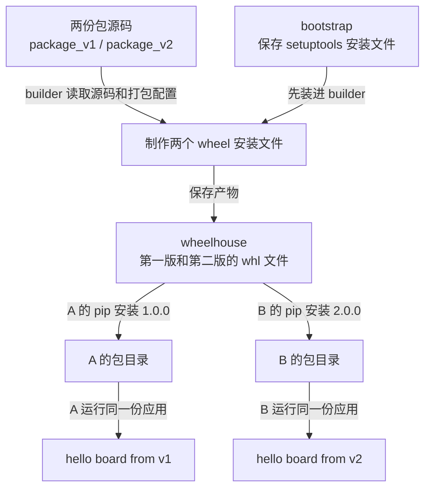
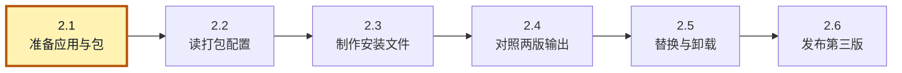
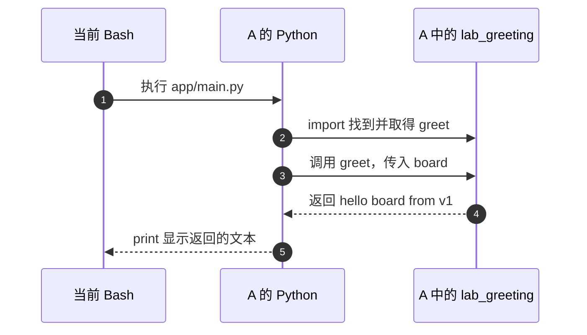
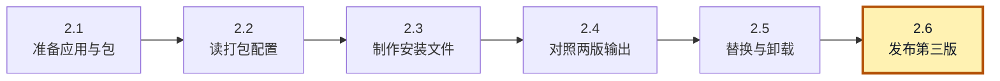

<!-- SPDX-FileCopyrightText: Copyright The zephyr_hc32f4a0 Contributors -->
<!-- SPDX-License-Identifier: Apache-2.0 -->

# 2. 安装包并验证版本隔离

上一章给 A、B 分好了各自的包目录，却还没有往里面安装业务代码。本章用同一个问候程序，分别取得第一版、第二版输出。差别故意选得很小：我们关注的是谁运行了哪份代码，不必先研究一套业务算法。

沿用上一章的环境。若刚打开终端，先进入仓库根目录，再执行 `cd build/learning-tools/venv-textbook`。本章所有命令都在这个实验目录执行；不要再进入 a 或 b。我们将只修改复制到这里的材料，保留教材原件。

> **这章的终点很直观。** 同一份 app/main.py，用 A 运行显示 v1，用 B 运行显示 v2。中间多出来的 builder、bootstrap、wheelhouse 都是为这个对照服务的。先跟着下面的路径认识各自位置，读到对应步骤时再操作，不用现在记住所有名字。



图的上半部制作可交付的文件，下半部才把它们装进 A/B。走到 wheelhouse 时别急着运行应用：安装文件已经做好，不代表环境已经采用它。

本章按下面的步骤推进；各节会重现这张路线图，并标出当前位置。图用于找回进度，具体命令在对应步骤中执行。


## 2.1 应用没有指定版本，版本从哪里来

**当前位置：步骤 2.1「准备应用与包」；黄色节点表示本节。**



为了让输出反映环境差异，我们让 A/B 运行同一个应用，只给它们安装不同版本的问候包。先把两版包源码复制到实验目录，再建立保存应用的 app 目录。三个 `../` 从 venv-textbook 回到仓库根，cp -R 复制整个目录：

先分清这三个目录的职责：

- `package_v1` 与 `package_v2` 是同一个问候库的两份源码材料，目录名只是本实验用来区分版本的标签；它们不是 Python 识别版本的依据。
- `app/main.py` 是调用问候库的应用入口；同一文件会交给不同环境的 Python 执行。
- A、B 是解释器与已安装包所在的环境，既不是应用源目录，也不是上述源码材料。后面安装时，pip 才把选中的版本放到各自环境里。

本实验用两份目录保存两版材料，尚不涉及多 Git 仓库。与 west 专题对照时要保留这个区别：venv 隔离 Python 的安装位置，west 管理 Git 源码组合，两者不会自动替对方处理职责。

```bash
# 当前位置：build/learning-tools/venv-textbook；终端：UCRT64 Bash。
cp -R ../../../learning/python/venv/labs/package_v1 package_v1
```

把 `../../../learning/python/venv/labs/package_v1` 复制到 `package_v1`，`-R` 连同子目录一起复制。后续修改目标副本，源材料仍保留；复制动作本身不安装包、不切换 Git 版本。

```bash
# 当前位置：build/learning-tools/venv-textbook；终端：UCRT64 Bash。
cp -R ../../../learning/python/venv/labs/package_v2 package_v2
```

把 `../../../learning/python/venv/labs/package_v2` 复制到 `package_v2`，`-R` 连同子目录一起复制。后续修改目标副本，源材料仍保留；复制动作本身不安装包、不切换 Git 版本。

```bash
# 当前位置：build/learning-tools/venv-textbook；终端：UCRT64 Bash。
mkdir -p app
```

创建 `app` 目录；`-p` 允许父目录不存在时一并创建、目录已存在时继续。它不会检查已有实验是否干净，首次跟做仍应使用新的实验位置。

package_v1/package_v2 原先应不存在，否则 cp 可能形成多一层目录。两份包的结构相同：

```text
package_v1/
  pyproject.toml
  src/lab_greeting/__init__.py
```

`pyproject.toml` 是 Python 项目通用的配置文件名，构建工具从中读取如何打包及包的名称、版本；它不是可以随意改名仍自动生效的教学文件。`src/` 是常见的源码布局选择，本例配置会明确告诉工具到这里找包。`lab_greeting/` 是本例要导入的包目录，`__init__.py` 是这种普通包的初始化模块；把 greet 定义在这里，安装后便能用 `from lab_greeting import greet` 取得它。此刻只有源码，还没有装进 A/B，不能期待复制材料后立即导入成功。

注意三个相近名字的层次：package_v1 是材料目录名，lab-greeting 是稍后交给 pip 的发行包名，lab_greeting 是 Python import 使用的名字。具体版本从 pyproject.toml 的 version 读取，不从 package_v1 的文件夹名推断。下一节读配置时会把这几个名字逐一对应起来。

第一版 __init__.py 中的有效代码完整如下，许可证注释保留在材料文件中：

```python
# 定义一个名为 greet 的函数；没传名字时，name 使用 reader。
def greet(name="reader"):
    # 生成一段文本并交还调用者；return 自己不会往终端打印。
    return f"hello {name} from v1"
```

第二版只把返回文本末尾改成 v2。带 __init__.py 的 lab_greeting 目录构成一个普通 **导入包（import package）**，Python 可以通过名字找到其中的 greet。这里的 f 字符串把 name 的值填入大括号位置；默认参数使不传名字时使用 reader。

可以把 greet 暂时看成一个很小的 C 函数：输入一个名字，返回一段问候语。Python 的 `def` 声明函数，冒号后缩进的行组成函数体；这里不用大括号。`greet("board")` 调用时，name 得到字符串 board，`{name}` 被替换，返回值是 `hello board from v1`。文件中仅出现这条 def 定义时，函数体还没有执行，必须等一次调用。

在实验目录的 app/main.py 中写入这个完整程序：

```python
# 从当前解释器找到的 lab_greeting 包中取得 greet 函数。
from lab_greeting import greet

# 先调用 greet 得到字符串，再交给 print 显示到终端。
print(greet("board"))
```

应用的第一行负责“找到函数”，最后一行才“调用并显示”。遇到嵌套括号时从里向外读：先算 `greet("board")`，再执行 `print(返回的字符串)`。app/main.py 不知道 v1/v2 的源码在哪个原始目录，选择哪份已安装代码由运行它的环境决定。

可用编辑器新建文件。若想直接在 Bash 中写入，同样的内容可以这样输入；独占一行的 PY 结束文本，命令会覆盖指定文件。**这次运行就是要看见缺包错误**，先不要把红字当成自己做错了。执行后留意错误末行和退出码：

```bash
# 当前位置：build/learning-tools/venv-textbook；终端：UCRT64 Bash。
cat > app/main.py <<'PY'
# 导入当前环境找到的问候函数。
from lab_greeting import greet

# 调用函数取得字符串，然后打印；版本标记来自包的实现。
print(greet("board"))
PY
```

把上述文本写入 `app/main.py`。引号括起的结束标记让 Bash 原样保存内容；这一刻只是创建或替换文件，没有执行其中的 Python，也没有自动同步清单中的仓库。

```bash
# 当前位置：build/learning-tools/venv-textbook；终端：UCRT64 Bash。
# 第一次故意在尚未安装问候包的 A 中运行。
a/Scripts/python.exe app/main.py
# 紧接上一条命令查看退出码；不要在中间插入别的命令。
echo $?
```

用 A 的解释器运行同一份 app/main.py。此处故意制造导入失败，应出现 ImportError 或 ModuleNotFoundError；紧接着读取退出码，预期非零。

预期报告 ModuleNotFoundError，退出码非 0。应用只按名称请求 lab_greeting，既没指定第一版，也没指定第二版；此时 A 两版都没有。源码“在附近”不代表已经成为 A 可导入的包，我们也没有把 package_v1/src 手工塞进搜索路径。要让应用找到它，需要先把选中的版本安装到 A；下面看看源码还需要提供哪些信息，安装器才能完成这件事。

## 2.2 谁把源码做成安装包

**当前位置：步骤 2.2「读打包配置」；黄色节点表示本节。**


刚才 app/main.py 找不到问候包，缺少的是从源码到环境的安装步骤。负责安装分发包的工具叫 **pip**；第一章新建的环境通常已带有它。pip 不能仅凭 greet 函数猜出安装项目名、版本及源码位置，因此这些信息由包项目自己的 pyproject.toml 配置提供。package_v1/pyproject.toml 的完整配置内容是：

```toml
[build-system]
# 制作安装文件时需要的工具，不是 greet 运行时的依赖。
requires = ["setuptools==80.9.0"]
build-backend = "setuptools.build_meta"

[project]
# pip 用这两个字段识别“装哪个项目、哪一版”。
name = "lab-greeting"
version = "1.0.0"
description = "Local package for learning Python environment isolation"
requires-python = ">=3.10"

[tool.setuptools.packages.find]
# 源码包在 src 下，而不是直接放在项目根目录。
where = ["src"]
```

1. TOML 是配置文件格式，方括号分区。
2. project 给出用于安装交付的名称、版本和 Python 要求；
3. 最后一段让 setuptools 到 src 找包。第二版配置只有项目版本改成 2.0.0。
4. 安装的整体称为 **分发包（distribution package）**，本例名称 lab-greeting；代码导入的是 lab_greeting。一个名称用连字符，另一个用下划线，它们不必相同。以后查安装记录用前者，写 import 用后者。
5. build-system 选择 **构建后端（build backend）**：真正把源码整理成安装归档的组件。这里使用 setuptools 的 build_meta。pip 负责组织安装或构建流程，再把具体打包工作交给它。“构建”不一定编译 C 文件，纯 Python 也需要归档、版本和文件清单。

这些配置让打包工具知道该取哪些源码、附上哪个名称和版本。它们整理出的常见安装归档叫 **wheel**，后缀为 .whl。我们会先把两份源码各做成一个 wheel，集中存到 wheelhouse，再分别安装到 A/B。wheelhouse 只是本地目录名，不需要启动服务；把制作与安装分开，可以直接观察中间交付的文件。

## 2.3 准备一次工具，制作两份 wheel

**当前位置：步骤 2.3「制作安装文件」；黄色节点表示本节。**


现在知道需要 setuptools 来制作 wheel，但运行前面的 greet 函数并不需要这个构建工具。为了让 A/B 的业务依赖保持简单，我们另外创建 builder，专门运行打包流程。它使用与 A/B 相同的 venv 创建方法，只是承担的任务不同。

先把固定版本的 setuptools 下载到 bootstrap，保留它的安装文件，再装入 builder。bootstrap 保存的是构建工具；稍后 wheelhouse 保存的是我们自己的问候包，不要把两个目录的用途混在一起。第一组命令需要联网下载后端：

```bash
# 当前位置：build/learning-tools/venv-textbook；终端：UCRT64 Bash。
py -3.12 -m venv builder
```

用 Python 3.12 的 venv 模块创建 `builder` 环境。成功时可能不打印文字；解释器与包目录生成在所指定的目录里，尚未安装本章业务包。

```bash
# 当前位置：build/learning-tools/venv-textbook；终端：UCRT64 Bash。
builder/Scripts/python.exe -m pip download --only-binary=:all: --no-deps --dest bootstrap setuptools==80.9.0
```

把 setuptools 80.9.0 下载到 bootstrap：`--only-binary=:all:` 只接受已打包文件，`--no-deps` 不额外下载其依赖，`--dest` 指定保存目录。download 只保存安装材料，下一步才装进 builder。

```bash
# 当前位置：build/learning-tools/venv-textbook；终端：UCRT64 Bash。
builder/Scripts/python.exe -m pip install --no-index --find-links bootstrap setuptools==80.9.0
```

从 bootstrap 本地目录找到固定版本的 setuptools 并安装到 builder。`--no-index` 禁止查询包索引，`--find-links` 指定候选目录；构建工具就绪后才能制作或关联源码包。

**download 指令解析：**

1. download 只下载，不安装；
2. --dest 指定保存目录。
3. --only-binary=:all: 要求取得 wheel，--no-deps 不额外下载它的运行依赖。

**install 指令解析：**

1. 随后 install 从 bootstrap 安装：
2. --no-index 禁止查询在线索引，
3. --find-links 指出本地候选目录。这样能保留后端文件，后面重建开发环境时不必再下载一次。

> 若这一步网络失败，先处理 pip 的下载错误；不要继续打包，也不要误以为 venv 创建失败。基础 Python 3.12 新建环境通常带 pip，但不应假定已经带 setuptools。

至此 builder 已经能加载后端，A/B 仍保持未安装问候包的状态。接下来让 builder 的 pip 读取两份源码目录中的构建配置，调用后端生成 wheel。输入分别是 package_v1 和 package_v2，输出放进同一个 wheelhouse：

```bash
# 当前位置：build/learning-tools/venv-textbook；终端：UCRT64 Bash。
builder/Scripts/python.exe -m pip wheel --no-index --no-deps --no-build-isolation --wheel-dir wheelhouse ./package_v1
```

把 `./package_v1` 的源码制作成 wheel，保存到 `--wheel-dir wheelhouse`。`--no-index` 不查询索引，`--no-deps` 不处理其他依赖，`--no-build-isolation` 使用 builder 已装好的构建后端；这一步不安装进 A 或 B。

```bash
# 当前位置：build/learning-tools/venv-textbook；终端：UCRT64 Bash。
builder/Scripts/python.exe -m pip wheel --no-index --no-deps --no-build-isolation --wheel-dir wheelhouse ./package_v2
```

把 `./package_v2` 的源码制作成 wheel，保存到 `--wheel-dir wheelhouse`。`--no-index` 不查询索引，`--no-deps` 不处理其他依赖，`--no-build-isolation` 使用 builder 已装好的构建后端；这一步不安装进 A 或 B。

```bash
# 当前位置：build/learning-tools/venv-textbook；终端：UCRT64 Bash。
ls wheelhouse
```

列出 `wheelhouse` 中生成的文件，确认预期安装材料已经存在后再继续。目录存在本身不等于里面已有需要的版本。

1. 最右边是输入源码，--wheel-dir 是输出目录。
2. --no-build-isolation 表示使用 builder 中已准备的后端；它本身不会替你安装后端。
3. 默认隔离构建会另建临时环境准备 build-system 所需工具，本实验主动拆开，以便观察并保留离线材料。

应看到 lab_greeting-1.0.0-py3-none-any.whl 和第二版对应文件。py3-none-any 表示这两个纯 Python 产物不绑定特定二进制接口或平台；带 C 扩展的 wheel 可能只适用于某种 Python、系统和架构，不能一概照搬。

> **这里先停一下，看 ls 的两行文件名。** 找到 1.0.0 和 2.0.0 才进入安装步骤。如果只看到一个版本，先看哪次打包失败，不要用重新创建 A/B 来补救。到目前为止，我们改变的是 builder 和安装材料，还没有给 A/B 安装业务包。

打包可能在源目录旁生成元数据，所以我们操作复制品。到此 A/B 仍未安装问候包：有了制品，不等于每个环境都自动使用它。

## 2.4 同一份应用，两种输出

**当前位置：步骤 2.4「对照两版输出」；黄色节点表示本节。**


wheelhouse 中的两个版本已经准备好，但上一节没有向 A/B 的包目录写入它们。现在明确选择安装目标：命令开头使用 A 或 B 的解释器，末尾分别要求第一版或第二版；安装后仍运行 2.1 节那份 app/main.py，不修改应用代码：

```bash
# 当前位置：build/learning-tools/venv-textbook；终端：UCRT64 Bash。
a/Scripts/python.exe -m pip install --no-index --find-links wheelhouse lab-greeting==1.0.0
```

让 A 的 pip 只采用 lab-greeting 1.0.0；候选从 wheelhouse 读取，不查询包索引。相同包名的现有版本会被替换，但其他环境不随之升级或降级。

```bash
# 当前位置：build/learning-tools/venv-textbook；终端：UCRT64 Bash。
b/Scripts/python.exe -m pip install --no-index --find-links wheelhouse lab-greeting==2.0.0
```

让 B 的 pip 只采用 lab-greeting 2.0.0；候选从 wheelhouse 读取，不查询包索引。相同包名的现有版本会被替换，但其他环境不随之升级或降级。

```bash
# 当前位置：build/learning-tools/venv-textbook；终端：UCRT64 Bash。
a/Scripts/python.exe app/main.py
```

用 A 的解释器运行同一份 app/main.py。观察问候语中的版本标记，它来自这个环境当前导入的包。运行文件没有改变，改变的是解释器与安装版本的配套。

```bash
# 当前位置：build/learning-tools/venv-textbook；终端：UCRT64 Bash。
b/Scripts/python.exe app/main.py
```

用 B 的解释器运行同一份 app/main.py。观察问候语中的版本标记，它来自这个环境当前导入的包。运行文件没有改变，改变的是解释器与安装版本的配套。

== 要求准确版本。候选目录相同，选择要求不同，最终分别安装到 A/B。输出应为：

```text
hello board from v1
hello board from v2
```

应用没有变化，改变的是执行它的解释器及可见包。现在，上一章“各有包目录”的结构终于变成了可观察的行为。

把第一条成功运行放慢来看，实际发生的是下面这几步。图里的“导入”发生在函数调用之前；找不到包就会在第 2 步失败，根本到不了打印：



第 3 步把 board 送进函数，第 4 步只返回值，第 5 步才出现终端文字。换成 B 时，应用这几行代码不变，变化发生在第 2 步找到的是 B 的第二版包。

如果报告 No matching distribution found，先检查 wheelhouse 是否有产物、版本拼写和候选兼容性；不要直接去掉 --no-index，否则换了来源，已经不是同一次实验。

输出已经证明同一应用在两个环境中得到了不同结果。为了确认结果来自哪里，再用 A 同时查询安装记录和实际导入文件，看看它们能否对应到同一环境：

```bash
# 当前位置：build/learning-tools/venv-textbook；终端：UCRT64 Bash。
a/Scripts/python.exe -m pip list
```

列出 A 中已经安装的发行包及版本，先确认 lab-greeting 是否在内。命令只查询，不更新包。

```bash
# 当前位置：build/learning-tools/venv-textbook；终端：UCRT64 Bash。
a/Scripts/python.exe -m pip show lab-greeting
```

查询 A 中 lab-greeting 的发行包信息，重点看 Version 和 Location；查得到并不证明 import 实际选中了这里的代码。

```bash
# 当前位置：build/learning-tools/venv-textbook；终端：UCRT64 Bash。
a/Scripts/python.exe -c "import lab_greeting; print(lab_greeting.__file__)"
```

导入模块并打印它的源码位置，用这条路径确认实际读到了哪份代码；不要用 pip 已安装的记录替代这条运行证据。

1. list 列出分发包；
2. show 显示版本、依赖与 Location；
3. __file__ 则报告本次实际导入的文件。正常情况下后两者都应落到 a 的 site-packages。

两种证据不同：安装记录正确，并不能排除别处的同名文件抢先被导入，第四章会处理这种情况。

## 2.5 替换与卸载都要指定对象

**当前位置：步骤 2.5「替换与卸载」；黄色节点表示本节。**


到这里，A 使用第一版，B 使用第二版，安装记录与输出已经能够相互核对。再改变 B 的状态，检查隔离是否也适用于后续维护。先只把 B 降回第一版，命令中的安装来源不变，只重新指定版本：

```bash
# 当前位置：build/learning-tools/venv-textbook；终端：UCRT64 Bash。
b/Scripts/python.exe -m pip install --no-index --find-links wheelhouse lab-greeting==1.0.0
```

让 B 的 pip 只采用 lab-greeting 1.0.0；候选从 wheelhouse 读取，不查询包索引。相同包名的现有版本会被替换，但其他环境不随之升级或降级。

```bash
# 当前位置：build/learning-tools/venv-textbook；终端：UCRT64 Bash。
b/Scripts/python.exe app/main.py
```

用 B 的解释器运行同一份 app/main.py。观察问候语中的版本标记，它来自这个环境当前导入的包。运行文件没有改变，改变的是解释器与安装版本的配套。

此时 B 应输出 v1。固定版本安装既能升级也能降级；若使用 --upgrade 且没有固定版本，pip 可能选择符合要求的较新候选。团队升级应同时审查行为，不能只看安装进度条完成。

接着只卸载 B，先预测 A 会怎样，再运行：

> **下面包含一次预期失败和恢复。** 卸载之后，B 应当找不到问候包；A 应继续运行。看到 B 的缺包错误后按顺序完成最后两条重装与运行，不要把这个故障留给下一章。

```bash
# 当前位置：build/learning-tools/venv-textbook；终端：UCRT64 Bash。
b/Scripts/python.exe -m pip uninstall -y lab-greeting
```

只从 B 卸载 lab-greeting；`-y` 自动确认这一次卸载。应用源文件和另一个环境不受影响，下一步用运行结果检验这一点。

```bash
# 当前位置：build/learning-tools/venv-textbook；终端：UCRT64 Bash。
b/Scripts/python.exe app/main.py
echo $?
```

用 B 的解释器运行同一份 app/main.py。此处故意制造导入失败，应出现 ImportError 或 ModuleNotFoundError；紧接着读取退出码，预期非零。

```bash
# 当前位置：build/learning-tools/venv-textbook；终端：UCRT64 Bash。
a/Scripts/python.exe app/main.py
```

用 A 的解释器运行同一份 app/main.py。观察问候语中的版本标记，它来自这个环境当前导入的包。运行文件没有改变，改变的是解释器与安装版本的配套。

```bash
# 当前位置：build/learning-tools/venv-textbook；终端：UCRT64 Bash。
b/Scripts/python.exe -m pip install --no-index --find-links wheelhouse lab-greeting==1.0.0
```

让 B 的 pip 只采用 lab-greeting 1.0.0；候选从 wheelhouse 读取，不查询包索引。相同包名的现有版本会被替换，但其他环境不随之升级或降级。

```bash
# 当前位置：build/learning-tools/venv-textbook；终端：UCRT64 Bash。
b/Scripts/python.exe app/main.py
```

用 B 的解释器运行同一份 app/main.py。观察问候语中的版本标记，它来自这个环境当前导入的包。运行文件没有改变，改变的是解释器与安装版本的配套。

-y 让这次已明确对象的卸载不再交互确认。B 应先报缺包，A 仍输出 v1；重装后 B 也恢复 v1。卸载没有删除源码与 wheelhouse，所以恢复不需要重新下载或打包。

## 2.6 练习：自己发布第三版

**当前位置：步骤 2.6「发布第三版」；黄色节点表示本节。**



刚才的替换和卸载都只改变 B 的安装内容，源码与已有 wheel 没有变化。现在把变化移到源头：自行改出第三版，再沿“源码—wheel—B”的路径交付它。A 保持第一版作为对照。先把第二版复制为新材料，目标 package_v3 应尚不存在：

```bash
# 当前位置：build/learning-tools/venv-textbook；终端：UCRT64 Bash。
cp -R package_v2 package_v3
```

把 `package_v2` 复制到 `package_v3`，`-R` 连同子目录一起复制。后续修改目标副本，源材料仍保留；复制动作本身不安装包、不切换 Git 版本。

将 package_v3/pyproject.toml 的 version 改成 3.0.0，将 package_v3/src/lab_greeting/__init__.py 的返回行改成 `return f"hello {name} from v3"`。这是两个不同的信息：一个用于安装器识别版本，一个用于观察运行行为，不能只改其中一个。

先自己依据本章命令完成构建、安装到 B。提示：只需改变输入目录和安装版本，不需要改 app/main.py。下面是可核对的解答：

```bash
# 当前位置：build/learning-tools/venv-textbook；终端：UCRT64 Bash。
builder/Scripts/python.exe -m pip wheel --no-index --no-deps --no-build-isolation --wheel-dir wheelhouse ./package_v3
```

把 `./package_v3` 的源码制作成 wheel，保存到 `--wheel-dir wheelhouse`。`--no-index` 不查询索引，`--no-deps` 不处理其他依赖，`--no-build-isolation` 使用 builder 已装好的构建后端；这一步不安装进 A 或 B。

```bash
# 当前位置：build/learning-tools/venv-textbook；终端：UCRT64 Bash。
b/Scripts/python.exe -m pip install --no-index --find-links wheelhouse lab-greeting==3.0.0
```

让 B 的 pip 只采用 lab-greeting 3.0.0；候选从 wheelhouse 读取，不查询包索引。相同包名的现有版本会被替换，但其他环境不随之升级或降级。

```bash
# 当前位置：build/learning-tools/venv-textbook；终端：UCRT64 Bash。
b/Scripts/python.exe app/main.py
```

用 B 的解释器运行同一份 app/main.py。观察问候语中的版本标记，它来自这个环境当前导入的包。运行文件没有改变，改变的是解释器与安装版本的配套。

```bash
# 当前位置：build/learning-tools/venv-textbook；终端：UCRT64 Bash。
a/Scripts/python.exe app/main.py
```

用 A 的解释器运行同一份 app/main.py。观察问候语中的版本标记，它来自这个环境当前导入的包。运行文件没有改变，改变的是解释器与安装版本的配套。

```bash
# 当前位置：build/learning-tools/venv-textbook；终端：UCRT64 Bash。
b/Scripts/python.exe -m pip install --no-index --find-links wheelhouse lab-greeting==1.0.0
```

让 B 的 pip 只采用 lab-greeting 1.0.0；候选从 wheelhouse 读取，不查询包索引。相同包名的现有版本会被替换，但其他环境不随之升级或降级。

B 应输出 v3，A 仍输出 v1；最后一条把 B 恢复为第一版。仅改源码而不重新构建、安装，常规安装中的 B 不会自动跟随变化。完成本章后请保留 A/B、app、wheelhouse 和保存构建后端的 bootstrap；A/B 此时均为第一版。下一章从已经能运行的 A 出发，记录安装要求，再检验另一个环境是否能重现结果。

[pyproject 构建后端指南](https://packaging.python.org/en/latest/guides/writing-pyproject-toml/#declaring-the-build-backend)可以用于核对配置职责。[上一章](P01_创建并认识虚拟环境.md) · [下一章](P03_配置依赖并重建环境.md) · [大纲](大纲.md)
