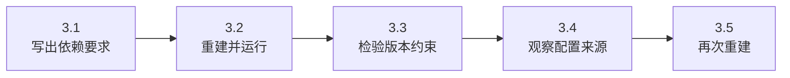
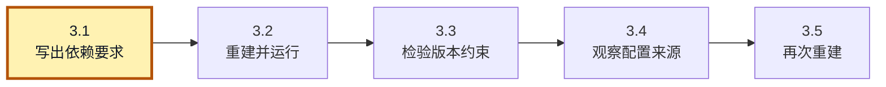
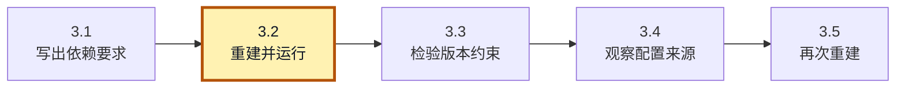
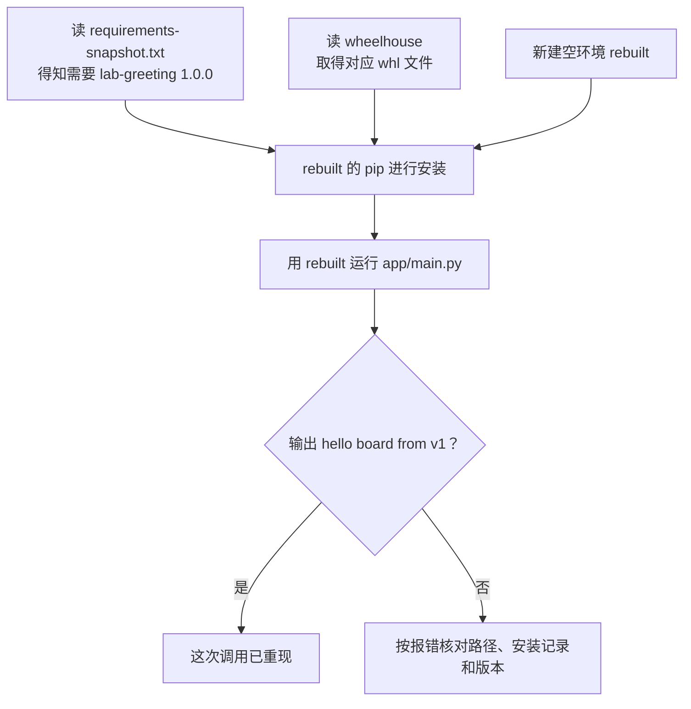
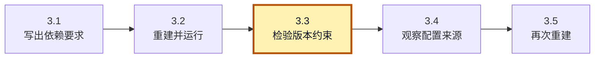
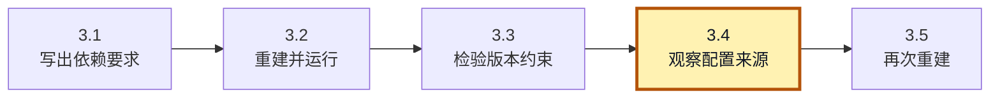
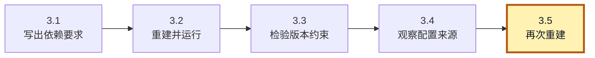

<!-- SPDX-FileCopyrightText: Copyright The zephyr_hc32f4a0 Contributors -->
<!-- SPDX-License-Identifier: Apache-2.0 -->

# 3. 配置依赖并重建环境

上一章已让 A/B 运行同一份应用，并在练习结束后把两者恢复为第一版。现在把 app/main.py 交给同事，对方却仍可能遇到找不到问候包的错误：应用中的 import 只写了要导入的名称，没有替对方安装代码，也没有告诉安装器该选择哪一版。

我们已经保留了各版 wheel，接下来把已验证的版本选择写成文件。然后用一个全新环境读取这份记录，从同一批安装材料中重建运行结果，检验交给同事的信息是否足够。

本章沿用 A 中的第一版。新开终端时，从仓库根目录执行 `cd build/learning-tools/venv-textbook`，后面的命令均在这里运行。需要上一章的 a、wheelhouse 和 app/main.py；不要求先学测试框架或其他工具。

> **先用一句话对齐这次任务：** 我们不把 A 复制给同事，而是给一份“装什么”的记录和“从哪里装”的材料，让一份空环境重新输出 v1。你可以先执行 `a/Scripts/python.exe app/main.py` 看看起点是否仍是 v1；如果不是，先回上一章恢复 A，再继续记录，免得把错误状态交出去。

本章按下面的步骤推进；各节会重现这张路线图，并标出当前位置。图用于找回进度，具体命令在对应步骤中执行。



## 3.1 把要求写下来

**当前位置：步骤 3.1「写出依赖要求」；黄色节点表示本节。**



这里使用 `requirements.txt` 这个常见约定名；pip 并不会自动扫描所有同名文件，真正决定读取哪份的是安装命令的 `-r 路径`。因此打开别人的 Python 工程时，先看其安装说明或脚本实际传了哪份文件，再检查里面的依赖。下面的 requirements-snapshot.txt 同样可以使用，只要通过 -r 明确指定。

先沿 app/main.py 的调用确定要记录什么：它从 lab_greeting 导入 greet，对应上一章的分发包 lab-greeting，因此这个包是应用的直接依赖。如果该包还需要其他分发包，后者就是传递依赖。本例没有其他运行依赖，而且第一版已经在 A 中验证过，所以当前只需记录一条安装要求：

```text
lab-greeting==1.0.0
```

把它写到 app/requirements.txt：

```bash
# 当前位置：build/learning-tools/venv-textbook；终端：UCRT64 Bash。
printf '%s\n' 'lab-greeting==1.0.0' > app/requirements.txt
```

用 `%s\n` 把每个给定字符串写成一行，写入并替换 `app/requirements.txt`。这里只写文件，下一条读取或提交命令才会使用它。

```bash
# 当前位置：build/learning-tools/venv-textbook；终端：UCRT64 Bash。
cat app/requirements.txt
```

打开并打印 `app/requirements.txt` 的当前磁盘内容。该文件应已由前一步生成或更新；若找不到，先核对当前目录与创建步骤。

文件中这一行是交给 pip 的数据，不是 Python 程序。`==1.0.0` 要求固定版本；如果改成 `>=1,<2`，则允许一个范围。范围表达选择空间，并不保证半年后新出现的候选一定满足应用行为。

刚才是根据应用需求手写清单。如果环境里已经装了许多包，也可以先让 pip 输出当前安装记录，再审查哪些内容要交给同事。这里换用 freeze 子命令询问 A，并把结果写入另一份文件，以便与刚才的 app/requirements.txt 对照：

```bash
# 当前位置：build/learning-tools/venv-textbook；终端：UCRT64 Bash。
a/Scripts/python.exe -m pip freeze > requirements-snapshot.txt
```

列出 A 目前安装的发行包版本，并由 Bash 的 `>` 写入 requirements-snapshot.txt。这里把输出保存为文件，所以终端可能没有列表；下一步再打开它。

```bash
# 当前位置：build/learning-tools/venv-textbook；终端：UCRT64 Bash。
cat requirements-snapshot.txt
```

打开并打印 `requirements-snapshot.txt` 的当前磁盘内容。该文件应已由前一步生成或更新；若找不到，先核对当前目录与创建步骤。

本次应只有 lab-greeting==1.0.0。freeze 回答“此刻装着什么”，没有分析程序真正需要什么。临时排错工具也可能被记录；可编辑安装或本地来源还可能带入本机路径。因此生成后要读文件，不能把它当成会理解业务的自动锁定器。

## 3.2 用一个新环境证明材料够用

**当前位置：步骤 3.2「重建并运行」；黄色节点表示本节。**



两份记录在本例中都应指向第一版，但文件内容看起来正确，还不足以证明别人能照着运行。我们新建名为 rebuilt 的环境，让它只依靠记录与 wheelhouse 安装，再运行原来的 app/main.py。rebuilt 目录应尚不存在；如果已有旧实验，换一个新名字，避免旧包替我们补上遗漏的依赖。创建并安装：



安装框有三条输入线，缺少任何一条都无法完成这个重建。下面第二条命令也恰好包含这三个角色：开头是 rebuilt 的解释器，`-r` 后是记录，`--find-links` 后是材料目录。先用手指把三处对应起来，再执行：

```bash
# 当前位置：build/learning-tools/venv-textbook；终端：UCRT64 Bash。
py -3.12 -m venv rebuilt
```

用 Python 3.12 的 venv 模块创建 `rebuilt` 环境。成功时可能不打印文字；解释器与包目录生成在所指定的目录里，尚未安装本章业务包。

```bash
# 当前位置：build/learning-tools/venv-textbook；终端：UCRT64 Bash。
rebuilt/Scripts/python.exe -m pip install --no-index --find-links wheelhouse -r requirements-snapshot.txt
```

让 rebuilt 的 pip 从 `-r` 指定的需求文件读取安装要求，再到 wheelhouse 查找候选；`--no-index` 使本次不用包索引。文件必须来自前面的保存步骤，缺失时先核对路径。

```bash
# 当前位置：build/learning-tools/venv-textbook；终端：UCRT64 Bash。
rebuilt/Scripts/python.exe app/main.py
```

用 REBUILT 的解释器运行同一份 app/main.py。观察问候语中的版本标记，它来自这个环境当前导入的包。运行文件没有改变，改变的是解释器与安装版本的配套。

```bash
# 当前位置：build/learning-tools/venv-textbook；终端：UCRT64 Bash。
rebuilt/Scripts/python.exe -m pip check
```

检查 REBUILT 中已安装发行包的依赖声明是否满足。它不调用 greet，也不比较问候文字，所以还需要后面的应用或行为测试。

-r 给出“要哪个包和版本”，--find-links 提供“去哪里找文件”，--no-index 保持本地来源。运行应输出 hello board from v1；pip check 应报告没有损坏的依赖关系。前者验证这次调用，后者检查分发包声明是否相互满足；它并不知道问候语必须以 v1 结尾。

> **如果第二条就报错，先别运行第三条碰运气。** `Could not open requirements file` 表示连记录文件都没读到，先查当前目录；`No matching distribution found` 表示没找到符合要求的安装候选，先看 wheelhouse 和版本。两种情况都不需要先删掉 A，它仍是我们的正确对照。

为什么要用新目录？如果旧环境碰巧装了未记录的包，重装成功可能掩盖材料缺失。新环境减少这种隐含帮助。venv 对已有目录并不保证先清空，因此不能把“再次执行创建命令”当成全新起点。

现在重开一个终端，从仓库根目录进入同一实验目录，再用 rebuilt 的明确路径运行 app/main.py。仍应输出 v1，无须激活。这排除了“只有上个窗口临时状态下才有效”的情况。

真实交付还要记录 Python 版本、平台、包来源和验证入口。需求文件不是基础 Python 的安装包，freeze 也不记录全部操作系统库。[pip freeze 官方说明](https://pip.pypa.io/en/stable/cli/pip_freeze/#description)解释了它为何不等同于依赖求解或完整锁定。

## 3.3 约束不会替你提出安装要求

**当前位置：步骤 3.3「检验版本约束」；黄色节点表示本节。**



刚才的记录解决了“按已验证版本重建”的问题，rebuilt 已经能运行第一版。现在增加一个团队约定：多个应用都暂时不能接受第二版，希望它们安装这个包时统一遵守“小于 2”的限制。应用各自仍然负责提出安装要求，这条公共限制只负责收紧可选版本。

这种限制可以写入 **constraints 文件**。pip 读取它后，会用其中条件约束已有安装目标，却不会因为文件里出现某个包名就主动安装它。下面继续使用 rebuilt，故意提出与限制矛盾的要求，观察这两类文件怎样配合。

在实验目录写入限制，再故意要求第二版：

> **这一次报冲突才符合预期。** 我们让同一个请求同时满足“等于 2.0.0”和“小于 2”，是在测试限制确实被读取，不是在尝试一次正常升级。请保留报错，找到说明两项要求矛盾的部分；随后按恢复步骤回到第一版。

```bash
# 当前位置：build/learning-tools/venv-textbook；终端：UCRT64 Bash。
printf '%s\n' 'lab-greeting<2' > constraints.txt
```

用 `%s\n` 把每个给定字符串写成一行，写入并替换 `constraints.txt`。这里只写文件，下一条读取或提交命令才会使用它。

```bash
# 当前位置：build/learning-tools/venv-textbook；终端：UCRT64 Bash。
rebuilt/Scripts/python.exe -m pip install --no-index --find-links wheelhouse -c constraints.txt lab-greeting==2.0.0
echo $?
```

要求安装 2.0.0，却同时用 `-c constraints.txt` 限制版本小于 2，应出现依赖解析冲突。紧接着的 echo 应为非零；这是本次对照的预期失败，不要因此重建环境。

引号防止 < 被 Bash 当作输入重定向。-c 读取约束，末尾包名提出要求。等于 2.0.0 与小于 2 没有交集，预期解析冲突、非零退出。换镜像不能解决这个矛盾，问题不在网速。

恢复时让请求与业务要求一致：

```bash
# 当前位置：build/learning-tools/venv-textbook；终端：UCRT64 Bash。
rebuilt/Scripts/python.exe -m pip install --no-index --find-links wheelhouse -c constraints.txt -r app/requirements.txt
```

让 rebuilt 的 pip 从 `-r` 指定的需求文件读取安装要求，再到 wheelhouse 查找候选；`--no-index` 使本次不用包索引。`-c` 的文件只约束这些要求，真正要求安装什么仍来自 -r。

```bash
# 当前位置：build/learning-tools/venv-textbook；终端：UCRT64 Bash。
rebuilt/Scripts/python.exe app/main.py
```

用 REBUILT 的解释器运行同一份 app/main.py。观察问候语中的版本标记，它来自这个环境当前导入的包。运行文件没有改变，改变的是解释器与安装版本的配套。

第一版符合限制，运行应仍输出 v1。本例在解析阶段失败，旧版本未被替换；不要据此推断所有安装失败都保持环境完全不变。复杂升级可以先用新环境验证。

如果只给 -c 而不给包名、-r 或其他安装目标，pip 不会替你安装约束文件里的包。约束说的是“若要选它，不能越过这里”，需求说的才是“需要它”。这个边界也见 [Constraints Files](https://pip.pypa.io/en/stable/user_guide/#constraints-files)。

## 3.4 版本选择之外，还有工具配置

**当前位置：步骤 3.4「观察配置来源」；黄色节点表示本节。**



上节的冲突来自“要求第二版”与“只允许小于 2”互相矛盾，恢复成第一版后，rebuilt 又能运行了。这些条件决定选哪个版本；把同样的要求交给同事时，还有一类问题尚未涉及：安装器从哪里取文件，网络操作采用什么选项。

我们一直在命令行用 --no-index 和 --find-links 指定本地来源。pip 的其他选项也能通过配置文件或环境变量提供，所以即使两人拿着相同 requirements，工具设置仍可能不同。下面用网络等待选项 global.timeout 观察设置的来源，不实际连接网络测量超时。这里 global 是“适用于各子命令”的配置区域名，写入哪份文件则由后面的作用域选项决定。

为了把配置写在哪里看清楚，我们从 rebuilt 切回已知状态的 A，只在 A 自己的环境级配置里临时添加 timeout，不改变它安装的第一版，也不改用户全局设置。若你此前已自行设置过 A 的 timeout，先记下旧值，实验后恢复；按本教程从新目录创建的 A 则尚无这项自定义值：

```bash
# 当前位置：build/learning-tools/venv-textbook；终端：UCRT64 Bash。
a/Scripts/python.exe -m pip config --site set global.timeout 30
```

通过 A 的 pip 把 global.timeout 写入该环境的 site 配置；`--site` 指定环境级文件，30 是秒数。本行不改变依赖版本。

```bash
# 当前位置：build/learning-tools/venv-textbook；终端：UCRT64 Bash。
a/Scripts/python.exe -m pip config --site get global.timeout
```

读取 A 的 site 配置文件中的 global.timeout。它查的是这个作用域中的持久值，可用来与上一条临时环境变量作对照。

```bash
# 当前位置：build/learning-tools/venv-textbook；终端：UCRT64 Bash。
a/Scripts/python.exe -m pip config debug
```

显示 pip 会从哪些配置文件和环境变量取值。先找本次解释器对应的环境配置，再看 timeout 来源，不必逐字匹配其他用户目录。

--site 指当前虚拟环境的配置；set 写，get 读，预期为 30；debug 展示检查的配置文件及环境变量。Windows 通常可看到 a/pip.ini，不要猜它是否存在，让输出说明。

读 debug 输出时先找包含 a 的配置文件路径，再找 global.timeout。这里的 30 是等待选项，不是包版本，也不意味着我们真的发起了一个会等待 30 秒的请求。先把文件值记作参照，下面才额外给一次调用传入 7。

同一选项还可能来自命令行或环境变量。一般而言，命令行覆盖环境变量，环境变量覆盖配置文件；文件也有机器、用户、环境等来源。观察一个仅对单次调用生效的变量：

```bash
# 当前位置：build/learning-tools/venv-textbook；终端：UCRT64 Bash。
PIP_TIMEOUT=7 a/Scripts/python.exe -m pip config debug
```

只给这一次 pip 进程设置 PIP_TIMEOUT=7，再让 config debug 显示配置来源。它没有把环境变量写进配置文件，也没有实测网络等待时间。

```bash
# 当前位置：build/learning-tools/venv-textbook；终端：UCRT64 Bash。
a/Scripts/python.exe -m pip config --site get global.timeout
```

读取 A 的 site 配置文件中的 global.timeout。它查的是这个作用域中的持久值，可用来与上一条临时环境变量作对照。

```bash
# 当前位置：build/learning-tools/venv-textbook；终端：UCRT64 Bash。
a/Scripts/python.exe -m pip config --site unset global.timeout
```

删除本次加到 A 的 site 配置中的 global.timeout；其他来源的设置可以重新生效。若实验前这里已有值，应恢复先前记录的值。

第一条应显示 PIP_TIMEOUT=7，同时仍能看到文件中的 30；第二条读取文件值，应仍为 30。这说明单次调用的变量没有改写配置文件。我们没有真实等待网络超时，此处观察的是配置来源；覆盖顺序来自 pip 的规则，而不是一次计时实验。赋值写在命令前，仅传给这次调用。最后的 unset 删除本节新增键；若实验前已有旧值，应以原值重新执行 set。配置文件可能作为空文件保留，但该选项已回到实验前的来源。

PIP_CONFIG_FILE 也能指定额外配置来源，命令专属区域与通用区域还有覆盖关系。遇到差异先查看 debug，再对照 [pip 配置规则](https://pip.pypa.io/en/stable/topics/configuration/)，不要为一次实验改掉用户或公司的全局镜像设置。

## 3.5 留给下一位维护者什么

**当前位置：步骤 3.5「再次重建」；黄色节点表示本节。**



现在回到同事接手应用的任务，可以把刚才用到的信息分清楚：源码表达程序做什么，requirements 记录安装要求，constraints 在需要时限制候选版本，wheelhouse 提供本地文件，pip 配置决定安装工具的选项。它们共同准备好以后，才得到能运行的环境。

因此，交接时要保存源码、经过审查的需求、可访问的制品和明确的运行命令，同时说明 Python 与平台条件。虚拟环境依赖本机基础 Python 和位置，是可重新生成的结果，通常不提交到 Git。wheelhouse 是否随交付提供，则取决于离线需求及制品管理方式，不必每个团队都塞进源码仓库。

用另一份材料再检验一次这个交接过程：不复制 a，新建尚不存在的 rebuilt-again，这次读取手写的 app/requirements.txt，仍从 wheelhouse 安装并运行。先独立写命令，再看下面的解答：

```bash
# 当前位置：build/learning-tools/venv-textbook；终端：UCRT64 Bash。
py -3.12 -m venv rebuilt-again
```

用 Python 3.12 的 venv 模块创建 `rebuilt-again` 环境。成功时可能不打印文字；解释器与包目录生成在所指定的目录里，尚未安装本章业务包。

```bash
# 当前位置：build/learning-tools/venv-textbook；终端：UCRT64 Bash。
rebuilt-again/Scripts/python.exe -m pip install --no-index --find-links wheelhouse -r app/requirements.txt
```

让 rebuilt-again 的 pip 从 `-r` 指定的需求文件读取安装要求，再到 wheelhouse 查找候选；`--no-index` 使本次不用包索引。文件必须来自前面的保存步骤，缺失时先核对路径。

```bash
# 当前位置：build/learning-tools/venv-textbook；终端：UCRT64 Bash。
rebuilt-again/Scripts/python.exe app/main.py
```

用 REBUILT-AGAIN 的解释器运行同一份 app/main.py。观察问候语中的版本标记，它来自这个环境当前导入的包。运行文件没有改变，改变的是解释器与安装版本的配套。

它也应输出 v1。两份重建结果一致，不是因为 A 一直在旁边，而是因为它们获得了相同的声明和文件。下一章进一步处理“声明正确，实际运行仍不正确”的情况，并给行为要求加上自动检查。

如果要给同事写一句真正可执行的交接说明，可以从这句开始：“准备 Python 3.12，进入含 app 和 wheelhouse 的目录，新建 rebuilt，按 requirements 安装，再运行 app/main.py，应看到 hello board from v1。”这比只交出一个环境文件夹更容易判断做到哪一步、缺了什么。

[上一章](P02_安装包并验证版本隔离.md) · [下一章](P04_排错与工程使用习惯.md) · [大纲](大纲.md)
