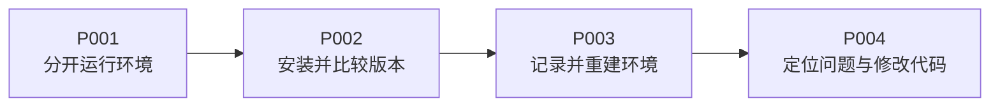

<!-- SPDX-FileCopyrightText: Copyright The zephyr_hc32f4a0 Contributors -->
<!-- SPDX-License-Identifier: Apache-2.0 -->

# Python venv：从运行程序到可重建环境

**venv** 是 Python 自带的模块名称，用来建立一个拥有独立包安装位置的环境。它解决“项目 A 和项目 B 依赖冲突”，并不安装另一套操作系统。

先完成[终端准备](../../P000_实验准备.md)。本教程用两个同名、不同版本的小包贯穿全过程，不要求先懂 Zephyr 或打包工具。先选对执行应用的 Python，再安装两版包比较结果；本机能运行后，把所需材料交给新环境重建，最后用导入失败和行为测试检验前面的判断。

| 顺序 | 本章解决的问题 | 亲手获得的证据 |
| --- | --- | --- |
| [P001 创建并认识虚拟环境](P001_创建并认识虚拟环境.md) | 什么程序在执行？激活改了什么？ | 解释器路径、环境前缀、激活前后对照 |
| [P002 安装包并验证版本隔离](P002_安装包并验证版本隔离.md) | 包装到了哪里？两个版本能否共存？ | 两个环境的问候语、版本号、安装位置 |
| [P003 配置依赖并重建环境](P003_配置依赖并重建环境.md) | 同事如何复现？怎样修改安装配置？ | 配置覆盖、依赖快照、离线重建 |
| [P004 排错与工程使用习惯](P004_排错与工程使用习惯.md) | 提示安装成功却导入失败怎么办？ | 诊断顺序、可编辑安装、选型与挑战 |

按 P001～P004 连续阅读，每章就地完成当前知识范围内的实验。实验统一使用 build/learning-tools/venv-textbook；[材料目录](labs/README.md)保存源码原件，不要求提前执行后续操作。

进入章节后，步骤图使用本章的小节编号，并在每节用黄色节点标明当前位置。每个命令块内写明目录，命令之后紧接用途和结果；整段文件写入及退出码查询按一个操作单元跟做，不把它们拆开执行。

第一次跟做时，先看操作图，确认自己在哪个目录、用哪个 Python；再读代码注释和紧随其后的解释，最后执行命令并核对结果。正文会提前标明故意制造的失败，并给出恢复步骤。如果看到不同结果，先停在当前步查原因，带着错误状态往后复制命令往往会让线索更多、更乱。

你不需要预先学完 Python。问候函数如何接收名字、return 与 print 的区别、测试为什么能发现输出变化，都会跟着实际例子讲；学完应能自己换一个名字、改一个版本，再解释结果为什么改变。

按章节顺序阅读时，P001 创建 A/B；P002 安装、替换和卸载后把两者恢复为第一版，保留 app、bootstrap 和 wheelhouse；P003 增加 rebuilt，临时配置练习后恢复选项；P004 在原应用上练习排错与测试，另用 dev 关联源码副本。清理安排在专题结束后，避免移除下一章需要的材料。

已测版本和自动验收见[验证记录](../../VALIDATION.md)，正文衔接修订与检查范围见[审阅记录](../../REVIEW.md)。
