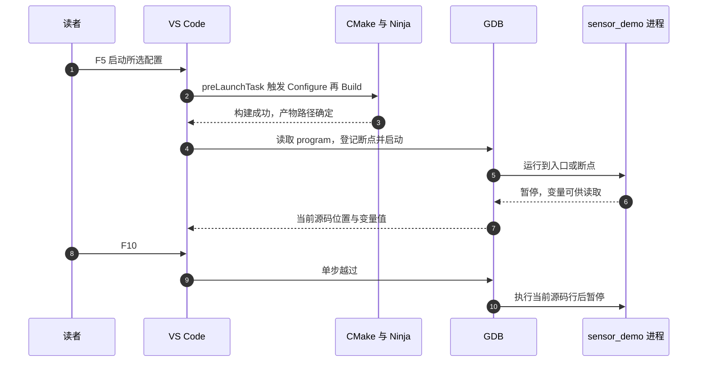
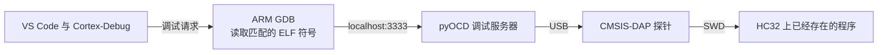

<!-- SPDX-License-Identifier: Apache-2.0 -->

# 第1章\_搭建编译与单步调试环境

终端里已经能编译程序，为什么 VS Code 还提示找不到编译器，或者断点始终不命中？编辑器界面把几项工作放在一起，却没有让它们变成同一个工具。

本章先用 CMake 第一章的原始程序，在电脑上观察 42 如何变成 43。配置、启动与单步都在这里说明。后半章再把这些关系对应到 Zephyr 固件与实板调试；没有连接开发板，也能完成主机实验。

本章路线如下；每节入口会用相同编号标出当前位置，可以随时回来接上操作。


**本章导航**

- [1.1 先让界面背后的程序工作](#section-1-1)
- [1.2 一份工作区怎样连接构建与调试](#section-1-2)
- [1.3 把 42 变成 43 的那一步停下来](#section-1-3)
- [1.4 不靠按钮，也能复核相同的过程](#section-1-4)
- [1.5 将编辑器指向 Zephyr 实验](#section-1-5)
- [1.6 从主机调试到实板调试](#section-1-6)

<a id="section-1-1"></a>

## 1.1\_先让界面背后的程序工作

当前位置：步骤 1.1，准备主机程序。


上一专题已经把 C 源码变成了可执行程序。这次想看的不只是最后一行输出，而是函数执行到中间时变量怎样变化。**GNU 调试器（GNU Debugger，GDB）** 能启动并暂停程序，读取变量，按源码行继续执行；VS Code 把这些操作接成按钮、变量面板和源文件中的箭头。

构建链仍是 CMake → Ninja → GCC。调试是程序生成以后的另一条链：VS Code 的 C/C++ 扩展把操作转给 GDB，GDB 再控制被调试进程。扩展不会替代编译器或调试器，因此先在终端确认下面四个工具都存在。

本章承接 CMake 第一章对源文件与目标的认识，但使用材料原件，不使用你已加限幅函数的复制品。在实验源码根目录的 UCRT64 Bash 中执行：

```bash
# 当前位置：实验源码根目录；使用 UCRT64 Bash。
gcc --version
```

这是编译器身份检查，只显示版本，不编译源码。后续主机实验应使用 UCRT64 的 GCC；若命令不存在，先安装本节列出的主机工具。

```bash
# 当前位置：实验源码根目录；使用 UCRT64 Bash。
gdb --version
```

确认终端能找到 GDB 调试器。能找到 GCC 不等于已经安装 GDB；缺少它时，后面的断点流程无法开始。

```bash
# 当前位置：实验源码根目录；使用 UCRT64 Bash。
cmake --version
```

确认 CMake 可启动并查看版本。它负责读取规则；下一条检查的 Ninja 才负责按生成的规则安排编译。

```bash
# 当前位置：实验源码根目录；使用 UCRT64 Bash。
ninja --version
```

显示 Ninja 版本即完成这项检查。这里只确认程序可用，还没有读取本章源码。

```bash
# 当前位置：实验源码根目录；使用 UCRT64 Bash。
cmake -S learning/cmake/labs/host -B build/learning-tools/cmake-host -G Ninja -DCMAKE_C_COMPILER=gcc -DCMAKE_BUILD_TYPE=Debug
```

这里 -S 选择源码，-B 选择生成物目录；-G Ninja 选择规则格式，-DCMAKE_C_COMPILER=gcc 指定主机 C 编译器，-DCMAKE_BUILD_TYPE=Debug 选择适合源码单步的构建设置。成功后会显示生成位置；这时规则已准备好，下一步才真正编译链接。

```bash
# 当前位置：实验源码根目录；使用 UCRT64 Bash。
cmake --build build/learning-tools/cmake-host
```

读取 --build 后那个目录中已生成的规则，完成需要的编译与链接。出现错误就停在此处看第一条具体错误；成功后才继续检查配置、运行程序或测试。没有改动时提示 no work to do 是正常的。

```bash
# 当前位置：实验源码根目录；使用 UCRT64 Bash。
./build/learning-tools/cmake-host/sensor_demo.exe
```

直接启动刚生成的主机程序。观察 value= 后的数，并按本节的数据处理链判断它；这一步才真正执行了 C 函数。

应输出 value=43。若缺少 GDB，可在 UCRT64 执行 `pacman -S --needed mingw-w64-ucrt-x86_64-gdb`。先解决这里的错误，再去界面；否则界面只会包装同一个底层失败。

接下来从 VS Code 扩展视图搜索并安装 Microsoft 的 **C/C++**（ms-vscode.cpptools）。它提供本实验使用的 cppdbg 调试适配；**CMake Tools**（ms-vscode.cmake-tools）用于 CMake 项目的配置与目标操作。本例已有明确任务，安装它后不必再开启另一套自动构建目录。

在同一个终端启动工作区：

```bash
# 当前位置：实验源码根目录；使用 UCRT64 Bash。
code learning/vscode/labs/tool-labs.code-workspace
```

打开这个 .code-workspace 文件，编辑器才会加载其中的任务和调试配置。只打开旁边某个 .c 文件，不等于已经进入这份教学工作区。

若 code 不在 PATH，可用 VS Code 的“文件→从文件打开工作区”选择这个文件，并在其终端核对上述工具。已有 VS Code 进程可能沿用旧环境，改变工具 PATH 后需要重新启动应用；在 Bash 新开一个窗口并不保证旧编辑器进程跟着更新。

<a id="section-1-2"></a>

## 1.2\_一份工作区怎样连接构建与调试

当前位置：步骤 1.2，连接任务与调试。


终端运行成功，说明主机工具已具备。现在把同样的命令接进编辑器，避免按构建按钮时编译 A，按调试按钮时却打开 B。

本例把配置集中在 `learning/vscode/labs/tool-labs.code-workspace`。`.code-workspace` 是 VS Code 的工作区文件格式，tool-labs 是自定文件名；单目录工程也常把任务与启动配置放在 .vscode/tasks.json、.vscode/launch.json。本实验直接打开配套工作区即可，无须再建另一套配置。

阅读下面完整配置时，先找三个连接点：folders 指向哪个源码根、Build 生成哪个程序、launch 的 program 是否指向同一程序。中文注释解释每组字段，暂时不需要背版本号或扩展名称。

```jsonc
// SPDX-License-Identifier: Apache-2.0
{
  "folders": [
    {
      "name": "tool-labs",
      // 相对本工作区文件向上三级，回到实验源码根目录。
      "path": "../../.."
    }
  ],
  "settings": {
    // 本章用显式任务配置，避免打开工作区就产生另一份构建目录。
    "cmake.configureOnOpen": false,
    // 供编辑器理解头文件与宏；它不执行编译。
    "C_Cpp.default.compileCommands": [
      "${workspaceFolder}/build/learning-tools/cmake-host/compile_commands.json"
    ]
  },
  "extensions": {
    // 推荐列表不会自动安装编译器或 GDB。
    "recommendations": [
      "ms-vscode.cpptools",
      "ms-vscode.cmake-tools"
    ]
  },
  "tasks": {
    "version": "2.0.0", // 任务配置格式版本，不是 CMake 版本。
    "tasks": [
      {
        "label": "Lab: Configure",
        // process 直接启动 command；args 每项都是一个独立参数。
        "type": "process",
        "command": "cmake",
        "args": [
          "-S",
          "${workspaceFolder}/learning/cmake/labs/host",
          "-B",
          "${workspaceFolder}/build/learning-tools/cmake-host",
          "-G",
          "Ninja",
          "-DCMAKE_C_COMPILER=gcc",
          "-DCMAKE_BUILD_TYPE=Debug"
        ],
        "problemMatcher": [
          "$gcc"
        ]
      },
      {
        "label": "Lab: Build",
        "type": "process",
        "command": "cmake",
        "args": [
          "--build",
          "${workspaceFolder}/build/learning-tools/cmake-host"
        ],
        "dependsOn": "Lab: Configure", // 构建前先确保规则已生成。
        "group": {
          "kind": "build",
          "isDefault": true // Ctrl+Shift+B 选择这个构建任务。
        },
        "problemMatcher": [
          "$gcc"
        ]
      }
    ]
  },
  "launch": {
    "version": "0.2.0", // 调试配置格式版本。
    "configurations": [
      {
        "name": "Lab: GDB step through calibration",
        "type": "cppdbg",
        "request": "launch", // 由调试器启动一份新的主机进程。
        "program": "${workspaceFolder}/build/learning-tools/cmake-host/sensor_demo.exe",
        "cwd": "${workspaceFolder}", // 被调试程序的工作目录。
        "MIMode": "gdb",
        "miDebuggerPath": "gdb",
        "stopAtEntry": true, // 第一次先停在入口，再继续到用户断点。
        "externalConsole": false,
        "preLaunchTask": "Lab: Build", // 必须与上方任务 label 完全一致。
        "linux": {
          "program": "${workspaceFolder}/build/learning-tools/cmake-host/sensor_demo"
        },
        "osx": {
          "program": "${workspaceFolder}/build/learning-tools/cmake-host/sensor_demo"
        }
      }
    ]
  }
}
```

folders 中的 ../../.. 相对工作区文件位置，指向实验源码根；${workspaceFolder} 因而代表这个根目录。运行时展开成当前机器位置，是编辑器的变量替换，不是把作者绝对路径写进学习资料。

tasks 的 Configure 对应刚才的 CMake 配置命令，Build 通过 dependsOn 先调用它，再构建。process 类型直接启动程序，不要求读者学习 PowerShell 脚本。problemMatcher 把 GCC 错误解析到问题列表，不参与编译。

launch 选择 cppdbg 与 GDB，program 指向刚生成的可执行文件，miDebuggerPath 指 GDB；preLaunchTask 必须与构建任务标签一致。stopAtEntry 让第一次启动先停在入口，便于确认调试器确实接管了这个进程。

compileCommands 让语言服务读取真实宏与头文件参数。它能改善编辑器理解，却不会替代 Build；代码补全正确也不证明链接已经通过。



图中第 2 步先构建，后面才启动程序。若 Build 报错，先修好它；若 VS Code 提示仍要调试旧产物，应取消这次启动。第 7 步出现的变量属于这次运行的进程，修改编辑器里的源码不会自动改掉暂停中的程序。

需要迁移配置时，先改 Configure 的 -S/-B，再同步 program 与 compileCommands；不要只改一个看得见的路径。字段含义可在 [VS Code C/C++ 调试配置](https://code.visualstudio.com/docs/cpp/launch-json-reference)中对照 program、cwd、stopAtEntry。

<a id="section-1-3"></a>

## 1.3\_把 42 变成 43 的那一步停下来

当前位置：步骤 1.3，断点观察变量。


任务与调试器已经接到同一程序上，现在选择一个结果明确的暂停点。主机样例仍以 21 为输入，scale_sample 已经把它变为 42；我们要亲眼观察 calibrate 何时把 42 加为 43。本次 calibrate.c 的完整函数是：

```c
#include "calibrate.h"

int calibrate(int value)
{
    int corrected = value + 1; /* 停在此行时尚未执行；单步之后才得到 43。 */
    return corrected;
}
```

在资源管理器打开 learning/cmake/labs/host/src/calibrate.c，点击 `int corrected = value + 1;` 左侧行号栏，或把光标放到该行按 F9。红点表示请求在此处暂停。

接下来按以下顺序操作，每一步都先看现场，再按下一个键：

1. 按 Ctrl+Shift+B，观察“终端”中的任务输出，确认构建成功。报错时留在这里处理，不先启动调试。
2. 打开左侧“运行和调试”，在配置列表选择 `Lab: GDB step through calibration`。若没有这个名字，先确认打开的是配套工作区。
3. 按 F5。stopAtEntry=true 会让程序先在入口暂停；看到源码当前行箭头和调试工具栏，说明调试会话已经建立。
4. 再按 F5，继续到 calibrate 中刚设的断点。当前行箭头停在赋值行，才进入下面的变量观察。

停在赋值行时，这一行尚未执行。此刻在“变量”或“监视”中查看 value，应为 42；corrected 即使显示一个数，也不应把未赋值内容当作运算结果。按 F10 执行当前行，再看 corrected，应为 43。

F10 单步越过调用，F11 尝试进入调用，Shift+F11 返回调用者，F5 继续运行。先在 main 的 scale_sample 调用处加断点，可观察“进入函数”和“越过函数”的差别；已经在一行普通赋值上时，F11 不会凭空找到另一个函数。

继续后程序输出 43 并退出。停止调试会终止这次主机进程，不会删除构建产物；重启调试可以重新观察。

<a id="section-1-4"></a>

## 1.4\_不靠按钮，也能复核相同的过程

当前位置：步骤 1.4，命令行复核。


界面里的操作其实有对应的调试命令。若想把刚才的观察保存成可重复执行的过程，可以让 GDB 读取命令文件。inspect.gdb 是本例自定名称，后面的 -x 显式选择它；扩展名不会让 GDB 自动执行这个文件。

材料 inspect.gdb 的内容是（这是 GDB 命令，不要直接粘贴进 Bash）：

```gdb
set pagination off
# 在校准函数的入口设置断点，run 之后才开始运行。
break calibrate
run
# 赋值前读输入；next 执行当前源码行，再读局部结果。
print value
next
print corrected
continue
```

pagination off 取消分屏等待，break 按函数名设断点，run 启动，print 取值，next 对应单步越过，continue 继续。从仓库根执行：

```bash
# 当前位置：实验源码根目录；使用 UCRT64 Bash。
gdb -q -batch -x learning/vscode/labs/inspect.gdb build/learning-tools/cmake-host/sensor_demo.exe
```

-q 减少启动介绍，-batch 依次执行后退出，-x 读取下一参数指定的 GDB 命令文件；最后一个参数才是被调试程序。应依次观察到 value 为 42、corrected 为 43。

-q 减少启动介绍，-batch 执行后退出，-x 读取命令文件。预期两次变量观察是 42、43，最后进程正常结束。Linux/macOS 去掉可执行文件后缀 .exe，并使用当地安装的 GDB。

若命令行能停而界面不能，先比较两边 program、GDB 和启动环境；若两边都不能，先查 Debug 构建、源码与二进制是否匹配。灰色断点常表示位置尚未解析到当前程序；优化也可能改变源码与指令的一一对应关系。不要把每次断点问题都归为插件安装失败。[VS Code 的 MinGW 配置说明](https://code.visualstudio.com/docs/cpp/config-mingw)可用于核对工具与扩展的分工。

<a id="section-1-5"></a>

## 1.5\_将编辑器指向 Zephyr 实验

当前位置：步骤 1.5，切回项目入口。


主机实验已经走通，接下来在 VS Code 中用“文件 → 打开文件夹”打开 `G:\zephyr_practice\zephyr-main`。这是后续 Zephyr 构建与移植的工作位置。SDK 章使用 ARM 交叉编译器，产物是目标固件；前面的 Windows `sensor_demo` 启动项不能用来运行它。

Python 解释器选择该目录下 `.venv/Scripts/python.exe`。需要补全和跳转时，将 C/C++ 的 `compileCommands` 指向实际构建生成的 `compile_commands.json`，例如[主线 P011](../P01_zephyr_make_project/P011_编译示例与新增开发板_Windows.md#section-11-3)配置的 `build/learning-tools/p003/build-mps2-sdk-auto/compile_commands.json`；`p003` 是保留的实验目录标识，不是当前章号。这样编辑器读取的是同一次构建中的头文件路径与编译宏。

先在终端按正文完成明确的 CMake 配置和编译，再把同一组命令加入自己的 VS Code 任务。工作目录、源码、模块、SDK、目标和输出目录必须一致；新开集成终端时按准备章恢复环境。

各类扩展的用途如下，按需要安装，不是完成主机实验前必须装齐的清单：

| 工作 | 扩展 ID | 真正执行的工具 |
| --- | --- | --- |
| 主机 C/C++ 调试 | ms-vscode.cpptools | GCC、GDB |
| CMake 配置与目标操作 | ms-vscode.cmake-tools | CMake、Ninja |
| Cortex-M 调试 | marus25.cortex-debug | ARM GDB、调试服务器 |
| Python 解释器选择 | ms-python.python | 本机 Python/项目 .venv |
| 设备树与 Kconfig 编辑提示 | plorefice.devicetree、luveti.kconfig | 最终检查仍由构建系统执行 |

<a id="section-1-6"></a>

## 1.6\_从主机调试到实板调试

当前位置：步骤 1.6，认识实板链路。


主机 GDB 可以直接控制本机进程。微控制器不在本机进程列表中，所以还需要 **GDB server**：它把 GDB 请求转成调试探针操作。本节举例的链路是 ARM GDB → pyOCD → CMSIS-DAP → HC32。



沿图排查会更有方向：编辑器找不到配置查工作区；GDB 无法连接查服务器；服务器找不到探针查 USB 枚举；已连接却停在错误源码位置，再核对 ELF 与板上固件是否一致。后两层需要真实硬件，前面的主机实验不能替代它们。

实板调试属于后续阶段：必须先在 G 盘实验源码树完成 HC32 移植，生成匹配的 ELF，并核对探针、芯片目标与内存映射。当前原生 `mps2/an386` 固件只能验证原生编译环境，不能用于 HC32。

调试步骤依次是：构建 HC32 固件，核对并下载固件，启动带有正确目标配置的 GDB server，再让 Cortex-Debug 连接。扩展的 ELF 路径和 ARM GDB 路径取自本次实际构建与 SDK。服务器地址和端口以实际启动参数为准。

`attach` 表示附加到目标，不会自动将 ELF 烧入开发板；板上固件与符号文件必须一致。具体 pyOCD 目标支持、SRAM 地址、SWD 频率与禁止自动解锁等配置属于移植与硬件验证内容，在这些条件完成以前，本节只用于理解调试链路。结束时停止编辑器调试会话并关闭服务器。

主机的变量观察证明的是本机工具链路；它没有验证 HC32 的 SWD、Flash 或接线。图形按键步骤和硬件连接都需要读者在自己的环境核对，维护者命令行实测范围另记在验证文档中。

[大纲](大纲.md) · [Cortex-Debug 配置依据](https://github.com/Marus/cortex-debug/blob/master/debug_attributes.md)
