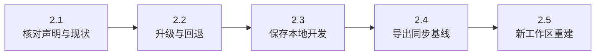
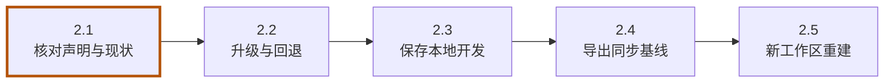
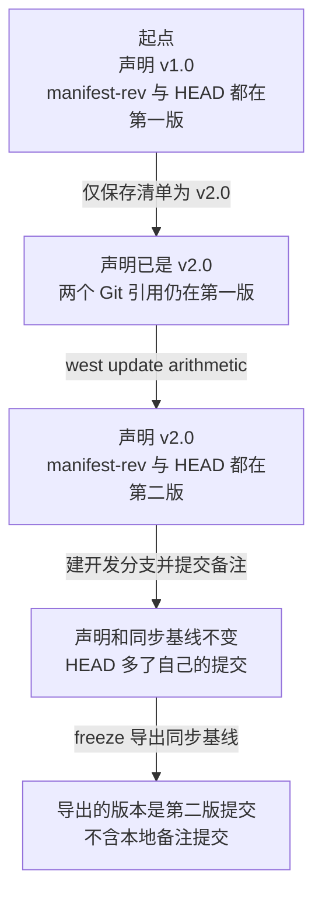
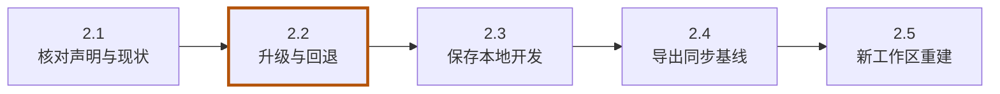
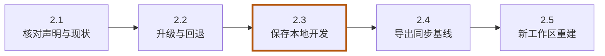
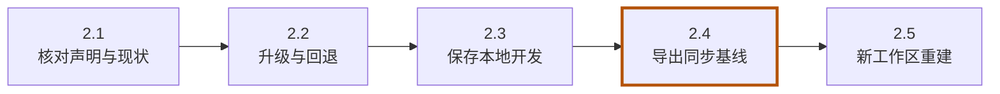
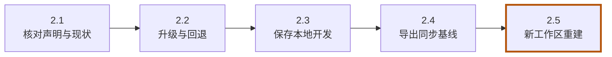

<!-- SPDX-FileCopyrightText: Copyright The zephyr_hc32f4a0 Contributors -->
<!-- SPDX-License-Identifier: Apache-2.0 -->

# 第2章\_管理版本与本地开发

上一章结束时，清单选定 app v1.0 和 arithmetic v1.0，工作副本中的两份代码已经一起输出了 5。源仓库里还准备了库的第二版，它增加了乘法函数 multiply。应用团队现在想试用这个函数，我们需要让原来的配套组合接受一次版本变化。

第一章已经看到，保存清单和取得源码发生在不同步骤。本章沿着同一个工作区继续观察：先只改版本声明，再执行同步，最后在库中提交自己的改动。这样就能分清“要求使用的版本”“west 最近同步的基线”和“当前检出的提交”。有了这三个位置，才有依据判断导出的冻结清单能交给同事哪些内容。

> **这章不用记住长提交号。** 每次只比较“是否相同”。准备在编辑器中打开 manifest/west.yml，终端留在原 workspace；改完文件先保存，再回终端查询。先不要同时改 app 或库源码，否则很难看出是哪一步让版本发生了变化。

本章按下面的步骤推进；各节会重现这张路线图，并标出当前位置。图用于找回进度，具体命令在对应步骤中执行。



**本章导航**

- [2.1 清单写的是愿望，文件里才是当前版本](#section-2-1)
- [2.2 从第一版升级到第二版，再退回](#section-2-2)
- [2.3 在依赖里开发时先建立自己的分支](#section-3-1)
- [2.4 冻结的不是任意当前 HEAD](#section-3-2)
- [2.5 从冻结文件重建工作区](#section-4-1)

<a id="section-2-1"></a>

## 2.1\_清单写的是愿望，文件里才是当前版本

**当前位置：步骤 2.1「核对声明与现状」；黄色节点表示本节。**



当前位置：P001 建立的 `build/learning-tools/west/textbook-01/workspace/`，工具环境仍保持激活。新窗口从实验源码根目录执行下面三行，即可回到本章起点；不重复 init：

```bash
# 当前位置：实验源码根目录；终端：UCRT64 Bash。
source build/learning-tools/west-textbook-tools/Scripts/activate
```

让当前 Bash 读取 `build/learning-tools/west-textbook-tools/Scripts/activate`，把这个环境的命令目录放到搜索路径前面。后续短命令 python 由它优先提供；不会搬动应用源码。

```bash
# 当前位置：实验源码根目录；终端：UCRT64 Bash。
export MSYS="${MSYS:+$MSYS }noglob"
```

保留已有 MSYS 选项，再追加 noglob，仅影响当前终端及子进程。这是本实验 Windows Python 与 MSYS Git 之间的参数兼容设置，避免 Git 再展开带大括号的引用；不关闭 Bash 自己的通配符。

```bash
# 当前位置：实验源码根目录；终端：UCRT64 Bash。
cd build/learning-tools/west/textbook-01/workspace
```

把当前终端切换到 `build/learning-tools/west/textbook-01/workspace`；后续相对路径从切换后的目录计算。上面的注释是切换前位置，下一块会标出切换后位置。

先给即将发生的变化留一份可比较的观察。清单里的 **revision** 字段目前写 v1.0，是我们要求使用的版本标签。Git 中的 **HEAD** 表示当前实际检出位置。二者表达层次不同：一个是声明里的文字，一个是本地实际选中的提交。下面除了查看这两个位置，还读取 west 在库仓库中留下的同步记录：

```bash
# 当前位置：build/learning-tools/west/textbook-01/workspace；终端：UCRT64 Bash。
west list arithmetic -f "{name}: wanted={revision}, path={path}"
```

读取清单并列出项目，`-f` 后的花括号由 west 替换成字段值。重点核对本步改变的版本、路径或 active/cloned 状态；list 本身不克隆源码。

```bash
# 当前位置：build/learning-tools/west/textbook-01/workspace；终端：UCRT64 Bash。
git -C libs/arithmetic rev-parse HEAD
```

把 `libs/arithmetic` 中的 `HEAD` 解析为完整提交标识。HEAD 是当前实际检出；记下它与声明、同步基线作比较。

```bash
# 当前位置：build/learning-tools/west/textbook-01/workspace；终端：UCRT64 Bash。
git -C libs/arithmetic rev-parse manifest-rev
```

把 `libs/arithmetic` 中的 `manifest-rev` 解析为完整提交标识。manifest-rev 记录 west 的同步基线，不自动包含自己的开发分支提交。

```bash
# 当前位置：build/learning-tools/west/textbook-01/workspace；终端：UCRT64 Bash。
git -C libs/arithmetic status --short --branch
```

查看 `libs/arithmetic` 的分支和修改状态。`--short --branch` 使用简洁格式；HEAD (no branch) 表示直接检出某个提交，不等于仓库坏了。

list 的 arithmetic 把查询限定在这个项目，wanted 后显示声明 v1.0。Git 的 `-C libs/arithmetic` 表示进入该仓库执行后续子命令，而不改变外层 Bash 的目录。`rev-parse HEAD` 把当前引用解析为完整提交标识。

第三条出现的 **manifest-rev** 是 west 在这个普通项目仓库里维护的引用，记录最近一次同步解析出的提交。它使我们在后续改动 HEAD 后仍能找到同步基线。第一次 update 后 HEAD 与 manifest-rev 应相同，但这只是此刻的关系；后面会故意让二者不同。不要把 manifest-rev 当成自己的开发分支。

最后的 status 中，`--short` 采用简洁输出，`--branch` 额外显示分支状态。此时常见 **游离头状态（detached HEAD）**，即 HEAD 直接指向提交，没有挂在自己的本地分支上。固定使用一版依赖时这是正常状态；要做持续开发则应建立自己的分支，让新提交有一个明确归属。

接下来的操作顺序可以这样读。每一格都用三项状态说明当前位置，图中的“第一版提交”“第二版提交”才是我们要比较的关系，不是让你输入的字面文本：



重点看从第二格到第三格：保存 YAML 没有执行 Git 检出，update 才使文件变化。最后一格则留给后面的冻结实验验证；现在先把第一处版本切换做出来。

运行应用后还可能看到 ?? __pycache__/，它是 Python 导入模块产生的缓存，?? 表示未跟踪文件，不是源代码自己发生了修改。实验不用它作为提交内容。真实 Python 项目通常把这类生成文件加入 .gitignore；不要为了让状态看起来干净而把缓存提交进源码历史。

rev-parse 输出的是一长串提交标识，后面会反复用它判断两个引用是否指向同一个提交。**SHA（Secure Hash Algorithm）** 是散列算法家族名，Git 文档常把对象的散列标识简称 SHA。实验比较这些完整标识之间的关系，不要求它们与笔记作者的值相同；源文件即使一样，提交时间等信息不同也会产生不同的提交身份。

<a id="section-2-2"></a>

## 2.2\_从第一版升级到第二版，再退回

**当前位置：步骤 2.2「升级与回退」；黄色节点表示本节。**



现在三个位置都对应第一版，还看不出各自的作用。先只改变一个条件：在 manifest/west.yml 中把 arithmetic 的 revision 改为 v2.0，其他字段和项目不动。该条目改完后如下：

```yaml
- name: arithmetic
  url: ../../../remotes/arithmetic
  revision: v2.0
  path: libs/arithmetic
```

保存后先运行上一节的观察命令。list 应显示 v2.0，但 HEAD 和 manifest-rev 仍是先前的提交。原因是文件编辑只改变“下次同步采用什么要求”，没有执行 Git 获取或检出。接着验证声明并只同步 arithmetic：

```bash
# 当前位置：build/learning-tools/west/textbook-01/workspace；终端：UCRT64 Bash。
west manifest --validate
```

解析当前清单并检查格式。成功可能没有文字输出；报错时先修字段、缩进或导入文件，再继续同步。通过不代表仓库已下载或程序可运行。

```bash
# 当前位置：build/learning-tools/west/textbook-01/workspace；终端：UCRT64 Bash。
west update arithmetic
```

只同步选中的 `arithmetic` 项目：缺失时取得仓库，已存在时获取所需对象并检出声明的版本。源端有新版但清单仍固定旧版时，不会自动升级。

```bash
# 当前位置：build/learning-tools/west/textbook-01/workspace；终端：UCRT64 Bash。
git -C libs/arithmetic rev-parse HEAD
```

把 `libs/arithmetic` 中的 `HEAD` 解析为完整提交标识。HEAD 是当前实际检出；记下它与声明、同步基线作比较。

```bash
# 当前位置：build/learning-tools/west/textbook-01/workspace；终端：UCRT64 Bash。
git -C libs/arithmetic rev-parse manifest-rev
```

把 `libs/arithmetic` 中的 `manifest-rev` 解析为完整提交标识。manifest-rev 记录 west 的同步基线，不自动包含自己的开发分支提交。

arithmetic 是 west 的项目标识；不写它时 update 默认处理所有活动项目。现在 HEAD 与 manifest-rev 应一起变成第二版对应的提交。第二版 arithmetic.py 的有效源码完整如下：

```python
# 保留第一版的接口，原来的 app/main.py 仍可以调用它。
def add(a, b):
    return a + b

# 第二版新增的接口，用不同结果证明我们确实取得了新代码。
def multiply(a, b):
    return a * b
```

加法没有改变，新增乘法。因此只观察原应用输出 5，还无法区分第一版和第二版；要实际调用新函数：

```bash
# 当前位置：build/learning-tools/west/textbook-01/workspace；终端：UCRT64 Bash。
python -c "import sys; sys.path.insert(0, 'libs/arithmetic'); from arithmetic import multiply; print(multiply(2, 3))"
```

短程序先把 libs/arithmetic 加入搜索路径，再导入第二版新增的 multiply 并打印 multiply(2, 3)。应得到 6；如果仍是第一版，就没有这个函数。

```bash
# 当前位置：build/learning-tools/west/textbook-01/workspace；终端：UCRT64 Bash。
python app/main.py
```

从工作副本运行应用。它自己计算相邻库目录，导入 add 并显示 `2 + 3 = 5`；west 只负责取得配套源码，加法由 Python 执行。

预期乘法输出 `6`，原应用仍输出 `2 + 3 = 5`。`sys.path.insert` 是本例显式加入导入目录的写法，不代表 west 自动替应用配置 Python 搜索路径。

那条 `python -c` 命令沿用第一章的四个动作：导入 sys，把 libs/arithmetic 加入搜索路径，取得 multiply，再把 `multiply(2, 3)` 返回的 6 打印出来。这里只有一次直接调用，不会修改库文件；它的目的就是区分“仍能做加法”和“已经取得乘法接口”。

再把 arithmetic 的 revision 改回 v1.0，执行 west update arithmetic，然后重复上述两个运行命令。**这次乘法导入失败是我们要观察的结果**，因为第一版没有 multiply；原应用仍成功，因为 add 仍然存在。Bash 紧接失败命令执行 `echo $?` 可观察非零退出码。最后恢复 v2.0 并更新，供后续实验使用。

把这段过程整理成状态关系，才能判断以后某次更新是否完成：

| 时刻 | 清单 revision | manifest-rev | HEAD 与文件 |
| --- | --- | --- | --- |
| 初次更新后 | v1.0 | 第一版提交 | 第一版，只有 add |
| 只编辑清单 | v2.0 | 仍为第一版 | 仍为第一版 |
| update arithmetic 后 | v2.0 | 第二版提交 | 第二版，增加 multiply |
| 声明退回 v1 并 update | v1.0 | 第一版提交 | 重新使用第一版 |

因此 update 的含义是按照声明同步，既能升级也能回退；不能把它理解为无条件追逐最新版。

刚才从第一版到第二版的变化，可以还原为一次普通项目同步：west 读取 revision，按需要通过 Git fetch 取得对象，再移动 manifest-rev，最后检出该提交。清单编辑决定目标，update 才实施切换。这也解释了它与 `git pull` 的区别：west 不按每个本地开发分支的上游关系合并代码，而是按清单选择基线。

这套更新对象是清单中的普通项目，顶层 manifest 仓库自身由开发者使用 Git 管理。否则，正在被读取的配套声明会在一次依赖更新中自行换成另一版，开发者便难以确认本次接受的是哪组要求。

官方对照：[west update](https://docs.zephyrproject.org/latest/develop/west/built-in.html#west-update)；安装版本的 `west update -h` 也逐项说明该流程。

### 从 revision 属性追到真正的 Git 进程

现在可用第二版已同步的 arithmetic 观察实现。执行下面的命令；`-vv` 是 west 全局详细日志选项，放在 update 前，`--fetch=always` 则属于 update，用于让本次确实走获取分支：

```bash
# 当前位置：build/learning-tools/west/textbook-01/workspace；终端：UCRT64 Bash。
west -vv update --fetch=always arithmetic
```

它仍在执行同步，会更新引用并按默认策略检出目标，不是只打印计划。应在尚未开始下一节本地开发、工作副本没有待保存修改时运行。日志中查找 `running 'git ...' in ...`，把 Git 参数与执行目录对应起来。提交号随实验生成时间不同，不要逐字比对；默认 smart 获取策略下已知 tag/commit 可能跳过 fetch，因此本次特意指定 always。

下面是 west 1.5.0 中可直接查找的函数名。[app/project.py](https://github.com/zephyrproject-rtos/west/blob/v1.5.0/src/west/app/project.py) 保存内建项目命令，[manifest.py](https://github.com/zephyrproject-rtos/west/blob/v1.5.0/src/west/manifest.py) 保存 Project 类和 Git 调用封装。

不用猜安装包在哪个盘；在已激活的教学环境运行下面的查询，再用编辑器打开输出路径即可对照。`__file__` 是 Python 模块的来源文件属性；这里导入模块并打印来源，不执行 update：

```bash
# 当前位置：build/learning-tools/west/textbook-01/workspace；终端：UCRT64 Bash。
python -c "import west.app.project; import west.manifest; print(west.app.project.__file__); print(west.manifest.__file__)"
```

输出应属于当前工具环境的 west 包。阅读这些文件可以知道内建行为在哪里实现；团队新增规则的可编辑位置则在第四章的清单仓库中。

| 执行位置 | 消费哪些输入 | 实际动作与结果 |
| --- | --- | --- |
| `Update.do_run()`，随后 `update_some()` 或 `update_all()` | 命令行项目选择、配置与清单 | 确定要同步的项目；全部更新还处理项目导入 |
| `Update.update(project)` | 一个 Project 对象 | 按固定流程调度以下步骤；不是执行 YAML 中保存的命令 |
| `ensure_cloned()` → `init_project()` | `project.abspath`、`url`、`remote_name` | 无本地仓库且无缓存时执行 `git init`，再 `git remote add`；缓存路径可能使用 clone |
| `set_new_manifest_rev()` → 按需 `fetch()` | `project.revision`、`url`、获取选项 | 执行 `git fetch`，取得对象；解析目标提交后更新 `refs/heads/manifest-rev` |
| `decide_update_strategy()` 与 update 的后半段 | 当前分支、祖先关系、`--rebase` / `--keep-descendants` | 默认执行 `git checkout --detach <sha>`；显式策略可改为 rebase 或保留后代分支 |
| `update_submodules()` | 项目的 submodules 声明 | 仅按所配置子模块规则执行相应 Git 操作；本实验未启用 |
| `Project.git()` | Git 子命令参数、可选 cwd | 创建 Git 子进程，等待完成，把输出和退出码交回调用者 |

`fetch()` 用清单解析得到的 URL 获取对象，不依赖你手工修改后的 origin 地址。把镜像地址只改在 Git remote 中，不能推断 west update 以后就会从该镜像取；需要修改清单的 url 或 remote 规则。多个项目同步也不是一笔可自动回滚的事务。

最底层 `Project.git()` 的职责可用下面的**讲解用等价片段**表示；它省略了上游日志、字符串参数兼容等细节，不是让你覆盖安装包的代码：

```python
# project.abspath 由工作区根和解析后的 path 得到。
argv = ["git", "rev-parse", "HEAD"]  # 列表中的每项是一个参数，不是 shell 文本。
process = subprocess.Popen(argv, cwd=project.abspath, stdout=subprocess.PIPE)
stdout, stderr = process.communicate()  # 等待 Git，获取字节输出。
if process.returncode != 0:
    raise subprocess.CalledProcessError(process.returncode, argv, output=stdout)
```

`Popen` 启动的是 PATH 查找到的 Git 可执行程序；`cwd` 指定这个 Git 进程在哪个仓库运行，通常为 project.abspath，初始化等步骤可显式覆盖。这里没有 `shell=True`，参数不会作为 Bash/PowerShell 脚本再解释。真实的程序调用接口（API，Application Programming Interface）返回 `CompletedProcess` 对象，其中有 `returncode`、`stdout`、`stderr`；默认 `check=True` 会在非零退出时抛出异常，`capture_stdout=True` 才将标准输出交给 Python 而非直接显示。第四章会亲手用这套接口写命令。

由此可以决定改哪里：换配套版本改 YAML 的 revision；给团队增加一条 Git 检查，改自己扩展的 `do_run()` 并调用 `project.git([...])`；若要改变所有内建 update 的同步算法，才涉及维护 west 工具的源码分支及发行包。直接编辑 `.venv/site-packages` 会在重装后丢失修改，也无法随清单仓库交付，不作为团队方案。

<a id="section-3-1"></a>

## 2.3\_在依赖里开发时先建立自己的分支

**当前位置：步骤 2.3「保存本地开发」；黄色节点表示本节。**



版本切换已经完成，arithmetic 目前检出第二版，HEAD 与 manifest-rev 仍然相同。此前我们只是使用发布过的库；现在把任务改为在库中做自己的开发。为了观察新提交与同步基线的关系，只添加一份开发备注，不改 add 或 multiply 的行为。

先检查工作区是否有尚未保存的修改，再为这次开发建立自己的分支。下列提交只发生在本章创建的小型 Git 实验库中：

```bash
# 当前位置：build/learning-tools/west/textbook-01/workspace；终端：UCRT64 Bash。
west status
```

查看项目中的未提交状态，开始切换或创建分支前先辨认已有修改；干净状态仍不代表当前提交与清单一致。

```bash
# 当前位置：build/learning-tools/west/textbook-01/workspace；终端：UCRT64 Bash。
west diff
```

展开项目中尚未提交的代码差异。没有输出可能表示没有相应差异，仍需单独检查实际提交。

```bash
# 当前位置：build/learning-tools/west/textbook-01/workspace；终端：UCRT64 Bash。
git -C libs/arithmetic switch -c learning/local-note
```

从当前提交创建并切换到 learning/local-note 分支，把接下来的开发提交放在自己的分支上。先前的清单版本声明不会因此改变。

switch 的 `-c` 创建并检出自己的 learning/local-note 分支，新分支起点就是当前第二版提交。现在把备注写进名为 LOCAL_NOTE.md 的文本文件，再提交。下面 printf 在 Bash 中创建该文件，Git 的 add 只暂存这一个练习文件：

```bash
# 当前位置：build/learning-tools/west/textbook-01/workspace；终端：UCRT64 Bash。
printf '%s\n' 'Local development experiment.' > libs/arithmetic/LOCAL_NOTE.md
```

用 `%s\n` 把每个给定字符串写成一行，写入并替换 `libs/arithmetic/LOCAL_NOTE.md`。这里只写文件，下一条读取或提交命令才会使用它。

```bash
# 当前位置：build/learning-tools/west/textbook-01/workspace；终端：UCRT64 Bash。
git -C libs/arithmetic add LOCAL_NOTE.md
```

把 `libs/arithmetic` 中指定文件的当前内容加入暂存区，准备组成下一次提交；还没有创建提交或影响别的仓库。

```bash
# 当前位置：build/learning-tools/west/textbook-01/workspace；终端：UCRT64 Bash。
git -C libs/arithmetic -c user.name="Learning Lab" -c user.email="learning@example.invalid" -c commit.gpgsign=false commit -m "Add a local development note"
```

在 `libs/arithmetic` 创建本次提交。命令中的 -c 临时设置教学身份并关闭本次签名，-m 后是提交说明；不修改全局身份或自动发布到其他位置。

```bash
# 当前位置：build/learning-tools/west/textbook-01/workspace；终端：UCRT64 Bash。
git -C libs/arithmetic rev-parse HEAD
```

把 `libs/arithmetic` 中的 `HEAD` 解析为完整提交标识。HEAD 是当前实际检出；记下它与声明、同步基线作比较。

```bash
# 当前位置：build/learning-tools/west/textbook-01/workspace；终端：UCRT64 Bash。
git -C libs/arithmetic rev-parse manifest-rev
```

把 `libs/arithmetic` 中的 `manifest-rev` 解析为完整提交标识。manifest-rev 记录 west 的同步基线，不自动包含自己的开发分支提交。

```bash
# 当前位置：build/learning-tools/west/textbook-01/workspace；终端：UCRT64 Bash。
git -C libs/arithmetic log --oneline manifest-rev..HEAD
```

显示 manifest-rev 到 HEAD 之间多出的提交。双点范围帮助看清自己的开发历史与同步基线差在哪里。

此时 HEAD 随开发分支前进了一次，manifest-rev 仍是第二版基线。log 的 `manifest-rev..HEAD` 表示列出 HEAD 可到达、而基线不可到达的提交；本例应只出现备注提交，--oneline 让每个提交占一行。命令中的 Git `-c` 只为本次调用提供教学身份及关闭签名，和 switch -c 的“创建分支”不是同一个选项；真实项目使用自己的身份和团队规范。

自己的分支已经比清单基线多了一个提交。如果再次按清单 update，west 会继续保留这个检出位置，还是回到第二版？这次备注已经提交在命名分支上，可以观察切换后分支和文件分别去了哪里：

```bash
# 当前位置：build/learning-tools/west/textbook-01/workspace；终端：UCRT64 Bash。
west update arithmetic
```

只同步选中的 `arithmetic` 项目：缺失时取得仓库，已存在时获取所需对象并检出声明的版本。源端有新版但清单仍固定旧版时，不会自动升级。

```bash
# 当前位置：build/learning-tools/west/textbook-01/workspace；终端：UCRT64 Bash。
git -C libs/arithmetic status --short --branch
```

查看 `libs/arithmetic` 的分支和修改状态。`--short --branch` 使用简洁格式；HEAD (no branch) 表示直接检出某个提交，不等于仓库坏了。

```bash
# 当前位置：build/learning-tools/west/textbook-01/workspace；终端：UCRT64 Bash。
git -C libs/arithmetic branch --list learning/local-note
```

只查询 learning/local-note 分支是否仍存在；此时还没有切换过去，下一条 switch 才会把其文件检出。

```bash
# 当前位置：build/learning-tools/west/textbook-01/workspace；终端：UCRT64 Bash。
git -C libs/arithmetic switch learning/local-note
```

切回此前保存的 learning/local-note 分支。备注提交仍由这条分支保存；update 切换过工作副本，并没有删除该分支。

更新默认离开开发分支，回到清单版本；第二条应显示游离状态，第三条却仍能找到自己的分支。最后 switch 回去，备注文件应重新出现。因此“切换到基线”不等于“删除开发分支”。本节文件已提交，切换条件简单；真实工作中先检查并保存未提交变更，不能假定所有脏工作树都能顺利切换。

> **看到备注文件暂时消失，先别慌。** 这一步检查的就是“当前看哪次提交”。先看 branch --list 是否仍列出 learning/local-note，再执行最后的 switch；备注回来，说明它保存在那条分支里。不要为了让文件重新出现手工再写一份，否则会混淆已有提交和新的未提交修改。

如果希望更新基线后继续开发，可以有意选择别的策略：`west update -k` 在本地分支是新基线后代等满足条件时保留检出；`-r` 尝试把本地提交变基到新基线，可能产生冲突。本章继续采用已经观察过的默认行为。此刻已按最后一条 switch 回到 learning/local-note，备注再次可见，但它还只存在于本机开发分支。

<a id="section-3-2"></a>

## 2.4\_冻结的不是任意当前 HEAD

**当前位置：步骤 2.4「导出同步基线」；黄色节点表示本节。**



上一节证明，普通 update 可以切走自己的开发分支，分支中的提交却仍被保存。现在考虑另一种需求：把当前这套版本组合交给同事。库里的 LOCAL_NOTE.md 已经提交，自己也看得到它，但它所在的 HEAD 已经不同于 manifest-rev；导出清单时究竟记录哪一个位置，会直接决定同事能否拿到这份备注。

west 提供两种不同导出。**展开（resolve）** 把清单及导入内容合成为一份声明，保留版本选择的语义；**冻结（freeze）** 在本次 west 1.5.0 中还会把普通项目 revision 换成最近 manifest-rev 的完整提交标识。这个定义已经提示：freeze 记录同步基线，不是任意当前 HEAD 的拍照。

保持上一节 `learning/local-note` 分支已检出，执行：

```bash
# 当前位置：build/learning-tools/west/textbook-01/workspace；终端：UCRT64 Bash。
west manifest --resolve --active-only -o ../west-resolved.yml
```

把导入展开后的有效清单写到 `-o` 指定文件，`--active-only` 只保留当前活动项目。版本仍按声明表达；下一步可以与冻结后的提交标识对照。

```bash
# 当前位置：build/learning-tools/west/textbook-01/workspace；终端：UCRT64 Bash。
west manifest --freeze --active-only -o ../west-frozen.yml
```

把当前同步基线记录为完整提交标识并写到 `-o` 文件；`--active-only` 排除停用项目。它不把自己分支上多出的提交自动接受为配套版本。

```bash
# 当前位置：build/learning-tools/west/textbook-01/workspace；终端：UCRT64 Bash。
git -C libs/arithmetic rev-parse HEAD
```

把 `libs/arithmetic` 中的 `HEAD` 解析为完整提交标识。HEAD 是当前实际检出；记下它与声明、同步基线作比较。

```bash
# 当前位置：build/learning-tools/west/textbook-01/workspace；终端：UCRT64 Bash。
git -C libs/arithmetic rev-parse manifest-rev
```

把 `libs/arithmetic` 中的 `manifest-rev` 解析为完整提交标识。manifest-rev 记录 west 的同步基线，不自动包含自己的开发分支提交。

`-o` 指定导出文件，../ 使文件放在 textbook-01 下而非某个项目仓库内。打开两个文件：resolved 中 arithmetic 的 revision 仍是 v2.0；frozen 中则应等于 manifest-rev 的完整标识，与包含备注的新 HEAD 不同。我们已经让两个引用产生差异，因此这个比较能够检验 freeze 选取的是哪个位置。

`--active-only` 把导出范围限定为活动项目。本章的两个依赖都活动，带不带它结果相同；后面加入默认停用的文档仓库时，这个选项可以避免为未使用、未克隆的项目要求冻结依据。分组在下一章再操作。当前基线 1.5.0 支持该选项，使用别的版本先查帮助。

冻结是一个导出操作，不会自动替换当前清单。它也不完整锁定顶层清单仓库自身；发布还需记录其提交、工作树是否干净、有效分组配置以及工具版本。想把本地补丁纳入团队基线，应先让提交在团队可访问的仓库存在，再将清单明确指向该提交，更新并验证，而不是仅保存一个 freeze 输出。

官方对照：[Freezing Manifests](https://docs.zephyrproject.org/latest/develop/west/manifest.html#freezing-manifests)。对这一容易混淆的规则，本教程还以“开发 HEAD 已前进”的实验验证，而不只对比两个本来相等的值。

<a id="section-4-1"></a>

## 2.5\_从冻结文件重建工作区

**当前位置：步骤 2.5「新工作区重建」；黄色节点表示本节。**



导出文件中的提交号已经说明备注不会进入这次冻结结果，但原工作区还保留着开发分支，容易让人把“本机找得到”误当成“别人取得到”。现在另建一个名为 replay 的工作区，只让它通过冻结清单获取项目，用新副本检验这个判断。

继续在原 workspace 执行，`../replay/` 必须不存在。先克隆顶层清单仓库已提交的文件，再用刚导出的冻结清单替换副本中的 west.yml。这样，新工作区也能读到尚未提交在原清单仓库里的 arithmetic v2.0 选择。UCRT64 Bash：

```bash
# 当前位置：build/learning-tools/west/textbook-01/workspace；终端：UCRT64 Bash。
git clone ./manifest ../replay/manifest
```

把现有清单仓库克隆到旁边新的 replay/manifest。clone 取得已提交历史；下一条还要复制当前冻结文件，才能使用本次实际接受的组合。

```bash
# 当前位置：build/learning-tools/west/textbook-01/workspace；终端：UCRT64 Bash。
cp ../west-frozen.yml ../replay/manifest/west.yml
```

把 `../west-frozen.yml` 复制到 `../replay/manifest/west.yml`。后续修改目标副本，源材料仍保留；复制动作本身不安装包、不切换 Git 版本。

```bash
# 当前位置：build/learning-tools/west/textbook-01/workspace；终端：UCRT64 Bash。
(
  # 子 shell 起点仍是原 workspace；切到旁边的新工作区。
  cd ../replay &&
  # 当前位置：build/learning-tools/west/textbook-01/replay；先初始化，再取得依赖。
  python ../../../../../learning/west/labs/init_workspace.py -l manifest &&
  west update &&
  # 运行同一应用，再读取实际提交；任一步失败，&& 阻止继续。
  python app/main.py &&
  git -C libs/arithmetic rev-parse HEAD
)
```

`-l manifest` 使用当前目录里已经存在的清单仓库。辅助器从外层工作区之外调用真正的 west init，在这里生成 `.west/config`；它只处理嵌套条件，不下载 app 和 arithmetic。完成这一步之后才能查看本次工作区配置。

clone 把清单仓库已提交的文件取到 replay/manifest，包括尚未启用的后续材料；cp 只替换副本里的 west.yml，使它采用冻结版本。括号中的 cd 仅改变子 shell 目录，`&&` 让后一步只在前一步成功时执行，结束后外层仍在原 workspace。由于新副本和冻结文件都已经在本地，不需要复制旧项目工作树。

预期新工作区应用成功，arithmetic 的 HEAD 等于冻结的第二版提交，却没有 LOCAL_NOTE.md。这就是上一节结论的独立证据：新机器仅根据冻结记录，无法恢复未纳入同步基线的开发提交。replay 与原 workspace 位于同一层，因此相对地址仍能找到兄弟目录 remotes。整体移动实验必须保留这组层次和源 Git 对象；只拿走冻结文件并不能凭空取得本地源仓库。团队跨机器协作通常改用大家可访问的正式 Git 地址。

冻结覆盖了受管项目版本；这里覆盖文件后尚未提交的清单副本只是练习，不是完成发布。清理 replay 不影响原 workspace；删除整个 textbook-01 会使其中所有本地源地址失效。

括号中的操作已经结束，当前终端仍在原 workspace。执行 `west update arithmetic`，让这里的检出也恢复第二版基线；开发备注仍保存在 learning/local-note 分支。至此，app 使用 v1.0、arithmetic 使用 v2.0，replay 留作冻结重建的对照。下一章继续使用原 workspace，解决另一件尚未处理的事：大家接受同一套版本时，怎样允许某个人额外取得文档仓库。

[上一篇](P001_建立第一个多仓库工作区.md) · [大纲](大纲.md) · [下一篇：清单与配置](P003_修改清单与配置.md)
