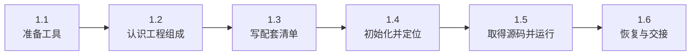
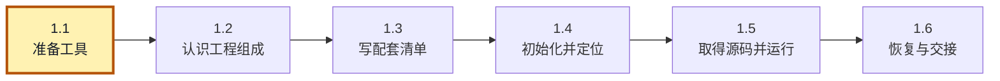
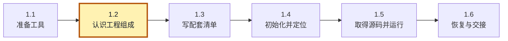
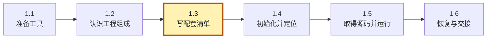
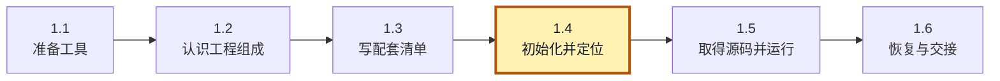
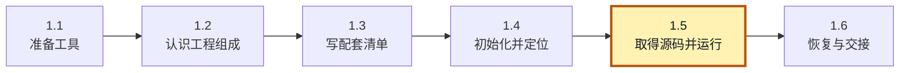
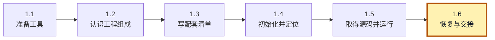

<!-- SPDX-FileCopyrightText: Copyright The zephyr_hc32f4a0 Contributors -->
<!-- SPDX-License-Identifier: Apache-2.0 -->

# 1. 建立第一个多仓库工作区

应用在一个 Git 仓库，公共库在另一个仓库。你分别 clone 了它们，编译却不通过：应用需要旧接口，库已经改成新接口。两个仓库各自都取得成功，组合起来却不能工作。Git 保存了每个仓库的历史，但还需要有人说明“这版应用配哪版库”，让下一位开发者也能取得同样的组合。

我们把这份配套约定写成 **清单（manifest）**：列出仓库的来源、选用版本和本地位置。**west** 是读取这种清单、调用 Git 取得各份代码的工具，名称不是缩写。它把清单仓库和受管项目放在同一个 **工作区（workspace）** 中，各仓库仍保留自己的 Git 历史。

本章用一个加法程序建立最小工作区。应用只调用库中的一个函数，我们便能把注意力放在两份代码如何取得、怎样放到一起，以及清单何时影响磁盘文件上。实验不下载 Zephyr，也不需要开发板；先完成这次配套，再逐步增加版本切换、个人配置和团队命令。

> **先知道做完会得到什么。** 一个目录里有 app 和 libs/arithmetic，运行应用会显示 `2 + 3 = 5`。不需要编译固件，也不需要看懂材料生成器的所有实现。本章带你亲手写清单、建立定位、取得源码，下面的路线就是操作顺序；不要跳过 init 直接假定工作区已经存在。


本章按下面的步骤推进；各节会重现这张路线图，并标出当前位置。图用于找回进度，具体命令在对应步骤中执行。



## 1.1 先安装工具，不把工具和源码混在一起

**当前位置：步骤 1.1「准备工具」；黄色节点表示本节。**



要让 west 按清单工作，首先需要一个能够运行它的 Python 环境。这里沿用前面 venv 专题的方法，把 west 安装到单独的工具环境；稍后取得的应用和库放在另一个目录。这样，即使重新建立源码工作区，也不必重装工具。

本章使用 UCRT64 Bash、Windows Python 3.12 和 Git，终端及路径约定见[实验准备](../P00_实验准备.md)。打开新终端，在本教材仓库根目录执行：

```bash
# 当前位置：教材仓库根目录；终端：UCRT64 Bash。
py -3.12 --version
```

`py -3.12` 让 Windows 启动器选择 Python 3.12；`--version` 只查询版本。应显示 Python 3.12.x，确认有解释器可用于下一步创建环境。

```bash
# 当前位置：教材仓库根目录；终端：UCRT64 Bash。
git --version
```

查询当前终端找到的 Git 版本；能输出版本号才继续。这里尚未创建或下载任何源码仓库。

```bash
# 当前位置：教材仓库根目录；终端：UCRT64 Bash。
py -3.12 -m venv build/learning-tools/west-textbook-tools
```

用 Python 3.12 的 venv 模块创建 `build/learning-tools/west-textbook-tools` 环境。成功时可能不打印文字；解释器与包目录生成在所指定的目录里，尚未安装本章业务包。

```bash
# 当前位置：教材仓库根目录；终端：UCRT64 Bash。
build/learning-tools/west-textbook-tools/Scripts/python.exe -m pip install west==1.5.0
```

使用刚建环境自己的 Python 运行 pip，把 west 1.5.0 及其依赖安装到 west-textbook-tools。`==` 固定工具版本，首次安装需要联网；不会安装进系统 Python。

```bash
# 当前位置：教材仓库根目录；终端：UCRT64 Bash。
source build/learning-tools/west-textbook-tools/Scripts/activate
```

让当前 Bash 读取 `build/learning-tools/west-textbook-tools/Scripts/activate`，把这个环境的命令目录放到搜索路径前面。后续短命令 python 由它优先提供；不会搬动应用源码。

```bash
# 当前位置：教材仓库根目录；终端：UCRT64 Bash。
python -c "import sys; print(sys.executable)"
```

`-c` 执行引号里的短程序：import sys 读取解释器提供的信息，print(sys.executable) 显示这一次真正启动的 Python。输出应位于 west-textbook-tools/Scripts，确认刚才激活的环境确实生效。

```bash
# 当前位置：教材仓库根目录；终端：UCRT64 Bash。
west --version
```

应显示 West version: v1.5.0，证明激活环境中的工具可用。版本正确不等于源码工作区已初始化，后面还要准备材料与清单。

```bash
# 当前位置：教材仓库根目录；终端：UCRT64 Bash。
export MSYS="${MSYS:+$MSYS }noglob"
```

这行给 MSYS 的子进程参数处理追加 noglob：

- `export` 让随后启动的程序也能读到变量。
- `${MSYS:+$MSYS }` 在已有设置非空时保留它并补一个空格，避免覆盖原有选项。
- `noglob` 避免 Windows Python 调用 MSYS Git 时再次展开带大括号的引用；不关闭 Bash 自己的通配符。本机曾因此出现 not a valid SHA1，使用原生 Git for Windows 时没有复现。

解释器应来自 west-textbook-tools，west 应报告 v1.5.0。首次安装联网；后续源码都在本机。工具环境已存在时可以复用，先核对版本，不必重新创建。

现在 `west --version` 能运行，只能证明工具已经可用。我们还没有告诉它要取哪些源码，磁盘上也没有本章的工作区。接下来先准备充当来源的 Git 仓库，再把配套要求交给 west。

## 1.2 取出两份小程序和它们的历史

**当前位置：步骤 1.2「认识工程组成」；黄色节点表示本节。**



真实工程通常有两个位置：团队在托管服务发布代码，你在自己的开发目录取得代码并运行。为了在一台电脑上观察这个过程，本实验用两组目录扮演这两个位置：

- `remotes/` 扮演托管端，下面的 app 和 arithmetic 分别保存应用与公共库的 Git 历史。它不是另一个应用，也不是 west 固定要求的目录名；换成 GitHub 等服务后，这一侧就会变成远端仓库地址。
- `workspace/` 扮演你的开发目录。稍后 west 在其中取得 app 和 arithmetic 的工作副本；你运行和修改的是这里的文件，源仓库仍留在 remotes 中。
- `workspace/manifest/` 保存配套清单，也有自己的 Git 历史。它告诉 west 应从源端取得哪些版本，既不执行加法，也不装 Python 包。

所以 remotes/app 与稍后出现的 workspace/app 不是两种程序，而是同一应用的发布来源与使用副本。本实验需要保留两侧，才能观察“源端已有第二版，开发端仍按清单使用第一版”；如果把它们混成一份目录，这个对照就消失了。

下面运行材料生成器，一次准备带版本的源仓库和初始清单。它相当于实验前把托管端准备好，不运行 west，也没有替我们把应用取到 workspace：

```bash
# 当前位置：教材仓库根目录；终端：UCRT64 Bash。
python learning/west/labs/seed_workspace.py --name textbook-01
```

运行教材的材料生成器；`--name` 选择本次实验目录。它创建本地源仓库、提交、标签与初始清单，但不执行 west init/update。名字已存在时换新名字，保留原实验。

```bash
# 当前位置：教材仓库根目录；终端：UCRT64 Bash。
cd build/learning-tools/west/textbook-01/workspace
```

把当前终端切换到 `build/learning-tools/west/textbook-01/workspace`；后续相对路径从切换后的目录计算。上面的注释是切换前位置，下一块会标出切换后位置。

```bash
# 当前位置：build/learning-tools/west/textbook-01/workspace；终端：UCRT64 Bash。
pwd
```

打印当前目录，应结束于本次实验的 textbook-01/workspace。确认位置后，后面的 ../remotes 才会指向本次实验的源端。

同名目录存在时生成器拒绝覆盖。可以换 textbook-02 等新名字，后续路径也使用这个名字；若选择清理重练，先确认旧目录没有需要保留的编辑或提交。现在生成的结构如下；guide 和命令模板是后面章节的材料，本章不把它们加入清单：

```text
# 可选：若终端有 tree，执行 tree -a -L 3 ../ 可展开到这一层。
textbook-01/
  remotes/
    app/          应用源仓库，含 .git/ 与 main.py，已有 v1.0
    arithmetic/   库源仓库，含 .git/ 与 arithmetic.py，已有 v1.0、v2.0
    guide/        后续章节材料
  workspace/
    manifest/     含 .git/ 与 west.yml，维护配套声明
# 此刻 workspace/.west、workspace/app、workspace/libs/arithmetic 都尚未生成。
```

目录数量不能证明这是多仓库工程；关键是 app、arithmetic 和 manifest 各有自己的 Git 历史。先查已经存在的源仓库，避免去找尚未取得的工作副本：

```bash
# 当前位置：build/learning-tools/west/textbook-01/workspace；终端：UCRT64 Bash。
git -C ../remotes/app rev-parse --show-toplevel
```

查询 `../remotes/app` 实际所属 Git 仓库的根。它应返回这个实验源仓库自身，而不是外层教材仓库；`-C` 不改变当前 Bash 目录。

```bash
# 当前位置：build/learning-tools/west/textbook-01/workspace；终端：UCRT64 Bash。
git -C ../remotes/arithmetic rev-parse --show-toplevel
```

查询 `../remotes/arithmetic` 实际所属 Git 仓库的根。它应返回这个实验源仓库自身，而不是外层教材仓库；`-C` 不改变当前 Bash 目录。

现在把两个查询结果放在一起看：根目录分别是 remotes/app 与 remotes/arithmetic，这才是两份独立历史的证据。生成器使用的提交身份只作用于这些实验历史，不改用户全局配置。

```bash
# 当前位置：build/learning-tools/west/textbook-01/workspace；终端：UCRT64 Bash。
git -C ../remotes/arithmetic tag --list
```

列出 `../remotes/arithmetic` 已有的标签，应看到两版名称。标签属于这个仓库自己的历史，不会自动与另一仓库的同名标签绑定。

应看到 v1.0 和 v2.0。标签命名的是这个库中的某个提交；app 中即使也有名为 v1.0 的标签，它仍指 app 自己的提交，Git 不会因为名字相同就把两仓库绑定起来。清单正是记录这种跨仓库配套的地方：例如“app 的 v1.0 配 arithmetic 的 v1.0”，下一章再只改变后一项。它可以表达类似一组版本标签的组合，但不会自动给所有仓库打同一个 tag。

版本关系明确以后，还需要让两份程序在运行时协作。对熟悉 C 的读者，可以先把 main.py 理解为应用入口，把 arithmetic.py 理解为提供函数的源码模块；这里不经过 C 的编译链接。Python 执行 main.py 时遇到 import，才按它的模块查找规则找到另一个文件。普通 `.py` 文件可以作为一个 **模块（module）**，本例的模块名 arithmetic 来自 arithmetic.py，而不是来自 Git 仓库登记。

第一版 arithmetic.py 的全部有效代码如下。源仓库已经同时准备两版；这里讲的是稍后清单选择的 v1.0，不要求运行源仓库中的应用：

```python
# 定义加法函数；这里只描述做法，真正调用时才执行 return。
def add(a, b):
    # 把计算结果交回调用者，不在库里直接打印。
    return a + b
```

只把文件放进两个 Git 仓库，并不会让 Python 自动找到函数。运行脚本时，Python 通常把脚本所在目录放入模块搜索路径，再结合环境提供的其他目录查找；它不会因为另一个仓库也是 west 项目，就自动递归扫描进去。我们计划把库放在 app 的兄弟路径 libs/arithmetic，所以应用必须明确把那个目录加入本次进程的搜索范围。下面是 main.py 的完整代码：

```python
# sys 提供当前解释器的模块搜索路径。
import sys
# Path 用来按目录层次计算位置，避免写死本机盘符。
from pathlib import Path

# 从 app/main.py 回到 workspace，再找到相邻的库目录。
# insert(0, ...) 把这个目录放到本次 Python 进程的搜索路径最前面。
sys.path.insert(0, str(Path(__file__).resolve().parents[1] / "libs" / "arithmetic"))
# 在刚加入的目录里找到 arithmetic.py，取出 add 函数。
from arithmetic import add

# 先计算 add(2, 3)，再把结果填进文字并显示。
print(f"2 + 3 = {add(2, 3)}")
```

Path 根据应用文件位置找到工作区，再拼出 libs/arithmetic；sys.path.insert 将它放进 Python 的代码搜索路径。这个搜索路径由应用自己设置，west 不负责 Python 包安装。我们刻意直接调用相邻源码，避免把本章变成打包实验。

这里有三个不同层次，后面分别观察：

- **Python 如何识别代码：** 在搜索目录中找 arithmetic.py，再取其中的 add。它不查看 `.git` 或 west.yml。
- **Git 如何识别版本：** 每个仓库用自己的提交、分支和标签记录源码历史；多一个目录不等于多一份独立历史。
- **west 如何识别项目：** 清单 projects 中的一项登记一个受管仓库的地址、版本和位置。west 不扫描 import 来猜依赖，也不把每个 Python 文件当成一个项目。

因此即使把库仓库登记名改成别的名字，只要最终位置和 arithmetic.py 文件名不变，Python 仍可能照常导入；反过来，两个仓库都取得成功，但库被放错目录，应用就可能导入失败。官方 [Python 3.12 教程：模块搜索路径](https://docs.python.org/3.12/tutorial/modules.html#the-module-search-path)说明的是第一层，后面的 west 清单负责第三层。

这里最长的那一行做的是“算路径”，先别把整串符号一起背下来。按从里向外的顺序拆开：

| 代码部分 | 在本例中得到什么 |
| --- | --- |
| `__file__` | 正在执行的 app/main.py 文件位置 |
| `Path(__file__).resolve()` | 把这个位置变成明确的完整文件路径 |
| `.parents[0]` | 文件所在的 app 目录；这里只用于帮助数层次 |
| `.parents[1]` | 再向上一层，到 workspace；代码实际取这一层 |
| `/ "libs" / "arithmetic"` | Path 的路径拼接写法，得到 workspace/libs/arithmetic，不是数字除法 |
| `str(...)` | 把 Path 对象转成搜索路径列表使用的字符串 |
| `sys.path.insert(0, ...)` | 让本次进程优先到该目录寻找要导入的模块 |

得到目录后，`from arithmetic import add` 才能找到库；`add(2, 3)` 把 2、3 分别交给函数的 a、b，return 得到 5。最后一行的 f 字符串把 5 填入大括号，print 显示整行。真正做加法的是这份 Python 代码；west 的任务是把它需要的两个仓库放到约定位置。

> **此处先读代码，不必再新建一份 main.py。** 生成器已经把这些程序放在 remotes 源仓库里，稍后 update 会取得工作副本。你只需亲手填写下一节的清单，不要为了试运行把源文件到处复制，否则会看不清到底是哪一步取得了它们。

这段程序也给配套布局提出了一个具体要求：main.py 最终要位于 workspace/app，库要位于 workspace/libs/arithmetic。仅仅“把两个仓库都下载了”还不够；如果位置不符合应用的约定，它仍找不到函数。这正是清单除了版本，还要记录本地位置的原因。

## 1.3 用一份清单说明怎样放到一起

**当前位置：步骤 1.3「写配套清单」；黄色节点表示本节。**



有了源仓库和应用要求的布局，就可以把“从哪里取、取哪版、放哪里”写入一份声明。这里先认清名称：`west.yml` 是 west 默认使用的清单文件名，不是本教材随意取的名字；它所在的 `manifest/` 仓库目录则是本例的选择，其他工程可能叫 zephyr、application 或别的名字。

默认文件名也可以改。west 1.5 的原生 init 支持 `--mf` 指定清单仓库内的文件相对路径，初始化后的选择记录在本地配置的 `manifest.file` 中；`manifest.path` 则记录清单仓库相对工作区根的位置。现在先记住这两项各选哪一层，本章仍用默认 west.yml，不执行改名。下一节完成 init 后，我们马上读取实际配置，学会找出陌生工程真正使用的清单。

当前位置仍是 textbook-01/workspace。材料生成器附带了供后续章节使用的完整清单；本章先用下面的两项目版本替换 manifest/west.yml，暂不启用可选文档和扩展命令。cat 的文本块一直写到独占一行的 YAML；也可以在编辑器中粘贴同样内容：

```bash
# 当前位置：build/learning-tools/west/textbook-01/workspace；终端：UCRT64 Bash。
cat > manifest/west.yml <<'YAML'
manifest:
  version: "1.2"
  projects:
    # app 运行程序，arithmetic 提供它调用的加法函数。
    - name: app
      url: ../../remotes/app
      revision: v1.0
      path: app
    - name: arithmetic
      url: ../../../remotes/arithmetic
      revision: v1.0
      path: libs/arithmetic
  self:
    path: manifest
YAML
```

这条 cat 命令由 Bash 把清单内容保存到 manifest/west.yml；`<<'YAML'` 表示后面的文本原样写入，直到顶格的 YAML 结束。写好文件还没有初始化或取得项目，下面先读懂这份声明。

这份文件使用 **YAML（YAML Ain't Markup Language）** 数据格式：空格缩进表达层次，列表项以 - 开头，不用 Tab。version 声明读取者需要支持的清单格式版本，和 app 的 v1.0 标签不是一件事。projects 中每项描述一个受管 Git 仓库，四个字段正好对应刚才的配套要求：

| 字段 | 本例含义 |
| --- | --- |
| name | west 选择项目的名字，例如 arithmetic |
| url | Git 到哪里获取历史 |
| revision | 要使用的标签、分支或完整提交标识 |
| path | 相对工作区根的消费目录 |

self 描述维护这份清单的仓库，本例放在 manifest。它本身不是普通的依赖条目。

最容易错的是两种相对路径。path 从工作区根开始；本例的本地 Git url 从消费仓库目录开始。arithmetic 将放到 workspace/libs/arithmetic，从那里向上三层才到 textbook-01，再进入 remotes/arithmetic。app 少一层，故 url 只有两个 ../。这不是相对 west.yml 的路径。

跨机器发布会使用大家可访问的托管地址；本地地址只为让本实验离线且不绑定作者盘符。保存这份文件后，配套要求已经写下来了，但 west 还不知道当前目录应当使用它。下一步先建立这层定位关系。

## 1.4 初始化只回答“清单在哪里”

**当前位置：步骤 1.4「初始化并定位」；黄色节点表示本节。**



上一节只写好了清单，尚未初始化本次工作区，此刻不要去找它的 `.west/config`：这个文件正是下面 init 要生成的产物。原生命令 `west init -l manifest` 中，`-l` 表示采用现有本地清单仓库，manifest 是我们已经准备好的目录。初始化会在它旁边新建 `.west` 并记住清单的位置；不重新克隆 manifest，也不取得清单列出的 app 和 arithmetic。

这里有一个与教材位置有关的条件：实验目录位于本工程内部，外面可能已经有工程自己的 west 工作区。直接在实验目录执行 init 会被外层定位拦住。因此本章使用材料中的初始化辅助器，在不改外层配置的情况下执行同一个初始化动作：

```bash
# 当前位置：build/learning-tools/west/textbook-01/workspace；终端：UCRT64 Bash。
python ../../../../../learning/west/labs/init_workspace.py -l manifest
```

`-l manifest` 使用当前目录里已经存在的清单仓库。辅助器从外层工作区之外调用真正的 west init，在这里生成 `.west/config`；它只处理嵌套条件，不下载 app 和 arithmetic。完成这一步之后才能查看本次工作区配置。

```bash
# 当前位置：build/learning-tools/west/textbook-01/workspace；终端：UCRT64 Bash。
west topdir
```

查询当前命令找到的工作区根，应是正在练习的 workspace。若返回外层工程目录，先核对位置与初始化结果，再做任何 update。

```bash
# 当前位置：build/learning-tools/west/textbook-01/workspace；终端：UCRT64 Bash。
west config manifest.path
```

读取本工作区登记的清单仓库位置，本例应为 manifest。这个值相对 topdir，不是相对终端当前子目录。

```bash
# 当前位置：build/learning-tools/west/textbook-01/workspace；终端：UCRT64 Bash。
west config manifest.file
```

读取清单仓库内被选中的文件，本例应为 west.yml。它与 manifest.path 配合确定文件位置，不能仅凭默认名字猜测生效清单。

```bash
# 当前位置：build/learning-tools/west/textbook-01/workspace；终端：UCRT64 Bash。
west manifest --path
```

直接打印当前实际使用的清单完整路径；本实验应以 workspace/manifest/west.yml 结尾。这是打开陌生工作区时优先使用的定位查询。

```bash
# 当前位置：build/learning-tools/west/textbook-01/workspace；终端：UCRT64 Bash。
cat .west/config
```

打开并打印 `.west/config` 的当前磁盘内容。该文件应已由前一步生成或更新；若找不到，先核对当前目录与创建步骤。

```bash
# 当前位置：build/learning-tools/west/textbook-01/workspace；终端：UCRT64 Bash。
west manifest --validate
```

解析当前清单并检查格式。成功可能没有文字输出；报错时先修字段、缩进或导入文件，再继续同步。通过不代表仓库已下载或程序可运行。

```bash
# 当前位置：build/learning-tools/west/textbook-01/workspace；终端：UCRT64 Bash。
west list -f "{name}: {path} @ {revision} [{cloned}]"
```

读取清单并列出项目，`-f` 后的花括号由 west 替换成字段值。重点核对本步改变的版本、路径或 active/cloned 状态；list 本身不克隆源码。

五个 ../ 返回教材仓库根。对于这里的 `-l manifest`，辅助器从不属于任何 west 工作区的临时目录启动真正的 west init，并传入本地 manifest 的完整路径；生成的 `.west` 直接位于目标 workspace。辅助器只处理实验嵌套条件，没有替你执行 update。没有外层工作区时可用原生命令，二者择一。

初始化之后才有本次工作区的 `.west/config`，其中的定位部分应类似下面这样；其他配置行可以同时存在：

```ini
[manifest]
path = manifest
file = west.yml
```

现在可以把刚才的查询接起来：topdir 找到工作区根；manifest.path 找到里面的清单仓库；manifest.file 选择仓库里的清单文件。合起来就是 workspace/manifest/west.yml，`west manifest --path` 可以直接打印最终位置。`.west/config` 是本机工作区的定位配置，west.yml 是团队维护的项目与版本声明，二者不能互相替代。

以后打开一个已经初始化的陌生工程，先在工程目录运行 `west topdir` 和 `west manifest --path`，再读返回的那份清单。需要追踪选择来源时，查看工作区根下 `.west/config` 的这两项。如果工程尚未初始化，就先读其入口说明，确认清单仓库和文件；不要在整个磁盘找到第一个同名 west.yml 就认定它有效。默认名与覆盖项可对照官方 [West Basics 的 manifest file](https://docs.zephyrproject.org/latest/develop/west/basics.html#workspace-concepts)及[配置项说明](https://docs.zephyrproject.org/latest/develop/west/config.html#built-in-configuration-options)。

validate 成功可以没有输出，它只检查声明。list 的 -f 指定显示格式，花括号字段由 west 填入。此时会列出 app/arithmetic，却显示未克隆。

> **先对照这三处再 update：** topdir 的末尾是这次实验的 workspace，清单路径末尾是 manifest/west.yml，两个依赖显示 not-cloned。如果 topdir 跑到工程父目录，先停下核对当前目录与初始化结果；这不是靠继续 update 能修好的定位问题。

此时可以分清三类目录了：工具环境保存 west 程序，`.west` 保存当前工作区的配置，各仓库的 `.git` 保存自己的历史。init 建立的是工作区与清单的联系，所以 list 已能读到项目名字；项目是否已取得，还要单独看 cloned 状态。如果 topdir 指向外层，先查当前目录和本地 .west/config，不要删除未知工作区来碰运气。

## 1.5 同步源码，再运行应用

**当前位置：步骤 1.5「取得源码并运行」；黄色节点表示本节。**



刚才的 list 已经证明 west 能找到正确清单，却也显示两个项目尚未克隆。现在执行 update，让声明中的来源、版本和位置落实成磁盘上的工作副本，然后用应用检验这次配套：

```bash
# 当前位置：build/learning-tools/west/textbook-01/workspace；终端：UCRT64 Bash。
west update
```

按当前清单同步所有活动项目：缺失时取得仓库，已存在时获取所需对象并检出声明的版本。源端有新版但清单仍固定旧版时，不会自动升级。

```bash
# 当前位置：build/learning-tools/west/textbook-01/workspace；终端：UCRT64 Bash。
west list -f "{name}: {path} @ {revision} [{cloned}]"
```

读取清单并列出项目，`-f` 后的花括号由 west 替换成字段值。重点核对本步改变的版本、路径或 active/cloned 状态；list 本身不克隆源码。

```bash
# 当前位置：build/learning-tools/west/textbook-01/workspace；终端：UCRT64 Bash。
python app/main.py
```

从工作副本运行应用。它自己计算相邻库目录，导入 add 并显示 `2 + 3 = 5`；west 只负责取得配套源码，加法由 Python 执行。

```bash
# 当前位置：build/learning-tools/west/textbook-01/workspace；终端：UCRT64 Bash。
git -C libs/arithmetic status --short --branch
```

查看 `libs/arithmetic` 的分支和修改状态。`--short --branch` 使用简洁格式；HEAD (no branch) 表示直接检出某个提交，不等于仓库坏了。

update 读取清单，用 Git 取得所需对象并检出相应版本。工作区应出现 app 和 libs/arithmetic，list 显示已克隆。Python 再从 app/main.py 计算库目录，导入 add，应用因而打印 `2 + 3 = 5`。这一输出说明两份代码按约定协作起来了；加法本身仍由 Python 程序执行。

可以顺手打开现在出现的 app/main.py 和 libs/arithmetic/arithmetic.py，对照前面的代码再读一次。此时这些是工作副本，remotes 中还保留发布来源。两个位置都有文件是正常的，后面做版本实验正需要区分它们。

再取一条能直接看见模块来源的证据：

```bash
# 当前位置：build/learning-tools/west/textbook-01/workspace；终端：UCRT64 Bash。
python -c "import sys; sys.path.insert(0, 'libs/arithmetic'); import arithmetic; print(arithmetic.__file__)"
```

导入模块并打印它的源码位置，用这条路径确认实际读到了哪份代码；不要用 pip 已安装的记录替代这条运行证据。

`-c` 让 Python 执行引号内的短程序；先加入库目录，再导入 arithmetic，最后打印模块的 `__file__` 属性。输出应指向 workspace/libs/arithmetic/arithmetic.py。这一次短程序的相对路径以当前终端目录为起点，应用 main.py 则按自身文件位置计算路径；两者在当前目录下找到的是同一文件。至此我们既看到 Git 的两个独立来源，也看到 Python 实际使用的工作副本，能够把清单和运行结果对应起来。

git -C 在指定仓库执行命令，不改变 Bash 的当前目录。--short --branch 用简洁格式显示分支与修改。看到 HEAD (no branch) 不必重建：这是 Git 的游离头状态，表示当前直接使用清单选定提交，没有检出自己的开发分支。下一章再练习开发分支与同步基线。

若 update 报地址或版本不存在，先查失败项目的 url/revision 及 remotes 中的源仓库；重复安装 west 不会修正 Git 地址。如果程序找不到 arithmetic，检查 libs/arithmetic 是否真的取得，而不是只看 list 有没有名字。

## 1.6 停下来时保存什么状态

**当前位置：步骤 1.6「恢复与交接」；黄色节点表示本节。**



应用已经运行起来，清单仍选 app v1.0 与 arithmetic v1.0。下一章要在这个组合上改变库版本，因此暂时保留整个 textbook-01，包括 remotes 中的源历史。虽然实验统一放在 build 下，这个目录此时还包含要继续使用的清单和 Git 提交，不能只把它看成可随时重建的编译缓存。

新开窗口时，从仓库根目录恢复工具与位置：

```bash
# 当前位置：教材仓库根目录；终端：UCRT64 Bash。
source build/learning-tools/west-textbook-tools/Scripts/activate
```

让当前 Bash 读取 `build/learning-tools/west-textbook-tools/Scripts/activate`，把这个环境的命令目录放到搜索路径前面。后续短命令 python 由它优先提供；不会搬动应用源码。

```bash
# 当前位置：教材仓库根目录；终端：UCRT64 Bash。
export MSYS="${MSYS:+$MSYS }noglob"
```

保留已有 MSYS 选项，再追加 noglob，仅影响当前终端及子进程。这是本实验 Windows Python 与 MSYS Git 之间的参数兼容设置，避免 Git 再展开带大括号的引用；不关闭 Bash 自己的通配符。

```bash
# 当前位置：教材仓库根目录；终端：UCRT64 Bash。
cd build/learning-tools/west/textbook-01/workspace
```

把当前终端切换到 `build/learning-tools/west/textbook-01/workspace`；后续相对路径从切换后的目录计算。上面的注释是切换前位置，下一块会标出切换后位置。

```bash
# 当前位置：build/learning-tools/west/textbook-01/workspace；终端：UCRT64 Bash。
west topdir
```

查询当前命令找到的工作区根，应是正在练习的 workspace。若返回外层工程目录，先核对位置与初始化结果，再做任何 update。

```bash
# 当前位置：build/learning-tools/west/textbook-01/workspace；终端：UCRT64 Bash。
python app/main.py
```

从工作副本运行应用。它自己计算相邻库目录，导入 add 并显示 `2 + 3 = 5`；west 只负责取得配套源码，加法由 Python 执行。

练习时先只看本章两次 list 的输出：init 后能列出项目，update 后也能列出项目，哪个字段才说明源码已取得？再看清单中的 revision，预测源仓库即使已有第二版，重新 update 会不会自动升级。

核对依据是 cloned 状态和版本声明。第一次 list 只有项目记录；获取以后才变成已克隆。当前清单固定 v1.0，因此 update 仍选择第一版。下一章会主动改动这条声明，观察声明、Git 引用和文件分别在什么时刻变化。

[west 内建命令](https://docs.zephyrproject.org/latest/develop/west/built-in.html)供核对职责；完成本章不需要阅读后续扩展章节。[下一章](P02_管理版本与本地开发.md) · [大纲](大纲.md)
