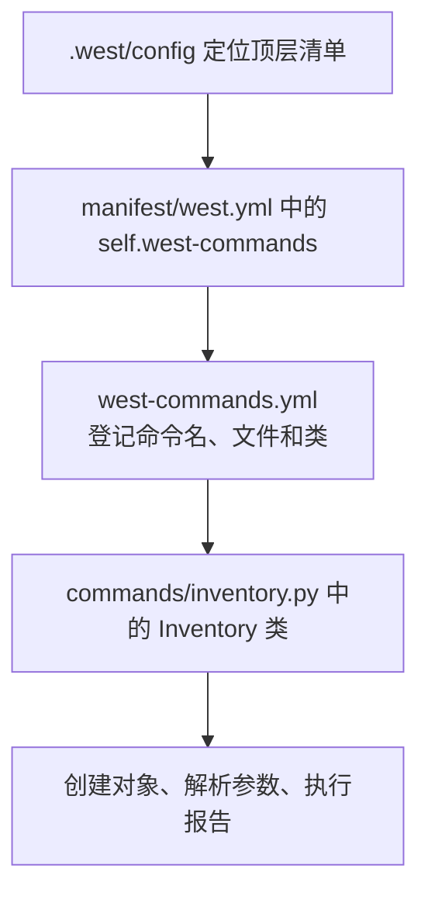
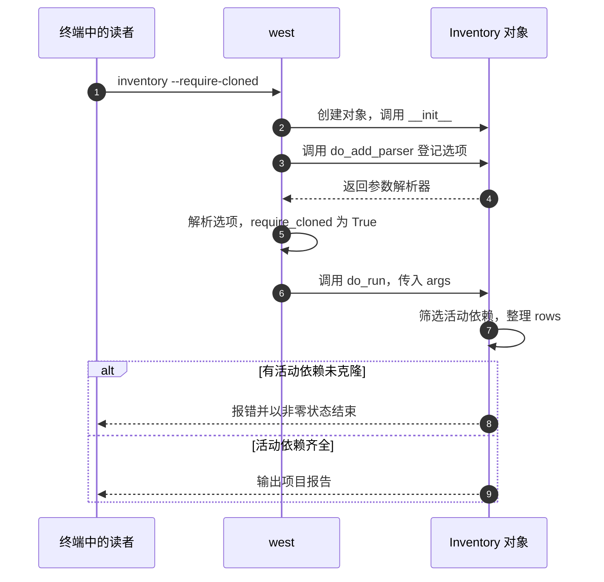

<!-- SPDX-FileCopyrightText: Copyright The zephyr_hc32f4a0 Contributors -->
<!-- SPDX-License-Identifier: Apache-2.0 -->

# 4. 编写自己的扩展命令

上一章用 guide 看到了两种独立状态：项目可以活动却尚未克隆，也可以停用但目录仍在。最后我们回到原 workspace，app 与 arithmetic 活动且已取得，guide 默认停用。现在用 list 已经能够人工判断“这次需要的依赖是否齐全”。

如果团队要在每次测试前检查这个条件，只把 list 的输出打印出来还不够：人能看出其中的 not-cloned，后续脚本却需要明确的成功或失败返回。我们把已经理解的判断写成程序，并让团队通过同一个 west 命令调用它。

west 允许清单登记仓库提供的 Python 程序，把它们接入自己的子命令入口，这称为 **扩展命令（extension command）**。本章从材料中的 inventory 报告程序入手，先观察它怎样被发现，再沿一次调用读代码，最后增加计数选项并检验失败分支。这里只需要读懂这段程序用到的 Python 写法，无须先学完整门语言。

> 先让现成命令运行起来，再读代码，最后只加一个 `--count` 选项。不需要一开始就自己写完整扩展。你要编辑的是实验里的 `workspace/manifest/commands/inventory.py`；教材 `labs/templates` 中的文件是原件，用于比较和重新生成实验。

本章按下面的步骤推进；各节会重现这张路线图，并标出当前位置。图用于找回进度，具体命令在对应步骤中执行。


## 4.1 命令怎样从仓库进入帮助列表

**当前位置：步骤 4.1「登记并运行命令」；黄色节点表示本节。**


继续在原 `textbook-01/workspace/` 操作。**inventory** 是本实验自定义的命令名，表示项目清单报告。材料生成器早已把实现文件放入 manifest 仓库，但前三章没有登记它，所以仅仅存在这份 Python 文件，不会让 west 自动多出一个命令。

现在让顶层清单承担“向 west 指出扩展在哪里”的职责。在 manifest/west.yml 末尾已有的 self 中增加 west-commands，保留其他内容，使这一小节变为：

```yaml
  self:
    path: manifest
    west-commands: west-commands.yml
```

`self.west-commands` 的值是命令描述文件的位置，本例是 manifest 仓库内的 west-commands.yml。它再指向 commands/inventory.py 中的实现。先保存这条登记，观察帮助和报告是否出现，再打开文件追踪映射：

```bash
# 当前位置：build/learning-tools/west/textbook-01/workspace；终端：UCRT64 Bash。
west help
```

查看内建命令和已登记扩展的帮助列表。应能找到 inventory；这证明描述文件被识别，还没有证明实现运行成功。

```bash
# 当前位置：build/learning-tools/west/textbook-01/workspace；终端：UCRT64 Bash。
west inventory -h
```

查看 inventory 自己的选项。此时会加载实现并建立参数解析器，但不会输出项目报告；先确认 --format 和 --require-cloned 已登记。

```bash
# 当前位置：build/learning-tools/west/textbook-01/workspace；终端：UCRT64 Bash。
west inventory
```

现在原工作区的 app 和 arithmetic 都已取得，报告应列出这两个活动依赖，cloned 都为 True。guide 默认停用，不进入报告。

```bash
# 当前位置：build/learning-tools/west/textbook-01/workspace；终端：UCRT64 Bash。
west inventory --format json
```

把相同项目记录输出为 JSON，便于程序读取；改变格式不改变项目筛选与缺失检查规则。

```bash
# 当前位置：build/learning-tools/west/textbook-01/workspace；终端：UCRT64 Bash。
west inventory --require-cloned
```

这次要求所有活动依赖已克隆。当前原工作区满足条件，应正常输出两个项目；这一步还没有检查实际 HEAD 是否与清单一致。

默认文字输出应列出两个项目及路径、revision、cloned 状态。**JSON（JavaScript Object Notation）** 是结构化数据格式，本命令用它提供适合程序读取的列表。输出中的 revision 是清单文本，cloned 表示本地 Git 仓库是否存在，均不等于应用已经构建成功或 HEAD 已与基线相同。

前两条帮助命令能找到 inventory，说明新增的登记已经被读取；后面的报告则证明实现也被执行了。把这次发现过程从已知的清单定位开始串起来：



打开 manifest/west-commands.yml，实际登记内容是：

```yaml
west-commands:
  - file: commands/inventory.py
    commands:
      - name: inventory
        class: Inventory
        help: Show the active repositories in this workspace.
```

file 告诉 west 到提供扩展的仓库根目录下面找 commands/inventory.py，本例就是 manifest/commands/inventory.py。name 决定用户输入的子命令，class 决定加载文件后实例化哪个 Python 类，help 用于简短帮助。文件名、类名和命令名不必相同，但三者的映射必须正确；只新建 Python 文件而没有这条注册链，west 不会主动扫描并猜测它是命令。

官方对照：[Adding a West Extension](https://docs.zephyrproject.org/latest/develop/west/extensions.html#adding-a-west-extension)。在这个实验里，查看注册文件比重新安装 west 更能解释“为什么出现 inventory”。

> 如果 `west help` 里没有 inventory，沿图查登记路径和扩展开关；如果帮助能看到它，但执行时报 Python 错误，再看实现文件。两种现象发生在不同阶段，先分清这一点就能少改很多无关文件。

## 4.2 一次调用怎样经过这份代码

**当前位置：步骤 4.2「跟读执行过程」；黄色节点表示本节。**


注册文件已经解释了 west 到哪里找 Inventory，但还没解释它如何接收 --require-cloned、为什么能读取当前工作区，以及何时返回失败。下面打开它实际加载的 manifest/commands/inventory.py，沿着一次 `west inventory --require-cloned` 调用回答这些问题。配套目录保留同一份原件；本章阅读和修改的都是工作区副本。

```python
# SPDX-FileCopyrightText: Copyright The zephyr_hc32f4a0 Contributors
# SPDX-License-Identifier: Apache-2.0
"""只读的 west 扩展：列出活动项目，可供人或其他程序使用。"""

import json  # 把同一份报告转换成程序容易读取的 JSON 文本。

from west.commands import WestCommand  # 使用 west 提供的命令框架。


class Inventory(WestCommand):
    """声明命令、接收参数，再读取 west 传入的清单。"""

    def __init__(self):
        # west 创建这个对象时，先登记命令名和两段帮助文字。
        super().__init__(
            "inventory",
            "Show active repositories",
            "List active projects; this command does not update repositories.",
        )

    def do_add_parser(self, parser_adder):
        # 登记参数的写法；此处还不读取项目、不打印报告。
        parser = parser_adder.add_parser(self.name, description=self.description)
        parser.add_argument("--format", choices=("text", "json"), default="text")
        # 写了此选项就是 True；省略就是 False，不需要再跟 true。
        parser.add_argument("--require-cloned", action="store_true",
                            help="Fail if an active project has not been cloned")
        return parser

    def do_run(self, args, unknown_args):
        rows = []  # 空列表：接下来为每个活动依赖放入一行报告。
        for project in self.manifest.projects:
            # 清单仓库由 init 定位，不计入依赖；停用项目也跳过。
            if project.name == "manifest" or not self.manifest.is_active(project):
                continue
            # 字典把字段名与值配成一行；is_cloned() 只查询，不下载。
            rows.append({
                "name": project.name,
                "path": project.path,
                "revision": project.revision,
                "cloned": project.is_cloned(),
            })

        # 先完成严格检查，再选择输出格式；缺少任何一个项目就停止。
        if args.require_cloned:
            for row in rows:
                if not row["cloned"]:
                    self.die("An active project is missing; run west update first.")
        if args.format == "json":
            self.inf(json.dumps(rows, ensure_ascii=False, indent=2))
        else:
            # 遍历同一组记录，每个项目输出一行供人阅读的文字。
            for row in rows:
                self.inf(f"{row['name']}: {row['path']} @ {row['revision']} "
                         f"cloned={row['cloned']}")
```

先把整段代码想成一张“空白报告表”和三个入口：`__init__` 介绍命令叫什么，`do_add_parser` 介绍命令接受什么选项，`do_run` 真正填写并输出报告。以 `west inventory --require-cloned` 为例，图中的调用由 west 发起，不需要你手动依次调用这三个方法：



WestCommand 是 west 提供的框架基类，`class Inventory(WestCommand)` 表示这个类继承它提供的命令能力，再用下面的方法补充自己的行为。类可以先理解成“创建这类命令对象的定义”。`self` 指当前这个对象，所以 `self.name` 是它的名字，`self.manifest` 是它收到的工作区清单；`super().__init__` 则先完成基类需要的初始化。这里只登记名称和帮助，查询帮助不需要先下载项目。

parser.add_argument 建立参数规则。choices 限定 --format 的合法值，default 给出省略时的值；store_true 让 --require-cloned 出现时为真，否则为假，不需要再跟一个 true 字符串。连字符在属性名中变为下划线，所以业务代码读取 args.require_cloned。

参数解析完成后，west 调用 do_run，args 保存已识别的选项；本命令没有使用额外的 unknown_args。框架还提供 `self.manifest`，它代表当前工作区解析后的清单，所以实现无须再硬编码 app、arithmetic 或 guide 的路径。

进入 do_run 后，`rows = []` 创建空列表。`for project in ...` 每次取出一个项目，下面缩进的代码针对这个项目执行。遇到清单仓库或停用项目时，`continue` 跳到下一轮；剩下的项目用 `{...}` 整理成字典，再由 `rows.append(...)` 追加到列表。字典中的 `"name"` 是字段名，冒号右边才是这个项目的实际值。

拿 arithmetic 走一遍：它是活动依赖，所以没有被跳过；本章开始时它已克隆，这轮追加的记录相当于 `{"name": "arithmetic", "path": "libs/arithmetic", "revision": "v2.0", "cloned": True}`。`row["cloned"]` 就是从这样一行中取出 True。is_active 判断配置选择，is_cloned 检查本地 Git 副本，revision 则仍是清单声明；这些字段没有检查应用是否正确，也没有比较 HEAD。guide 即使已克隆，只要仍停用，就不会进入 rows。

得到 rows 以后，`if args.require_cloned` 决定是否严格检查。带了该选项，便逐行查看 cloned；`not` 把真假反过来，所以 `if not row["cloned"]` 可以读成“如果这一行还没克隆”。遇到第一项缺失，self.die 报错并以非零状态结束，后面的格式输出不再执行。没有指定严格检查时，则允许报告中出现 False，供读者观察缺失情况。

self.inf 负责输出文字。json.dumps 把同一组 rows 变成结构化 JSON 文本，indent=2 控制缩进；默认文字格式则逐行输出。两种格式共用选择规则和缺失检查，因此格式变化不应改变命令是否通过。

最后两行以 `f` 开头的字符串会把花括号里的值填进去，例如 `{row['name']}` 变成 arithmetic；相邻的两段字符串组成同一条消息，再交给 self.inf 打印。到这里，终端中的一行文字就能反向追到清单中的一个项目了。

这里没有隐藏的常驻服务。每次 west inventory 都重新读取并执行工作区中的代码，修改后下一次调用即可观察。也正因此，扩展具有当前用户进程的权限，应该像构建脚本一样审查。

## 4.3 修改一个输出选项

**当前位置：步骤 4.3「增加计数选项」；黄色节点表示本节。**


现有命令已经把活动项目整理成 rows。如果自动化步骤只需要项目数量，就不必重新遍历清单；可以在同一组 rows 上增加一种输出。这个小修改会同时经过参数登记和执行逻辑，正好检验我们是否读懂了两个回调之间的关系。

先用 `cp manifest/commands/inventory.py ../inventory-before-count.py` 保存副本。其余代码保持不动，在 `do_add_parser` 的 `return parser` 之前加入：

```python
        # 登记新开关：把命令行 --count 转成 args.count。
        parser.add_argument("--count", action="store_true",
                            help="Print the number of active projects")
```

在 `do_run` 的缺失检查之后、原来的格式输出之前加入：

```python
        # len 取记录数，str 转成文字；return 防止继续打印完整报告。
        if args.count:
            self.inf(str(len(rows)))
            return
```

`--count` 是本次新设计的选项，计数只覆盖活动依赖，不含清单仓库。选择放在缺失检查之后，是为了保留 `--require-cloned` 的保证；如果提前 return，该保证会被绕过。这就是一个小修改也需要考虑的控制流不变量。

> 两段新增代码都属于方法内部，首行保持 8 个空格缩进。计数的 `if` 要与 `if args.require_cloned` 对齐，放在它的整段检查之后，不要塞进检查循环里。否则省略严格检查时可能不计数，或只检查第一个项目就提前返回。

```bash
# 当前位置：build/learning-tools/west/textbook-01/workspace；终端：UCRT64 Bash。
west inventory --count
```

只输出 rows 中活动依赖的数量。原工作区目前只有 app 与 arithmetic，所以应显示 2；清单仓库不计入。

```bash
# 当前位置：build/learning-tools/west/textbook-01/workspace；终端：UCRT64 Bash。
west inventory --count --require-cloned
```

先检查两个活动依赖已克隆，再输出 2。计数在严格检查之后发生，下一节会用缺失副本验证这个顺序。

```bash
# 当前位置：build/learning-tools/west/textbook-01/workspace；终端：UCRT64 Bash。
# 故意给出不合法的格式：应被参数解析器拒绝。
west inventory --format invalid
```

故意给 --format 一个不在 text/json 中的值。解析器应拒绝 invalid、返回非零；这是参数规则的验证，不是缺包。

默认组配置下前两条应输出 `2`。最后一条是故意失败，参数解析器拒绝 invalid；Bash 用 `echo $?` 检查退出码，应非 0。该修改只改顶层清单仓库内的 Python 文件，下一次调用就生效，不需要重新安装 west，也不需要 update。

本次运行的是工作区内副本，改它就能观察结果。材料中的 solutions/inventory_count.py 留作最终文件对照；要把改进纳入教材或产品，再另行审查并同步到权威源文件。现在计数在依赖齐全时通过了，但这还没有证明它不会绕过缺失检查，下一节专门制造这个条件。

## 4.4 验证缺失与禁用两个失败分支

**当前位置：步骤 4.4「检验失败与恢复」；黄色节点表示本节。**


原工作区的两个活动依赖都已下载，即使错误地把计数 return 放到缺失检查之前，刚才也可能输出正常。要检验这条控制流，需要一个已经初始化、却还没 update 的工作区。我们另外生成 textbook-missing，保留原工作区及其开发分支，再把刚改过的 inventory.py 复制过去，让缺失场景运行同一份实现。

下面从原 textbook-01/workspace 出发，先回教材仓库根目录，再进入新工作区；textbook-missing 必须尚不存在：

> 下面两次非零退出都是要验证的结果。每次 `echo $?` 紧跟对应检查读取返回值；先不要急着 update，否则缺失条件消失，就看不到计数是否绕过了检查。末尾再补齐依赖，验证同样的命令能够恢复成功。

```bash
# 当前位置：build/learning-tools/west/textbook-01/workspace；终端：UCRT64 Bash。
cd ../../../../..
```

把当前终端切换到 `../../../../..`；后续相对路径从切换后的目录计算。上面的注释是切换前位置，下一块会标出切换后位置。

```bash
# 当前位置：教材仓库根目录；终端：UCRT64 Bash。
python learning/west/labs/seed_workspace.py --name textbook-missing
```

运行教材的材料生成器；`--name` 选择本次实验目录。它创建本地源仓库、提交、标签与初始清单，但不执行 west init/update。名字已存在时换新名字，保留原实验。

```bash
# 当前位置：教材仓库根目录；终端：UCRT64 Bash。
cd build/learning-tools/west/textbook-missing/workspace
```

把当前终端切换到 `build/learning-tools/west/textbook-missing/workspace`；后续相对路径从切换后的目录计算。上面的注释是切换前位置，下一块会标出切换后位置。

```bash
# 当前位置：build/learning-tools/west/textbook-missing/workspace；终端：UCRT64 Bash。
cp ../../textbook-01/workspace/manifest/commands/inventory.py manifest/commands/inventory.py
```

把 `../../textbook-01/workspace/manifest/commands/inventory.py` 复制到 `manifest/commands/inventory.py`。后续修改目标副本，源材料仍保留；复制动作本身不安装包、不切换 Git 版本。

```bash
# 当前位置：build/learning-tools/west/textbook-missing/workspace；终端：UCRT64 Bash。
python ../../../../../learning/west/labs/init_workspace.py -l manifest
```

`-l manifest` 使用当前目录里已经存在的清单仓库。辅助器从外层工作区之外调用真正的 west init，在这里生成 `.west/config`；它只处理嵌套条件，不下载 app 和 arithmetic。完成这一步之后才能查看本次工作区配置。

```bash
# 当前位置：build/learning-tools/west/textbook-missing/workspace；终端：UCRT64 Bash。
# 此刻先不 update：报告应看到 False，严格检查应返回非零。
west inventory
```

这个新工作区刻意尚未 update，报告应看到 app 和 arithmetic 的 cloned=False。命令能输出，说明实现已加载；False 说明依赖仍缺失。

```bash
# 当前位置：build/learning-tools/west/textbook-missing/workspace；终端：UCRT64 Bash。
west inventory --require-cloned
echo $?
```

同一新工作区现在加上严格要求，应提示缺少活动项目。紧接着的 echo 应是非零，表示检查阻止了继续使用不完整的依赖。

```bash
# 当前位置：build/learning-tools/west/textbook-missing/workspace；终端：UCRT64 Bash。
west inventory --count --require-cloned
echo $?
```

同时要求计数与完整依赖，仍应先报缺失、返回非零，不能输出 2 就算成功。这样才验证新增 return 没有绕过检查。

```bash
# 当前位置：build/learning-tools/west/textbook-missing/workspace；终端：UCRT64 Bash。
west update
```

按当前清单同步所有活动项目：缺失时取得仓库，已存在时获取所需对象并检出声明的版本。源端有新版但清单仍固定旧版时，不会自动升级。

```bash
# 当前位置：build/learning-tools/west/textbook-missing/workspace；终端：UCRT64 Bash。
west inventory --require-cloned
```

刚才 update 已补齐依赖。再次运行同一严格检查应成功，报告中两项均为 cloned=True。

```bash
# 当前位置：build/learning-tools/west/textbook-missing/workspace；终端：UCRT64 Bash。
west inventory --count --require-cloned
```

恢复后的依赖通过严格检查，再输出数量 2。与刚才的非零退出比较，改变结果的是补齐依赖，而不是更换检查代码。

```bash
# 当前位置：build/learning-tools/west/textbook-missing/workspace；终端：UCRT64 Bash。
cd ../../textbook-01/workspace
```

把当前终端切换到 `../../textbook-01/workspace`；后续相对路径从切换后的目录计算。上面的注释是切换前位置，下一块会标出切换后位置。

新种子自带包含扩展登记的完整参考清单，默认仍只有 app 与 arithmetic 活动，guide 停用，因此这里无需重复手工注册。生成器本来提供旧实现，上面的 cp 才把本章增加的 --count 带进新副本。两份工作区有各自的 `.west`，只是共用同一工具环境；复制扩展文件没有复制原工作区的依赖目录。

init 后刻意不立即 update。普通报告应显示 cloned=False；两条带 --require-cloned 的检查都应提示缺少项目、返回非零，包括同时带 --count 的那条。补齐项目后再运行，两条检查都应成功，计数为 2。这样才能排除“增加计数后提前返回，导致严格检查被绕过”的错误。最后一条 cd 回到原 textbook-01/workspace，后续继续使用它。

若新增选项出现缩进错误，先回原工作区，用 `cp ../inventory-before-count.py manifest/commands/inventory.py` 恢复自己的练习副本，再按两处位置重改并复制到缺失实验中。问题出在刚编辑的 Python 文件，不需要重装 west。

缺失实验验证了“命令已经加载后，业务条件不满足”的失败。现在回到原 workspace，依赖仍然齐全，改为观察另一个层次：如果配置不允许加载扩展，命令根本进不了 do_run。先用 `west config --local -l` 记录是否原本存在 commands.allow_extensions，再运行开关对照：

```bash
# 当前位置：build/learning-tools/west/textbook-01/workspace；终端：UCRT64 Bash。
west config --local commands.allow_extensions false
```

把当前工作区的扩展加载开关设为 false，下一条 inventory 应不可用；west config 仍是内建命令，可用来恢复。

```bash
# 当前位置：build/learning-tools/west/textbook-01/workspace；终端：UCRT64 Bash。
# 这次失败来自禁止加载扩展，尚未进入项目检查代码。
west inventory
```

扩展刚被禁用，这次应提示 inventory 命令不可用。程序还没有进入 do_run，因此不是它发现了缺失依赖；下一条用内建 config 恢复开关。

```bash
# 当前位置：build/learning-tools/west/textbook-01/workspace；终端：UCRT64 Bash。
west config --local commands.allow_extensions true
```

把当前工作区的扩展加载开关设为 true，下一次调用允许加载扩展；不需要重新安装 west。

```bash
# 当前位置：build/learning-tools/west/textbook-01/workspace；终端：UCRT64 Bash。
west inventory
```

扩展已重新启用，这次应恢复两个活动依赖的报告。源码与依赖没有更换，变化来自本工作区的加载开关。

```bash
# 当前位置：build/learning-tools/west/textbook-01/workspace；终端：UCRT64 Bash。
west config --local -d commands.allow_extensions
```

删除指定作用域内本次写入的键。删除覆盖不等于强制设成 false，其他来源或默认值可能重新生效；已有原值时恢复原值。

禁用时自定义命令不可执行，但 `west config` 仍是内建命令，可重新启用。最后删除的是本次添加的 local 值；若开始时该作用域已有值，应恢复记录的原值。没有原值时，删除后由其他来源或默认值决定，不能把删除理解为强制启用。下一章仍需要 inventory，应在继续前确认它能运行；若其他来源有禁用规则，先确认该规则的用途，再决定是否为自己的实验保留本地启用设置。

执行扩展就是执行仓库提供的代码；它可以拥有当前进程的文件与网络权限。给团队加入扩展时像审查构建脚本一样审查代码与参数边界，不把描述 YAML 视为全部行为。正式扩展产生副作用时，还应明确输入、执行位置、失败返回和恢复方式。

## 4.5 为什么安装 west 后不一定有 build

**当前位置：步骤 4.5「回到真实扩展」；黄色节点表示本节。**


刚才关闭扩展后，inventory 消失，config 却仍能运行，说明两者来自不同地方。`init`、`update`、`list`、`config` 等管理命令随 west 工具提供；inventory 来自我们刚登记的仓库代码。把这个区别带到 Zephyr，就能理解为什么安装了 west，也未必能运行 build。

Zephyr 的 `build`、`flash`、`debug` 由 Zephyr 仓库提供扩展。本实验只登记 inventory，没有登记 Zephyr 的命令，所以在这里执行 `west build -h` 找不到命令是预期结果。此时已经不需要猜测安装是否损坏，可以沿本章的发现链逐级核对提供者和登记文件。

当回到真实项目时，先用 `west help` 看命令归属，再找清单声明和实现文件。若要统一团队的构建或报告入口，可以添加扩展；若只有一个简单脚本且不依赖工作区上下文，直接运行脚本也很合理。扩展不会替代底层编译器、调试服务器或构建系统。

结束前用 `git -C manifest diff` 查看清单登记和 --count 实现的变化，并在原 workspace 运行 `west inventory --count --require-cloned`，应输出 2。保留这里的 self.west-commands 与可运行实现，下一章会继续使用它；textbook-missing 只是失败对照。此时我们已经能检查依赖是否齐全，接下来还要判断：这些依赖是否能让另一位开发者取得并得到相同结果。

[上一篇](P03_修改清单与配置.md) · [大纲](大纲.md) · [下一篇：协作与排错](P05_团队工作流与故障定位.md)
