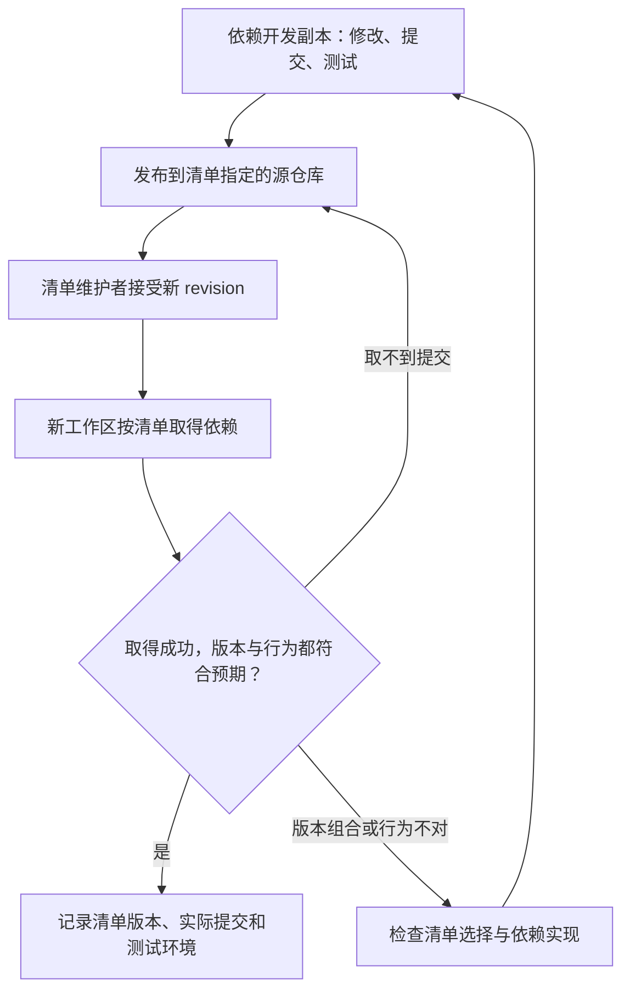
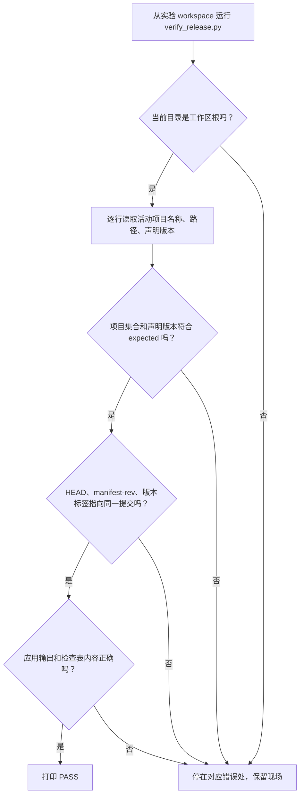

<!-- SPDX-FileCopyrightText: Copyright The zephyr_hc32f4a0 Contributors -->
<!-- SPDX-License-Identifier: Apache-2.0 -->

# 5. 团队工作流与故障定位

上一章结束时，原工作区可以运行 inventory，确认 app 和 arithmetic 两个活动依赖已经取得。第二章又证明，当前开发分支可以比 manifest-rev 多出自己的提交。因此“依赖都在本机”还不能回答交付时的一个关键问题：同事能否只凭团队发布的清单取得同样的内容？

例如，你在 arithmetic 里修好了一个问题，自己的应用测试通过，于是把清单改为修复提交的完整标识。同事执行 update 却报找不到它。若提交只在你的开发副本里，从未进入清单指向的源仓库，清单即使写得完全正确，也没有替别人建立获取通道。

本章把前面的操作接成一次交付：先确定谁维护配套声明，再把检查、本地开发、发布依赖、接受清单变更和新工作区验证连起来。随后在原实验中增加一个 checklist 仓库，用两次发布观察“源仓库有新内容”和“团队接受新内容”之间的区别。始终沿用本机源仓库，不需要向远端发布练习数据。

> 最后你会得到一个能打印 PASS 的检查脚本，并亲手让它发现一次版本不匹配。前几节先说明交付顺序，5.5 节再动手；终端继续留在原 `textbook-01/workspace`，直到 5.7 节才切回真实工程。

本章按下面的步骤推进；各节会重现这张路线图，并标出当前位置。图用于找回进度，具体命令在对应步骤中执行。


## 5.1 清单放在哪个仓库

**当前位置：步骤 5.1「确定清单归属」；黄色节点表示本节。**


章首的失败涉及两项决定：库作者在哪里发布修复，谁又有权把这个修复接受为产品基线。前者落在依赖的源仓库，后者落在维护清单的人。因此在照搬教程目录之前，先确定自己工程中谁对完整产品的配套版本负责。

本例把 app、arithmetic 和清单分成三个 Git 历史，是为了看清这些职责，产品不必照搬目录名称。

如果应用每发一版就要审核其依赖，把清单放在应用仓库通常容易一起审查；如果一个平台同时给多个应用提供共同版本组合，独立清单仓库可以集中维护。框架自身也可能携带默认依赖，产品再决定是否跟随。下面比较这些选择各自增加了什么责任：

| 清单拥有者 | 适合的职责 | 需要承担的维护工作 |
| --- | --- | --- |
| 核心框架仓库 | 随框架发布一套默认依赖 | 产品要跟随或另外覆盖框架的组合 |
| 应用仓库 | 应用版本直接决定依赖组合 | 应用变更与清单变更一起审查 |
| 独立清单仓库 | 同时协调多个应用与公共库 | 发布时额外记录清单仓库自身版本 |

本教程使用第三种，便于看清角色。真实项目中仓库名可以变化，顶层清单仓库“由 Git 手动管理版本、普通项目由 update 同步”的区别始终要保留。[West Workspaces](https://docs.zephyrproject.org/latest/develop/west/workspaces.html)给出官方布局讨论。

如果所有协作代码本来就在一个 Git 历史中，一次提交已经能够记录它们的配套关系，这种 **单仓库（monorepo）** 组织方式可以继续使用，不必为了统一命令先拆仓库。另一种方案是 **Git 子模块（submodule）**：在父仓库中记录另一仓库的位置和提交。west 则把多个项目的组合写在专门清单中。三者解决版本关系的载体不同，选择时要看谁发布、谁审查以及需要独立升级什么，而不能只根据“这是嵌入式项目”来决定。[Git 子模块文档](https://git-scm.com/book/en/v2/Git-Tools-Submodules)可用于进一步比较。

## 5.2 日常命令的先后关系

**当前位置：步骤 5.2「检查开发现场」；黄色节点表示本节。**


布局决定以后，日常开发仍从当前副本开始。在接受一版新清单或继续修改依赖前，需要知道自己正处于哪套工作区、有没有未提交内容，以及当前开发分支是否偏离清单基线。继续在 textbook-01/workspace 中用已经学过的查询取得这些证据，再决定要不要更新：

```bash
# 当前位置：build/learning-tools/west/textbook-01/workspace；终端：UCRT64 Bash。
west topdir
```

查询当前命令找到的工作区根，应是正在练习的 workspace。若返回外层工程目录，先核对位置与初始化结果，再做任何 update。

```bash
# 当前位置：build/learning-tools/west/textbook-01/workspace；终端：UCRT64 Bash。
west list -f "{name}: {revision} -> {path}"
```

读取清单并列出项目，`-f` 后的花括号由 west 替换成字段值。重点核对本步改变的版本、路径或 active/cloned 状态；list 本身不克隆源码。

```bash
# 当前位置：build/learning-tools/west/textbook-01/workspace；终端：UCRT64 Bash。
west status
```

查看项目中的未提交状态，开始切换或创建分支前先辨认已有修改；干净状态仍不代表当前提交与清单一致。

```bash
# 当前位置：build/learning-tools/west/textbook-01/workspace；终端：UCRT64 Bash。
west diff
```

展开项目中尚未提交的代码差异。没有输出可能表示没有相应差异，仍需单独检查实际提交。

```bash
# 当前位置：build/learning-tools/west/textbook-01/workspace；终端：UCRT64 Bash。
west compare
```

比较当前项目开发位置与清单同步基线，补足 status 只看未提交状态的局限。

```bash
# 当前位置：build/learning-tools/west/textbook-01/workspace；终端：UCRT64 Bash。
west forall -c "git status --short"
```

让 west 在选中的各个项目里执行 `-c` 后的 git status --short。这里 -c 属于 forall，作用是批量查询，不是 Git 的临时配置选项。

这组查询的顺序有理由。topdir 先确认自己站在哪个工作区；list 查看它现在接受什么声明；status 找未提交修改，diff 展开修改内容；compare 再帮助比较各项目当前开发位置与清单基线。即使 status 没有脏文件，项目也可能正处于另一条已提交的开发分支，所以不能省略版本比较。

forall 的 `-c` 是“在所选项目中执行这个命令”，不是 Git 的临时配置选项。本例给它 git status --short 作为批量查询练习；参数由 shell 执行，应理解输入内容及作用范围后再使用。日常并不需要把上述所有命令机械重复一遍，而是根据正在核实的问题选择证据。

| 动作 | 什么时候做 | 完成后检查什么 |
| --- | --- | --- |
| `west init` | 建立一个新工作区 | topdir 与清单来源 |
| `west update` | 接受清单版本变化或补齐项目 | 实际提交、必要的应用测试 |
| `git switch -c ...` | 在某个项目开始开发 | 分支归属和未提交状态 |
| 修改清单并审查差异 | 让修复/升级成为团队配套版本 | 地址可访问、revision 正确、有效项目集合 |
| `west manifest --freeze --active-only` | 导出当前同步基线证据 | 与 manifest-rev 的对应；另查本地补丁是否已被清单接受 |

普通开发不需要每次重新 init 或升级全部工具。接收清单仓库的新版本后，再按需要 update 并验证。更新多个项目不是一个全局事务：前两个成功、第三个失败时，前面的变更不会自动回滚；修复失败条件后重新同步并检查整个集合。

## 5.3 把本地修复交给团队的步骤

**当前位置：步骤 5.3「理解交付顺序」；黄色节点表示本节。**


这些查询能帮助开发者确认自己的现场，却没有把本地提交送到其他人能够取得的位置。回到章首失败，按内容流向看有四个位置：自己的依赖开发副本、团队可访问的依赖源仓库、团队清单、同事的新工作区。交付需要让同一个修复提交沿这条链到达新副本，不能停在“自己能运行”这一步。

1. 在依赖仓库自己的分支上完成修复、提交并测试。此时只能证明本机这个提交的行为。
2. 按团队流程把提交发布到大家可访问的仓库，并确认清单使用的地址能够取得它。若修复只在自己的 fork 中，原上游地址不会凭空包含该提交；要么先合入上游，要么经过审查让清单采用可访问的新来源。提交标识像书目的编号：写对编号不能代替把书放进别人能访问的书库。
3. 修改并提交清单的 revision，必要时同时修改来源地址。这个提交表达“团队开始接受这组配套版本”，应说明修复原因与兼容性验证，而不是只列文件名。
4. 从新工作区按该清单取得项目，运行测试。新副本没有本机未发布对象和残留文件，能暴露“只有我这里能运行”的缺口。

先发布依赖对象，再发布引用它的清单，避免让同事在两次发布之间拿到无法获取的声明。真实 push 的目标和分支由团队约定决定；本教材下面的综合实验只用本机源仓库模拟这个过程，不需要发布测试仓库到 GitHub。



图中“新工作区”这一步会揭开本机缓存和残留文件的影响。第二章的 replay 已经练过重建；下面新增 checklist 时，先在原工作区分清源仓库发布与清单接受两个动作，再用脚本明确检查这次接受的组合。

使用分支名做 revision 便于持续跟踪，但同一清单明天可能解析到不同提交。标签便于阅读，仍依赖组织不重写标签；完整提交标识更明确。发布时优先审查固定对象，而不是把每日同步滚动分支等同于发布控制。

对象已经发布以后，还要留下足够的记录说明测试用的到底是什么。第二章已经区分 HEAD 与 manifest-rev，这里除了有效清单和活动筛选，也要记录各项目实际 HEAD 及未提交状态，并单独记录顶层清单仓库的地址和提交。

这些信息确定源码来源，却没有确定整个构建环境。Python 工具环境、编译工具链和测试命令也需要记录；west 冻结文件不能代替这些层次的配置。因此能够追溯源码、能够重新完成构建、重建后二进制逐字节一致，是逐步增加要求的不同目标，不能只用一次 freeze 宣称全部满足。

为了让配置变化可审查，团队必须一致的参数优先放在受版本管理文件或脚本；用户偏好留在本地配置。新增本地便捷设置时，项目文档写清检查方法和取消方式，避免只有某个终端能构建。

## 5.4 按层定位失败

**当前位置：步骤 5.4「按阶段定位故障」；黄色节点表示本节。**


正常交付链明确以后，错误信息就可以放回它发生的步骤来理解。先看 west 程序是否已经运行，再看它是否找到了工作区和清单，随后才检查 Git 获取、项目检出和应用执行。某一步还没成立时，去修改后面那层通常无法解释当前错误。

下表把前面遇到过的状态整理成查询入口。使用时从实际报错所在阶段开始，不需要把所有修复动作都做一遍：

| 症状 | 用已有模型解释 | 第一个检查与修复方向 |
| --- | --- | --- |
| 找不到 west / 没有 west 模块 | 当前 Python 环境没有工具或命令路径不匹配 | 确认解释器，用该解释器 `-m pip show west` |
| 找不到工作区 | 当前目录没有正确祖先定位关系 | 检查路径、`west topdir`、遗留环境变量；进入正确工作区 |
| 重复初始化失败 | 该目录已有工作区，或当前目录处于其他工作区内 | 不删除未知 `.west`；查询定位，换全新实验目录 |
| 清单解析失败 | 缩进、字段、导入或格式版本不合法 | `west manifest --validate`，恢复最近一次修改 |
| Git 地址或 revision 获取失败 | 地址、凭据、网络、对象存在性之一不成立 | 查看失败项目的 url/revision，单独检查源仓库可访问性 |
| 更新后代码看似不变 | 清单固定旧提交、停用项目或不是预期工作区 | list 活动状态并比较 HEAD/manifest-rev |
| update 切换失败 | 未提交修改与检出目标冲突等 Git 条件 | 保存修改、检查 `git status`，不用清空整个工作区代替分析 |
| 扩展命令未知 | 声明未加载、提供者未获取或被禁用 | `west help`、扩展描述文件与 `commands.allow_extensions` |
| freeze 报未克隆项目 | 试图冻结尚无 Git 基线的项目 | 核实活动范围，按需要获取或使用已支持的 active-only |
| Python 包导入失败 | 工具依赖与源码同步属于不同层 | 在实际运行解释器中检查 pip，而不是重复 update |

例如 update 提示 arithmetic 的某个 revision 不存在，先用 list 看实际声明，确认工作区及地址，再查源仓库是否拥有该提交。若只在自己 libs/arithmetic 的 log 中能找到它，就回到上一节补足发布链；重建 Python 环境不会把 Git 对象发布到源仓库。

反过来，如果 west --version 就失败，还没有进入清单同步阶段，应先核对运行解释器和工具安装。若真实 Zephyr 工作区已识别 build，但随后 CMake、编译或链接失败，则 west 已经完成命令分派，应进入相应层检查日志。按执行进度定位，比遇到任何错误都重装工具更容易验证判断。本项目的实际目标和工具配置另见项目文档。

## 5.5 综合实验：增加一个自己的仓库

**当前位置：步骤 5.5「发布并接受新仓库」；黄色节点表示本节。**


前面的交付链和排错方法，还需要在一个新对象上用起来。现在给原 textbook-01 工作区增加 checklist，用它保存发布前检查事项。这个任务只组合已经学过的源仓库、清单版本、项目组和 inventory，不再引入新工具。

开始时 app v1.0、arithmetic v2.0 已同步，guide 默认停用，第四章登记的 inventory 仍能运行。第一阶段扮演上游作者，在 remotes 中发布第一版；第二阶段回到清单维护者的角色，决定把它纳入工作区。所有操作只增加本机实验数据，不推送远端。

> 容易混淆的是两个 checklist 目录：`../remotes/checklist` 是你扮演作者发布内容的地方，`tools/checklist` 是 west 取得的消费副本。后面追加 README 时先看清路径；如果直接改消费副本，就观察不到“上游发布后，清单仍停在旧版”的现象。

### 5.5.1 在源端发布第一版

继续在原 textbook-01/workspace，先创建源仓库，并把检查清单写进说明文件 README.md。../remotes/checklist 应尚不存在，避免混入之前的历史：

```bash
# 当前位置：build/learning-tools/west/textbook-01/workspace；终端：UCRT64 Bash。
git init -b main ../remotes/checklist
```

在指定的 ../remotes/checklist 建立独立源仓库，`-b main` 指定初始分支名；目前还没有提交或消费副本。

```bash
# 当前位置：build/learning-tools/west/textbook-01/workspace；终端：UCRT64 Bash。
# 这是源仓库的第一版内容，还没有工作区消费副本。
printf '%s\n' '# Project checks' '- Run the application before release.' > ../remotes/checklist/README.md
```

用 `%s\n` 把每个给定字符串写成一行，写入并替换 `../remotes/checklist/README.md`。这是修改源仓库的发布内容，尚未进入消费副本。

```bash
# 当前位置：build/learning-tools/west/textbook-01/workspace；终端：UCRT64 Bash。
git -C ../remotes/checklist add README.md
```

把 `../remotes/checklist` 中指定文件的当前内容加入暂存区，准备组成下一次提交；还没有创建提交或影响别的仓库。

```bash
# 当前位置：build/learning-tools/west/textbook-01/workspace；终端：UCRT64 Bash。
git -C ../remotes/checklist -c user.name="Learning Lab" -c user.email="learning@example.invalid" -c commit.gpgsign=false commit -m "Publish the initial checklist"
```

在 `../remotes/checklist` 创建本次提交。命令中的 -c 临时设置教学身份并关闭本次签名，-m 后是提交说明；不修改全局身份或自动发布到其他位置。

```bash
# 当前位置：build/learning-tools/west/textbook-01/workspace；终端：UCRT64 Bash。
git -C ../remotes/checklist -c tag.gpgsign=false tag v1.0
```

在 `../remotes/checklist` 的当前提交上创建 v1.0 标签，作为这个源仓库的一版名称；消费方何时采用它仍取决于清单。

init -b main 在源目录建立初始分支，printf 写一份小型检查清单，add 与 commit 使它成为可获取的 Git 内容，tag 给这个提交一个 v1.0 名称。单次 -c 沿用前面实验的教学身份，不改变全局配置。此时只有源仓库，工作区内还没有消费副本。

### 5.5.2 让当前工作区接受第一版

第一版对象已经存在于源仓库，接下来才由当前工作区接受它。在 manifest/west.yml 的 projects 列表中加入以下条目，与 app、arithmetic 保持相同缩进；保留 guide、默认 -docs 和 self 中的扩展登记：

```yaml
- name: checklist
  url: ../../../remotes/checklist
  revision: v1.0
  path: tools/checklist
  groups: [checks]
```

url 从消费目录 workspace/tools/checklist 出发，向上三层回到 textbook-01 再进入 remotes，而非相对清单文件。checks 没有被默认禁用，所以新增项目应处于活动状态。先只查询，再实际同步：

```bash
# 当前位置：build/learning-tools/west/textbook-01/workspace；终端：UCRT64 Bash。
west manifest --validate
```

解析当前清单并检查格式。成功可能没有文字输出；报错时先修字段、缩进或导入文件，再继续同步。通过不代表仓库已下载或程序可运行。

```bash
# 当前位置：build/learning-tools/west/textbook-01/workspace；终端：UCRT64 Bash。
west list checklist -f "{name}: {active} [{cloned}]"
```

读取清单并列出项目，`-f` 后的花括号由 west 替换成字段值。重点核对本步改变的版本、路径或 active/cloned 状态；list 本身不克隆源码。

```bash
# 当前位置：build/learning-tools/west/textbook-01/workspace；终端：UCRT64 Bash。
west update checklist
```

只同步选中的 `checklist` 项目：缺失时取得仓库，已存在时获取所需对象并检出声明的版本。源端有新版但清单仍固定旧版时，不会自动升级。

```bash
# 当前位置：build/learning-tools/west/textbook-01/workspace；终端：UCRT64 Bash。
cat tools/checklist/README.md
```

打开并打印 `tools/checklist/README.md` 的当前磁盘内容。该文件应已由前一步生成或更新；若找不到，先核对当前目录与创建步骤。

validate 成功说明声明可解析；首次 list 应显示活动但未克隆；update 后 cat 才能读到源仓库发布的内容。然后仅为本机停用这个组：

```bash
# 当前位置：build/learning-tools/west/textbook-01/workspace；终端：UCRT64 Bash。
west config --local manifest.group-filter -- -checks
```

写入本工作区的项目组过滤值；`--` 结束选项解析，使后面的负号名称成为停用组的值。这改变默认选择范围，不直接下载或删除目录。

```bash
# 当前位置：build/learning-tools/west/textbook-01/workspace；终端：UCRT64 Bash。
west list -a -f "{name}: {active} [{cloned}]"
```

读取清单并列出项目，`-a` 连停用项目也显示；`-f` 后的花括号由 west 替换成字段值。重点核对本步改变的版本、路径或 active/cloned 状态；list 本身不克隆源码。

```bash
# 当前位置：build/learning-tools/west/textbook-01/workspace；终端：UCRT64 Bash。
cat tools/checklist/README.md
```

打开并打印 `tools/checklist/README.md` 的当前磁盘内容。该文件应已由前一步生成或更新；若找不到，先核对当前目录与创建步骤。

```bash
# 当前位置：build/learning-tools/west/textbook-01/workspace；终端：UCRT64 Bash。
west config --local -d manifest.group-filter
```

删除指定作用域内本次写入的键。删除覆盖不等于强制设成 false，其他来源或默认值可能重新生效；已有原值时恢复原值。

```bash
# 当前位置：build/learning-tools/west/textbook-01/workspace；终端：UCRT64 Bash。
west inventory --require-cloned
```

刚才已撤销 checks 的本地停用，报告应包含 app、arithmetic、checklist 三个活动依赖，并通过缺失检查。guide 仍默认停用。

停用时 list 应显示 checklist 不活动但已克隆，cat 仍能读到文件。删除临时本地过滤后又恢复活动，inventory 应报告 app、arithmetic 和 checklist 三个活动依赖；若你保留了其他组覆盖，数量以实际有效集合为准。不要只为凑出数字而删除已有仓库。

### 5.5.3 先发布第二版，再观察清单是否接受

checklist 的第一版已经取得，临时的本地停用也已撤销。现在再切回上游作者的角色，为源仓库追加一条发布要求并发布第二版。先不动消费方清单，观察“上游已发布”本身会不会改变当前工作区：

```bash
# 当前位置：build/learning-tools/west/textbook-01/workspace；终端：UCRT64 Bash。
printf '%s\n' '- Recreate dependencies in a fresh workspace.' >> ../remotes/checklist/README.md
```

用 `%s\n` 把每个给定字符串写成一行，追加到 `../remotes/checklist/README.md`。这是修改源仓库的发布内容，尚未进入消费副本。

```bash
# 当前位置：build/learning-tools/west/textbook-01/workspace；终端：UCRT64 Bash。
git -C ../remotes/checklist add README.md
```

把 `../remotes/checklist` 中指定文件的当前内容加入暂存区，准备组成下一次提交；还没有创建提交或影响别的仓库。

```bash
# 当前位置：build/learning-tools/west/textbook-01/workspace；终端：UCRT64 Bash。
git -C ../remotes/checklist -c user.name="Learning Lab" -c user.email="learning@example.invalid" -c commit.gpgsign=false commit -m "Add a clean-workspace release check"
```

在 `../remotes/checklist` 创建本次提交。命令中的 -c 临时设置教学身份并关闭本次签名，-m 后是提交说明；不修改全局身份或自动发布到其他位置。

```bash
# 当前位置：build/learning-tools/west/textbook-01/workspace；终端：UCRT64 Bash。
git -C ../remotes/checklist -c tag.gpgsign=false tag v2.0
```

在 `../remotes/checklist` 的当前提交上创建 v2.0 标签，作为这个源仓库的一版名称；消费方何时采用它仍取决于清单。

```bash
# 当前位置：build/learning-tools/west/textbook-01/workspace；终端：UCRT64 Bash。
# 清单仍选 v1.0，所以下面同步后不应出现刚发布的新句子。
west update checklist
```

只同步选中的 `checklist` 项目：缺失时取得仓库，已存在时获取所需对象并检出声明的版本。源端有新版但清单仍固定旧版时，不会自动升级。

```bash
# 当前位置：build/learning-tools/west/textbook-01/workspace；终端：UCRT64 Bash。
cat tools/checklist/README.md
```

打开并打印 `tools/checklist/README.md` 的当前磁盘内容。该文件应已由前一步生成或更新；若找不到，先核对当前目录与创建步骤。

`>>` 追加一行，不覆盖原文件。源仓库现在有第二版，但清单仍固定 v1.0，所以即使 update，消费副本仍不应出现新行。接着只把清单 checklist 的 revision 改为 v2.0，再执行 update checklist 和 cat，新行才应出现。这与第三节的团队过程一致：先发布内容，再由清单明确接受。

此时 checklist 的源仓库有两个版本，清单已经明确接受第二版，消费副本也能看到新行。用 `git -C manifest diff` 审查这次接受的变化，暂时保留当前状态。我们已经手工核对过项目集合、版本和应用，下一节把这些具体关系写成可重复的检查。

## 5.6 把这次配套写成可以重复的检查

**当前位置：步骤 5.6「验证配套组合」；黄色节点表示本节。**


第四章的 inventory 只检查活动依赖是否已经克隆。对于刚完成的组合，这个条件还不够：checklist 的第一版同样是一个已克隆仓库，算术库也可能被手动切回第一版。现在需要检查“实际检出是否符合本次接受的版本”，并且再次运行应用。

下面的只读程序把刚才手工核对的关系写成断言。它调用已有的 west 和 Git 命令，只观察、不替我们 update；这样检查失败时，偏离的现场仍保留着，便于判断原因：

```python
# SPDX-License-Identifier: Apache-2.0
"""检查 P05 的固定教学组合；只读，不替读者同步或恢复。"""
from pathlib import Path  # 读取文件，并比较当前目录与工作区根目录。
import subprocess  # 运行已有的 west、Git 和应用程序。
import sys  # 用 sys.executable 继续使用当前 Python。


def output(*args):
    # 收集命令及参数，执行后取回文字；命令失败时异常会中止检查。
    return subprocess.check_output(args, text=True).strip()


# 先确认站对地方，后面的 app、libs、tools 都从这里查找。
workspace = Path(output("west", "topdir")).resolve()
assert workspace == Path.cwd().resolve(), "Run from the experiment workspace"

# 本次实验明确接受的组合；键是项目名，值是清单中的版本文字。
expected = {"app": "v1.0", "arithmetic": "v2.0", "checklist": "v2.0"}
# 每行用 | 分隔名称、路径和版本，splitlines() 再把输出拆成多行。
rows = output("west", "list", "-f", "{name}|{path}|{revision}").splitlines()
seen = set()  # 用集合记下已检查的项目，最后发现遗漏。
for row in rows:
    name, path, revision = row.split("|")  # 按顺序取出这一行的三个字段。
    # 顶层清单仓库不在本例的三个依赖中，跳过它。
    if name == "manifest":
        continue
    assert name in expected, f"Unexpected active project: {name}"
    assert revision == expected[name], f"Unexpected declared version: {name}"
    # 分别问 Git：现在在哪、上次同步基线在哪、声明的标签指向哪。
    head = output("git", "-C", path, "rev-parse", "HEAD")
    baseline = output("git", "-C", path, "rev-parse", "manifest-rev")
    wanted = output("git", "-C", path, "rev-parse", revision + "^{commit}")
    assert head == baseline == wanted, f"Version mismatch: {name}"
    seen.add(name)  # 本项目所有版本检查通过后，才记为已检查。

# 逐个检查没有发现多余项目，还要反向确认预期的项目一个没少。
assert seen == set(expected), "Missing active project"
# 版本一致后，实际运行应用，并读取第二版检查表中的新增内容。
assert output(sys.executable, "app/main.py") == "2 + 3 = 5", "Unexpected application output"
checklist = Path("tools/checklist/README.md").read_text(encoding="utf-8")
assert "Recreate dependencies in a fresh workspace." in checklist, "Missing release check"
print("PASS: active projects, declared versions, Git commits, application and checklist")
```

先看程序的输入和输出：输入是当前工作区、清单、Git 状态与文件内容；全部符合本次组合时，输出一行 PASS，任何一步不符就停在那一步。下面沿算术库的一条记录走一遍，不必先记住所有 Python 语法。

`def output(*args)` 定义了一个小工具函数。星号让它接收数量不固定的参数，例如 `output("west", "topdir")` 中，args 收集到 `("west", "topdir")`；`subprocess.check_output` 把第一个元素当程序名，其余当命令参数。`text=True` 让返回值成为文字，`.strip()` 去掉首尾空白，便于后面比较。它不会自动把取回的文字打印出来；命令非零退出时则抛出异常，整个检查停止。

接着，`Path(...).resolve()` 把 topdir 的结果转成绝对路径，`Path.cwd()` 取得当前目录。第一条 assert 比较两者，确保后面的相对路径有正确起点。`assert 条件, "错误提示"` 可以读成“条件必须为真，否则带着这条提示停止”。这里直接用普通 python 运行，不加会禁用断言的 `-O`。

expected 是“项目名 → 接受版本”的字典。west list 的格式中故意放了 `|` 分隔符，返回的某一行类似 `arithmetic|libs/arithmetic|v2.0`。`.splitlines()` 把整段输出拆成多行；for 每次处理一行，`row.split("|")` 再拆出三个字段，依次交给 name、path、revision。所以这一轮 name 是 arithmetic，expected[name] 就取出 v2.0，版本文字比较随之成立。

清单仓库那一行由 continue 跳过。其他行先检查 name 是否在 expected 中，再比较声明的 revision；这样多了一个意外活动项目、或清单仍写旧版，都会在询问 Git 之前被发现。`seen = set()` 创建集合，`seen.add(name)` 记下通过检查的项目；最终把它与 expected 的全部键比较，补查“本来该有、却根本没出现在输出里”的项目。

`revision + "^{commit}"` 让 Git 把标签解析为提交对象，才能与 HEAD、manifest-rev 的完整标识比较。三个值相同，说明这次检出符合本例的固定组合。最后程序用当前解释器运行应用，并检查新版检查表中的内容，避免仅以“文件存在”作为行为证据。

这里的 `+` 在连接两段文字，例如 v2.0 与 `^{commit}` 拼成 `v2.0^{commit}`；`head == baseline == wanted` 则要求三个提交标识都相同。还记得第一章的应用输出吗？脚本用 `sys.executable` 启动同一个 Python，再把取回的文字与 `2 + 3 = 5` 比较。最后 `read_text` 读取 README，`in` 检查新版新增句子是否存在；这些都通过，才执行最末尾的 print。



这张图也是看报错的顺序：目录错误先回到实验 workspace；声明不符查清单；Version mismatch 查该项目的实际检出；应用输出不符再读应用和库。不要看到脚本失败就把所有 update、安装命令重跑一遍，那样反而会丢失判断线索。

这是一份针对本次固定教学组合的检查：它没有替所有仓库检查未提交差异，也没有记录工具链或完成真实产品测试。交付时仍需要前文的 status/diff 和相应业务验证。迁移这个模板时，应先写清自己的接受条件，再修改 expected 与行为检查。

当前位置仍是 textbook-01/workspace，checklist 已升级至 v2.0。复制配套原件并运行：

```bash
# 当前位置：build/learning-tools/west/textbook-01/workspace；终端：UCRT64 Bash。
cp ../../../../../learning/west/labs/verify_release.py verify_release.py
```

把 `../../../../../learning/west/labs/verify_release.py` 复制到 `verify_release.py`。后续修改目标副本，源材料仍保留；复制动作本身不安装包、不切换 Git 版本。

```bash
# 当前位置：build/learning-tools/west/textbook-01/workspace；终端：UCRT64 Bash。
python verify_release.py
```

运行本次组合的只读检查。项目集合、声明、实际提交和应用行为均满足时才打印 PASS；脚本不会替你 update。

应打印 PASS。现在只把算术库检出退到第一版，清单保持第二版，观察检查是否抓住差异：

> 下面第一次 `python verify_release.py` 应失败，提示 Version mismatch: arithmetic。这里的异常堆栈是检查在发挥作用；先看最后一行定位项目，再看 `echo $?` 的非零返回，之后才执行恢复用的 update。

```bash
# 当前位置：build/learning-tools/west/textbook-01/workspace；终端：UCRT64 Bash。
git -C libs/arithmetic switch --detach v1.0
```

故意直接检出算术库的 v1.0，保持清单仍声明 v2.0。下一次交付检查应发现实际版本偏离，随后用 update 恢复。

```bash
# 当前位置：build/learning-tools/west/textbook-01/workspace；终端：UCRT64 Bash。
# 故意让实际检出偏离清单：检查必须失败，且不自行修复。
python verify_release.py
echo $?
```

运行本次组合的只读检查。算术库刚被切回 v1.0，预期提示 Version mismatch: arithmetic 并非零退出；后面再由 update 恢复。

```bash
# 当前位置：build/learning-tools/west/textbook-01/workspace；终端：UCRT64 Bash。
# 由读者明确同步，然后确认同一检查恢复 PASS。
west update arithmetic
```

只同步选中的 `arithmetic` 项目：缺失时取得仓库，已存在时获取所需对象并检出声明的版本。源端有新版但清单仍固定旧版时，不会自动升级。

```bash
# 当前位置：build/learning-tools/west/textbook-01/workspace；终端：UCRT64 Bash。
python verify_release.py
```

运行本次组合的只读检查。项目集合、声明、实际提交和应用行为均满足时才打印 PASS；脚本不会替你 update。

中间应失败并指出 arithmetic 的版本不匹配，update 后恢复 PASS。检查程序没有偷偷替我们同步；恢复仍由读者执行已经理解的命令。迁移到自己的组合时，修改 expected 与实际业务检查，保留“声明、Git 状态、行为分别观察”的思路。

## 5.7 从通用知识回到本项目

**当前位置：步骤 5.7「返回真实工程」；黄色节点表示本节。**


交付检查恢复 PASS 后，这套实验已完成：同一份清单能够表达接受的版本，Git 记录实际检出，应用检查再验证所需行为。再次练习可以从第一章换一个新实验名；需要清理时，只处理自己生成并核对过的目录，其中有价值的编辑和提交先另行保存。

现在明确离开教学工作区，回到本教材所在的实际工程。工程有自己的工具环境和清单，不能继续站在 textbook-01/workspace 中期待 west 自动切换对象。如果已经按工程说明建立根 .venv 和项目 west 配置，就从原实验 workspace 执行下面的切换与查询。若先前只准备了教学环境，先按[项目 west 说明](../../project-docs/west/README.md)的首次配置步骤进入真实工程，再核对相同的定位结果：

```bash
# 当前位置：build/learning-tools/west/textbook-01/workspace；终端：UCRT64 Bash。
cd ../../../../..
```

把当前终端切换到 `../../../../..`；后续相对路径从切换后的目录计算。上面的注释是切换前位置，下一块会标出切换后位置。

```bash
# 当前位置：教材仓库根目录；终端：UCRT64 Bash。
deactivate
```

退出当前终端激活的教学环境，恢复激活前的命令搜索设置。环境目录和已安装包仍在磁盘上。

```bash
# 当前位置：教材仓库根目录；终端：UCRT64 Bash。
source .venv/Scripts/activate
```

让当前 Bash 读取 `.venv/Scripts/activate`，把这个环境的命令目录放到搜索路径前面。后续短命令 python 由它优先提供；不会搬动应用源码。

```bash
# 当前位置：教材仓库根目录；终端：UCRT64 Bash。
python scripts/project_env.py exec west topdir
```

通过真实工程的环境入口运行 west topdir。这里应定位工程父工作区和 project-west.yml，而不是 textbook-01；工程环境尚未准备时先完成项目说明中的配置。

```bash
# 当前位置：教材仓库根目录；终端：UCRT64 Bash。
python scripts/project_env.py exec west manifest --path
```

通过真实工程的环境入口运行 west manifest --path。这里应定位工程父工作区和 project-west.yml，而不是 textbook-01；工程环境尚未准备时先完成项目说明中的配置。

```bash
# 当前位置：教材仓库根目录；终端：UCRT64 Bash。
python scripts/project_env.py exec west list
```

通过真实工程的环境入口运行 west list。这里应定位工程父工作区和 project-west.yml，而不是 textbook-01；工程环境尚未准备时先完成项目说明中的配置。

cd 回到教材仓库根目录，deactivate 退出教学工具环境，随后激活工程自己的 .venv。这里没有重新初始化工作区；查询结果应指向工程父工作区及本仓库的 project-west.yml，而不是 textbook-01。

本仓库的 `project-west.yml` 中 projects 为空，因为需要的 Zephyr、CMSIS 与 HAL 源码已经跟随同一个 Git 历史，list 只需列出清单仓库自身。这对应本章第一节的单仓库选择；清单仍可以通过 self 登记当前源码提供的 west 扩展，所以“没有额外依赖项目”和“能够使用 build 等扩展”可以同时成立。

工程父目录的 .west 负责源码定位，根 .venv 提供工具环境，具体版本和操作事实维护在 [project-docs/west/](../../project-docs/west/README.md)。以后遇到陌生工程，也可以依次确认运行工具、工作区、清单来源、项目版本及扩展提供者，再决定执行什么操作。

[上一篇](P04_编写自己的扩展命令.md) · [大纲](大纲.md) · [实验源码](labs/README.md)
