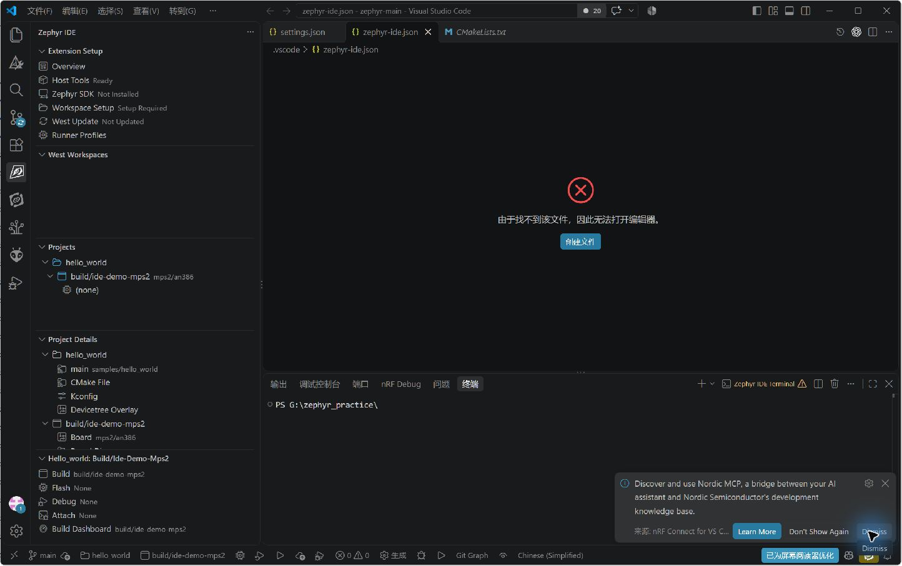

<!-- SPDX-License-Identifier: Apache-2.0 -->

# 第1章\_先确定配置由谁读取

本手册按 **2026-10-08 实装的 Mylonics IDE for Zephyr 4.1.1** 编写。截图为本机 VS Code 的真实界面，不是重绘界面。需要跟着鼠标从头接入时先读 [重置与导入实录](RESET_WALKTHROUGH.md)；这里逐项解释其余入口及全部 **35 个现行 VS Code 设置、8 个废弃兼容设置**，并覆盖 `zephyr-ide.json` 中的工程、构建、Runner 和安装声明字段。

“全部”指这个版本插件提供的配置表面，不是列举所有板子的 Kconfig 符号、所有 runner 的命令参数或 VS Code 所有通用设置。没有实际界面的兼容字段单列为 JSON 项，不能伪造一个按钮截图。实际下载、商业分析器和硬件调试没有为了截图而执行；相关页展示的是配置入口，不能作为运行成功证据。

这款扩展由 **Mylonics** 发布，是第三方工具。[插件仓库](https://github.com/mylonics/zephyr-ide) 与 [插件文档](https://zephyr-ide.mylonics.com/) 是它自己的来源；Zephyr 的 CMake、west、Kconfig 则属于底层构建体系。构建前被插件状态拦住，不能归因于 CMake 无法识别应用。

## 1.1\_五种存储位置不可混用

| 保存位置 | 谁读取、作用什么 | 修改后何时使用 | 如何取消 |
| --- | --- | --- | --- |
| 源码根 `.vscode/settings.json` | VS Code 与各扩展；保存本机 venv/SDK 搜索路径、界面偏好 | 设置变化后；环境重扫/新任务；个别状态栏项要求重启 | 删除对应键，回到用户层或默认值 |
| VS Code 用户 settings.json | 所有工作区的默认偏好；本机通常在 `%APPDATA%/Code/User` | 同上；工作区同名键优先 | 设置页齿轮 Reset Setting；注意工作区仍可能覆盖 |
| 源码根 `.vscode/zephyr-ide.json` | Zephyr IDE 的项目、Build、Runner、安装需求 | 插件载入后；构建参数改变用 Pristine 重新配置 | 在对应 UI 删除条目，或备份后改 JSON |
| 插件内部状态 | 当前 west 安装、是否初始化、扫描到的源码版本、局部覆盖 | 登记、扫描、切换工作区时 | 用 Deactivate、Unregister、Clear Projects 等对应操作 |
| 构建目录 CMakeCache.txt、zephyr/.config、zephyr.dts | CMake/Zephyr 生成与使用；是上次配置的结果 | 增量构建可能复用 | 改源配置后 Pristine；不要把直接编辑生成物当长期配置 |

第一个 `.vscode` 指 `G:/zephyr_practice/zephyr-main/.vscode`，不是 west 根、应用目录或 F 盘资料目录。后文 `projects → hello_world` 都表示 JSON 对象层级，不是磁盘路径。

## 1.2\_通用修改步骤

在 Windows VS Code 打开 G 盘源码根，按 `Ctrl+Shift+P` 执行 **Zephyr IDE: Open Settings**。选择 **Workspace** 范围，再改本工程的选项；只有希望所有工程采用相同行为时才选 User。设置页可跳到原生 VS Code Settings；原生搜索 `@ext:mylonics.zephyr-ide` 可看见 35 个现行项。

普通开关及输入项通过设置 UI 保存；数组/对象在原生 UI 可能显示 **Edit in settings.json**，按提示进入 JSON 编辑并保存。不把英文显示名称当 JSON 键，复制下面完整 `zephyr-ide.*` 名称。改完核对值、范围和对应行为；没变化时先检查 User/Workspace 覆盖，再重载窗口。后文条目未另说明时，恢复方式都是删除该设置键或 Reset Setting。

# 第2章\_35 个现行设置逐项说明

## 2.1\_已有环境路径：先配这两项

对应上方环境路径截图。它们修改的是插件查找位置，不下载文件，也不替读者创建完整环境。

| 完整键 / 默认值 | 设置动作、缘由与本次值 | 生效与失败判断 |
| --- | --- | --- |
| `zephyr-ide.venvFolder` / `null` | 指定现有 venv 根。本次 `G:/zephyr_practice/zephyr-main/.venv`；留空时插件按 setup 路径下 `.venv` 寻找，容易与实际源码内的 venv 不一致 | 保存后 Configure Existing Environment；Workspace 页的 Python .venv Location 应一致。不是 Python.exe 路径 |
| `zephyr-ide.toolchainDirectory` / `null` | 指定**包含各 SDK 安装的父目录**。本次 `G:/zephyr_practice`；不填时用插件默认工具链存放位置 | 重扫/刷新 SDK 页后应看到 1.0.1。若填成 SDK 子目录导致不识别，返回此项修正；不需要重装 |
| `zephyr-ide.zephyrBaseOverride` / `null` | 覆盖插件注入任务的 ZEPHYR_BASE，可为绝对或 VS Code 根相对路径。本次不需要 | 只改变终端/任务环境；**不改变插件扫描板子、samples、bindings 的源码树**。板列表错时修正工作区扫描，不能只改此键 |

`null` 表示没有显式指定，不能解释为禁用该功能。若改变 venv 或源码树，关闭旧任务终端并重扫，不依赖旧进程自行更新。

## 2.2\_Kconfig 按钮打开哪一种编辑器

| 完整键 / 默认值 | 每个取值做什么 | 本机建议及生效 |
| --- | --- | --- |
| `zephyr-ide.activeViewKconfigButton` / `dashboard` | 活动项目的 Kconfig 入口：`dashboard` 打开总览；`kconfig-dashboard` 直达 Kconfig 页；`gui-config` 调用 guiconfig；`menu-config` 调用 menuconfig | 初次使用保留默认，已有一次成功配置后点击。只是入口选择，不改 Kconfig 的值 |
| `zephyr-ide.projectViewKconfigButton` / `kconfig-dashboard` | Projects 树的 Config 入口；可选 Kconfig Dashboard、guiconfig、menuconfig，没有总览 `dashboard` 值 | 保留默认。外部 guiconfig/menuconfig 还依赖当前 Python/终端支持；打不开不能通过重装 SDK 解决 |

修改后下一次点击对应入口生效。活动面板显示 Build Dashboard 时，Build 行的 Kconfig 快捷按钮可能隐藏，见 2.5；不是插件没找到配置。

## 2.3\_构建、选项目和调试动作

| 完整键 / 默认值 | 功能与缘由 | 本机使用方式 |
| --- | --- | --- |
| `zephyr-ide.buildBeforeFlash` / `false` | 普通 Flash 是否先编译；独立的 Build and Flash 命令无论此值如何都会先编译 | 本次只编译，保持 false。以后希望 Flash 总是包含源码修改才打开；下一次 Flash 生效 |
| `zephyr-ide.automaticProjectSelection` / `true` | 编辑器焦点切到其他项目文件时，自动切换活动项目 | 单项目保留；多项目阅读源码时怕编错目标可关闭，再显式选活动 Build |
| `zephyr-ide.separateBuildDebugProfile` / `false` | Runner 编辑器增加独立 Build & Debug 槽；默认与 Debug 共用 | 只有“直接调试”和“先编译再调试”要不同配置才打开。关闭后 buildDebug 槽不再驱动动作，回到 debug |

没有一个开关会把缺少的板支持或 Python 包自动补齐。Flash、Debug、Attach 涉及设备动作，本次只查看了配置。

## 2.4\_底部状态栏的 6 个显示开关

以下每项只控制底栏是否出现对应按钮，**不执行按钮代表的动作**。插件元数据要求修改后重启；可保存后重开 VS Code 核对。本次保留默认。

| 完整键 | 默认 | 打开后显示什么、何时有用 |
| --- | --- | --- |
| `zephyr-ide.statusBar.showBuildPristine` | true | 清理并重新配置的 Build Pristine；改板子/模块/CMake 参数后使用 |
| `zephyr-ide.statusBar.showBuild` | true | 增量 Build；日常修改源文件后使用 |
| `zephyr-ide.statusBar.showFlash` | false | 仅 Flash 的入口；不想先编译时使用 |
| `zephyr-ide.statusBar.showBuildFlash` | true | Build and Flash；常规编译后下载入口 |
| `zephyr-ide.statusBar.showDebug` | false | Debug；已有可调试产物时进入 |
| `zephyr-ide.statusBar.showBuildDebug` | true | Build and Debug；编译后开始调试 |

## 2.5\_左下活动项目面板的 8 个显示开关

这些设置与状态栏的 6 项分别保存。隐藏一处不会隐藏另一处，也不会改变 west 参数。修改后查看左下活动项目面板；若未刷新可重载窗口。

| 完整键 | 默认 | 对应按钮及使用理由 |
| --- | --- | --- |
| `zephyr-ide.activeProjectPanel.showBuild` | true | 日常增量 Build |
| `zephyr-ide.activeProjectPanel.showBuildPristine` | false | 显示 Pristine，方便在改构建输入后重配 |
| `zephyr-ide.activeProjectPanel.showFlash` | true | 单独烧录现有产物 |
| `zephyr-ide.activeProjectPanel.showBuildFlash` | false | 一次完成编译和烧录 |
| `zephyr-ide.activeProjectPanel.showBuildDebug` | false | 一次完成编译和启动调试 |
| `zephyr-ide.activeProjectPanel.showDebug` | true | 调试入口 |
| `zephyr-ide.activeProjectPanel.showAttach` | true | 附加到目标的调试入口；具体行为由绑定决定 |
| `zephyr-ide.activeProjectPanel.showBuildDashboard` | true | 显示构建仪表板；打开时 Build/Pristine 行内 Kconfig 按钮隐藏，从 Dashboard 访问 |

## 2.6\_West Update 的 3 个选项

| 完整键 / 默认值 | 实际作用 | 不能解决什么、本次建议 |
| --- | --- | --- |
| `zephyr-ide.westNarrowUpdate` / false | 点击插件 West Update 时增加 `--narrow`，减少获取的 Git 历史范围 | 不是按板子裁剪 modules；不用它解决“只需要 CMSIS 却更新其他项目” |
| `zephyr-ide.westKeepDescendants` / false | 增加 `--keep-descendants`；当前 HEAD 是清单 revision 的后代时保留本地后续提交 | 不保证保留任意不相关分支，也不是忽略缺失仓库；有模块本地开发时按 Git 状态选择 |
| `zephyr-ide.westZephyrExport` / false | 成功更新后运行 `west zephyr-export`，注册用户级 Zephyr CMake package | 不安装 SDK、不改变选板、不等于 modules 完整；本次现有环境构建无需打开 |

三项都只在对应更新流程触发时发挥作用；改开关本身不会下载。本次全部保持默认，并且没有点击更新。限定下载项目由 west 清单/过滤/定向 update 负责；插件 4.1.1 没有“按当前板子自动下载最小依赖”的设置。

## 2.7\_环境警告、注入与源码浏览

| 完整键 / 默认值 | 设置缘由、实际作用 | 生效与排错 |
| --- | --- | --- |
| `zephyr-ide.suppressWorkspaceWarning` / false | 隐藏缺 ZEPHYR_BASE/ZEPHYR_SDK_INSTALL_DIR 的提示；给自己管理环境的人使用 | 只隐藏提示，不修复任何路径；本次不靠它解除编译门禁 |
| `zephyr-ide.disableZephyrBaseInjection` / false | 不让插件向终端、任务、调试进程注入 ZEPHYR_BASE | true 时也忽略 zephyrBaseOverride。已有独立可靠环境才开；本次保留 false |
| `zephyr-ide.useClangd` / false | 改用 clangd；插件设置 C_Cpp.intelliSenseEngine=disabled，并配置 clangd 参数 | 需先有 clangd 扩展。它不是安装器；切回后检查插件改写的 C/C++ 设置，别只以为布尔值恢复就足够 |
| `zephyr-ide.compileCommandsMode` / `all` | 合并哪些构建的 compile_commands：`active` 仅当前 Build，`project` 当前项目全部 Build，`all` 所有项目/Build | 写入 `.vscode/compile_commands.json`，用于浏览而非编译。多板宏冲突可用 active；必须先成功生成各 Build 数据库 |

应用里 `CONFIG_BOARD_TARGET` 的红线可能是数据库未生成/未加载。先编译、检查 `.vscode/compile_commands.json` 和 C/C++ 的 compileCommands 路径，不能从红线直接推断编译失败。

## 2.8\_静态分析

| 完整键 / 默认值 | 用法及生效范围 | 本次选择 |
| --- | --- | --- |
| `zephyr-ide.scaVariant` / `none` | 在 Pristine 配置时传 `-DZEPHYR_SCA_VARIANT`；可选 dtdoctor、gcc、clang、sparse、codechecker、coverity、cpptest、eclair、iar_c_stat、polyspace、custom、none | 保留 none，先建立普通构建；选分析器不等于安装它 |
| `zephyr-ide.scaCustomVariant` / `null` | 只在上项 custom 时使用；名字须有源码中的 `cmake/sca/<name>/sca.cmake` 支持 | 本次不填。改了要 Pristine 并检查配置日志；无效名字不是 SDK 自动识别问题 |

dtdoctor 是源码随附的设备树诊断；gcc 分析需要相应 GCC 支持；其余选项各需对应工具，商业工具还需许可。取消时设 none 后重新配置，避免旧缓存继续留有分析器选择。本次未执行这些分析器。

## 2.9\_数组设置、自定义变量和 Runner 列表

| 完整键 / 默认值 | 应填什么、为何需要 | 保存、生效和本次建议 |
| --- | --- | --- |
| `zephyr-ide.projectVariableDefaults` / `[]` | 字符串数组，例如变量名字 `probeId`；让各项目详情预先显示这个字段 | 这里只是名字，值在项目 customVars 中。不是 CMake `-D`、也不是环境变量；本次空 |
| `zephyr-ide.buildVariableDefaults` / `[]` | 为每个 Build 预先显示变量名 | 值在 Build customVars 中；不同板子可填不同 probeId。本次空 |
| `zephyr-ide.extraRunners` / `[]` | 给 Runner/Local Bind 下拉列表追加名字；字符限字母数字和点、下划线、连字符 | 不安装程序、不实现 runner；Zephyr 还必须真的支持这个名字。本次空 |
| `zephyr-ide.runnerProfiles` / `[]` | 用户级可复用 Runner 对象数组；推荐用 Runner Profiles 页 User 区编辑 | 工作区 zephyr-ide.json 同名 profile 优先。创建不等于绑定；见第 6 章。本次用户级为空 |

下面只是变量语法示意，不是本次必须增加的内容：项目 customVars 中 `"probeId": "实际探针编号"`，Runner 参数引用 `${projectvar:probeId}`；Build 变量用 `${buildvar:probeId}`。不用此功能就保持空数组，不要为凑齐配置给每项填值。

# 第3章\_8 个旧设置与 JSON 兼容字段

现行 UI 的 35 项截图见 1.2，下面 8 项是本机 package.json 标记废弃的兼容键，不在现行设置表里伪造截图。旧教程中的名字不应继续复制。先记下旧值，再移到右列键，核对父目录/venv 根等语义，删除旧键并重载；不要新旧两套同时维护。

| 废弃完整键 | 新键 | 默认 |
| --- | --- | --- |
| `zephyr-ide.globalDirectory` | zephyr-ide.toolchainDirectory | null |
| `zephyr-ide.global_directory` | zephyr-ide.toolchainDirectory | null |
| `zephyr-ide.tools_directory` | zephyr-ide.toolchainDirectory | null |
| `zephyr-ide.toolchain_directory` | zephyr-ide.toolchainDirectory | null |
| `zephyr-ide.suppress-workspace-warning` | zephyr-ide.suppressWorkspaceWarning | false |
| `zephyr-ide.venv-folder` | zephyr-ide.venvFolder | null |
| `zephyr-ide.project_variable_defaults` | zephyr-ide.projectVariableDefaults | [] |
| `zephyr-ide.build_variable_defaults` | zephyr-ide.buildVariableDefaults | [] |

项目 JSON 还兼容 `rel_path`，新写用 `relPath`；Build 的 `debugOptimization` 已废弃，新写用 `compilerOptimization`。这是另外的项目 Schema 字段，不包含在上面 43 个 VS Code 设置数量内。

# 第4章\_Workspace、Host Tools、SDK 和 Manager

## 4.1\_工作区状态与维护按钮

前提是已按实录登记 G 盘 west 根；点击左侧 Workspace Setup。上半页显示的是扫描结果，要核对五个实际路径/版本字段。

往下滚动，可看 west.yml 和维护按钮。

| 操作 | 作用与选择理由 | 本次执行情况 / 结果判断 |
| --- | --- | --- |
| Open Projects | 回到工程管理 | 不重新 clone 项目 |
| Open in Editor | 打开此工作区的 west.yml | 用来核对清单，不能把上游清单随意改成当前教程片段 |
| Save and West Update | 保存页面里编辑的清单并更新 | 有下载及仓库切换影响；本次没用 |
| West Update | 按清单更新活动仓库，并更新插件状态 | 本次不点；不是编译前必做 |
| Re-run West Setup | 重跑插件 west 环境准备流程 | 已有环境用 Configure Existing Environment；不要用它代替只读扫描 |
| Reset Workspace | 插件工作区重置入口 | 会改变登记状态；本次使用 Unregister + Clear Projects 的已记录路线，未执行此按钮，不假定两者完全等价 |
| Deactivate | 取消当前活动工作区选择 | 多环境切换时使用；后续需重新激活 |
| Unregister | 从插件登记中移除该工作区 | 本次清空时已执行；不等于删除磁盘源码 |
| West Config | west 配置入口 | 涉及清单路径等底层配置；本次未更改 `.west/config` |
| West Init | 初始化 west 工作区入口 | 只在没有 `.west` 的新工作区考虑；当前已存在，不能再次初始化来“修复” |

从零页面的 Git 下载、标准新建、目录初始化等分支是供没有现成工作区的人使用；已有环境的明确操作截图在 [实录](RESET_WALKTHROUGH.md) 的 1.4 节。

## 4.2\_Host Tools：主机工具与 SDK 分开

点击左侧 Host Tools。上部显示 Windows 包管理器 winget 状态和检测数量，下部是具体工具与刷新/安装入口。

| 检测项 | 为什么会用到 | 本次处理 |
| --- | --- | --- |
| CMake | 配置、生成 Ninja 构建规则 | 已有，未安装 |
| Ninja-build | 执行编译/链接规则 | 已有，未安装 |
| Visual C++ Redistributable | 某些 Windows 工具运行时依赖 | 已有，未安装 |
| gperf | Zephyr 某些生成步骤使用的主机程序 | 看所用功能需要，不是交叉编译器 |
| Python | west、Kconfig、设备树等脚本宿主 | 系统检测与 venvFolder 是两回事；构建应复用指定 venv |
| Git | west 管理源码仓库 | 存在 Git 不意味着所有 modules 已下载 |
| Device Tree Compiler | 设备树相关工具 | 与指定板子的 DTS 内容不是一回事 |
| wget | 下载工具链流程可能使用 | 已有环境不需要因它再下载 SDK |
| 7-Zip（可选） | 解包工具 | 按实际归档需求，不是 hello_world 的编译器 |

**Refresh** 重新检测，**Open Setup** 进入安装说明/流程；安装动作可能调用包管理器。绿色 Installed 只反映此工具检测，不能证明插件任务用了预期版本。若显示已装但任务找不到程序，检查任务环境/PATH并重开 VS Code，先读构建日志，而不是再新建 venv。

## 4.3\_SDK 页：已装版本与目标组件

入口是左侧 Zephyr SDK；本机已显示 Installed。版本与 GNU/LLVM/目标架构是不同维度。`arm-zephyr-eabi` 是目标工具链名字；35/35 不表示同一编译器安装了 35 个版本。

现有 SDK 能用时仅核对版本、组件和路径。需要新版本才进入安装版本选择；缺组件才安装对应组件。`zephyr-ide.json` 顶层 `sdkVersion` 是**引导安装使用的版本声明**，不是给所有已配置 Build 强制切换 SDK 的开关。需要固定某次 CMake 的 SDK 时使用 CMake 输入并 Pristine，再核对编译器路径，不能只改这条安装声明就宣称切换成功。

本次没有执行 SDK 安装、卸载或版本切换，支持情况以本机 SDK 页面及插件文档为准。

## 4.4\_Manager：声明要安装什么，不等于当前机器缺什么

从 Overview 的管理入口或命令面板 **Zephyr IDE: Manage Workspace Installations** 打开。页面集中管理 `.vscode/zephyr-ide.json` 的安装需求与可选动作。

截图中 **No toolchains declared** 与 SDK 页 **35/35 Installed** 可以同时成立：前者说 JSON 没写“希望自动安装的清单”，后者说磁盘实际已有工具。不要为消除 No declared 就点击所有安装按钮。

### 4.4.1\_SDK Toolchains

点击 Modify，勾选需要的目标工具链名称；保存到顶层 `toolchains` 数组。Install 才进入安装，不是 Modify 本身安装。当前 ARM 组件已经存在，所以只查看并取消。

示意：`"toolchains": ["arm-zephyr-eabi"]`。这是供工作区准备流程使用的需求声明；删掉条目不会卸载磁盘现有 SDK。缺组件时看 Install 的实际日志，不能用 JSON 数组长度判断安装成功。

### 4.4.2\_Pip Packages 和 Pip Requirements

Modify Packages 输入包名列表，Modify Requirements 输入 requirements 文件路径列表；按输入框显示的格式提交，分别保存到 `pipPackages`、`pipRequirements`。Install All 才执行安装。

包列表用于额外 Python 包，如 pyocd；requirements 列表是项目维护的包版本文件，可为绝对或工作区相对路径。先核对 Workspace 页的 venv 路径，避免装进另一套 Python。现有环境已经能编译时两者可以不声明；本次只查看，不安装。删除声明不会自动卸载包。

### 4.4.3\_West Blobs

`blobs` 是需要 `west blobs fetch <module>` 的**模块名称列表**。这用于某些厂商二进制固件，不是 CMSIS 源码路径，也不是 west.yml 所有模块的选择器。Modify JSON List 改声明，Install from JSON 按声明获取，Fetch Selected 按页面勾选获取。

本机没发现 blob 模块，按钮显示 0，Modify 没出现可选条目。页面通用提示“Run west update and refresh”不证明 hello_world 缺 blob——同一环境已经编译成功。当前示例不需要就保持空；只有目标模块明确声明必需 blobs 时才走下载流程。本次没有执行 fetch。

### 4.4.4\_Host/Vendor Tools 与 Sample Projects

Host/Vendor Tools 的 Open Host Tools 返回 4.2。Sample Projects 的 Modify 从已知项目中选择要写入 `sampleProjects` 的模板。

`sampleProjects` 可以是项目对象，兼容旧式相对路径字符串。它不会启动时自动导入，使用 **Zephyr IDE: Add Sample Projects From File** 才交互导入。它不是下载 Zephyr samples 的按钮；源码中原有 samples 仍在原处。本次没有新增模板，hello_world 已通过 Add Project 登记。

### 4.4.5\_Terminal Commands

点击 Add/Modify/Delete，先选择 Windows，再选择 Add、Modify 或 Delete，配置对应 `commands.windows` 的字符串数组。Linux/macOS 分别保存到 `commands.linux`、`commands.mac`。

这些是工作区准备后的自定义终端动作，**不是每次 Build 自动执行的 CMake 参数**。Run Commands 才是执行入口；应先检查实际命令文本。本次只查看选择器，没有填写或执行命令，当前数组无需设置。删除条目只移除声明，不能撤销以前命令对磁盘做过的更改。

# 第5章\_工程和 Build 的全部字段

## 5.1\_项目与构建的范围

Projects 显示已登记应用，Project Details 的项目节点显示共用配置，Build 节点显示该板目标自己的配置。展开前后如下。

修改文件前备份 `.vscode/zephyr-ide.json`。添加项目使用 Add Project；添加构建使用 Add Build，完整鼠标步骤见实录。涉及源文件删除的动作先读确认框；只想移出插件时用移除配置的入口，不删除应用磁盘目录。

| 项目字段 | 保存位置与缘由 | 本次值 / 修改效果 |
| --- | --- | --- |
| 顶层 `projects` | 名字到 ProjectConfig 的映射 | 包含 hello_world；不是名叫 projects 的文件夹 |
| 顶层 `activeProject` | 活动项目名字 | 可由界面选择更新；不能代替 build 配置 |
| `name` | 项目显示名称 | hello_world；与对象键保持一致 |
| `relPath` | 相对 VS Code 根的应用目录 | samples/hello_world；应包含应用 CMakeLists.txt |
| `buildConfigs` | 名字到 BuildConfig 的映射 | 每个板子/参数组合可独立一项；空对象意味着尚未 Add Build |
| `confFiles` | 项目共用的 conf/overlay 文件列表 | 对该项目各 Build 起作用，见 5.3 |
| `customVars` | 项目自定义字符串值 | Runner 可引用，不会自动变成 CMake 或 Kconfig 定义 |
| `twisterConfigs` | Schema 保留的测试配置对象 | 本次 `{}`；见 5.6，不编造不存在的向导 |

## 5.2\_板子、优化、输出目录与参数

Add Build 的板选择截图见实录；这里按实际存储字段解释全部输入。

| BuildConfig 字段 | 为什么有它、填什么 | 修改后怎么确认 |
| --- | --- | --- |
| `name` | 本次 build/ide-reset-mps2，是标识名 | 与 buildConfigs 对象键保持一致；不是必须预先存在的目录 |
| `board` | west `-b` 的板目标，本次 mps2/an386 | Pristine 后核对日志 BOARD，不填 boards/arm/mps2/an386 |
| `revision` | 板子支持的硬件修订号，可省略 | 不适用时向导跳过；不要凭空填 SDK/Zephyr 版本 |
| `relBoardDir` | 额外板搜索目录；内置板留空/省略 | 插件据此构造 BOARD_ROOT；优先让板向导写出正确路径，不能用它替代 board 名字 |
| `relBoardSubDir` | 板目录在搜索范围内的子路径 | 本次 arm/mps2；不是额外的 CPU 目标字段 |
| `relPath` | 自定义输出目录，相对 VS Code 根 | 本次 build/learning-tools/zephyr-vscode/ide-reset-demo；省略时按应用路径与 Build 名生成默认目录 |
| `compilerOptimization` | debug、speed、size、none；省略表示交 Kconfig | 对应向导 Not set 与 None 是不同概念：前者不覆盖，后者显式无优化；改后 Pristine |
| `westBuildArgs` | `west build` 自己的参数数组，例如 --sysbuild | 本次 []；别把 CMake -D 放这里；按日志核对 -- 前部分 |
| `westBuildCMakeArgs` | 传给 CMake 的参数数组，位于 west 的 -- 后 | 本次 compile_commands 与明确 CMSIS 路径；新建/Pristine 才按新输入配置 |
| `confFiles` | 本 Build 专属 conf/overlay，与项目层共同参与 | 见 5.3；作用范围比项目层小 |
| `customVars` | 本 Build 的自定义字符串值 | 由 `${buildvar:key}` 使用；不能直接控制编译器 |
| `activeProfile` | 引用 Runner Profile 的名字 | 无值为 Auto；与编译选板分开 |
| `bindOverrides` | flash/debug/attach/buildDebug 槽追加参数 | 只适用于 west-flash、west-debug 绑定种类，见 6.4 |

West Args、CMake Args 在树中可展开，条目提供编辑/删除入口；新增参数后保存并按需 Pristine。要撤销参数，删条目并重新配置。**普通 Build** 主要复用已生成的构建；“改了 JSON 但还用旧板/旧模块”先检查是否没有重新配置，以及当前活动 Build 是否选错。

本次可复制完整文件见 [实录 1.8](RESET_WALKTHROUGH.md)。JSON 的 `'-DZEPHYR_MODULES=G:/…'` 内部单引号是本机 PowerShell 参数传递修正，不能与 Kconfig 字符串引号混淆。

## 5.3\_Kconfig 文件与设备树 overlay：替换还是追加

在项目或 Build 的 Kconfig/Devicetree Overlay 行点 `+`，先选现有文件，再选择类型。项目层对所有 Build 公用；某个板独有的覆盖应放 Build 层。

| 列表及 entry.extra | 插件交给构建系统的变量 | 实际缘由 |
| --- | --- | --- |
| `confFiles.config`，false/省略 | CONF_FILE | 指定应用配置文件集合，会影响默认 prj.conf 的选取；不是替换板子的 defconfig |
| `confFiles.config`，true | EXTRA_CONF_FILE | 在默认/已选应用配置外追加片段，适合某 Build 的调试开关 |
| `confFiles.overlay`，false/省略 | DTC_OVERLAY_FILE | 指定 overlay 集合，覆盖默认自动选取规则；不替换基础板 DTS 本体 |
| `confFiles.overlay`，true | EXTRA_DTC_OVERLAY_FILE | 在已有 overlay 规则外追加片段 |

每个 entry 的 `path` 是相对 VS Code 根的文件路径，文件需要先存在；例如应用配置路径为 `samples/hello_world/prj.conf`。`extra` 是布尔值，不是字符串。编辑/移除条目改变的是传参；之后 Pristine，并检查构建日志及 Dashboard Configuration Sources。

本次选 prj.conf 只演示选择器，最后按 Esc，没有重复添加。默认 hello_world 已自动加载 prj.conf，无需为了让计数从 0 变 1 再手动登记一遍。

默认板 defconfig、基础 DTS、SoC 配置由 BOARD 与 Zephyr 构建系统选择；插件主要负责传 BOARD、可选文件和参数，不能凭 Add Project 就猜出读者要哪个硬件变体。

## 5.4\_Kconfig Dashboard 如何改、如何保存

成功配置后打开 Build Dashboard 的 Kconfig 页。截图可见搜索、筛选、符号列表、变更区域、Save Fragment 和外部编辑器入口。

先搜目标符号，看当前值、依赖和来源，再决定是否修改。灰色/不可选可能是依赖约束，不是按钮失灵。要长期保存选择，将片段保存为自己维护的 `.conf`，然后通过 5.3 的 Extra Kconfig File 接入，或明确合并进应用 prj.conf；重配后再次核对来源和符号值。不要只改生成的 `build/.../zephyr/.config` 就认为源配置已更新。

本次只查看了已生成符号及 Configuration Sources，没有修改符号或执行 Save Fragment、menuconfig、guiconfig。因此这里说明的是可见入口与保存原则，没有声称所有编辑器已运行验证。

## 5.5\_Devicetree Dashboard 的输入与生成结果

成功构建后切 Devicetree 页。Browser 用于看节点/属性，Source 看本次生成的 DTS，并可沿来源定位。要改硬件描述，应编辑工程维护的 DTS/overlay，必要时通过 5.3 登记 overlay，然后重新配置；生成的 zephyr.dts 是合并结果，不是长期编辑入口。

Build Dashboard 的总览和内存/初始化/ELF 等报告属于结果查看，不会自动给工程增添板支持。数据不足时先核对所选 Build 是否成功生成相应产物。

## 5.6\_Twister：Schema 有字段不等于本版有完整向导

本机 4.1.1 的项目 Schema 仍定义 `twisterConfigs`，但本次核对 package.json 的命令贡献没有找到 Add/Edit Twister 的公开配置向导；项目截图也没有该向导。**不能再指示读者去点击一个未经验证、当前界面不存在的入口。** 本次 hello_world 保留空对象。

| TwisterConfig 字段 | Schema 定义的用途 |
| --- | --- |
| name | 测试配置显示名 |
| platform | Twister 平台目标 |
| tests | 测试用例标识数组 |
| args | 额外参数字符串 |
| serialPort | 硬件测试串口，如 COM3 |
| serialBaud | 串口波特率字符串 |
| boardConfig | 板对象：board、relBoardDir、relBoardSubDir、revision |

这部分只记录兼容数据形状，不提供未经运行验证的 JSON 来冒充可点击测试流程；需要 Twister 测试时应单独按当前 Zephyr 的测试文档建立并验证。它不是普通 west build 的必要配置。

# 第6章\_Runner Profiles、Flash、Debug 与 Attach

## 6.1\_先创建，再选择作用范围和绑定

点击左侧 Runner Profiles。页面上方显示活动 Build；中间 Workspace 写入 `.vscode/zephyr-ide.json`，下方 User 写入 `zephyr-ide.runnerProfiles` 用户设置，同名时 Workspace 优先。

在希望的范围点 New profile，输入名字。本次临时创建 demo-auto 用来展示字段，未绑定到活动 Build，截图结束已删除。

`name` 是可引用标识；`flash` 用于 Flash/Build and Flash；`debug` 用于 Debug，也默认负责 Build and Debug；`attach` 用于附加。开启 2.3 的 separateBuildDebugProfile 才单独用 `buildDebug`。保存 Profile 只是定义它，**Change active profile / Use for active build** 才把它用于选中 Build。

## 6.2\_Flash：Auto 与指定 runner

Auto 对应 `{ "kind": "auto" }`，依据构建生成的 runners.yaml。指定 runner 对应 kind=west-flash、runner 名和 extraArgs 字符串数组；比如 pyocd 只是选择用 pyocd 这一后端，并不安装 pyocd 或识别所有芯片。

先确认板子的 runners.yaml 支持什么，再选择。Add argument 添加一个参数，多个参数分项存储，帮助按钮展开变量表。Save 写入，Revert 放弃未保存修改。只有点击实际 Flash 才操作目标。本次临时选 pyocd 只是展示，已 Revert，没有执行烧录。

## 6.3\_Debug、Attach 的四种数据类型

| kind | 要配置什么 | 作用 |
| --- | --- | --- |
| auto | 无额外字段 | 根据 runners.yaml 自动生成适用的调试配置 |
| launch | name | 引用 `.vscode/launch.json` 中的 configuration 名；没有配置时对应列表没有可选名字 |
| cortex-debug | runner，可选 enableRtt、probe | 由插件补 ELF/GDB/target，再提供结构化探针和 RTT 选择 |
| west-debug | runner，可选 extraArgs | 启动 west debugserver，由调试扩展连接外部 GDB server |

本次临时选择 openocd 展开结构化选项：

**Enable RTT** 只有后端与固件支持 RTT 时才有意义；不会自动把普通串口日志改成 RTT。**Interface/Probe** 在 OpenOCD 下选择 interface 配置，在 pyocd 下对应探针标识；先知道实际探针类型，不能因板子使用 ARM 就随便选。Auto 使用 runners.yaml/自动检测信息。GDB、ELF 和芯片目标仍要与构建匹配。

Attach 和 Debug 可以使用不同绑定。启用独立 Build & Debug 后新增槽遵循相同类型；未设置时回退到 Debug。此次所有调试修改均 Revert，没有启动调试服务器或连接硬件。

## 6.4\_本地覆盖与写回工作区

在 Project Details 的 Build 下展开 Runner 配置。上方 Profile、下方 Local Overrides 区分共享选择与只对本机的覆盖。

Set Local Bind 为 flash/debug/attach 等槽做本机选择；Save Local Runner Profile Override to Workspace 才把局部选择写入共享工作区。Reset Active Runner Profile to Workspace Default 清除局部选择、回到工作区值；它不是删除 SDK 或应用。

JSON 的 BuildConfig.activeProfile 引用共享 Profile；bindOverrides 的每个槽只支持 `extraArgs`，追加在 profile 已解析的参数后，且只对 **west-flash / west-debug** 生效。不要给 Auto 或 cortex-debug 填一堆 bindOverrides 期待它们全部转成 GDB 参数。

删除 Profile 前检查是否有 Build 引用它。下面的截图仅删除本次未绑定的 demo-auto，真实可编译 Build 保留。

## 6.5\_参数变量替换与保存按钮

| 表达式 | 取值来源与用途 |
| --- | --- |
| `${workspaceFolder}` | VS Code 打开的根；此处为 zephyr-main |
| `${buildFolder}` | 当前 Build 的输出目录 |
| `${board}` / `${boardRevision}` | 板目标与修订号；未设置修订时为空 |
| `${project}` / `${build}` | 当前项目名与 Build 名 |
| `${projectvar:key}` / `${buildvar:key}` | 对应 customVars 的值 |
| `${cmake:VAR}` | CMakeCache.txt 的值；键查找不区分大小写 |
| `${kconfig:VAR}` | 生成 .config 中的值，CONFIG_ 前缀可省略，字符串去引号 |
| `${env:VAR}` | 插件进程环境变量；不存在时为空 |
| `${config:some.key}` | VS Code 设置值 |

未知表达式保留给后续 VS Code 处理，不能假设都能解析。引用构建产物的变量要先有成功配置。点击 Save 保存、Revert 丢弃当前未保存修改；复制图标用于复制 Profile，垃圾桶删除。不要将截图里暂时选中的 pyocd/openocd 直接当成当前硬件的推荐值。

# 第7章\_按症状定位，而不是把所有项填满

| 可见症状 | 优先查看 | 处理动作与成功标准 |
| --- | --- | --- |
| Host Tools Ready，但 Build 提示先 West Update | 插件工作区状态和源码版本 | Configure Existing Environment；版本/venv 正确后再 Build，不按提示反复更新 |
| Mark as Complete 后板列表没有反应 | Workspace 页 Zephyr Version | Not available 时补源码扫描，见实录 1.4 |
| SDK 已安装却找不到 | toolchainDirectory 的目录层级 | 填包含 zephyr-sdk-* 的父目录，SDK 页应列出版本 |
| 反复想在别处新建 venv | venvFolder 与 setup path | 显式填现有 venv 根，扫描后核对显示路径 |
| boards/arm/mps2/an386 不存在 | BOARD 与真实文件夹的区别 | board=mps2/an386；目录 boards/arm/mps2 |
| Build None / choose Build Configuration | projects 的 buildConfigs 与活动选择 | Add Build 并选中；不是先选 Runner |
| 修改模块参数没有效果 | 当前 Build、CMakeCache、是否普通增量 | 保存正确 JSON 后 Pristine，查 zephyr_modules.txt |
| CMake 把 G:/ 路径当成多余参数 | 任务终端与命令引号 | 本机 PowerShell 需要给完整含路径 -D 参数保留单引号，见实录 1.8 |
| 0 kconfig / 0 overlay | 统计范围 | 看 Dashboard Sources；默认 defconfig/prj.conf 已加载无需重复登记 |
| CONFIG_* 红线但 ELF 能生成 | compile_commands 与语言扩展 | 先核对编译数据库的来源和当前板宏，再重载语言服务 |
| blobs 页面提示 Run west update | 目标是否确实需要厂商 blobs | 当前 hello_world 不需要；不以泛化提示替代依赖判断 |
| West Update 卡在无关模块 | manifest 活动项目与网络 | 这是更新流程；停止无意义重试，核对所需清单模块，按 west 定向维护 |

对于本机问题，既有插件状态门禁/界面提示的局限，也有配置路径层级、源码扫描遗漏和参数引号需要修正。**不能概括为全是读者操作错，也不能说工具完全不支持既有环境。** 本次 GUI 重演已证明 SDK、venv、CMSIS 都可复用，不依赖从 UCRT64 启动。

# 第8章\_版本依据与验证范围

现行设置逐条来自本机 `C:/Users/Lizha/.vscode/extensions/mylonics.zephyr-ide-4.1.1/package.json` 的 contributes.configuration；项目字段来自同目录 `resources/zephyr-ide-schema.json`；环境扫描、Build 门禁和更新行为核对了 `dist/extension.js`。升级后先比较这些定义，不能把 latest 网页当成旧版 UI 的逐字保证。

已验证：清空插件登记/项目缓存、配置现有环境、扫描版本、Add Project、Add Build、保存 JSON、实际点击 Build 成功；全部设置和主要管理页面真实截图。临时 Runner 已清理。未执行：全量/定向 west update、pip/SDK 安装、Kconfig 修改保存、Twister、静态分析、QEMU、烧录、实板调试；没有以这些入口截图冒充运行验证。

官方/维护者入口：[插件命令参考](https://zephyr-ide.mylonics.com/reference/commands/)、[复用现有环境](https://zephyr-ide.mylonics.com/getting-started/external-environments/)、[west 内置命令](https://docs.zephyrproject.org/latest/develop/west/built-in.html)、[west 清单](https://docs.zephyrproject.org/latest/develop/west/manifest.html)、[west 配置](https://docs.zephyrproject.org/latest/develop/west/config.html)。本地验证记录见 [VALIDATION](VALIDATION.md)，首次导入操作见 [RESET_WALKTHROUGH](RESET_WALKTHROUGH.md)。
