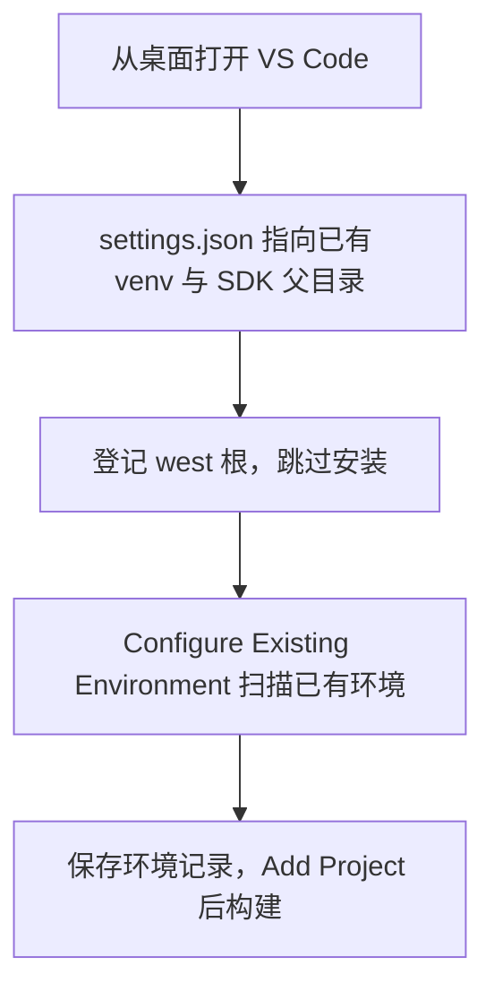
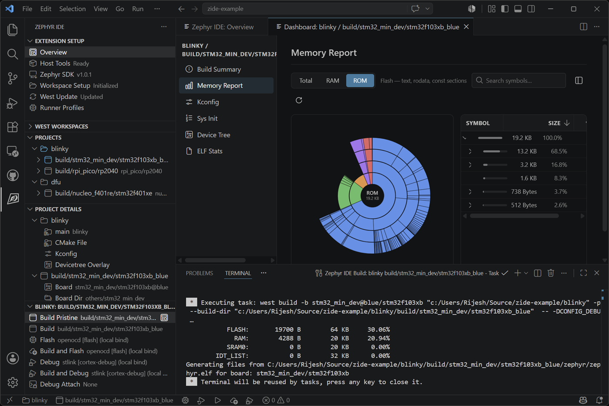
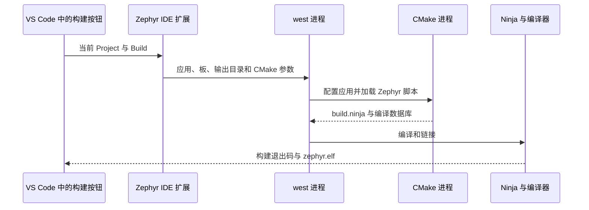
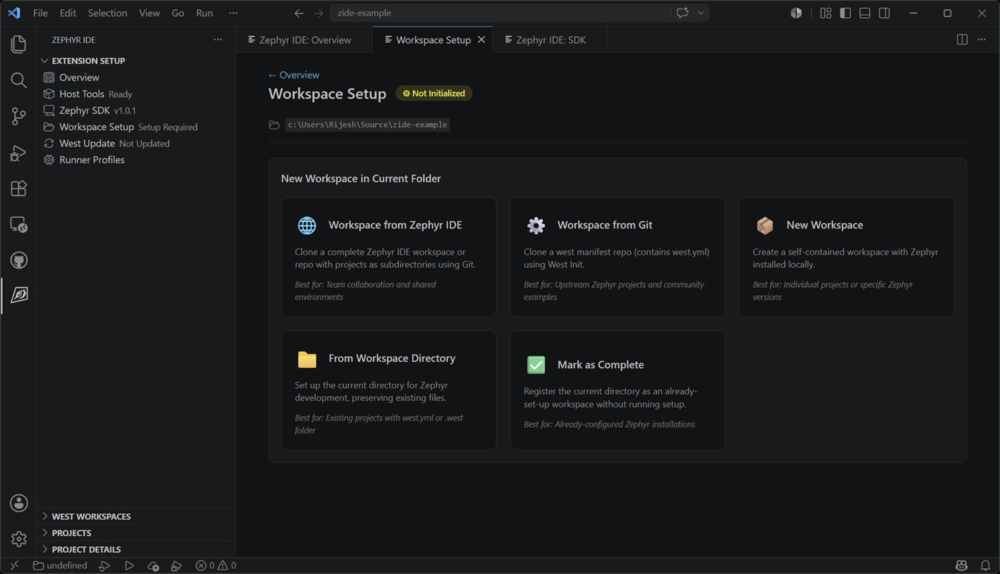
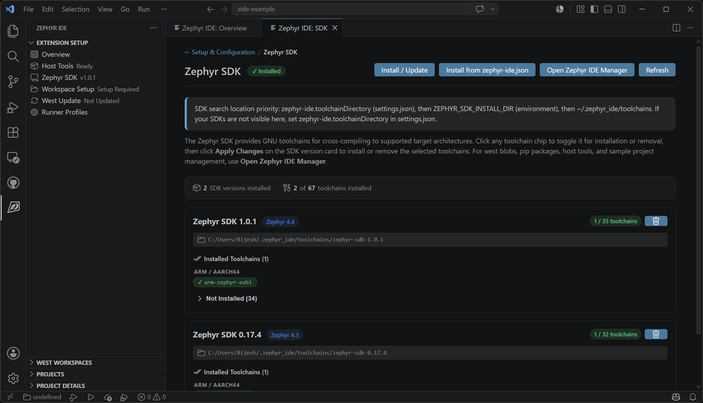

<!-- SPDX-License-Identifier: Apache-2.0 -->

# 第1章\_VS\_Code\_Zephyr\_IDE接入已有工程

已有环境却被 West Update 或 Build None 卡住时，先读 [已有环境直接构建行动指南](ACTION_GUIDE.md)。其中按当前实际文件给出空 buildConfigs 的替换方法，明确区分磁盘路径与 JSON 字段。

这里的“从零”是从第一次在 IDE 中接入工程开始：源码、SDK、Python 虚拟环境已经准备好，本章不重新下载安装。

本章处理一个具体问题：已经在 G 盘准备好 Zephyr 源码、SDK 和 Python 虚拟环境，现在希望在 VS Code 中选择应用、点击构建、阅读源码。使用的扩展是 **Mylonics 的 IDE for Zephyr，扩展 ID 为 `mylonics.zephyr-ide`**。不要把它与 Ac6 的 Workbench for Zephyr、Nordic 的 nRF Connect 扩展混用。本章按本机 4.1.1 的设置定义、命令和实现核对，在线文档可能随版本更新。

配套 [PPT](P001_VSCode_Zephyr_IDE接入已有工程_Windows.pptx) 精讲关系与关键操作，[命令索引](commands/README.md) 提供连续可复制文本。主线直接在 VS Code 图形界面配置，不要求从 UCRT64 启动；可选命令行自查使用 **MSYS2 UCRT64 Bash**。资料保存在 F 盘，实验始终在 `G:\zephyr_practice\zephyr-main` 进行。所有操作记录的验证范围见 [VALIDATION](VALIDATION.md)。

完成后，VS Code 打开 G 盘源码，插件管理 `hello_world` 应用和 `mps2/an386` 构建配置，构建产物进入 `build/learning-tools/zephyr-vscode/hello_world`，C/C++ 扩展读取这次构建的编译数据库。本章先用官方 ARM 目标验证开发链路，**这个结果不代表 HC32 已经移植或完成实板验证**。

第一次按 **1.2 → 1.4 → 1.5 → 1.6 → 1.7 → 1.8 → 1.9 → 1.10 → 1.11** 操作，1.1 和 1.3 用来理解每一步在做什么。不要先把所有示例 JSON 粘进同一个文件。每个示例前都写了它所属的文件和使用时机。

| 现在做到哪里 | 下一步会留下什么 |
| --- | --- |
| [打开文件夹](#open-folder) | VS Code 资源管理器显示 G 盘源码 |
| [修改 settings.json](#edit-settings) | 插件知道已有 venv 和 SDK 放在哪里 |
| [登记并扫描](#register-scan) | 插件保存 west 根、Zephyr 源码与 Python 环境记录 |
| [Add Project](#add-project) | 插件项目列表出现 hello_world |
| [Add Build](#add-build) | 项目下出现 ide-mps2 构建配置 |
| [修改项目 JSON](#edit-project) | 明确应用、板、参数和构建输出位置 |
| [第一次构建](#first-build) | 本次成功生成 ELF 和编译数据库 |
| [配置源码浏览](#source-navigation) | C/C++ 使用本次构建参数查头文件与符号 |

<a id="stage-map"></a>

## 1.1\_要交给插件的四个对象

“导入源码”和“添加工程”发生在不同层面。资源管理器能显示 `.c` 文件，只说明编辑器打开了目录。插件还需要知道 Zephyr 环境在哪里、哪个目录是应用，以及为哪块板生成什么构建。理解这些对象后，就能判断某个红色提示属于哪一层。

| 对象 | 本章位置 | 谁使用它 |
| --- | --- | --- |
| VS Code 文件夹 | `G:/zephyr_practice/zephyr-main` | 编辑器资源管理器、工作区设置与插件项目相对路径 |
| west 工作区 | `G:/zephyr_practice`，其中已有 `.west/config` | west 发现清单、模块和扩展命令 |
| Zephyr 源码 | `G:/zephyr_practice/zephyr-main` | Zephyr CMake、板列表、头文件与内核实现 |
| SDK 和 Python 环境 | SDK 在父目录；`.venv` 在源码目录 | 编译器与 Python 构建脚本 |

下面的阶段图回答“先让哪个对象被识别，再做什么”。同样的 ①—⑤ 编号用于 PPT。


源码树是整个 Zephyr，应用只是其中的 `samples/hello_world`。插件的 Project 项对应应用，Build 项对应“应用 + 板目标 + 参数 + 输出目录”。一个 Project 可以有多个 Build。SDK 只提供工具链，不会替你创建应用或补齐所有源码模块。

## 1.2\_①核对目录、虚拟环境和主机工具

前提是前面的环境章节已经完成。缺少源码时返回 [源码准备](../P01_zephyr_make_project/P001_准备UCRT64环境与下载Zephyr_Windows.md)，缺少 Python 或主机工具时返回 [环境准备](../P01_zephyr_make_project/P002_主机工具与Python环境_Windows.md)，缺少 SDK 时返回 [SDK 准备](../P01_zephyr_make_project/P003_SDK准备与编译器选型_Windows.md)。已有 `.west` 时不要再次执行 `west init` 来消除提示。

下列是已有目录示意，不是要执行的命令。`modules` 的实际内容由之前的 west 清单和下载步骤决定。

```text
G:/zephyr_practice/
├── .west/config                    # 已有：west 初始化生成
├── modules/                        # 已有：按清单下载的源码模块
├── zephyr-sdk-1.0.1/                # 已有：已解压并准备好的 SDK
│   ├── sdk_version
│   ├── cmake/
│   └── gnu/arm-zephyr-eabi/bin/
└── zephyr-main/                    # VS Code 本章打开这里
    ├── .venv/Scripts/               # 已有：Windows Python venv
    ├── west.yml                    # 官方源码原有：模块清单
    ├── samples/hello_world/         # 官方源码原有：本章应用
    ├── boards/arm/mps2/             # 官方源码原有：参考板支持
    ├── .vscode/                     # 后面由设置操作或插件产生
    └── build/learning-tools/        # 后面构建产生，不是源码输入
```

**先用文件资源管理器检查，不必启动 UCRT64。** 在 Windows 文件资源管理器地址栏分别粘贴这些路径并回车：

| 粘贴到地址栏的位置 | 应能找到什么 | 为什么要看 |
| --- | --- | --- |
| `G:\zephyr_practice\.west` | `config` | 已经初始化的 west 工作区记录 |
| `G:\zephyr_practice\zephyr-main` | `west.yml`、`VERSION`、`samples`、`boards` | 本章要让插件使用的源码 |
| `G:\zephyr_practice\zephyr-main\.venv\Scripts` | `python.exe`、`west.exe` | 要复用的 Python 和 west |
| `G:\zephyr_practice\zephyr-sdk-1.0.1` | `sdk_version`、`cmake`、`gnu` | 已安装的 SDK 根 |

可以用 VS Code 打开 `.west/config` **只读查看**，本章已有内容应包含 `[manifest]` 下的 `path = zephyr-main` 和 `file = west.yml`。它让插件从 west 父目录找到真正的源码树。不要为了跟示例一致重新执行 west init，也不要把源码目录改名为 zephyr。

四项都存在且之前已编译成功，可直接进入 1.4。只有不确定工具版本或路径时，再执行下面的可选命令检查。目录存在只能证明文件在磁盘上，后面仍要通过扫描和构建验证。

**可选命令检查：Windows，UCRT64 Bash；进入 G 盘源码根。** 执行以下只读检查，命令原件见 [01-check-environment.txt](commands/01-check-environment.txt)。

```bash
cd /g/zephyr_practice/zephyr-main
source .venv/Scripts/activate
python --version
python -c 'import sys; print(sys.executable)'
west --version
west topdir
west config manifest.path
west config manifest.file
command -v cmake ninja dtc
cat ../zephyr-sdk-1.0.1/sdk_version
../zephyr-sdk-1.0.1/gnu/arm-zephyr-eabi/bin/arm-zephyr-eabi-gcc.exe --version
```

`sys.executable` 应落在 `zephyr-main/.venv/Scripts/python.exe`；`west topdir` 应返回 `G:/zephyr_practice` 或等价的 Windows 写法；manifest 路径和文件分别为 `zephyr-main`、`west.yml`。本机基线为 Python 3.12.10、west 1.5.0、SDK 1.0.1。版本输出能确认程序可启动，不能单独证明模块和 Python 包已经齐全。

如果 `source` 报不存在，先检查路径，不要马上另建 C 盘环境。如果 `west` 找不到，确认激活的是这一份 venv，并在同一终端运行 `python -m west --version`。如果主机工具没有输出路径，按环境章补 PATH 后重开 UCRT64。SDK 根应含 `sdk_version` 和 `cmake`，只找到某个 `arm-zephyr-eabi-gcc.exe` 不等于找到了完整 SDK 根。

官方入门教程在用户目录创建 `zephyrproject/.venv` 是示例位置。Python 环境装 west 和脚本依赖，SDK 提供编译器，两者需要分别准备；venv 可以保留在 G 盘。[官方入门说明](https://docs.zephyrproject.org/latest/develop/getting_started/index.html#get-zephyr-and-install-python-dependencies)

## 1.3\_已有环境怎样交给插件

**不需要每次从 UCRT64 启动 VS Code，也不需要让插件再下载一份源码、SDK 或 venv。** 本章主线是正常打开 VS Code，保存已有环境的路径，再让插件登记和扫描它。UCRT64 是此前安装和执行命令的终端，不是这套环境的所有者；Windows 版 Python、west、CMake 和编译器也能由插件直接调用。

配置分为两个部分。`settings.json` 告诉插件 Python 环境与 SDK 在哪里；插件自己的安装登记记录保存 west 根、识别到的 Zephyr 源码与环境状态。只填写 JSON 还不足以产生这条登记，所以 1.6 还要执行一次“登记 + 扫描”。以后重新打开工作区可以复用记录，不需要重做安装。

当前本机插件是 **4.1.1**，命令面板提供 `Zephyr IDE: Configure Existing Environment (Scan Zephyr Dir/Version)`。该版本实现先按 `zephyr-ide.venvFolder` 读取已有 venv，把其 `Scripts` 加入插件进程的执行环境，再通过 `west list` 和 VERSION 找到实际 Zephyr 源码并保存结果。这个扫描命令没有调用 `pip install`、`west init` 或 `west update`。它不是依赖完整性检查；后续仍用实际构建验证工具和包是否齐全。

不要把 `Setup Standard Workspace` 或 `Use .west folder (Recommended)` 当成纯导入。4.1.1 的普通 setup 分支仍可继续安装 west 和更新模块。**本章复用路线先选 `Mark workspace as already set up` 跳过安装，然后运行上述扫描命令补齐真实路径。** 只标记状态、只隐藏警告、只设置 `zephyrBaseOverride` 都不能替代扫描。

<a id="open-folder"></a>

## 1.4\_②正常打开VS\_Code

**操作位置：Windows 桌面、开始菜单或 VS Code 界面。** 正常启动 VS Code，不用先打开 UCRT64，也不用执行 activate 或 export。

1. 选择“文件 → 打开文件夹”，打开 `G:\zephyr_practice\zephyr-main`。
2. 在资源管理器确认根目录为 `zephyr-main`，可以看到 `samples`、`boards`、`west.yml`。看不到左侧文件树时按 `Ctrl+Shift+E`。
3. 若弹出工作区信任提示，仅在确认这就是你准备的本地源码时信任它。处于受限模式时，扩展或构建功能可能无法运行。
4. 继续 1.5 保存 JSON，再按 1.6 登记 `G:/zephyr_practice` 这个 west 根。

编辑器打开的目录与 west 根允许不同。本章固定打开源码根，是为了让项目和构建相对路径统一。需要登记到插件的安装路径则是父目录 `G:/zephyr_practice`，那里有 `.west/config`；扫描会根据清单找到子目录 `zephyr-main`，不要求源码文件夹必须叫 `zephyr`。



若希望资源管理器一起显示 modules，也可打开父目录。但 `.vscode` 设置文件位置、Project relPath、Build relPath 和编译数据库路径都要随之改变，不能直接套用本章源码根布局。第一次接入先保持这一种布局即可。

<a id="edit-settings"></a>

## 1.5\_插件安装与工作区设置

**操作位置：刚打开的 VS Code，资源管理器根目录应为 `zephyr-main`。**

1. 按 `Ctrl+Shift+X` 打开扩展，在搜索框输入 `@id:mylonics.zephyr-ide`。确认发布者 Mylonics、名称 IDE for Zephyr。已安装时记录版本，不需要重复安装。
2. 本章源码浏览使用 Microsoft C/C++，扩展 ID 为 `ms-vscode.cpptools`。可安装插件推荐扩展，但 Cortex-Debug 只在后续调试时需要。
3. 按 `Ctrl+Shift+P`，运行 `Preferences: Open Workspace Settings (JSON)`。中文界面可以搜索“工作区设置 JSON”。本章打开的是单文件夹窗口，所以文件应为 `G:/zephyr_practice/zephyr-main/.vscode/settings.json`。
4. 文件不存在时由 VS Code 创建。已存在时只合并下列字段，保留其他有效设置。不要粘贴出两层外部花括号或重复字段。

**先认准文件位置。** 这里编辑“工作区设置”，不是用户级 settings.json，也不是 `.west/config`。可以右键编辑器标签页复制路径核对；目标必须是 `G:/zephyr_practice/zephyr-main/.vscode/settings.json`。如果命令面板难以定位，就在左侧资源管理器展开 `.vscode`，点击 `settings.json`。目录和文件都不存在时，在源码根新建 `.vscode` 文件夹，再新建 `settings.json`，注意不要变成 `settings.json.txt`。

以下是 **设置文件内容**，不是终端命令；原件见 [03-settings.json](commands/03-settings.json)。

```json
{
  "zephyr-ide.venvFolder": "G:/zephyr_practice/zephyr-main/.venv",
  "zephyr-ide.toolchainDirectory": "G:/zephyr_practice",
  "zephyr-ide.useClangd": false,
  "C_Cpp.intelliSenseEngine": "default",
  "cmake.configureOnOpen": false
}
```

`venvFolder` 指向 venv 根，不是 `python.exe`。`toolchainDirectory` 指向 **SDK 的父目录**，其下才是 `zephyr-sdk-1.0.1`。这与环境变量 `ZEPHYR_SDK_INSTALL_DIR` 的值不同：后者指向 **具体 SDK 根**。字段由插件读取，保存在本工作区，直到修改或删除。`cmake.configureOnOpen=false` 防止 CMake Tools 打开 Zephyr 源码根时另起一套配置流程，本章的构建交给 Zephyr IDE。

**当前问题的修复：** 若 settings.json 中已有顶层 `"ZEPHYR_SDK_INSTALL_DIR": "..."`，删掉该无效设置项。JSON 中写一个名字不会自动设置进程环境变量。普通 Python 扩展的“选择解释器”也不能替代 Zephyr IDE 的环境设置。[字段定义](https://zephyr-ide.mylonics.com/reference/configuration/)

### 1.5.1\_你的已有文件具体怎样改

如果你的文件仍是之前的四个字段：SDK 大写变量名、默认终端、C/C++ 编译数据库和 CMake 自动配置，那么只需要删除无效的大写变量名，增加插件的两个路径设置；原有终端和编译数据库先保留。为了统一本章 C/C++ 路线，再明确关闭插件的 clangd 选项并启用 C/C++ IntelliSense。修改后的**完整对象**如下，原件为 [08-settings-existing.json](commands/08-settings-existing.json)：

```json
{
  "zephyr-ide.venvFolder": "G:/zephyr_practice/zephyr-main/.venv",
  "zephyr-ide.toolchainDirectory": "G:/zephyr_practice",
  "zephyr-ide.useClangd": false,
  "C_Cpp.intelliSenseEngine": "default",
  "terminal.integrated.defaultProfile.windows": "Zephyr IDE Terminal",
  "C_Cpp.default.compileCommands": "${workspaceFolder}/.vscode/compile_commands.json",
  "cmake.configureOnOpen": false
}
```

这个完整对象只针对上述已有内容。若你又增加了其他设置，保留它们，再合并对应字段。`03-settings.json` 是最小设置，`08-settings-existing.json` 是带原有设置的完整例子，**二选一作为编辑参照，不是连续覆盖两次**。编译数据库此时可能尚未生成，等第一次构建成功后按 1.11 改成已经核对的输出路径。

### 1.5.2\_保存之前检查JSON结构

每个设置是外层 `{ ... }` 内的一项，用英文双引号，项之间用英文逗号。不要把整个示例对象粘到另一对花括号里面；已有同名字段时修改其值，不再增加重复项。Windows 路径在本章统一使用 `/`，避免漏写反斜杠转义。

按 `Ctrl+S` 保存；标签页上的未保存圆点应消失。需要整理缩进时按 `Shift+Alt+F`。若出现红色波浪线或 Problems 中有 JSON 语法错误，先检查上一行末尾的逗号、引号和花括号，再继续登记。保存只说明设置已写入文件，真正使用了哪个环境还要看下一节扫描结果。

如果插件没有自动提示配置编辑器，可以执行 `Zephyr IDE: Set Workspace Settings`，然后重新核对上面的字段。插件生成的设置与自己的选择有差异时，保留本章选定的 C/C++ 路线；clangd 的替代路线见 1.11。

<a id="register-scan"></a>

## 1.6\_登记已有west根并扫描环境

**前提：本机 IDE for Zephyr 4.1.1；VS Code 打开源码根；1.5 的设置已经保存。操作位置：VS Code 命令面板。**

1. 按 `Ctrl+Shift+P`，执行 `Zephyr IDE: Setup Workspace from External Directory`。
2. 在目录选择框的地址栏输入 `G:\zephyr_practice`，回车进入，再点击“选择文件夹”。确认选中的是 `zephyr_practice` 本身，这里已有 `.west/config`。不要选 SDK 或 `.venv`，也不要把源码子目录当作这一登记路径。
3. 询问怎样配置 west 时，选择 **`Mark workspace as already set up`**。这一步登记现有路径并跳过安装流程。
4. 再按 `Ctrl+Shift+P`，执行 **`Zephyr IDE: Configure Existing Environment (Scan Zephyr Dir/Version)`**。这一步才按已有 venv 运行 `west list`、识别源码并保存环境状态。
5. 成功提示应包含 `Zephyr environment configured`，Zephyr directory 应为 `G:/zephyr_practice/zephyr-main`。若只提示发现 Python 或只发现 Zephyr，说明扫描没有全部成功；不要靠标记或隐藏警告掩盖它。
6. 在插件 Overview / Workspace 信息中核对安装根为父目录、源码目录为 `zephyr-main`，然后继续 Add Project。重开 VS Code 后复用这条安装记录；需要切换时用 `Zephyr IDE: Select Existing West Workspace` 选择已登记路径。

**为什么这里选父目录，而刚才打开子目录？** 编辑器根决定哪些文件显示在窗口中、`${workspaceFolder}` 和项目相对路径从哪里计算。登记的 west 根决定去哪里读取 `.west/config`。这个配置的 manifest.path 指向 `zephyr-main`，因此扫描最终得到源码子目录。SDK 目录不含这份清单；venv 目录只有工具和包，所以都不能作为登记目录。

| 选择框中看到的选项 | 在本章中的处理 |
| --- | --- |
| `Mark workspace as already set up` | 本章选它：登记路径并跳过安装，然后立即扫描 |
| `Use .west folder (Recommended)` | 会复用清单，但普通 setup 可能继续更新依赖；本章不选 |
| `Use west.yml file` / `Create new west.yml` | 用于另一类初始化流程，本章已有 .west，不需要 |
| `Use Existing` / `Reinitialize` 的 Python 提示 | 已进入 Python setup 分支；取消，回到本章的登记入口 |

### 1.6.1\_扫描后看什么

扫描完成时先看提示，再看日志。打开“查看 → 输出”（`Ctrl+Shift+U`），在右侧频道下拉框中选择 Zephyr IDE 相关频道。应能追溯到在 `G:/zephyr_practice` 执行 west list，以及发现 `G:/zephyr_practice/zephyr-main`。不要把 Project 列表暂时为空当作扫描失败：我们还没有 Add Project。

若想查看环境全貌，可运行 `Zephyr IDE: Overview` 和 `Zephyr IDE: Show Workspace Structure`。正常关系是：安装根为父目录，Zephyr 目录为子目录，Python 来自指定 .venv。SDK 独立由 toolchainDirectory 扫描；如果 SDK 页面仍有其他架构缺失提示，先按 1.9 缩小实际所需 toolchains，别直接安装全部。

**扫描成功但状态仍为 Not Updated：** 先确认没有另一个 West Update 任务仍在执行，然后运行 `Zephyr IDE: Skip West Setup`；它只设置插件的准备标记，不下载模块。必要时保存文件后 `Developer: Reload Window`。左侧 West Update 是更新按钮，不是刷新按钮。若扫描未找到源码，先修复路径，不能仅靠 Skip 掩盖它。4.1.1 更新失败前会清除源码路径和标记，恢复时先扫描再处理状态。

### 1.6.2\_扫描只成功一部分时

| 提示或现象 | 含义 | 下一步 |
| --- | --- | --- |
| `No active workspace` | 扫描前没有选中登记记录 | 先完成外部目录登记；已有记录也可用 Select Existing West Workspace 选中 |
| 找到 Python，但没有 Zephyr | venv 路径被接受，west 清单或源码发现失败 | 核对登记目录是父目录、.west/config 的 manifest.path；看第一条 west list 错误 |
| 找到 Zephyr，但没有 Python venv | 源码可识别，venvFolder 没指向现有目录 | 检查 settings 保存位置、拼写和 `.venv/Scripts/python.exe` |
| `west` 命令或 Python 包报错 | 目录存在不等于 venv 依赖完整 | 回到环境章节只修对应缺项，再扫描 |
| 命令面板搜不到扫描命令 | 扩展未启用、窗口受限或版本与本章不同 | 核对扩展 ID、版本和是否需要 Reload Window，不要用安装命令冒充扫描 |

这两个动作需要连续完成。只执行标记时，插件不一定知道源码版本或 Python 路径；只执行扫描而没有活动工作区，会提示先 setup 或 open workspace。这里的“setup”入口包含纯登记分支，并不意味着必须安装。

若扫描失败，打开“查看 → 输出”并选择 Zephyr IDE 频道。检查日志中执行 `west list` 的目录为 `G:/zephyr_practice`、Python 来自 `zephyr-main/.venv/Scripts`、清单来自 `.west/config`。本机 manifest.path 为 `zephyr-main`。缺少命令、包或模块时针对缺项处理，不需要重新建立整套环境。

插件会把已登记 venv 的 Scripts、VIRTUAL_ENV 以及识别出的 ZEPHYR_BASE 注入后续终端与任务。已有终端可能仍持有旧环境，关闭旧终端后新建即可。这个过程不要求用户手工 source。普通 Windows 主机工具仍需能被找到；本机 PowerShell 中已能找到 CMake、Ninja 和 DTC。如果换电脑缺少某个工具，解决该工具的发现路径，而不是重新下载 Zephyr。

`zephyr-ide.zephyrBaseOverride` 只覆盖构建/终端中的变量，不改变插件扫描板、样例所用的安装目录；本章不靠这个字段代替登记扫描。[设置含义](https://zephyr-ide.mylonics.com/reference/configuration/)

下面是官方文档的 Project/Build 界面示意，图中工程和板名不是本章输入，布局可能随版本变化。



来源：[插件官方 README](https://github.com/mylonics/zephyr-ide)，截图来源见 [图片来源](assets/README.md)。

<a id="add-project"></a>

## 1.7\_③添加官方hello\_world应用

**前提：VS Code 打开 `G:/zephyr_practice/zephyr-main`，已有环境登记并扫描成功。操作位置：VS Code 命令面板。**

1. 按 `Ctrl+Shift+P`，执行 `Zephyr IDE: Add Project`。也可在 Projects 区域点击 Add Project。
2. 在 `Select Project Folder` 文件夹选择框中选择 `G:\zephyr_practice\zephyr-main\samples\hello_world`，确认选择。
3. 观察项目列表，应出现 `hello_world`。若提示项目已存在，优先使用已有条目，避免覆盖旧构建配置。
4. 展开应用，打开 `src/main.c`、`CMakeLists.txt` 和 `prj.conf`。确认这是官方示例，而不是根目录的 Zephyr 构建系统。

扩展 4.1.1 的 Add Project 会检查应用目录中有 `CMakeLists.txt`，并检查内容中存在 `project(`。选择 `src` 子目录会缺少应用入口；选择整个 `zephyr-main` 也不能表示“构建全部源码”。本章选择的应用目录具有完整入口，插件将其记入工作区 `.vscode/zephyr-ide.json`。

**Add Project 没有复制源码。** 它只是把选中的应用路径记入插件项目文件。`hello_world` 是一个能独立配置和链接的应用；`kernel`、`drivers`、`subsys` 是 Zephyr 的组成部分，不需要各执行一次 Add Project。

首次添加后，源码根 `.vscode/zephyr-ide.json` 应出现 `projects` 对象，其中有 `hello_world`，项目 `relPath` 为 `samples/hello_world`。若文件原本已有 `toolchains` 和 `runnerProfiles`，这些内容仍是同一个 JSON 的顶层字段。不要把项目对象粘到 settings.json。

此时尚未 Add Build，所以项目可以没有构建项，也还不会产生 ELF。选错项目时通过插件的 Remove Project 移除登记，再重新 Add Project；移除项目记录与删除应用文件是两件事，确认对话框中的操作范围。

下面是该应用 **官方原有文件的只读摘录**，无需创建或替换：

```cmake
cmake_minimum_required(VERSION 3.28.0)
find_package(Zephyr REQUIRED HINTS $ENV{ZEPHYR_BASE})
project(hello_world)
target_sources(app PRIVATE src/main.c)
```

`find_package` 让应用加载 Zephyr 的构建配置，`target_sources` 才把应用的 `main.c` 加入目标。内核、驱动等文件由 Zephyr 的构建系统根据板和配置加入，不需要在 IDE 中逐个“导入”这些 `.c` 文件。[应用开发说明](https://docs.zephyrproject.org/latest/develop/application/index.html)

<a id="add-build"></a>

## 1.8\_添加板目标与Build配置

**操作位置：VS Code。前提：Project 列表中已有 `hello_world`。**

1. 执行 `Zephyr IDE: Set Active Project`，选择 `hello_world`。
2. 执行 `Zephyr IDE: Add Build Configuration`，或点击项目旁的 Add Build。
3. 第一个 Board Picker 提示 `Pick Additional Board Directory` 时，选择 **`Zephyr Directory Only`**，使用已扫描的官方源码内置板。然后在 `Pick Board` 中搜索 `mps2`，选择对应 `an386` 的目标。不同界面可能把板、修订和 SoC qualifier 分步显示；最终 `board` 必须是 **`mps2/an386`**。只有出现修订选择时才按该板提供的值选择，不自行编造修订号。
4. Build 名称输入 `ide-mps2`。它是插件构建配置的名字，不是板名。
5. 优化选择 `Not set (configured in KConfig)`。Additional Build Arguments 留空；Modify CMake Arguments 填 `-DCMAKE_EXPORT_COMPILE_COMMANDS=ON`。前者传给 west，后者传给 CMake，不能把 `-D...` 填错位置。
6. 首次只构建，不需要配置 Runner Profile。完成后执行 `Zephyr IDE: Set Active Build`，选择 `ide-mps2`。

下面按 4.1.1 的向导提示逐项对照，遇到没有修订的板时，Revision 页面会跳过：

| 向导提示 | 本章选择或输入 | 为什么 |
| --- | --- | --- |
| Pick Additional Board Directory | `Zephyr Directory Only` | 用官方内置板，不加额外 BOARD_ROOT |
| Pick Board | `mps2/an386` | 本机源码确实存在的 ARM 目标 |
| Pick Revision（若出现） | 使用该板已有的默认项 | 不自造修订号；无此页则继续 |
| Enter build configuration name | `ide-mps2` | 方便在插件中辨认这次配置 |
| Select Build Optimization | `Not set (configured in KConfig)` | 先沿用应用/Kconfig 的设置 |
| Additional Build Arguments | 留空，按 Enter | 当前不需要附加 west 选项 |
| Modify CMake Arguments | `-DCMAKE_EXPORT_COMPILE_COMMANDS=ON` | 让 CMake 生成源码浏览需要的编译数据库 |

向导完成后展开 hello_world，应看到 ide-mps2。再执行 Set Active Build 明确选中它。Project 决定应用，Build 决定板和参数；只选 Project 不代表已选中你想编译的 Build。后续一旦有多个 Build，每次构建前看活动条目。

`mps2/an386` 是当前官方源码提供的 ARM Cortex-M4 参考目标，使用 SDK 中的 `arm-zephyr-eabi` 工具链。本章用它验证编译与源码索引，不要求连接 MPS2 开发板，也不调用 Flash。G 盘的 `boards/arm/mps2/board.yml` 已声明 `an386`；这是选择依据。

没有搜到板时，先检查 `ZEPHYR_BASE` 和插件日志中的 Zephyr 路径，再核对该文件。缺少模块时返回源码依赖章节。插件不会因为你输入某个芯片型号就自动生成该芯片的 Zephyr 适配。

<a id="edit-project"></a>

## 1.9\_明确输出目录与两个配置文件的职责

默认情况下，插件把输出放到应用目录下，以 Build 名为子目录。本系列统一把产物集中到源码根的 `build/learning-tools`，所以第一次构建前补充一个输出路径字段。

**操作位置：VS Code，左侧资源管理器。** 展开 `.vscode`，点击 `zephyr-ide.json`；也可按 `Ctrl+P` 输入 `.vscode/zephyr-ide.json` 后回车。文件由 Add Project / Add Build 产生；找不到时先确认 1.7、1.8 已完成以及当前打开的源码根。

核对绝对路径为 `G:/zephyr_practice/zephyr-main/.vscode/zephyr-ide.json`。`Zephyr IDE: Open Workspace Config` 打开的是插件工作区配置面板，不把它作为直接打开 JSON 的入口。

**下面的 projects、buildConfigs 是 JSON 字段，不是磁盘文件夹；ide-mps2 仅在完成 1.8 并使用该名称后才存在。** 当前只有 `"buildConfigs": {}` 时先创建 Build，或按 [行动指南](ACTION_GUIDE.md) 的完整字段示例编辑。

在编辑器中按 `Ctrl+F` 搜索 `ide-mps2`，找到 `projects.hello_world.buildConfigs.ide-mps2`，添加：

```json
"relPath": "build/learning-tools/zephyr-vscode/hello_world"
```

实际编辑时，把新字段放在这个 Build 对象的 `"name": "ide-mps2",` 之后：

```json
"name": "ide-mps2",
"relPath": "build/learning-tools/zephyr-vscode/hello_world",
"board": "mps2/an386"
```

上面三行是定位用的**对象内部片段**，不是完整文件。若该 Build 已有 relPath，修改原值，不再加第二个。保存后按完整示例检查嵌套：`projects → hello_world → buildConfigs → ide-mps2 → relPath`。

这是 **合并字段的示意**，不能把这一行单独作为完整 JSON 文件。Build 的 `relPath` 相对于本章 VS Code 根目录，不相对于应用，也不相对于 west 父目录。项目的 `relPath` 则为 `samples/hello_world`，二者位置不同。

用于核对的完整最小示例见 [04-zephyr-ide.example.json](commands/04-zephyr-ide.example.json)。已有文件只合并相应字段，保留其他项目和 Runner Profile，不整文件覆盖。最小示例包含：

```json
{
  "projects": {
    "hello_world": {
      "name": "hello_world",
      "relPath": "samples/hello_world",
      "confFiles": { "config": [], "overlay": [] },
      "twisterConfigs": {},
      "buildConfigs": {
        "ide-mps2": {
          "name": "ide-mps2",
          "relPath": "build/learning-tools/zephyr-vscode/hello_world",
          "board": "mps2/an386",
          "westBuildArgs": [],
          "westBuildCMakeArgs": ["-DCMAKE_EXPORT_COMPILE_COMMANDS=ON"],
          "confFiles": { "config": [], "overlay": [] }
        }
      }
    }
  },
  "toolchains": ["arm-zephyr-eabi"]
}
```

### 1.9.1\_已有其他字段时怎样合并

如果当前只有 toolchains 和 runnerProfiles，让 Add Project / Add Build 自动新增 projects，随后只修改本章的 Build。不要为了套用最小示例删除 runnerProfiles。已有其他项目时，在同一个 projects 对象里保留它们，hello_world 是并列的一项。

下面是字段位置对照。相同名字 relPath 出现在两层，含义由它所在对象决定：

| 字段位置 | 本章值 | 解析结果 |
| --- | --- | --- |
| `projects.hello_world.relPath` | `samples/hello_world` | 应用根 `G:/zephyr_practice/zephyr-main/samples/hello_world` |
| `projects.hello_world.buildConfigs.ide-mps2.relPath` | `build/learning-tools/zephyr-vscode/hello_world` | 本次构建输出根 |
| 同一 Build 的 `board` | `mps2/an386` | 交给 west build 的板目标 |
| 同一 Build 的 `westBuildCMakeArgs` | 包含生成编译数据库的 -D 参数 | 传给 CMake 的配置参数 |

如果改完发现项目树消失，先看 JSON 语法错误，而不是再次安装环境。按 Ctrl+S 保存并等待插件刷新；必要时重新展开项目树。重新打开 JSON，确认值仍在正确的 Build 对象内。

### 1.9.2\_只声明本章需要的ARM工具链

在同一 `zephyr-ide.json` 中搜索顶层 `"toolchains"`，把其数组内容改为下面这一项，保留相邻的 projects、runnerProfiles 等字段：

```json
"toolchains": ["arm-zephyr-eabi"]
```

如果没有该字段，在最外层对象增加它，并注意与前一项之间的逗号。若同一工作区其他应用确实需要别的架构，保留那些实际需要的条目。它声明“项目需要哪些工具链”，没有安装 SDK 的路径含义，也不会卸载磁盘上的其他架构。声明所有架构会让插件检查全部需求，不能由此推断现有 ARM SDK 不可用。也可用命令 `Zephyr IDE: Modify zephyr-ide.json Toolchains` 修改同一份需求列表。

官方内置板不需要本章手填 `relBoardDir`。向导若写入该字段，要保证它最终生成的 `BOARD_ROOT` 指向正确源码根；最小示例省略此覆盖，让 Zephyr 使用自己的内置板。

settings.json 保存本机的插件/编辑器选项；zephyr-ide.json 保存应用与构建描述。顶层 `toolchains` 是项目声明的工具链需求，不是磁盘目录。之前文件若勾选了所有架构，本章仅需 ARM 时可通过 `Zephyr IDE: Modify zephyr-ide.json Toolchains` 保留 `arm-zephyr-eabi`。这只修改需求声明，不卸载其他 SDK 工具链。[SDK 需求说明](https://zephyr-ide.mylonics.com/getting-started/sdk-installation/)

<a id="first-build"></a>

## 1.10\_④第一次构建与产物核对

**操作位置：VS Code；前提：活动 Project 为 `hello_world`，活动 Build 为 `ide-mps2`。**

1. 确认底部状态栏和 Active Project 面板显示目标构建。
2. 第一次在全新输出目录执行 `Zephyr IDE: Build`。本次只编译，不点击 Build and Flash。
3. 阅读构建终端的开头。应看见应用目录、板目标和输出目录。参数排列可与下面等价命令不同，但输入身份应一致。
4. 继续检查日志中的 Python、SDK 和编译器路径。成功结束后核对下面列出的文件，而不是只看没有红字。

**日志中的五个身份要对得上。** 应用应为 `samples/hello_world`；板为 `mps2/an386`；构建目录应含 `build/learning-tools/zephyr-vscode/hello_world`；Python 应来自 `.venv/Scripts/python.exe`；SDK 应来自 `zephyr-sdk-1.0.1`。主机 CMake/DTC 的路径可以和以前 UCRT64 中不同，只要版本满足要求且没有误用另一份目标 SDK。

成功时终端完成编译和链接，出现 `zephyr.elf` 的链接结果，进程成功结束。如果失败，向上找到第一条实际错误及其前后的命令：缺 Python 包先检查 venv，找不到板先检查扫描的源码，CMake/Ninja 不可用先检查主机工具。末尾的非零退出码通常只是结果，不是原因。

用 Ctrl+P 打开本章输出目录下的 CMakeCache.txt，搜索 `APPLICATION_SOURCE_DIR`、`BOARD`、`ZEPHYR_SDK_INSTALL_DIR`、`CMAKE_C_COMPILER` 等已存在的键核对输入。缓存中的值用于观察，不建议为修复路径直接手改缓存；回到插件设置或 Build 配置修正输入，再按需要重新配置。

插件把应用和 Build 描述转为 west 命令，west 再调用 CMake 配置并生成 Ninja 构建系统，Ninja 调用 SDK 的 GCC。下面的时序图中，CMake 的配置脚本在 CMake 进程内执行，Zephyr 不是另一个后台服务。



**失败定位的等价命令，Windows UCRT64，源码根，按下列命令临时准备诊断环境。** 这是 IDE 构建失败时用于比较的命令行入口；正常完成 IDE 构建后不需要再做一次。完整操作见 [05-build-cli.txt](commands/05-build-cli.txt)。

```bash
cd /g/zephyr_practice/zephyr-main
source .venv/Scripts/activate
export ZEPHYR_BASE='G:/zephyr_practice/zephyr-main'
export ZEPHYR_SDK_INSTALL_DIR='G:/zephyr_practice/zephyr-sdk-1.0.1'
west build -b mps2/an386 samples/hello_world \
  -d build/learning-tools/zephyr-vscode/hello_world \
  -- -DCMAKE_EXPORT_COMPILE_COMMANDS=ON
```

构建成功后应存在：

| 工具生成的文件 | 生成阶段与观察点 |
| --- | --- |
| `build/learning-tools/zephyr-vscode/hello_world/CMakeCache.txt` | 配置阶段记录应用、板、Python、SDK 和编译器等输入 |
| 同目录 `compile_commands.json` | 生成阶段记录每个编译单元的命令，供语言服务使用 |
| 同目录 `zephyr/.config` | Kconfig 的最终配置 |
| 同目录 `zephyr/zephyr.dts` | 当前板与 overlay 合成后的设备树 |
| 同目录 `zephyr/zephyr.elf` | 链接成功后得到的固件 ELF |

编译数据库出现不等于链接成功，旧 ELF 存在也不等于这次成功。应同时核对本次命令退出码、日志以及文件更新时间。普通改 `.c` 使用 Build；更换板、SDK 或 Python 后先检查缓存，再对 **本章独立输出目录** 执行 Build Pristine。Pristine 会清理该构建目录，使用前核对路径，不能指向源码根。[west 构建文档](https://docs.zephyrproject.org/latest/develop/west/build-flash-debug.html)

<a id="source-navigation"></a>

## 1.11\_⑤让源码浏览使用这次构建的真实参数

**前提：1.10 已成功生成编译数据库。操作位置：VS Code 工作区 settings.json。** 将下面字段合并到 1.5 的文件中，完整对象见 [06-cpp-settings.json](commands/06-cpp-settings.json)：

```json
"C_Cpp.default.compileCommands": "${workspaceFolder}/build/learning-tools/zephyr-vscode/hello_world/compile_commands.json"
```

若 settings.json 中已经有 `C_Cpp.default.compileCommands` 指向 `.vscode/compile_commands.json`，**替换原来这一项的值**。不要保留两个同名键。完成后的全文件示例见 [09-settings-after-build.json](commands/09-settings-after-build.json)，其他自定义设置继续保留。

按 Ctrl+S 保存，再打开 `samples/hello_world/src/main.c`。语言服务可能需要短暂解析时间。这里不需要再执行 Add Project 来“导入头文件”，也不需要把所有 include 目录手工列进 JSON。

该设置由 Microsoft C/C++ 扩展读取。它把 `main.c` 的编译器、宏、头文件目录与当前板关联起来，避免手工给全仓递归添加 includePath。插件也可能把活动构建的数据库同步到 `.vscode/compile_commands.json`；本章直接指定已经核对过的原始文件，便于排错。将来切换 Build，必须同步检查这里是否仍指向正确构建。

1. 按 `Ctrl+P`，打开 `samples/hello_world/src/main.c`，确认文件绝对路径在 G 盘。
2. 在 `#include <zephyr/kernel.h>` 上按 `Ctrl+单击` 或 F12，应能进入这份源码的 `include/zephyr/kernel.h`。头文件跳转验证 include 查找，比首先要求复杂宏跳到实现更容易判断。
3. 打开 C/C++ 扩展的诊断命令 `C/C++: Log Diagnostics`，核对编译数据库路径和当前文件的配置。找不到配置时先检查编译数据库里是否包含该源文件。
4. 阅读 `kernel`、`drivers` 或 `subsys` 时，理解当前构建只覆盖本板和本应用实际参与的编译单元。被配置排除的驱动可能没有独立的编译数据库条目，不能据此断定 Zephyr 源码没导入。

`Ctrl+P` 是按文件名打开源码，F12 是语言服务按当前构建语义定位符号。它们与 Add Project 的职责不同：Add Project 不复制整个 Zephyr，也不负责决定每个驱动是否编译。[C/C++ 编译数据库说明](https://code.visualstudio.com/docs/cpp/customize-cpp-settings#_compilecommands)

**可选 clangd 路线：** 已经使用 clangd 的读者可以选择 `zephyr-ide.useClangd=true` 并安装 clangd 扩展，让插件生成相应配置；同时关闭 C/C++ 的 IntelliSense，避免两套语言服务争用。此时 `C_Cpp.default.compileCommands` 不控制 clangd，需要核对 clangd 的 `--compile-commands-dir` 和 `--query-driver`。本章主线不混用两种路线。

## 1.12\_以后重新打开与可选维护

### 1.12.1\_第二天如何继续

正常启动 VS Code，打开同一个 `G:/zephyr_practice/zephyr-main`。settings.json 和 zephyr-ide.json 仍在磁盘，插件安装登记记录也会复用。核对 hello_world 和 ide-mps2，然后点击 Build；不需要再次安装或扫描。

如果项目列表在，但环境没有选中，执行 `Select Existing West Workspace`，选择 `G:/zephyr_practice`。如果 SDK、venv 或源码曾移动，先修改对应路径并重新登记/扫描，再处理旧构建缓存。若只是关闭窗口，不需要 Reset Workspace。

普通 `.c` 修改用 Build。换板宜另建 Build，使用另一个输出目录；需要对当前输出清理重新配置时才考虑 Build Pristine。第一次没有编译完成时，不把残留文件当成成功产物。

### 1.12.2\_可选诊断与依赖更新

主线登记完成后，正常打开 VS Code 即可使用已有环境。只有排查“终端成功而插件失败”等环境差异时，才需要尝试终端继承路线：先保存编辑并退出所有 VS Code 窗口，再在 **Windows UCRT64 Bash、源码根**执行 [02-launch-vscode.txt](commands/02-launch-vscode.txt)：

```bash
cd /g/zephyr_practice/zephyr-main
source .venv/Scripts/activate
export ZEPHYR_BASE='G:/zephyr_practice/zephyr-main'
export ZEPHYR_SDK_INSTALL_DIR='G:/zephyr_practice/zephyr-sdk-1.0.1'
code .
```

这是可选诊断方式，`code` 必须是终端可用的 VS Code 命令。进程只继承启动时的环境：在 VS Code 已经启动后对一个集成终端 export，不能反过来改变扩展宿主。如果已有活动安装与这些变量不一致，先用 Deactivate Workspace 解除旧选择，再试外部环境；不要删除安装文件。[外部环境说明](https://zephyr-ide.mylonics.com/getting-started/external-environments/)

只有确实希望插件管理依赖更新时，才使用 `Re-run West Setup` 或普通 setup 分支。`Use .west folder (Recommended)` 复用清单，但后续仍可能运行 west update；`Use Existing` 复用 venv，但 setup 仍可能安装 Python 包；`Reinitialize` 会重建 venv。这些都不是日常 Add Project 的前置步骤。



更新之前核对源码本地修改与所需工具链。当前只验证 ARM 应用时，保留 `arm-zephyr-eabi` 需求即可，不能为消除所有架构提示而安装全部工具链。登记与日常构建无需反复执行 setup。[工作区说明](https://zephyr-ide.mylonics.com/getting-started/workspace-configuration/)

## 1.13\_加入自己的工程和新增源文件

已经有 Zephyr 应用时，执行 Add Project 并选择包含应用 `CMakeLists.txt` 的目录。应用位于当前 VS Code 根目录内最便于保持相对路径清楚。保留自己的 `prj.conf`、overlay 和源文件，不用复制官方示例覆盖它们。外部独立应用也可以使用 Zephyr，但那属于不同的文件夹布局，需要重新核对相对路径与环境。

需要新建练习应用时，可使用插件的样例复制入口，或把 `samples/hello_world` 复制到源码根下新建的 `apps/hello_ide` 再 Add Project。复制应确认目标不存在，避免覆盖已有工程。本章附带 [07-create-app.txt](commands/07-create-app.txt)，在 Windows UCRT64、源码根执行：

```bash
cd /g/zephyr_practice/zephyr-main
if [ -e apps/hello_ide ]; then
  printf '%s\n' 'apps/hello_ide 已存在，请使用现有工程或换一个名字。'
else
  mkdir -p apps
  cp -a samples/hello_world apps/hello_ide
fi
```

新应用中的 `CMakeLists.txt`、`prj.conf` 和 `src/main.c` 来源于这次复制，不是原来已经存在的自研应用。若之前把构建产物放在样例目录下，先辨认复制目录是否夹带产物；本章指定根 `build` 后不会在样例目录产生此次构建输出。

如果不想执行复制命令，也可在 VS Code 文件树里复制官方 `samples/hello_world` 文件夹，在源码根新建 `apps`，粘贴并重命名为 `hello_ide`。目标目录已存在时停止，不覆盖已有应用。然后 Add Project 选择 `G:/zephyr_practice/zephyr-main/apps/hello_ide`，为这个新 Project 再 Add Build；本章建议新输出为 `build/learning-tools/zephyr-vscode/hello_ide`，避免与原示例混用。

已有自研应用则直接选择它包含 CMakeLists.txt 的应用根，保留原有 prj.conf、overlay 和源文件。只有普通 C 文件而没有 Zephyr 应用入口的目录，不能靠 Add Project 自动变成 Zephyr 工程，需要先建立应用的构建描述。

若随后自行创建 `apps/hello_ide/src/helper.c`，要在新应用的 `CMakeLists.txt` 中把它加入 `target_sources(app PRIVATE src/main.c src/helper.c)`。这段是修改说明，必须在实际创建 helper.c 后才应用。编辑器看得到一个文件，不代表 CMake 会编译它。新增源码后执行 Build，重新生成的 `compile_commands.json` 应包含它。

移植 HC32 时，可以在 G 盘完成相关板级支持后，为自己的应用新增另一条 Build。只有 `west boards` 和当前树的板定义确实支持 `uyup_rpi_a/hc32f4a0pitb` 时才选择该目标；不能因为 F 盘参照工程存在此板，就假设 G 盘也已经具备。板目标接入见 [新增开发板章节](../P01_zephyr_make_project/P011_编译示例与新增开发板_Windows.md)。Flash、Debug 还需要 runner、探针及板级配置，本章不使用“编译成功”代替这些验证。

## 1.14\_按症状返回对应步骤

| 看到什么 | 先检查什么 | 返回点 |
| --- | --- | --- |
| SDK 已安装，插件仍提示安装 | settings 是否误用了环境变量名；toolchainDirectory 是否填了 SDK 父目录；是否要求了其他架构 | 1.5、1.9 |
| 要在 C 盘建立 venv | 是否走了安装分支；venvFolder 是否已保存；是否完成登记和扫描 | 1.5、1.6 |
| 终端能构建，插件不行 | 登记的 west 根、扫描结果、构建日志的 Python/SDK；必要时使用可选终端路线 | 1.6、1.12 |
| 找不到 .west | 核对真实根；登记时选择父目录 G:/zephyr_practice | 1.2、1.6 |
| Add Project 拒绝目录 | 选择的是否为应用根；是否有 CMakeLists.txt 和 project() | 1.7 |
| Board 搜不到 | 插件读取的 Zephyr 路径和版本；板支持是否真实存在 | 1.8 |
| CMake 找不到模块或 Python 包 | 看第一条实际错误，核对 venv 与 west 模块清单；按前置章节补缺项 | 1.2、1.10 |
| 构建用了另一份 SDK/板 | 当前 Build、CMakeCache.txt 和命令行中的实际选择 | 1.9、1.10 |
| 头文件红线、F12 不工作 | 本次 compile_commands.json、C/C++ 诊断、当前文件是否参与构建 | 1.11 |
| 切换 Build 后跳转仍对应旧板 | 手工固定的 compileCommands 路径是否跟着更新 | 1.11 |

SDK 管理页面的官方示意如下。先分清“安装了哪些工具链”和“项目声明需要哪些工具链”，不要直接选择安装所有架构来消除提示。



最后按五个可观察结果自查：环境检查能返回正确目录；插件项目列表有应用；活动 Build 的板与输出正确；本次构建成功并生成 ELF；语言服务使用本次编译数据库打开 G 盘头文件。任一环节失败，沿表格返回对应步骤即可，不需要删除整个环境重来。

## 1.15\_依据、版本与进一步阅读

本章把本机 4.1.1 实现作为按钮行为的核对依据。安装目录通常为 `%USERPROFILE%/.vscode/extensions/mylonics.zephyr-ide-4.1.1/`。`package.json` 中的 `contributes.commands` 给出命令，`contributes.configuration.properties` 给出设置，`resources/zephyr-ide-schema.json` 定义项目文件，`dist/extension.js` 是该版本实际执行的程序。压缩后的函数名只适用于这份版本，不保证升级后相同。

| 问题 | 官方入口 | 源码或安装包定位 |
| --- | --- | --- |
| 命令行环境与 venv | [Zephyr Getting Started](https://docs.zephyrproject.org/latest/develop/getting_started/index.html) | G 盘 `doc/develop/getting_started/index.rst` |
| VS Code 插件定位 | [Zephyr 的 IDE for Zephyr 页面](https://docs.zephyrproject.org/latest/develop/tools/ide_for_zephyr_vscode_ext.html) | G 盘同主题 `doc/develop/tools/ide_for_zephyr_vscode_ext.rst` |
| 外部环境启动 | [External Environments](https://zephyr-ide.mylonics.com/getting-started/external-environments/) | 扩展 `dist/extension.js` 的 `WS` 读取 `process.env.ZEPHYR_BASE` |
| venv 与 SDK 目录 | [Configuration Settings](https://zephyr-ide.mylonics.com/reference/configuration/) | `package.json`；`mn`、`Ps` 及 toolchainDirectory 读取逻辑 |
| 登记扫描与普通 setup 的区别 | [Command Reference](https://zephyr-ide.mylonics.com/reference/commands/) | `configure-existing-environment` 命令调用 `Ps`、`Ts`；普通 setup 的 `cl` 处理 Use Existing/Reinitialize |
| 添加应用与输出目录 | [Project Setup](https://zephyr-ide.mylonics.com/user-guide/project-setup/) | `zephyr-ide-schema.json`；Build 路径解析中的 relPath 字段 |
| west 调用构建系统 | [Build, Flash and Debug](https://docs.zephyrproject.org/latest/develop/west/build-flash-debug.html) | G 盘 `scripts/west_commands/build.py` 与 `doc/develop/west/build-flash-debug.rst` |
| 应用源文件参与构建 | [Application Development](https://docs.zephyrproject.org/latest/develop/application/index.html) | `samples/hello_world/CMakeLists.txt`；`cmake/modules/zephyr_default.cmake` |
| C/C++ 编译数据库 | [Microsoft C/C++ settings](https://code.visualstudio.com/docs/cpp/customize-cpp-settings) | VS Code C/C++ 扩展的 compileCommands 设置 |

当前实验源码 VERSION 为 4.5.0-rc1，SDK_VERSION 为 1.0.1。升级插件或源码后，先核对命令名称、schema 和本机路径，再按相同关系迁移。在线 latest/develop 入口用于查阅，不代表未来版本仍有完全相同的菜单和默认行为。
