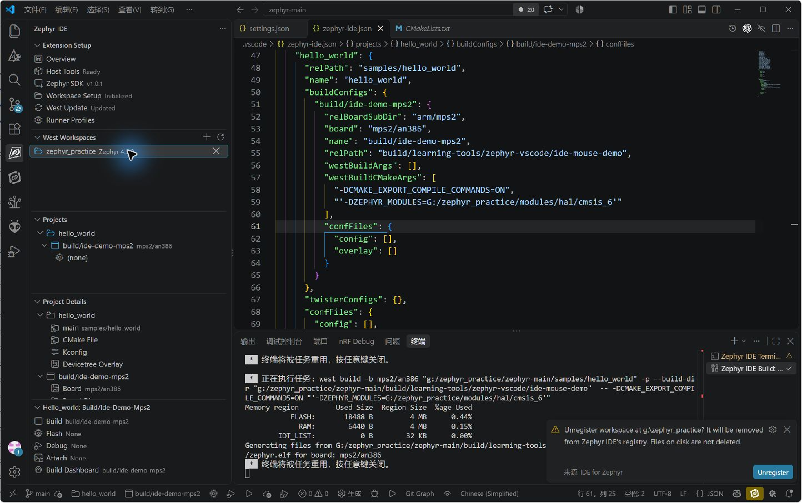

<!-- SPDX-License-Identifier: Apache-2.0 -->

# 第1章\_清空插件配置，从已有环境重新导入

本章截图来自 **2026-10-08 本机实际鼠标操作**，插件为 **Mylonics IDE for Zephyr 4.1.1**。实际点击 Build 完成 `hello_world + mps2/an386` 编译；没有执行 west update、pip 安装或 SDK 下载。其余选项逐项解释见 [全部配置参考](CONFIGURATION_REFERENCE.md)。已有 [48 页 PPT](P001_VSCode_Zephyr_IDE接入已有工程_Windows.pptx) 保留，本篇补充真实操作截图。

本次已经把 G 盘环境恢复到可编译状态。**读者现在不必再次清空；需要重演时才从 1.2 开始。** Windows 直接打开 VS Code 即可，本机不需要从 UCRT64 启动。插件能够给自己的任务提供 venv 和 SDK 环境，但必须先登记、扫描正确的源码安装。

## 1.1\_先认清四个路径

| 对象 | 本次实际路径 | 来源及用途 |
| --- | --- | --- |
| VS Code 打开的文件夹 | `G:/zephyr_practice/zephyr-main` | 已有源码 Git 根；下文 `.vscode` 相对此处 |
| west 工作区根 | `G:/zephyr_practice` | 已有 `.west/config` 所在目录；不是应用目录 |
| Python venv | `G:/zephyr_practice/zephyr-main/.venv` | 已有环境；插件复用其中 Python、west 与 Python 包 |
| SDK 安装根 | `G:/zephyr_practice/zephyr-sdk-1.0.1` | 已有 SDK；插件的 `toolchainDirectory` 填它的父目录 |
| CMSIS 6 模块 | `G:/zephyr_practice/modules/hal/cmsis_6` | 已有 Zephyr 模块源码，不是编译器 |
| 官方应用 | `G:/zephyr_practice/zephyr-main/samples/hello_world` | 源码已有；包含 CMakeLists.txt、prj.conf、src |
| 本次构建输出 | `G:/zephyr_practice/zephyr-main/build/learning-tools/zephyr-vscode/ide-reset-demo` | Build 生成；不与源码、配置文件混放 |
| 本文资料 | `F:/git_storage/zephyr_hc32f4a0/learning/zephyr_vscode` | 文档仓库；不在这里执行实验编译 |

后续截图中的盘符可能显示为小写，Windows 下是同一目录。示例以打开源码根为前提；如果改为打开 west 根，JSON 中相对路径也要随之改变，不能原封不动套用。

## 1.2\_清空的是插件登记和项目配置

本次清理前备份到 `G:/zephyr_practice/zephyr-main/.local/zephyr-ide-reset-20261008`，包括原 `.vscode`、用户设置和插件状态数据库快照。SDK、venv、modules、`.west` 均保留。

Windows / VS Code 中，打开 Workspace Setup，点击 Unregister，确认对象为 `G:/zephyr_practice`。这一步取消插件登记，不是删除 west 工作区磁盘目录。



本次另外通过文件工具清理工作区与用户设置中的 Zephyr IDE 设置，以及 `.vscode/zephyr-ide.json`，随后执行 `Developer: Reload Window`。这部分是文件操作，不能把它说成全部通过鼠标完成。其他扩展设置保留。仅删除 JSON 后，插件缓存仍显示旧项目，因此还实际执行了下面的 Clear Projects。

按 `Ctrl+Shift+P`，查找 `Zephyr IDE: Clear Projects`，确认清空项目列表。这里只清插件项目配置；不要去删除 `samples/hello_world`。


清空后的可观察结果是没有活动项目，工作区需要设置，West Update 显示 Not Updated。**这里的 Not Updated 是插件状态，不能据此推断磁盘上的 modules 不存在。**


若要撤销本次重新接入，先关闭 VS Code，再从备份恢复需要的 JSON 文件；正常重新登记、扫描即可。数据库快照只供故障恢复，不建议在 VS Code 运行时直接覆盖数据库。

## 1.3\_让插件使用已有 venv 和 SDK

在 VS Code 资源管理器打开源码根下的 `.vscode/settings.json`；没有文件时创建 `.vscode` 目录及 `settings.json` 文件。合并下面键，不覆盖其他扩展已有设置，保存：

```json
{
  "zephyr-ide.venvFolder": "G:/zephyr_practice/zephyr-main/.venv",
  "zephyr-ide.toolchainDirectory": "G:/zephyr_practice",
  "terminal.integrated.defaultProfile.windows": "Zephyr IDE Terminal",
  "C_Cpp.default.compileCommands": "${workspaceFolder}/.vscode/compile_commands.json",
  "cmake.configureOnOpen": false
}
```


前两个键由 Zephyr IDE 读取。`venvFolder` 指向环境根，不能填 `Scripts/python.exe`；`toolchainDirectory` 是包含 `zephyr-sdk-*` 的目录，不能把它当成 CMake 的 `ZEPHYR_SDK_INSTALL_DIR`。后面三个键分别属于 VS Code 终端、C/C++ 扩展、CMake Tools：终端使用插件环境，代码浏览读取构建数据库，关闭 CMake Tools 打开文件夹时的另一套自动配置流程。

这里没有创建 C 盘 venv，也没有在系统 PATH 添加永久内容。若设置保存后插件环境未刷新，重载窗口，再执行下一节的扫描。不要只打开普通旧终端就判断设置失效，已经启动的进程不会自动换环境。

## 1.4\_登记已有 west 根，并完成真正的源码扫描

点击左侧 Workspace Setup。本次 VS Code 打开的是 `zephyr-main`，因此选 **Create New Workspace in External Directory**，选现有父目录 `G:/zephyr_practice`。这个入口名字虽然含 New，下一页仍可以接入现有目录；不要点初始化或下载分支。


下一页选 **Mark as Complete**。它告诉插件现有安装由读者自行准备，不再从这里安装。


完成后 Initialized、Updated 出现，但截图中 Zephyr Version 仍是 **Not available**。这正是“看起来配置完成、选板却对不上”的一个实际原因：标记完成不等于扫描了源码。


按 `Ctrl+Shift+P`，执行 **Zephyr IDE: Configure Existing Environment (Scan Zephyr Dir/Version)**。


扫描完成后，核对 Current Folder、West Workspace Path、West.yml Location、Python .venv Location、Zephyr Version；本次版本显示 **4.5.0**。这一步扫描现有目录并更新插件状态，不是 west update。


失败时先回到 1.1 核对 `.west/config` 指向的 manifest 仓库和文件、venv 中是否已有 west，以及是否登记错父目录。仅设置 `zephyrBaseOverride` 不能代替这一步：它只覆盖子进程环境，不改变插件扫描板子所用的源码树。

## 1.5\_确认 SDK 页面是在发现安装，不是在要求重装

点击 Zephyr SDK。截图实际识别到 **1.0.1、35/35 工具链**。本次没有点击 Install。


如果找不到版本，先核对 `toolchainDirectory` 父目录；如果版本存在但 ARM 工具链缺失，才需要补目标组件。界面能发现 SDK 不等于应用一定选用了它，后面还要看构建日志中的编译器路径。

## 1.6\_添加的是应用目录

按 `Ctrl+Shift+P` 执行 **Zephyr IDE: Add Project**，选择 `G:/zephyr_practice/zephyr-main/samples/hello_world`。


项目列表出现 hello_world。插件没有复制源码，也没有把它搬到所谓 projects 文件夹中。出现 Add Build 说明应用已登记，但尚未创建“板子 + 输出目录 + 参数”这一组构建配置。


## 1.7\_Add Build 的每一步填什么

点击 hello_world 下的 **Add Build**。第一步选择 **Zephyr Directory Only**：本次板子是 Zephyr 自带的，不需要额外板目录。Additional Board Directory 是搜索范围，不是 BOARD 的字符串输入框。


下一步输入 `mps2`，选择 **mps2/an386**。截图同时给出真实目录 `boards/arm/mps2`。`mps2/an386` 是板目标，**不存在必须叫 `boards/arm/mps2/an386` 的文件夹**。


向导标为 7 步，其中修订号步骤对这块板自动跳过；这不是漏操作。到 Build Name 输入 `build/ide-reset-mps2`，这是本次创建的名字，不是之前应该存在的文件。


优化选 **Not set (configured in KConfig)**，让 Zephyr 的 Kconfig 决定。本次不是通过下拉框强制选择编译优化。


West Args 留空直接回车。输入框里的 `--sysbuild` 是提示例子，本次不填。


CMake Args 输入下面两个定义。本次为了避免未准备好的无关模块进入配置，显式限定现有 CMSIS 6：

```text
-DCMAKE_EXPORT_COMPILE_COMMANDS=ON -DZEPHYR_MODULES=G:/zephyr_practice/modules/hal/cmsis_6
```


这个单模块列表只适用于本次 `hello_world + mps2/an386` 验证。换板或启用功能后要重新核对 HAL、库等依赖，不能把 CMSIS 6 当作所有 Zephyr 应用唯一模块。`ZEPHYR_MODULES` 会替换自动发现的模块集合；需要追加自有模块时是另一种接口 `EXTRA_ZEPHYR_MODULES`。

## 1.8\_真实 JSON 文件在哪里，以及本次必须修正的两处

向导保存后，按 `Ctrl+P` 输入 **`.vscode/zephyr-ide.json`** 打开。完整路径是：

```text
G:/zephyr_practice/zephyr-main/.vscode/zephyr-ide.json
```

不是应用目录里的 `CMakeUserPresets.json`。`projects → hello_world → buildConfigs → build/ide-reset-mps2` 是这个 JSON 内的对象层级，**不是文件资源管理器中的目录路径**。

本次用编辑器修改两处：新增构建 `relPath`，让输出统一进入源码根的 build；给含 Windows 盘符的整个 CMSIS CMake 参数加单引号，防止本机插件 PowerShell 任务拆词。下面是本次实测的完整最小配置，可与文件对照；有其他项目时只合并对应对象。

```json
{
  "projects": {
    "hello_world": {
      "relPath": "samples/hello_world",
      "name": "hello_world",
      "buildConfigs": {
        "build/ide-reset-mps2": {
          "relBoardSubDir": "arm/mps2",
          "board": "mps2/an386",
          "name": "build/ide-reset-mps2",
          "westBuildArgs": [],
          "westBuildCMakeArgs": [
            "-DCMAKE_EXPORT_COMPILE_COMMANDS=ON",
            "'-DZEPHYR_MODULES=G:/zephyr_practice/modules/hal/cmsis_6'"
          ],
          "confFiles": { "config": [], "overlay": [] },
          "relPath": "build/learning-tools/zephyr-vscode/ide-reset-demo"
        }
      },
      "twisterConfigs": {},
      "confFiles": { "config": [], "overlay": [] }
    }
  }
}
```


双引号属于 JSON；其中的单引号是交给本次 PowerShell 命令行的实际字符，不能随意删掉。它是本机 4.1.1 的实测写法，不意味着所有操作系统都要同样处理。若参数修改后仍沿用旧缓存，选 **Build Pristine** 重新配置；普通增量 Build 不负责重放所有 CMake 参数。

## 1.9\_真正点击 Build，并确认使用了原来的工具

选中刚创建的 Build，在左下活动项目面板点 **Build**。首次没有输出目录，会进入配置和编译。本次任务调用 west build，终端实际找到既有 SDK 的 ARM 编译器。


最终出现 **136/136、Linking C executable zephyr/zephyr.elf**；内存报告 FLASH 18488 B、RAM 6440 B。没有出现 west update 任务。


进一步检查生成文件：`zephyr/zephyr.elf` 为 382892 字节；`zephyr_modules.txt` 只有 cmsis_6；CMakeCache 的 BOARD 为 mps2/an386，C 编译器为 `G:/zephyr_practice/zephyr-sdk-1.0.1/gnu/arm-zephyr-eabi/bin/arm-zephyr-eabi-gcc.exe`。这些证明本次构建实际用了现有模块和工具链，SDK 页面“Installed”单独不足以证明这一点。

左下点击 Build Dashboard，可直接查看同一输出目录、板目标、Zephyr 版本及工具链。


Kconfig 页的 Configuration Sources 展示板子 `mps2_an386_defconfig` 与应用 `prj.conf` 已被加载。因此 Project Details 中的 `0 kconfig / 0 overlay` 只说明没有额外登记文件，不意味着没有板配置、设备树或默认应用配置。


本次没有运行 QEMU、烧录、连接探针或验证 F12 跳转；不要把 ELF 生成称作实板通过。

## 1.10\_为什么之前被 West Update 卡住

结论分三层：

1. **插件限制真实存在。** 本机 4.1.1 的 Build 入口检查内部 `westUpdated` 标记；为 false 时在调用 CMake 之前拦截并提示先 West Update。这不是 CMake 根据源码得出的依赖缺失结论。
2. **现有环境有复用入口。** 本次 Mark as Complete 后执行 Configure Existing Environment，扫描成功并写入状态，随后直接构建。因此不是每次编译必然要更新，也不是必须让插件重新下载。
3. **点击 West Update 的范围与板子无关。** 本机实现调用 `west update`，只按设置增加 `--narrow`、`--keep-descendants`，没有按当前板子生成项目列表。默认会处理清单里所有活动项目；已有匹配 revision 的仓库不等于全部重新下载，但不相关项目仍可能被拉取。

West Update 失败还会留下未完成状态；此前 cmsis-dsp 的网络中断与 hello_world 的编译需求是两个问题。`--narrow` 缩减 Git 历史，不会让 west 只下载当前板子的模块。

当前环境已够用时按本章扫描并构建。将来确实缺某个清单模块时，先确认它的清单项目名与 revision，再做定向更新或维护项目自己的清单/过滤；不要为了把插件灯变绿反复点击全量更新。本章没有更改 `.west/config` 或上游 west.yml。

机制依据：[插件现有环境接入说明](https://zephyr-ide.mylonics.com/getting-started/external-environments/)、[west update 官方说明](https://docs.zephyrproject.org/latest/develop/west/built-in.html)、本机 4.1.1 `dist/extension.js` 中 Build 门禁、West Update 和现有环境扫描处理逻辑。网页是在线说明，本章具体界面以安装的 4.1.1 为准。

接下来按 [全部配置参考](CONFIGURATION_REFERENCE.md) 查找其他入口；其中会明确哪些是界面偏好、哪些改变构建输入、哪些会下载或操作硬件。
