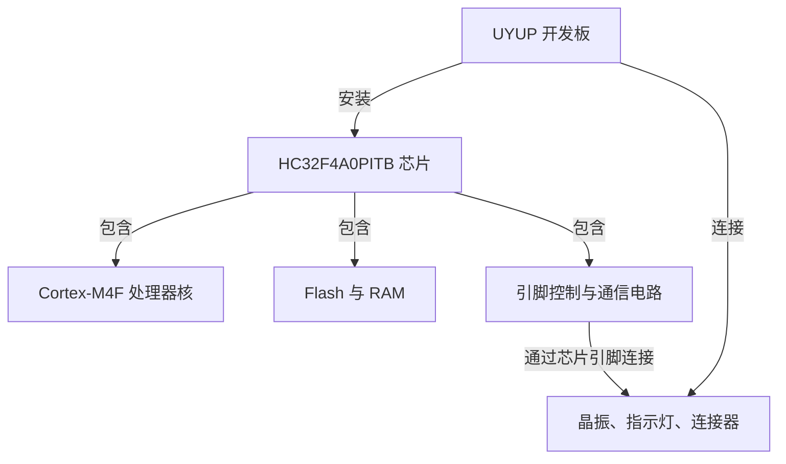

<!--
SPDX-FileCopyrightText: Copyright The zephyr_hc32f4a0 Contributors
SPDX-License-Identifier: Apache-2.0
-->

# 认识这个工程

打开工程时，你会看到数万个文件，但最先要完成的动作很小：让开发板启动，输出一行文字，并持续改变指示灯的状态。
这些行为能够把程序、芯片和开发板连起来。本篇以这个现场为起点，说明工程为什么包含这么多代码、各部分怎样配合，以及准备修改一个功能时应该先找哪里。

阅读只需要知道 C 程序由函数组成。这里的 **Zephyr** 是一个嵌入式操作系统项目的名称，**HC32F4A0PITB** 是目标芯片的 **型号（Part Number）**，不是需要展开的英文缩写；本仓库把两者接起来。
读完后，你应能解释“完整工程”包含什么，并把应用功能、芯片适配和板卡连接分到正确的位置。

## 1. 我们最终要交付什么

**固件（Firmware）** 是供特定硬件执行的程序及其必要数据。电脑上的源文件是给人和开发工具阅读的；开发工具把它们转换、组合成目标芯片能执行的固件文件，再由下载工具写入芯片。
本项目的目标，是形成一套可以独立获取源码、在本地生成固件、持续增加功能并记录验证结果的工程。

当前选择的最小应用放在目录 `samples/bringup/`。这里的 **bringup** 是工程命名，表示让一个新硬件平台逐步具备可观察的基本运行能力。
应用的 `main` 函数是程序入口函数：先准备指示灯，输出启动文字，再循环翻转灯的状态、输出心跳文字，并等待下一轮。
“心跳”是周期性输出，用于观察程序是否还在继续执行，不是芯片自带的专用功能。

观察这个应用时，要同时问两个问题：程序打算做什么，硬件是否真的完成了它。
源文件中的一条打印语句说明了意图；电脑上实际收到对应文字，才说明某次运行中的输出链路成立。
如果指示灯初始化失败，当前应用会记录错误并继续输出心跳，所以看见心跳仍需单独核对灯的表现。
可以在[应用源文件](../samples/bringup/src/main.c)中查看入口函数、灯就绪判断及循环中的三个动作，确认这个区别。

这四篇介绍依据本仓库的 Zephyr **4.4.99** 源码快照和当前移植代码编写。
这是被固定下来的版本标记；网上文档与后续版本的目录或接口可能不同，准确来源以[源码基线](source-baseline.md)为准。

## 2. 处理器核、芯片和开发板各负责什么

先把硬件名字放回各自的位置。**微控制器（Microcontroller Unit，MCU）** 是把执行程序的处理器、存储和若干外部连接功能放在一起的芯片。
目标型号 HC32F4A0PITB 就是一颗微控制器；厂商系列名 HC32F4A0 表示它所属的芯片系列。

芯片内部的 **处理器核（Processor Core）** 负责执行指令。这里使用的 **Cortex-M4F** 是 Arm 处理器核的名称。
处理器核之外，芯片还集成存储、时钟控制和通信电路；这些电路的控制方式仍由具体芯片决定。
**开发板（Development Board）** 则把芯片与供电、晶振、指示灯、连接器等元件连接起来。本项目使用的 **UYUP-RPI-A-2.5** 是板卡名称。

**Flash 存储器（Flash Memory）** 能在断电后保留数据，通常用于保存固件；**随机存取存储器（Random Access Memory，RAM）** 用于程序运行中的临时数据，断电后不保留。
这款芯片有 2 MiB Flash 和 512 KiB 主 RAM。这里 KiB 表示 1024 字节，MiB 表示 1024 × 1024 字节；“源码工程大小”和“最后占用多少片内存储”是不同的数量。

下面的图只表示包含和连接关系，不表示启动顺序。本板通常所说的外部晶振使用 **石英晶体（Quartz Crystal）**，它与芯片内部振荡电路配合，建立稳定的时钟参考。

这也解释了为什么“Zephyr 支持这个处理器核”还不足以让本板直接工作。
两款芯片可以使用相同的处理器核，却把通信电路放在不同地址、使用不同的控制位；即便芯片相同，两块板也可能把指示灯接到不同引脚。
因此，处理器核相关代码可以复用，芯片控制和板上连接仍需分别适配。
当前型号与板卡的对应关系见[板卡声明](../boards/uyup/uyup_rpi_a/board.yml)，引脚和存储的核对依据见[硬件记录](hardware.md)。

## 3. Zephyr 怎样进入我们的程序

如果直接围绕芯片写一个循环，也能完成简单控制。随着程序需要同时等待通信、处理按键、定期采样，让所有功能都各自忙等会越来越难组织。
**操作系统（Operating System）** 为应用提供管理执行和资源的公共机制；其中 **内核（Kernel）** 是负责组织执行、等待和时间等基础工作的部分。
Zephyr 面向资源受限的嵌入式系统，它既提供内核，也提供设备控制、配置和构建所需的公共框架。

应用通过约定的函数接口请求这些服务。**设备驱动（Device Driver）** 是把通用设备操作转换成具体硬件控制的软件。
例如，应用请求改变某个输出引脚的状态，Zephyr 的公共接口接到请求后，通过本芯片的驱动去操作相应电路。
接口让应用少依赖硬件细节，驱动则承担具体硬件差异。

在当前工程中，应用、用到的 Zephyr 部分和芯片驱动一起生成一个固件镜像。
这里 **镜像（Image）** 指按目标装载布局组织好的程序数据；开发时修改应用通常也会重新生成这个镜像。
并不是先在芯片上安装一个独立 Zephyr，再像电脑桌面应用那样把本示例复制进去运行。

Zephyr 的功能还可以按需求选择，因此仓库里有完整代码，并不意味着每个固件都带上全部功能。
增加一个功能时，要考虑它的代码、运行数据和硬件依赖；源码目录很大，最终的小应用仍只使用其中一部分。
官方概览中的 “Highly configurable / Modular for flexibility” 和 “Memory Protection” 说明了可配置和组合镜像的设计；
可对照[当前快照的概览源码](../doc/introduction/index.rst)或[官方概览页面](https://docs.zephyrproject.org/latest/introduction/index.html)，后者会随上游更新。

## 4. 本仓库为什么能够独立构建

**Git** 是保存源文件版本和改动历史的工具，**仓库（Repository）** 是它管理的一组文件及相应记录。
我们的仓库名称是 `zephyr_hc32f4a0`，源码根目录中直接包含 Zephyr，以及构建本目标需要的模块。
获取本仓库后，程序的源码依赖来自本仓库内部。

有两个模块名称需要先认识。**通用微控制器软件接口标准（Common Microcontroller Software Interface Standard，CMSIS）** 提供 Arm 微控制器常用的软件接口；目录名 `cmsis_6` 表示本项目内置的对应模块。
**硬件抽象层（Hardware Abstraction Layer，HAL）** 是厂商提供的硬件访问代码层；本工程使用华大的模块，通过它完成一部分底层寄存器操作。
寄存器是软件可访问的硬件控制或状态位置，向规定位置写入规定值，会改变对应电路的工作状态。
这些模块是固件源码的一部分，它们的用途与电脑上的编译工具不同。

**软件开发套件（Software Development Kit，SDK）** 是开发用的工具集合。本工程所用 SDK 提供把程序转换成目标指令的编译工具，以及相关辅助工具。
Python 是运行工程脚本所用的语言与解释器；这些主机工具需要安装在电脑上，不随源码仓库一起保存。
所以“完整工程”的含义是具有完整的目标源码及构建入口，准备好规定的主机工具后可以构建；它不表示仓库里还装了一整套开发电脑环境。

上游源码以固定节点的文件快照导入，项目维护自己的 Git 历史。
**提交（Commit）** 是 Git 中一次被保存的版本记录；记录上游提交编号可以指明来源，而不必把上游历年的提交全部带进来。
文件快照、模块节点和许可证的范围见[源码基线](source-baseline.md)，机器可读的记录保存在[依赖节点文件](../dependencies.lock.json)。

## 5. 准备改功能时，先找哪一层

先从你希望改变的可观察行为开始定位。改变“隔多久输出一次心跳”，属于应用策略；改变“灯接在哪个引脚”，属于板卡连接；改变“怎样使芯片输出一个字符”，通常会涉及驱动和芯片控制。
目录是这些职责的落点，不必从上到下通读所有文件。

| 你要回答的问题 | 先看哪里 | 在这里寻找什么 |
| --- | --- | --- |
| 示例准备执行什么动作？ | [应用目录](../samples/bringup) | 入口函数、循环与错误处理 |
| 本板连接了哪些器件？ | [板卡目录](../boards/uyup/uyup_rpi_a) | 板卡目标、连接描述和默认配置 |
| 芯片怎样获得工作时钟？ | [芯片适配目录](../soc/xhsc/hc32f4a0) | 启动钩子、时钟配置和存储布局接入 |
| 引脚和串口动作怎样执行？ | [引脚驱动](../drivers/gpio/gpio_hc32.c)、[串口驱动](../drivers/serial/uart_hc32.c) | 通用操作与本芯片硬件访问的对应关系 |
| 谁安排程序等待和恢复？ | [内核目录](../kernel) | 执行、调度和时间相关服务，下一篇会先解释这些概念 |
| 怎样生成和检查固件？ | [工程命令入口](../scripts/project.py) | 环境检查、构建、软件测试与镜像检查的分工 |

本目录 `project-docs/` 保存我们编写的介绍和记录，`doc/` 保存随 Zephyr 导入的上游文档源码。
日常操作先查[开发说明](development.md)，理解职责后再按表中的具体问题向下追踪代码。

## 6. 怎样判断已经做到了哪一步

截至 2026-09-09 的记录，基础适配已能生成目标芯片的固件，独立克隆后的构建也已通过。
首版使用板载 12 MHz 晶振直接提供系统时钟，尚未提高工作频率。现在的边界是“具备已检查的固件”，实板运行仍待验收。

判断进展时，可以沿着三层证据看：

1. **源码与配置检查**：型号、内存范围、引脚和构建依赖是否相互一致。这能发现错误的工程描述。
2. **构建与镜像检查**：程序能否转换、组合成目标固件，关键内容是否出现在规定位置。这能发现许多软件集成和布局错误。
3. **实际硬件观察**：上电后能否持续执行、收到正确文字、控制正确的灯。这才覆盖实物接线、晶振起振等实际条件。

即使第二层通过，晶振没有起振，程序也可能到不了输出文字的地方；即使有文字，灯的初始化仍可能失败。
因此，每条验证结论都要保留它检查过的对象和条件，软件模拟运行也只能证明其模拟范围内的行为。
本次介绍没有执行新的固件构建或硬件操作，具体结果与后续验收项持续以[移植状态](porting-status.md)为准。

现在你可以回答工程“由什么组成”。下一步需要解释：当应用说“等一会儿”时，处理器和其他工作究竟在做什么。
下一篇：[Zephyr 如何组织程序运行](P02_Zephyr如何组织程序运行.md)

[返回阅读目录](README.md)
