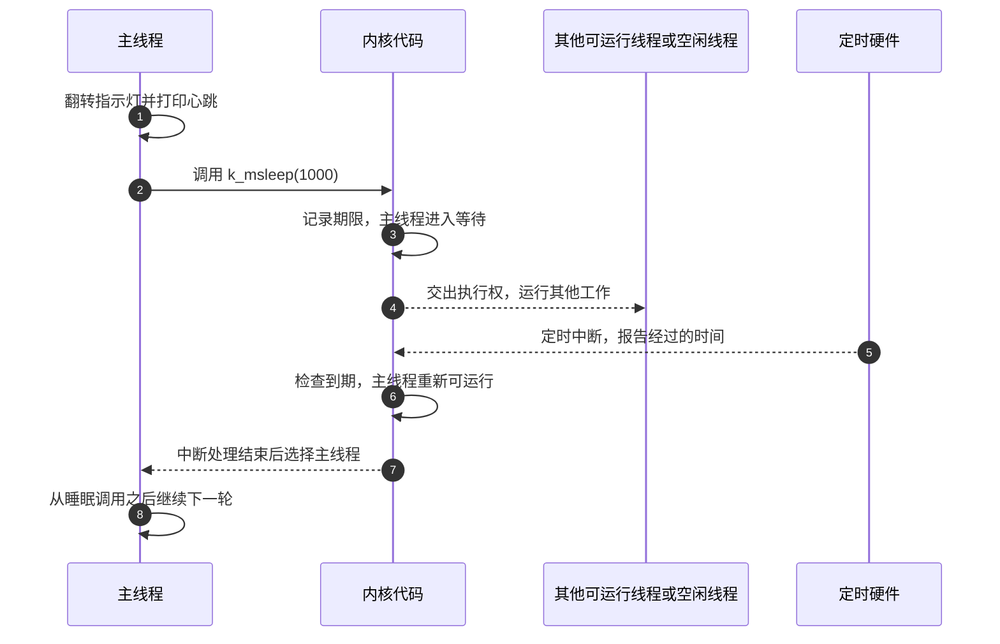

<!--
SPDX-FileCopyrightText: Copyright The zephyr_hc32f4a0 Contributors
SPDX-License-Identifier: Apache-2.0
-->

# Zephyr 如何组织程序运行

上一章已经区分了板上的硬件和控制硬件的程序。Zephyr 是本工程采用的操作系统项目名，
本章从一件小事继续：程序每次改变指示灯状态、打印一行文字，然后等一秒。
读完后，你应能解释这一秒内谁还可以工作，以及“等待结束”为什么不等于“立即执行”。
这里讨论运行过程；源码怎样变成可下载的程序，留给下一章。

## 1. 等待的一秒里，还要处理别的工作

本工程的启动示例在 [应用入口](../samples/bringup/src/main.c) 中：
入口函数 `main()` 先准备指示灯，随后循环翻转灯的状态、输出心跳文字、等待一秒。
**心跳（Heartbeat）** 是这里对周期性状态输出的称呼，用来表明程序仍在推进。
板上的指示灯使用 **发光二极管（Light-Emitting Diode，LED）**；
文字则通过串口，也就是按位依次传送数据的通信接口，送往电脑。

如果只需要闪灯，在循环里不断计数也能制造一段延迟。但假设以后还要检查按键，
按键检查又排在计数循环之后：在这段延迟中，检查代码没有执行，短促的按键变化就可能错过。
这叫 **忙等（Busy Waiting）**：程序继续执行指令，只是反复等待时间或条件满足。
它没有主动交出运行机会，等待越长，后续工作越晚开始。

也可以改写循环，让每轮分别检查各项工作是否到期；简单程序常用这种办法。
工作增多以后，需要有人统一保存各项工作的进度，安排谁现在能执行。
这正是本章要交给操作系统解决的问题。上述循环是现有代码事实，新增按键工作只是教学设想；
当前示例并未创建一个按键处理程序。

## 2. 用线程保存每项工作的执行进度

**实时操作系统（Real-Time Operating System，RTOS）** 是管理程序执行和资源的软件。
这里“实时”强调按工作对时间的要求组织执行，而不只是尽量快。
Zephyr 属于这类系统，其中负责管理执行进度、等待和运行顺序的核心软件称为
**内核（Kernel）**。应用向内核请求服务，内核也占用同一个处理器执行自己的代码。

内核管理的一个可独立继续执行的工作称为 **线程（Thread）**。
每个线程都有入口、保存函数调用和局部变量的存储空间，以及内核维护的状态记录。
执行暂时转给别的线程时，必要的执行现场会被保存，之后能从停下的位置继续。
两个普通 C 函数并不会因为分别写在两个文件里，就自动变成两个线程。

本工程的目标芯片只有一个处理器核，即一套实际执行指令的硬件。
因此多个线程轮流使用它；它们可以交错推进，同一时刻并不是多个线程一起执行指令。
内核自动建立 **主线程（Main Thread）**，并在初始化完成后调用应用的 `main()`。
示例虽然没有显式创建线程，循环仍是在主线程里运行。

本章依据仓库内 Zephyr 4.4.99 源码；版本见 [版本文件](../VERSION)。
官方 [Threads 文档](../doc/kernel/services/threads/index.rst) 的开头说明线程具有哪些执行资料，
[System Threads 文档](../doc/kernel/services/threads/system_threads.rst) 的 Main thread 条目
说明是谁调用应用入口。读这两处时，重点区分“函数代码”与“带有执行进度的线程”。

## 3. 睡眠交出运行机会，到期再参与选择

**可运行（Ready）** 表示线程当前没有等待条件阻止它执行；
**等待** 表示它还缺少某个条件，例如规定的时间尚未过去。
这两种情况由内核记录。正在执行的线程也是可运行线程中的一个，
所以“可运行”不等于“正在执行”。

从可运行线程中选择接下来执行谁的过程叫 **调度（Scheduling）**。
Zephyr 使用线程的 **优先级（Priority）** 表达选择顺序：具备调度条件时，
优先选择级别更高的可运行线程；数值更小表示级别更高。
某个线程尚在等待时，即使优先级很高，也不能靠优先级跳过等待条件。
线程能否被其他线程替换还受配置和当前执行状态约束，并非每条 C 语句之后都会切换。

示例调用的 `k_msleep()` 是让当前线程按毫秒数等待的函数名称，
**线程睡眠（Thread Sleeping）** 就是这里的等待方式。
调用 `k_msleep(1000)` 后，内核记录等待期限，把主线程从可运行集合中移出，再选择其他工作。
线程的进度还保留着，但不会靠反复执行空循环来数完这一秒。
没有别的工作可运行时，最低优先级的 **空闲线程（Idle Thread）** 接手；
是否让处理器进一步省电，取决于平台支持和配置，不能仅凭睡眠调用断定整块板已进入低功耗。

在本示例没有主动提前唤醒的正常路径上，规定时间过去后，主线程重新变为可运行。
它仍要等调度选择，才能从睡眠调用之后继续。如果此时有更高优先级的工作，主线程就可能晚些运行。
睡眠期间也只是给其他线程提供机会，并不保证每一个其他线程都一定获得了运行时间。

官方 [Scheduling 文档](../doc/kernel/services/scheduling/index.rst) 的 Scheduling Algorithm、
Thread Sleeping 和 Busy Waiting 三节分别说明选择规则、睡眠恢复条件及忙等区别。
源码可对照 [睡眠接口](../include/zephyr/sleep.h) 中的 `k_msleep()`，
再看 [睡眠处理代码](../kernel/sleep.c)：这里确实登记期限并切换执行，而不是循环计数。

## 4. 定时事件怎样让主线程重新可运行

主线程停止执行以后，计时仍要继续。芯片有专门计时的硬件，它能在需要处理时间变化时通知处理器。
这种让处理器暂时转去处理事件的机制称为 **中断（Interrupt）**；
响应事件执行的函数称为 **中断服务程序（Interrupt Service Routine，ISR）**。
它与普通线程使用同一个处理器，却有不同的调用规则。

本工程用名为 **SysTick** 的处理器内置定时器为内核提供计时。
发生定时中断后，相关代码更新经过的时间，检查登记的等待是否到期，
再由内核修改线程的等待状态。中断处理结束后，调度才有机会让相应线程继续。
中断服务程序不能调用 `k_msleep()` 来睡一秒；长时间处理通常应交回线程，
否则其他线程与部分中断响应都会被耽搁。

下面是按现有代码整理的正常时序。箭头表示调用、通知或执行权交接；
内核代码与线程共用一个处理器，各列不是几颗同时工作的处理器。
图中到期后假设主线程已经成为调度应选择的线程。

第 3 步改变的是主线程的资格，第 4 步才是执行权交接；第 6 步到第 7 步之间可能存在调度等待。
一个睡眠期间可能经历多次定时中断，图中只保留最终发现到期的一次，不能把图理解成固定每秒一次中断。
官方 [Interrupts 文档](../doc/kernel/services/interrupts.rst) 的开头与 Concepts 部分说明中断和线程的边界；
本工程的 [定时器驱动](../drivers/timer/cortex_m_systick.c) 将时间推进交给内核，
[调度代码](../kernel/sched.c) 的线程超时处理则使等待者重新具备运行条件。

## 5. 调用相似的函数，等待方式仍可能不同

程序还要把“翻转灯”“输出字符”变成具体硬件动作。
**应用程序接口（Application Programming Interface，API）** 是应用可以调用的一组约定，
规定参数和行为；负责把这些请求落实到特定硬件的软件称为 **设备驱动（Device Driver）**。
驱动属于软件实现，调用一个驱动函数不会自动产生新线程。

控制引脚高低电平的硬件能力叫 **通用输入输出（General-Purpose Input/Output，GPIO）**。
示例的 `gpio_pin_toggle_dt()` 是翻转指定引脚状态的接口函数。
本板蓝灯接在名为 PD10 的引脚，低电平点亮；实际接线见
[硬件记录](hardware.md#首次启动所需信号)。初始化成功以后，每次翻转会让亮灭状态互换。
若准备或翻转失败，示例会打印错误并停用后续灯操作，心跳循环仍继续。

`printk()` 是 Zephyr 输出格式化文字的函数名称；在当前工程配置下，它通过控制台逐字符调用串口驱动。
当前发送采用 **轮询（Polling）**，即软件反复读取硬件状态，确认发送位置可写，再写入一个字符。
这是忙等：发送调用尚未返回，主线程没有像睡眠那样主动退出可运行集合。
本地驱动还在这段检查和写入期间暂时屏蔽普通中断，避免发送操作相互打断，因此也会延后这些中断的响应。
不能把频繁打印理解成毫无时间成本的后台工作。

查看 [控制台实现](../drivers/console/uart_console.c) 的单字符输出，
再查看 [本地串口驱动](../drivers/serial/uart_hc32.c) 的发送循环，就能核对这条路径。
本地串口尚未实现中断收发，也没有让硬件自动批量搬运数据的发送路径；
[本地引脚驱动](../drivers/gpio/gpio_hc32.c) 目前也不提供引脚中断服务。
Zephyr 框架拥有某种接口，不意味着本芯片的驱动已经实现它。

## 6. 用这套过程判断修改的后果

回到示例：每轮先执行引脚操作和打印，再开始一秒睡眠，醒来后还可能等待调度。
因此两次心跳的间隔包含这些工作和等待，不能把它认作严格的一秒周期。
每轮翻转一次灯，通常约两轮才构成一次完整亮灭周期。
若以后加入更多打印，单轮处理时间会增加；若把睡眠换成空循环，也不会保留同样的主动让出行为。

RTOS 提供安排运行顺序的机制，但所有工作是否都能赶上各自的时间要求，
还取决于每项工作耗时、优先级、等待条件、中断占用和硬件速度。
有严格期限时，需要分析最坏情况并测量，安装一个操作系统本身不构成时间保证。
当前章节给出的是源码与接口支持的过程，实板心跳、亮灯和时间精度仍需实际运行验证，
现有证据边界见 [移植状态](porting-status.md#已执行验证)。

现在已经能区分“主线程在睡眠”“串口在忙等”和“中断正在处理事件”。
接下来还要解决：这些普通 C 调用如何选中本板的引脚与驱动，又如何与内核合成一个程序。
下一章沿源码到固件的过程回答这个问题。

上一篇：[认识这个工程](P01_认识这个工程.md)

下一篇：[从源码到固件](P03_从源码到固件.md)

[返回文档目录](README.md)
