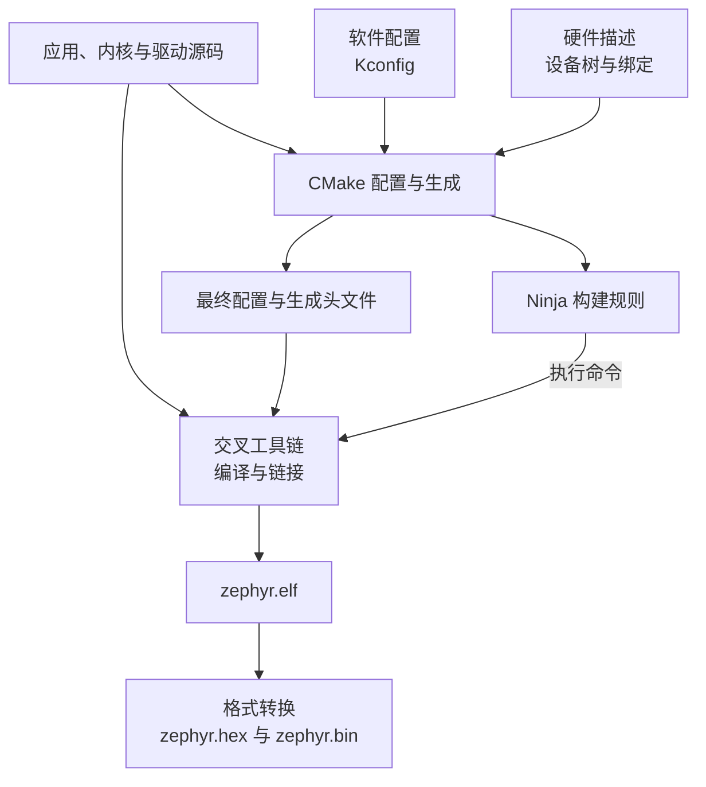

<!--
SPDX-FileCopyrightText: Copyright The zephyr_hc32f4a0 Contributors
SPDX-License-Identifier: Apache-2.0
-->

# 从源码到固件

上一章说明了心跳程序怎样借助 Zephyr 的线程与驱动运行。现在打开 `samples/bringup/src/main.c`，里面只有人能阅读的 C 语句：芯片怎样获得真正可执行的内容，又从哪里知道该使用哪一个串口？

本章沿着一次构建的信息流回答这两个问题。读完后，你应能区分软件选项与硬件描述，找到最终生效的配置，并判断一个错误发生在配置、编译、链接还是运行阶段。下面的查看命令只检查已有产物，不重新构建或访问开发板。

## 1. 为什么不能把 main.c 直接写入芯片

芯片执行的是机器指令，不认识 `printk` 这样的 C 函数名。**编译（Compilation）** 把源文件转换成目标处理器的机器指令，通常先得到目标文件；其中调用其他文件中函数的位置，还需要后续处理。**链接（Linking）** 把应用、内核、驱动等目标文件组合起来，解析这些引用，并按内存布局安排代码与数据的位置。

因此，仅有 `main.c` 不够：心跳代码调用的函数要有实现，芯片复位后最早执行的代码要加入，程序也必须被安排到这颗芯片实际拥有的存储空间。把一个地址算错，即使 C 语法完全正确，也可能生成无法启动的固件。

这些转换在电脑上进行，产物却供 HC32 的处理器执行。完成这种转换的一组编译器、链接器和格式转换工具叫 **交叉工具链（Cross Toolchain）**。“交叉”指构建工具运行的电脑与程序运行的目标平台不同；用电脑自己的编译器生成一个桌面程序，不能得到 HC32 固件。

**软件开发套件（Software Development Kit，SDK）** 是打包提供的开发工具集合。这里使用 Zephyr SDK 中面向目标处理器的工具链；它与仓库中的 Zephyr 源码是两类东西：工具负责转换源码，源码提供将来在芯片上运行的功能。[本地 SDK 文档](../doc/develop/toolchains/zephyr_sdk.rst)说明了套件内容；阅读开头时，留意哪些是运行在电脑上的工具。

## 2. 谁决定编译哪些文件

**CMake** 是构建配置工具的名称。它读取 `CMakeLists.txt`，结合目标板、配置选项和源码位置，生成具体的构建规则。**Ninja** 是执行这些规则的构建工具：按依赖顺序调用编译器等命令，并判断哪些步骤需要重新执行。两者都不会代替交叉编译器翻译 C 代码。

本工程日常入口是 `scripts/project.py` 的 `build` 子命令。它先直接调用 CMake，指定应用目录 `samples/bringup`、板目标 `uyup_rpi_a/hc32f4a0pitb` 和输出目录 `build/bringup`；再通过 `cmake --build` 调用已选定的 Ninja。应用的构建文件用 `target_sources(app PRIVATE src/main.c)` 把主程序加入名为 `app` 的应用构建目标。磁盘上有一个 `.c` 文件，并不表示它自动参与编译。

脚本把代表 Zephyr 源码位置的变量 `ZEPHYR_BASE` 固定为本仓库根目录；代表附加模块来源的 `ZEPHYR_MODULES` 固定为仓库内 `modules/hal/cmsis_6` 和 `modules/hal/xhsc` 两份基础支持源码。SDK、Python 等主机工具仍由外部环境提供。根目录的 `west.yml` 是保留的上游模块清单；west 是 Zephyr 的项目管理工具名称，本入口不依赖它发现外部工作区，也不从旁边的官方源码目录构建。

打开[工程脚本](../scripts/project.py)中的 `build_firmware`，再看[应用构建文件](../samples/bringup/CMakeLists.txt)：哪一处选择板卡，哪一处把 `main.c` 加入构建？[本地构建说明](../doc/build/cmake/index.rst)则解释了配置阶段与执行构建阶段的分工。

## 3. 软件选项与硬件描述怎样进入程序

**Kconfig** 是配置机制及其配置语言的名称，用来定义可选的软件能力、默认值和选项之间的依赖。应用的 `prj.conf` 提出配置要求，板卡也提供默认配置；构建系统结合这些要求和依赖，生成最终的 `build/bringup/zephyr/.config`。例如，`CONFIG_CONSOLE=y` 表示启用控制台支持，其中 `y` 是启用值。它不是在描述串口接在哪两个引脚上。

依赖不满足时，写在 `prj.conf` 中的要求不一定能生效。因此，检查结果应看 `.config`，需要持久修改时再回到输入文件。对应的生成头文件 `autoconf.h` 把配置变成 C 代码可以使用的宏，位置在 `build/bringup/zephyr/include/generated/zephyr/`。**生成头文件**就是工具根据输入产生的头文件，通常不直接手工维护。

**设备树（Devicetree）** 用树形节点描述硬件，例如存储器地址、串口寄存器位置和引脚连接。芯片的 `.dtsi` 描述可以被板卡的 `.dts` 引入，再由板卡补充实际连接。本板串口节点记录发送引脚 `PA9`、接收引脚 `PA10` 和速率 115200；这两个引脚标识分别表示 A 组的第 9、10 号引脚，不是芯片封装上的第 9、10 个物理脚。这些信息供现有驱动读取，并非另一份驱动实现。

构建生成的 `zephyr.dts` 展示合并后的硬件描述；同一生成头文件目录中的 `devicetree_generated.h` 把描述转换为宏。驱动通过 Zephyr 提供的设备树宏读取属性，不需要在运行时重新解析原始 `.dts` 文本。

两条信息流会交会：Kconfig 可以利用设备树信息决定驱动选项是否满足条件，驱动的 C 代码又需要软件配置与硬件属性共同参与编译。先看[配置合并规则](../doc/build/kconfig/setting.rst)，再比较[应用配置](../samples/bringup/prj.conf)与[板卡默认配置](../boards/uyup/uyup_rpi_a/uyup_rpi_a_hc32f4a0pitb_defconfig)：为什么应用只写了很少几个选项，最终 `.config` 却有很多项？

## 4. status 为 okay，为什么仍可能没有串口驱动

设备树中的 **绑定（Binding）** 是一份描述属性规则的文件。节点的 `compatible` 字符串标识它匹配的硬件类型，构建系统据此寻找绑定。绑定能够要求必须存在某个属性、检查属性类型或限定取值；它不能证明开发板真的按描述接线，也不能证明晶振已经起振。

下面节选[本板设备树](../boards/uyup/uyup_rpi_a/uyup_rpi_a_hc32f4a0pitb.dts)的现有配置，用于阅读，不要求修改。`&usart1` 表示补充名为 `usart1` 的已有节点；尖括号中的数值是属性值。

```dts
&usart1 {
	status = "okay";
	current-speed = <115200>;
};
```

`status = "okay"` 表示这个节点在描述中启用，允许相应的构建逻辑使用它。节点从芯片描述继承 `compatible = "xhsc,hc32-uart"`，板卡还提供发送、接收引脚属性；节选的两行不能替代完整节点。

这个字符串没有让构建系统凭空写出驱动。当前实现还需要四步配合：HC32 串口驱动选项 `CONFIG_UART_HC32` 满足依赖并启用；CMake 据此选中 `uart_hc32.c`；驱动代码为启用的节点建立设备实例；启动时执行初始化，配置实际硬件。如果只增加一个设备树节点却没有相应的 C 实现，描述再完整也不会自动获得通信能力。

证据可以顺着[串口绑定](../dts/bindings/serial/xhsc,hc32-uart.yaml)、[驱动选项](../drivers/serial/Kconfig.hc32)、[驱动构建规则](../drivers/serial/CMakeLists.txt)和[串口实现](../drivers/serial/uart_hc32.c)阅读：绑定检查哪些属性，选项依赖什么，哪个条件使源文件加入构建？最后仍要在板上验证实际通信；绑定检查通过只是其中一层证据。[上游绑定说明](../doc/build/dts/bindings-intro.rst)解释了属性校验和宏生成的边界。

## 5. 最后得到的三个文件各有什么用途

编译与链接完成后，本工程生成 **ELF（Executable and Linkable Format，可执行与可链接格式）** 文件 `zephyr.elf`。它带有程序内容、地址和符号等结构化信息，适合调试器使用，也便于检查内存布局。它包含的调试信息不必全部写入芯片，所以磁盘上的 ELF 文件大小不能直接当作固件占用的存储容量。

后处理还会生成 `zephyr.hex` 和 `zephyr.bin`。前者采用 **Intel HEX 格式**，以文本记录数据及其地址；后者是 **原始二进制（Raw Binary）** 数据，文件本身不提供同样的地址记录，使用它时必须另行确定写入起点。它们是同一构建的不同输出形式，不能仅凭扩展名判断是否适合当前芯片。

把已经认识的输入和产物放到一起，可以看到这条关系：



图中的源码箭头表示被选入本次构建的文件，整个仓库不会一次编译完。具体构建还包含多轮生成与链接步骤；这里保留的是理解输入和输出所需的主线。

## 6. 用已有产物核对理解

以下命令在本仓库根目录的 PowerShell 中执行，前提是开发环境已准备好，且 `build/bringup` 内已有 HC32 构建产物。`Select-String` 查找文件中的匹配行；后面的命令只读取文件或执行离线审计。若目录不存在，应先阅读[开发流程](development.md)，本章不要求为查看文档而重建固件。

先看最终配置，而不是只看输入文件：

```powershell
Select-String build/bringup/zephyr/.config -Pattern '^CONFIG_(BOARD_TARGET|UART_HC32|SYS_CLOCK_HW_CYCLES_PER_SEC)='
```

当前产物应显示目标 `uyup_rpi_a/hc32f4a0pitb`、串口驱动值 `y` 和系统时钟值 `12000000`。再看合并后的串口节点：

```powershell
Select-String build/bringup/zephyr/zephyr.dts -Pattern 'serial@4001cc00' -Context 0,12
```

应能找到 `xhsc,hc32-uart`、`status = "okay"` 和速率属性。生成结果可能把 115200 写成十六进制 `0x1c200`；表示方式变化不等于数值变化。节点名中的地址来自硬件描述，不是构建工具探测芯片后得到的结果。

**编译数据库（Compilation Database）** 是记录各源文件编译命令的文件；这里的文件名为 `compile_commands.json`。下面先读入文件，将它解析为记录，再挑出 HC32 串口驱动：

```powershell
Get-Content build/bringup/compile_commands.json -Raw | ConvertFrom-Json |
    Where-Object { $_.file -match 'uart_hc32\.c$' } |
    Select-Object file, command
```

能找到记录，说明生成的构建规则安排了这个源文件的编译；记录本身不能证明编译已经成功。最后加载已经准备好的 Python 环境，单独检查现有镜像：

```powershell
. ./scripts/Enter-Environment.ps1
python scripts/verify_hc32_image.py --build-dir build/bringup
```

环境脚本只为当前终端选定工具和路径；[镜像审计脚本](../scripts/verify_hc32_image.py)读取已有产物，检查目标、内存边界、启动入口及编译源码来源等。成功输出包含 `"status": "PASS"`，同时保留 `"hardware_tested": false`，明确没有执行实板测试。本章编写时复核了已有产物，未重新构建固件；旧产物通过审计也不表示后来编辑的源文件已经进入其中。

遇到错误时，先找失败阶段：属性缺失或配置依赖冲突，回到设备树与配置输入；C 语法或头文件错误，检查编译信息；函数引用无法解析或内存放不下，检查链接信息。若已经生成镜像却没有串口输出，则继续检查启动、时钟、引脚和驱动初始化。下一章会说明这些与 HC32 硬件相关的部分分别放在哪里。

上一篇：[Zephyr 如何组织程序运行](P02_Zephyr如何组织程序运行.md)

下一篇：[HC32 移植由哪些部分组成](P04_HC32移植由哪些部分组成.md)

[返回文档目录](README.md)
