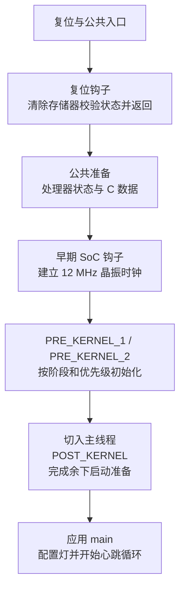

<!--
SPDX-FileCopyrightText: Copyright The Zephyr HC32F4A0 Contributors
SPDX-License-Identifier: Apache-2.0
-->

# HC32 移植由哪些部分组成

上一篇：[从源码到固件](P03_从源码到固件.md)

上一章已经把源码、配置和最终固件联系起来。现在看本工程的启动样例：它想每隔一秒输出一行文字，
同时翻转板上的灯。相同的 C 语句，为什么不能换一个芯片就直接运行？
**移植（Porting）** 就是补齐软件与具体硬件之间的适配，让已有程序在新目标上获得所需能力。
HC32 是华大芯片系列的名称；本章沿当前 HC32F4A0PITB 工程回答“谁负责哪一段”，
读完应能判断增加一个外设时应修改哪层，以及什么证据才足以验收。这里解释现有启动路径，
不把可构建的固件视为已经在实板运行。

## 1. 执行指令的核、完整芯片和板卡分别是什么

**处理器核（Processor Core）** 是执行机器指令的硬件。C 程序先被编译成它能执行的指令，
它再完成运算、访存和程序跳转。本芯片采用的 Cortex-M4F 是 Arm 定义的处理器核型号，
不是本开发板的名字；这个核还支持硬件浮点运算。

单有核，程序还缺少存放代码的空间，也没有向板外发送字符的电路。
**片上系统（System on Chip，SoC）** 把处理器核、存储器和其他功能电路集成到一个芯片中。
这里的 HC32F4A0PITB 是具体芯片型号。那些用于通信、计时、控制引脚的功能电路统称
**外设（Peripheral）**；程序通过读写 **寄存器（Register）**，即硬件提供的控制和状态存储位置，
让它们完成动作。

**板卡（Board）** 是承载芯片、供电、晶振、指示灯和连接器的实体电路板。
UYUP-RPI-A-2.5 是本板型号。芯片提供哪些外设，由芯片设计决定；其中哪根引脚接了蓝灯，
由板卡连接决定。因此，两款芯片即便采用相同处理器核，也可能拥有不同的外设寄存器；
同一芯片换一块板，灯和串口接线也可能改变。复用处理器核支持，只解决了这条适配链的一部分。

本地官方文档 [SoC Porting Guide](../doc/hardware/porting/soc_porting.rst) 的
“SoC Definitions”解释这些硬件层次；本板身份和接线依据保存在 [硬件记录](hardware.md)。

## 2. 应用怎样通过驱动使用芯片

Zephyr 是本工程使用的操作系统项目名称，当前源码基线版本为 4.4.99。
它的 **内核（Kernel）** 负责组织程序执行和系统资源，
而具体外设操作交给 **设备驱动（Device Driver）**：这是一层软件，把“设置引脚”“发送字符”
这样的请求转换成某类硬件能执行的步骤。

应用与驱动通过 **应用程序接口（Application Programming Interface，API）** 对接。
接口规定参数、返回值和动作含义；HC32 驱动负责兑现这些约定。例如，应用请求翻转一个输出，
驱动找到对应端口并修改其输出状态。驱动返回成功，只说明软件执行了相应操作，
不会自动证明板上那根线连接正确。

驱动还会调用 **硬件抽象层（Hardware Abstraction Layer，HAL）**，即把芯片寄存器操作封装成
函数的底层软件。本工程在仓库中保存了厂商库，文件路径中的 DDL 是这套库的命名。
它提供时钟、引脚和串口操作，但不会自动替本工程把某个外设注册成 Zephyr 可访问的设备，
也不会确定初始化顺序和错误约定。
所以“已经有厂商库”仍需要“把厂商能力接到 Zephyr 驱动接口”的工作。

配置还要说明操作的是哪一个硬件。**设备树（Devicetree）** 是描述硬件及连接关系的数据；
其中一个 **节点（Node）** 描述一个设备或相关对象。本工程把芯片共有资源放在 SoC 描述中，
把灯、串口接线及启用选择放在板级描述中。这类针对具体板卡的连接与启动配置，属于
**板级支持（Board Support）**。构建时，这些数据进入驱动的配置；
设备树自身不会在运行时发送字符，也不会因为添加了节点就生成尚未实现的驱动。

这段衔接可对照官方 [Device Driver Model](../doc/kernel/drivers/index.rst) 的
“Driver Data Structures”和“Subsystems and API Structures”：前者区分设备配置与运行状态，
后者说明统一接口如何调用具体驱动。厂商文件的选用与本地配置则由
[SoC 构建文件](../soc/xhsc/hc32f4a0/CMakeLists.txt) 明确指定。

## 3. 从复位入口走到应用之前，要准备什么

**复位（Reset）** 使处理器从规定的启动状态重新开始执行。
固件通常保存在掉电后仍保留内容的 **闪存（Flash Memory，简称 Flash）**；
变量和运行中的临时数据使用 **随机存取存储器（Random Access Memory，RAM）**。
启动不能直接跳到 C 的主函数：程序还需要可用的栈、正确的全局变量初值和可靠的系统时钟。

当前工程采用 Zephyr 的 Cortex-M 启动入口。**向量表（Vector Table）** 是存放异常处理入口等
启动信息的表，复位路径从中取得初始栈位置与复位入口。随后调用本工程的
**复位钩子**——钩子是框架预留、由芯片适配提供实现的调用点；函数名为 `soc_reset_hook`。
它清除片内存储器的校验状态，然后返回公共启动流程。接下来的公共准备包括把应清零的全局数据清零，
把带初值的数据复制到运行内存，并完成处理器相关准备。

进入内核启动流程后，**早期 SoC 钩子函数** `soc_early_init_hook` 先让芯片具备后续设备初始化所需的时钟。
本工程以内部时钟过渡，等待板载晶振稳定后，采用 **12 MHz 晶振直驱**。
代码中 XTAL 是晶振时钟源的命名；**锁相环（Phase-Locked Loop，PLL）** 是可用于时钟倍频的电路，
当前保持关闭。等待失败会进入停止正常启动的错误处理，不把内部时钟当作已稳定的晶振继续运行。

之后初始化也有先后层次。`PRE_KERNEL_1`、`PRE_KERNEL_2`、`POST_KERNEL` 是 Zephyr 定义的
**初始化阶段名**：前两阶段在正常线程运行前执行，后一阶段在内核基础能力可用后执行。
**线程（Thread）** 是内核跟踪并安排执行的一条程序执行流。当前 HC32 的引脚与串口驱动注册在
第一阶段；同阶段还按初始化优先级排序。系统切入主线程，再进行后续阶段的初始化和应用前准备，
最后调用样例的 `main` 函数。不能概括成“先初始化所有驱动，再启动内核”；
也不能假定每种驱动在早期阶段都能睡眠等待。

下图是当前配置的高层归纳，省略未影响本章判断的处理器设置与可选钩子；箭头表示启动先后，
不是每个框都与下个框直接发生一次函数调用。

还有一项属于镜像布局，而非图中的函数：ICG 是厂商源码对芯片初始配置数据的命名。
本工程为它保留固定位置，并在链接时检查位置和长度；它不能被普通代码挤占。
存储边界、ICG 位置及当前审计结果以 [移植状态](porting-status.md) 为准，不能只看程序总大小是否放得下。

顺序证据来自 [公共复位入口](../arch/arm/core/cortex_m/reset.S)、[公共 C 准备](../arch/arm/core/cortex_m/prep_c.c)、
[内核初始化](../kernel/init.c)、[复位钩子](../soc/xhsc/hc32f4a0/reset_hook.S)、
[芯片时钟初始化](../soc/xhsc/hc32f4a0/soc.c) 与 [ICG 链接规则](../soc/xhsc/hc32f4a0/icg.ld)。
前述官方 Device Driver Model 的“Initialization Levels”解释阶段限制。

## 4. 一次翻转灯的请求怎样走到引脚

**发光二极管（Light-Emitting Diode，LED）** 是板上的指示灯器件。
**通用输入输出（General-Purpose Input/Output，GPIO）** 是可读入或输出数字电平的引脚功能。
样例使用的 `led0` 是设备树别名：它是应用引用第一盏灯的名字，不是芯片引脚号。
板级描述把这个名字指向蓝灯，并记录它由哪个端口、哪根引脚控制，以及低电平有效。

样例先检查 GPIO 设备是否就绪，再将灯配置成输出且初始不点亮。
此处“无效”是灯的逻辑状态；公共接口根据低有效标志转换成对应的物理电平。
进入循环后，函数 `gpio_pin_toggle_dt` 根据这份设备树配置找到控制器与引脚，
调用 HC32 驱动的翻转操作；驱动再经厂商函数修改输出状态，板上的电路才可能改变亮灭。
如果配置或翻转返回错误，样例会输出错误信息并停止继续翻转该灯，保留文字心跳。

因此，灯不亮可以来自三种不同断点：应用没取得就绪设备、驱动没有正确改变输出、
或实际接线与描述不一致。只看到文字心跳，不能排除后两种问题。
这条路径可在 [样例](../samples/bringup/src/main.c)、
[板级设备树](../boards/uyup/uyup_rpi_a/uyup_rpi_a_hc32f4a0pitb.dts) 和
[GPIO 驱动](../drivers/gpio/gpio_hc32.c) 中逐段核对。

## 5. 一行心跳文字怎样走到串口

**串行通信（Serial Communication）** 按顺序传送数据位。
**通用同步异步收发器（Universal Synchronous/Asynchronous Receiver/Transmitter，USART）**
是支持这类通信的硬件外设；本工程选用 USART1，并工作在异步串口模式。
Zephyr 使用 **通用异步收发器（Universal Asynchronous Receiver/Transmitter，UART）** 接口
表达这种操作，所以驱动文件名含 UART，而芯片外设名仍为 USART1，二者并不矛盾。

驱动初始化时设置引脚功能、打开外设时钟，并配置收发参数。
应用调用的 `printk` 是 Zephyr 的文本输出函数；当前配置把字符交给串口控制台，
控制台再调用驱动发送。**轮询（Polling）** 表示软件反复查看硬件状态：当前发送实现等待
发送数据寄存器可写，再写入一个字符。随后 USART 把数据转换成引脚上的信号，经过板上连接到达接收端。
寄存器可写表示能接纳下一个字符，不等于接收端已经正确收到上一行文字。

这也说明为什么时钟必须先准备好：同样的串口分频设置配上错误时钟，字符的实际发送速度就会改变。
当前仅实现轮询收发和错误检查；硬件有更多能力，不代表驱动已经提供相应接口。
证据见 [串口驱动](../drivers/serial/uart_hc32.c) 与
[控制台输出](../drivers/console/uart_console.c)；接线及参数由本工程的硬件记录统一维护。

## 6. 增加下一项外设时，怎样划定修改和验收范围

先写清想增加的动作，例如“读取一个输入”或“连续接收数据”，再判断现有驱动是否已提供它。
**Kconfig** 是选择编译功能的配置系统名称，**CMake** 是组织构建的工具名称；它们与设备树一起决定
哪些描述和实现进入固件，不能彼此替代。可按下面的缺口划定修改范围：

| 发现的缺口 | 应检查或修改的位置 | 可以先取得的证据 |
| --- | --- | --- |
| 同一芯片，换了外设接线 | 板级设备树；驱动若限制了引脚组合，也需相应扩展 | 引脚确实引出、连接无冲突，生成描述与驱动接受范围一致 |
| 芯片资源尚未被描述 | SoC 设备树与设备属性规则 | 寄存器地址、时钟来源和芯片手册对应，构建正确读入属性 |
| 有厂商函数，但没有 Zephyr 操作 | 驱动、Kconfig 与 CMake 接入，按需选入 HAL 文件 | 初始化、正常与错误路径可编译，接口行为和限制明确 |
| 需要更高频率或改变存储布局 | SoC 启动与链接规则 | 时钟约束、存储边界和镜像检查同时成立，现有启动路径没有被破坏 |

若新增能力依赖 **中断（Interrupt）**，即硬件请求处理器暂时转去处理某个事件，还要补齐通知路径。
本芯片需要把外设事件路由到处理器的中断入口，再连接相应处理函数；只写一个处理函数不能证明它会被调用。
当前 GPIO 中断模式会返回不支持，因此把按键从轮询改成中断，已经超出单纯修改板级描述的范围。

验收分两步闭合：先用配置、编译结果和镜像检查证明正确实现进入了目标固件；
再用目标板上可观察的信号与行为确认硬件路径。例如，灯需要核对引脚电平和亮灭，
串口需要核对数据与实际传输时序。模拟环境通过，只证明被模拟的那条路径；
当前工程已经完成的构建检查和仍未执行的实板步骤，由移植状态文档分别记录。

继续工作时，用 [开发文档](development.md) 查工程入口，用 [硬件记录](hardware.md) 核对芯片和板卡约束，
用 [移植状态](porting-status.md) 决定下一项需要补上的证据。

返回：[工程文档入口](README.md)
