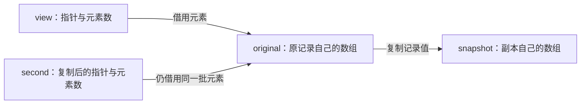
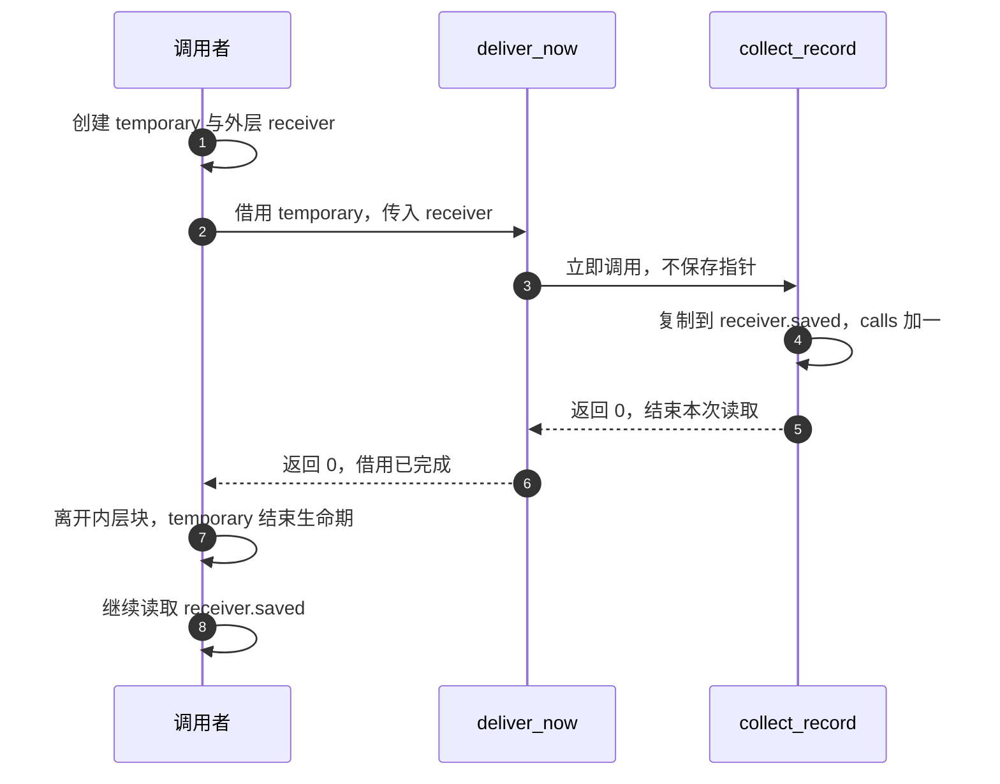

<!--
SPDX-FileCopyrightText: Copyright The zephyr_hc32f4a0 Contributors
SPDX-License-Identifier: Apache-2.0
-->

# 对象与生命期

你已经能写一个 C 函数：输入几个数，处理后返回结果。C 是编程语言名称。
现在把问题放进采集程序：采集方得到三个整数 `10、20、30`，接收方需要保存它们供稍后查看。
如果采集函数用完自己临时保存数据的空间，接收方手中的内容还可靠吗？
只知道“参数传的是地址”无法回答这个问题，因为地址本身和地址指向的数据可以属于不同对象。

本章从这三个数开始，解释 **对象（Object）**、**生命期（Lifetime）** 和数据交接。
对象是运行期间保存数据的一片存储；生命期是这片存储被保证留给该对象使用的时间范围。
我们先在一次普通函数调用中看清这些关系，再用能自动判定结果的小程序验证。
读完后，你应能给出“谁保存实际数据、谁只保存地址、何时最后一次访问、失败后哪些状态不变”的答案。
本章只讨论顺序执行，不预设读者已经掌握线程调度，也不以非法访问偶尔成功作为结论。

## 1. 先把数值、名字和存储分开

想象桌上有三格记录纸，不同函数可以读写这些格子。代码里的**值（Value）**是格子中的内容；
**标识符（Identifier）**是程序里为对象或其他实体起的名字；对象是实际保存内容的存储。
这个类比只用于区分三个问题，不能推出每个名字都对应一块独立物理内存。
编译器可以在不改变规定行为的条件下调整实现，例如把某个值一直保存在处理器内部。

下面是说明语法的现场片段，完整测试工程在第 8 节给出。
`uint16_t` 是标准头文件定义的精确 16 位无符号整数类型，能表示 0 到 65535；
`reading` 是本例为对象起的名字，初值是 10。
**指针（Pointer）** 是能表示某个对象或函数位置的值；`address` 是保存这种值的另一个对象。
声明中的星号表示它保存“指向该类型对象的指针”，表达式中的 `&` 取得对象地址，
表达式中的 `*` 沿有效指针访问所指对象，这个动作叫**解引用（Dereference）**。

```c
uint16_t reading = 10;
uint16_t *address = &reading;
*address = 20;
```

最后一行把 20 写入 `reading`，没有把 `address` 变成整数 20。
因为此时两个名字分别指向“数值存储”和“地址存储”，必须沿两层追踪才能判断写到了哪里。
把指针赋给另一个指针会复制指针值，不会替你另外创建一个装着 20 的采样对象。

**空指针（Null Pointer）** 是不指向任何对象或函数的指针值，代码通常用宏 `NULL` 表示。
宏是由预处理工具替换的名字；这里不依赖 `NULL` 的具体展开写法，也不假设其机器表示一定全为零。
空指针不能解引用；非空指针也不自动证明对象仍然存在、类型正确或访问范围有效。

官方对照是 C 标准化工作组公开的 [N1570 委员会草案](https://www.open-std.org/jtc1/sc22/wg14/www/docs/n1570.pdf)。
这是 2011-04-12 的 C11 草案，不是 Zephyr 专门规定；可在 6.3.2.3“Pointers”查空指针规则，
在 6.5.3.2“Address and indirection operators”查取地址和间接访问。
后文中的记录类型、三元素容量和错误策略都是本课程的教学设计。

## 2. 名字看不见以后，对象一定消失吗

你可能把“变量在函数里”理解成“函数结束变量消失”。这对很多局部对象有用，却没有区分两个坐标。
**作用域（Scope）**决定源程序的哪些位置可以使用一个名字；
**存储期（Storage Duration）**决定运行中存储能保留多久，进而约束对象生命期。
花括号包围的一组声明和语句叫**块（Block）**，它可以缩小名字的可见范围。

本章只在固定大小对象上建立两种常见存储期。
**自动存储期（Automatic Storage Duration）**的局部对象随所属块的执行而存在；
离开其生命期以后，不能继续经旧指针访问它。
**静态存储期（Static Storage Duration）**的对象覆盖程序的整个执行期。
这里“静态”描述存储期，不表示值不可修改，也不意味着多个人同时修改就安全。

完整实验里的函数 `persistent_cell` 是本课程命名的“取得持久单元”函数。
其中 `cell` 是局部静态对象名，关键字 `static` 放在这个局部声明上使它具有静态存储期。
函数返回 `&cell`，而函数外部不能直接写 `cell` 这个局部名字。

```c
static uint16_t *persistent_cell(void)
{
    static uint16_t cell;

    return &cell;
}
```

两次调用之间，`cell` 的存储仍然存在，所以第一次得到的有效指针还能访问同一个对象。
实验先经第一次取得的指针写入 41，再通过第二次得到的指针加一，观察到 42。
这个结果说明“名字只在函数内部可见”与“对象在函数返回后仍存在”可以同时成立。
函数定义前面的 `static` 是另一个位置的用法：限制该函数名字在源文件之间的链接可见性，
它没有给函数“延长生命期”。链接问题由后续编译链接专题展开。

这也解释了一个危险改法：如果把局部声明上的 `static` 去掉，仍然把局部对象地址交给调用者保存，
调用者随后就没有合法存活的目标可访问。
这种旧指针常被称作**悬垂指针（Dangling Pointer）**，即它所关联的对象已经结束生命期。
草案还规定这种指针值变为不确定值；不要把“没有解引用，只打印或比较一下”当作通用安全证明。
本实验不执行这种路径，也不打印它的偶然地址或值。

**未定义行为（Undefined Behavior，UB）** 是语言对该行为不再提出结果要求，
并非“肯定崩溃”或“只读到上一次值”。非法访问在某次编译下没有报错，不能成为程序契约。
以后改变优化、函数调用顺序或目标硬件，现象可能随之改变。
本节规则可对照 N1570 的 6.2.1“Scopes of identifiers”和 6.2.4“Storage durations of objects”。

除这两类外，语言还规定线程存储期和分配存储期。
前者把对象绑定到一条执行线程，后者由分配与释放协议管理；本实验没有申请这两类存储，
因此不需要提前引入它们的管理接口，也没有释放堆内存的清理步骤。

## 3. 一次传三个数，地址为什么还不够

单个值的关系已经清楚，现在回到三个采样值。
**数组（Array）**是固定元素类型、按顺序排列的一组对象；本例数组有三个有效位置。
**下标（Index）**是选择位置的整数，C 的第一个元素下标是 0，所以三个位置是 0、1、2。
读取下标 3 并不表示“再试试看有没有第四个值”。

**元素个数（Element Count）**和字节数必须分开。
`sizeof` 是计算类型或对象所占字节数的运算符，对本章固定大小数组不需要读取元素的值。
`size_t` 是保存这类大小结果的无符号整数类型；它适合表达元素数或字节数，但变量本身不记录单位。
在 `uint16_t values[3]` 这个数组声明处，`sizeof(values) / sizeof(values[0])` 得到元素数 3。
仅将这个数组传给接受指针的函数，函数不会自动得到 3；它需要另一个参数携带数量。

数组表达式在很多表达式环境会转换成首元素指针；使用 `sizeof` 直接观察数组时则保留数组身份。
因此，“数组就是指针”会预测错大小和复制行为。
完整实验不靠指针的大小推断可读长度，而定义课程自己的 `sample_view` 结构体类型，
把 `values` 指针字段与 `count` 元素数字段一起传递。
**结构体（Structure）**是把不同成员组合成一个对象的 C 类型构造方式；
字段只是成员名字，本例两个字段保存地址和数量。

描述符只能表达“调用者声称这里有多少个元素”。它既不能验证实际存储是否存在，
也不能证明调用者没有把长度谎报成 100。
本例规定创建描述符时必须让指针指向至少 `count` 个已初始化元素，并在读取结束前保持这些元素有效。
函数内部的长度检查，是在这个前提下防止索引越界。

下面是完整程序的读取函数现场。
`view_read` 是课程定义的函数名；参数 `view` 指向描述符，`index` 表示要读的位置，
`output` 指向调用者准备的结果对象。
`const` 是只读访问限定符；放在 `const struct sample_view *` 或 `const uint16_t *` 的所指类型上，
限制通过这个指针修改所指对象，不负责冻结原对象的其他可写访问路径。
`->` 经结构体指针选择成员，等价于先解引用，再用成员选择运算符 `.`。
返回类型 `int` 是 C 的整数类型；本函数用 0 表示成功、负数表示具体失败。
`EINVAL` 和 `ERANGE` 是本工程 C 库头文件提供的错误常量名，分别用于无效参数和超出范围；
前面的负号是接口返回约定，不是 C 语言强制所有函数这样设计。

```c
static int view_read(const struct sample_view *view, size_t index, uint16_t *output)
{
    if (view == NULL || view->values == NULL || output == NULL) {
        return -EINVAL;
    }
    if (index >= view->count) {
        return -ERANGE;
    }

    *output = view->values[index];
    return 0;
}
```

运算符 `||` 按从左到右短路求值，左侧已经为真时，不再求值右侧。
所以当 `view` 为空时，不会继续求值 `view->values`，空指针检查本身没有先做非法访问。

本例将输出对象初值设为 500，输入下标 3 时先返回范围错误，输出仍应为 500。
把输入恢复为 2 后读取成功，输出才变成 30。
这个反例检查的是错误分支在访问前执行，而不是故意越界以后期待某个崩溃现象。

允许形成数组末尾之后一位的指针用于边界表示，不代表那一位存在可读取的元素。
本例直接用整数长度比较，不需要构造这样的指针，更不会形成远远超过数组尾部的指针。
数组转换与边界依据分别在 N1570 的 6.3.2.1“Lvalues, arrays, and function designators”
及 6.5.6“Additive operators”；请围绕“转换后是否携带长度”和“是否允许解引用”核对。

## 4. 结构体复制后，哪些数据真正独立

接收方现在知道地址和元素数，却仍不知道接收之后是否可以长期保存。
先建立一个**拥有关系（Ownership）**：本文把“某段代码负责让存储一直有效，并决定其最后使用时间”
称为拥有该存储。这是设计职责，不是 C 编译器自动检查的一种新关键字。
**借用（Borrowing）**是暂时经指针访问别人拥有的存储，结束访问以后不继续依赖它。

完整实验用两个结构体给出不同存储关系。
`sample_record` 是课程记录类型，内嵌的 `values` 数组直接属于这个记录对象，
`count` 记录其中有效元素数；`RECORD_CAPACITY` 是本课程的容量宏，值为 3。
前节的 `sample_view` 则只有指针与数量，它不内嵌那些采样元素。

```c
struct sample_record {
    uint16_t values[RECORD_CAPACITY];
    size_t count;
};

struct sample_view {
    const uint16_t *values;
    size_t count;
};
```

结构体之间的赋值按结构体值进行。
复制一个 `sample_record` 会让另一个记录对象拥有自己的内嵌数组成员；
后来修改原记录第一个元素，不会让副本第一个元素跟着变。
复制一个 `sample_view` 则复制了指针值和数量，两个描述符仍然指向同一批原始元素。
不能仅凭“我已经复制了结构体”判断深层数据是否独立，必须看成员到底是数组还是指针。

下面的关系图只回答“数据存在哪里”，名字都是本章测试中的局部对象名。
`original` 是原记录，`snapshot` 是记录副本，`view` 和 `second` 是先后建立的两个借用描述符。



实验预测一：原记录从 `10、20、30` 改成 `99、20、30`，记录副本仍是原来的三个值。
实验预测二：只复制借用描述符，然后把原记录第二个元素改成 77，经描述符读取会得到 77。
这里所有读写顺序明确、原记录始终存活，所以第二项是定义良好的对照，而非数据竞争实验。
它揭示了“保存了描述符”和“保存了数据副本”是不同的工程承诺。

返回结构体值同样可以把内容交给调用者自己的对象。
课程函数 `make_record` 在内部构造局部记录并按值返回，调用者的 `received` 对象取得这个值，
不会因为局部记录结束生命期就变成悬垂指针。
不要把这个保证理解为“一定执行某条特定内存复制指令”；那属于编译器实现与优化观察。
结构体赋值及返回规则分别可在 N1570 的 6.5.16.1“Simple assignment”和 6.8.6.4“The return statement”核对。

比较两个结构体时，本实验逐项比较有效成员，不用整块内存字节比较代替值比较。
编译器可能在成员之间或结构体末尾放入**填充（Padding）**，即不属于成员值的布局空间；
相同成员值并不要求这些额外字节相同。这一点在后续把记录编码成通信报文时也必须重新考虑。

## 5. 函数指针不会替你延长数据的有效时间

接收方希望把“怎样处理记录”作为一个可选择动作交给采集方。
**函数指针（Function Pointer）**保存可调用函数的位置及其类型约束；
**回调（Callback）**则是调用关系：某方先提供函数，另一方在约定时机调用它。
回调不是自动异步，函数指针本身也不负责排队或切换执行者。

本例选择**同步（Synchronous）**执行：发起交接的函数返回之前，接收函数已经完成。
与之相对，**异步（Asynchronous）**交接可以在发起函数返回之后继续处理；
两者按“何时完成”区分，不能仅凭接口有回调参数就判断是哪一种。
我们只实现同步路径，使每个局部对象最后一次访问的位置可以直接从调用顺序证明。

本例的类型别名 `record_consumer_t` 由 `typedef` 声明；`typedef` 只给已有类型起另一个名字。
这里别名代表“接收记录指针和用户状态指针，返回整数结果”的函数指针类型。
`void *` 是可承载对象指针的通用指针类型；`context` 是调用者提供给接收函数的用户状态参数，
它必须确实指向该接收函数期待的对象类型，非空检查不能替代这种类型契约。

```c
typedef int (*record_consumer_t)(const struct sample_record *record, void *context);
```

课程函数 `deliver_now` 接受上述参数，检查必要条件后立即执行接收函数并返回它的结果。
它不保存任何参数，也不重试；失败结果交回调用者决定。
接收函数 `collect_record` 将记录值复制进 `collector` 类型的接收状态对象：
其中 `saved` 成员拥有完整记录，`calls` 成员统计这个测试中接收函数执行的次数。

下面的时间线补充前一幅存储关系图：它回答哪个返回事件结束借用。
`temporary` 是内层块中的临时记录，`receiver` 是外层块中的接收状态；
两者名字属于本课程，不是 Zephyr 内核接口。



第 4 步完成数据复制，第 6 步给调用者可直接观察的完成边界；
第 8 步依赖的是外层对象自己的数组，不依赖第 7 步已经失效的临时对象。
失败路径也有明确结束：课程接收函数 `reject_record` 将调用次数加一后返回错误 `-EIO`，
其中 `EIO` 是输入输出错误常量，本例借它模拟拒绝，没有对硬件做读写。
发起方原样收到失败结果，确认没有自动重试，也不把失败解释成记录已被保存。

如果日后把立即调用改成稍后再执行，现有证明会在第 6 步断开：发起函数返回不再等于借用结束。
那时必须重新选择“复制数据”“延长拥有者存活时间”或“完成后通知释放”等协议，
不能只改一个函数名就继续传入局部地址。具体机制留给消息队列、工作队列与线程专题。

## 6. 失败返回还应保护哪些状态

错误码只是判断入口，失败之后程序能否继续使用已有数据同样要由接口约定。
课程函数 `record_load` 把输入元素复制到一个记录，先检查空指针，再检查数量有没有超过三元素容量。
`ENOSPC` 是容量不足错误常量；本接口用 `-ENOSPC` 表示无法容纳输入。
输入指针即使配合零个元素也不能是空指针，这是本教学接口明确选择的约定，不可套用到所有库函数。

完整实现先在局部对象 `candidate` 中准备新记录，全部准备完成才赋值给目标。
所以长度为 4 时会返回容量错误，目标仍保持 `10、20、30`；随后改成只复制输入前三个元素，
目标才变成新值 `4、5、6`。
这条正常—失败—恢复路径验证了“失败不留下半条记录”这个保证。

在顺序执行条件下，先准备后发布让接口推理更简单，但额外局部记录也占用存储。
三个整数的实验成本很小；以后对象很大时，就需要在复制成本、容量预算和交接协议之间取舍。
这里的一次结构体赋值不保证对其他并发执行者不可分割，不能把“最终才赋值”叫作并发原子操作。

调用者还需区分两种失败：参数检查拒绝时接收函数一次也不会运行；
接收函数自己返回失败时，它确实已经执行过一次，可能已经改变自己的状态。
测试因此既检查返回错误，也检查调用计数，不从一个负数推断“什么都没有发生”。

## 7. 从本地源码核对实验实际依赖

现在才引入测试工具：**Zephyr** 是本仓库的嵌入式操作系统项目名称；
**ztest** 是它的自动化测试框架，**断言（Assertion）**用于把预期关系写成可判定条件。
**Twister** 是测试编排工具，选择目标、构建并启动程序，再解析测试报告；
它们分别负责“程序内判断”和“程序外组织”，不是同一种机制。

本实验的 `c_lifetime` 是课程自定的测试组名。
源码宏 `ZTEST` 登记单个测试，`ZTEST_SUITE` 登记测试组及准备、前后处理和拆除函数。
本组所有辅助参数均为空，表示没有附加处理函数；每个测试自行初始化所需对象，
不依赖其他用例先运行。本章静态单元用例也先写入确定初值，不把测试顺序作为输入。

源码宏 `zassert_equal` 检查两个值相等，`zassert_equal_ptr` 检查有效指针相等，
`zassert_ok` 检查返回值为 0。这里的失败是测试框架报告失败；
错误路径测试如果准确收到预期负数，断言应通过，整项测试仍是成功。

下面列的是本次核对的实际消费位置，属于当前源码证据，不替代前文的 C 规则。
Zephyr 导入基线为 4.4.99，对应节点 `f19d03c78ba70a670e3dadc2121523d33984a5c7`，
来源与模块版本由[依赖锁定文件](../../../dependencies.lock.json)记录。

| 输入或符号 | 实际作用与核对位置 |
| --- | --- |
| 应用文件 `CMakeLists.txt` | 交给构建规则生成工具 CMake；加载本仓库 Zephyr 包并把 `src/main.c` 加入应用目标，见[完整构建描述](../../../tests/learning/c_lifetime/CMakeLists.txt) |
| 应用文件 `prj.conf` | 交给 Kconfig 软件选项系统；选项 `CONFIG_ZTEST=y` 启用测试框架，`CONFIG_ZTEST_VERIFY_RUN_ALL=y` 检查测试被运行，定义在[ztest 选项](../../../subsys/testsuite/ztest/Kconfig) |
| 应用文件 `tests.yaml` | Twister 读取的测试描述；场景名 `learning.c_lifetime` 只选择模拟目标、ztest 解析器和 30 秒超时，见[完整描述](../../../tests/learning/c_lifetime/tests.yaml) |
| `ZTEST` / `ZTEST_SUITE` | [ztest_test.h](../../../subsys/testsuite/ztest/include/zephyr/ztest_test.h) 中的注册宏；测试体归属于同名测试组 |
| 三个断言宏 | [ztest_assert.h](../../../subsys/testsuite/ztest/include/zephyr/ztest_assert.h) 中的检查包装；记录相等关系或零返回值是否成立 |
| 课程全部函数和用例 | [main.c](../../../tests/learning/c_lifetime/src/main.c)；拥有关系、边界和错误策略由这些教学函数实现 |

本章没有设备树覆盖文件，也没有额外外设驱动配置。
**设备树（Devicetree）**是目标硬件及连接的描述数据，本实验复用所选模拟目标原有描述。
如果删除测试配置，不能继续期待同一测试入口和报告；如果更换平台，必须重新核对构建及运行条件。

## 8. 怎样执行并判断八项结果

先按[开发说明](../../development.md)准备本项目主机工具，并进入仓库根目录。
**机器模拟器（Machine Emulator）**是在主机上提供目标机器执行环境的软件；
本次使用的实现名称为 **QEMU**。目标名称 `mps2/an386` 指定本工程使用的 Arm 开发平台模拟配置。
这里运行的是为模拟目标编译的程序，所有输入是固定整数，无需接线，也不读取芯片采样外设。
主机命令 `python` 运行课程工具脚本，构建范围锁定当前仓库及已内置模块。
**HC32** 是本项目目标芯片系列的型号简称，不是语言缩写；本次模拟运行没有验证该芯片或实板。

```powershell
python scripts/learning/run.py test --app tests/learning/c_lifetime --variant normal
```

`scripts/learning/run.py` 是本仓库课程脚本路径；`test` 表示构建并运行，
`--app` 选完整实验目录，`--variant normal` 给这组输入与结果命名。
目标默认就是本节的模拟目标；只想生成程序而不运行时，显式使用构建子命令：

```powershell
python scripts/learning/run.py build --app tests/learning/c_lifetime --board mps2/an386 --variant build_only
```

`build` 只构建，`--board` 指定目标，它的成功不能替代前一条运行命令的证据。
测试结果索引位于被版本管理忽略的目录 `build/learning/tests/c_lifetime/mps2_an386/normal/`；
仅构建命令使用相邻的 `build_only/`，分别保留两种操作的最近记录入口。
其 `latest.json` 是本次记录入口，指向新建的 `build/learning/runs/<运行编号>/` 中的证据。
每次采用独立目录，旧结果不会冒充这次运行；短目录也避免 Windows 工具路径长度限制。
终端打印的 `Evidence` 路径指向本次结构化证据文件 `evidence.json`，`step-1.log`、`step-2.log` 记录编译器身份，`step-3.log` 记录测试编排输出，
`twister/` 保存运行报告和具体目标产物；只构建时对应产物在 `firmware/`。
不要把日志存在本身当成通过，必须同时核对退出码和测试条目。

测试名称均由本课程定义。下面是执行前的预测及各项能够推翻的错误模型；
实际成功与否只按后面的实测记录填写。

| 用例名称 | 固定操作和必须观察的结果 | 排除的错误模型 |
| --- | --- | --- |
| `test_return_value_survives_local_object` | 局部结构体按值返回后，接收对象仍含 10、20、30 | 返回局部构造的值也一定失效 |
| `test_structure_copy_owns_embedded_array` | 改原记录为 99 且数量为 1，副本仍是 10 且数量为 3 | 结构体内嵌数组总与原记录共享 |
| `test_pointer_copy_still_borrows_original` | 描述符复制后都看到原值改成 77；活着时撤销借用，再读取返回无效参数 | 复制描述符等于保存了数据副本 |
| `test_block_scope_static_object_persists` | 两次取得同一有效静态对象，先写 41 再加一得到 42 | 块外看不到名字就不存在对象 |
| `test_bounds_and_null_fail_before_access` | 下标 3 返回范围错误且输出保持 500，合法下标 2 恢复为 30 | 边界失败可以先访问再补报错 |
| `test_capacity_failure_preserves_destination` | 复制 4 个元素失败且旧记录不变，改为 3 个后得到 4、5、6 | 容量失败允许留下半条新数据 |
| `test_synchronous_callback_copies_before_return` | 接收次数为 1，临时记录退出后副本仍含 10 和 30 | 有回调就一定在返回以后执行 |
| `test_callback_error_propagates_without_retry` | 接收方拒绝只调用一次，空参数拒绝不调用，原记录未被改写 | 负数返回表示接收方一次都没执行 |

借用撤销是在原对象仍存活时把描述符指针置空、数量清零；它是本例由调用者主动执行的退出协议。
这并非 C 自动追踪生命期，也不能撤销程序中所有偷偷复制出去的地址。
测试的清理由嵌套块退出与测试函数返回完成，没有动态分配、后台任务或待执行回调。

### 8.1 实际执行记录

2026-09-10 已执行上述运行命令，得到一个测试组、八项实际运行用例。
以下是本实验自己的证据，不继承旧心跳示例的状态。
源码节点是版本管理工具 Git 中标识工程历史位置的编号；本次以节点
`d79a7bff3115163d79e4462ed7044cb26ed6bc04` 加当时尚未提交的课程源码运行。
完整证据同时记录这些新输入的内容校验值，不能单用这个节点号重建当时的实验。

| 记录项 | 当前证据 |
| --- | --- |
| 文档 | 已完成正文、C 规则和本地源码核对，连续阅读审阅通过 |
| 主机工具 | Python 3.12.10，Zephyr 开发工具包 1.0.1，编译器 14.3.0，CMake 4.4.3，Ninja 1.13.2，QEMU 10.0.2 |
| 构建 | `mps2/an386`，通过，退出码 0；没有额外配置覆盖 |
| 软件运行 | 1 个测试组通过，实际运行 8 项、通过 8 项、失败 0 项、跳过 0 项；过滤 0 个场景 |
| 硬件运行 | 未执行；未连接 HC32 板卡 |
| 完整原始证据 | 最终入口回归目录 `build/learning/runs/b213cfd19d/`，其中 `evidence.json`、`step-3.log`、`twister/twister.json` 与目标 `handler.log` 分别保存输入、执行和用例结果 |

**SHA-256** 是 Secure Hash Algorithm 256-bit，中文可称 256 位安全散列算法；
这里用它计算内容指纹，帮助核对读取的文件是否与本次一致，不用它代替测试结果。
完整清单保存在原始证据；以下保留主源码、生效配置、程序镜像和证据文件的完整校验值。
**ELF（Executable and Linkable Format）** 是可执行与可链接文件格式，本次程序文件名为 `zephyr.elf`；
`.config` 是已经求值的最终软件选项文件，不能只从输入配置推断所有生效选项。

```text
main.c       d7c518804f6863d8b781c5dbafe76036aa594a44ea6e7bff483ae6e9f998e6cf
.config      b99943639637054cfdbc25742deddf37c7bec72e8a2f9c7a001939a0df3bddc3
zephyr.elf   c2182668c0b0b3e7cc8e89eeafc623d8ddb8145fd25f45cc0988a027efacba68
evidence.json c9aad46a16755ef7c7212ccf9a6c8a336ff57c619fa5d82601efd1274f3813d9
```

生效配置确认测试框架及全用例运行检查已经开启，测试日志中的汇总为
`pass = 8, fail = 0, skip = 0, total = 8`。
实际应用编译命令选择 C17 语言模式；本章用到的对象、数组、结构体和指针基本规则以公开 C11 草案定位，
没有使用仅属于新语言版本的语法，也不把草案号等同于工程实际编译选项。
这里的汇总只表示本章列出的八项固定输入路径成立，没有进行覆盖率统计或硬件测量。
首轮旧输出布局曾因 Windows 路径过长在构建阶段失败，没有运行任何用例；
课程工具改用短路径和独立运行目录以后得到本表结果，不能把首轮失败算作语言反例。

### 8.2 遇到不同结果时怎样定位

如果没有生成场景，先核对工作目录和应用路径，再检查当前快照使用的文件名确实是 `tests.yaml`。
不要拿别的版本教程中的文件名直接覆盖此处已经核对的描述格式。
如果用例被过滤或只构建，报告中的零失败不足以验收；应确认运行目标、测试组和八项实际结果。

如果值复制测试失败，先看数据成员是否被改成了指针；如果借用测试没有观察到修改，
先看描述符是否误指向另一份记录。边界测试必须先确认错误返回，再确认输出哨值不变。
若回调测试次数大于 1，核对交接函数是否引入了隐式重试，以及测试是否被配置为重复执行。
这些定位动作读取源码和软件报告，不需要擦除芯片或修改时钟。

## 9. 用同一个模型回答新问题

迁移练习一：把记录容量从三个改为五个，保留“容量不足时目标不变”的规则。
先找出类型、输入数量、验证边界和预期内容需要一起改动的位置，再增加“恰好五个成功、六个失败”测试。
若只改数组声明而未改入口检查，程序行为是否符合新需求？请用边界输入回答。

迁移练习二：接收方只需要立即计算三个数的最大值，不需要保存原始数据。
判断能否在同步调用中直接借用数据、只保存最大值；画出最后一次访问点，
再比较与保存完整记录时的存储和复制成本。不要先引入异步机制扩大问题。

迁移练习三：把接收改成“先排队，函数返回后某时再处理”，但暂时不编写异步实现。
在第 5 节时间线上标出已经失去的完成保证，分别设计复制整条记录和延长拥有者存活两种方案，
回答成功、排队失败、取消三条路径各由谁完成最后一次访问。

现在能够从对象关系和结束事件判断一条顺序执行路径是否合法，并用固定输入验证自己设计的边界策略。
仍不能从本章测试推出线程之间没有竞争、设备会按期完成、所有输入都安全，或 HC32 实板外设已经可用。
下一步问题是“编译器把这些对象和操作放在哪里、怎样生成指令”，见[总专题蓝图](../专题蓝图.md)中的 T03。
返回[本专题入口](README.md)或[总学习路线](../README.md)。
