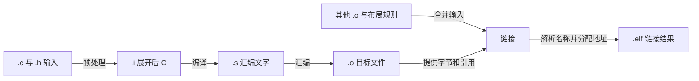

<!-- SPDX-FileCopyrightText: Copyright The zephyr_hc32f4a0 Contributors -->
<!-- SPDX-License-Identifier: Apache-2.0 -->

# 第1章\_从C到链接对象

你已经知道 C 语言里的对象保存数值，函数读取输入并返回结果，声明让一处代码知道另一处对象的类型。
现在把“采样值乘一个比例，再加校准偏移”拆成三个源文件：计算、校准数据、调用入口。
三个文件各自都能编译，故意少链接校准文件却会失败。这不是编译器前后矛盾，而是两个阶段回答不同的问题。

本章沿这一个现场说明：程序文字怎样变成指令；哪里还保留尚未解决的名字；什么时候才分配最终地址。
然后只改变比例宏和优化选项，从真实产物预测变化。最后用目标编译器保存的常量说明整数、字节顺序和对齐。
这里完成的是构建与检查闭环；函数并未在芯片或模拟器执行，接通电源后怎样走到入口留给启动专题。

## 1.1\_先看三个文件之间的约定

**源文件（Source File）** 是保存程序文字的文件，本实验以 `.c` 为文件后缀。
**头文件（Header File）** 是其他源文件共同包含的声明文本，本实验以 `.h` 为后缀。
它们都是输入材料，头文件存在不等于已经为其中的每个名称提供存储或函数实现。

计算函数名为 `scale_sample`，是实验自定的 C 函数标识符，接收一个无符号采样值。
`g_bias` 是实验自定的全局对象名，保存校准偏移，唯一有初值的定义位于校准文件。
`uint32_t` 是标准头文件提供的类型名：在本工具链中表示恰好 32 位的无符号整数。
下面是完整工程中[公共头文件](../../../samples/learning/compilation/object_probe/probe.h)的核心声明：

```c
#include <stdint.h>
extern uint32_t g_bias;
uint32_t scale_sample(uint32_t value);
```

这里 `extern` 是 C 的声明关键字：本行只声明这个对象，存储由别处的定义提供。
函数声明末尾只有分号，没有花括号包围的函数体，同样没有提供实现。
三个源文件都包含这份声明，使调用者和定义者按同样的参数与返回类型编译。
如果各文件私自写出不一致的声明，普通链接器未必能发现类型冲突，所以不能靠“链接成功”代替共享头文件。

完整输入的职责如下。表中的名字是本实验文件名，不是 Zephyr 的固定工程接口。

| 输入 | 本次职责 | 少了它会怎样 |
| --- | --- | --- |
| [probe.h](../../../samples/learning/compilation/object_probe/probe.h) | 声明跨文件约定，用包含保护避免同一轮重复展开 | 类型声明无法按计划共享 |
| [probe.c](../../../samples/learning/compilation/object_probe/probe.c) | 定义计算函数、局部辅助函数和布局证据常量 | 调用入口找不到计算函数 |
| [calibration.c](../../../samples/learning/compilation/object_probe/calibration.c) | 定义偏移对象并给出初值 5 | 计算函数对偏移对象的引用无法解析 |
| [entry.c](../../../samples/learning/compilation/object_probe/entry.c) | 传入 7，将结果写入可观察对象，然后停在循环 | 没有完整的调用链和指定入口 |
| [layout.ld](../../../samples/learning/compilation/object_probe/layout.ld) | 指定链接入口及教学地址布局 | 链接无法按本章的地址约定组织产物 |

`entry.c` 中的 `g_result` 是保存结果的全局对象名，未显式给出初值；`object_entry` 是本实验指定的函数入口名。
结果对象带有 C 类型限定词 `volatile`，要求实现按其规则保留访问，方便观察编译器生成的写入。
这不建立线程同步，也不提供硬件启动。这里没有动态分配、文件句柄或设备注册，因此没有资源释放步骤；
检查工具执行完即退出，目标入口的循环则只为构成引用链，不会被本实验运行。

## 1.2\_同一份程序为什么要经过四个阶段

**工具链（Toolchain）** 是一起处理程序的编译、汇编、链接及检查工具。
本章使用 **GNU 编译器集合（GNU Compiler Collection，GCC）**；GNU 是工具所属项目的专名。
命令 `arm-zephyr-eabi-gcc` 是其中面向 Arm 目标的编译器驱动程序，负责选择并调用后续工具。
Arm 是处理器架构体系的专名，本章只需知道它决定目标指令；这个工具在电脑上运行，却不生成电脑本机程序。

首先，**预处理（Preprocessing）** 处理包含文件、宏替换和条件选择，得到展开后的 C 输入。
其次，**编译（Compilation）** 在这里狭义指理解 C 的类型与表达式，并生成目标汇编文字。
**汇编（Assembly）** 把汇编指令编码为机器字节，产生目标文件。
最后，**链接（Linking）** 将多个目标文件组合起来，解析跨文件名称并按布局安排地址。
平时说“编译工程”常把四步一起包含，定位报错时必须恢复这个区别。

**目标文件（Object File）** 是中间产物，本实验后缀为 `.o`，包含字节、名称和需要以后修正的信息。
**可执行与可链接格式（Executable and Linkable Format，ELF）** 是保存这些结构的一种文件格式。
目标文件和最终链接文件都可采用 ELF；扩展名或格式相同不表示完成阶段相同，更不表示已经可以在板上启动。

本实验只维护下面一条产物流。方框中的后缀是命名约定，箭头是工具对文件内容的转换：



GCC 提供停止位置选项：`-E` 停在预处理，`-S` 停在汇编文字，`-c` 停在目标文件；`-o` 后面指定输出文件。
本章保存每种产物，避免只能从最终报错倒猜过程。
`-E -P` 中的 `-P` 去掉预处理输出的行号标记，方便比较；它没有改变宏的计算规则。
官方对照是 GCC 14.3 的 [3.2 Options Controlling the Kind of Output](https://gcc.gnu.org/onlinedocs/gcc-14.3.0/gcc/Overall-Options.html)，
阅读时核对三个停止选项各自省略了哪些后续阶段。

## 1.3\_宏改变的是编译输入

**宏（Macro）** 是预处理阶段的替换规则。这里的 `SCALE` 是实验自定的宏名，替换为比例常量。
计算文件先用 `#ifndef` 检查这个名字是否尚未定义，没有定义才用 `#define` 给出默认值 2。
构建命令的 `-D SCALE=3U` 提前定义它，于是文件中的默认分支不再生效。
`-D` 是定义宏的选项名，与后面的宏定义之间可以留空格；脚本采用等价的紧接写法，两者都不是英文缩写。
字面量后缀 `U` 表示无符号整数类型，减少本实验无意混入有符号运算的机会。

局部辅助函数名为 `multiply_sample`，只负责乘法；`static` 在此函数定义上限定名称只在当前文件的编译输入内可见。
它的关键语句与展开结果是：

```c
/* 原始语句：SCALE 是宏名，不占一个运行时存储对象。 */
return value * SCALE;
/* 默认实验经预处理后等价于下面的文字。 */
return value * 2U;
```

因此改宏后必须重新预处理和编译，已经存在的目标文件不会在运行中“重新读宏”。
反过来，运行时改偏移对象的值不需要改宏定义，因为它本来就是一个需要从存储读取的对象。
两者都能影响结果，却处于不同的变化时间边界：构建输入与目标运行状态。

宏看起来像函数时尤其容易误判。以下是用于手工展开的裁剪反例，不会加入实际构建输入。
`BAD_DOUBLE` 和 `SAFE_DOUBLE` 都是此处自定的示范宏名，参数 `x` 被文字替换：

```c
#define BAD_DOUBLE(x) x * 2
#define SAFE_DOUBLE(x) ((x) * 2)
/* BAD_DOUBLE(1 + 2) 展开成 1 + 2 * 2，结果为 5，而不是 6。 */
/* SAFE_DOUBLE(1 + 2) 展开成 ((1 + 2) * 2)，保持所需分组。 */
```

括号解决了分组，却不能自动解决重复求值。一个宏如果把参数放两次，传入带副作用的表达式就可能执行两次。
副作用指求值同时改变状态，例如自增或读一次就清除标志的设备访问。
不要把存在未定义行为的自增组合拿来反复运行，期待得到某种“稳定规律”；可以先存入局部对象，再传其值，
也可以使用有类型约束的普通函数。这些是代码审查准则，本章实际变体只替换无副作用常量。
官方对照为预处理器手册的 [Operator Precedence Problems](https://gcc.gnu.org/onlinedocs/cpp/Operator-Precedence-Problems.html)
与 [Duplication of Side Effects](https://gcc.gnu.org/onlinedocs/cpp/Duplication-of-Side-Effects.html)：分别核对分组和求值次数。

## 1.4\_目标文件留下了哪些待解决的问题

**翻译单元（Translation Unit）** 是一个源文件及其包含内容完成预处理后，交给编译器的一整份输入。
三个源文件会形成三个翻译单元，共同包含同一个头文件并不把它们合并成一个翻译单元。
编译计算文件时，声明足以检查“按何种类型读取偏移”，却不要求此时已经知道偏移最终放在哪里。

**符号（Symbol）** 是工具给函数、对象等实体保存的名称与属性记录。
**符号表（Symbol Table）** 记录这些名称是否在本文件中定义、属于哪个区域、大小和位置。
检查工具 `nm` 是 GNU 二进制工具集里的命令名，负责显示这张表；不要从它的拼写杜撰接口全称。
本实验的 `nm -S` 同时显示大小，字母 `U` 表示尚未定义，`T` 表示代码区的全局符号，`t` 表示局部代码符号。

编译计算文件后，可以找到全局计算函数和局部乘法函数，也能看到 `U g_bias`。
这不是“目标文件坏了”：它准确记录尚待链接解决的要求。
**重定位（Relocation）** 是“在指定位置按规定方式填入最终地址或偏移”的修正记录。
目标文件中的某些暂存字节需要链接器消费这份记录，最终才能引用另一个对象。

**反汇编（Disassembly）** 是把已经编码的机器字节重新显示成指令文字。
命令 `objdump -dr` 来自同一二进制工具集，`-d` 显示指令，`-r` 同时显示重定位记录。
这里出现的 `R_ARM_ABS32` 是 Arm 目标的重定位类型名，当前例子要求将对象地址填入一个 32 位位置。
在链接前看到该位置为 0，不代表目标程序一定要读取地址 0；应先看它旁边是否带有待处理的记录。

如果没有同时看符号表与重定位，读者容易形成两个相反误判：“编译通过所以定义齐全”，或者“有未定义名字所以编译失败”。
正确的判断范围是：单个翻译单元能生成自洽的中间产物，跨文件引用是否齐全由本次最终链接再检查。
声明和定义错误也可能更早被编译器发现，不能把所有名字相关报错都归为链接问题。

## 1.5\_链接怎样把名字变为地址

**节（Section）** 是目标文件中按用途组织的一组内容，工程里也常称“段”。
本章说代码段、数据段时指这种链接输入或输出节；ELF 另有供加载使用的程序段，不能只凭同一个汉字混同两者。
计算函数位于代码节；有初值的偏移位于数据节；未给非零初值的结果对象只需记录预留空间。

链接脚本是链接器读取的布局文本，本例文件名为 `layout.ld`。
其中 `SECTIONS` 是链接器语法关键字，用于组织输出节；`ENTRY` 指定文件头里的入口符号。
它不生成复位向量、不设置栈、不执行数据复制，也不让板卡自动跳到这个函数。
`.` 是脚本中的当前位置计数器，改变它会改变后续节的地址。
官方 [SECTIONS Command](https://sourceware.org/binutils/docs/ld/SECTIONS.html) 对照这些输入节、输出节和地址的关系。

| 本实验输出节 | 保存什么 | 本次观察意义 |
| --- | --- | --- |
| `.text` | 函数指令 | 位于教学起点 `0x1000`，可对照链接后符号地址 |
| `.rodata` | 一般只读常量，如有 | 与可写数据分开组织；不能仅靠 `const` 推断具体硬件位置 |
| `.probe_metadata` | 专门保存的布局证据常量 | 提取真实目标字节，避免使用主机类型布局推测目标 |
| `.data` | 初值为 5 的校准对象 | 从教学地址 `0x20000000` 开始 |
| `.bss` | 结果对象需要的存储空间 | `NOLOAD` 为本链接脚本的非加载布局属性，不提供程序运行时清零代码 |

`.bss` 是工具约定的零初始化存储区域名；它通常不需要在文件内保存等量的零字节，但运行环境必须兑现 C 的初始化要求。
本例没有该运行环境，所以只能证明最终文件保留了空间，不能宣称目标内存已经清零。
两个教学地址也不是本板存储配置；HC32 是本项目使用的华大芯片系列专名，不是可展开的英文缩写。
完整板级镜像还必须遵守[唯一硬件记录](../../hardware.md)和启动要求。

现在按三个阶段解释受控失败。先分别编译三个文件，都应退出 0。
再只把计算与入口目标文件交给链接器，偏移符号没有提供者，链接器应非零退出并指出未定义引用。
最后加入同一轮编译得到的校准目标文件，不修改源码即可恢复。
这就是本实验的恢复操作：补齐构建输入，而不是添加一个毫无依据的函数或压掉诊断。

`-nostdlib` 是 GCC 链接选项，表示本例不自动加入标准启动文件与库。
因此实验代码避免依赖打印、分配等库函数；它既不会误借主机库，也没有伪装成完整操作系统应用。
本次未使用链接垃圾回收，所以没有被引用的布局证据仍保留；真实 Zephyr 构建是否保留某个节还受链接规则影响。

## 1.6\_优化让源码与指令不再逐行对应

**优化（Optimization）** 是在语言规则允许的前提下改变实现方式，例如合并计算或取消不必要的函数调用。
本例以选项 `-O0` 为观察基线，以 `-O2` 启用另一组优化；两者使用完全相同的源文件和比例宏。
`-O0` 并不保证所有源码行都原样对应一条机器指令，`-O2` 也不承诺对每个程序都更小、更快。
GCC 14.3 的 [3.11 Options That Control Optimization](https://gcc.gnu.org/onlinedocs/gcc-14.3.0/gcc/Optimize-Options.html)
说明优化组及依赖条件；本章的字节数是下述编译器和选项的实验观察，不是规范固定值。

**内联（Inlining）** 是把被调用函数的计算直接整合到调用位置，使这处调用不必再跳转到独立函数。
基线目标文件保留局部乘法函数；优化后局部符号消失，计算直接出现在全局计算函数中。
源码没有删掉函数定义，名字消失也不等于乘法功能消失，观察点应继续跟到调用者的实际指令。

理解下面的真实摘录只需几个名字。`r0`、`r3` 是 Arm 通用寄存器的名称，寄存器是处理器内部暂存数值的位置；
本次函数的参数和返回值使用 `r0`。指令 `ldr` 从存储取值，`add` 做加法，`lsl #1` 将参与运算的值左移一位，
在这个无符号例子中实现乘 2；`bx lr` 按返回地址寄存器 `lr` 的值离开函数。
以下两段只摘录算术核心，完整载入、返回及修正记录保存在各变体的反汇编日志。

```text
比例 2、O2：add.w r0, r3, r0, lsl #1
比例 3、O2：add.w r0, r0, r0, lsl #1
             add   r0, r3
```

第一段合并“偏移 + 参数乘 2”，第二段先算“参数 + 参数乘 2”，再加偏移。
这里没有出现乘法指令仍然能够实现源程序的乘法语义。
本次两个优化函数的符号范围都是 16 字节，里面可能包含对齐填充和地址常量，不能等价为执行了同样数量的指令。
更不能仅凭字节数换算耗时；存储等待、分支、流水执行及具体处理器状态还没有测量。

优化还依赖语言定义。越界、悬空指针、有符号溢出等不受语言保证的行为，不能靠“关闭优化能跑”修复。
`volatile` 不会让这些行为重新合法，也不会强制所有普通计算按源文件顺序执行。
对照反汇编的目的，是理解编译器如何兑现一个有效程序，不是用某次指令结果为无效 C 程序补规范。

## 1.7\_先明确数值，再解释字节与地址

整数类型不仅决定位数，也决定数值范围和转换规则。
**无符号整数（Unsigned Integer）** 表示非负范围；**有符号整数（Signed Integer）** 还表示负数。
本实验的 32 位无符号类型范围为 0 至 `2^32-1`，8 位无符号类型 `uint8_t` 范围为 0 至 255。
表达式中的整数提升和通常算术转换会先决定计算类型，目标对象的类型则可能再引发一次转换。

因此 `(uint32_t)-1` 得到 `4294967295`，`(uint8_t)256U` 得到 0；本例将这两个常量保存到证据数组。
这是转为无符号目标类型时的取模结果，不是“所有溢出都安全”。
超出有符号目标类型范围的转换在本章采用的 C11 规则下具有实现定义边界；有符号算术本身越界则是另一个问题。
GCC 14.3 的 [4.5 Integers](https://gcc.gnu.org/onlinedocs/gcc-14.3.0/gcc/Integers-implementation.html)
记录本实现对补码和超范围有符号转换的选择，不能把这一实现选择推广为所有 C 实现的共同保证。

一个常见反例是用无符号长度和负数错误码直接比较。
负数可能在比较前转为很大的无符号值，检查结果就与“负数总是更小”的直觉相反。
应先判定错误码有效，再在已证明范围内转换；不要通过随处添加强制转换隐藏接口类型设计问题。
本实验实际验证两个常量转换，没有执行比较反例，也没有制造有符号溢出。

**字节序（Byte Order）** 指多字节数值按地址递增顺序如何存放各部分。
**小端序（Little Endian）** 把低有效字节放在低地址；因此本次 32 位常量 `0x11223344` 提取为 `44 33 22 11`。
数值没有“倒过来”，改变的是它的存储表示；文件中的十六进制显示和程序读出的整数不能混为同一层。
检查工具 `readelf` 是读取 ELF 结构的命令，文件头报告当前产物为 Arm 小端格式，与实际提取的字节相互印证。

**对齐（Alignment）** 是对象地址应满足的边界约束，例如地址可被 4 整除。
**填充（Padding）** 是实现为了满足布局要求在成员之间或末尾保留的字节。
本例结构名 `sample_record` 是自定的 C 结构类型名：字段 `tag` 存 1 字节标记，字段 `count` 存 4 字节计数。
实现没有把两个字段紧密放成 5 字节，而是在标记后插入空隙，让计数从偏移 4 开始，结构整体占 8 字节。

这里 **应用二进制接口（Application Binary Interface，ABI）** 是同一目标的代码、数据布局和调用约定，
让不同文件生成的代码能够配合；它不是运行时可调用的函数。
GCC 的 [4.9 Structures, Unions, Enumerations, and Bit-Fields](https://gcc.gnu.org/onlinedocs/gcc-14.3.0/gcc/Structures-unions-enumerations-and-bit-fields-implementation.html)
将普通成员对齐的细节交给目标 ABI，本章用当前编译器的实际结果确认这些数值。

布局查询用 C 的 `sizeof` 运算符取得大小，`_Alignof` 取得对齐要求，标准宏 `offsetof` 取得成员偏移。
编译期断言 `_Static_assert` 检查本实验依赖的位数和偏移，不满足时立即拒绝构建，避免后面的说明悄悄失效。
证据数组 `layout_manifest` 是自定的全局只读对象，依次保存标记值、结构大小、对齐、成员偏移、两项转换结果。
GCC 扩展 `__attribute__((section(...)))` 只为它指定输入节名，供链接脚本归集并让工具单独提取。

不能因为目标支持某些未对齐访问，就把任意字节缓冲强转成结构指针读取；语言对齐和对象访问规则仍然存在。
也不能把结构体整块发送给外部设备，默认填充、字节序和字段表示都与对方约定一致。
处理外部格式时应按约定逐字段编码、按字节解码；确需紧凑布局时要一并核对访问约束和性能代价。
本章证明的是目标编译器生成的布局，未测量某个地址上的未对齐访问、异常行为或总线周期。

## 1.8\_运行四个变体并保存失败证据

**软件开发工具包（Software Development Kit，SDK）** 是本项目使用的交叉工具集合。
本次已验证 Zephyr SDK 1.0.1 内的 GCC 14.3.0，Python 3.12.10 负责调用工具和检查文件；
Python 是主机脚本语言的专名。实验目标参数选择 Arm Cortex-M4 指令核，Cortex-M4 是处理器核型号，
不是 HC32 开发板名；本章未启用浮点运算，因此选择软件浮点调用约定，不验证浮点硬件。

在本仓库根目录运行。Windows PowerShell 是下面命令使用的主机命令解释器；
已有工程环境按[开发说明](../../development.md)准备，新机器按自己的实际安装位置配置 SDK，不能复制别人盘符。
`Enter-Environment.ps1` 是仓库环境脚本的文件名，选择本地 Python 和 SDK 后在当前终端生效。

```powershell
. ./scripts/Enter-Environment.ps1
python scripts/learning/inspect_objects.py
```

其他主机同样可以运行第二条命令，前提是 Python 可用，且环境变量 `ZEPHYR_SDK_INSTALL_DIR` 已指向 SDK。
脚本也接受 `--sdk` 参数显式指定安装目录；该参数是本次新增检查入口的参数，不是现有固件构建命令的选项。
脚本只在指定 SDK 中查找 `arm-zephyr-eabi` 工具，不回退到电脑本机的 `gcc`，也不读取旁边的官方 Zephyr 源码树。

执行入口 [inspect_objects.py](../../../scripts/learning/inspect_objects.py)按固定顺序运行四个变体，
比例取 2 或 3，每种分别使用两档优化。它首先核对工具的目标身份，再完成预处理、汇编文字输出、三个对象编译、
缺失校准对象的失败链接、补齐后的成功链接和产物检查。单个子命令有 60 秒超时，任一非预期失败会使整体非零退出。

关键编译选项也应读懂：`-mcpu=cortex-m4` 选择目标核，`-mthumb` 选择本核使用的指令编码状态，
`-mfloat-abi=soft` 选择软件浮点调用约定，`-std=c11` 固定 C11 语言规则。
`-ffreestanding` 声明独立运行环境，不假设完整宿主服务；`-fno-builtin` 禁用一般内建函数替换，
并不自动补齐标准库。`-ffunction-sections` 与 `-fdata-sections` 为函数和数据建立更细的输入节，便于观察归集。
`-Wall -Wextra -Werror` 打开所选诊断并将警告作为错误，帮助保持小实验的输入清楚。
禁用展开表的选项避免引入本章无关的异常展开依赖；确切参数全部保存在原始命令记录中。

检查工具 `objcopy` 负责提取 `.probe_metadata` 字节，不改变源文件；脚本按目标的小端顺序解读六个 32 位值。
原始文件保存在 `build/learning/compilation/arm-cortex-m4/<变体名>/`，该路径中的角括号是阅读占位，不要原样输入。
每个变体都有展开文本、汇编、目标文件、最终 ELF、符号表、反汇编、布局和链接日志。
顶层 `commands.json` 是按顺序记录参数、退出码和日志位置的数据文件；`report.json` 保存本轮状态与最终汇总。
两者使用 **JavaScript 对象表示法（JavaScript Object Notation，JSON）** 作为数据格式，不要求运行 JavaScript 程序。

先看 `report.json` 的 `status` 字段，它是脚本定义的本轮状态标记。输出目录准备完成后，
脚本在检查 SDK 参数和工具位置之前先写入 `RUNNING`（进行中），并把 `commands.json` 重置为空列表。
随后即使缺少 SDK 参数、找不到工具或无法启动命令，也会写入 `FAIL`（失败）与错误原因，脚本整体返回 1。
只有四个变体和所有产物检查都完成，才写入 `PASS`（通过）。旧产物可能仍在目录中，其存在不能替代本轮状态。

每条工具命令的正常输出和错误输出直接写入对应日志文件，命令记录在结束或失败时写回 `commands.json`。
**进程树（Process Tree）** 是本轮工具进程及其继续启动的子进程组成的关系；
例如编译器驱动程序还可能启动汇编器或链接器，只结束最外层命令未必停止全部工作。
单个子命令超过 60 秒时，入口尝试清理本轮进程树，并在该命令记录中写入 `exit_code=124`、`timed_out=true`。
确认清理完成后记录 `process_tree_stopped=true`；清理失败则用 `cleanup_error` 保存原因，不宣称清理已经完成。
这些都是命令记录的字段，不是额外命令行选项；超时后脚本整体返回 1，汇总状态为 `FAIL`。
即使命令原本用于制造缺定义反例，超时也不能算作预期链接失败。出现清理错误时，先确认残留工具已经停止，再重新运行。

先打开基线的预处理文本，再看优化变体的反汇编，最后对照失败日志。
下面 `Get-Content` 是 PowerShell 的文件读取命令，`Select-String` 是文本查找命令，`-Context` 保留匹配行周围内容。
这些观察命令读取已生成的文件，不重新编译，也不连接开发板：

```powershell
Select-String build/learning/compilation/arm-cortex-m4/scale2-O0/probe.i -Pattern 'value \*' -Context 1,1
Get-Content build/learning/compilation/arm-cortex-m4/scale2-O2/probe-disassembly.txt
Get-Content build/learning/compilation/arm-cortex-m4/scale2-O0/missing-link.log
Get-Content build/learning/compilation/arm-cortex-m4/scale2-O0/linked-symbols.txt
```

依次应该看到乘数 2、移位加法形式的计算、指向偏移对象的未定义引用，以及恢复链接后的确定地址。
单看最后一个文件会遗漏失败过程；单看失败日志又不能证明恢复成功，二者应来自同一轮命令记录。

完整命令中会包含本机工具的绝对位置，因此原始记录留在忽略目录，公共正文只记录可移植命令与必要摘要。
重新执行会覆盖固定目录中的报告、命令记录、日志和同名变体产物，不会递归删除其他目录。
入口没有并发锁，两个同时运行的实例可能互相覆盖这些文件，因此必须等上一轮结束后再顺序重跑。
需要保留旧结果时，在重跑前自行把完整实验输出复制到另一个被忽略的记录目录，保留报告、命令、日志与产物的对应关系。

## 1.9\_本次实际观察和允许得出的结论

核对日期 **2026-09-10**。构建时本项目基线提交为 `d79a7bff3115163d79e4462ed7044cb26ed6bc04`，
当时本章与对应实验为该节点之后的新增工作树内容；每个实际源码和脚本的完整 SHA-256 校验值保存在当次汇总记录中。
**安全散列算法 256 位（Secure Hash Algorithm 256-bit，SHA-256）** 在这里用于标识字节内容，
不把校验值当成来源可信或实验正确的证明。上游 Zephyr 基线是 `f19d03c78ba70a670e3dadc2121523d33984a5c7`，
本例未编译内核，因此没有生效内核配置、设备树或驱动依赖。

实际调用以上检查脚本，整体退出 **0**。共执行 **54** 条工具子命令，其中 **4** 条故意缺失定义的链接命令退出 **1**，
其余 **50** 条退出 **0**；四个恢复链接后的 ELF 均无未解析符号，文件头均为 Arm 小端格式。
这四次失败是预先指定的反例，脚本逐次核对错误中确实出现偏移对象的未定义引用，不能把任意工具故障都计为成功反例。

| 变体 | 计算函数符号范围 | 局部乘法函数符号 | 预处理变化 | 最终链接 |
| --- | --- | --- | --- | --- |
| `scale2-O0` | 36 字节 | 保留 | 比例常量 2 | 缺定义失败，补齐后通过 |
| `scale2-O2` | 16 字节 | 消失 | 与同宏基线一致 | 缺定义失败，补齐后通过 |
| `scale3-O0` | 36 字节 | 保留 | 比例常量 3 | 缺定义失败，补齐后通过 |
| `scale3-O2` | 16 字节 | 消失 | 与同宏基线一致 | 缺定义失败，补齐后通过 |

四个变体提取出的证据值均为 `[0x11223344, 8, 4, 4, 0xffffffff, 0]`。
默认变体链接后，偏移对象地址为 `0x20000000`、结果对象地址为 `0x20000004`，分别显示为已初始化数据符号和零初始化区符号。
默认变体最终 ELF 的 SHA-256 为 `816aef3e07bdd59e3134f34c238f771790f6b3de27d2a66037709e594acbb1cf`。
其他三个 ELF 校验值、每份源文件校验值、全部命令参数与完整诊断可在本次本机汇总中对照；重新构建应记录自己的结果。

| 状态栏 | 本次范围 |
| --- | --- |
| 文档 | 已完成正文、链接核对与阅读审计 |
| 构建 | 通过；四组 Arm Cortex-M4 对象及教学链接产物，包含失败和恢复 |
| 软件运行 | 目标程序未执行；主机检查脚本执行通过，不等同于目标函数已运行 |
| 硬件运行 | 不适用；没有连接探针、刷写芯片或执行 HC32 固件 |

若新的编译器版本改变了函数大小或内联选择，脚本可能拒绝当前观察模型。这时先检查版本与反汇编，
区分优化实现变化和输入选错，再更新证据与判据；不要只把预期数字改到测试变绿。
若编译前即找不到工具，检查 SDK 路径；若失败链接没有指向偏移对象，查看该命令日志的第一处因果错误；
若恢复链接仍有未定义名称，检查是否遗漏另一对象，不能用忽略未解析符号的选项掩盖问题。

**2026-09-11 工具修复后的复核：** 本次补齐准备失败时覆盖旧结论、命令直接写文件日志以及超时进程树清理。
[入口回归测试](../../../tests/tooling/test_learning_objects.py)实际执行 7 项，全部通过，
覆盖缺 SDK、缺 SDK 工具、命令无法启动、实验中途失败、预期链接错误匹配、超时终止工具及其子进程、清理失败记录。
其中清理失败通过模拟清理函数报错来检查，超时终止检查实际启动并核对主机进程；两种证据分别回答记录是否正确和进程是否已停止。

随后用修复后的入口重新运行全部四个编译变体：`report.json` 为 `PASS`，54 条工具子命令中 4 条为受控链接失败，
其余 50 条成功；四个变体的符号大小、布局值和最终 ELF 校验值与上方 2026-09-10 记录一致。
本次报告仍记录项目起点 `d79a7bff3115163d79e4462ed7044cb26ed6bc04`，修复属于运行当时的工作树修改；
两次实验的原始记录已分别存入本机忽略目录，不能把同名输出目录中的新报告当作旧报告。
本次 `software_executed=false` 与 `hardware_tested=false` 明确表示目标软件没有执行、硬件没有测试；
7 项主机回归和交叉编译复核没有增加目标函数运行或实板验收结论。

## 1.10\_带着同一模型做一次迁移练习

练习不要求修改受控源码。先复制整个小实验到自己的学习分支，预测将偏移对象定义前加 `static` 会发生什么。
因为公共头文件仍声明外部可见对象，定义文件应先出现声明链接属性冲突，而不是等到最终链接才失败。
如果同时删除那个文件对公共头的包含，可能绕过这项编译诊断，却会在最终链接留下原来的外部引用。
这能检验你是否真正分清“类型与可见性检查”和“跨文件解析”的发生时间。

再预测把结构的字段顺序调换是否必然减小整体大小，先画出每个字段的偏移与末尾填充，再修改编译期断言验证。
不要在没有调整解释和证据数组之前继续沿用旧的 8、4、4 三项验收值；它们对应的是本章原始布局。
这些迁移练习尚未自动执行，不能与上表的四个已执行变体混算通过数量。

现在已经能从输入文本追到每一阶段产物，解释少一个定义为何失败，以及宏和优化为何形成两种不同的变化。
仍不能仅凭教学 ELF 证明复位、栈、初始化或驱动可用；下一步应分别学习开发环境复现、真实构建生成和启动布局。
课程中的 T05、T08、T12 分别继续追踪这些问题，具体已落地章节从[总阅读路线](../README.md)进入。

[返回本专题入口](README.md) · [实验记录约定](../实验规范.md)
